# 3D Graphics & Scene Management

<cite>
**Referenced Files in This Document**
- [gesture-cosmos-hub.html](file://src/science/gesture-cosmos-hub.html)
- [main.js](file://src/science/gesture-cosmos/main.js)
- [scene-host.js](file://src/science/gesture-cosmos/core/scene-host.js)
- [camera-rig.js](file://src/science/gesture-cosmos/core/camera-rig.js)
- [hand-engine.js](file://src/science/gesture-cosmos/core/hand-engine.js)
- [gesture-router.js](file://src/science/gesture-cosmos/core/gesture-router.js)
- [gesture-control.js](file://src/science/gesture-cosmos/core/gesture-control.js)
- [scene-solar-system.js](file://src/science/gesture-cosmos/scenes/scene-solar-system.js)
- [scene-shape-motion.js](file://src/science/gesture-cosmos/scenes/scene-shape-motion.js)
- [scene-galaxy-spiral.js](file://src/science/gesture-cosmos/scenes/scene-galaxy-spiral.js)
- [scene-neon-planets.js](file://src/science/gesture-cosmos/scenes/scene-neon-planets.js)
</cite>

## Table of Contents
1. [Introduction](#introduction)
2. [Project Structure](#project-structure)
3. [Core Components](#core-components)
4. [Architecture Overview](#architecture-overview)
5. [Detailed Component Analysis](#detailed-component-analysis)
6. [Dependency Analysis](#dependency-analysis)
7. [Performance Considerations](#performance-considerations)
8. [Troubleshooting Guide](#troubleshooting-guide)
9. [Conclusion](#conclusion)
10. [Appendices](#appendices)

## Introduction
This document explains the Three.js-based 3D graphics pipeline and scene management system used by the Gesture Cosmos hub. It focuses on:
- SceneHost architecture for loading, managing, and switching between multiple 3D scenes
- CameraRig system for smooth camera controls via OrbitControls
- Gesture-driven object control (scale and rotation) with fist-triggered effects
- Scene lifecycle management, resource loading strategies, and memory optimization techniques
- Practical examples for creating new scenes, integrating gestures, and optimizing rendering
- Cross-browser compatibility, mobile limitations, and debugging techniques
- Guidelines for adding visual effects and interactive elements

## Project Structure
The Gesture Cosmos hub is a single-page application that:
- Initializes shared Three.js objects (renderer, scene, camera)
- Instantiates core modules (HandEngine, GestureRouter, CameraRig, SceneHost)
- Dynamically loads scene modules on demand
- Wires navigation UI to switch scenes
- Runs a render loop that processes gestures, updates camera rig, and drives scene update/dispose cycles

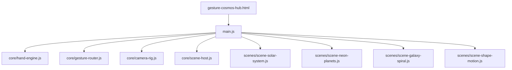

**Diagram sources**
- [gesture-cosmos-hub.html:230-238](file://src/science/gesture-cosmos-hub.html#L230-L238)
- [main.js:8-64](file://src/science/gesture-cosmos/main.js#L8-L64)
- [scene-host.js:11-25](file://src/science/gesture-cosmos/core/scene-host.js#L11-L25)
- [camera-rig.js:10-24](file://src/science/gesture-cosmos/core/camera-rig.js#L10-L24)
- [hand-engine.js:5-15](file://src/science/gesture-cosmos/core/hand-engine.js#L5-L15)
- [gesture-router.js:22-32](file://src/science/gesture-cosmos/core/gesture-router.js#L22-L32)
- [scene-solar-system.js:8-18](file://src/science/gesture-cosmos/scenes/scene-solar-system.js#L8-L18)
- [scene-neon-planets.js:8-36](file://src/science/gesture-cosmos/scenes/scene-neon-planets.js#L8-L36)
- [scene-galaxy-spiral.js:4-83](file://src/science/gesture-cosmos/scenes/scene-galaxy-spiral.js#L4-L83)
- [scene-shape-motion.js:4-23](file://src/science/gesture-cosmos/scenes/scene-shape-motion.js#L4-L23)

**Section sources**
- [gesture-cosmos-hub.html:230-238](file://src/science/gesture-cosmos-hub.html#L230-L238)
- [main.js:8-64](file://src/science/gesture-cosmos/main.js#L8-L64)

## Core Components
- SceneHost: Manages registration, initialization, update, and disposal of scene modules. Provides a consistent context to each scene.
- CameraRig: Wraps OrbitControls for mouse/touch orbit and zoom; provides focus and overview helpers.
- HandEngine: MediaPipe Hands wrapper that initializes and runs hand detection, exposing last results.
- GestureRouter: Translates raw landmarks into unified commands (hand depth, rotateY, fist state).
- gesture-control: Shared utilities to apply scale and rotation to a root Object3D based on gesture commands.
- Scenes: Each scene exports name, init(ctx), update(dt, cmd), dispose(), and optionally manages its own UI and resources.

Key responsibilities:
- main.js orchestrates lifecycle and render loop
- SceneHost isolates scene code from global state
- CameraRig decouples camera interaction from gesture logic
- GestureRouter abstracts MediaPipe specifics
- gesture-control centralizes common gesture-to-transform behavior

**Section sources**
- [scene-host.js:11-62](file://src/science/gesture-cosmos/core/scene-host.js#L11-L62)
- [camera-rig.js:10-60](file://src/science/gesture-cosmos/core/camera-rig.js#L10-L60)
- [hand-engine.js:5-82](file://src/science/gesture-cosmos/core/hand-engine.js#L5-L82)
- [gesture-router.js:22-110](file://src/science/gesture-cosmos/core/gesture-router.js#L22-L110)
- [gesture-control.js:24-87](file://src/science/gesture-cosmos/core/gesture-control.js#L24-L87)
- [main.js:47-64](file://src/science/gesture-cosmos/main.js#L47-L64)

## Architecture Overview
The runtime flow connects user input (mouse/touch and optional hand tracking) to scene content through a clear separation of concerns.

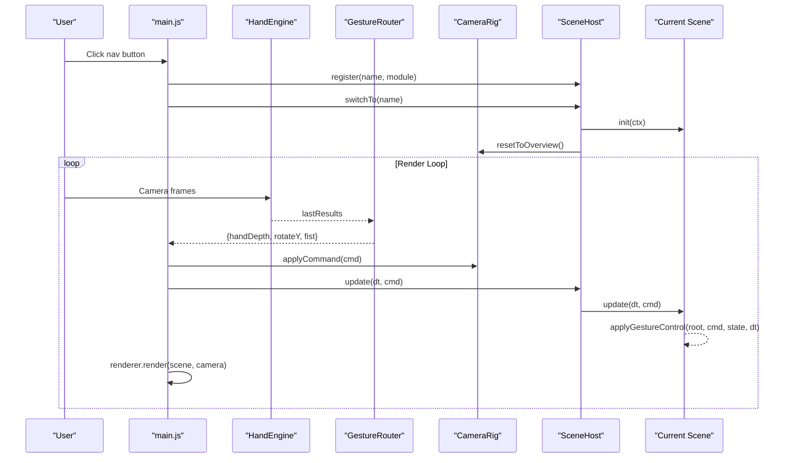

**Diagram sources**
- [main.js:78-109](file://src/science/gesture-cosmos/main.js#L78-L109)
- [main.js:160-179](file://src/science/gesture-cosmos/main.js#L160-L179)
- [scene-host.js:31-61](file://src/science/gesture-cosmos/core/scene-host.js#L31-L61)
- [camera-rig.js:30-55](file://src/science/gesture-cosmos/core/camera-rig.js#L30-L55)
- [gesture-router.js:34-110](file://src/science/gesture-cosmos/core/gesture-router.js#L34-L110)
- [gesture-control.js:50-83](file://src/science/gesture-cosmos/core/gesture-control.js#L50-L83)

## Detailed Component Analysis

### SceneHost
Responsibilities:
- Register scene modules by name
- Provide shared context (scene, camera, renderer, textureLoader, cameraRig, handEngine, gestureRouter)
- Switch scenes: dispose previous, init next, reset camera overview
- Update current scene per frame

Design notes:
- Uses Map for registered scenes
- Catches and logs errors during dispose/init
- Ensures camera overview after successful init

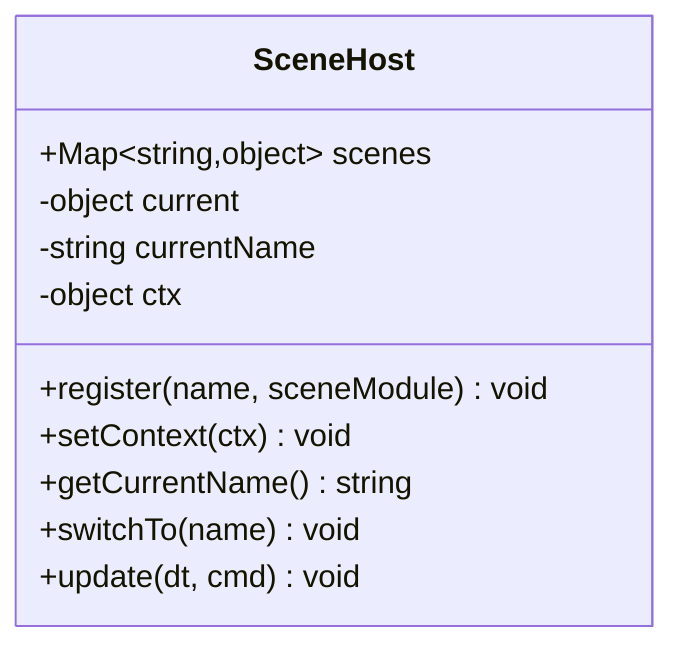

**Diagram sources**
- [scene-host.js:11-62](file://src/science/gesture-cosmos/core/scene-host.js#L11-L62)

**Section sources**
- [scene-host.js:11-62](file://src/science/gesture-cosmos/core/scene-host.js#L11-L62)

### CameraRig
Responsibilities:
- Wrap OrbitControls for damping, min/max distance
- Apply command tick (updates OrbitControls)
- Focus on world position with offset radius
- Reset to overview using spherical coordinates

Behavior:
- Gestures do not move the camera; they control scene objects directly
- Mouse/touch remains the primary camera control mechanism

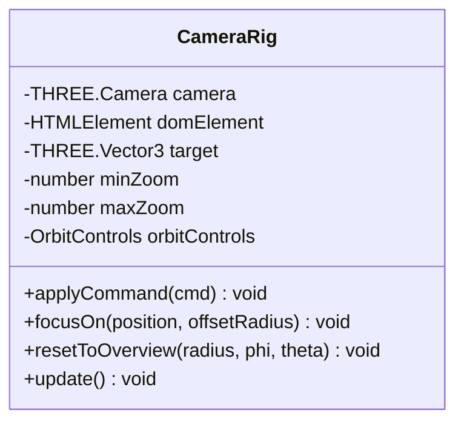

**Diagram sources**
- [camera-rig.js:10-60](file://src/science/gesture-cosmos/core/camera-rig.js#L10-L60)

**Section sources**
- [camera-rig.js:10-60](file://src/science/gesture-cosmos/core/camera-rig.js#L10-L60)

### HandEngine and GestureRouter
HandEngine:
- Initializes MediaPipe Hands with locateFile pointing to CDN
- Starts camera stream and sends frames to hands model
- Exposes lastResults and callbacks

GestureRouter:
- Computes openness from fingertip distances
- Debounces fist activation/deactivation with hysteresis
- Derives handDepth from apparent hand size
- Computes rotateY delta from palm X movement when open palm
- Emits null when no hand detected

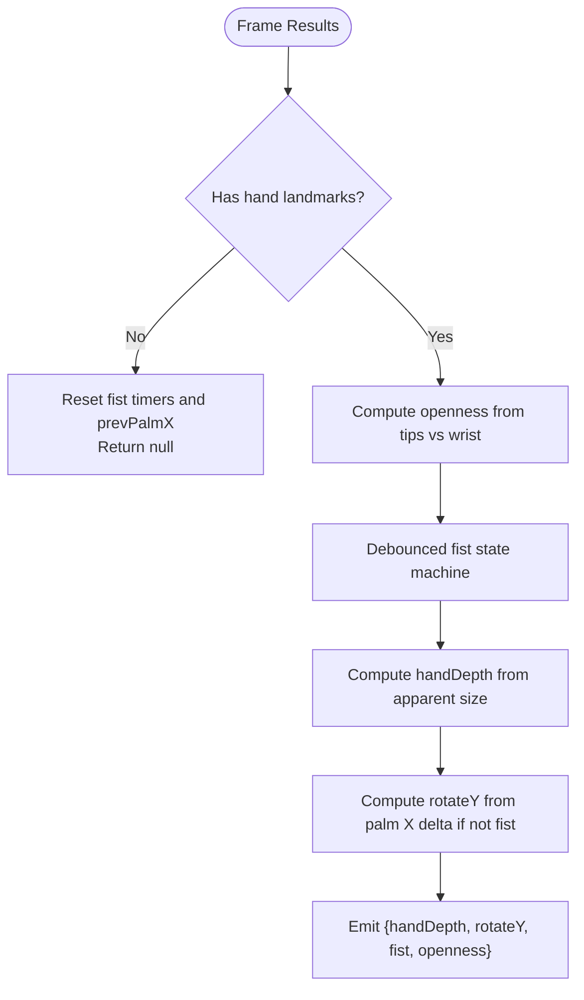

**Diagram sources**
- [hand-engine.js:21-71](file://src/science/gesture-cosmos/core/hand-engine.js#L21-L71)
- [gesture-router.js:34-110](file://src/science/gesture-cosmos/core/gesture-router.js#L34-L110)

**Section sources**
- [hand-engine.js:5-82](file://src/science/gesture-cosmos/core/hand-engine.js#L5-L82)
- [gesture-router.js:22-110](file://src/science/gesture-cosmos/core/gesture-router.js#L22-L110)

### Gesture Control Utilities
Purpose:
- Maintain per-scene gesture state (currentScale, targetScale, fist flags)
- Smoothly lerp scale toward target within MIN_SCALE/MAX_SCALE
- Rotate root group on Y axis only when open palm
- Emit rising/falling edges for one-frame actions (e.g., explosion triggers)

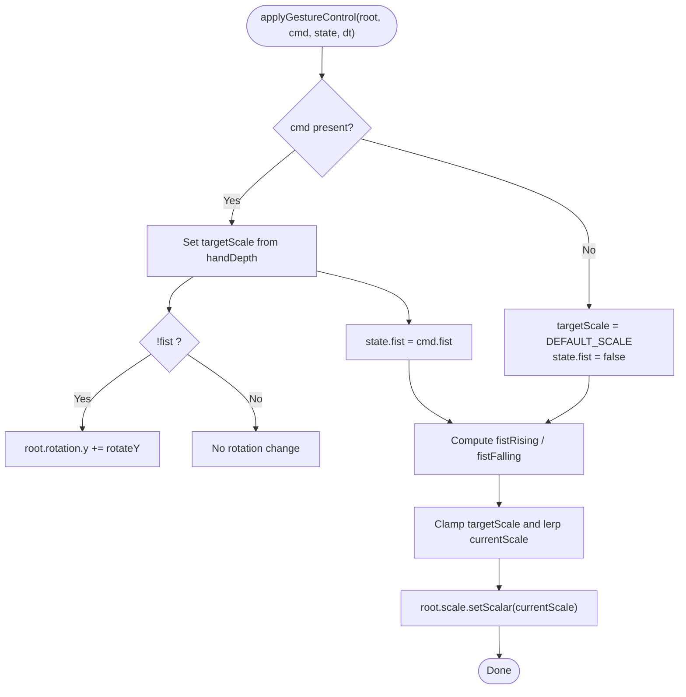

**Diagram sources**
- [gesture-control.js:50-83](file://src/science/gesture-cosmos/core/gesture-control.js#L50-L83)

**Section sources**
- [gesture-control.js:24-87](file://src/science/gesture-cosmos/core/gesture-control.js#L24-L87)

### Scene Implementations

#### Solar System
- Creates sun, planets, moons, orbits, rings, textures
- Adds UI overlay for focusing on bodies and overview
- Applies gesture control to a root group containing all bodies
- Disposes geometries, materials, textures, and removes DOM UI on dispose

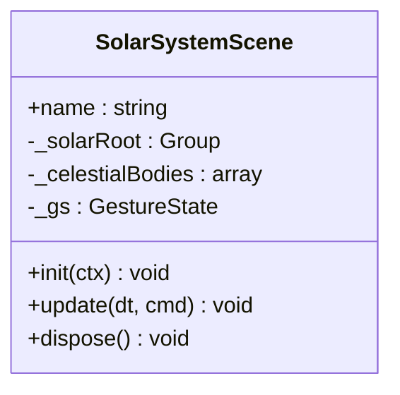

**Diagram sources**
- [scene-solar-system.js:8-18](file://src/science/gesture-cosmos/scenes/scene-solar-system.js#L8-L18)
- [scene-solar-system.js:268-300](file://src/science/gesture-cosmos/scenes/scene-solar-system.js#L268-L300)
- [scene-solar-system.js:362-438](file://src/science/gesture-cosmos/scenes/scene-solar-system.js#L362-L438)

**Section sources**
- [scene-solar-system.js:1-439](file://src/science/gesture-cosmos/scenes/scene-solar-system.js#L1-L439)

#### Shape Motion
- Particle system morphing between shapes (heart, sphere, flower, saturn, helix, galaxy)
- Explosion effect triggered by fist rising edge using precomputed offsets
- Auto color toggle and breathing animation
- Disposes geometry, material, texture, and resets background/fog

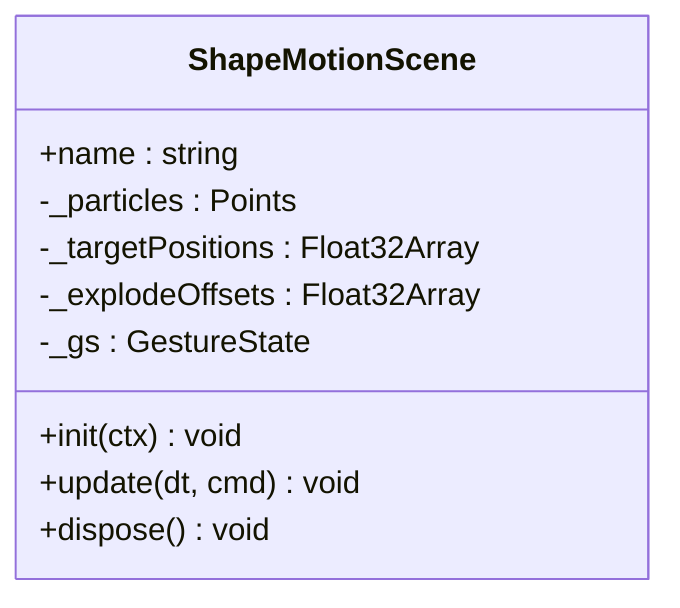

**Diagram sources**
- [scene-shape-motion.js:4-23](file://src/science/gesture-cosmos/scenes/scene-shape-motion.js#L4-L23)
- [scene-shape-motion.js:176-188](file://src/science/gesture-cosmos/scenes/scene-shape-motion.js#L176-L188)
- [scene-shape-motion.js:190-239](file://src/science/gesture-cosmos/scenes/scene-shape-motion.js#L190-L239)
- [scene-shape-motion.js:292-317](file://src/science/gesture-cosmos/scenes/scene-shape-motion.js#L292-L317)

**Section sources**
- [scene-shape-motion.js:1-318](file://src/science/gesture-cosmos/scenes/scene-shape-motion.js#L1-L318)

#### Galaxy Spiral
- Generates multiple galaxy presets with different arm counts, radii, spin, randomness
- Background star field and glow texture
- Status HUD showing gesture/mouse mode and FPS
- Disposes particle systems and textures

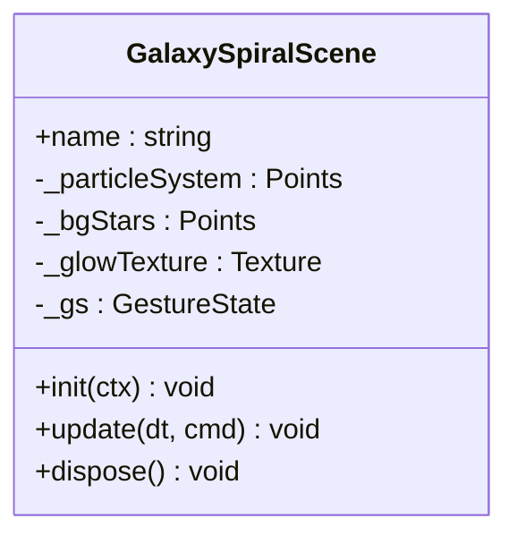

**Diagram sources**
- [scene-galaxy-spiral.js:4-83](file://src/science/gesture-cosmos/scenes/scene-galaxy-spiral.js#L4-L83)
- [scene-galaxy-spiral.js:264-277](file://src/science/gesture-cosmos/scenes/scene-galaxy-spiral.js#L264-L277)
- [scene-galaxy-spiral.js:279-309](file://src/science/gesture-cosmos/scenes/scene-galaxy-spiral.js#L279-L309)
- [scene-galaxy-spiral.js:311-337](file://src/science/gesture-cosmos/scenes/scene-galaxy-spiral.js#L311-L337)

**Section sources**
- [scene-galaxy-spiral.js:1-338](file://src/science/gesture-cosmos/scenes/scene-galaxy-spiral.js#L1-L338)

#### Neon Planets
- Particle-based glowing planets with configurable sizes, speeds, colors, and types
- Optional ring and glow layers
- Explosion effect on fist rising edge using original positions buffer
- Disposes tracked objects and restores camera overview

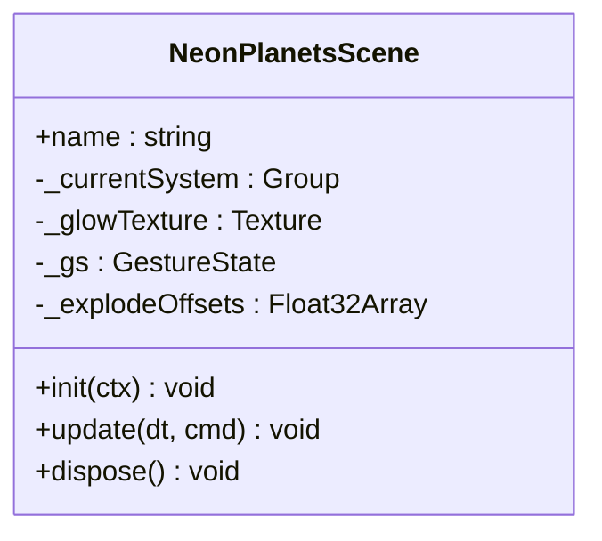

**Diagram sources**
- [scene-neon-planets.js:8-36](file://src/science/gesture-cosmos/scenes/scene-neon-planets.js#L8-L36)
- [scene-neon-planets.js:239-259](file://src/science/gesture-cosmos/scenes/scene-neon-planets.js#L239-L259)
- [scene-neon-planets.js:261-305](file://src/science/gesture-cosmos/scenes/scene-neon-planets.js#L261-L305)
- [scene-neon-planets.js:307-339](file://src/science/gesture-cosmos/scenes/scene-neon-planets.js#L307-L339)

**Section sources**
- [scene-neon-planets.js:1-340](file://src/science/gesture-cosmos/scenes/scene-neon-planets.js#L1-L340)

## Dependency Analysis
High-level dependencies:
- main.js depends on core modules and dynamically imports scene modules
- Scene modules depend on gesture-control utilities and Three.js
- CameraRig depends on OrbitControls addon
- HandEngine depends on global MediaPipe scripts loaded via importmap and script tags
- GestureRouter depends on MediaPipe landmark data structure

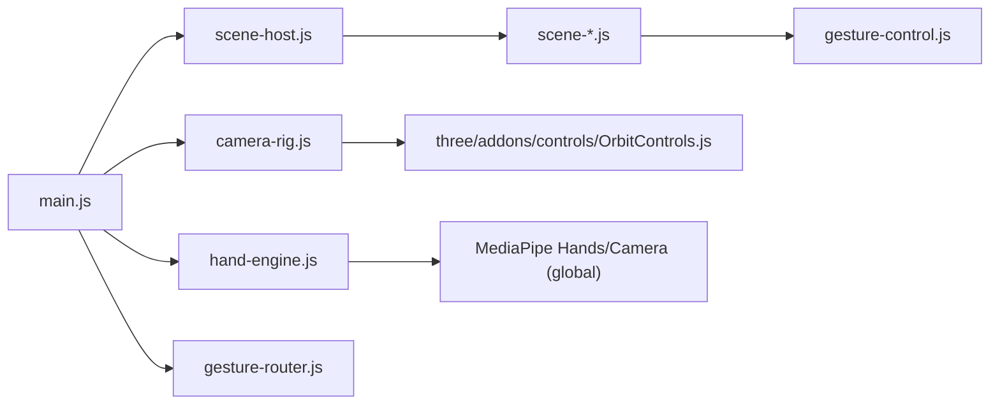

**Diagram sources**
- [main.js:8-64](file://src/science/gesture-cosmos/main.js#L8-L64)
- [camera-rig.js:7-8](file://src/science/gesture-cosmos/core/camera-rig.js#L7-L8)
- [hand-engine.js:21-46](file://src/science/gesture-cosmos/core/hand-engine.js#L21-L46)
- [gesture-control.js:24-40](file://src/science/gesture-cosmos/core/gesture-control.js#L24-L40)

**Section sources**
- [main.js:8-64](file://src/science/gesture-cosmos/main.js#L8-L64)
- [camera-rig.js:7-8](file://src/science/gesture-cosmos/core/camera-rig.js#L7-L8)
- [hand-engine.js:21-46](file://src/science/gesture-cosmos/core/hand-engine.js#L21-L46)

## Performance Considerations
- Dynamic scene loading: Scenes are imported on first switch, reducing initial load time and memory footprint.
- Resource cleanup: Each scene disposes geometries, materials, textures, and removes DOM overlays to prevent leaks.
- Particle performance:
  - Use BufferGeometry and typed arrays for positions/colors
  - Avoid frequent allocations; reuse buffers where possible
  - Precompute explosion offsets once per fist rising edge
- Rendering settings:
  - Pixel ratio capped to reduce GPU load on high-DPI devices
  - FogExp2 can hide distant artifacts and reduce overdraw perception
  - Additive blending with depthWrite disabled for particles reduces sorting cost
- Animation smoothing:
  - Lerp factors keep transitions stable across frame rates
  - Clamp dt to avoid large jumps on tab switches

[No sources needed since this section provides general guidance]

## Troubleshooting Guide
Common issues and remedies:
- Camera permission denied or MediaPipe not loaded:
  - Ensure user gesture initiates camera start
  - Verify MediaPipe scripts are available before initializing HandEngine
- No hand detected:
  - GestureRouter returns null; ensure scenes handle null gracefully
  - Check lighting and hand visibility; adjust confidence thresholds in HandEngine options
- Memory leaks after scene switch:
  - Confirm scene.dispose() removes all children and disposes resources
  - Validate background/fog references are cleared
- Poor performance on mobile:
  - Reduce particle counts or disable heavy effects
  - Lower pixel ratio cap and disable shadows if necessary
- OrbitControls conflicts:
  - Remember gestures control scene objects, not camera; use CameraRig methods for camera changes

**Section sources**
- [main.js:117-130](file://src/science/gesture-cosmos/main.js#L117-L130)
- [hand-engine.js:21-46](file://src/science/gesture-cosmos/core/hand-engine.js#L21-L46)
- [gesture-router.js:34-42](file://src/science/gesture-cosmos/core/gesture-router.js#L34-L42)
- [scene-solar-system.js:406-438](file://src/science/gesture-cosmos/scenes/scene-solar-system.js#L406-L438)
- [scene-shape-motion.js:292-317](file://src/science/gesture-cosmos/scenes/scene-shape-motion.js#L292-L317)
- [scene-galaxy-spiral.js:311-337](file://src/science/gesture-cosmos/scenes/scene-galaxy-spiral.js#L311-L337)
- [scene-neon-planets.js:307-339](file://src/science/gesture-cosmos/scenes/scene-neon-planets.js#L307-L339)

## Conclusion
The Gesture Cosmos system cleanly separates concerns across scene management, camera control, gesture processing, and rendering. The SceneHost pattern enables safe lifecycle transitions and resource management. CameraRig provides intuitive mouse/touch navigation while gestures drive object-scale and rotation, with fist events enabling dramatic effects. Scenes follow a consistent interface and dispose strategy, ensuring stability and performance across complex 3D environments.

[No sources needed since this section summarizes without analyzing specific files]

## Appendices

### Creating a New 3D Scene
Steps:
- Create a new file under scenes/ and export name, init(ctx), update(dt, cmd), dispose()
- In main.js, add a dynamic import entry mapping a key to your module
- Optionally create UI buttons in the scene’s init to interact with CameraRig
- Use createGestureState() and applyGestureControl(root, cmd, state, dt) in update()
- Dispose all created resources in dispose()

Implementation references:
- [main.js:14-22](file://src/science/gesture-cosmos/main.js#L14-L22)
- [scene-solar-system.js:8-18](file://src/science/gesture-cosmos/scenes/scene-solar-system.js#L8-L18)
- [scene-shape-motion.js:4-23](file://src/science/gesture-cosmos/scenes/scene-shape-motion.js#L4-L23)
- [scene-galaxy-spiral.js:4-83](file://src/science/gesture-cosmos/scenes/scene-galaxy-spiral.js#L4-L83)
- [scene-neon-planets.js:8-36](file://src/science/gesture-cosmos/scenes/scene-neon-planets.js#L8-L36)

**Section sources**
- [main.js:14-22](file://src/science/gesture-cosmos/main.js#L14-L22)
- [scene-solar-system.js:8-18](file://src/science/gesture-cosmos/scenes/scene-solar-system.js#L8-L18)
- [scene-shape-motion.js:4-23](file://src/science/gesture-cosmos/scenes/scene-shape-motion.js#L4-L23)
- [scene-galaxy-spiral.js:4-83](file://src/science/gesture-cosmos/scenes/scene-galaxy-spiral.js#L4-L83)
- [scene-neon-planets.js:8-36](file://src/science/gesture-cosmos/scenes/scene-neon-planets.js#L8-L36)

### Integrating Gesture Controls with Camera Movement
Guidelines:
- Use CameraRig.focusOn(position, offsetRadius) to navigate to targets
- Use CameraRig.resetToOverview(radius, phi, theta) to return to default view
- Keep gestures focused on object manipulation; let OrbitControls handle camera

References:
- [camera-rig.js:37-55](file://src/science/gesture-cosmos/core/camera-rig.js#L37-L55)
- [scene-solar-system.js:348-353](file://src/science/gesture-cosmos/scenes/scene-solar-system.js#L348-L353)
- [scene-neon-planets.js:252-258](file://src/science/gesture-cosmos/scenes/scene-neon-planets.js#L252-L258)

**Section sources**
- [camera-rig.js:37-55](file://src/science/gesture-cosmos/core/camera-rig.js#L37-L55)
- [scene-solar-system.js:348-353](file://src/science/gesture-cosmos/scenes/scene-solar-system.js#L348-L353)
- [scene-neon-planets.js:252-258](file://src/science/gesture-cosmos/scenes/scene-neon-planets.js#L252-L258)

### Optimizing Rendering Performance
Recommendations:
- Cap pixel ratio and reduce shadow map sizes
- Use fog to reduce overdraw and improve perceived performance
- Reuse textures and materials where possible
- Minimize per-frame allocations; precompute offsets and buffers
- Disable unnecessary features (shadows, post-processing) on low-end devices

References:
- [main.js:40-43](file://src/science/gesture-cosmos/main.js#L40-L43)
- [scene-galaxy-spiral.js:267-276](file://src/science/gesture-cosmos/scenes/scene-galaxy-spiral.js#L267-L276)
- [scene-neon-planets.js:241-247](file://src/science/gesture-cosmos/scenes/scene-neon-planets.js#L241-L247)

**Section sources**
- [main.js:40-43](file://src/science/gesture-cosmos/main.js#L40-L43)
- [scene-galaxy-spiral.js:267-276](file://src/science/gesture-cosmos/scenes/scene-galaxy-spiral.js#L267-L276)
- [scene-neon-planets.js:241-247](file://src/science/gesture-cosmos/scenes/scene-neon-planets.js#L241-L247)

### Cross-Browser Compatibility and Mobile Limitations
Considerations:
- MediaPipe availability depends on global scripts; guard initialization and provide fallbacks
- Camera permissions must be initiated by user gestures
- Mobile GPUs may struggle with large particle counts; consider adaptive quality
- Viewport meta tag ensures proper scaling on mobile devices

References:
- [gesture-cosmos-hub.html:227-238](file://src/science/gesture-cosmos-hub.html#L227-L238)
- [main.js:117-130](file://src/science/gesture-cosmos/main.js#L117-L130)
- [hand-engine.js:21-46](file://src/science/gesture-cosmos/core/hand-engine.js#L21-L46)

**Section sources**
- [gesture-cosmos-hub.html:227-238](file://src/science/gesture-cosmos-hub.html#L227-L238)
- [main.js:117-130](file://src/science/gesture-cosmos/main.js#L117-L130)
- [hand-engine.js:21-46](file://src/science/gesture-cosmos/core/hand-engine.js#L21-L46)

### Debugging Techniques for 3D Graphics Issues
Tips:
- Inspect console for error messages during scene init/dispose
- Use status HUDs to track FPS and gesture state
- Temporarily disable heavy effects (fog, additive blending) to isolate bottlenecks
- Log camera positions and target to verify focus behavior

References:
- [scene-galaxy-spiral.js:283-293](file://src/science/gesture-cosmos/scenes/scene-galaxy-spiral.js#L283-L293)
- [scene-host.js:36-54](file://src/science/gesture-cosmos/core/scene-host.js#L36-L54)

**Section sources**
- [scene-galaxy-spiral.js:283-293](file://src/science/gesture-cosmos/scenes/scene-galaxy-spiral.js#L283-L293)
- [scene-host.js:36-54](file://src/science/gesture-cosmos/core/scene-host.js#L36-L54)

### Adding Visual Effects and Interactive Elements
Guidelines:
- Introduce new effects inside scene.update(dt, cmd) and manage them with per-scene state
- For particle effects, prefer BufferGeometry and typed arrays
- Use CameraRig methods for camera interactions driven by UI or scene logic
- Always clean up added nodes and resources in scene.dispose()

References:
- [scene-shape-motion.js:190-239](file://src/science/gesture-cosmos/scenes/scene-shape-motion.js#L190-L239)
- [scene-neon-planets.js:261-305](file://src/science/gesture-cosmos/scenes/scene-neon-planets.js#L261-L305)
- [scene-solar-system.js:362-404](file://src/science/gesture-cosmos/scenes/scene-solar-system.js#L362-L404)

**Section sources**
- [scene-shape-motion.js:190-239](file://src/science/gesture-cosmos/scenes/scene-shape-motion.js#L190-L239)
- [scene-neon-planets.js:261-305](file://src/science/gesture-cosmos/scenes/scene-neon-planets.js#L261-L305)
- [scene-solar-system.js:362-404](file://src/science/gesture-cosmos/scenes/scene-solar-system.js#L362-L404)