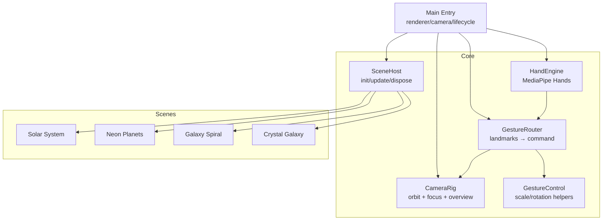
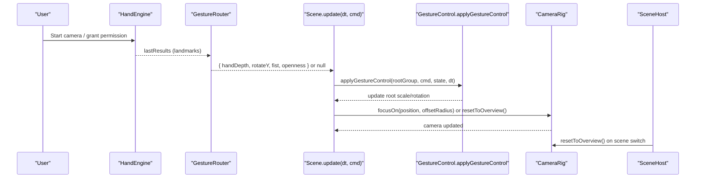
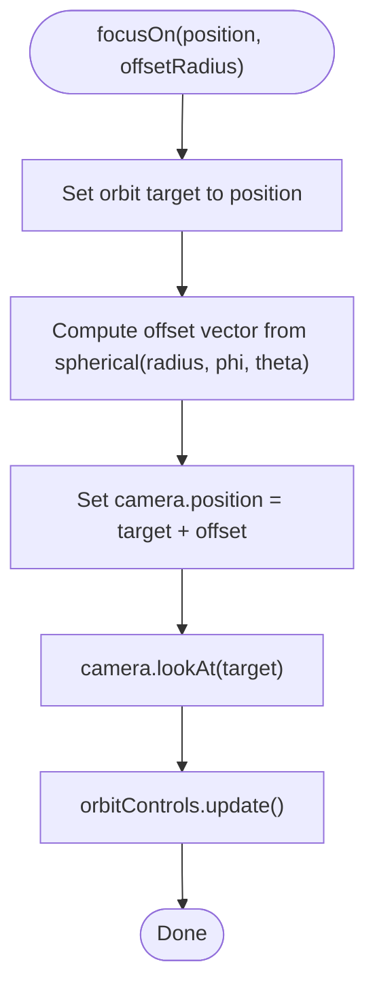
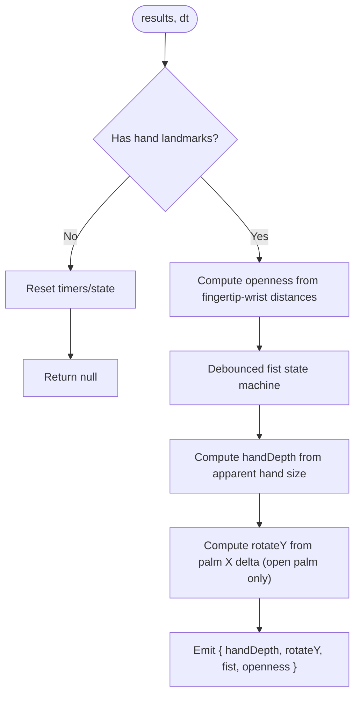
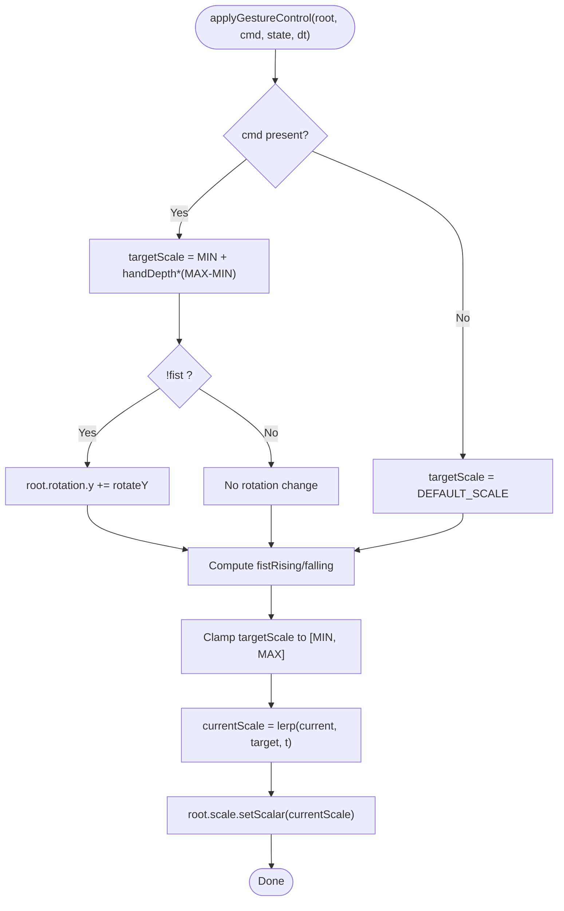
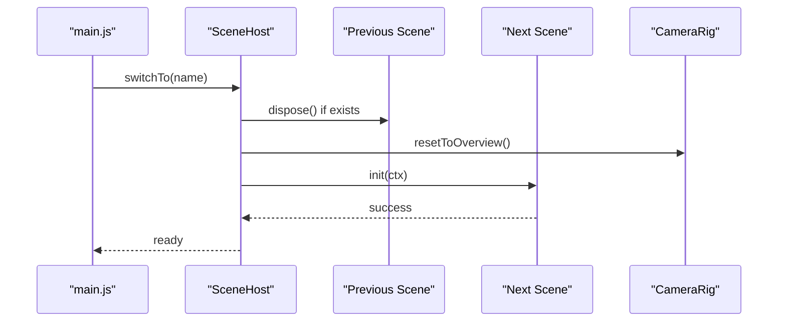
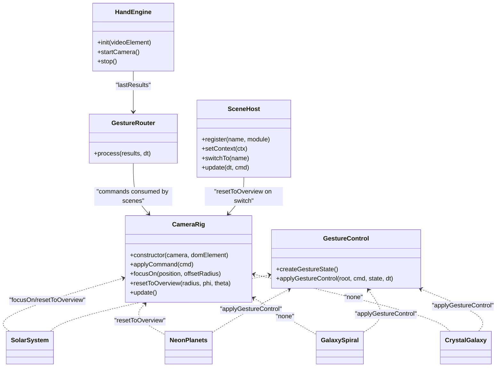

# Camera Rig System

<cite>
**Referenced Files in This Document**
- [camera-rig.js](file://src/science/gesture-cosmos/core/camera-rig.js)
- [gesture-control.js](file://src/science/gesture-cosmos/core/gesture-control.js)
- [gesture-router.js](file://src/science/gesture-cosmos/core/gesture-router.js)
- [hand-engine.js](file://src/science/gesture-cosmos/core/hand-engine.js)
- [scene-host.js](file://src/science/gesture-cosmos/core/scene-host.js)
- [main.js](file://src/science/gesture-cosmos/main.js)
- [scene-solar-system.js](file://src/science/gesture-cosmos/scenes/scene-solar-system.js)
- [scene-neon-planets.js](file://src/science/gesture-cosmos/scenes/scene-neon-planets.js)
- [scene-galaxy-spiral.js](file://src/science/gesture-cosmos/scenes/scene-galaxy-spiral.js)
- [scene-crystal-galaxy.js](file://src/science/gesture-cosmos/scenes/scene-crystal-galaxy.js)
</cite>

## Table of Contents
1. [Introduction](#introduction)
2. [Project Structure](#project-structure)
3. [Core Components](#core-components)
4. [Architecture Overview](#architecture-overview)
5. [Detailed Component Analysis](#detailed-component-analysis)
6. [Dependency Analysis](#dependency-analysis)
7. [Performance Considerations](#performance-considerations)
8. [Troubleshooting Guide](#troubleshooting-guide)
9. [Conclusion](#conclusion)

## Introduction
This document explains the CameraRig system and its integration with gesture-based navigation across scenes. It covers camera positioning algorithms, transition behaviors, and how gestures are integrated to control scene content while mouse/touch OrbitControls handle camera orbiting. It also documents overview mode reset behavior, state management across scene switches, and provides guidance for adding new camera control modes, integrating with gesture recognition systems, and optimizing performance on mobile devices.

## Project Structure
The CameraRig is part of a cohesive hub architecture that separates concerns:
- Core modules provide shared services (camera rig, gesture routing, hand engine, scene host).
- Scenes encapsulate 3D content and apply gesture-driven transformations to their root objects.
- The main entry point wires everything together and runs the render loop.

**Diagram sources**
- [main.js](file://src/science/gesture-cosmos/main.js)
- [camera-rig.js](file://src/science/gesture-cosmos/core/camera-rig.js)
- [gesture-router.js](file://src/science/gesture-cosmos/core/gesture-router.js)
- [hand-engine.js](file://src/science/gesture-cosmos/core/hand-engine.js)
- [scene-host.js](file://src/science/gesture-cosmos/core/scene-host.js)
- [gesture-control.js](file://src/science/gesture-cosmos/core/gesture-control.js)
- [scene-solar-system.js](file://src/science/gesture-cosmos/scenes/scene-solar-system.js)
- [scene-neon-planets.js](file://src/science/gesture-cosmos/scenes/scene-neon-planets.js)
- [scene-galaxy-spiral.js](file://src/science/gesture-cosmos/scenes/scene-galaxy-spiral.js)
- [scene-crystal-galaxy.js](file://src/science/gesture-cosmos/scenes/scene-crystal-galaxy.js)

**Section sources**
- [main.js](file://src/science/gesture-cosmos/main.js)
- [camera-rig.js](file://src/science/gesture-cosmos/core/camera-rig.js)
- [gesture-router.js](file://src/science/gesture-cosmos/core/gesture-router.js)
- [hand-engine.js](file://src/science/gesture-cosmos/core/hand-engine.js)
- [scene-host.js](file://src/science/gesture-cosmos/core/scene-host.js)
- [gesture-control.js](file://src/science/gesture-cosmos/core/gesture-control.js)

## Core Components
- CameraRig: Provides mouse/touch orbit via OrbitControls, programmatic focus transitions, and an overview reset method. It updates damping each frame and exposes methods for focusing on world positions and resetting to a canonical overview view.
- GestureRouter: Translates MediaPipe landmarks into normalized commands including hand depth, Y-axis rotation delta, and fist state. It debounces fist activation/deactivation and computes hand depth from apparent size.
- HandEngine: Wraps MediaPipe Hands and Camera utilities, manages initialization, permission flow, and frames the video feed for hand detection.
- SceneHost: Manages scene lifecycle, disposes previous scenes, initializes new ones, and resets camera to overview after successful init.
- GestureControl: Shared utilities for per-scene object scaling and rotation driven by gesture commands, with smooth lerp and edge detection for fist rising/falling events.

Key responsibilities:
- CameraRig owns camera position/orientation and target; it does not move based on gestures directly but can be commanded programmatically.
- GestureRouter emits commands used by scenes to transform their root groups (scale/rotate), not the camera.
- SceneHost ensures consistent camera state when switching scenes by resetting to overview.

**Section sources**
- [camera-rig.js](file://src/science/gesture-cosmos/core/camera-rig.js)
- [gesture-router.js](file://src/science/gesture-cosmos/core/gesture-router.js)
- [hand-engine.js](file://src/science/gesture-cosmos/core/hand-engine.js)
- [scene-host.js](file://src/science/gesture-cosmos/core/scene-host.js)
- [gesture-control.js](file://src/science/gesture-cosmos/core/gesture-control.js)

## Architecture Overview
The runtime data flow connects hand tracking to scene transformation and camera control:

**Diagram sources**
- [main.js](file://src/science/gesture-cosmos/main.js)
- [hand-engine.js](file://src/science/gesture-cosmos/core/hand-engine.js)
- [gesture-router.js](file://src/science/gesture-cosmos/core/gesture-router.js)
- [gesture-control.js](file://src/science/gesture-cosmos/core/gesture-control.js)
- [camera-rig.js](file://src/science/gesture-cosmos/core/camera-rig.js)
- [scene-host.js](file://src/science/gesture-cosmos/core/scene-host.js)
- [scene-solar-system.js](file://src/science/gesture-cosmos/scenes/scene-solar-system.js)

## Detailed Component Analysis

### CameraRig: Positioning, Focus, and Overview
- Orbit controls: Uses OrbitControls with damping enabled for smooth mouse/touch interaction. Min/max distances constrain zoom range.
- Focus transitions: Sets the orbit target to a world position and places the camera at a computed offset using spherical coordinates, then calls lookAt and updates controls.
- Overview reset: Resets target to origin and sets camera position using spherical coordinates with configurable radius and angles.

Implementation highlights:
- Damping tick occurs every frame via update/applyCommand.
- Focus uses a simple offset strategy along Z and Y to maintain a comfortable viewing angle.
- Overview uses spherical math to place the camera at a standard distance and elevation.

**Diagram sources**
- [camera-rig.js](file://src/science/gesture-cosmos/core/camera-rig.js)

**Section sources**
- [camera-rig.js](file://src/science/gesture-cosmos/core/camera-rig.js)

### Gesture Router: Landmark Processing and Command Emission
- Openness estimation: Averages distances from fingertips to wrist to classify open palm vs fist.
- Fist state machine: Debounced thresholds prevent false triggers; tracks rising/falling edges for one-frame signals.
- Hand depth: Derived from apparent hand size in screen space; inverted so farther hands map to larger values.
- Rotation delta: Palm X movement drives Y-axis rotation only when not in fist state.

**Diagram sources**
- [gesture-router.js](file://src/science/gesture-cosmos/core/gesture-router.js)

**Section sources**
- [gesture-router.js](file://src/science/gesture-cosmos/core/gesture-router.js)

### Gesture Control: Smooth Scale and Rotation for Scene Objects
- Scales a root group based on hand depth with clamped min/max targets.
- Rotates around Y axis when open palm slides left/right.
- Emits one-frame rising/falling flags for fist activation/release.
- Applies smooth interpolation to avoid jittery scaling.

**Diagram sources**
- [gesture-control.js](file://src/science/gesture-cosmos/core/gesture-control.js)

**Section sources**
- [gesture-control.js](file://src/science/gesture-cosmos/core/gesture-control.js)

### Scene Host: Lifecycle and Camera State Across Switches
- Disposes previous scene resources safely.
- Initializes next scene with shared context.
- Resets camera to overview after successful init to ensure consistent starting state.

**Diagram sources**
- [scene-host.js](file://src/science/gesture-cosmos/core/scene-host.js)
- [main.js](file://src/science/gesture-cosmos/main.js)
- [camera-rig.js](file://src/science/gesture-cosmos/core/camera-rig.js)

**Section sources**
- [scene-host.js](file://src/science/gesture-cosmos/core/scene-host.js)
- [main.js](file://src/science/gesture-cosmos/main.js)

### Solar System Scene: UI-Driven Focus and Overview
- Provides buttons to focus on celestial bodies and return to overview.
- Uses CameraRig.focusOn with dynamic offsets based on body radius.
- Applies shared gesture control to the solar root group for scale/rotation.

**Section sources**
- [scene-solar-system.js](file://src/science/gesture-cosmos/scenes/scene-solar-system.js)
- [camera-rig.js](file://src/science/gesture-cosmos/core/camera-rig.js)
- [gesture-control.js](file://src/science/gesture-cosmos/core/gesture-control.js)

### Neon Planets Scene: Particle Explosion and Gesture Integration
- Builds particle-based planets with optional rings and glow effects.
- On fist rising edge, precomputes explosion offsets; animates particles outward/inward smoothly.
- Resets camera to overview during init and restore on dispose to keep consistent UX.

**Section sources**
- [scene-neon-planets.js](file://src/science/gesture-cosmos/scenes/scene-neon-planets.js)
- [gesture-control.js](file://src/science/gesture-cosmos/core/gesture-control.js)
- [camera-rig.js](file://src/science/gesture-cosmos/core/camera-rig.js)

### Galaxy Spiral and Crystal Galaxy: Large-Scale Particle Systems
- Generate large particle fields with custom shaders or materials.
- Apply shared gesture control to root particle systems for uniform scale/rotation.
- Maintain auto-rotation and entry animations; ensure disposal of geometries/materials on switch.

**Section sources**
- [scene-galaxy-spiral.js](file://src/science/gesture-cosmos/scenes/scene-galaxy-spiral.js)
- [scene-crystal-galaxy.js](file://src/science/gesture-cosmos/scenes/scene-crystal-galaxy.js)
- [gesture-control.js](file://src/science/gesture-cosmos/core/gesture-control.js)

## Dependency Analysis
High-level dependencies between core components and scenes:

**Diagram sources**
- [camera-rig.js](file://src/science/gesture-cosmos/core/camera-rig.js)
- [gesture-router.js](file://src/science/gesture-cosmos/core/gesture-router.js)
- [hand-engine.js](file://src/science/gesture-cosmos/core/hand-engine.js)
- [scene-host.js](file://src/science/gesture-cosmos/core/scene-host.js)
- [gesture-control.js](file://src/science/gesture-cosmos/core/gesture-control.js)
- [scene-solar-system.js](file://src/science/gesture-cosmos/scenes/scene-solar-system.js)
- [scene-neon-planets.js](file://src/science/gesture-cosmos/scenes/scene-neon-planets.js)
- [scene-galaxy-spiral.js](file://src/science/gesture-cosmos/scenes/scene-galaxy-spiral.js)
- [scene-crystal-galaxy.js](file://src/science/gesture-cosmos/scenes/scene-crystal-galaxy.js)

**Section sources**
- [camera-rig.js](file://src/science/gesture-cosmos/core/camera-rig.js)
- [gesture-router.js](file://src/science/gesture-cosmos/core/gesture-router.js)
- [hand-engine.js](file://src/science/gesture-cosmos/core/hand-engine.js)
- [scene-host.js](file://src/science/gesture-cosmos/core/scene-host.js)
- [gesture-control.js](file://src/science/gesture-cosmos/core/gesture-control.js)
- [scene-solar-system.js](file://src/science/gesture-cosmos/scenes/scene-solar-system.js)
- [scene-neon-planets.js](file://src/science/gesture-cosmos/scenes/scene-neon-planets.js)
- [scene-galaxy-spiral.js](file://src/science/gesture-cosmos/scenes/scene-galaxy-spiral.js)
- [scene-crystal-galaxy.js](file://src/science/gesture-cosmos/scenes/scene-crystal-galaxy.js)

## Performance Considerations
- Mobile pixel ratio: Cap devicePixelRatio to balance clarity and GPU load.
- Geometry and material disposal: Ensure all per-scene assets are disposed on switch to prevent memory leaks.
- Particle counts: Tune particle numbers per device capability; consider reducing counts or LOD strategies on low-end devices.
- Shader complexity: Prefer efficient vertex/fragment shaders; avoid heavy per-pixel operations where possible.
- Background effects: Limit background star counts and fog density to reduce overdraw.
- Gesture processing: Keep landmark computations minimal; debounce thresholds should be tuned to avoid excessive updates.

[No sources needed since this section provides general guidance]

## Troubleshooting Guide
Common issues and resolutions:
- Camera clipping: Adjust near/far planes and min/max zoom distances to avoid clipping close-up or far-away objects. Validate focus offsets relative to object sizes.
- Jittery transitions: Increase damping factor slightly or use smoother lerp factors for scale changes; ensure commands are throttled appropriately.
- Inconsistent UX across screen sizes: Use overview reset with appropriate radius and angles; compute offsets based on viewport dimensions or object radii to maintain consistent framing.
- Gesture conflicts: Ensure fist state disables rotation to avoid unintended rotations; clamp rotation deltas to reasonable bounds.
- Scene switch artifacts: Confirm proper disposal of textures, geometries, and materials; reset camera to overview after init to avoid residual states.

**Section sources**
- [camera-rig.js](file://src/science/gesture-cosmos/core/camera-rig.js)
- [gesture-control.js](file://src/science/gesture-cosmos/core/gesture-control.js)
- [scene-host.js](file://src/science/gesture-cosmos/core/scene-host.js)
- [scene-neon-planets.js](file://src/science/gesture-cosmos/scenes/scene-neon-planets.js)

## Conclusion
The CameraRig system integrates seamlessly with gesture-driven scene interactions while preserving robust mouse/touch orbit controls. Its clear separation of responsibilities—camera positioning, gesture routing, scene lifecycle, and shared gesture utilities—enables consistent user experiences across scenes and devices. By following the patterns documented here, you can add new camera control modes, integrate additional gesture inputs, and optimize performance for mobile environments without compromising stability or usability.