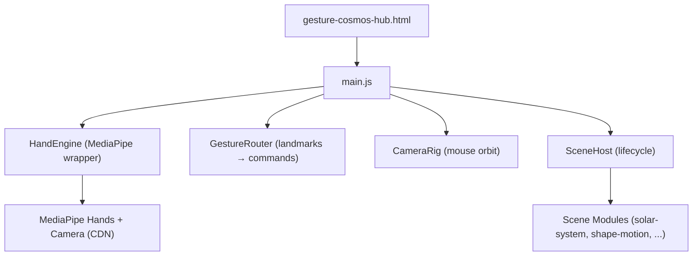
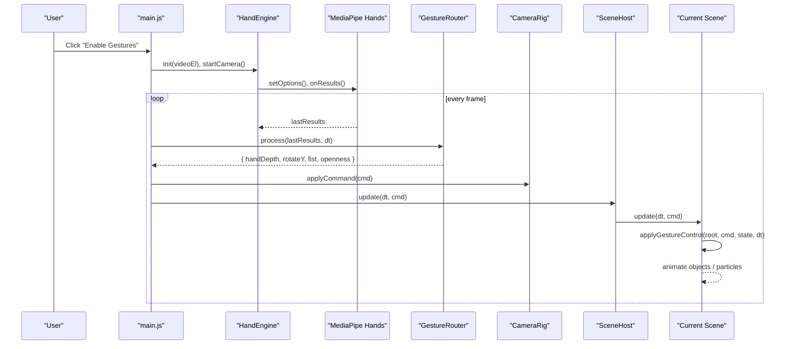
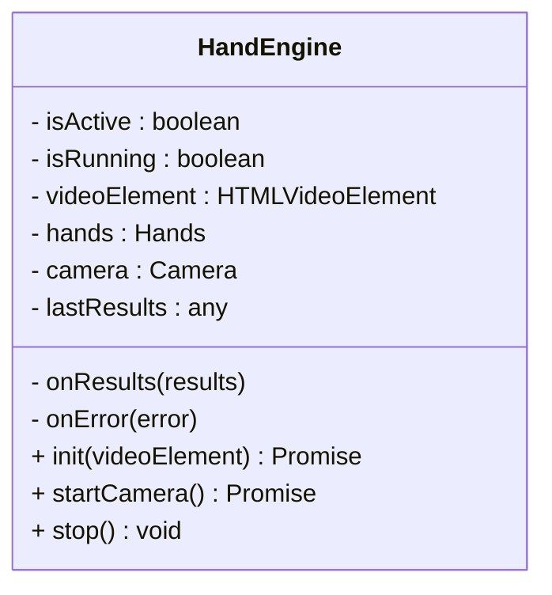
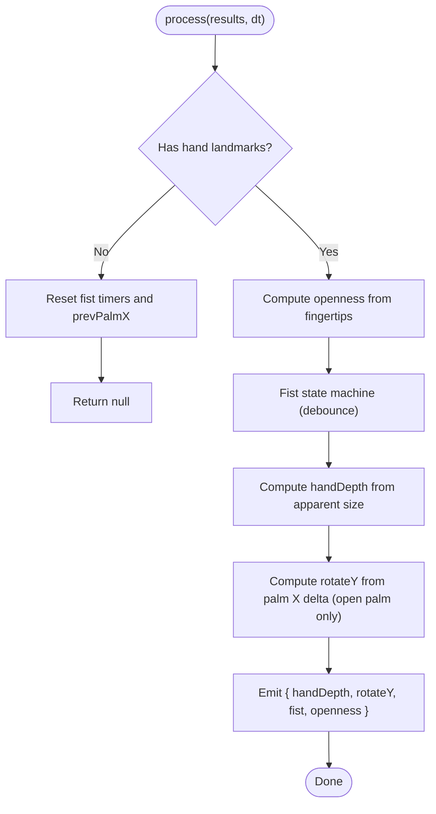
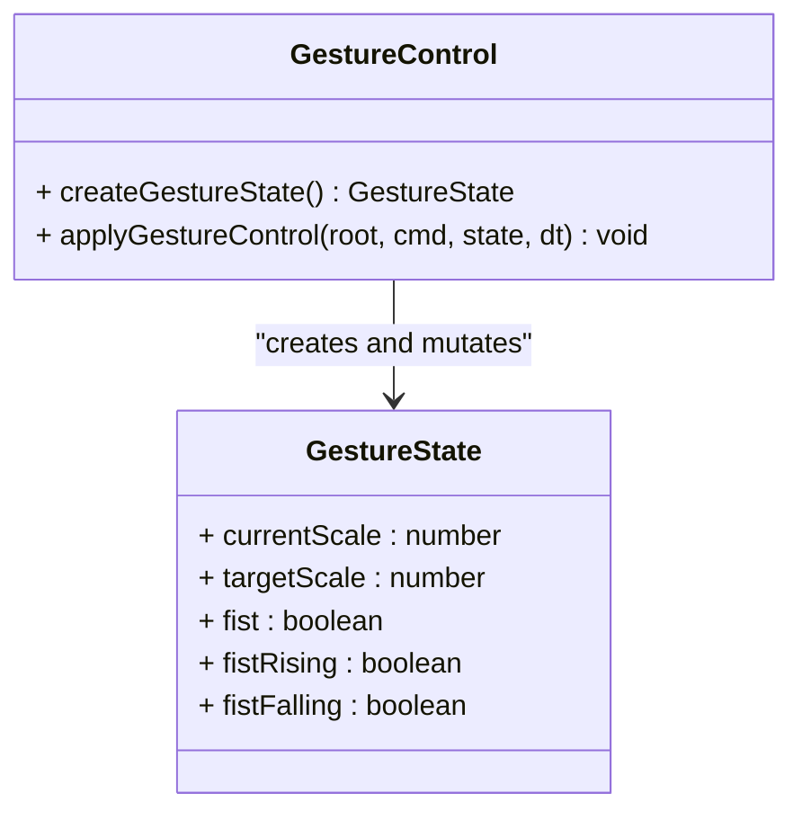
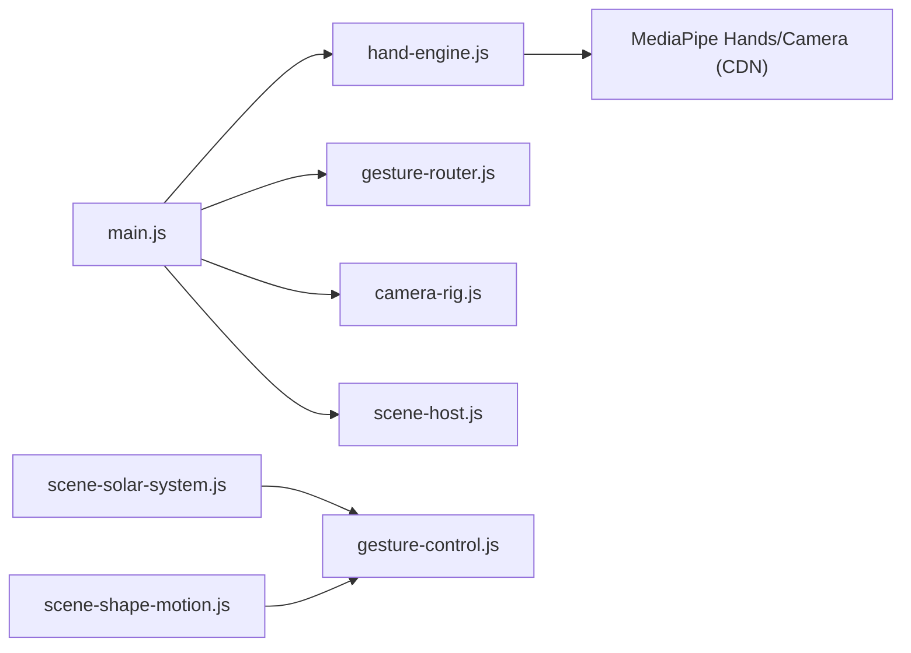

# Gesture Integration & Control

<cite>
**Referenced Files in This Document**
- [gesture-cosmos-hub.html](file://src/science/gesture-cosmos-hub.html)
- [main.js](file://src/science/gesture-cosmos/main.js)
- [hand-engine.js](file://src/science/gesture-cosmos/core/hand-engine.js)
- [gesture-router.js](file://src/science/gesture-cosmos/core/gesture-router.js)
- [camera-rig.js](file://src/science/gesture-cosmos/core/camera-rig.js)
- [scene-host.js](file://src/science/gesture-cosmos/core/scene-host.js)
- [gesture-control.js](file://src/science/gesture-cosmos/core/gesture-control.js)
- [scene-solar-system.js](file://src/science/gesture-cosmos/scenes/scene-solar-system.js)
- [scene-shape-motion.js](file://src/science/gesture-cosmos/scenes/scene-shape-motion.js)
</cite>

## Table of Contents
1. [Introduction](#introduction)
2. [Project Structure](#project-structure)
3. [Core Components](#core-components)
4. [Architecture Overview](#architecture-overview)
5. [Detailed Component Analysis](#detailed-component-analysis)
6. [Dependency Analysis](#dependency-analysis)
7. [Performance Considerations](#performance-considerations)
8. [Troubleshooting Guide](#troubleshooting-guide)
9. [Conclusion](#conclusion)
10. [Appendices](#appendices)

## Introduction
This document explains the gesture recognition and control system that bridges hand tracking data with 3D scene interactions in the Gesture Cosmos Hub. It covers:
- HandEngine integration with MediaPipe Hands
- Gesture command processing pipeline
- Event-driven communication between gesture detection and scene controls
- How hand position data is translated into object scale, rotation, and interactive behaviors
- Implementation examples for adding new gestures, configuring sensitivity, and handling edge cases
- Performance optimization techniques and fallback mechanisms when hand tracking fails

The system uses a single shared Three.js renderer/scene/camera and a unified gesture-to-command pipeline. Scenes consume normalized commands to drive their own content (e.g., scaling and rotating a solar system or particle shapes). Camera navigation remains mouse/touch via OrbitControls; gestures primarily affect scene objects rather than camera movement.

## Project Structure
At runtime, the hub page loads Three.js via importmap and MediaPipe via script tags. The main entry initializes core modules, registers scenes, and runs a render loop that processes gestures each frame.

**Diagram sources**
- [gesture-cosmos-hub.html:227-238](file://src/science/gesture-cosmos-hub.html#L227-L238)
- [main.js:8-12](file://src/science/gesture-cosmos/main.js#L8-L12)
- [hand-engine.js:1-83](file://src/science/gesture-cosmos/core/hand-engine.js#L1-L83)
- [gesture-router.js:1-111](file://src/science/gesture-cosmos/core/gesture-router.js#L1-L111)
- [camera-rig.js:1-61](file://src/science/gesture-cosmos/core/camera-rig.js#L1-L61)
- [scene-host.js:1-63](file://src/science/gesture-cosmos/core/scene-host.js#L1-L63)

**Section sources**
- [gesture-cosmos-hub.html:227-238](file://src/science/gesture-cosmos-hub.html#L227-L238)
- [main.js:8-12](file://src/science/gesture-cosmos/main.js#L8-L12)

## Core Components
- HandEngine: Initializes MediaPipe Hands and Camera, streams frames, and exposes last results to the router.
- GestureRouter: Converts raw landmarks into a unified command object per frame (depth, rotation delta, fist state, openness).
- CameraRig: Mouse-only orbit controller; gestures do not move the camera directly.
- SceneHost: Manages scene lifecycle (init/update/dispose) and passes a shared context to scenes.
- gesture-control: Shared utilities for applying gesture effects to scene objects (scale lerp, rotation, fist edges).
- Scenes: Each scene consumes the command stream to animate its content (e.g., scale/rotate root group, trigger explosions on fist).

Key responsibilities:
- HandEngine encapsulates MediaPipe initialization and frame sending.
- GestureRouter normalizes landmarks into stable, debounced commands.
- Scenes apply commands to their own root groups or particle systems.

**Section sources**
- [hand-engine.js:1-83](file://src/science/gesture-cosmos/core/hand-engine.js#L1-L83)
- [gesture-router.js:1-111](file://src/science/gesture-cosmos/core/gesture-router.js#L1-L111)
- [camera-rig.js:1-61](file://src/science/gesture-cosmos/core/camera-rig.js#L1-L61)
- [scene-host.js:1-63](file://src/science/gesture-cosmos/core/scene-host.js#L1-L63)
- [gesture-control.js:1-88](file://src/science/gesture-cosmos/core/gesture-control.js#L1-L88)

## Architecture Overview
The runtime flow is event-driven and frame-based:
- Main loop calls GestureRouter.process(handEngine.lastResults, dt)
- Command is applied to CameraRig (no-op for gestures) and passed to SceneHost.update(dt, cmd)
- Each scene’s update applies gesture-control helpers to transform its root group or particles

**Diagram sources**
- [main.js:160-179](file://src/science/gesture-cosmos/main.js#L160-L179)
- [hand-engine.js:21-71](file://src/science/gesture-cosmos/core/hand-engine.js#L21-L71)
- [gesture-router.js:34-109](file://src/science/gesture-cosmos/core/gesture-router.js#L34-L109)
- [camera-rig.js:30-32](file://src/science/gesture-cosmos/core/camera-rig.js#L30-L32)
- [scene-host.js:57-61](file://src/science/gesture-cosmos/core/scene-host.js#L57-L61)
- [scene-solar-system.js:362-366](file://src/science/gesture-cosmos/scenes/scene-solar-system.js#L362-L366)
- [scene-shape-motion.js:190-199](file://src/science/gesture-cosmos/scenes/scene-shape-motion.js#L190-L199)

## Detailed Component Analysis

### HandEngine (MediaPipe Integration)
Responsibilities:
- Initialize MediaPipe Hands with locateFile pointing to CDN assets
- Configure options: max hands, model complexity, detection/tracking confidence
- Start camera feed and send frames to Hands
- Expose lastResults and error callbacks

Sensitivity configuration:
- Detection/tracking confidence thresholds are set during init. Adjusting these values changes how sensitive the tracker is to partial visibility or motion blur.

Error handling:
- Throws if MediaPipe globals are missing or camera cannot start
- Provides onError callback hook for centralized error handling

**Diagram sources**
- [hand-engine.js:5-82](file://src/science/gesture-cosmos/core/hand-engine.js#L5-L82)

**Section sources**
- [hand-engine.js:21-71](file://src/science/gesture-cosmos/core/hand-engine.js#L21-L71)

### GestureRouter (Landmark Processing Pipeline)
Responsibilities:
- Compute openness from fingertip distances to wrist
- Debounce fist activation/deactivation using timers
- Derive hand depth from apparent size (wrist to middle finger tip distance)
- Compute Y-axis rotation from palm X slide (only when open palm)
- Emit a normalized command per frame or null when no hand detected

Edge case handling:
- Resets internal state when no hand is present
- Uses hysteresis to avoid flicker between states

**Diagram sources**
- [gesture-router.js:34-109](file://src/science/gesture-cosmos/core/gesture-router.js#L34-L109)

**Section sources**
- [gesture-router.js:34-109](file://src/science/gesture-cosmos/core/gesture-router.js#L34-L109)

### CameraRig (Mouse Orbit Controls)
Responsibilities:
- Wraps OrbitControls for mouse/touch navigation
- Provides focusOn and resetToOverview helpers
- applyCommand is a no-op for gestures; camera is controlled by mouse

Design note:
- Gestures do not move the camera; they control scene objects directly.

**Section sources**
- [camera-rig.js:10-61](file://src/science/gesture-cosmos/core/camera-rig.js#L10-L61)

### SceneHost (Lifecycle Manager)
Responsibilities:
- Registers scene modules
- Switches scenes with proper disposal of previous scene resources
- Passes shared context to scenes
- Calls scene.update(dt, cmd) each frame

**Section sources**
- [scene-host.js:11-63](file://src/science/gesture-cosmos/core/scene-host.js#L11-L63)

### gesture-control (Shared Object Interaction)
Responsibilities:
- Maintains per-scene gesture state (current/target scale, fist flags)
- Applies smooth scale lerp based on hand depth
- Rotates root group on Y axis when open palm slides left/right
- Emits one-frame rising/falling edges for fist transitions

Usage pattern:
- Create a gesture state once per scene
- Call applyGestureControl(rootGroup, cmd, state, dt) inside scene.update

**Diagram sources**
- [gesture-control.js:24-88](file://src/science/gesture-cosmos/core/gesture-control.js#L24-L88)

**Section sources**
- [gesture-control.js:24-88](file://src/science/gesture-cosmos/core/gesture-control.js#L24-L88)

### Scene Examples

#### Solar System Scene
- Creates a root group containing all celestial bodies
- Applies gesture-control to scale and rotate the entire system
- Supports selection via raycasting when a select command is received

Integration points:
- Uses createGestureState and applyGestureControl
- Responds to select commands by focusing on a planet

**Section sources**
- [scene-solar-system.js:268-300](file://src/science/gesture-cosmos/scenes/scene-solar-system.js#L268-L300)
- [scene-solar-system.js:362-404](file://src/science/gesture-cosmos/scenes/scene-solar-system.js#L362-L404)

#### Shape Motion Scene
- Manages a large particle system with multiple target shapes
- On fist rising edge, precomputes explosion offsets once
- Smoothly interpolates particles toward target positions plus optional explosion offsets
- Uses gesture-control to scale and rotate the particle system

**Section sources**
- [scene-shape-motion.js:176-188](file://src/science/gesture-cosmos/scenes/scene-shape-motion.js#L176-L188)
- [scene-shape-motion.js:190-239](file://src/science/gesture-cosmos/scenes/scene-shape-motion.js#L190-L239)

## Dependency Analysis
High-level dependencies:
- main.js depends on HandEngine, GestureRouter, CameraRig, SceneHost
- Scenes depend on gesture-control for common interactions
- HandEngine depends on global MediaPipe scripts loaded by the hub HTML

**Diagram sources**
- [main.js:8-12](file://src/science/gesture-cosmos/main.js#L8-L12)
- [scene-solar-system.js](file://src/science/gesture-cosmos/scenes/scene-solar-system.js#L6)
- [scene-shape-motion.js](file://src/science/gesture-cosmos/scenes/scene-shape-motion.js#L2)
- [gesture-control.js:1-22](file://src/science/gesture-cosmos/core/gesture-control.js#L1-L22)
- [hand-engine.js:21-46](file://src/science/gesture-cosmos/core/hand-engine.js#L21-L46)
- [gesture-cosmos-hub.html:227-238](file://src/science/gesture-cosmos-hub.html#L227-L238)

**Section sources**
- [main.js:8-12](file://src/science/gesture-cosmos/main.js#L8-L12)
- [gesture-cosmos-hub.html:227-238](file://src/science/gesture-cosmos-hub.html#L227-L238)

## Performance Considerations
- Frame budgeting: The main loop caps dt to avoid large jumps and ensures smooth updates.
- Geometry/material disposal: SceneHost disposes previous scenes before switching to prevent memory leaks.
- Particle updates: Shape Motion computes explosion offsets once per fist rise and uses Float32Array for efficient updates.
- Pixel ratio capping: Renderer pixel ratio is capped to balance quality and performance.
- MediaPipe resolution: Camera width/height are set to moderate values to reduce processing load.

Recommendations:
- Reduce modelComplexity or increase minDetectionConfidence/minTrackingConfidence for lower-end devices.
- Limit particle counts or disable heavy post-processing in low-power environments.
- Use requestAnimationFrame efficiently and avoid unnecessary allocations in hot paths.

[No sources needed since this section provides general guidance]

## Troubleshooting Guide
Common issues and resolutions:
- MediaPipe not loaded: Ensure the CDN script tags are present in the hub HTML. If missing, HandEngine throws an error and the app falls back to mouse controls.
- Camera permission denied: The hub shows a toast and continues with mouse controls. Re-prompt users to enable camera access.
- Poor lighting or occlusion: Increase minDetectionConfidence and minTrackingConfidence to reduce false positives; consider adjusting openness thresholds in GestureRouter for more robust fist detection.
- Jittery rotation: Clamp per-frame deltaX and scale it to reasonable radians; ensure smoothing is applied in scene-specific logic.
- Scene switch crashes: SceneHost catches errors during init/dispose and restores UI state; verify each scene’s dispose implementation cleans up geometries, materials, textures, and DOM elements.

Operational checks:
- Verify lastResults is updated each frame by logging or toggling a debug overlay.
- Confirm that gesture-control state resets correctly when no hand is detected.

**Section sources**
- [hand-engine.js:21-71](file://src/science/gesture-cosmos/core/hand-engine.js#L21-L71)
- [gesture-router.js:34-42](file://src/science/gesture-cosmos/core/gesture-router.js#L34-L42)
- [scene-host.js:31-55](file://src/science/gesture-cosmos/core/scene-host.js#L31-L55)
- [main.js:117-130](file://src/science/gesture-cosmos/main.js#L117-L130)

## Conclusion
The Gesture Cosmos Hub unifies hand tracking and 3D scene interaction through a clear separation of concerns:
- HandEngine abstracts MediaPipe setup and streaming
- GestureRouter normalizes landmarks into stable commands
- Scenes consume commands via shared utilities to animate content
- Camera navigation remains mouse-driven for reliability

This architecture supports extensibility (new gestures), configurability (sensitivity settings), and resilience (fallbacks and error handling).

[No sources needed since this section summarizes without analyzing specific files]

## Appendices

### Adding a New Gesture Type
Steps:
1. Extend GestureRouter.process to detect the new gesture using landmark geometry (e.g., pinch distance, finger angles).
2. Add fields to the emitted command object (e.g., pinchFactor, doubleTap).
3. Update gesture-control or scene-specific update logic to react to the new field.
4. Test across devices and adjust thresholds for stability.

Example references:
- Openness computation and fist debouncing: [gesture-router.js:46-73](file://src/science/gesture-cosmos/core/gesture-router.js#L46-L73)
- Applying rotation and scale: [gesture-control.js:50-83](file://src/science/gesture-cosmos/core/gesture-control.js#L50-L83)

**Section sources**
- [gesture-router.js:46-73](file://src/science/gesture-cosmos/core/gesture-router.js#L46-L73)
- [gesture-control.js:50-83](file://src/science/gesture-cosmos/core/gesture-control.js#L50-L83)

### Configuring Sensitivity Settings
Adjustable parameters:
- Model complexity and confidence thresholds in HandEngine.init options
- Openness threshold and debounce delays in GestureRouter
- Scale range constants (MIN_SCALE, MAX_SCALE, DEFAULT_SCALE) in gesture-control

Where to change:
- HandEngine options: [hand-engine.js:35-40](file://src/science/gesture-cosmos/core/hand-engine.js#L35-L40)
- GestureRouter thresholds: [gesture-router.js:57-73](file://src/science/gesture-cosmos/core/gesture-router.js#L57-L73)
- Scale constants: [gesture-control.js:24-26](file://src/science/gesture-cosmos/core/gesture-control.js#L24-L26)

**Section sources**
- [hand-engine.js:35-40](file://src/science/gesture-cosmos/core/hand-engine.js#L35-L40)
- [gesture-router.js:57-73](file://src/science/gesture-cosmos/core/gesture-router.js#L57-L73)
- [gesture-control.js:24-26](file://src/science/gesture-cosmos/core/gesture-control.js#L24-L26)

### Handling Edge Cases
- No hand detected: Router returns null; gesture-control resets to default scale and clears fist state.
- Occlusion or rapid movements: Debounce timers and clamped deltas mitigate instability.
- Lighting variations: Tune openness thresholds and confidence levels to maintain robustness.

References:
- Null-hand handling: [gesture-router.js:34-42](file://src/science/gesture-cosmos/core/gesture-router.js#L34-L42)
- Default scale reset: [gesture-control.js:65-69](file://src/science/gesture-cosmos/core/gesture-control.js#L65-L69)

**Section sources**
- [gesture-router.js:34-42](file://src/science/gesture-cosmos/core/gesture-router.js#L34-L42)
- [gesture-control.js:65-69](file://src/science/gesture-cosmos/core/gesture-control.js#L65-L69)

### Fallback Mechanisms When Hand Tracking Fails
- If MediaPipe scripts fail to load or camera permission is denied, the hub displays a toast and continues with mouse controls.
- The permission overlay can be dismissed even if initialization fails, ensuring usability.

References:
- Permission overlay and fallback: [main.js:117-130](file://src/science/gesture-cosmos/main.js#L117-L130)
- MediaPipe script loading: [gesture-cosmos-hub.html:227-238](file://src/science/gesture-cosmos-hub.html#L227-L238)

**Section sources**
- [main.js:117-130](file://src/science/gesture-cosmos/main.js#L117-L130)
- [gesture-cosmos-hub.html:227-238](file://src/science/gesture-cosmos-hub.html#L227-L238)