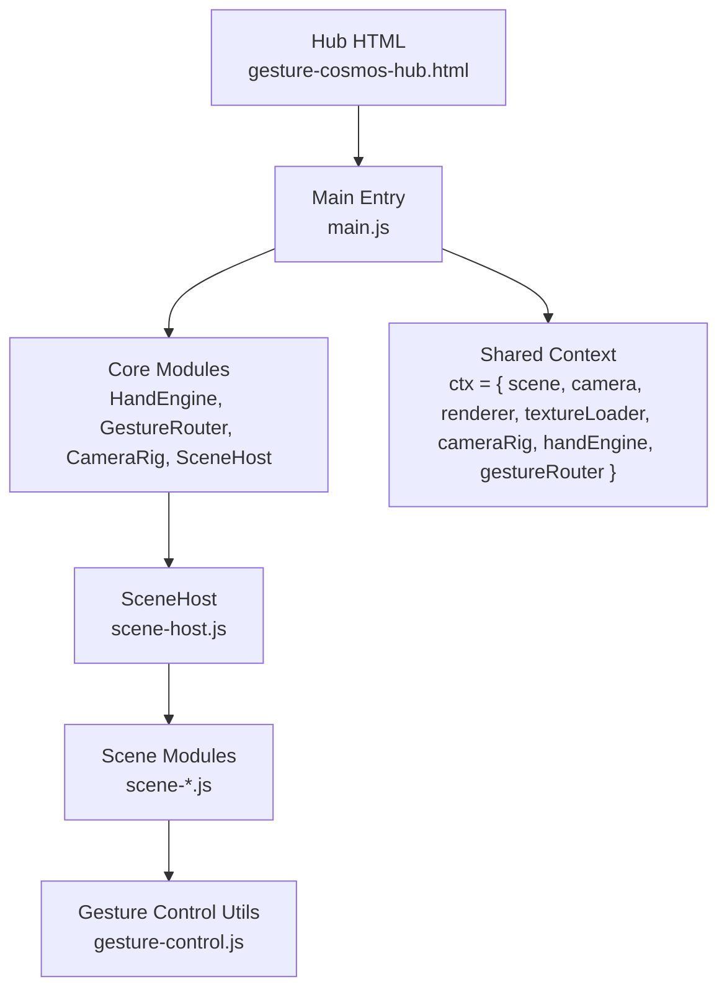
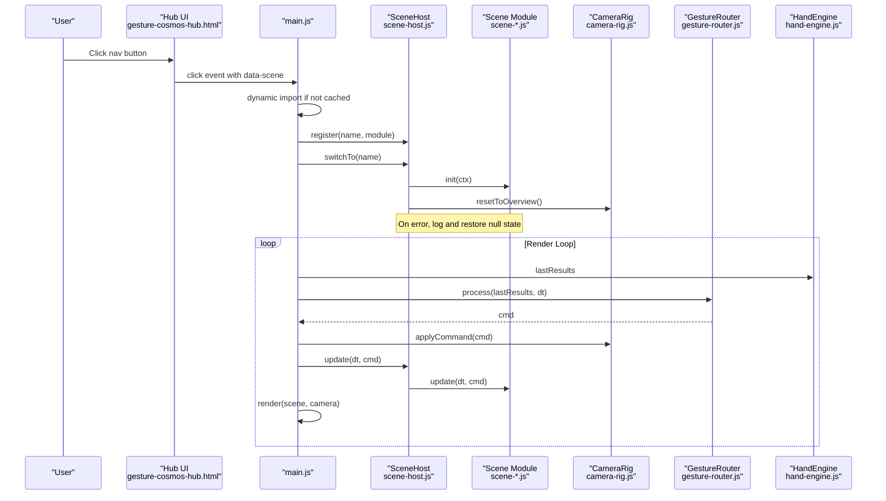
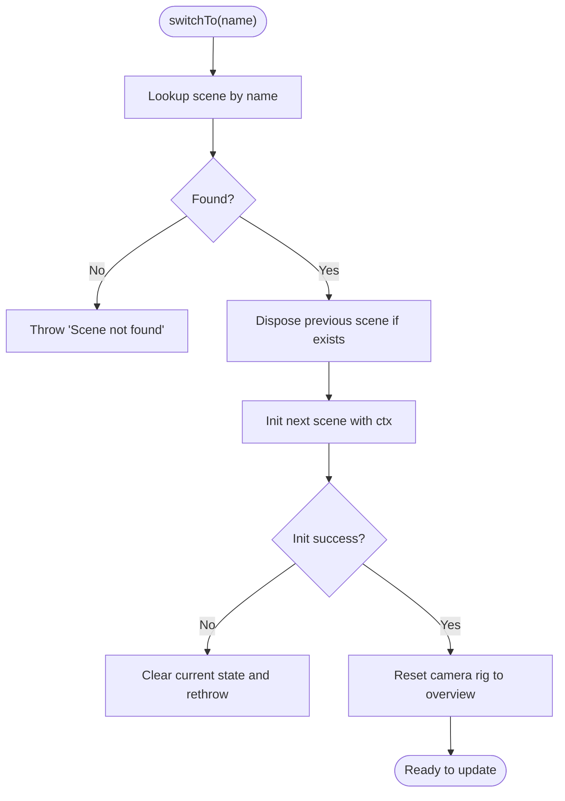
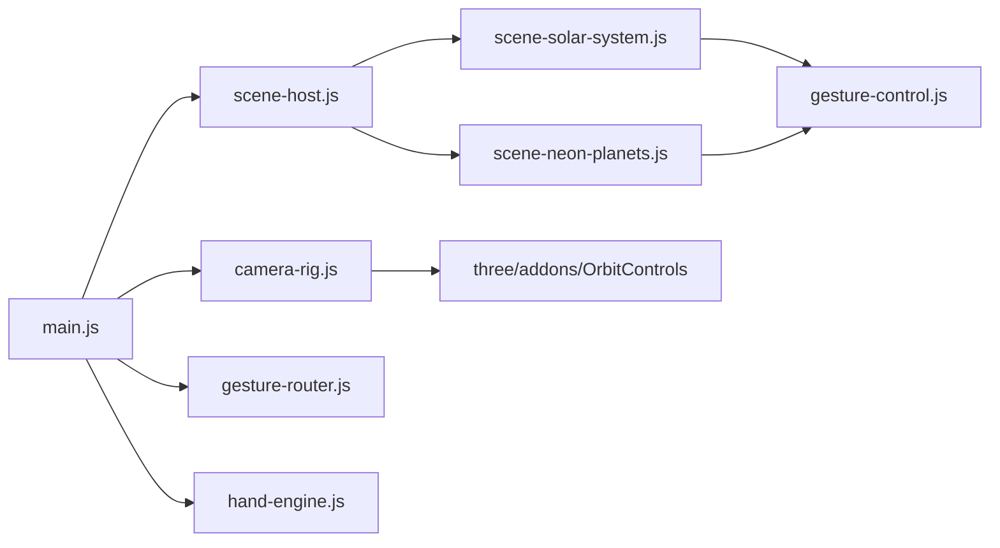

# Scene Host Architecture

<cite>
**Referenced Files in This Document**
- [scene-host.js](file://src/science/gesture-cosmos/core/scene-host.js)
- [main.js](file://src/science/gesture-cosmos/main.js)
- [gesture-control.js](file://src/science/gesture-cosmos/core/gesture-control.js)
- [hand-engine.js](file://src/science/gesture-cosmos/core/hand-engine.js)
- [gesture-router.js](file://src/science/gesture-cosmos/core/gesture-router.js)
- [camera-rig.js](file://src/science/gesture-cosmos/core/camera-rig.js)
- [scene-solar-system.js](file://src/science/gesture-cosmos/scenes/scene-solar-system.js)
- [scene-neon-planets.js](file://src/science/gesture-cosmos/scenes/scene-neon-planets.js)
- [gesture-cosmos-hub.html](file://src/science/gesture-cosmos-hub.html)
</cite>

## Table of Contents
1. [Introduction](#introduction)
2. [Project Structure](#project-structure)
3. [Core Components](#core-components)
4. [Architecture Overview](#architecture-overview)
5. [Detailed Component Analysis](#detailed-component-analysis)
6. [Dependency Analysis](#dependency-analysis)
7. [Performance Considerations](#performance-considerations)
8. [Troubleshooting Guide](#troubleshooting-guide)
9. [Conclusion](#conclusion)
10. [Appendices](#appendices)

## Introduction
This document explains the SceneHost class and its surrounding architecture for managing multiple 3D scenes within the Gesture Cosmos application. It covers:
- The scene registration pattern used by the hub to load and switch scenes on demand
- The shared context object structure passed into each scene module
- The scene switching workflow, including initialization, camera reset, and error handling
- The scene module interface requirements (name, init, update, dispose)
- Practical guidance for implementing custom scenes, resource cleanup, and debugging initialization failures

The goal is to provide a clear, practical guide for extending the system with new scenes while maintaining consistent lifecycle management and robust error handling.

## Project Structure
At a high level, the Gesture Cosmos hub initializes shared Three.js objects and core services, then uses SceneHost to manage scene modules. Each scene module implements a standard interface and receives a shared context that includes the Three.js scene, camera, renderer, texture loader, camera rig, hand engine, and gesture router.

**Diagram sources**
- [gesture-cosmos-hub.html:240-280](file://src/science/gesture-cosmos-hub.html#L240-L280)
- [main.js:1-187](file://src/science/gesture-cosmos/main.js#L1-L187)
- [scene-host.js:1-63](file://src/science/gesture-cosmos/core/scene-host.js#L1-L63)
- [gesture-control.js:1-88](file://src/science/gesture-cosmos/core/gesture-control.js#L1-L88)

**Section sources**
- [gesture-cosmos-hub.html:240-280](file://src/science/gesture-cosmos-hub.html#L240-L280)
- [main.js:1-187](file://src/science/gesture-cosmos/main.js#L1-L187)

## Core Components
- SceneHost: Manages scene registration, current scene state, and lifecycle transitions (init/update/dispose).
- Shared Context: A single object containing three.js primitives and runtime services passed to every scene.
- Scene Module Interface: Each scene exports name, init(ctx), update(dt, cmd), and optionally dispose().
- Gesture Pipeline: HandEngine captures hands, GestureRouter translates landmarks into commands, and scenes apply gestures via gesture-control utilities.

Key responsibilities:
- SceneHost ensures only one active scene at a time, disposes previous resources, initializes the next, and resets the camera view after successful init.
- The hub dynamically imports scene modules on first use and caches them via import() semantics.
- Scenes receive ctx to access shared resources and must implement proper cleanup in dispose().

**Section sources**
- [scene-host.js:1-63](file://src/science/gesture-cosmos/core/scene-host.js#L1-L63)
- [main.js:14-109](file://src/science/gesture-cosmos/main.js#L14-L109)
- [gesture-control.js:1-88](file://src/science/gesture-cosmos/core/gesture-control.js#L1-L88)

## Architecture Overview
The following diagram maps the runtime flow from user interaction to scene updates:

**Diagram sources**
- [gesture-cosmos-hub.html:240-280](file://src/science/gesture-cosmos-hub.html#L240-L280)
- [main.js:75-187](file://src/science/gesture-cosmos/main.js#L75-L187)
- [scene-host.js:31-61](file://src/science/gesture-cosmos/core/scene-host.js#L31-L61)
- [camera-rig.js:10-61](file://src/science/gesture-cosmos/core/camera-rig.js#L10-L61)
- [gesture-router.js:22-111](file://src/science/gesture-cosmos/core/gesture-router.js#L22-L111)
- [hand-engine.js:1-83](file://src/science/gesture-cosmos/core/hand-engine.js#L1-L83)

## Detailed Component Analysis

### SceneHost Class
Responsibilities:
- Maintain a registry of scene modules keyed by name
- Set and store the shared context
- Switch scenes safely: dispose previous, initialize next, reset camera, handle errors
- Update the current scene each frame

Implementation highlights:
- Registration: add scenes to an internal Map
- Context: set once from the hub; forwarded to each scene’s init
- Switching:
  - If a current scene exists, call dispose() if present and catch errors
  - Initialize the target scene with ctx
  - Reset camera rig to overview after successful init
  - On init failure, clear current state and rethrow so the hub can show feedback
- Update: forward dt and command to the current scene’s update method

Error handling:
- Disposal errors are caught and logged without breaking the switch
- Initialization errors are logged, state is cleared, and the error is rethrown to the caller

**Section sources**
- [scene-host.js:11-62](file://src/science/gesture-cosmos/core/scene-host.js#L11-L62)

### Shared Context Object
Structure:
- scene: THREE.Scene instance
- camera: THREE.PerspectiveCamera instance
- renderer: THREE.WebGLRenderer instance
- textureLoader: THREE.TextureLoader instance
- cameraRig: CameraRig instance providing focus/reset controls
- handEngine: HandEngine instance providing last results and lifecycle
- gestureRouter: GestureRouter instance producing unified control commands

Usage:
- Passed to each scene’s init(ctx)
- Scenes use it to create objects, load textures, and interact with camera and input systems

**Section sources**
- [main.js:34-64](file://src/science/gesture-cosmos/main.js#L34-L64)
- [scene-host.js:23-25](file://src/science/gesture-cosmos/core/scene-host.js#L23-L25)

### Scene Module Interface
Required exports:
- name: string identifier matching the key used in the hub’s navigation
- init(ctx): called once when the scene is switched to; sets up scene content and UI
- update(dt, cmd): called every frame with delta time and gesture command
- dispose(): optional but recommended; cleans up DOM elements, removes nodes from scene, disposes geometries/materials/textures, clears references

Example patterns:
- Solar System scene demonstrates creating groups, lights, textures, UI overlays, and comprehensive disposal
- Neon Planets scene shows particle-based geometry creation and careful disposal tracking

Best practices:
- Track all created Three.js objects and textures for disposal
- Remove any DOM elements added during init
- Reset or null out references to avoid leaks
- Use ctx.textureLoader for loading external assets and handle load errors gracefully

**Section sources**
- [scene-solar-system.js:268-439](file://src/science/gesture-cosmos/scenes/scene-solar-system.js#L268-L439)
- [scene-neon-planets.js:1-200](file://src/science/gesture-cosmos/scenes/scene-neon-planets.js#L1-L200)

### Gesture Pipeline Integration
Flow:
- HandEngine captures frames and provides lastResults
- GestureRouter.process converts landmarks into a normalized command object
- Scenes consume the command via gesture-control utilities to scale/rotate their root group and detect fist edges

Command shape:
- handDepth: number indicating apparent hand distance
- rotateY: delta rotation for open palm sliding
- fist: boolean debounced fist state
- openness: normalized openness metric

Gesture control utilities:
- createGestureState: per-scene state for smooth scaling and edge detection
- applyGestureControl: applies scale and rotation based on command and state

**Section sources**
- [hand-engine.js:1-83](file://src/science/gesture-cosmos/core/hand-engine.js#L1-L83)
- [gesture-router.js:22-111](file://src/science/gesture-cosmos/core/gesture-router.js#L22-L111)
- [gesture-control.js:1-88](file://src/science/gesture-cosmos/core/gesture-control.js#L1-L88)
- [scene-solar-system.js:362-404](file://src/science/gesture-cosmos/scenes/scene-solar-system.js#L362-L404)

### Scene Switching Workflow
Sequence:
1. User clicks a navigation button
2. Hub checks if the scene module is already registered; if not, dynamically imports it
3. Hub registers the module with SceneHost
4. Hub calls SceneHost.switchTo(name)
5. SceneHost disposes previous scene (if any)
6. SceneHost initializes the new scene with ctx
7. After successful init, SceneHost resets camera rig to overview
8. Errors during disposal are logged; errors during init are logged, state is cleared, and the error is rethrown
9. Hub catches errors and displays toast notifications

**Diagram sources**
- [scene-host.js:31-55](file://src/science/gesture-cosmos/core/scene-host.js#L31-L55)
- [main.js:78-109](file://src/science/gesture-cosmos/main.js#L78-L109)

**Section sources**
- [main.js:78-109](file://src/science/gesture-cosmos/main.js#L78-L109)
- [scene-host.js:31-55](file://src/science/gesture-cosmos/core/scene-host.js#L31-L55)

## Dependency Analysis
High-level dependencies:
- main.js depends on core modules and scene modules
- SceneHost depends on scene modules’ interface contracts
- Scenes depend on shared context and gesture-control utilities
- CameraRig depends on OrbitControls from three/addons
- GestureRouter depends on MediaPipe landmarks provided by HandEngine

**Diagram sources**
- [main.js:8-12](file://src/science/gesture-cosmos/main.js#L8-L12)
- [scene-host.js:1-63](file://src/science/gesture-cosmos/core/scene-host.js#L1-L63)
- [camera-rig.js:1-61](file://src/science/gesture-cosmos/core/camera-rig.js#L1-L61)
- [gesture-router.js:1-111](file://src/science/gesture-cosmos/core/gesture-router.js#L1-L111)
- [hand-engine.js:1-83](file://src/science/gesture-cosmos/core/hand-engine.js#L1-L83)
- [gesture-control.js:1-88](file://src/science/gesture-cosmos/core/gesture-control.js#L1-L88)
- [scene-solar-system.js:1-20](file://src/science/gesture-cosmos/scenes/scene-solar-system.js#L1-L20)
- [scene-neon-planets.js:1-20](file://src/science/gesture-cosmos/scenes/scene-neon-planets.js#L1-L20)

**Section sources**
- [main.js:8-12](file://src/science/gesture-cosmos/main.js#L8-L12)
- [camera-rig.js:1-61](file://src/science/gesture-cosmos/core/camera-rig.js#L1-L61)

## Performance Considerations
- Dynamic imports: Scenes are loaded on first switch, reducing initial bundle size and startup time
- Resource cleanup: Proper disposal of geometries, materials, textures, and DOM elements prevents memory leaks across scene switches
- Texture loading: Use ctx.textureLoader and handle load callbacks/errors to avoid blocking or broken backgrounds
- Gesture processing: Keep command computation lightweight; debounce fist state to reduce false triggers
- Rendering: Avoid heavy allocations in update loops; reuse buffers where possible

[No sources needed since this section provides general guidance]

## Troubleshooting Guide
Common issues and strategies:
- Scene not found: Ensure the scene name matches the key used in the hub’s navigation and that the module is registered before switching
- Scene initialization errors: Check console logs prefixed by SceneHost; verify ctx fields exist and are valid; ensure required DOM elements are present
- Camera not resetting: Confirm cameraRig.resetToOverview is reachable after init; validate camera and renderer sizes on window resize
- Gesture not affecting scene: Verify the scene passes the correct root group to applyGestureControl and that GestureRouter produces non-null commands
- Memory growth across switches: Validate dispose implementations remove nodes from scene, dispose geometries/materials/textures, and clear references

Practical steps:
- Add logging around init and dispose in your scene to track setup and teardown
- Inspect ctx.scene.children before and after dispose to confirm removal
- Temporarily disable gesture processing to isolate rendering issues
- Use browser dev tools to monitor WebGL contexts and textures

**Section sources**
- [scene-host.js:35-54](file://src/science/gesture-cosmos/core/scene-host.js#L35-L54)
- [main.js:86-109](file://src/science/gesture-cosmos/main.js#L86-L109)
- [scene-solar-system.js:406-439](file://src/science/gesture-cosmos/scenes/scene-solar-system.js#L406-L439)

## Conclusion
SceneHost provides a clean, robust mechanism for managing multiple 3D scenes with a consistent interface and lifecycle. By adhering to the established pattern—registering scenes, initializing with a shared context, updating per frame, and disposing resources—you can extend the Gesture Cosmos hub with new interactive experiences while maintaining performance and stability.

[No sources needed since this section summarizes without analyzing specific files]

## Appendices

### Implementing a Custom Scene: Checklist
- Export name matching the hub navigation key
- Implement init(ctx):
  - Create and attach scene content to ctx.scene
  - Load textures using ctx.textureLoader and handle errors
  - Optionally create UI overlays inside the designated container
- Implement update(dt, cmd):
  - Apply gestures via gesture-control utilities
  - Animate objects and respond to interactions
- Implement dispose():
  - Remove UI elements
  - Remove scene children and dispose geometries/materials/textures
  - Clear references and background settings

**Section sources**
- [scene-solar-system.js:268-439](file://src/science/gesture-cosmos/scenes/scene-solar-system.js#L268-L439)
- [gesture-control.js:1-88](file://src/science/gesture-cosmos/core/gesture-control.js#L1-L88)

### Debugging Scene Initialization Failures
- Log the exact error thrown during init and inspect ctx availability
- Verify dynamic import resolves correctly and returns a module with default export or named exports
- Ensure required DOM elements exist before adding UI
- Test camera reset behavior independently by calling cameraRig.resetToOverview manually

**Section sources**
- [main.js:86-109](file://src/science/gesture-cosmos/main.js#L86-L109)
- [scene-host.js:45-54](file://src/science/gesture-cosmos/core/scene-host.js#L45-L54)