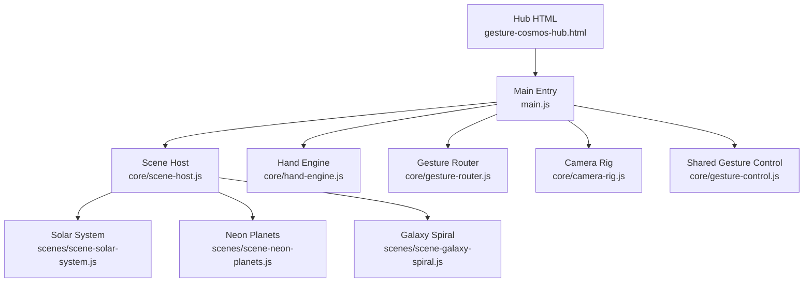
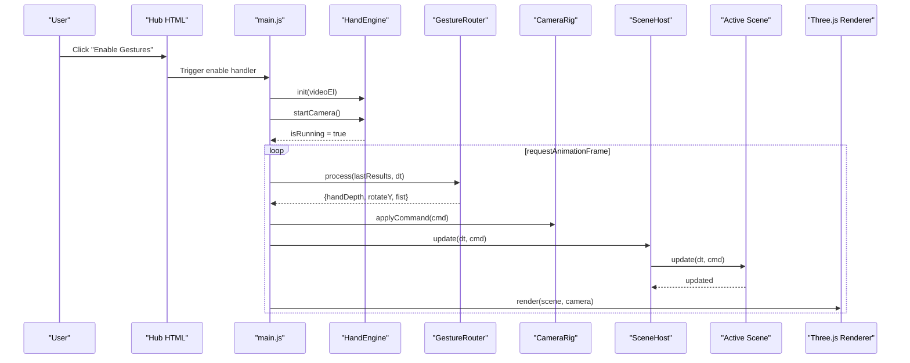
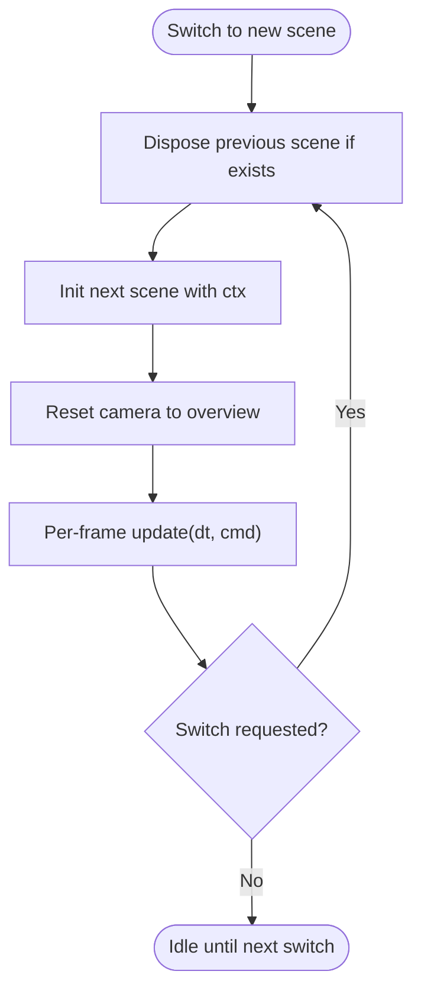
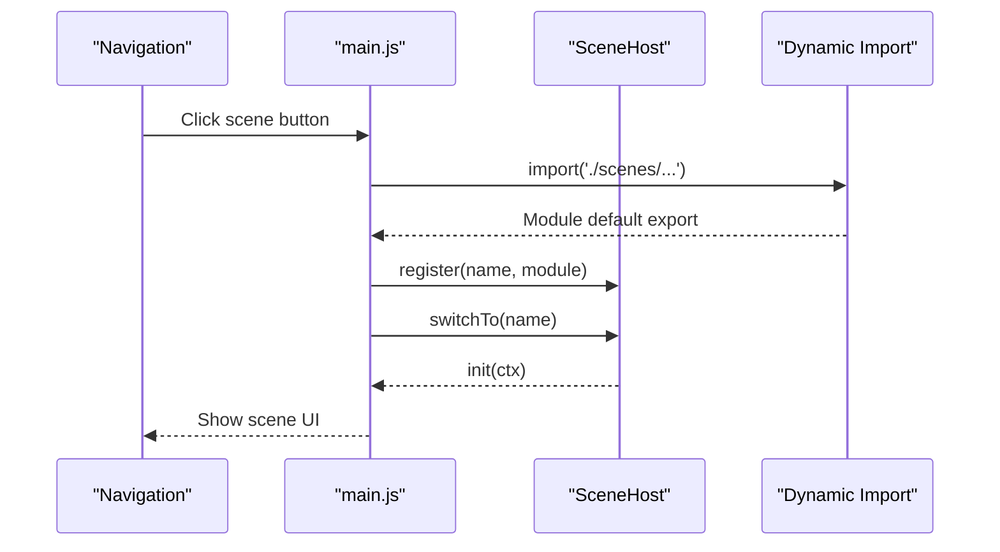
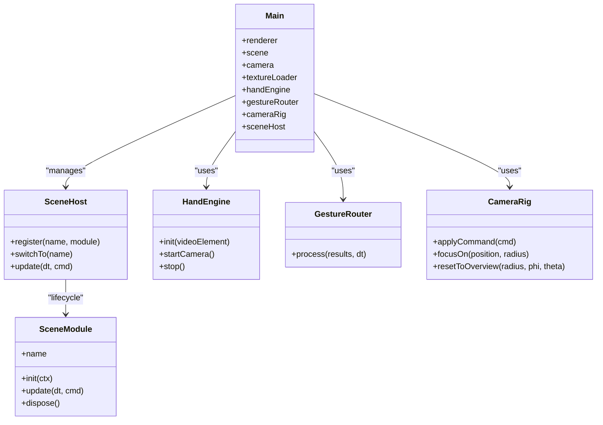

# Scene Rendering & Performance Optimization

<cite>
**Referenced Files in This Document**
- [gesture-cosmos-hub.html](file://src/science/gesture-cosmos-hub.html)
- [main.js](file://src/science/gesture-cosmos/main.js)
- [scene-host.js](file://src/science/gesture-cosmos/core/scene-host.js)
- [hand-engine.js](file://src/science/gesture-cosmos/core/hand-engine.js)
- [gesture-router.js](file://src/science/gesture-cosmos/core/gesture-router.js)
- [camera-rig.js](file://src/science/gesture-cosmos/core/camera-rig.js)
- [gesture-control.js](file://src/science/gesture-cosmos/core/gesture-control.js)
- [scene-solar-system.js](file://src/science/gesture-cosmos/scenes/scene-solar-system.js)
- [scene-neon-planets.js](file://src/science/gesture-cosmos/scenes/scene-neon-planets.js)
- [scene-galaxy-spiral.js](file://src/science/gesture-cosmos/scenes/scene-galaxy-spiral.js)
- [package.json](file://package.json)
- [vite.config.js](file://vite.config.js)
</cite>

## Table of Contents
1. [Introduction](#introduction)
2. [Project Structure](#project-structure)
3. [Core Components](#core-components)
4. [Architecture Overview](#architecture-overview)
5. [Detailed Component Analysis](#detailed-component-analysis)
6. [Dependency Analysis](#dependency-analysis)
7. [Performance Considerations](#performance-considerations)
8. [Troubleshooting Guide](#troubleshooting-guide)
9. [Conclusion](#conclusion)
10. [Appendices](#appendices)

## Introduction
This document provides a comprehensive guide to 3D rendering optimization and performance management for the Gesture Cosmos system. It focuses on memory management for large assets, texture loading strategies, efficient scene disposal, frame rate monitoring, adaptive quality settings, resource pooling patterns, profiling techniques, lazy loading of complex scenes, mobile considerations (battery, thermal throttling, reduced features), and cross-device/browser testing guidelines. The content is grounded in the actual implementation of the hub, core modules, and scene modules.

## Project Structure
The Gesture Cosmos application is organized around a central hub that initializes shared Three.js objects, orchestrates gesture input, and manages scene lifecycle. Scenes are implemented as independent modules with consistent init/update/dispose contracts.

**Diagram sources**
- [gesture-cosmos-hub.html:240-282](file://src/science/gesture-cosmos-hub.html#L240-L282)
- [main.js:1-187](file://src/science/gesture-cosmos/main.js#L1-L187)
- [scene-host.js:1-63](file://src/science/gesture-cosmos/core/scene-host.js#L1-L63)
- [hand-engine.js:1-83](file://src/science/gesture-cosmos/core/hand-engine.js#L1-L83)
- [gesture-router.js:1-111](file://src/science/gesture-cosmos/core/gesture-router.js#L1-L111)
- [camera-rig.js:1-61](file://src/science/gesture-cosmos/core/camera-rig.js#L1-L61)
- [gesture-control.js:1-88](file://src/science/gesture-cosmos/core/gesture-control.js#L1-L88)
- [scene-solar-system.js:1-439](file://src/science/gesture-cosmos/scenes/scene-solar-system.js#L1-L439)
- [scene-neon-planets.js:1-340](file://src/science/gesture-cosmos/scenes/scene-neon-planets.js#L1-L340)
- [scene-galaxy-spiral.js:1-338](file://src/science/gesture-cosmos/scenes/scene-galaxy-spiral.js#L1-L338)

**Section sources**
- [gesture-cosmos-hub.html:240-282](file://src/science/gesture-cosmos-hub.html#L240-L282)
- [main.js:1-187](file://src/science/gesture-cosmos/main.js#L1-L187)

## Core Components
- Hub HTML: Provides UI overlays, navigation, permission prompts, and loads the main module via importmap.
- Main entry: Creates shared renderer, scene, camera, and passes them into core modules; implements dynamic scene switching and render loop.
- Scene host: Manages registration, initialization, update, and disposal of scenes.
- Hand engine: Wraps MediaPipe Hands/Camera utilities, handles permissions, frames, and results.
- Gesture router: Translates raw landmarks into normalized commands (scale, rotation, fist).
- Camera rig: Mouse/touch orbit controls; resets to overview positions.
- Shared gesture control: Applies smooth scale and rotation to scene root based on gestures.
- Scenes: Implement consistent lifecycle and dispose patterns; manage textures, geometries, materials, and DOM UI.

Key responsibilities and interactions:
- Dynamic imports per scene enable lazy loading.
- SceneHost ensures previous scene disposal before next scene init.
- HandEngine runs MediaPipe detection at fixed resolution and emits results each frame.
- GestureRouter debounces fist state and computes hand depth and rotation deltas.
- CameraRig updates OrbitControls damping and supports focus/reset.
- Each scene owns its resources and disposes them fully on switch.

**Section sources**
- [gesture-cosmos-hub.html:240-282](file://src/science/gesture-cosmos-hub.html#L240-L282)
- [main.js:1-187](file://src/science/gesture-cosmos/main.js#L1-L187)
- [scene-host.js:1-63](file://src/science/gesture-cosmos/core/scene-host.js#L1-L63)
- [hand-engine.js:1-83](file://src/science/gesture-cosmos/core/hand-engine.js#L1-L83)
- [gesture-router.js:1-111](file://src/science/gesture-cosmos/core/gesture-router.js#L1-L111)
- [camera-rig.js:1-61](file://src/science/gesture-cosmos/core/camera-rig.js#L1-L61)
- [gesture-control.js:1-88](file://src/science/gesture-cosmos/core/gesture-control.js#L1-L88)
- [scene-solar-system.js:1-439](file://src/science/gesture-cosmos/scenes/scene-solar-system.js#L1-L439)
- [scene-neon-planets.js:1-340](file://src/science/gesture-cosmos/scenes/scene-neon-planets.js#L1-L340)
- [scene-galaxy-spiral.js:1-338](file://src/science/gesture-cosmos/scenes/scene-galaxy-spiral.js#L1-L338)

## Architecture Overview
The runtime flow centers on a single render loop that processes gestures, updates the active scene, and renders the Three.js scene.

**Diagram sources**
- [main.js:116-187](file://src/science/gesture-cosmos/main.js#L116-L187)
- [hand-engine.js:21-71](file://src/science/gesture-cosmos/core/hand-engine.js#L21-L71)
- [gesture-router.js:34-111](file://src/science/gesture-cosmos/core/gesture-router.js#L34-L111)
- [camera-rig.js:26-32](file://src/science/gesture-cosmos/core/camera-rig.js#L26-L32)
- [scene-host.js:57-61](file://src/science/gesture-cosmos/core/scene-host.js#L57-L61)

## Detailed Component Analysis

### Scene Lifecycle and Disposal Patterns
SceneHost coordinates scene transitions by disposing the current scene before initializing the next. Each scene must implement dispose to remove DOM elements, detach from scene graph, and release Three.js resources.

**Diagram sources**
- [scene-host.js:31-55](file://src/science/gesture-cosmos/core/scene-host.js#L31-L55)

Practical disposal examples:
- Solar System: Removes UI, detaches groups, disposes geometries/materials/textures, clears background.
- Neon Planets: Removes UI, detaches groups, disposes tracked geometries/materials/textures, clears fog/background, resets camera.
- Galaxy Spiral: Removes UI, detaches particle systems, disposes geometry/materials, clears fog.

**Section sources**
- [scene-host.js:31-55](file://src/science/gesture-cosmos/core/scene-host.js#L31-L55)
- [scene-solar-system.js:406-439](file://src/science/gesture-cosmos/scenes/scene-solar-system.js#L406-L439)
- [scene-neon-planets.js:307-340](file://src/science/gesture-cosmos/scenes/scene-neon-planets.js#L307-L340)
- [scene-galaxy-spiral.js:311-338](file://src/science/gesture-cosmos/scenes/scene-galaxy-spiral.js#L311-L338)

### Memory Management Strategies for Large 3D Assets
- Texture management:
  - Centralized TextureLoader instance passed to scenes.
  - Scenes track loaded textures and dispose them during cleanup.
  - Background textures use equirectangular mapping where applicable.
- Geometry and material lifecycle:
  - Scenes maintain arrays of disposables and remove objects from scene graph before disposal.
  - For particle-based scenes, original position buffers are stored in geometry userData for reconstruction after explosion effects.
- Background and environment:
  - Clearing scene.background and scene.fog on dispose prevents lingering references.

Recommendations aligned with code:
- Always dispose textures, materials, and geometries explicitly in scene.dispose().
- Remove all nodes from parent before disposal to avoid dangling references.
- Avoid creating new textures or geometries inside update loops; preallocate and reuse.

**Section sources**
- [main.js:45-62](file://src/science/gesture-cosmos/main.js#L45-L62)
- [scene-solar-system.js:288-296](file://src/science/gesture-cosmos/scenes/scene-solar-system.js#L288-L296)
- [scene-solar-system.js:406-439](file://src/science/gesture-cosmos/scenes/scene-solar-system.js#L406-L439)
- [scene-neon-planets.js:307-340](file://src/science/gesture-cosmos/scenes/scene-neon-planets.js#L307-L340)
- [scene-galaxy-spiral.js:311-338](file://src/science/gesture-cosmos/scenes/scene-galaxy-spiral.js#L311-L338)

### Texture Loading Optimization
- Use a single shared TextureLoader to reduce overhead and simplify tracking.
- Provide error callbacks when loading background textures; fallback to solid color on failure.
- Prefer canvas-generated textures for glow effects to avoid network requests.

Implementation highlights:
- Shared loader created once in main and injected into scenes.
- Background texture load includes success and error handlers.
- Glow textures generated via CanvasTexture to minimize I/O.

**Section sources**
- [main.js:45-62](file://src/science/gesture-cosmos/main.js#L45-L62)
- [scene-solar-system.js:288-296](file://src/science/gesture-cosmos/scenes/scene-solar-system.js#L288-L296)
- [scene-neon-planets.js:38-52](file://src/science/gesture-cosmos/scenes/scene-neon-planets.js#L38-L52)
- [scene-galaxy-spiral.js:85-101](file://src/science/gesture-cosmos/scenes/scene-galaxy-spiral.js#L85-L101)

### Efficient Scene Disposal Patterns
- Remove UI elements from DOM before disposal.
- Detach all scene graph nodes from parents.
- Dispose BufferGeometry, Material, and Texture instances.
- Clear scene-level properties like background and fog.
- Reset camera to overview to avoid residual transforms affecting other scenes.

**Section sources**
- [scene-solar-system.js:406-439](file://src/science/gesture-cosmos/scenes/scene-solar-system.js#L406-L439)
- [scene-neon-planets.js:307-340](file://src/science/gesture-cosmos/scenes/scene-neon-planets.js#L307-L340)
- [scene-galaxy-spiral.js:311-338](file://src/science/gesture-cosmos/scenes/scene-galaxy-spiral.js#L311-L338)

### Frame Rate Monitoring and Adaptive Quality
- Built-in FPS display in Galaxy Spiral status HUD using delta time.
- Recommended adaptive strategies:
  - Reduce particle counts dynamically based on measured FPS.
  - Lower pixel ratio on high-DPI devices.
  - Disable shadows or reduce shadow map sizes under load.
  - Adjust fog density or disable post-processing-like effects.

Current implementations:
- FPS readout computed from dt and displayed in UI.
- Pixel ratio capped at 2 in main renderer setup.

**Section sources**
- [scene-galaxy-spiral.js:292-294](file://src/science/gesture-cosmos/scenes/scene-galaxy-spiral.js#L292-L294)
- [main.js:40-43](file://src/science/gesture-cosmos/main.js#L40-L43)

### Resource Pooling Techniques
While not explicitly implemented as a pool, the codebase demonstrates reusable patterns:
- Reuse shared TextureLoader across scenes.
- Generate reusable CanvasTexture for glow effects once and reuse across scenes.
- Maintain disposables arrays to batch-release resources.

Enhancement suggestions:
- Implement a simple texture cache keyed by URL to avoid duplicate loads.
- Create a geometry/material pool for frequently reused primitives.
- Precompute particle offsets and store them for reuse across transitions.

**Section sources**
- [main.js:45-62](file://src/science/gesture-cosmos/main.js#L45-L62)
- [scene-neon-planets.js:38-52](file://src/science/gesture-cosmos/scenes/scene-neon-planets.js#L38-L52)
- [scene-galaxy-spiral.js:85-101](file://src/science/gesture-cosmos/scenes/scene-galaxy-spiral.js#L85-L101)

### Lazy Loading for Complex Scenes
- Scenes are imported dynamically only when first selected, reducing initial bundle size and startup time.
- Error handling shows user feedback and reverts UI state on load/init failures.

**Diagram sources**
- [main.js:78-109](file://src/science/gesture-cosmos/main.js#L78-L109)
- [scene-host.js:31-55](file://src/science/gesture-cosmos/core/scene-host.js#L31-L55)

**Section sources**
- [main.js:78-109](file://src/science/gesture-cosmos/main.js#L78-L109)
- [scene-host.js:31-55](file://src/science/gesture-cosmos/core/scene-host.js#L31-L55)

### Mobile Device Considerations
- Battery usage:
  - Limit camera resolution and processing frequency.
  - Cap pixel ratio to reduce GPU workload.
- Thermal throttling:
  - Monitor FPS and adaptively reduce complexity (particles, shadows).
- Reduced feature sets:
  - Graceful fallback when MediaPipe is unavailable; continue with mouse controls.

Evidence in code:
- Camera initialized at 640x480.
- Pixel ratio capped at 2.
- Permission overlay and toast messages handle errors and provide fallback UX.

**Section sources**
- [hand-engine.js:55-69](file://src/science/gesture-cosmos/core/hand-engine.js#L55-L69)
- [main.js:40-43](file://src/science/gesture-cosmos/main.js#L40-L43)
- [main.js:116-130](file://src/science/gesture-cosmos/main.js#L116-L130)

### Testing Performance Across Hardware and Browsers
Guidelines:
- Test on low-end mobile devices and desktops with varying GPU capabilities.
- Measure FPS under different conditions: static view vs. heavy interaction.
- Validate texture loading behavior over slow networks and offline scenarios.
- Ensure graceful degradation when camera access is denied.

Build and preview:
- Development server and build pipeline configured via Vite.
- Minification enabled; console logs preserved for debugging.

**Section sources**
- [package.json:1-20](file://package.json#L1-L20)
- [vite.config.js:47-69](file://vite.config.js#L47-L69)

## Dependency Analysis
High-level dependencies among core components:

**Diagram sources**
- [main.js:1-187](file://src/science/gesture-cosmos/main.js#L1-L187)
- [scene-host.js:1-63](file://src/science/gesture-cosmos/core/scene-host.js#L1-L63)
- [hand-engine.js:1-83](file://src/science/gesture-cosmos/core/hand-engine.js#L1-L83)
- [gesture-router.js:1-111](file://src/science/gesture-cosmos/core/gesture-router.js#L1-L111)
- [camera-rig.js:1-61](file://src/science/gesture-cosmos/core/camera-rig.js#L1-L61)

**Section sources**
- [main.js:1-187](file://src/science/gesture-cosmos/main.js#L1-L187)
- [scene-host.js:1-63](file://src/science/gesture-cosmos/core/scene-host.js#L1-L63)
- [hand-engine.js:1-83](file://src/science/gesture-cosmos/core/hand-engine.js#L1-L83)
- [gesture-router.js:1-111](file://src/science/gesture-cosmos/core/gesture-router.js#L1-L111)
- [camera-rig.js:1-61](file://src/science/gesture-cosmos/core/camera-rig.js#L1-L61)

## Performance Considerations
- Render loop efficiency:
  - Delta time clamped to prevent large jumps.
  - OrbitControls damping applied every frame.
- GPU cost reduction:
  - Particle-based scenes avoid heavy shading by using vertex colors and additive blending.
  - Shadows disabled for certain elements (e.g., sun light source).
- CPU cost reduction:
  - Gesture processing uses lightweight math and debouncing to avoid frequent state changes.
- Network cost reduction:
  - Dynamic imports defer non-critical scene code.
  - External CDN imports externalized in build config to leverage caching.

[No sources needed since this section provides general guidance]

## Troubleshooting Guide
Common issues and resolutions:
- Camera/MediaPipe initialization fails:
  - Check permission overlay and toast messages.
  - Verify video element availability and browser support.
- Scene load/init errors:
  - Inspect console errors and ensure dynamic import paths resolve.
  - Confirm scene modules export required functions.
- Memory leaks:
  - Ensure all textures, materials, and geometries are disposed in scene.dispose().
  - Remove UI elements and clear scene background/fog.
- Stale camera state:
  - Reset camera to overview after scene init to avoid residual transforms.

**Section sources**
- [main.js:116-130](file://src/science/gesture-cosmos/main.js#L116-L130)
- [main.js:78-109](file://src/science/gesture-cosmos/main.js#L78-L109)
- [scene-host.js:31-55](file://src/science/gesture-cosmos/core/scene-host.js#L31-L55)
- [scene-solar-system.js:406-439](file://src/science/gesture-cosmos/scenes/scene-solar-system.js#L406-L439)
- [scene-neon-planets.js:307-340](file://src/science/gesture-cosmos/scenes/scene-neon-planets.js#L307-L340)
- [scene-galaxy-spiral.js:311-338](file://src/science/gesture-cosmos/scenes/scene-galaxy-spiral.js#L311-L338)

## Conclusion
The Gesture Cosmos system employs a modular architecture with clear separation of concerns, enabling effective performance management. By leveraging dynamic imports, explicit resource disposal, shared loaders, and adaptive rendering practices, the application can scale across devices while maintaining responsive interactions. The provided diagrams and references offer actionable insights for optimizing memory, textures, and frame rates, along with practical steps for profiling and testing across hardware configurations.

[No sources needed since this section summarizes without analyzing specific files]

## Appendices
- Build configuration notes:
  - Externalize Three.js and CDN imports to improve caching and reduce bundle size.
  - Enable minification and preserve console logs for debugging.

**Section sources**
- [vite.config.js:47-69](file://vite.config.js#L47-L69)
- [package.json:1-20](file://package.json#L1-L20)