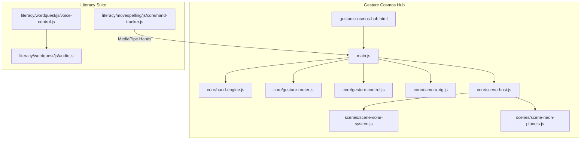
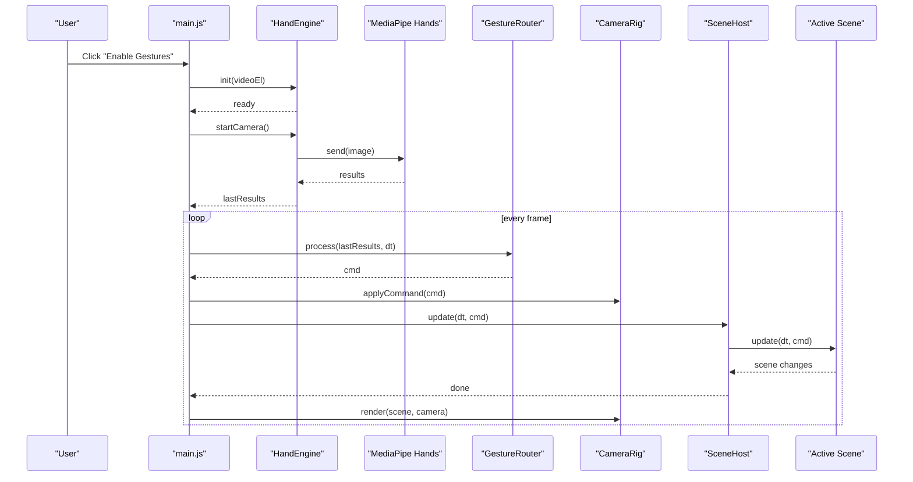
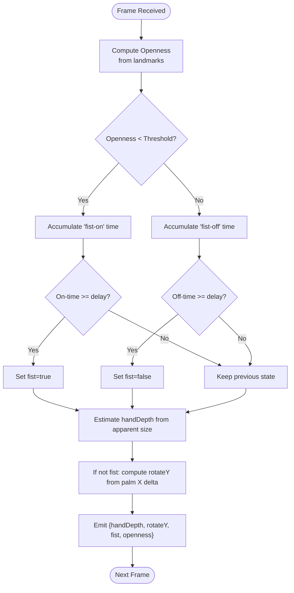
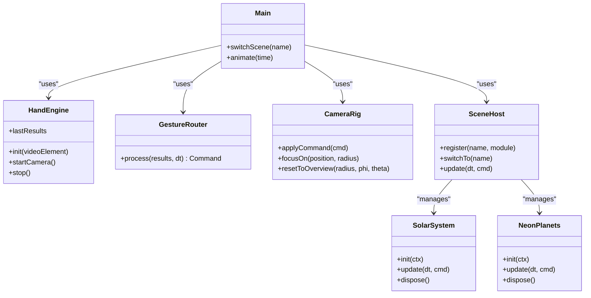
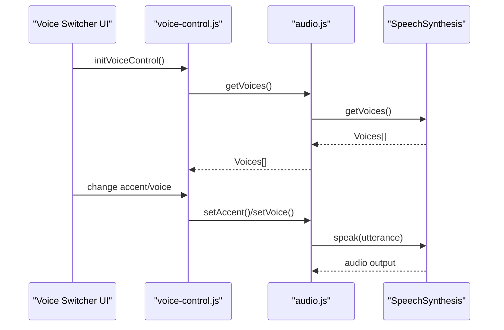
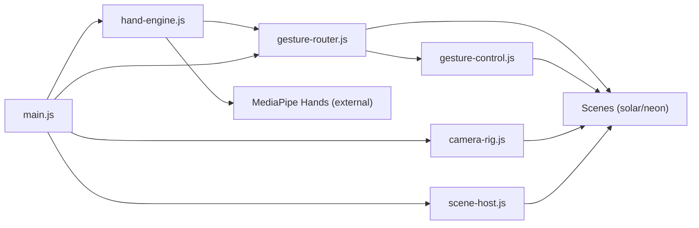

# Advanced Features & Technologies

<cite>
**Referenced Files in This Document**
- [main.js](file://src/science/gesture-cosmos/main.js)
- [hand-engine.js](file://src/science/gesture-cosmos/core/hand-engine.js)
- [gesture-router.js](file://src/science/gesture-cosmos/core/gesture-router.js)
- [gesture-control.js](file://src/science/gesture-cosmos/core/gesture-control.js)
- [camera-rig.js](file://src/science/gesture-cosmos/core/camera-rig.js)
- [scene-host.js](file://src/science/gesture-cosmos/core/scene-host.js)
- [scene-solar-system.js](file://src/science/gesture-cosmos/scenes/scene-solar-system.js)
- [scene-neon-planets.js](file://src/science/gesture-cosmos/scenes/scene-neon-planets.js)
- [gesture-cosmos-hub.html](file://src/science/gesture-cosmos-hub.html)
- [hand-tracker.js](file://src/literacy/movespelling/js/core/hand-tracker.js)
- [voice-control.js](file://src/literacy/wordquest/js/voice-control.js)
- [audio.js](file://src/literacy/wordquest/js/audio.js)
</cite>

## Table of Contents
1. Introduction
2. Project Structure
3. Core Components
4. Architecture Overview
5. Detailed Component Analysis
6. Dependency Analysis
7. Performance Considerations
8. Troubleshooting Guide
9. Conclusion
10. Appendices

## Introduction
This document explains the advanced features and technologies powering the IB PYP Games platform, focusing on:
- Gesture recognition using MediaPipe for hand tracking (algorithm design, privacy, local processing benefits)
- 3D graphics pipeline with Three.js scene management, camera control systems, and performance optimization techniques
- Voice control integration for accessibility via speech synthesis APIs
- Implementation examples to extend gesture commands, create new 3D scenes, and integrate additional input methods
- Performance monitoring, memory management, debugging techniques, and troubleshooting guides for hardware-dependent features like cameras and microphones

## Project Structure
The Gesture Cosmos hub is a Three.js application that composes core modules (hand engine, gesture router, camera rig, scene host) and dynamically loads scene modules. The literacy suite includes a separate MediaPipe-based hand tracker and a voice control module built on Web Speech API.

**Diagram sources**
- [main.js:1-187](file://src/science/gesture-cosmos/main.js#L1-L187)
- [hand-engine.js:1-83](file://src/science/gesture-cosmos/core/hand-engine.js#L1-L83)
- [gesture-router.js:1-111](file://src/science/gesture-cosmos/core/gesture-router.js#L1-L111)
- [gesture-control.js:1-88](file://src/science/gesture-cosmos/core/gesture-control.js#L1-L88)
- [camera-rig.js:1-61](file://src/science/gesture-cosmos/core/camera-rig.js#L1-L61)
- [scene-host.js:1-63](file://src/science/gesture-cosmos/core/scene-host.js#L1-L63)
- [scene-solar-system.js:1-439](file://src/science/gesture-cosmos/scenes/scene-solar-system.js#L1-L439)
- [scene-neon-planets.js:1-200](file://src/science/gesture-cosmos/scenes/scene-neon-planets.js#L1-L200)
- [gesture-cosmos-hub.html:1-200](file://src/science/gesture-cosmos-hub.html#L1-L200)
- [hand-tracker.js:1-504](file://src/literacy/movespelling/js/core/hand-tracker.js#L1-L504)
- [voice-control.js:1-157](file://src/literacy/wordquest/js/voice-control.js#L1-L157)
- [audio.js:1-202](file://src/literacy/wordquest/js/audio.js#L1-L202)

**Section sources**
- [main.js:1-187](file://src/science/gesture-cosmos/main.js#L1-L187)
- [gesture-cosmos-hub.html:1-200](file://src/science/gesture-cosmos-hub.html#L1-L200)

## Core Components
- HandEngine: Wraps MediaPipe Hands and Camera utilities; initializes models, starts camera feed, and publishes results.
- GestureRouter: Translates raw landmarks into unified commands (scale by depth, rotate by palm slide, fist state).
- GestureControl: Shared per-scene state machine for smooth scale transitions and edge detection for fist rising/falling.
- CameraRig: Mouse/touch orbit controller via OrbitControls; provides focus/reset helpers.
- SceneHost: Manages lifecycle of dynamic scene modules (init/update/dispose), resets camera on switch.
- Scenes: Example implementations (Solar System, Neon Planets) demonstrating object manipulation and particle effects.
- Literacy HandTracker: Alternative MediaPipe integration with frame-rate limiting, debouncing, and error recovery.
- Voice Control: Web Speech API wrapper for selecting voices/accent and speaking text; UI wiring for preferences.

**Section sources**
- [hand-engine.js:1-83](file://src/science/gesture-cosmos/core/hand-engine.js#L1-L83)
- [gesture-router.js:1-111](file://src/science/gesture-cosmos/core/gesture-router.js#L1-L111)
- [gesture-control.js:1-88](file://src/science/gesture-cosmos/core/gesture-control.js#L1-L88)
- [camera-rig.js:1-61](file://src/science/gesture-cosmos/core/camera-rig.js#L1-L61)
- [scene-host.js:1-63](file://src/science/gesture-cosmos/core/scene-host.js#L1-L63)
- [scene-solar-system.js:1-439](file://src/science/gesture-cosmos/scenes/scene-solar-system.js#L1-L439)
- [scene-neon-planets.js:1-200](file://src/science/gesture-cosmos/scenes/scene-neon-planets.js#L1-L200)
- [hand-tracker.js:1-504](file://src/literacy/movespelling/js/core/hand-tracker.js#L1-L504)
- [voice-control.js:1-157](file://src/literacy/wordquest/js/voice-control.js#L1-L157)
- [audio.js:1-202](file://src/literacy/wordquest/js/audio.js#L1-L202)

## Architecture Overview
The runtime orchestrates camera access, hand tracking, command generation, and scene updates each frame.

**Diagram sources**
- [main.js:116-187](file://src/science/gesture-cosmos/main.js#L116-L187)
- [hand-engine.js:21-71](file://src/science/gesture-cosmos/core/hand-engine.js#L21-L71)
- [gesture-router.js:34-111](file://src/science/gesture-cosmos/core/gesture-router.js#L34-L111)
- [camera-rig.js:30-32](file://src/science/gesture-cosmos/core/camera-rig.js#L30-L32)
- [scene-host.js:57-61](file://src/science/gesture-cosmos/core/scene-host.js#L57-L61)

## Detailed Component Analysis

### Gesture Recognition System (MediaPipe)
- Algorithm overview:
  - Openness estimation from fingertip-to-wrist distances; thresholds define open vs fist states with hysteresis to avoid flicker.
  - Depth proxy derived from apparent hand size; maps to target scale range.
  - Palm X movement mapped to Y-axis rotation when not in fist state.
  - Edge detection emits one-frame signals for fist rising/falling to trigger explode/reconstruct effects.
- Privacy and local processing:
  - All processing occurs locally in the browser; no video frames are uploaded.
  - Camera permission requested only after explicit user action; fallback to mouse controls if denied.
- Implementation highlights:
  - HandEngine initializes MediaPipe Hands and Camera, sets options, and streams frames.
  - GestureRouter computes openness, fist state, handDepth, and rotateY deltas.
  - GestureControl applies smoothed scaling and rotation to scene root groups.

**Diagram sources**
- [gesture-router.js:34-111](file://src/science/gesture-cosmos/core/gesture-router.js#L34-L111)

**Section sources**
- [hand-engine.js:21-71](file://src/science/gesture-cosmos/core/hand-engine.js#L21-L71)
- [gesture-router.js:34-111](file://src/science/gesture-cosmos/core/gesture-router.js#L34-L111)
- [gesture-control.js:50-83](file://src/science/gesture-cosmos/core/gesture-control.js#L50-L83)
- [gesture-cosmos-hub.html:69-121](file://src/science/gesture-cosmos-hub.html#L69-L121)

### 3D Graphics Pipeline (Three.js)
- Scene management:
  - SceneHost registers and switches scene modules, calling init/update/dispose.
  - Dynamic imports load scenes on demand to reduce initial payload.
- Camera control:
  - CameraRig uses OrbitControls for mouse/touch orbiting and zoom; supports focus/reset helpers.
- Rendering loop:
  - main.js drives requestAnimationFrame, processes gestures, updates camera rig, and renders the active scene.
- Optimization techniques:
  - Pixel ratio capped to balance quality/performance.
  - Background star particles created once and reused.
  - Scene-specific geometry/material disposal on unload.

**Diagram sources**
- [main.js:1-187](file://src/science/gesture-cosmos/main.js#L1-L187)
- [hand-engine.js:1-83](file://src/science/gesture-cosmos/core/hand-engine.js#L1-L83)
- [gesture-router.js:1-111](file://src/science/gesture-cosmos/core/gesture-router.js#L1-L111)
- [camera-rig.js:1-61](file://src/science/gesture-cosmos/core/camera-rig.js#L1-L61)
- [scene-host.js:1-63](file://src/science/gesture-cosmos/core/scene-host.js#L1-L63)
- [scene-solar-system.js:1-439](file://src/science/gesture-cosmos/scenes/scene-solar-system.js#L1-L439)
- [scene-neon-planets.js:1-200](file://src/science/gesture-cosmos/scenes/scene-neon-planets.js#L1-L200)

**Section sources**
- [main.js:34-64](file://src/science/gesture-cosmos/main.js#L34-L64)
- [main.js:139-187](file://src/science/gesture-cosmos/main.js#L139-L187)
- [camera-rig.js:10-61](file://src/science/gesture-cosmos/core/camera-rig.js#L10-L61)
- [scene-host.js:19-61](file://src/science/gesture-cosmos/core/scene-host.js#L19-L61)
- [scene-solar-system.js:268-300](file://src/science/gesture-cosmos/scenes/scene-solar-system.js#L268-L300)
- [scene-neon-planets.js:117-200](file://src/science/gesture-cosmos/scenes/scene-neon-planets.js#L117-L200)

### Voice Control Integration (Accessibility)
- Speech synthesis:
  - audio.js exposes a simple API to unlock, select voices/accent, and speak text.
  - Preferences persisted in localStorage; restored across sessions.
- UI wiring:
  - voice-control.js populates a dropdown grouped by accent, wires buttons, and previews selection.
- Natural language feedback:
  - While there is no server-side NLP, the system can provide spoken feedback based on game events through the speech API.

**Diagram sources**
- [voice-control.js:17-145](file://src/literacy/wordquest/js/voice-control.js#L17-L145)
- [audio.js:22-118](file://src/literacy/wordquest/js/audio.js#L22-L118)

**Section sources**
- [voice-control.js:17-145](file://src/literacy/wordquest/js/voice-control.js#L17-L145)
- [audio.js:22-118](file://src/literacy/wordquest/js/audio.js#L22-L118)

### Extensibility Examples

#### Extend Gesture Commands
- Add a new command type in GestureRouter.process():
  - Compute a new metric from landmarks (e.g., pinch distance between thumb and index).
  - Emit it in the returned command object.
- Consume in a scene:
  - In scene.update(), read the new field and adjust behavior (e.g., color intensity or particle emission rate).
- Reference paths:
  - [gesture-router.js:34-111](file://src/science/gesture-cosmos/core/gesture-router.js#L34-L111)
  - [scene-solar-system.js:362-404](file://src/science/gesture-cosmos/scenes/scene-solar-system.js#L362-L404)

#### Create a New 3D Scene
- Implement a module exporting name, init(ctx), update(dt, cmd), dispose().
- Use ctx.scene, ctx.camera, ctx.renderer, ctx.textureLoader, ctx.cameraRig, ctx.handEngine, ctx.gestureRouter.
- Register via SceneHost.register() and switch via SceneHost.switchTo().
- Reference paths:
  - [scene-host.js:19-55](file://src/science/gesture-cosmos/core/scene-host.js#L19-L55)
  - [scene-solar-system.js:268-300](file://src/science/gesture-cosmos/scenes/scene-solar-system.js#L268-L300)

#### Integrate Additional Input Methods
- For keyboard/mouse extensions, add event listeners in the hub or scene and translate them into compatible command objects consumed by scenes.
- Reference paths:
  - [main.js:111-114](file://src/science/gesture-cosmos/main.js#L111-L114)
  - [camera-rig.js:10-32](file://src/science/gesture-cosmos/core/camera-rig.js#L10-L32)

## Dependency Analysis
High-level dependencies among core modules and scenes:

**Diagram sources**
- [main.js:1-64](file://src/science/gesture-cosmos/main.js#L1-L64)
- [hand-engine.js:1-83](file://src/science/gesture-cosmos/core/hand-engine.js#L1-L83)
- [gesture-router.js:1-111](file://src/science/gesture-cosmos/core/gesture-router.js#L1-L111)
- [gesture-control.js:1-88](file://src/science/gesture-cosmos/core/gesture-control.js#L1-L88)
- [camera-rig.js:1-61](file://src/science/gesture-cosmos/core/camera-rig.js#L1-L61)
- [scene-host.js:1-63](file://src/science/gesture-cosmos/core/scene-host.js#L1-L63)
- [scene-solar-system.js:1-439](file://src/science/gesture-cosmos/scenes/scene-solar-system.js#L1-L439)
- [scene-neon-planets.js:1-200](file://src/science/gesture-cosmos/scenes/scene-neon-planets.js#L1-L200)

**Section sources**
- [main.js:1-64](file://src/science/gesture-cosmos/main.js#L1-L64)
- [scene-host.js:19-55](file://src/science/gesture-cosmos/core/scene-host.js#L19-L55)

## Performance Considerations
- Rendering:
  - Cap pixel ratio to limit GPU load on high-DPI displays.
  - Reuse background stars and static textures; dispose resources on scene unload.
- Tracking:
  - Limit MediaPipe model complexity and confidence thresholds to balance accuracy and speed.
  - Use frame-rate limiting and request throttling to prevent backlogs (see literacy HandTracker).
- Memory:
  - Track and dispose geometries, materials, and textures during scene disposal.
  - Avoid creating large arrays per frame; reuse buffers where possible.
- Interaction:
  - Debounce gesture state transitions to reduce jitter and unnecessary updates.

[No sources needed since this section provides general guidance]

## Troubleshooting Guide
Common issues and resolutions for hardware-dependent features:

- Camera permission denied or unavailable:
  - Ensure HTTPS or localhost context.
  - Request permission only after user interaction.
  - Fall back to mouse controls when denied.
  - References:
    - [gesture-cosmos-hub.html:69-121](file://src/science/gesture-cosmos-hub.html#L69-L121)
    - [main.js:116-130](file://src/science/gesture-cosmos/main.js#L116-L130)
    - [hand-tracker.js:130-151](file://src/literacy/movespelling/js/core/hand-tracker.js#L130-L151)

- No hand detected or unstable tracking:
  - Improve lighting and ensure hands are within frame.
  - Adjust minDetectionConfidence/minTrackingConfidence in HandEngine.
  - References:
    - [hand-engine.js:35-46](file://src/science/gesture-cosmos/core/hand-engine.js#L35-L46)
    - [gesture-router.js:46-73](file://src/science/gesture-cosmos/core/gesture-router.js#L46-L73)

- FPS drops or stuttering:
  - Reduce particle counts or disable heavy post-processing.
  - Lower media constraints (width/height) for camera feed.
  - References:
    - [hand-tracker.js:85-130](file://src/literacy/movespelling/js/core/hand-tracker.js#L85-L130)
    - [scene-neon-planets.js:90-115](file://src/science/gesture-cosmos/scenes/scene-neon-planets.js#L90-L115)

- Audio/speech not playing:
  - Unlock audio context and speech synthesis on first user gesture.
  - Verify voicesloaded and selected voice availability.
  - References:
    - [audio.js:22-34](file://src/literacy/wordquest/js/audio.js#L22-L34)
    - [voice-control.js:137-145](file://src/literacy/wordquest/js/voice-control.js#L137-L145)

**Section sources**
- [gesture-cosmos-hub.html:69-121](file://src/science/gesture-cosmos-hub.html#L69-L121)
- [main.js:116-130](file://src/science/gesture-cosmos/main.js#L116-L130)
- [hand-tracker.js:130-151](file://src/literacy/movespelling/js/core/hand-tracker.js#L130-L151)
- [hand-engine.js:35-46](file://src/science/gesture-cosmos/core/hand-engine.js#L35-L46)
- [gesture-router.js:46-73](file://src/science/gesture-cosmos/core/gesture-router.js#L46-L73)
- [hand-tracker.js:85-130](file://src/literacy/movespelling/js/core/hand-tracker.js#L85-L130)
- [scene-neon-planets.js:90-115](file://src/science/gesture-cosmos/scenes/scene-neon-planets.js#L90-L115)
- [audio.js:22-34](file://src/literacy/wordquest/js/audio.js#L22-L34)
- [voice-control.js:137-145](file://src/literacy/wordquest/js/voice-control.js#L137-L145)

## Conclusion
The platform combines robust local gesture recognition, modular 3D scene management, and accessible voice feedback. Its architecture separates concerns cleanly, enabling extensibility and maintainability. With careful attention to performance and privacy, it delivers engaging interactive experiences suitable for educational contexts.

[No sources needed since this section summarizes without analyzing specific files]

## Appendices

### Gesture Command Contract
- Fields emitted by GestureRouter.process():
  - handDepth: number in [0,1]
  - rotateY: number (radians delta)
  - fist: boolean (debounced)
  - openness: number in [0,1]
- Null when no hand detected.

**Section sources**
- [gesture-router.js:13-21](file://src/science/gesture-cosmos/core/gesture-router.js#L13-L21)

### Scene Module Interface
- Required exports:
  - name: string
  - init(ctx): void
  - update(dt, cmd): void
  - dispose(): void
- Context fields:
  - scene, camera, renderer, textureLoader, cameraRig, handEngine, gestureRouter

**Section sources**
- [scene-host.js:4-8](file://src/science/gesture-cosmos/core/scene-host.js#L4-L8)
- [scene-host.js:19-55](file://src/science/gesture-cosmos/core/scene-host.js#L19-L55)