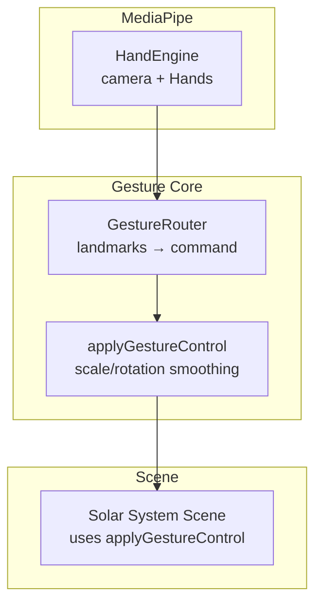
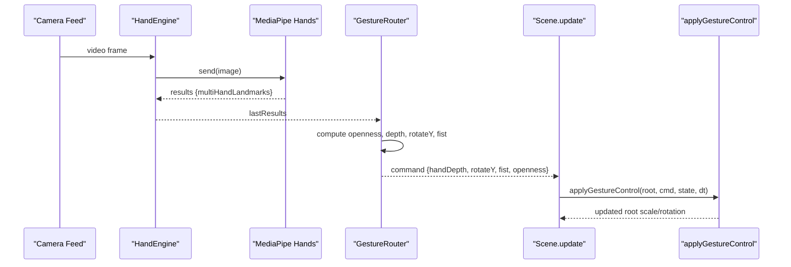
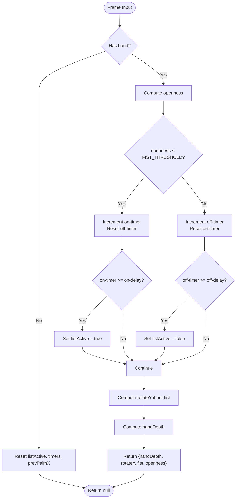
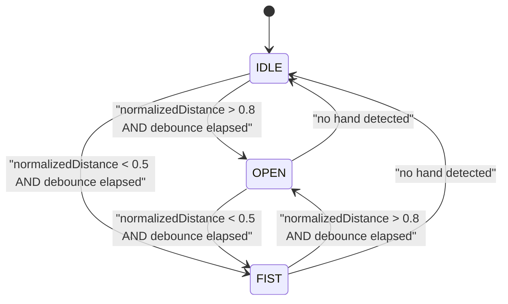
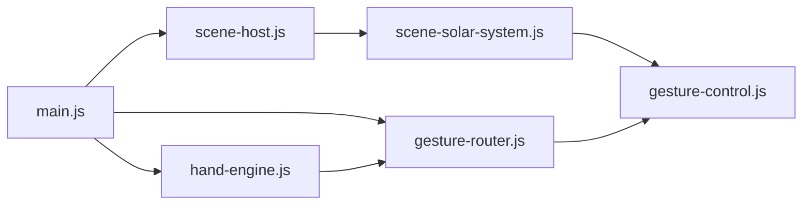

# Gesture Detection & State Machine

<cite>
**Referenced Files in This Document**
- [hand-engine.js](file://src/science/gesture-cosmos/core/hand-engine.js)
- [gesture-router.js](file://src/science/gesture-cosmos/core/gesture-router.js)
- [gesture-control.js](file://src/science/gesture-cosmos/core/gesture-control.js)
- [main.js](file://src/science/gesture-cosmos/main.js)
- [scene-solar-system.js](file://src/science/gesture-cosmos/scenes/scene-solar-system.js)
- [hand-tracker.js](file://src/literacy/movespelling/js/core/hand-tracker.js)
</cite>

## Table of Contents
1. [Introduction](#introduction)
2. [Project Structure](#project-structure)
3. [Core Components](#core-components)
4. [Architecture Overview](#architecture-overview)
5. [Detailed Component Analysis](#detailed-component-analysis)
6. [Dependency Analysis](#dependency-analysis)
7. [Performance Considerations](#performance-considerations)
8. [Troubleshooting Guide](#troubleshooting-guide)
9. [Conclusion](#conclusion)

## Introduction
This document explains the gesture detection algorithms and state machine implementation used to interpret MediaPipe hand landmarks into high-level gestures (open palm, fist, idle). It covers:
- Hand state detection using landmark distances and normalization
- Palm center positioning and depth estimation
- Debouncing and hysteresis for robust fist/open transitions
- Position smoothing via exponential moving averages
- Thresholds and tuning parameters
- Edge cases such as partial hand detection and rapid state changes

Two implementations are present:
- A lightweight, scene-oriented pipeline in the science module that computes openness from fingertip-to-wrist distances and uses a debounced state machine to drive object scale and rotation.
- A more comprehensive tracker in the literacy module with explicit IDLE/OPEN/FIST states, debouncing, and position smoothing.

## Project Structure
The gesture system is composed of:
- A camera and MediaPipe wrapper that streams frames and returns landmarks
- A router that translates landmarks into commands (depth, rotation, fist flag, openness)
- A control layer that applies smooth scaling and rotation to 3D objects
- Scenes that consume these commands to animate content

**Diagram sources**
- [hand-engine.js:21-70](file://src/science/gesture-cosmos/core/hand-engine.js#L21-L70)
- [gesture-router.js:34-109](file://src/science/gesture-cosmos/core/gesture-router.js#L34-L109)
- [gesture-control.js:50-83](file://src/science/gesture-cosmos/core/gesture-control.js#L50-L83)
- [scene-solar-system.js:362-366](file://src/science/gesture-cosmos/scenes/scene-solar-system.js#L362-L366)

**Section sources**
- [hand-engine.js:1-83](file://src/science/gesture-cosmos/core/hand-engine.js#L1-L83)
- [gesture-router.js:1-111](file://src/science/gesture-cosmos/core/gesture-router.js#L1-L111)
- [gesture-control.js:1-88](file://src/science/gesture-cosmos/core/gesture-control.js#L1-L88)
- [scene-solar-system.js:268-300](file://src/science/gesture-cosmos/scenes/scene-solar-system.js#L268-L300)

## Core Components
- HandEngine: Initializes MediaPipe Hands and Camera, sends frames, and exposes last results to consumers.
- GestureRouter: Computes openness, estimates hand depth, derives Y-axis rotation from palm X movement, and maintains a debounced fist state machine. Emits per-frame commands.
- applyGestureControl: Smoothly interpolates target scale toward current scale and applies rotation when open; resets to default when no hand is detected.
- Scene integration: Scenes create a gesture state and call applyGestureControl each frame to transform their root group.

Key responsibilities:
- Landmark processing and feature extraction (openness, depth, palm X)
- State machine with hysteresis and timers
- Smoothing and clamping for stable visual output

**Section sources**
- [hand-engine.js:21-70](file://src/science/gesture-cosmos/core/hand-engine.js#L21-L70)
- [gesture-router.js:34-109](file://src/science/gesture-cosmos/core/gesture-router.js#L34-L109)
- [gesture-control.js:50-83](file://src/science/gesture-cosmos/core/gesture-control.js#L50-L83)

## Architecture Overview
End-to-end flow from camera to scene transformation:

**Diagram sources**
- [hand-engine.js:41-70](file://src/science/gesture-cosmos/core/hand-engine.js#L41-L70)
- [gesture-router.js:34-109](file://src/science/gesture-cosmos/core/gesture-router.js#L34-L109)
- [scene-solar-system.js:362-366](file://src/science/gesture-cosmos/scenes/scene-solar-system.js#L362-L366)
- [gesture-control.js:50-83](file://src/science/gesture-cosmos/core/gesture-control.js#L50-L83)

## Detailed Component Analysis

### Landmark Index Reference
Common indices used across components:
- Wrist: 0
- Fingertips: 8 (index), 12 (middle), 16 (ring), 20 (pinky)
- Finger bases (MCP joints): 5, 9, 13, 17
- Thumb tip: 4
- Palm center proxy: 9 (middle finger base)

These indices are used consistently for distance calculations and position tracking.

**Section sources**
- [gesture-router.js:49-54](file://src/science/gesture-cosmos/core/gesture-router.js#L49-L54)
- [hand-tracker.js:349-362](file://src/literacy/movespelling/js/core/hand-tracker.js#L349-L362)

### Openness Calculation (Fist vs Open)
Openness measures how extended the fingers are relative to the wrist. The algorithm:
- Computes Euclidean distances from each fingertip to the wrist
- Averages these distances
- Normalizes by subtracting a baseline and scaling to a 0–1 range

Mathematical formulation:
- For each fingertip i ∈ {4, 8, 12, 16, 20}:
  - d_i = ||tip_i − wrist||
- totalDist = Σ d_i
- openness = clamp((totalDist − 0.5) / 1.2, 0, 1)

Thresholds:
- Fist threshold: openness < 0.35 triggers potential fist activation
- Open threshold: openness ≥ 0.35 keeps or reverts to open

Edge handling:
- Clamped to [0, 1] to avoid out-of-range values
- Empirical constants tuned for typical hand sizes and distances

**Section sources**
- [gesture-router.js:49-55](file://src/science/gesture-cosmos/core/gesture-router.js#L49-L55)
- [gesture-router.js:60-73](file://src/science/gesture-cosmos/core/gesture-router.js#L60-L73)

### Depth Estimation (Apparent Size)
Depth is inferred from the apparent size of the hand in screen space:
- Use wrist to middle-finger-tip distance in normalized coordinates
- Map handSize to handDepth inversely: closer hands appear larger → lower depth value; farther hands appear smaller → higher depth value

Formula:
- handSize = ||(h[12].x, h[12].y) − (wrist.x, wrist.y)||
- handDepth = clamp((HAND_NEAR − handSize) / (HAND_NEAR − HAND_FAR), 0, 1)
- Typical bounds: HAND_NEAR ≈ 0.35, HAND_FAR ≈ 0.08

Effect:
- Larger handDepth increases object scale; smaller decreases it

**Section sources**
- [gesture-router.js:83-89](file://src/science/gesture-cosmos/core/gesture-router.js#L83-L89)
- [gesture-control.js:54-56](file://src/science/gesture-cosmos/core/gesture-control.js#L54-L56)

### Rotation from Palm X Slide
Rotation around Y axis is driven by horizontal movement of the palm center:
- palmX = h[9].x
- rotateY = clamp(palmX − prevPalmX, ±0.05) × scaleFactor
- Only applied when not in fist state to avoid conflicts

Implementation details:
- Delta is clamped per frame to prevent sudden jumps
- Scaled to radians per frame at ~60fps

**Section sources**
- [gesture-router.js:93-101](file://src/science/gesture-cosmos/core/gesture-router.js#L93-L101)

### Debounced Fist State Machine
A hysteresis-based state machine prevents flickering between open and fist due to transient noise:
- OnTimer and OffTimer accumulate time while conditions persist
- Activation requires continuous closed-hand condition for _fistOnDelay (e.g., 0.25s)
- Deactivation requires continuous open-hand condition for _fistOffDelay (e.g., 0.20s)

State transitions:
- If openness < FIST_THRESHOLD: increment on-timer; if exceeds delay, set fistActive = true
- Else: increment off-timer; if exceeds delay, set fistActive = false
- When no hand detected: reset all timers and deactivate fist

**Diagram sources**
- [gesture-router.js:34-109](file://src/science/gesture-cosmos/core/gesture-router.js#L34-L109)

**Section sources**
- [gesture-router.js:24-32](file://src/science/gesture-cosmos/core/gesture-router.js#L24-L32)
- [gesture-router.js:57-73](file://src/science/gesture-cosmos/core/gesture-router.js#L57-L73)

### Position Smoothing (Exponential Moving Average)
Position smoothing reduces jitter by blending new positions with previous smoothed values:
- smoothedX += (screenX − smoothedX) × smoothingFactor
- smoothedY += (screenY − smoothedY) × smoothingFactor

Parameters:
- smoothingFactor typically around 0.3 for responsive yet smooth motion

Usage:
- Applied to palm center converted to screen coordinates
- Used for UI or auxiliary tracking rather than core fist/open classification

**Section sources**
- [hand-tracker.js:280-286](file://src/literacy/movespelling/js/core/hand-tracker.js#L280-L286)

### Alternative Tracker Implementation (IDLE/OPEN/FIST)
The literacy module provides an alternative approach:
- States: IDLE | OPEN | FIST
- Debounce window: STATE_DEBOUNCE_MS (e.g., 100ms) before committing state change
- Normalized distance metric: average fingertip-to-base distance divided by average base-to-wrist distance
- Classification thresholds:
  - normalizedDistance < 0.5 → FIST
  - normalizedDistance > 0.8 → OPEN
  - Between thresholds → retain previous non-IDLE state or default to OPEN

**Diagram sources**
- [hand-tracker.js:340-402](file://src/literacy/movespelling/js/core/hand-tracker.js#L340-L402)
- [hand-tracker.js:292-303](file://src/literacy/movespelling/js/core/hand-tracker.js#L292-L303)

**Section sources**
- [hand-tracker.js:27-30](file://src/literacy/movespelling/js/core/hand-tracker.js#L27-L30)
- [hand-tracker.js:292-303](file://src/literacy/movespelling/js/core/hand-tracker.js#L292-L303)
- [hand-tracker.js:340-402](file://src/literacy/movespelling/js/core/hand-tracker.js#L340-L402)

### Scale and Rotation Application
The control layer maps handDepth to targetScale and smoothly interpolates:
- targetScale = MIN_SCALE + handDepth × (MAX_SCALE − MIN_SCALE)
- currentScale = lerp(currentScale, targetScale, t) where t ≈ 0.06
- Rotation applied only when not in fist state

Defaults and limits:
- DEFAULT_SCALE = 1.0
- MIN_SCALE = 0.5
- MAX_SCALE = 2.0

Rising/falling edges:
- fistRising and fistFalling flags indicate one-frame transitions for event-driven effects

**Section sources**
- [gesture-control.js:24-26](file://src/science/gesture-cosmos/core/gesture-control.js#L24-L26)
- [gesture-control.js:50-83](file://src/science/gesture-cosmos/core/gesture-control.js#L50-L83)

## Dependency Analysis
High-level dependencies:
- main.js orchestrates initialization and render loop, wiring HandEngine and GestureRouter
- Scene modules depend on gesture-control utilities to transform their root groups
- HandEngine depends on external MediaPipe libraries loaded via CDN

**Diagram sources**
- [main.js:48-51](file://src/science/gesture-cosmos/main.js#L48-L51)
- [scene-solar-system.js:6](file://src/science/gesture-cosmos/scenes/scene-solar-system.js#L6)
- [gesture-control.js:50-83](file://src/science/gesture-cosmos/core/gesture-control.js#L50-L83)

**Section sources**
- [main.js:140-179](file://src/science/gesture-cosmos/main.js#L140-L179)
- [scene-host.js:57-61](file://src/science/gesture-cosmos/core/scene-host.js#L57-L61)

## Performance Considerations
- Frame rate limiting: The literacy tracker caps processing to reduce CPU load (e.g., 30fps) and avoids request stacking by guarding against concurrent sends.
- Confidence thresholds: Adjust minDetectionConfidence and minTrackingConfidence to balance accuracy and performance.
- Smoothing factors: Higher smoothing reduces jitter but increases latency; tune based on interaction responsiveness needs.
- Depth mapping bounds: Ensure HAND_NEAR/HAND_FAR reflect typical user distances to avoid extreme scaling.

[No sources needed since this section provides general guidance]

## Troubleshooting Guide
Common issues and remedies:
- No hand detected:
  - Ensure camera permissions granted and video element is playing
  - Increase confidence thresholds temporarily to stabilize detection
  - Verify MediaPipe scripts are loaded before initialization
- Rapid state changes:
  - Increase debounce delays (_fistOnDelay/_fistOffDelay) or STATE_DEBOUNCE_MS
  - Raise FIST_THRESHOLD slightly to require more closure
- Partial hand detection:
  - The router resets state when no hand is present; ensure full hand visibility for reliable classification
  - Consider adjusting model complexity or resolution constraints
- Calibration adjustments:
  - Tune openness normalization constants (baseline offset and divisor)
  - Recalibrate depth bounds (HAND_NEAR/HAND_FAR) for different camera setups

**Section sources**
- [hand-engine.js:21-46](file://src/science/gesture-cosmos/core/hand-engine.js#L21-L46)
- [gesture-router.js:34-42](file://src/science/gesture-cosmos/core/gesture-router.js#L34-L42)
- [hand-tracker.js:292-303](file://src/literacy/movespelling/js/core/hand-tracker.js#L292-L303)

## Conclusion
The gesture system combines robust landmark analysis with a debounced state machine and smoothing to deliver stable interactions. Openness derived from fingertip-to-wrist distances drives fist/open classification, while apparent hand size estimates depth for scaling. Hysteresis and debouncing mitigate flicker, and exponential smoothing stabilizes position tracking. Tuning thresholds and timing parameters allows adaptation to varied environments and user behaviors.