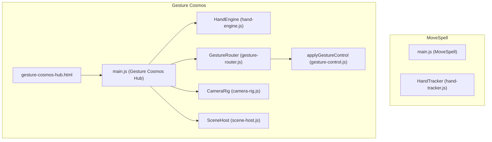
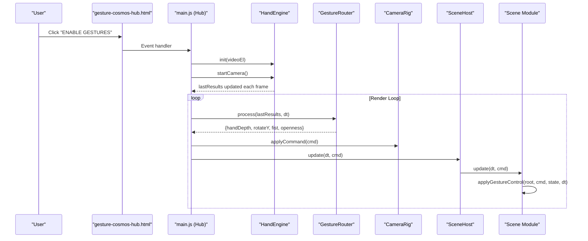
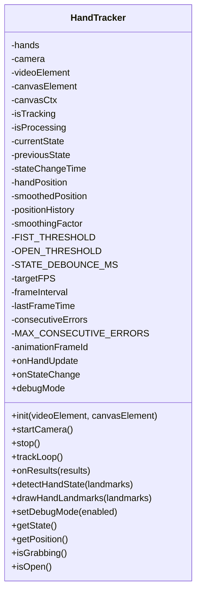
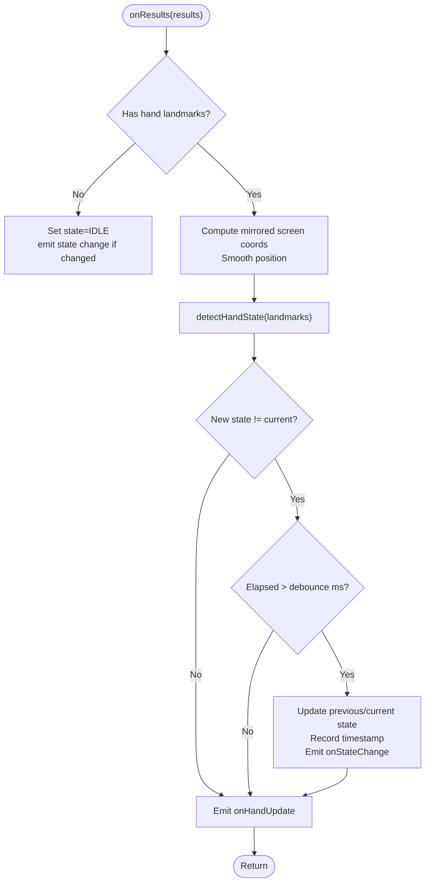
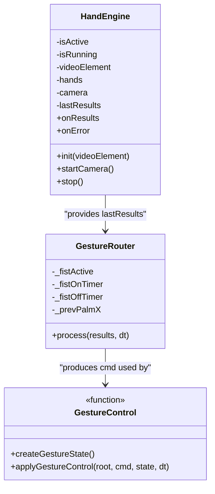
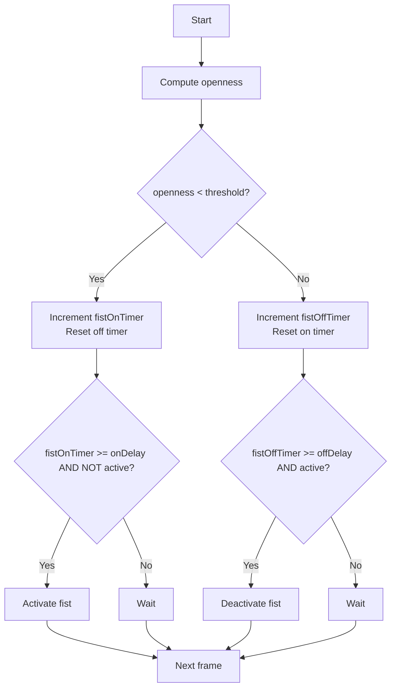
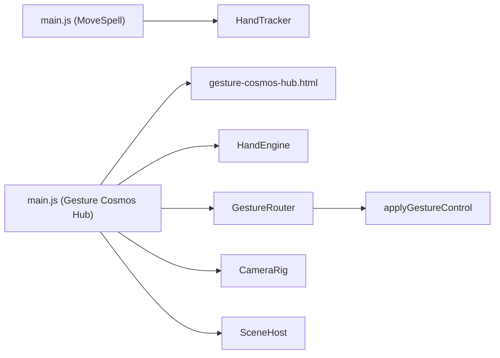

# Gesture Recognition System

<cite>
**Referenced Files in This Document**
- [hand-tracker.js](file://src/literacy/movespelling/js/core/hand-tracker.js)
- [main.js (MoveSpell)](file://src/literacy/movespelling/js/main.js)
- [hand-engine.js](file://src/science/gesture-cosmos/core/hand-engine.js)
- [gesture-router.js](file://src/science/gesture-cosmos/core/gesture-router.js)
- [gesture-control.js](file://src/science/gesture-cosmos/core/gesture-control.js)
- [camera-rig.js](file://src/science/gesture-cosmos/core/camera-rig.js)
- [scene-host.js](file://src/science/gesture-cosmos/core/scene-host.js)
- [main.js (Gesture Cosmos Hub)](file://src/science/gesture-cosmos/main.js)
- [gesture-cosmos-hub.html](file://src/science/gesture-cosmos-hub.html)
</cite>

## Table of Contents
1. [Introduction](#introduction)
2. [Project Structure](#project-structure)
3. [Core Components](#core-components)
4. [Architecture Overview](#architecture-overview)
5. [Detailed Component Analysis](#detailed-component-analysis)
6. [Dependency Analysis](#dependency-analysis)
7. [Performance Considerations](#performance-considerations)
8. [Troubleshooting Guide](#troubleshooting-guide)
9. [Conclusion](#conclusion)
10. [Appendices](#appendices)

## Introduction
This document explains the gesture recognition system powered by MediaPipe Hands across two implementations in the repository:
- MoveSpell literacy game using a custom HandTracker class for 2D canvas-based interaction and state-driven gestures.
- Gesture Cosmos hub using a modular pipeline with HandEngine, GestureRouter, and scene-level control via applyGestureControl.

The documentation covers camera initialization, hand detection algorithms, gesture classification logic, debounced open/closed hand state machines, coordinate transformations from 3D landmarks to screen coordinates, position smoothing, frame rate optimization, configuration of thresholds, handling camera permissions, performance considerations, and troubleshooting guidance.

## Project Structure
Two independent gesture systems coexist:
- MoveSpell: A single-file HandTracker class integrated into a Phaser-based game entry point.
- Gesture Cosmos: A modular Three.js application with separate modules for camera/hands, gesture routing, and scene control.

**Diagram sources**
- [main.js (Gesture Cosmos Hub):1-187](file://src/science/gesture-cosmos/main.js#L1-L187)
- [gesture-cosmos-hub.html:227-283](file://src/science/gesture-cosmos-hub.html#L227-L283)
- [hand-engine.js:1-83](file://src/science/gesture-cosmos/core/hand-engine.js#L1-L83)
- [gesture-router.js:1-111](file://src/science/gesture-cosmos/core/gesture-router.js#L1-L111)
- [gesture-control.js:1-88](file://src/science/gesture-cosmos/core/gesture-control.js#L1-L88)
- [camera-rig.js:1-61](file://src/science/gesture-cosmos/core/camera-rig.js#L1-L61)
- [scene-host.js:1-63](file://src/science/gesture-cosmos/core/scene-host.js#L1-L63)
- [main.js (MoveSpell):1-197](file://src/literacy/movespelling/js/main.js#L1-L197)
- [hand-tracker.js:1-504](file://src/literacy/movespelling/js/core/hand-tracker.js#L1-L504)

**Section sources**
- [main.js (Gesture Cosmos Hub):1-187](file://src/science/gesture-cosmos/main.js#L1-L187)
- [gesture-cosmos-hub.html:227-283](file://src/science/gesture-cosmos-hub.html#L227-L283)
- [main.js (MoveSpell):1-197](file://src/literacy/movespelling/js/main.js#L1-L197)
- [hand-tracker.js:1-504](file://src/literacy/movespelling/js/core/hand-tracker.js#L1-L504)

## Core Components
- HandTracker (MoveSpell): Encapsulates MediaPipe Hands integration, camera lifecycle, frame loop, landmark processing, state machine, and callbacks.
- HandEngine (Gesture Cosmos): Lightweight wrapper around MediaPipe Hands and Camera utilities; provides results stream to the router.
- GestureRouter (Gesture Cosmos): Translates raw landmarks into unified commands including openness, fist state (debounced), hand depth, and rotation delta.
- applyGestureControl (Gesture Cosmos): Applies scale and rotation to a target Object3D based on command values and smooths transitions.
- CameraRig (Gesture Cosmos): Mouse/touch orbit controls; gestures no longer move the camera directly.
- SceneHost (Gesture Cosmos): Manages scene lifecycle and dispatches update(dt, cmd) per frame.

Key responsibilities:
- Camera permission and initialization
- Frame-rate-limited tracking loop
- Landmark-to-screen coordinate transformation
- Position smoothing
- Open/closed hand state machine with hysteresis/debounce
- Command emission to scenes

**Section sources**
- [hand-tracker.js:1-504](file://src/literacy/movespelling/js/core/hand-tracker.js#L1-L504)
- [hand-engine.js:1-83](file://src/science/gesture-cosmos/core/hand-engine.js#L1-L83)
- [gesture-router.js:1-111](file://src/science/gesture-cosmos/core/gesture-router.js#L1-L111)
- [gesture-control.js:1-88](file://src/science/gesture-cosmos/core/gesture-control.js#L1-L88)
- [camera-rig.js:1-61](file://src/science/gesture-cosmos/core/camera-rig.js#L1-L61)
- [scene-host.js:1-63](file://src/science/gesture-cosmos/core/scene-host.js#L1-L63)

## Architecture Overview
The Gesture Cosmos pipeline is decoupled:
- MediaPipe Hands produces landmarks.
- GestureRouter computes normalized features (openness, fist state, hand depth, rotation delta).
- Scenes consume commands to transform objects (scale/rotate) or trigger effects.

**Diagram sources**
- [gesture-cosmos-hub.html:227-283](file://src/science/gesture-cosmos-hub.html#L227-L283)
- [main.js (Gesture Cosmos Hub):116-187](file://src/science/gesture-cosmos/main.js#L116-L187)
- [hand-engine.js:21-71](file://src/science/gesture-cosmos/core/hand-engine.js#L21-L71)
- [gesture-router.js:34-110](file://src/science/gesture-cosmos/core/gesture-router.js#L34-L110)
- [gesture-control.js:50-83](file://src/science/gesture-cosmos/core/gesture-control.js#L50-L83)
- [camera-rig.js:30-32](file://src/science/gesture-cosmos/core/camera-rig.js#L30-L32)
- [scene-host.js:57-61](file://src/science/gesture-cosmos/core/scene-host.js#L57-L61)

## Detailed Component Analysis

### HandTracker Class (MoveSpell)
Responsibilities:
- Initialize MediaPipe Hands and configure options.
- Start camera with robust constraints and iOS compatibility.
- Run a frame-rate-limited tracking loop that sends frames to MediaPipe.
- Process results: convert 3D landmarks to mirrored screen coordinates, smooth position, detect hand state, emit events.
- Debounce state changes to avoid flicker.
- Provide debug drawing and cleanup.

Key implementation highlights:
- Camera initialization uses navigator.mediaDevices.getUserMedia with explicit constraints and iOS inline playback attributes.
- Tracking loop enforces a target FPS and prevents request stacking by guarding against concurrent processing.
- Coordinate transformation mirrors x-axis and maps normalized landmarks to window dimensions.
- State detection compares average fingertip-to-base distances normalized by base-to-wrist distance to classify OPEN vs FIST.
- Debouncing ensures stable transitions between states.

**Diagram sources**
- [hand-tracker.js:6-498](file://src/literacy/movespelling/js/core/hand-tracker.js#L6-L498)

**Section sources**
- [hand-tracker.js:55-151](file://src/literacy/movespelling/js/core/hand-tracker.js#L55-L151)
- [hand-tracker.js:194-248](file://src/literacy/movespelling/js/core/hand-tracker.js#L194-L248)
- [hand-tracker.js:254-333](file://src/literacy/movespelling/js/core/hand-tracker.js#L254-L333)
- [hand-tracker.js:340-402](file://src/literacy/movespelling/js/core/hand-tracker.js#L340-L402)
- [hand-tracker.js:463-497](file://src/literacy/movespelling/js/core/hand-tracker.js#L463-L497)

#### State Machine and Debouncing (Open/Closed Hand)
- The tracker maintains currentState and previousState with a time threshold before committing transitions.
- When no hand is detected, it resets to IDLE and emits a state change event.
- The debouncing mechanism reduces false positives due to transient noise.

**Diagram sources**
- [hand-tracker.js:254-333](file://src/literacy/movespelling/js/core/hand-tracker.js#L254-L333)
- [hand-tracker.js:340-402](file://src/literacy/movespelling/js/core/hand-tracker.js#L340-L402)

**Section sources**
- [hand-tracker.js:254-333](file://src/literacy/movespelling/js/core/hand-tracker.js#L254-L333)
- [hand-tracker.js:340-402](file://src/literacy/movespelling/js/core/hand-tracker.js#L340-L402)

#### Coordinate Transformation and Smoothing
- Mirrors x-coordinate to match user-facing camera view.
- Maps normalized landmarks to pixel space using window dimensions.
- Applies exponential smoothing to reduce jitter.

**Section sources**
- [hand-tracker.js:270-286](file://src/literacy/movespelling/js/core/hand-tracker.js#L270-L286)

#### Frame Rate Optimization
- Enforces a target FPS by throttling send calls.
- Prevents request stacking with an isProcessing guard.
- Resets processing state after consecutive errors to recover.

**Section sources**
- [hand-tracker.js:32-38](file://src/literacy/movespelling/js/core/hand-tracker.js#L32-38)
- [hand-tracker.js:194-248](file://src/literacy/movespelling/js/core/hand-tracker.js#L194-L248)

### HandEngine and GestureRouter (Gesture Cosmos)
HandEngine:
- Initializes MediaPipe Hands and sets options.
- Uses MediaPipe Camera utility to feed frames.
- Stores last results and invokes registered onResults callback.

GestureRouter:
- Computes openness from average fingertip-to-wrist distances.
- Implements a debounced fist state machine with hysteresis timers.
- Estimates hand depth from apparent size (wrist to middle finger tip).
- Derives Y-axis rotation from palm X movement when not in fist state.
- Emits a unified command object consumed by scenes.

**Diagram sources**
- [hand-engine.js:5-82](file://src/science/gesture-cosmos/core/hand-engine.js#L5-L82)
- [gesture-router.js:22-110](file://src/science/gesture-cosmos/core/gesture-router.js#L22-L110)
- [gesture-control.js:32-83](file://src/science/gesture-cosmos/core/gesture-control.js#L32-L83)

**Section sources**
- [hand-engine.js:21-71](file://src/science/gesture-cosmos/core/hand-engine.js#L21-L71)
- [gesture-router.js:34-110](file://src/science/gesture-cosmos/core/gesture-router.js#L34-L110)
- [gesture-control.js:50-83](file://src/science/gesture-cosmos/core/gesture-control.js#L50-L83)

#### Fist State Machine (Hysteresis and Debounce)
- Requires continuous closed-hand duration to activate fist.
- Requires continuous open-hand duration to deactivate fist.
- Prevents rapid toggling due to tracking noise.

**Diagram sources**
- [gesture-router.js:57-73](file://src/science/gesture-cosmos/core/gesture-router.js#L57-L73)

**Section sources**
- [gesture-router.js:57-73](file://src/science/gesture-cosmos/core/gesture-router.js#L57-L73)

#### Depth and Rotation Computation
- Hand depth derived from wrist-to-middle-finger distance; inverted so farther hands increase depth value.
- Rotation delta computed from palm X movement when open; clamped per frame and scaled.

**Section sources**
- [gesture-router.js:75-101](file://src/science/gesture-cosmos/core/gesture-router.js#L75-L101)

#### Applying Gestures to 3D Objects
- applyGestureControl maps hand depth to target scale within MIN_SCALE..MAX_SCALE.
- Smoothly interpolates currentScale toward targetScale.
- Applies Y-axis rotation only when not in fist state.

**Section sources**
- [gesture-control.js:50-83](file://src/science/gesture-cosmos/core/gesture-control.js#L50-L83)

### Integration Points and Entry Points
- MoveSpell main wires HandTracker into Phaser game events and UI cursor.
- Gesture Cosmos main initializes HandEngine, GestureRouter, CameraRig, SceneHost, and runs the render loop. It also handles enabling gestures and fallback messaging.

**Section sources**
- [main.js (MoveSpell):11-100](file://src/literacy/movespelling/js/main.js#L11-L100)
- [main.js (MoveSpell):136-160](file://src/literacy/movespelling/js/main.js#L136-L160)
- [main.js (Gesture Cosmos Hub):47-64](file://src/science/gesture-cosmos/main.js#L47-L64)
- [main.js (Gesture Cosmos Hub):116-130](file://src/science/gesture-cosmos/main.js#L116-L130)
- [main.js (Gesture Cosmos Hub):160-187](file://src/science/gesture-cosmos/main.js#L160-L187)

## Dependency Analysis
High-level dependencies:
- MoveSpell depends on HandTracker and integrates with Phaser via global instances and events.
- Gesture Cosmos depends on Three.js, OrbitControls, MediaPipe Hands/Camera, and internal core modules.

**Diagram sources**
- [main.js (MoveSpell):1-197](file://src/literacy/movespelling/js/main.js#L1-L197)
- [hand-tracker.js:1-504](file://src/literacy/movespelling/js/core/hand-tracker.js#L1-L504)
- [main.js (Gesture Cosmos Hub):1-187](file://src/science/gesture-cosmos/main.js#L1-L187)
- [gesture-cosmos-hub.html:227-283](file://src/science/gesture-cosmos-hub.html#L227-L283)
- [hand-engine.js:1-83](file://src/science/gesture-cosmos/core/hand-engine.js#L1-L83)
- [gesture-router.js:1-111](file://src/science/gesture-cosmos/core/gesture-router.js#L1-L111)
- [gesture-control.js:1-88](file://src/science/gesture-cosmos/core/gesture-control.js#L1-L88)
- [camera-rig.js:1-61](file://src/science/gesture-cosmos/core/camera-rig.js#L1-L61)
- [scene-host.js:1-63](file://src/science/gesture-cosmos/core/scene-host.js#L1-L63)

**Section sources**
- [main.js (MoveSpell):1-197](file://src/literacy/movespelling/js/main.js#L1-L197)
- [hand-tracker.js:1-504](file://src/literacy/movespelling/js/core/hand-tracker.js#L1-L504)
- [main.js (Gesture Cosmos Hub):1-187](file://src/science/gesture-cosmos/main.js#L1-L187)
- [gesture-cosmos-hub.html:227-283](file://src/science/gesture-cosmos-hub.html#L227-L283)
- [hand-engine.js:1-83](file://src/science/gesture-cosmos/core/hand-engine.js#L1-L83)
- [gesture-router.js:1-111](file://src/science/gesture-cosmos/core/gesture-router.js#L1-L111)
- [gesture-control.js:1-88](file://src/science/gesture-cosmos/core/gesture-control.js#L1-L88)
- [camera-rig.js:1-61](file://src/science/gesture-cosmos/core/camera-rig.js#L1-L61)
- [scene-host.js:1-63](file://src/science/gesture-cosmos/core/scene-host.js#L1-L63)

## Performance Considerations
- Frame rate limiting:
  - MoveSpell’s HandTracker enforces a target FPS and avoids stacking requests.
  - Gesture Cosmos relies on requestAnimationFrame and processes at native refresh rates; consider capping if needed.
- Memory management:
  - Both systems cancel animation frames and stop camera tracks on stop().
  - Gesture Cosmos disposes geometries, materials, textures, and removes nodes during scene disposal.
- Error recovery:
  - MoveSpell tracks consecutive errors and resets processing state to recover from repeated failures.
  - Gesture Cosmos wraps init/start in try/catch and shows fallback messages.
- Rendering cost:
  - Gesture Cosmos disables camera movement via gestures and uses mouse OrbitControls; gestures drive object transforms instead.

[No sources needed since this section provides general guidance]

## Troubleshooting Guide
Common issues and resolutions:
- Camera permission denied:
  - Ensure HTTPS or localhost context.
  - Handle NotAllowedError and show user-friendly instructions.
- No camera found or already in use:
  - Check device capabilities and ensure no other app is using the camera.
- OverconstrainedError:
  - Relax resolution or aspect ratio constraints.
- SecurityError:
  - Serve over HTTPS or localhost.
- iOS/iPadOS playback issues:
  - Set playsinline and webkit-playsinline attributes; call play() explicitly.
- Tracking instability:
  - Increase debounce durations or adjust thresholds for openness/fist detection.
  - Use smoothing factors to reduce jitter.
- High CPU/GPU usage:
  - Lower target FPS, reduce model complexity, or decrease camera resolution.

**Section sources**
- [hand-tracker.js:130-151](file://src/literacy/movespelling/js/core/hand-tracker.js#L130-L151)
- [hand-tracker.js:194-248](file://src/literacy/movespelling/js/core/hand-tracker.js#L194-L248)
- [main.js (Gesture Cosmos Hub):116-130](file://src/science/gesture-cosmos/main.js#L116-L130)

## Conclusion
The repository implements two complementary gesture recognition systems:
- MoveSpell’s HandTracker offers a self-contained solution with robust camera handling, debounced state transitions, and simple 2D interactions.
- Gesture Cosmos provides a modular pipeline where MediaPipe outputs are transformed into high-level commands that drive 3D scene behavior through applyGestureControl.

Both systems emphasize stability (debouncing, error recovery), performance (frame limiting, resource cleanup), and clear separation of concerns (engine/router/control).

[No sources needed since this section summarizes without analyzing specific files]

## Appendices

### Extending Gesture Commands (Gesture Cosmos)
To add new gestures:
- Extend GestureRouter.process to compute additional features from landmarks (e.g., pinch detection, multi-hand interactions).
- Update the returned command object with new fields.
- In scenes, handle new fields in update(dt, cmd) and/or extend applyGestureControl to map new command properties to visual effects.

**Section sources**
- [gesture-router.js:34-110](file://src/science/gesture-cosmos/core/gesture-router.js#L34-L110)
- [gesture-control.js:50-83](file://src/science/gesture-cosmos/core/gesture-control.js#L50-L83)

### Configuring Detection Thresholds
- MoveSpell:
  - Adjust FIST_THRESHOLD, OPEN_THRESHOLD, STATE_DEBOUNCE_MS, and smoothingFactor in HandTracker constructor.
- Gesture Cosmos:
  - Tune FIST_THRESHOLD, _fistOnDelay, _fistOffDelay, and openness normalization constants in GestureRouter.
  - Adjust MIN_SCALE, MAX_SCALE, DEFAULT_SCALE, and lerp factor in applyGestureControl.

**Section sources**
- [hand-tracker.js:27-31](file://src/literacy/movespelling/js/core/hand-tracker.js#L27-31)
- [gesture-router.js:57-73](file://src/science/gesture-cosmos/core/gesture-router.js#L57-L73)
- [gesture-control.js:24-26](file://src/science/gesture-cosmos/core/gesture-control.js#L24-L26)

### Handling Camera Permissions Across Devices
- MoveSpell:
  - Show permission overlay and request access on user click; provide detailed error messages and fallback UI.
- Gesture Cosmos:
  - Present an enable button; gracefully fall back to mouse controls if camera fails.

**Section sources**
- [main.js (MoveSpell):23-99](file://src/literacy/movespelling/js/main.js#L23-L99)
- [main.js (Gesture Cosmos Hub):116-130](file://src/science/gesture-cosmos/main.js#L116-L130)