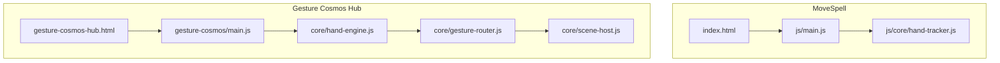
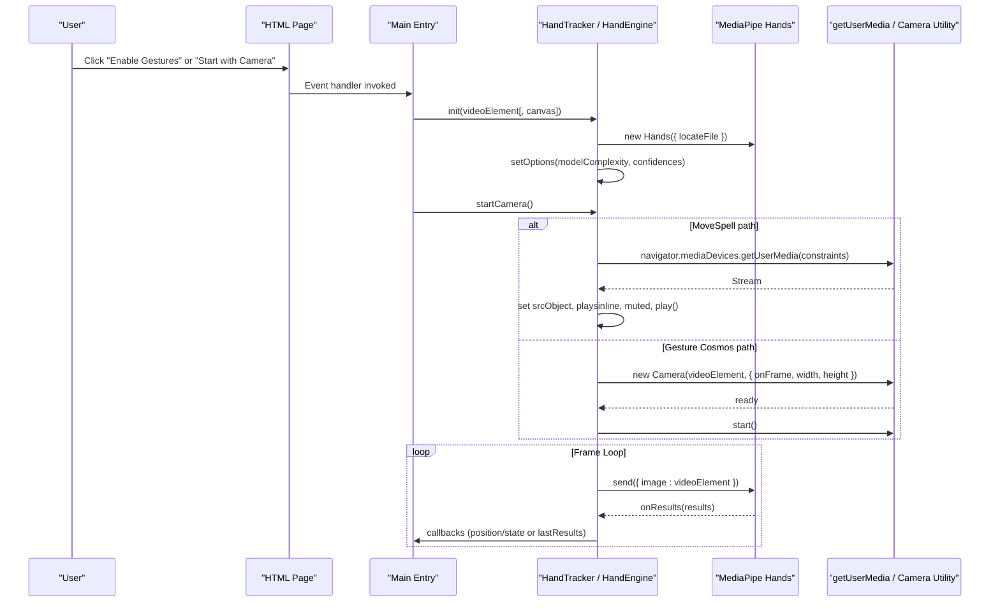
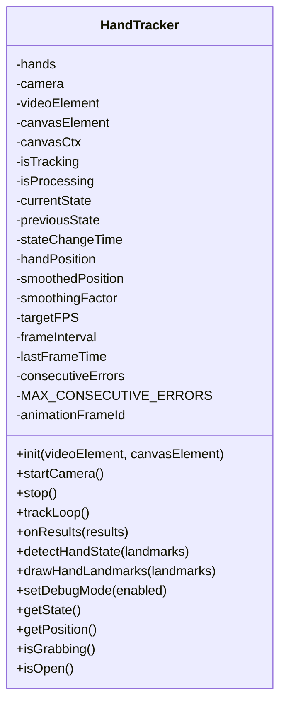
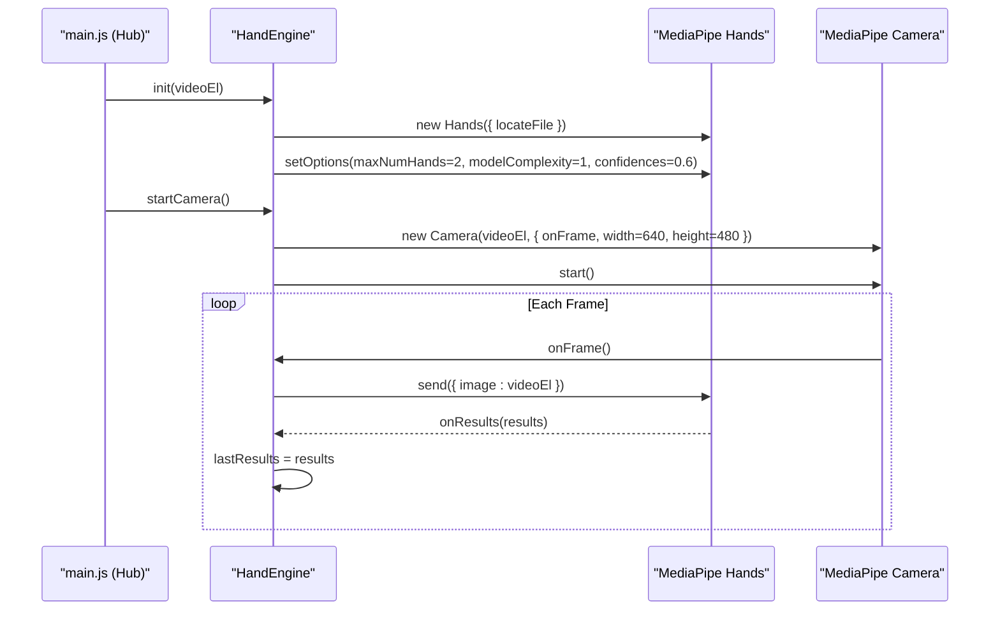
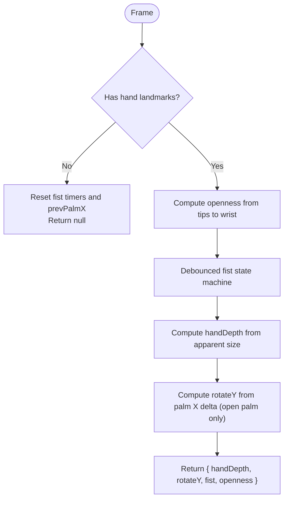
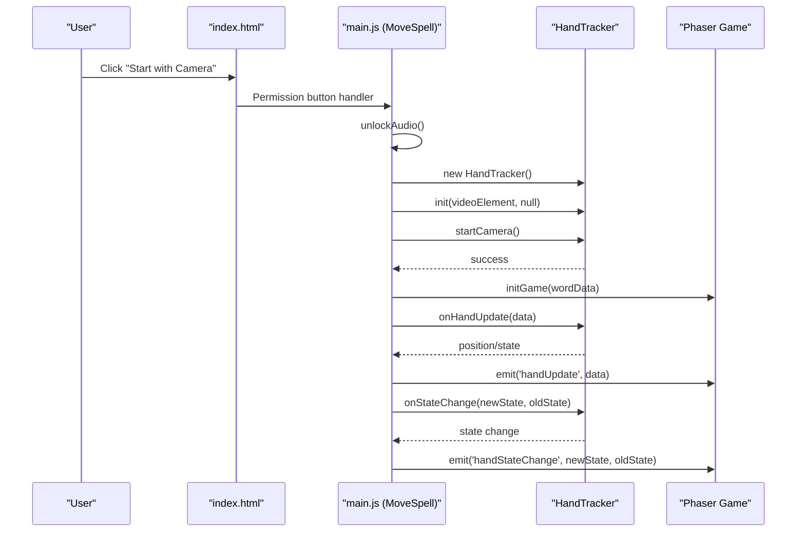
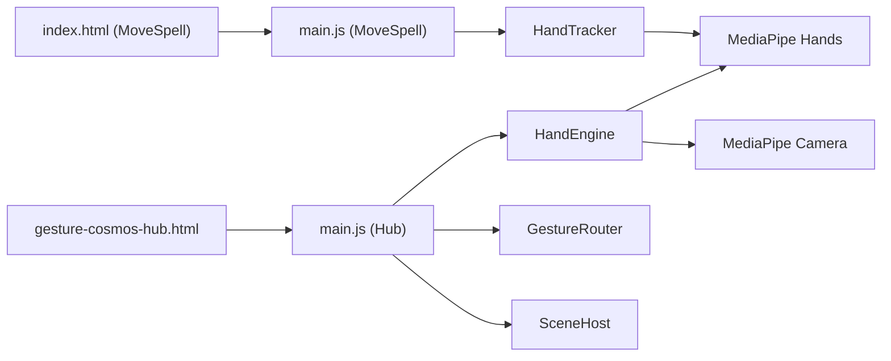

# MediaPipe Integration & Camera Management

<cite>
**Referenced Files in This Document**
- [hand-tracker.js](file://src/literacy/movespelling/js/core/hand-tracker.js)
- [main.js (MoveSpell)](file://src/literacy/movespelling/js/main.js)
- [index.html (MoveSpell)](file://src/literacy/movespelling/index.html)
- [hand-engine.js](file://src/science/gesture-cosmos/core/hand-engine.js)
- [gesture-router.js](file://src/science/gesture-cosmos/core/gesture-router.js)
- [scene-host.js](file://src/science/gesture-cosmos/core/scene-host.js)
- [main.js (Gesture Cosmos Hub)](file://src/science/gesture-cosmos/main.js)
- [gesture-cosmos-hub.html](file://src/science/gesture-cosmos-hub.html)
</cite>

## Table of Contents
1. [Introduction](#introduction)
2. [Project Structure](#project-structure)
3. [Core Components](#core-components)
4. [Architecture Overview](#architecture-overview)
5. [Detailed Component Analysis](#detailed-component-analysis)
6. [Dependency Analysis](#dependency-analysis)
7. [Performance Considerations](#performance-considerations)
8. [Troubleshooting Guide](#troubleshooting-guide)
9. [Conclusion](#conclusion)

## Introduction
This document explains how the project integrates MediaPipe Hands for hand tracking and manages camera access across two applications:
- MoveSpell (literacy game): a custom HandTracker class that initializes MediaPipe, requests camera permissions, runs a frame loop, and exposes callbacks for position and state changes.
- Gesture Cosmos Hub (science hub): a modular system using a HandEngine wrapper around MediaPipe’s Hands and Camera utilities, feeding gesture commands into Three.js scenes.

The content covers initialization flows, configuration options, cross-browser considerations (especially iOS/iPadOS), stream constraints, error handling, lifecycle management, resource cleanup, debugging canvas setup, HTTPS requirements, mobile compatibility, and performance optimization techniques.

## Project Structure
Two independent implementations coexist:
- MoveSpell uses a self-contained HandTracker class with direct MediaPipe Hands integration and manual camera control via getUserMedia.
- Gesture Cosmos Hub uses a lightweight HandEngine wrapper around MediaPipe’s Hands and Camera utilities, integrated with a scene host and gesture router to drive 3D objects.

**Diagram sources**
- [index.html (MoveSpell):90-107](file://src/literacy/movespelling/index.html#L90-L107)
- [main.js (MoveSpell):11-100](file://src/literacy/movespelling/js/main.js#L11-L100)
- [hand-tracker.js:55-151](file://src/literacy/movespelling/js/core/hand-tracker.js#L55-L151)
- [gesture-cosmos-hub.html:227-280](file://src/science/gesture-cosmos-hub.html#L227-L280)
- [main.js (Gesture Cosmos Hub):117-130](file://src/science/gesture-cosmos/main.js#L117-L130)
- [hand-engine.js:21-71](file://src/science/gesture-cosmos/core/hand-engine.js#L21-L71)
- [gesture-router.js:34-109](file://src/science/gesture-cosmos/core/gesture-router.js#L34-L109)
- [scene-host.js:31-55](file://src/science/gesture-cosmos/core/scene-host.js#L31-L55)

**Section sources**
- [index.html (MoveSpell):90-107](file://src/literacy/movespelling/index.html#L90-L107)
- [main.js (MoveSpell):11-100](file://src/literacy/movespelling/js/main.js#L11-L100)
- [hand-tracker.js:55-151](file://src/literacy/movespelling/js/core/hand-tracker.js#L55-L151)
- [gesture-cosmos-hub.html:227-280](file://src/science/gesture-cosmos-hub.html#L227-L280)
- [main.js (Gesture Cosmos Hub):117-130](file://src/science/gesture-cosmos/main.js#L117-L130)
- [hand-engine.js:21-71](file://src/science/gesture-cosmos/core/hand-engine.js#L21-L71)
- [gesture-router.js:34-109](file://src/science/gesture-cosmos/core/gesture-router.js#L34-L109)
- [scene-host.js:31-55](file://src/science/gesture-cosmos/core/scene-host.js#L31-L55)

## Core Components
- HandTracker (MoveSpell): Initializes MediaPipe Hands, configures model complexity and confidence thresholds, starts camera via getUserMedia, runs a throttled frame loop, processes results, detects hand states, and provides debug drawing.
- HandEngine (Gesture Cosmos Hub): A thin wrapper around MediaPipe Hands and Camera utilities; initializes hands, sets options, starts camera, and forwards frames to hands.
- GestureRouter: Translates raw landmarks into unified commands (scale, rotation, fist state).
- SceneHost: Manages scene lifecycle and updates per frame.

Key responsibilities:
- MediaPipe configuration: modelComplexity, minDetectionConfidence, minTrackingConfidence.
- Camera permission handling: getUserMedia constraints, iOS playsinline attributes, autoplay/muted.
- Error handling: specific error names mapped to user-friendly messages.
- Lifecycle: start, stop, cancel animation frames, release tracks, close MediaPipe instances.
- Debugging: optional canvas overlay for landmark visualization.

**Section sources**
- [hand-tracker.js:64-79](file://src/literacy/movespelling/js/core/hand-tracker.js#L64-L79)
- [hand-tracker.js:85-151](file://src/literacy/movespelling/js/core/hand-tracker.js#L85-L151)
- [hand-tracker.js:156-189](file://src/literacy/movespelling/js/core/hand-tracker.js#L156-L189)
- [hand-tracker.js:194-248](file://src/literacy/movespelling/js/core/hand-tracker.js#L194-L248)
- [hand-tracker.js:254-333](file://src/literacy/movespelling/js/core/hand-tracker.js#L254-L333)
- [hand-tracker.js:408-457](file://src/literacy/movespelling/js/core/hand-tracker.js#L408-L457)
- [hand-engine.js:21-71](file://src/science/gesture-cosmos/core/hand-engine.js#L21-L71)
- [gesture-router.js:34-109](file://src/science/gesture-cosmos/core/gesture-router.js#L34-L109)
- [scene-host.js:31-55](file://src/science/gesture-cosmos/core/scene-host.js#L31-L55)

## Architecture Overview
Two parallel architectures exist:

- MoveSpell: HTML loads MediaPipe Hands script, then main.js creates HandTracker, initializes it with video elements, starts camera, and wires callbacks to update UI and game events.
- Gesture Cosmos Hub: HTML loads MediaPipe Hands and Camera utilities, main.js instantiates HandEngine, initializes it on user click, starts camera, and feeds lastResults into GestureRouter each frame.

**Diagram sources**
- [hand-tracker.js:55-151](file://src/literacy/movespelling/js/core/hand-tracker.js#L55-L151)
- [hand-engine.js:21-71](file://src/science/gesture-cosmos/core/hand-engine.js#L21-L71)
- [main.js (MoveSpell):23-99](file://src/literacy/movespelling/js/main.js#L23-L99)
- [main.js (Gesture Cosmos Hub):117-130](file://src/science/gesture-cosmos/main.js#L117-L130)

## Detailed Component Analysis

### HandTracker Class (MoveSpell)
Responsibilities:
- Initialize MediaPipe Hands with locateFile pointing to CDN assets.
- Configure options: maxNumHands, modelComplexity, minDetectionConfidence, minTrackingConfidence.
- Start camera with optimized constraints for mobile and desktop, including aspectRatio and facingMode.
- Set video element attributes for iOS/iPadOS: playsinline, webkit-playsinline, muted, autoplay.
- Run a throttled frame loop to avoid request stacking and reduce CPU/GPU load.
- Process results: compute palm center, smooth position, detect hand state (FIST/OPEN/IDLE), emit callbacks.
- Provide debug drawing on an optional canvas.
- Clean up resources: cancelAnimationFrame, stop tracks, close MediaPipe instance.

Initialization flow:
- Create Hands instance with locateFile.
- setOptions with modelComplexity=1, minDetectionConfidence=0.7, minTrackingConfidence=0.7.
- Register onResults callback.

Camera startup:
- Request getUserMedia with constraints targeting 1280x720 ideal, 1920x1080 max, user-facing camera, 16:9 aspect ratio.
- Assign stream to videoElement.srcObject.
- Set playsinline and webkit-playsinline attributes for iOS playback without fullscreen.
- Attempt play(), retry once if needed.
- Start trackLoop.

Error handling:
- Map error.name to user-friendly messages: NotAllowedError, NotFoundError, NotReadableError, OverconstrainedError, SecurityError.
- Throw descriptive errors for callers to handle.

Frame loop:
- Throttle to target FPS (e.g., 30fps) by checking elapsed time.
- Guard against request stacking with isProcessing flag.
- Send frames only when video is ready.
- Track consecutive errors and reset processing state after threshold.

Result processing:
- Compute smoothed hand position from landmarks.
- Detect hand state based on normalized fingertip-to-base distances.
- Debounce state transitions to avoid flicker.
- Emit onHandUpdate and onStateChange callbacks.

Debug canvas:
- Optional mirrored canvas overlay showing connections and landmarks.

Lifecycle and cleanup:
- Stop cancels animation frame, resets flags, stops all tracks, clears srcObject, closes MediaPipe instance.

**Diagram sources**
- [hand-tracker.js:6-48](file://src/literacy/movespelling/js/core/hand-tracker.js#L6-L48)
- [hand-tracker.js:55-151](file://src/literacy/movespelling/js/core/hand-tracker.js#L55-L151)
- [hand-tracker.js:156-189](file://src/literacy/movespelling/js/core/hand-tracker.js#L156-L189)
- [hand-tracker.js:194-248](file://src/literacy/movespelling/js/core/hand-tracker.js#L194-L248)
- [hand-tracker.js:254-333](file://src/literacy/movespelling/js/core/hand-tracker.js#L254-L333)
- [hand-tracker.js:340-402](file://src/literacy/movespelling/js/core/hand-tracker.js#L340-L402)
- [hand-tracker.js:408-457](file://src/literacy/movespelling/js/core/hand-tracker.js#L408-L457)

**Section sources**
- [hand-tracker.js:64-79](file://src/literacy/movespelling/js/core/hand-tracker.js#L64-L79)
- [hand-tracker.js:85-151](file://src/literacy/movespelling/js/core/hand-tracker.js#L85-L151)
- [hand-tracker.js:156-189](file://src/literacy/movespelling/js/core/hand-tracker.js#L156-L189)
- [hand-tracker.js:194-248](file://src/literacy/movespelling/js/core/hand-tracker.js#L194-L248)
- [hand-tracker.js:254-333](file://src/literacy/movespelling/js/core/hand-tracker.js#L254-L333)
- [hand-tracker.js:340-402](file://src/literacy/movespelling/js/core/hand-tracker.js#L340-L402)
- [hand-tracker.js:408-457](file://src/literacy/movespelling/js/core/hand-tracker.js#L408-L457)

### HandEngine (Gesture Cosmos Hub)
Responsibilities:
- Initialize MediaPipe Hands with locateFile and setOptions (modelComplexity=1, minDetectionConfidence=0.6, minTrackingConfidence=0.6).
- Use MediaPipe Camera utility to manage camera stream and frame loop.
- Forward frames to hands.send and expose lastResults for GestureRouter.
- Provide stop() to clean up camera and hands.

Initialization flow:
- Check global Hands availability.
- Create Hands instance with locateFile.
- setOptions with higher tolerance (0.6) for broader detection.
- Register onResults to store lastResults and call external callback.

Camera startup:
- Ensure MediaPipe Camera utility is available.
- Instantiate Camera with videoElement, onFrame callback, and fixed resolution (640x480).
- Start camera and mark running.

Cleanup:
- Stop camera, close hands, null references.

**Diagram sources**
- [hand-engine.js:21-71](file://src/science/gesture-cosmos/core/hand-engine.js#L21-L71)
- [main.js (Gesture Cosmos Hub):117-130](file://src/science/gesture-cosmos/main.js#L117-L130)

**Section sources**
- [hand-engine.js:21-71](file://src/science/gesture-cosmos/core/hand-engine.js#L21-L71)
- [main.js (Gesture Cosmos Hub):117-130](file://src/science/gesture-cosmos/main.js#L117-L130)

### Gesture Router and Scene Host (Gesture Cosmos Hub)
- GestureRouter computes openness, debounced fist state, hand depth proxy, and Y-axis rotation delta from palm X movement. It emits a command object consumed by scenes.
- SceneHost manages scene registration, switching, disposal, and per-frame updates.

**Diagram sources**
- [gesture-router.js:34-109](file://src/science/gesture-cosmos/core/gesture-router.js#L34-L109)

**Section sources**
- [gesture-router.js:34-109](file://src/science/gesture-cosmos/core/gesture-router.js#L34-L109)
- [scene-host.js:31-55](file://src/science/gesture-cosmos/core/scene-host.js#L31-L55)

### MoveSpell Main Integration
- Waits for DOMContentLoaded, shows permission overlay, unlocks audio on iOS, initializes HandTracker with video elements, starts camera, shares stream with preview element, loads word data, and starts Phaser game.
- Wires onHandUpdate and onStateChange callbacks to update a CSS-based hand cursor and emit game events.
- Provides a debug toggle for camera preview and debug mode.

**Diagram sources**
- [index.html (MoveSpell):90-107](file://src/literacy/movespelling/index.html#L90-L107)
- [main.js (MoveSpell):11-100](file://src/literacy/movespelling/js/main.js#L11-L100)
- [hand-tracker.js:55-151](file://src/literacy/movespelling/js/core/hand-tracker.js#L55-L151)

**Section sources**
- [main.js (MoveSpell):11-100](file://src/literacy/movespelling/js/main.js#L11-L100)
- [index.html (MoveSpell):90-107](file://src/literacy/movespelling/index.html#L90-L107)

## Dependency Analysis
- MoveSpell depends on:
  - MediaPipe Hands loaded via script tag.
  - HandTracker class for camera and tracking logic.
  - Phaser for rendering and event system.
- Gesture Cosmos Hub depends on:
  - MediaPipe Hands and Camera utilities loaded via script tags.
  - HandEngine wrapper for initialization and camera management.
  - GestureRouter for translating landmarks into commands.
  - SceneHost for scene lifecycle.
  - Three.js for 3D rendering.

**Diagram sources**
- [index.html (MoveSpell):90-107](file://src/literacy/movespelling/index.html#L90-L107)
- [main.js (MoveSpell):11-100](file://src/literacy/movespelling/js/main.js#L11-L100)
- [hand-tracker.js:55-151](file://src/literacy/movespelling/js/core/hand-tracker.js#L55-L151)
- [gesture-cosmos-hub.html:227-280](file://src/science/gesture-cosmos-hub.html#L227-L280)
- [main.js (Gesture Cosmos Hub):117-130](file://src/science/gesture-cosmos/main.js#L117-L130)
- [hand-engine.js:21-71](file://src/science/gesture-cosmos/core/hand-engine.js#L21-L71)
- [gesture-router.js:34-109](file://src/science/gesture-cosmos/core/gesture-router.js#L34-L109)
- [scene-host.js:31-55](file://src/science/gesture-cosmos/core/scene-host.js#L31-L55)

**Section sources**
- [index.html (MoveSpell):90-107](file://src/literacy/movespelling/index.html#L90-L107)
- [main.js (MoveSpell):11-100](file://src/literacy/movespelling/js/main.js#L11-L100)
- [hand-tracker.js:55-151](file://src/literacy/movespelling/js/core/hand-tracker.js#L55-L151)
- [gesture-cosmos-hub.html:227-280](file://src/science/gesture-cosmos-hub.html#L227-L280)
- [main.js (Gesture Cosmos Hub):117-130](file://src/science/gesture-cosmos/main.js#L117-L130)
- [hand-engine.js:21-71](file://src/science/gesture-cosmos/core/hand-engine.js#L21-L71)
- [gesture-router.js:34-109](file://src/science/gesture-cosmos/core/gesture-router.js#L34-L109)
- [scene-host.js:31-55](file://src/science/gesture-cosmos/core/scene-host.js#L31-L55)

## Performance Considerations
- Frame rate limiting:
  - MoveSpell targets 30fps via frameInterval and checks elapsed time before sending frames.
  - Prevents request stacking with isProcessing guard.
- Model complexity and confidence:
  - MoveSpell uses modelComplexity=1 and 0.7 confidence thresholds.
  - Gesture Cosmos Hub uses modelComplexity=1 and 0.6 confidence thresholds, allowing more detections at slightly lower precision.
- Resolution trade-offs:
  - MoveSpell requests ideal 1280x720 with max 1920x1080; consider lowering on low-end devices.
  - Gesture Cosmos Hub uses fixed 640x480 for camera input, reducing GPU/CPU load.
- Smoothing and debouncing:
  - Position smoothing factor reduces jitter.
  - State debounce avoids rapid toggling between FIST/OPEN.
- Resource cleanup:
  - Cancel animation frames, stop tracks, close MediaPipe instances to prevent leaks.

[No sources needed since this section provides general guidance]

## Troubleshooting Guide
Common issues and resolutions:
- HTTPS requirement:
  - SecurityError indicates camera access requires HTTPS or localhost. Serve over HTTPS or use localhost for development.
- Permission denied:
  - NotAllowedError means user denied camera access; prompt again with clear instructions.
- No camera found:
  - NotFoundError indicates no camera device; inform users to connect a webcam or use a device with a front camera.
- Camera already in use:
  - NotReadableError suggests another app or tab is using the camera; close other apps/tabs and retry.
- OverconstrainedError:
  - Constraints could not be satisfied; relax width/height or aspectRatio settings.
- iOS/iPadOS playback issues:
  - Ensure playsinline and webkit-playsinline attributes are set; set muted and autoplay; explicitly call play() after setting srcObject.
- Mobile compatibility:
  - Use facingMode=user for front camera; include aspectRatio constraint for consistent framing.
- Debugging:
  - Toggle debug mode to visualize landmarks on a canvas overlay.
  - Share the same stream with a preview video element to verify camera feed.

**Section sources**
- [hand-tracker.js:130-151](file://src/literacy/movespelling/js/core/hand-tracker.js#L130-L151)
- [hand-tracker.js:104-118](file://src/literacy/movespelling/js/core/hand-tracker.js#L104-L118)
- [hand-tracker.js:408-457](file://src/literacy/movespelling/js/core/hand-tracker.js#L408-L457)
- [main.js (MoveSpell):71-99](file://src/literacy/movespelling/js/main.js#L71-L99)

## Conclusion
The repository implements robust MediaPipe Hands integration through two complementary approaches:
- MoveSpell’s HandTracker offers fine-grained control over camera constraints, frame throttling, state detection, and debugging visuals.
- Gesture Cosmos Hub’s HandEngine leverages MediaPipe’s Camera utility for streamlined setup and integrates with a gesture router to drive 3D interactions.

Both implementations emphasize cross-browser compatibility (notably iOS/iPadOS), comprehensive error handling, and careful resource management. By tuning model complexity, confidence thresholds, and resolution, developers can balance accuracy and performance across devices.

[No sources needed since this section summarizes without analyzing specific files]