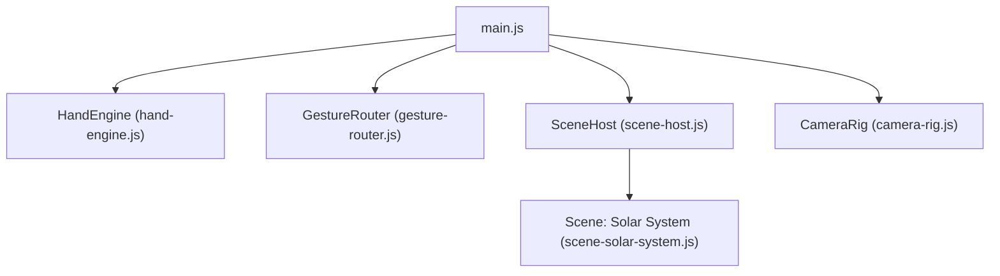
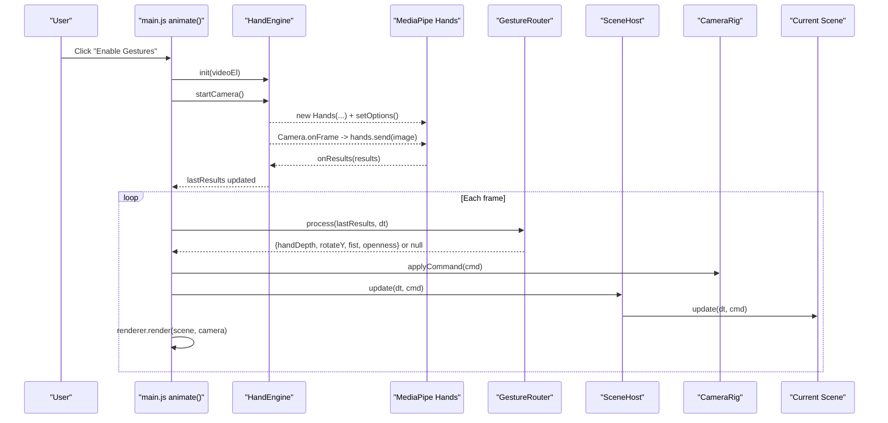
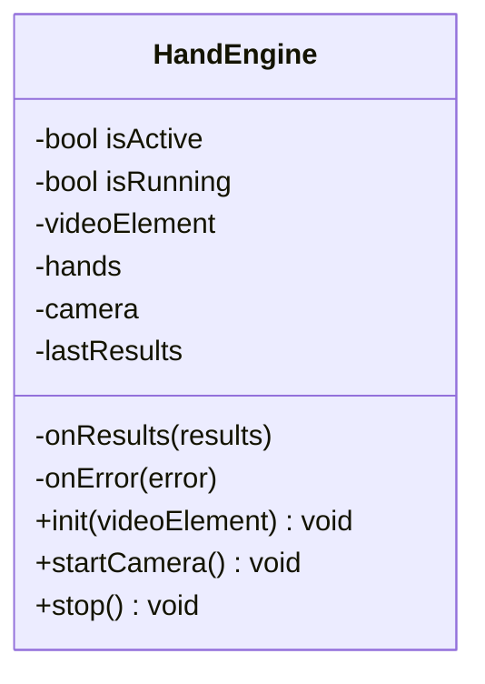
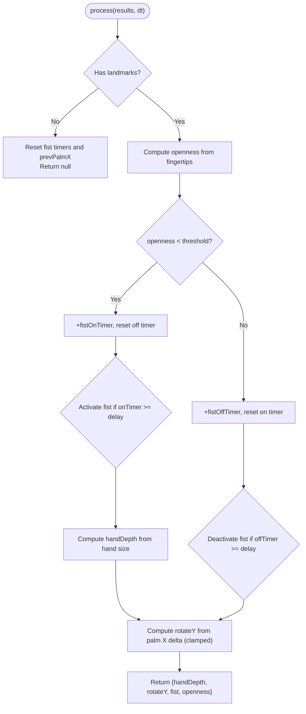
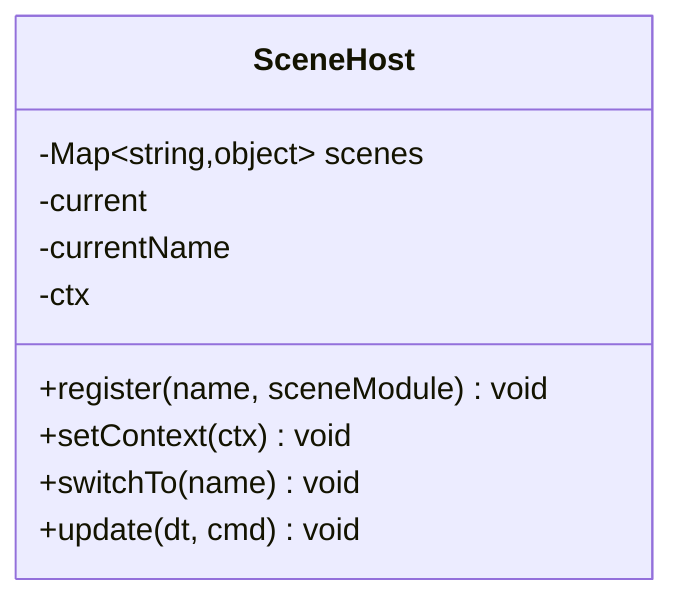
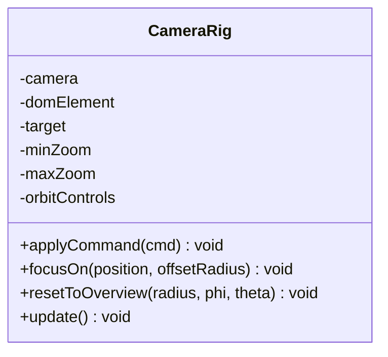
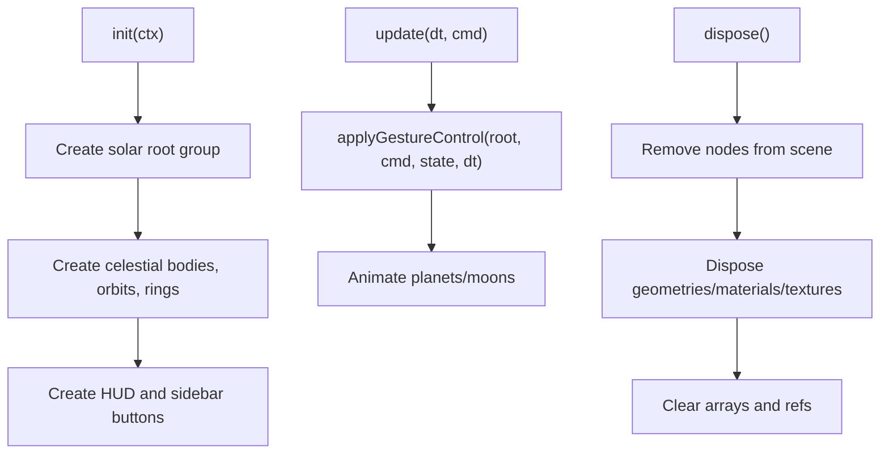
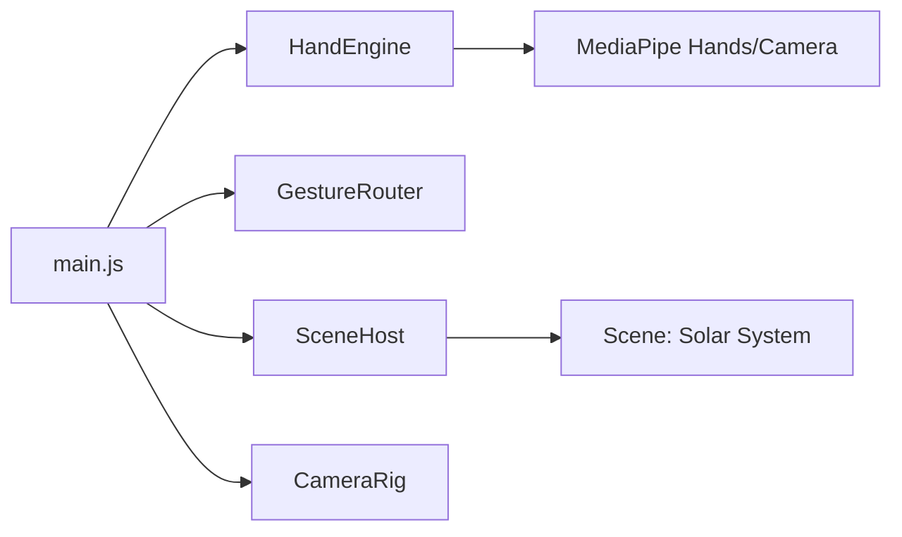

# Performance Optimization & Error Handling

<cite>
**Referenced Files in This Document**
- [main.js](file://src/science/gesture-cosmos/main.js)
- [hand-engine.js](file://src/science/gesture-cosmos/core/hand-engine.js)
- [gesture-router.js](file://src/science/gesture-cosmos/core/gesture-router.js)
- [scene-host.js](file://src/science/gesture-cosmos/core/scene-host.js)
- [camera-rig.js](file://src/science/gesture-cosmos/core/camera-rig.js)
- [scene-solar-system.js](file://src/science/gesture-cosmos/scenes/scene-solar-system.js)
</cite>

## Table of Contents
1. [Introduction](#introduction)
2. [Project Structure](#project-structure)
3. [Core Components](#core-components)
4. [Architecture Overview](#architecture-overview)
5. [Detailed Component Analysis](#detailed-component-analysis)
6. [Dependency Analysis](#dependency-analysis)
7. [Performance Considerations](#performance-considerations)
8. [Troubleshooting Guide](#troubleshooting-guide)
9. [Conclusion](#conclusion)

## Introduction
This document focuses on performance optimization and error handling strategies for the gesture recognition system used by the Gesture Cosmos application. It explains how frame rate limiting, requestAnimationFrame scheduling, and processing queue management are implemented to prevent MediaPipe request stacking. It also covers memory leak prevention through proper animation frame cancellation, camera track cleanup, and MediaPipe instance disposal. Finally, it details error recovery patterns (including consecutive error counting and automatic state reset), graceful degradation strategies, performance monitoring techniques, FPS measurement tools, and mobile-specific optimizations including battery usage considerations and thermal throttling mitigation.

## Project Structure
The Gesture Cosmos module is organized into core runtime components and scene modules:
- Core runtime: HandEngine (MediaPipe wrapper), GestureRouter (command generation), SceneHost (lifecycle), CameraRig (mouse/touch orbit controls).
- Scenes: e.g., Solar System, which applies gestures to 3D objects.
- Entry point: main.js orchestrates initialization, navigation, render loop, and gesture pipeline wiring.

**Diagram sources**
- [main.js:1-187](file://src/science/gesture-cosmos/main.js#L1-L187)
- [hand-engine.js:1-83](file://src/science/gesture-cosmos/core/hand-engine.js#L1-L83)
- [gesture-router.js:1-111](file://src/science/gesture-cosmos/core/gesture-router.js#L1-L111)
- [scene-host.js:1-63](file://src/science/gesture-cosmos/core/scene-host.js#L1-L63)
- [camera-rig.js:1-61](file://src/science/gesture-cosmos/core/camera-rig.js#L1-L61)
- [scene-solar-system.js:1-439](file://src/science/gesture-cosmos/scenes/scene-solar-system.js#L1-L439)

**Section sources**
- [main.js:1-187](file://src/science/gesture-cosmos/main.js#L1-L187)

## Core Components
- HandEngine: Initializes MediaPipe Hands, starts/stops camera, forwards frames to hands.send(), exposes lastResults and error callbacks.
- GestureRouter: Translates raw landmarks into a unified command object with handDepth, rotateY, fist, openness; includes debounced fist detection and rotation clamping.
- SceneHost: Manages scene registration, switching, lifecycle (init/update/dispose), and resets camera overview after successful init.
- CameraRig: Mouse/touch orbit control via OrbitControls; not driven by gestures but updated each frame.
- Scene (Solar System): Applies gesture-driven scale/rotation to a root group and manages its own resources (textures, geometries, materials) with dispose().

Key responsibilities:
- Frame pacing and rendering loop in main.js.
- MediaPipe integration and resource cleanup in HandEngine.
- Command generation and debouncing in GestureRouter.
- Scene lifecycle and resource disposal in SceneHost and individual scenes.

**Section sources**
- [hand-engine.js:1-83](file://src/science/gesture-cosmos/core/hand-engine.js#L1-L83)
- [gesture-router.js:1-111](file://src/science/gesture-cosmos/core/gesture-router.js#L1-L111)
- [scene-host.js:1-63](file://src/science/gesture-cosmos/core/scene-host.js#L1-L63)
- [camera-rig.js:1-61](file://src/science/gesture-cosmos/core/camera-rig.js#L1-L61)
- [scene-solar-system.js:1-439](file://src/science/gesture-cosmos/scenes/scene-solar-system.js#L1-L439)

## Architecture Overview
The runtime flow connects camera frames to MediaPipe, then to gesture commands, and finally to scene updates and rendering.

**Diagram sources**
- [main.js:117-187](file://src/science/gesture-cosmos/main.js#L117-L187)
- [hand-engine.js:21-83](file://src/science/gesture-cosmos/core/hand-engine.js#L21-L83)
- [gesture-router.js:34-110](file://src/science/gesture-cosmos/core/gesture-router.js#L34-L110)
- [scene-host.js:31-62](file://src/science/gesture-cosmos/core/scene-host.js#L31-L62)
- [camera-rig.js:10-32](file://src/science/gesture-cosmos/core/camera-rig.js#L10-L32)

## Detailed Component Analysis

### HandEngine — MediaPipe Integration and Cleanup
Responsibilities:
- Initialize MediaPipe Hands with locateFile and options.
- Start camera with fixed resolution and onFrame callback that sends images to hands.send().
- Expose lastResults and onError/onResults hooks.
- Stop camera and close MediaPipe instances; clear references to avoid leaks.

Performance and safety notes:
- Fixed camera width/height reduces GPU/CPU load compared to full-resolution streams.
- Conditional send only when videoElement.readyState indicates sufficient data.
- stop() ensures both camera.stop() and hands.close() are called, even if errors occur.

**Diagram sources**
- [hand-engine.js:5-83](file://src/science/gesture-cosmos/core/hand-engine.js#L5-L83)

**Section sources**
- [hand-engine.js:21-83](file://src/science/gesture-cosmos/core/hand-engine.js#L21-L83)

### GestureRouter — Command Generation and Debouncing
Responsibilities:
- Compute openness from fingertip distances.
- Debounce fist activation/deactivation using timers and thresholds.
- Derive handDepth from apparent hand size.
- Clamp per-frame Y-axis rotation delta to avoid jitter.
- Return null when no hand detected; reset internal state accordingly.

**Diagram sources**
- [gesture-router.js:34-110](file://src/science/gesture-cosmos/core/gesture-router.js#L34-L110)

**Section sources**
- [gesture-router.js:34-110](file://src/science/gesture-cosmos/core/gesture-router.js#L34-L110)

### SceneHost — Lifecycle Management and Resource Disposal
Responsibilities:
- Register and switch scenes.
- Dispose previous scene before initializing next.
- Reset camera overview after successful init.
- Provide update(dt, cmd) to current scene.

**Diagram sources**
- [scene-host.js:11-62](file://src/science/gesture-cosmos/core/scene-host.js#L11-L62)

**Section sources**
- [scene-host.js:31-62](file://src/science/gesture-cosmos/core/scene-host.js#L31-L62)

### CameraRig — Mouse/Touch Orbit Controls
Responsibilities:
- Wrap OrbitControls with damping and distance limits.
- Update controls each frame.
- Focus/reset helpers for camera positioning.

**Diagram sources**
- [camera-rig.js:10-60](file://src/science/gesture-cosmos/core/camera-rig.js#L10-L60)

**Section sources**
- [camera-rig.js:10-60](file://src/science/gesture-cosmos/core/camera-rig.js#L10-L60)

### Scene: Solar System — Gesture Application and Memory Management
Responsibilities:
- Apply gesture-driven scale/rotation to a root group.
- Manage textures, geometries, materials, and UI elements.
- Implement dispose() to remove nodes and free GPU resources.

**Diagram sources**
- [scene-solar-system.js:268-300](file://src/science/gesture-cosmos/scenes/scene-solar-system.js#L268-L300)
- [scene-solar-system.js:362-404](file://src/science/gesture-cosmos/scenes/scene-solar-system.js#L362-L404)
- [scene-solar-system.js:406-439](file://src/science/gesture-cosmos/scenes/scene-solar-system.js#L406-L439)

**Section sources**
- [scene-solar-system.js:268-300](file://src/science/gesture-cosmos/scenes/scene-solar-system.js#L268-L300)
- [scene-solar-system.js:362-404](file://src/science/gesture-cosmos/scenes/scene-solar-system.js#L362-L404)
- [scene-solar-system.js:406-439](file://src/science/gesture-cosmos/scenes/scene-solar-system.js#L406-L439)

## Dependency Analysis
High-level dependencies:
- main.js depends on HandEngine, GestureRouter, SceneHost, CameraRig.
- SceneHost depends on scene modules (e.g., Solar System).
- HandEngine depends on external MediaPipe Hands and Camera utilities.
- GestureRouter is independent of rendering; it consumes results and emits commands.

**Diagram sources**
- [main.js:1-187](file://src/science/gesture-cosmos/main.js#L1-L187)
- [hand-engine.js:1-83](file://src/science/gesture-cosmos/core/hand-engine.js#L1-L83)
- [gesture-router.js:1-111](file://src/science/gesture-cosmos/core/gesture-router.js#L1-L111)
- [scene-host.js:1-63](file://src/science/gesture-cosmos/core/scene-host.js#L1-L63)
- [camera-rig.js:1-61](file://src/science/gesture-cosmos/core/camera-rig.js#L1-L61)
- [scene-solar-system.js:1-439](file://src/science/gesture-cosmos/scenes/scene-solar-system.js#L1-L439)

**Section sources**
- [main.js:1-187](file://src/science/gesture-cosmos/main.js#L1-L187)

## Performance Considerations

### Frame Rate Limiting and Target FPS
- The Gesture Cosmos hub uses requestAnimationFrame without explicit targetFPS capping; frames are processed at display refresh rate.
- In other parts of the repository (dist assets), there is an example of targetFPS configuration and frame interval calculation, demonstrating a pattern you can adopt:
  - Maintain a targetFPS value.
  - Compute frameInterval = 1000 / targetFPS.
  - Throttle processing by comparing performance.now() against the last processed time.

Recommendation for Gesture Cosmos:
- Introduce a targetFPS setting in HandEngine or main.js.
- Skip hands.send() calls when below the frame interval to reduce CPU/GPU pressure.
- Keep the render loop running at native refresh for smooth visuals while decoupling MediaPipe processing cadence.

**Section sources**
- [main.js:160-187](file://src/science/gesture-cosmos/main.js#L160-L187)
- [hand-engine.js:48-71](file://src/science/gesture-cosmos/core/hand-engine.js#L48-L71)

### requestAnimationFrame Scheduling
- The main loop schedules itself recursively via requestAnimationFrame.
- Delta time is computed and capped to avoid large jumps.
- Ensure that heavy operations (like MediaPipe inference) are gated by frame interval logic to prevent stacking.

Best practices:
- Use a single rAF loop for rendering.
- Gate MediaPipe processing with a throttle based on targetFPS.
- Avoid nested rAF calls inside MediaPipe callbacks.

**Section sources**
- [main.js:160-187](file://src/science/gesture-cosmos/main.js#L160-L187)

### Processing Queue Management to Prevent MediaPipe Request Stacking
- HandEngine’s onFrame callback invokes hands.send() synchronously. If many frames arrive quickly, this can stack requests.
- Mitigation strategies:
  - Add a simple queue flag (e.g., _sending) to ensure only one send() is active at a time.
  - Drop or coalesce frames when already sending.
  - Optionally buffer the latest frame image reference so only the most recent is sent.

Implementation guidance:
- In onFrame, check if a send is in progress; if so, skip until the previous completes.
- After hands.send() resolves, mark sending as complete.

**Section sources**
- [hand-engine.js:56-71](file://src/science/gesture-cosmos/core/hand-engine.js#L56-L71)

### Memory Leak Prevention
- Animation frame cancellation:
  - For any additional rAF loops (e.g., confetti or particle effects), store IDs and cancel them during dispose or teardown.
- Camera track cleanup:
  - Always call camera.stop() in stop(); ensure tracks are released by stopping the underlying stream if needed.
- MediaPipe instance disposal:
  - Call hands.close() and nullify references to allow GC.
- Scene resource disposal:
  - Remove nodes from scene graph and dispose geometries, materials, textures.

Operational checks:
- Verify that stop() clears all references and stops camera.
- Ensure scene.dispose() removes DOM UI and frees GPU resources.

**Section sources**
- [hand-engine.js:73-83](file://src/science/gesture-cosmos/core/hand-engine.js#L73-L83)
- [scene-solar-system.js:406-439](file://src/science/gesture-cosmos/scenes/scene-solar-system.js#L406-L439)

### Error Recovery Patterns
- Consecutive error counting:
  - Track consecutive failures in MediaPipe initialization or camera start.
  - After a threshold, automatically reset processing state and prompt user to retry.
- Automatic state reset mechanisms:
  - When no hand is detected, GestureRouter resets fist timers and prevPalmX.
  - On scene switch, SceneHost disposes previous scene and resets camera overview.
- Graceful degradation:
  - If camera/MediaPipe fails, fall back to mouse-only controls (OrbitControls) and inform the user.

Example flows:
- Hub-level try/catch around init/startCamera shows fallback behavior.
- SceneHost catches init errors and reverts state.

**Section sources**
- [main.js:117-130](file://src/science/gesture-cosmos/main.js#L117-L130)
- [gesture-router.js:34-42](file://src/science/gesture-cosmos/core/gesture-router.js#L34-L42)
- [scene-host.js:31-55](file://src/science/gesture-cosmos/core/scene-host.js#L31-L55)

### Performance Monitoring Techniques and FPS Measurement
- Simple FPS meter:
  - Maintain a rolling average of frame deltas over N frames.
  - Display FPS in a HUD element.
- Instrumentation points:
  - Measure time between rAF calls.
  - Log MediaPipe send duration and result latency.
- Visual feedback:
  - Show “GESTURE ACTIVE” vs “MOUSE CONTROL” status.
  - Display current FPS in scene HUD where applicable.

Practical steps:
- Add a small FPS counter in main.js animate().
- Update a DOM element with rounded FPS values.
- Optionally log warnings when FPS drops below a threshold.

**Section sources**
- [main.js:160-187](file://src/science/gesture-cosmos/main.js#L160-L187)

### Mobile-Specific Optimizations, Battery Usage, and Thermal Throttling
- Reduce camera resolution and model complexity:
  - Lower width/height and modelComplexity to decrease CPU/GPU load.
- Cap MediaPipe processing frequency:
  - Use targetFPS to limit inference calls.
- Adaptive quality:
  - Dynamically lower targetFPS or disable effects when device temperature or battery drain is high (if available via APIs).
- Minimize allocations:
  - Reuse buffers and avoid creating objects in hot paths.
- Touch-friendly interactions:
  - Ensure OrbitControls damping and zoom ranges are comfortable on mobile.

[No sources needed since this section provides general guidance]

## Troubleshooting Guide

Common issues and resolutions:
- Camera permission denied or unavailable:
  - Symptom: Toast message indicating camera unavailable; overlay removed.
  - Action: Fall back to mouse controls; guide user to grant permissions.
- MediaPipe not loaded:
  - Symptom: Error thrown during init.
  - Action: Ensure CDN scripts are present; handle onError and show user-friendly message.
- No hand detected:
  - Symptom: GestureRouter returns null; fist timers reset.
  - Action: Improve lighting/contrast; ensure hand is within frame.
- Scene init failure:
  - Symptom: SceneHost logs error and resets current scene.
  - Action: Inspect console; verify assets and dynamic imports.
- Memory growth over time:
  - Symptom: Increasing GPU memory usage across scene switches.
  - Action: Confirm scene.dispose() runs; verify geometry/material/texture disposal; ensure camera.stop() and hands.close() are called.

Diagnostic tips:
- Use browser DevTools Performance tab to identify spikes.
- Monitor FPS in HUD; watch for sustained drops.
- Check MediaPipe send() frequency and result callback timing.

**Section sources**
- [main.js:117-130](file://src/science/gesture-cosmos/main.js#L117-L130)
- [hand-engine.js:21-46](file://src/science/gesture-cosmos/core/hand-engine.js#L21-L46)
- [gesture-router.js:34-42](file://src/science/gesture-cosmos/core/gesture-router.js#L34-L42)
- [scene-host.js:31-55](file://src/science/gesture-cosmos/core/scene-host.js#L31-L55)

## Conclusion
The Gesture Cosmos system integrates MediaPipe hand tracking with a Three.js-based scene manager. To optimize performance and reliability:
- Implement frame rate limiting for MediaPipe processing while keeping the render loop smooth.
- Guard against request stacking by serializing or dropping redundant frames.
- Enforce strict cleanup of animation frames, camera tracks, and MediaPipe instances.
- Adopt robust error recovery with consecutive error counting and automatic state resets.
- Provide FPS monitoring and graceful degradation to maintain usability across devices.
- Tailor settings for mobile environments to conserve battery and mitigate thermal throttling.

[No sources needed since this section summarizes without analyzing specific files]