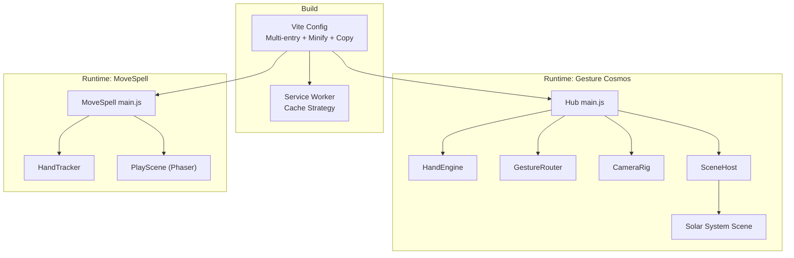
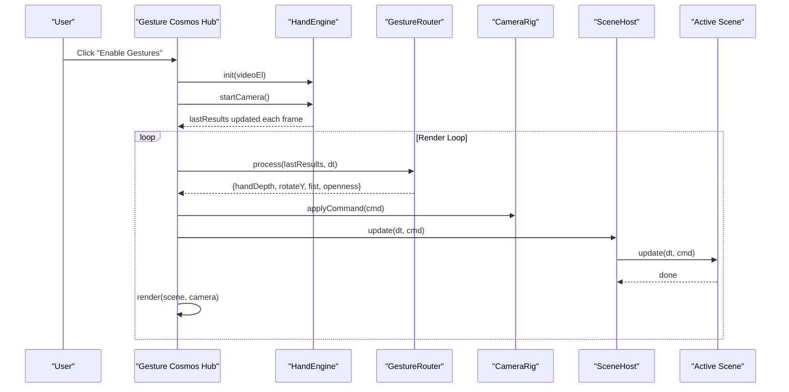
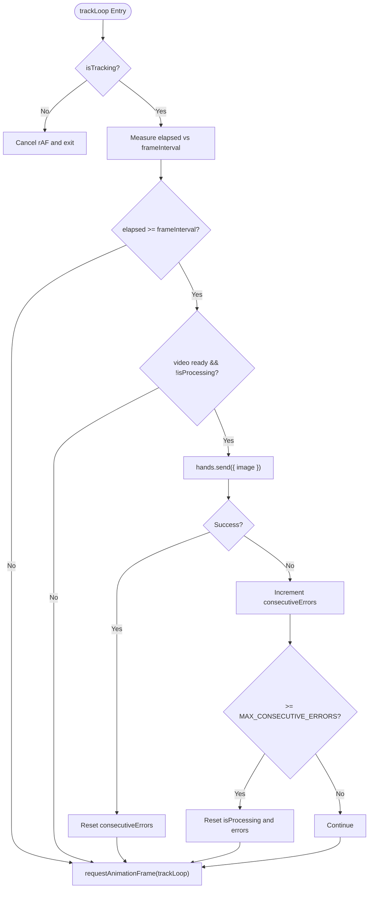
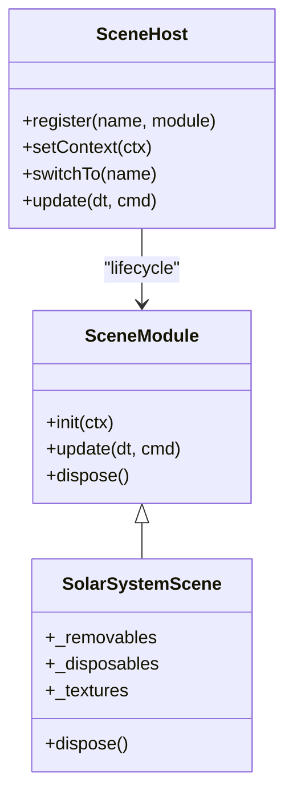
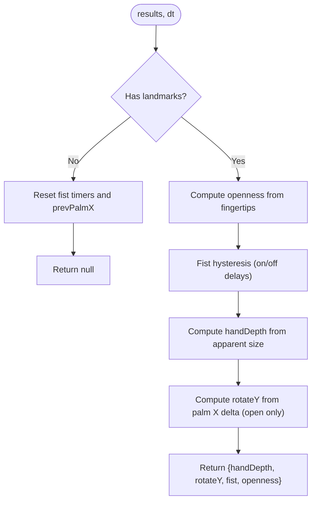
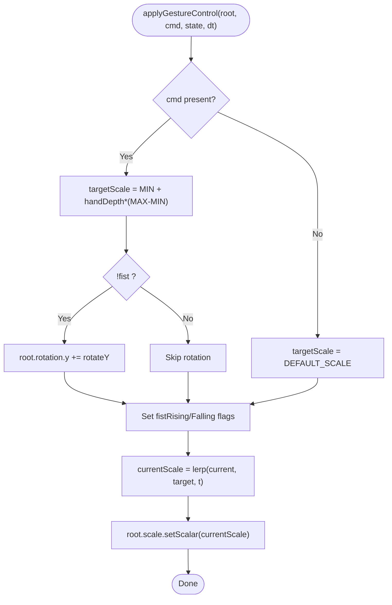
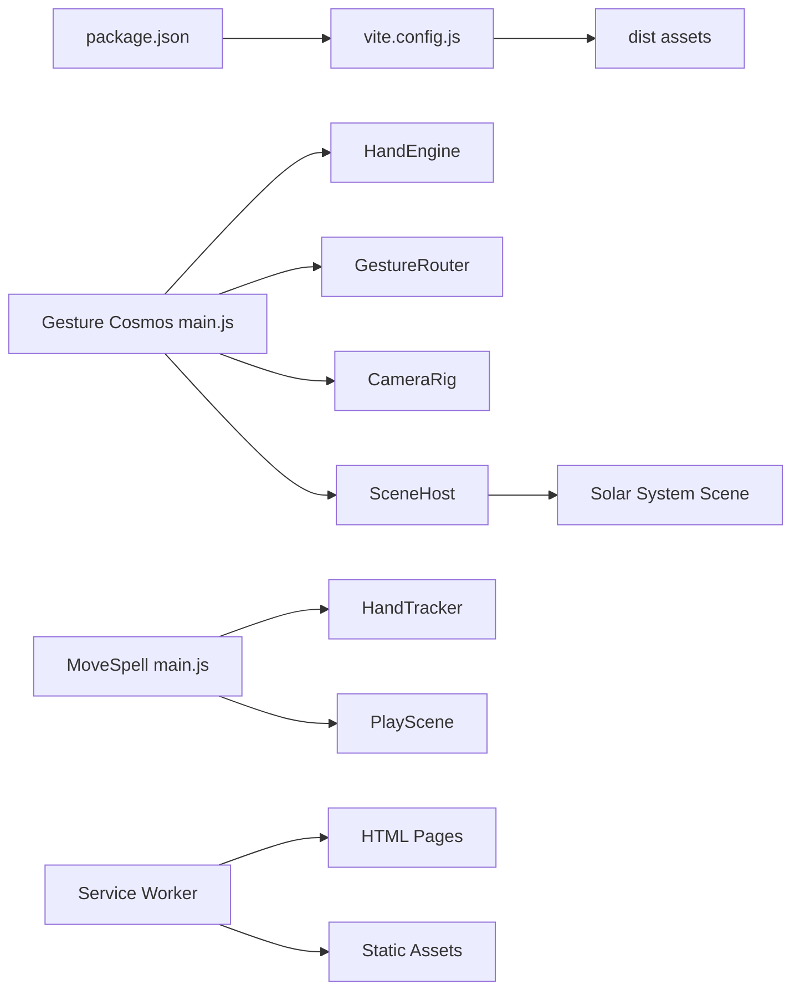

# Performance Optimization & Monitoring

<cite>
**Referenced Files in This Document**
- [vite.config.js](file://vite.config.js)
- [package.json](file://package.json)
- [src/science/gesture-cosmos/main.js](file://src/science/gesture-cosmos/main.js)
- [src/science/gesture-cosmos/core/hand-engine.js](file://src/science/gesture-cosmos/core/hand-engine.js)
- [src/science/gesture-cosmos/core/scene-host.js](file://src/science/gesture-cosmos/core/scene-host.js)
- [src/science/gesture-cosmos/core/camera-rig.js](file://src/science/gesture-cosmos/core/camera-rig.js)
- [src/science/gesture-cosmos/core/gesture-router.js](file://src/science/gesture-cosmos/core/gesture-router.js)
- [src/science/gesture-cosmos/core/gesture-control.js](file://src/science/gesture-cosmos/core/gesture-control.js)
- [src/science/gesture-cosmos/scenes/scene-solar-system.js](file://src/science/gesture-cosmos/scenes/scene-solar-system.js)
- [src/literacy/movespelling/js/core/hand-tracker.js](file://src/literacy/movespelling/js/core/hand-tracker.js)
- [src/literacy/movespelling/js/main.js](file://src/literacy/movespelling/js/main.js)
- [src/literacy/movespelling/js/game/scene-play.js](file://src/literacy/movespelling/js/game/scene-play.js)
- [src/sw.js](file://src/sw.js)
</cite>

## Table of Contents
1. Introduction
2. Project Structure
3. Core Components
4. Architecture Overview
5. Detailed Component Analysis
6. Dependency Analysis
7. Performance Considerations
8. Troubleshooting Guide
9. Conclusion
10. Appendices

## Introduction
This document provides comprehensive performance optimization strategies for advanced features across gesture recognition and 3D rendering, with a focus on frame rate limiting, memory management, resource cleanup, profiling and monitoring, lazy loading, efficient animation loops, garbage collection considerations, mobile device performance, battery usage, thermal throttling mitigation, debugging techniques, and build-time optimizations using Vite. It synthesizes patterns found in the repository’s real-time applications (Gesture Cosmos and MoveSpell) to guide implementation and troubleshooting.

## Project Structure
The project is a multi-app educational suite with:
- A shared build pipeline via Vite that discovers multiple HTML entry points and copies static assets.
- Two major runtime subsystems:
  - Gesture Cosmos: Three.js-based 3D scenes with gesture-driven object control and OrbitControls camera.
  - MoveSpell: Phaser-based game with MediaPipe hand tracking for letter-grabbing gameplay.
- A service worker for caching and offline behavior.

**Diagram sources**
- [vite.config.js](file://vite.config.js)
- [src/science/gesture-cosmos/main.js](file://src/science/gesture-cosmos/main.js)
- [src/science/gesture-cosmos/core/hand-engine.js](file://src/science/gesture-cosmos/core/hand-engine.js)
- [src/science/gesture-cosmos/core/gesture-router.js](file://src/science/gesture-cosmos/core/gesture-router.js)
- [src/science/gesture-cosmos/core/camera-rig.js](file://src/science/gesture-cosmos/core/camera-rig.js)
- [src/science/gesture-cosmos/core/scene-host.js](file://src/science/gesture-cosmos/core/scene-host.js)
- [src/science/gesture-cosmos/scenes/scene-solar-system.js](file://src/science/gesture-cosmos/scenes/scene-solar-system.js)
- [src/literacy/movespelling/js/main.js](file://src/literacy/movespelling/js/main.js)
- [src/literacy/movespelling/js/core/hand-tracker.js](file://src/literacy/movespelling/js/core/hand-tracker.js)
- [src/literacy/movespelling/js/game/scene-play.js](file://src/literacy/movespelling/js/game/scene-play.js)
- [src/sw.js](file://src/sw.js)

**Section sources**
- [vite.config.js](file://vite.config.js)
- [package.json](file://package.json)

## Core Components
- Gesture Cosmos Hub: Initializes shared Three.js renderer/scene/camera, core modules (HandEngine, GestureRouter, CameraRig, SceneHost), registers scene modules lazily, and runs the render loop.
- HandEngine: Lightweight wrapper around MediaPipe Hands/Camera utilities; manages initialization, camera start, and stop.
- GestureRouter: Translates raw landmarks into unified commands (hand depth, rotation delta, fist state).
- CameraRig: Mouse/touch orbit controls; decouples gestures from camera movement.
- SceneHost: Manages lifecycle per scene (init/update/dispose) and ensures proper disposal on switch.
- Solar System Scene: Demonstrates heavy 3D setup, texture management, and explicit dispose.
- MoveSpell: Integrates MediaPipe hand tracking with Phaser game events and UI feedback.
- Service Worker: Pre-caches essential pages and applies stale-while-revalidate for assets.

Key performance-related behaviors:
- Lazy loading of scene modules via dynamic import.
- Frame-rate limiting in hand tracking to reduce CPU/GPU load.
- Explicit disposal of textures, geometries, materials, and DOM nodes on scene switch.
- Pixel ratio capping and responsive resize handling.

**Section sources**
- [src/science/gesture-cosmos/main.js](file://src/science/gesture-cosmos/main.js)
- [src/science/gesture-cosmos/core/hand-engine.js](file://src/science/gesture-cosmos/core/hand-engine.js)
- [src/science/gesture-cosmos/core/gesture-router.js](file://src/science/gesture-cosmos/core/gesture-router.js)
- [src/science/gesture-cosmos/core/camera-rig.js](file://src/science/gesture-cosmos/core/camera-rig.js)
- [src/science/gesture-cosmos/core/scene-host.js](file://src/science/gesture-cosmos/core/scene-host.js)
- [src/science/gesture-cosmos/scenes/scene-solar-system.js](file://src/science/gesture-cosmos/scenes/scene-solar-system.js)
- [src/literacy/movespelling/js/core/hand-tracker.js](file://src/literacy/movespelling/js/core/hand-tracker.js)
- [src/literacy/movespelling/js/main.js](file://src/literacy/movespelling/js/main.js)
- [src/literacy/movespelling/js/game/scene-play.js](file://src/literacy/movespelling/js/game/scene-play.js)
- [src/sw.js](file://src/sw.js)

## Architecture Overview
The system separates concerns between input processing (gesture detection), command translation, scene orchestration, and rendering. The hub coordinates these layers and defers heavy scene code until needed.

**Diagram sources**
- [src/science/gesture-cosmos/main.js](file://src/science/gesture-cosmos/main.js)
- [src/science/gesture-cosmos/core/hand-engine.js](file://src/science/gesture-cosmos/core/hand-engine.js)
- [src/science/gesture-cosmos/core/gesture-router.js](file://src/science/gesture-cosmos/core/gesture-router.js)
- [src/science/gesture-cosmos/core/camera-rig.js](file://src/science/gesture-cosmos/core/camera-rig.js)
- [src/science/gesture-cosmos/core/scene-host.js](file://src/science/gesture-cosmos/core/scene-host.js)
- [src/science/gesture-cosmos/scenes/scene-solar-system.js](file://src/science/gesture-cosmos/scenes/scene-solar-system.js)

## Detailed Component Analysis

### Gesture Recognition Pipeline (MoveSpell)
Frame-rate limiting and robust error handling are implemented to prevent request stacking and excessive CPU usage during hand detection.

**Diagram sources**
- [src/literacy/movespelling/js/core/hand-tracker.js](file://src/literacy/movespelling/js/core/hand-tracker.js)

**Section sources**
- [src/literacy/movespelling/js/core/hand-tracker.js](file://src/literacy/movespelling/js/core/hand-tracker.js)
- [src/literacy/movespelling/js/main.js](file://src/literacy/movespelling/js/main.js)
- [src/literacy/movespelling/js/game/scene-play.js](file://src/literacy/movespelling/js/game/scene-play.js)

### 3D Rendering and Resource Management (Gesture Cosmos)
Scene lifecycle management ensures resources are disposed when switching scenes, preventing GPU memory leaks.

**Diagram sources**
- [src/science/gesture-cosmos/core/scene-host.js](file://src/science/gesture-cosmos/core/scene-host.js)
- [src/science/gesture-cosmos/scenes/scene-solar-system.js](file://src/science/gesture-cosmos/scenes/scene-solar-system.js)

**Section sources**
- [src/science/gesture-cosmos/core/scene-host.js](file://src/science/gesture-cosmos/core/scene-host.js)
- [src/science/gesture-cosmos/scenes/scene-solar-system.js](file://src/science/gesture-cosmos/scenes/scene-solar-system.js)

### Gesture Command Translation
The router computes openness, fist debouncing, hand depth proxy, and Y-axis rotation deltas.

**Diagram sources**
- [src/science/gesture-cosmos/core/gesture-router.js](file://src/science/gesture-cosmos/core/gesture-router.js)

**Section sources**
- [src/science/gesture-cosmos/core/gesture-router.js](file://src/science/gesture-cosmos/core/gesture-router.js)

### Object Control Application
Shared utility applies scale lerp and rotation based on commands, exposing one-frame rising/falling edges for effects like explosions.

**Diagram sources**
- [src/science/gesture-cosmos/core/gesture-control.js](file://src/science/gesture-cosmos/core/gesture-control.js)

**Section sources**
- [src/science/gesture-cosmos/core/gesture-control.js](file://src/science/gesture-cosmos/core/gesture-control.js)

## Dependency Analysis
- Build-time dependencies:
  - Vite orchestrates multi-entry builds, minification, and asset copying.
  - Externalized Three.js imports to leverage CDN via importmap in HTML.
- Runtime dependencies:
  - Gesture Cosmos depends on Three.js, OrbitControls, and MediaPipe Hands/Camera.
  - MoveSpell depends on Phaser and MediaPipe Hands.
  - Service Worker caches HTML and assets with network-first/stale-while-revalidate strategies.

**Diagram sources**
- [vite.config.js](file://vite.config.js)
- [package.json](file://package.json)
- [src/science/gesture-cosmos/main.js](file://src/science/gesture-cosmos/main.js)
- [src/science/gesture-cosmos/core/hand-engine.js](file://src/science/gesture-cosmos/core/hand-engine.js)
- [src/science/gesture-cosmos/core/gesture-router.js](file://src/science/gesture-cosmos/core/gesture-router.js)
- [src/science/gesture-cosmos/core/camera-rig.js](file://src/science/gesture-cosmos/core/camera-rig.js)
- [src/science/gesture-cosmos/core/scene-host.js](file://src/science/gesture-cosmos/core/scene-host.js)
- [src/science/gesture-cosmos/scenes/scene-solar-system.js](file://src/science/gesture-cosmos/scenes/scene-solar-system.js)
- [src/literacy/movespelling/js/main.js](file://src/literacy/movespelling/js/main.js)
- [src/literacy/movespelling/js/core/hand-tracker.js](file://src/literacy/movespelling/js/core/hand-tracker.js)
- [src/literacy/movespelling/js/game/scene-play.js](file://src/literacy/movespelling/js/game/scene-play.js)
- [src/sw.js](file://src/sw.js)

**Section sources**
- [vite.config.js](file://vite.config.js)
- [package.json](file://package.json)
- [src/sw.js](file://src/sw.js)

## Performance Considerations

### Frame Rate Limiting Techniques
- Hand tracking frame limiter:
  - Enforces a target FPS by gating frames against a frame interval and preventing overlapping sends.
  - Resets processing flags after success or on consecutive errors to avoid stalls.
- 3D render loop:
  - Uses requestAnimationFrame with delta time clamping to avoid large jumps.
  - Caps pixel ratio to balance quality and performance.

Implementation references:
- Frame limiter and error recovery in hand tracker loop.
- Delta time calculation and pixel ratio cap in the hub render loop.

**Section sources**
- [src/literacy/movespelling/js/core/hand-tracker.js](file://src/literacy/movespelling/js/core/hand-tracker.js)
- [src/science/gesture-cosmos/main.js](file://src/science/gesture-cosmos/main.js)

### Memory Management Patterns
- Texture and geometry/material disposal:
  - Track textures separately and dispose them on scene switch.
  - Separate static vs. transient disposables to avoid destroying shared lights/backgrounds prematurely.
- DOM node removal:
  - Remove HUD/UI elements from DOM before disposing 3D objects.
- Event listener cleanup:
  - Unsubscribe hand tracking events and clear timers in scene shutdown.

Implementation references:
- Scene host calls dispose on previous scene before initializing next.
- Solar system scene disposes tracked textures, geometries, materials, and removes DOM nodes.
- PlayScene clears event listeners and timers on shutdown.

**Section sources**
- [src/science/gesture-cosmos/core/scene-host.js](file://src/science/gesture-cosmos/core/scene-host.js)
- [src/science/gesture-cosmos/scenes/scene-solar-system.js](file://src/science/gesture-cosmos/scenes/scene-solar-system.js)
- [src/literacy/movespelling/js/game/scene-play.js](file://src/literacy/movespelling/js/game/scene-play.js)

### Resource Cleanup Procedures
- Hand engine stop:
  - Stops camera tracks, closes MediaPipe instance, and nullifies references.
- Service Worker cache maintenance:
  - Deletes old caches on activation and claims clients.

Implementation references:
- HandEngine.stop releases camera and hands resources.
- Service Worker activate deletes outdated caches.

**Section sources**
- [src/science/gesture-cosmos/core/hand-engine.js](file://src/science/gesture-cosmos/core/hand-engine.js)
- [src/sw.js](file://src/sw.js)

### Profiling Tools and Monitoring Approaches
- Use browser DevTools:
  - Performance tab to capture frame timelines and identify long tasks.
  - Memory tab to track heap snapshots and look for retained textures/DOM nodes.
  - Network panel to verify asset sizes and caching behavior.
- Add lightweight telemetry:
  - Log FPS periodically and expose counters for hand detection errors.
  - Monitor WebGL context loss warnings and texture upload times.

[No sources needed since this section provides general guidance]

### Implementation Examples

#### Lazy Loading of Heavy Resources
- Dynamic import of scene modules on first navigation to defer parsing and execution.
- Asset preloading strategy:
  - Use Service Worker to pre-cache critical HTML and assets.
  - Stale-while-revalidate for non-critical assets to improve perceived performance.

Implementation references:
- Dynamic import map for scenes in the hub.
- Service Worker precache list and fetch strategy.

**Section sources**
- [src/science/gesture-cosmos/main.js](file://src/science/gesture-cosmos/main.js)
- [src/sw.js](file://src/sw.js)

#### Efficient Animation Loops
- Clamp delta time to avoid large jumps and ensure stable physics/animation.
- Use simple lerps for smooth transitions instead of expensive computations every frame.
- Avoid unnecessary allocations inside the loop (e.g., reuse vectors where possible).

Implementation references:
- Delta time clamping in the hub loop.
- Lerp-based scale application in gesture control.

**Section sources**
- [src/science/gesture-cosmos/main.js](file://src/science/gesture-cosmos/main.js)
- [src/science/gesture-cosmos/core/gesture-control.js](file://src/science/gesture-cosmos/core/gesture-control.js)

#### Garbage Collection Optimization
- Ensure all textures, geometries, and materials are explicitly disposed.
- Remove DOM nodes and cancel animation frames to break references.
- Avoid closures capturing large objects unnecessarily.

Implementation references:
- Scene disposal routines and DOM cleanup.
- Hand tracker cancellation of animation frames and media tracks.

**Section sources**
- [src/science/gesture-cosmos/scenes/scene-solar-system.js](file://src/science/gesture-cosmos/scenes/scene-solar-system.js)
- [src/literacy/movespelling/js/core/hand-tracker.js](file://src/literacy/movespelling/js/core/hand-tracker.js)

### Mobile Device Performance Considerations
- Reduce camera resolution and model complexity for hand tracking.
- Cap pixel ratio and disable debug drawing in production.
- Prefer CSS animations over JS-heavy transforms where feasible.
- Use audio unlock on user interaction to comply with autoplay policies.

Implementation references:
- Hand tracker constraints and iOS-specific attributes.
- Pixel ratio cap and OrbitControls damping.

**Section sources**
- [src/literacy/movespelling/js/core/hand-tracker.js](file://src/literacy/movespelling/js/core/hand-tracker.js)
- [src/science/gesture-cosmos/main.js](file://src/science/gesture-cosmos/main.js)
- [src/science/gesture-cosmos/core/camera-rig.js](file://src/science/gesture-cosmos/core/camera-rig.js)
- [src/literacy/movespelling/js/main.js](file://src/literacy/movespelling/js/main.js)

### Battery Usage Optimization and Thermal Throttling Mitigation
- Lower target FPS for hand tracking to reduce CPU/GPU load.
- Avoid continuous heavy operations; batch updates and skip work when idle.
- Disable debug overlays and logging in production.
- Use efficient shaders and fewer draw calls; reuse materials and geometries.

Implementation references:
- Target FPS configuration and frame gating in hand tracker.
- Minimalistic gesture control logic and OrbitControls damping.

**Section sources**
- [src/literacy/movespelling/js/core/hand-tracker.js](file://src/literacy/movespelling/js/core/hand-tracker.js)
- [src/science/gesture-cosmos/core/camera-rig.js](file://src/science/gesture-cosmos/core/camera-rig.js)

### Debugging Techniques for Performance Issues, Memory Leaks, and Rendering Problems
- Identify bottlenecks:
  - Capture Performance profiles during typical interactions (gesture use, scene switches).
  - Inspect long tasks and frequent layout thrashing.
- Detect memory leaks:
  - Take heap snapshots before and after scene switches; look for lingering textures/DOM nodes.
  - Verify dispose paths are executed on scene change.
- Rendering issues:
  - Check WebGL context loss messages.
  - Validate shadow map sizes and material properties for mobile devices.

Implementation references:
- Scene host disposal flow and solar system dispose routine.
- Hand tracker error handling and retry/reset logic.

**Section sources**
- [src/science/gesture-cosmos/core/scene-host.js](file://src/science/gesture-cosmos/core/scene-host.js)
- [src/science/gesture-cosmos/scenes/scene-solar-system.js](file://src/science/gesture-cosmos/scenes/scene-solar-system.js)
- [src/literacy/movespelling/js/core/hand-tracker.js](file://src/literacy/movespelling/js/core/hand-tracker.js)

### Build-Time Optimizations Using Vite Configuration
- Multi-entry build discovery for all HTML files under src.
- Externalize Three.js and HTTPS imports to leverage CDN via importmap.
- Minification with Terser and additional minify plugin.
- Post-build copy of static assets (manifest, icons, js/css/assets/res directories).

Implementation references:
- Vite config file scanning, inputs, externalization, minify options, and custom plugin for asset copying.

**Section sources**
- [vite.config.js](file://vite.config.js)
- [package.json](file://package.json)

## Troubleshooting Guide
- Camera/MediaPipe failures:
  - Check permissions, HTTPS requirements, and iOS inline playback settings.
  - Handle OverconstrainedError and NotReadableError gracefully.
- Scene switch crashes:
  - Ensure previous scene dispose is called and no references remain.
- Memory growth over time:
  - Confirm textures and geometries are disposed; validate DOM cleanup.
- Stuttering or high CPU:
  - Lower hand tracker FPS, reduce camera resolution, and disable debug modes.

**Section sources**
- [src/literacy/movespelling/js/core/hand-tracker.js](file://src/literacy/movespelling/js/core/hand-tracker.js)
- [src/science/gesture-cosmos/core/scene-host.js](file://src/science/gesture-cosmos/core/scene-host.js)
- [src/science/gesture-cosmos/scenes/scene-solar-system.js](file://src/science/gesture-cosmos/scenes/scene-solar-system.js)

## Conclusion
By combining frame-rate limiting, disciplined resource management, lazy loading, and careful build configuration, the application achieves smoother real-time performance on both desktop and mobile devices. Explicit disposal and clean lifecycle management prevent memory leaks, while profiling tools help pinpoint remaining bottlenecks. These practices form a solid foundation for scalable, performant interactive experiences.

## Appendices
- Recommended metrics to monitor:
  - Average FPS, p95 frame time, hand detection latency, texture upload time, GC pauses.
- Suggested enhancements:
  - Adaptive FPS based on device capability.
  - Progressive loading of textures and models.
  - Web Workers for heavy computations off the main thread.

[No sources needed since this section provides general guidance]