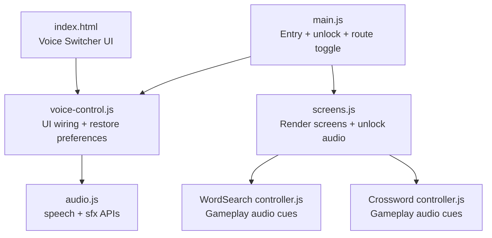
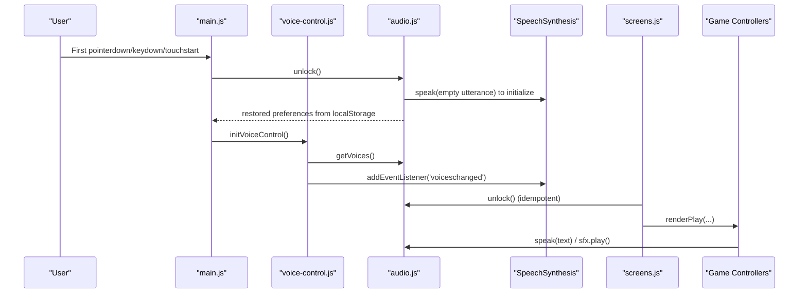
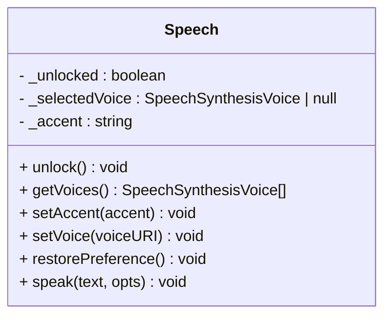
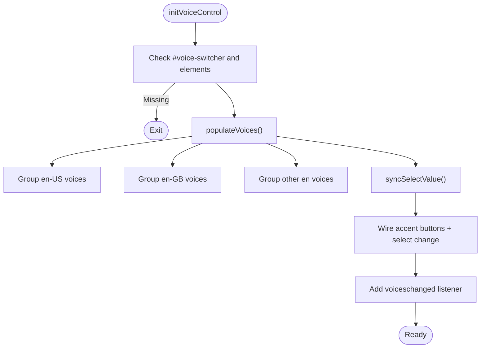
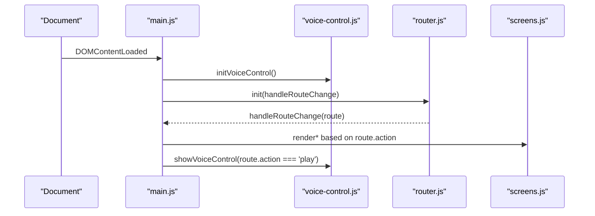
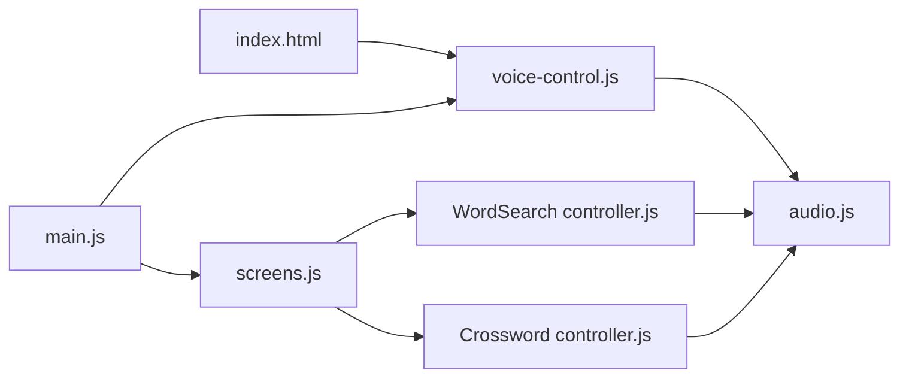

# Voice Control Integration

<cite>
**Referenced Files in This Document**
- [voice-control.js](file://src/literacy/wordquest/js/voice-control.js)
- [audio.js](file://src/literacy/wordquest/js/audio.js)
- [main.js](file://src/literacy/wordquest/js/main.js)
- [index.html](file://src/literacy/wordquest/index.html)
- [screens.js](file://src/literacy/wordquest/js/screens.js)
- [controller.js (WordSearch)](file://src/literacy/wordquest/js/wordsearch/controller.js)
- [controller.js (Crossword)](file://src/literacy/wordquest/js/crossword/controller.js)
- [g1_pronunciation.html](file://src/literacy/g1_pronunciation.html)
- [g2_vocabulary.html](file://src/literacy/g2_vocabulary.html)
</cite>

## Table of Contents
1. Introduction
2. Project Structure
3. Core Components
4. Architecture Overview
5. Detailed Component Analysis
6. Dependency Analysis
7. Performance Considerations
8. Troubleshooting Guide
9. Conclusion

## Introduction
This document explains the voice control system that provides accessibility features through speech synthesis and audio feedback. It focuses on the WordQuest application’s implementation, including browser compatibility checks, voice selection and accent handling, and integration points with game screens and controllers. It also covers privacy considerations, fallback mechanisms when voice features are unavailable, testing strategies for voice workflows, and troubleshooting guidance for common issues and device-specific limitations.

Note: The current codebase implements speech synthesis (text-to-speech) and synthesized sound effects. There is no speech recognition or microphone usage implemented in the analyzed files.

## Project Structure
The voice-related functionality is primarily located under the WordQuest literacy module:
- Audio and speech synthesis API wrapper: src/literacy/wordquest/js/audio.js
- Voice switcher UI wiring: src/literacy/wordquest/js/voice-control.js
- App entry point and route-based toggling of voice controls: src/literacy/wordquest/js/main.js
- Game screen orchestrator that unlocks audio and integrates with games: src/literacy/wordquest/js/screens.js
- Game controllers that use speech and sfx during gameplay: 
  - src/literacy/wordquest/js/wordsearch/controller.js
  - src/literacy/wordquest/js/crossword/controller.js
- HTML shell for the voice switcher UI: src/literacy/wordquest/index.html
- Additional examples of speech synthesis usage in other pages:
  - src/literacy/g1_pronunciation.html
  - src/literacy/g2_vocabulary.html

**Diagram sources**
- [index.html:10-16](file://src/literacy/wordquest/index.html#L10-L16)
- [voice-control.js:17-145](file://src/literacy/wordquest/js/voice-control.js#L17-L145)
- [audio.js:11-119](file://src/literacy/wordquest/js/audio.js#L11-L119)
- [main.js:29-39](file://src/literacy/wordquest/js/main.js#L29-L39)
- [screens.js:58-60](file://src/literacy/wordquest/js/screens.js#L58-L60)
- [controller.js (WordSearch):16](file://src/literacy/wordquest/js/wordsearch/controller.js#L16-L16)
- [controller.js (Crossword):14](file://src/literacy/wordquest/js/crossword/controller.js#L14-L14)

**Section sources**
- [index.html:10-16](file://src/literacy/wordquest/index.html#L10-L16)
- [voice-control.js:17-145](file://src/literacy/wordquest/js/voice-control.js#L17-L145)
- [audio.js:11-119](file://src/literacy/wordquest/js/audio.js#L11-L119)
- [main.js:29-39](file://src/literacy/wordquest/js/main.js#L29-L39)
- [screens.js:58-60](file://src/literacy/wordquest/js/screens.js#L58-L60)
- [controller.js (WordSearch):16](file://src/literacy/wordquest/js/wordsearch/controller.js#L16-L16)
- [controller.js (Crossword):14](file://src/literacy/wordquest/js/crossword/controller.js#L14-L14)

## Core Components
- Speech synthesis wrapper (audio.js)
  - Provides methods to unlock the engine, list English voices, set accent or specific voice, restore saved preferences, and speak text with configurable rate and language.
  - Uses localStorage keys to persist user preference: wq_voice and wq_accent.
- Voice switcher UI (voice-control.js)
  - Populates a dropdown grouped by American, British, and Other English voices.
  - Wires accent buttons and syncs state with the speech module and localStorage.
  - Listens for asynchronous voice loading via the voiceschanged event.
- Application entry and routing (main.js)
  - Unlocks speech and sfx on first user interaction (required on iOS Safari).
  - Toggles visibility of the voice switcher based on the active route.
- Screen orchestration (screens.js)
  - Ensures audio engines are unlocked before rendering interactive screens.
- Game controllers (WordSearch, Crossword)
  - Import and use the speech and sfx modules to provide audio feedback during gameplay.

**Section sources**
- [audio.js:11-119](file://src/literacy/wordquest/js/audio.js#L11-L119)
- [voice-control.js:17-145](file://src/literacy/wordquest/js/voice-control.js#L17-L145)
- [main.js:29-39](file://src/literacy/wordquest/js/main.js#L29-L39)
- [screens.js:58-60](file://src/literacy/wordquest/js/screens.js#L58-L60)
- [controller.js (WordSearch):16](file://src/literacy/wordquest/js/wordsearch/controller.js#L16-L16)
- [controller.js (Crossword):14](file://src/literacy/wordquest/js/crossword/controller.js#L14-L14)

## Architecture Overview
The voice control architecture centers around a small, focused speech wrapper and a lightweight UI layer that persists user choices. The app entry unlocks media engines on first user gesture, then routes decide whether to show the voice switcher. Game screens and controllers consume the speech API for feedback.

**Diagram sources**
- [main.js:29-39](file://src/literacy/wordquest/js/main.js#L29-L39)
- [voice-control.js:137-145](file://src/literacy/wordquest/js/voice-control.js#L137-L145)
- [audio.js:22-34](file://src/literacy/wordquest/js/audio.js#L22-L34)
- [screens.js:58-60](file://src/literacy/wordquest/js/screens.js#L58-L60)
- [controller.js (WordSearch):16](file://src/literacy/wordquest/js/wordsearch/controller.js#L16-L16)
- [controller.js (Crossword):14](file://src/literacy/wordquest/js/crossword/controller.js#L14-L14)

## Detailed Component Analysis

### Speech Synthesis Wrapper (audio.js)
Responsibilities:
- Unlock the speech engine on first user gesture (iOS Safari requirement).
- Restore saved voice/accent preferences from localStorage.
- Provide getVoices(), setAccent(), setVoice(), and speak().
- Manage internal state for selected voice and accent.

Key behaviors:
- unlock(): triggers engine initialization by speaking an empty utterance; restores preferences; listens for voiceschanged.
- getVoices(): returns only English voices (lang starts with 'en').
- setAccent(): selects first matching en-US or en-GB voice, or clears selection for default. Persists wq_accent.
- setVoice(): selects a specific voice by voiceURI and persists wq_voice.
- restorePreference(): prioritizes wq_voice over wq_accent.
- speak(): cancels any ongoing speech, sets rate and lang, applies selected voice if available, otherwise falls back to first English voice.

**Diagram sources**
- [audio.js:11-119](file://src/literacy/wordquest/js/audio.js#L11-L119)

**Section sources**
- [audio.js:22-34](file://src/literacy/wordquest/js/audio.js#L22-L34)
- [audio.js:40-46](file://src/literacy/wordquest/js/audio.js#L40-L46)
- [audio.js:52-74](file://src/literacy/wordquest/js/audio.js#L52-L74)
- [audio.js:80-90](file://src/literacy/wordquest/js/audio.js#L80-L90)
- [audio.js:99-118](file://src/literacy/wordquest/js/audio.js#L99-L118)

### Voice Switcher UI (voice-control.js)
Responsibilities:
- Initialize the voice switcher UI once DOM is ready.
- Populate the voice dropdown grouped by accents.
- Wire accent buttons and voice select change handlers.
- Sync UI state with saved preferences and preview speech.

Key behaviors:
- populateVoices(): groups voices into American, British, and Other English sections.
- syncSelectValue(): reads wq_voice from localStorage to set the dropdown value.
- syncAccentButtons(): highlights the active accent button based on wq_accent.
- Event listeners:
  - Accent button click: calls setAccent(), clears wq_voice, previews speech.
  - Voice select change: calls setVoice() or setAccent('default'), previews speech.
- Listens for voiceschanged to refresh the dropdown.

**Diagram sources**
- [voice-control.js:17-145](file://src/literacy/wordquest/js/voice-control.js#L17-L145)

**Section sources**
- [voice-control.js:26-82](file://src/literacy/wordquest/js/voice-control.js#L26-L82)
- [voice-control.js:84-105](file://src/literacy/wordquest/js/voice-control.js#L84-L105)
- [voice-control.js:107-145](file://src/literacy/wordquest/js/voice-control.js#L107-L145)

### Application Entry and Routing (main.js)
Responsibilities:
- Unlock audio engines on first user interaction.
- Toggle voice switcher visibility based on route action.
- Initialize voice control and router on DOMContentLoaded.

Key behaviors:
- unlockAudio(): idempotent unlock of speech and sfx.
- Route handler: shows voice switcher only during play actions.

**Diagram sources**
- [main.js:93-96](file://src/literacy/wordquest/js/main.js#L93-L96)
- [main.js:68-69](file://src/literacy/wordquest/js/main.js#L68-L69)

**Section sources**
- [main.js:29-39](file://src/literacy/wordquest/js/main.js#L29-L39)
- [main.js:68-69](file://src/literacy/wordquest/js/main.js#L68-L69)
- [main.js:93-96](file://src/literacy/wordquest/js/main.js#L93-L96)

### Screen Orchestration (screens.js)
Responsibilities:
- Ensure audio engines are unlocked before rendering interactive content.
- Render home, categories, mode-select, and play screens.

Key behaviors:
- unlockAudio(): called on user interactions within screens to ensure speech and sfx are ready.

**Section sources**
- [screens.js:58-60](file://src/literacy/wordquest/js/screens.js#L58-L60)

### Game Controllers Integration
Both WordSearch and Crossword controllers import the speech and sfx modules to provide audio feedback during gameplay. They rely on the unlocked state established by main.js and screens.js.

**Section sources**
- [controller.js (WordSearch):16](file://src/literacy/wordquest/js/wordsearch/controller.js#L16-L16)
- [controller.js (Crossword):14](file://src/literacy/wordquest/js/crossword/controller.js#L14-L14)

### HTML Shell for Voice Switcher (index.html)
Provides the DOM structure for the voice switcher UI, including accent buttons and a voice dropdown. The container is initially hidden and shown conditionally by the app logic.

**Section sources**
- [index.html:10-16](file://src/literacy/wordquest/index.html#L10-L16)

### Additional Speech Synthesis Examples
Other pages demonstrate alternative patterns for selecting preferred voices and constructing utterances. These can serve as references for customizing voice behavior across the project.

**Section sources**
- [g1_pronunciation.html:302-349](file://src/literacy/g1_pronunciation.html#L302-L349)
- [g2_vocabulary.html:971-1005](file://src/literacy/g2_vocabulary.html#L971-L1005)

## Dependency Analysis
High-level dependencies among voice-related modules:

**Diagram sources**
- [index.html:10-16](file://src/literacy/wordquest/index.html#L10-L16)
- [voice-control.js:17-145](file://src/literacy/wordquest/js/voice-control.js#L17-L145)
- [audio.js:11-119](file://src/literacy/wordquest/js/audio.js#L11-L119)
- [main.js:29-39](file://src/literacy/wordquest/js/main.js#L29-L39)
- [screens.js:58-60](file://src/literacy/wordquest/js/screens.js#L58-L60)
- [controller.js (WordSearch):16](file://src/literacy/wordquest/js/wordsearch/controller.js#L16-L16)
- [controller.js (Crossword):14](file://src/literacy/wordquest/js/crossword/controller.js#L14-L14)

**Section sources**
- [voice-control.js:17-145](file://src/literacy/wordquest/js/voice-control.js#L17-L145)
- [audio.js:11-119](file://src/literacy/wordquest/js/audio.js#L11-L119)
- [main.js:29-39](file://src/literacy/wordquest/js/main.js#L29-L39)
- [screens.js:58-60](file://src/literacy/wordquest/js/screens.js#L58-L60)
- [controller.js (WordSearch):16](file://src/literacy/wordquest/js/wordsearch/controller.js#L16-L16)
- [controller.js (Crossword):14](file://src/literacy/wordquest/js/crossword/controller.js#L14-L14)

## Performance Considerations
- Avoid frequent voice enumeration: cache results from getVoices() and update only on voiceschanged events.
- Minimize repeated speak() calls: cancel ongoing speech before starting new utterances (already handled in speak()).
- Prefer shorter utterances for quick feedback to reduce latency.
- Use appropriate speech rates for young learners (e.g., slightly slower) to improve comprehension.
- Defer heavy UI updates until after voicesloaded to prevent layout thrashing.

[No sources needed since this section provides general guidance]

## Troubleshooting Guide
Common issues and resolutions:
- No voices appear in the dropdown
  - Ensure the voiceschanged event is listened to and the dropdown is repopulated.
  - Verify that getVoices() filters for English voices and that at least one English voice is installed on the device.
- Speech does not play on iOS Safari
  - Confirm that unlock() has been called on a user gesture (pointerdown, keydown, touchstart).
  - Check that the speech engine was initialized by attempting to speak an empty utterance.
- Wrong accent or voice selected
  - Validate localStorage keys wq_voice and wq_accent and ensure they are updated correctly when users change settings.
  - Re-run restorePreference() after voiceschanged to re-resolve voice objects.
- Speech fails silently
  - Inspect console errors from speak() and unlock() calls.
  - Ensure the browser supports SpeechSynthesis and that permissions are not blocking audio output.
- Device-specific limitations
  - Some devices may lack certain voices or restrict background audio; test on target platforms.
  - If voices load asynchronously (Chrome), ensure UI updates occur after voiceschanged.

**Section sources**
- [voice-control.js:137-145](file://src/literacy/wordquest/js/voice-control.js#L137-L145)
- [audio.js:22-34](file://src/literacy/wordquest/js/audio.js#L22-L34)
- [audio.js:99-118](file://src/literacy/wordquest/js/audio.js#L99-L118)

## Privacy Considerations
- Data processing location: The current implementation uses client-side speech synthesis only; no audio recording or server-side processing occurs.
- Local storage usage: Preferences (wq_voice, wq_accent) are stored locally and do not contain personal data.
- Permissions: No microphone access is requested; therefore, no permission prompts are shown for voice input.
- Recommendations:
  - Clearly communicate that voice output is generated locally.
  - Provide a way to reset preferences if needed.
  - Avoid logging sensitive information to the console.

[No sources needed since this section summarizes without analyzing specific files]

## Testing Strategies
- Browser compatibility matrix
  - Test on Chrome, Safari, Firefox, and mobile browsers.
  - Verify voiceschanged behavior and initial voice availability.
- Interaction flows
  - Simulate first user gesture to trigger unlock() and confirm subsequent speech works.
  - Change accents and specific voices; verify persistence and restoration.
- Edge cases
  - No English voices installed: ensure fallback behavior and graceful UI.
  - Rapid successive speak() calls: confirm cancellation and queueing behavior.
- Accessibility
  - Validate that voice options are discoverable and operable via keyboard.
  - Confirm that spoken feedback aligns with visual states.

[No sources needed since this section provides general guidance]

## Conclusion
The voice control system in WordQuest provides a robust, accessible speech synthesis experience with clear separation between UI wiring and core speech logic. It handles platform quirks such as iOS audio unlocking and asynchronous voice loading, persists user preferences, and integrates seamlessly with game screens and controllers. While there is no speech recognition or microphone usage in the analyzed code, the design allows future extensions to incorporate voice input while maintaining strong privacy and fallback practices.

[No sources needed since this section summarizes without analyzing specific files]