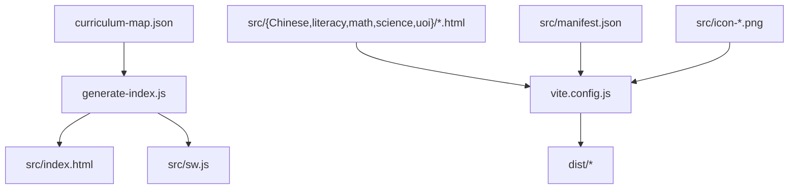
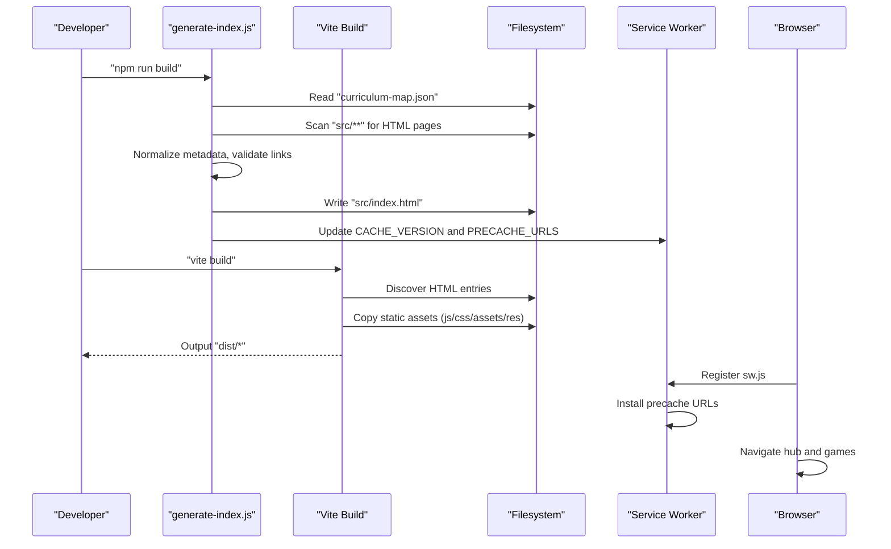
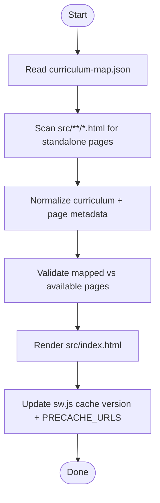
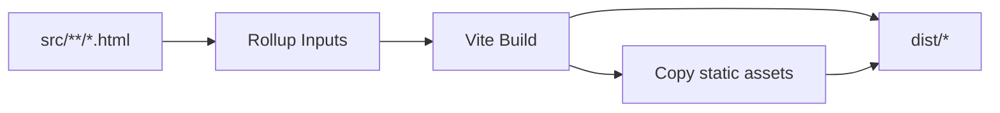
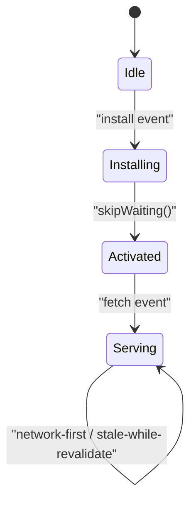
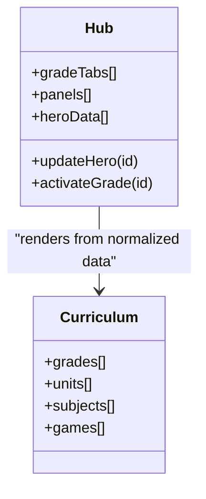
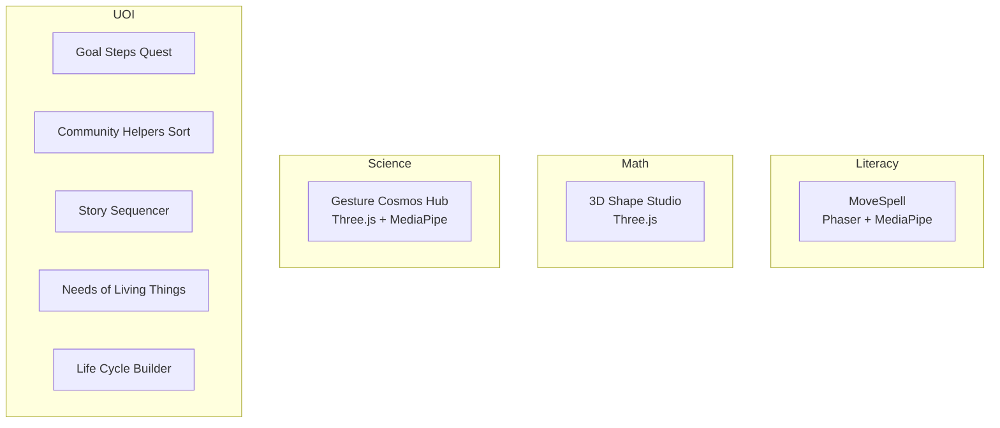
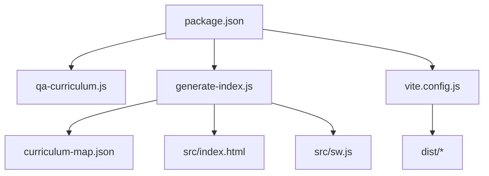

# Architecture & System Design

<cite>
**Referenced Files in This Document**
- [README.md](file://README.md)
- [package.json](file://package.json)
- [vite.config.js](file://vite.config.js)
- [src/data/curriculum-map.json](file://src/data/curriculum-map.json)
- [scripts/generate-index.js](file://scripts/generate-index.js)
- [src/index.html](file://src/index.html)
- [src/sw.js](file://src/sw.js)
- [src/manifest.json](file://src/manifest.json)
- [scripts/qa-curriculum.js](file://scripts/qa-curriculum.js)
- [src/science/gesture-cosmos-hub.html](file://src/science/gesture-cosmos-hub.html)
- [src/literacy/movespelling/index.html](file://src/literacy/movespelling/index.html)
- [src/math/g1_3D_shape.html](file://src/math/g1_3D_shape.html)
</cite>

## Table of Contents
1. [Introduction](#introduction)
2. [Project Structure](#project-structure)
3. [Core Components](#core-components)
4. [Architecture Overview](#architecture-overview)
5. [Detailed Component Analysis](#detailed-component-analysis)
6. [Dependency Analysis](#dependency-analysis)
7. [Performance Considerations](#performance-considerations)
8. [Troubleshooting Guide](#troubleshooting-guide)
9. [Conclusion](#conclusion)
10. [Appendices](#appendices)

## Introduction
This document describes the architecture and system design of the IB PYP Games platform. It explains how a curriculum-driven, multi-page static site is generated from a single source-of-truth JSON map, how Vite builds multiple HTML entry points with custom asset handling, and how a service worker provides offline capabilities. It also details the modular game architecture across subjects (UOI, Literacy, Math, Science, Chinese), the central navigation hub, data flows, infrastructure requirements, scalability considerations, deployment topology, cross-cutting concerns (performance, caching, responsive design), and technology stack decisions including Three.js for 3D graphics, Phaser for game mechanics, MediaPipe for gesture recognition, and TailwindCSS-inspired styling patterns.

## Project Structure
The repository follows a curriculum-first organization:
- Curriculum map drives UI generation and build-time outputs.
- Each subject area contains standalone HTML games or small app directories.
- Build scripts generate the central index and update the service worker cache list.

**Diagram sources**
- [vite.config.js:1-175](file://vite.config.js#L1-L175)
- [scripts/generate-index.js:1-851](file://scripts/generate-index.js#L1-L851)
- [src/data/curriculum-map.json:1-551](file://src/data/curriculum-map.json#L1-L551)
- [src/index.html:1-800](file://src/index.html#L1-L800)
- [src/sw.js:1-130](file://src/sw.js#L1-L130)
- [src/manifest.json:1-22](file://src/manifest.json#L1-L22)

**Section sources**
- [README.md:1-65](file://README.md#L1-L65)
- [package.json:1-20](file://package.json#L1-L20)

## Core Components
- Curriculum Map: The authoritative source describing grades, units, subjects, and linked games.
- Index Generator: Reads the map, validates links, normalizes metadata, renders the central hub HTML, and updates the service worker precache list and version.
- Vite Build: Multi-entry static site generator that compiles each HTML page and copies non-module assets.
- Service Worker: Provides offline support via install/activate/fetch strategies and cache versioning.
- Game Modules: Standalone HTML apps per subject, some using Three.js, Phaser, and MediaPipe.

Key responsibilities:
- Data-driven UI: All navigation and content are derived from the curriculum map.
- Static output: No server-side rendering; everything is prebuilt to static files.
- Offline readiness: Pre-cached essential pages and assets.

**Section sources**
- [src/data/curriculum-map.json:1-551](file://src/data/curriculum-map.json#L1-L551)
- [scripts/generate-index.js:1-851](file://scripts/generate-index.js#L1-L851)
- [vite.config.js:1-175](file://vite.config.js#L1-L175)
- [src/sw.js:1-130](file://src/sw.js#L1-L130)

## Architecture Overview
High-level flow:
- Authoring: Maintain src/data/curriculum-map.json and add new HTML games under subject folders.
- Generation: Run npm run build which executes the index generator and then Vite.
- Build: Vite discovers all HTML entries, bundles JS/CSS where applicable, and copies static assets.
- Runtime: Users navigate the generated index, open individual games, and benefit from offline caching.

**Diagram sources**
- [scripts/generate-index.js:1-851](file://scripts/generate-index.js#L1-L851)
- [vite.config.js:1-175](file://vite.config.js#L1-L175)
- [src/sw.js:1-130](file://src/sw.js#L1-L130)

## Detailed Component Analysis

### Curriculum Map and Index Generator
- Input: src/data/curriculum-map.json defines grades, units, subjects, and games with optional href overrides.
- Processing:
  - Scans src for standalone HTML pages.
  - Extracts titles from <title> tags when available.
  - Normalizes subject metadata and game existence flags.
  - Validates mapped paths exist and warns on unassigned pages.
- Output:
  - Generates src/index.html with grade tabs, unit bands, subject lanes, and game cards.
  - Updates src/sw.js with a timestamped cache version and an updated PRECACHE_URLS array.

**Diagram sources**
- [scripts/generate-index.js:1-851](file://scripts/generate-index.js#L1-L851)
- [src/data/curriculum-map.json:1-551](file://src/data/curriculum-map.json#L1-L551)

**Section sources**
- [scripts/generate-index.js:1-851](file://scripts/generate-index.js#L1-L851)
- [src/data/curriculum-map.json:1-551](file://src/data/curriculum-map.json#L1-L551)

### Vite Build Configuration and Multi-Page Generation
- Root: src
- Entry discovery: Recursively finds all .html files under src and registers them as Rollup inputs.
- Externalization: Externalizes three and https imports to be loaded via importmap or CDN at runtime.
- Minification: Uses terser and vite-plugin-minify.
- Asset copying: Post-build plugin copies root static files (manifest, icons, sw.js) and category-specific js/css/assets/res directories for each game folder.

**Diagram sources**
- [vite.config.js:1-175](file://vite.config.js#L1-L175)

**Section sources**
- [vite.config.js:1-175](file://vite.config.js#L1-L175)

### Service Worker and Offline Strategy
- Cache versioning: Timestamp-based CACHE_VERSION ensures cache busting on rebuilds.
- Precaching: PRECACHE_URLS includes the hub and all mapped game URLs.
- Install: Pre-caches essential assets and activates immediately.
- Activate: Deletes old caches and claims clients.
- Fetch:
  - HTML navigations: Network-first, cache-fallback.
  - Static assets: Stale-while-revalidate.

**Diagram sources**
- [src/sw.js:1-130](file://src/sw.js#L1-L130)

**Section sources**
- [src/sw.js:1-130](file://src/sw.js#L1-L130)

### Central Navigation Hub (Generated Index)
- Grade tabs switch panels dynamically.
- Hero section reflects active grade’s latest unit and summary.
- Unit bands group subjects and games with descriptive metadata.
- Links use href overrides when needed (e.g., query parameters).
- Includes PWA manifest link and theme color.

**Diagram sources**
- [scripts/generate-index.js:1-851](file://scripts/generate-index.js#L1-L851)
- [src/index.html:1-800](file://src/index.html#L1-L800)

**Section sources**
- [src/index.html:1-800](file://src/index.html#L1-L800)

### Modular Game Architecture
Games are self-contained HTML applications organized by subject:
- UOI: Simple interactive activities embedded in single HTML files.
- Literacy: Mixed approaches including gesture-enabled games built with Phaser and MediaPipe.
- Math: Interactive 3D explorers using Three.js.
- Science: Gesture-driven cosmos exploration hub with multiple scenes.

Representative examples:
- MoveSpell (Literacy): Uses MediaPipe Hands for zero-touch interaction and Phaser for game logic.
- 3D Shape Studio (Math): Uses Three.js for 3D geometry exploration and OrbitControls.
- Gesture Cosmos Hub (Science): Orchestrates multiple Three.js scenes with MediaPipe hand tracking.

**Diagram sources**
- [src/literacy/movespelling/index.html:1-118](file://src/literacy/movespelling/index.html#L1-L118)
- [src/math/g1_3D_shape.html:1-800](file://src/math/g1_3D_shape.html#L1-L800)
- [src/science/gesture-cosmos-hub.html:1-283](file://src/science/gesture-cosmos-hub.html#L1-L283)

**Section sources**
- [src/literacy/movespelling/index.html:1-118](file://src/literacy/movespelling/index.html#L1-L118)
- [src/math/g1_3D_shape.html:1-800](file://src/math/g1_3D_shape.html#L1-L800)
- [src/science/gesture-cosmos-hub.html:1-283](file://src/science/gesture-cosmos-hub.html#L1-L283)

### Technology Stack Decisions
- Three.js: Used for 3D visualization and interactivity in math and science modules.
- Phaser: Powers game loops, scenes, and interactions in gesture-enabled literacy games.
- MediaPipe: Enables real-time hand tracking for zero-touch gameplay.
- Styling: Uses CSS variables and responsive media queries; project README notes TailwindCSS-inspired patterns.

**Section sources**
- [src/math/g1_3D_shape.html:1-800](file://src/math/g1_3D_shape.html#L1-L800)
- [src/science/gesture-cosmos-hub.html:1-283](file://src/science/gesture-cosmos-hub.html#L1-L283)
- [src/literacy/movespelling/index.html:1-118](file://src/literacy/movespelling/index.html#L1-L118)
- [README.md:1-65](file://README.md#L1-L65)

## Dependency Analysis
Build-time dependencies and relationships:
- package.json scripts orchestrate QA checks and build steps.
- Vite config depends on Node fs/path APIs to discover entries and copy assets.
- Index generator depends on curriculum map and file scanning to produce index and update service worker.

**Diagram sources**
- [package.json:1-20](file://package.json#L1-L20)
- [scripts/qa-curriculum.js:1-292](file://scripts/qa-curriculum.js#L1-L292)
- [scripts/generate-index.js:1-851](file://scripts/generate-index.js#L1-L851)
- [vite.config.js:1-175](file://vite.config.js#L1-L175)

**Section sources**
- [package.json:1-20](file://package.json#L1-L20)
- [scripts/qa-curriculum.js:1-292](file://scripts/qa-curriculum.js#L1-L292)

## Performance Considerations
- Static generation: All pages are prebuilt, reducing server load and improving initial load times.
- Asset externalization: Three.js and HTTPS imports are externalized to leverage browser caching and CDNs.
- Minification: Terser and minify plugin reduce payload sizes.
- Service worker:
  - Network-first for HTML ensures fresh content while falling back to cached versions.
  - Stale-while-revalidate for assets improves perceived performance and resilience.
- Responsive design: Generated index includes breakpoints for iPad/tablet and mobile screens; games include viewport meta and touch-friendly targets.

[No sources needed since this section provides general guidance]

## Troubleshooting Guide
Common issues and resolutions:
- Missing game pages: The index generator warns about unassigned pages; ensure every standalone HTML is referenced in curriculum-map.json.
- Broken links: QA script verifies href presence in both generated index and service worker precache.
- Planned grades validation: Ensure planned grades show expected themes and remain marked as planned until content is added.
- Standalone UOI rules: New UOI games must be self-contained (embedded CSS/JS), include viewport meta, have return links to the hub, and meet touch target sizing.

Operational tips:
- Run npm run qa:curriculum before committing changes to catch mapping and compliance issues early.
- After updating curriculum-map.json, run npm run build to regenerate index and update service worker cache.

**Section sources**
- [scripts/qa-curriculum.js:1-292](file://scripts/qa-curriculum.js#L1-L292)
- [scripts/generate-index.js:1-851](file://scripts/generate-index.js#L1-L851)
- [README.md:1-65](file://README.md#L1-L65)

## Conclusion
The IB PYP Games system uses a curriculum-driven, static-site approach to deliver a scalable, offline-capable learning platform. The curriculum map is the single source of truth, driving UI generation and service worker precaching. Vite’s multi-entry configuration and custom asset copying streamline building many independent games. The architecture supports adding new grades and units with minimal friction, while QA tooling enforces consistency and quality. Cross-cutting concerns like performance, caching, and responsive design are addressed through build-time optimizations and runtime strategies.

[No sources needed since this section summarizes without analyzing specific files]

## Appendices

### Infrastructure Requirements
- Node.js environment for running scripts and Vite.
- Static hosting capable of serving prebuilt dist files and supporting service workers.
- HTTPS required for camera access in gesture-enabled games.

[No sources needed since this section provides general guidance]

### Scalability Considerations
- Adding a new grade: Add a grade entry in curriculum-map.json with planned status; the generator will render a placeholder panel with standard themes.
- Adding a new unit: Extend the grade’s units array with metadata and subject lanes.
- Adding a new game: Place HTML under the appropriate subject directory and reference it in the map; optionally use href for parameterized launches.
- Subject expansion: The generator supports additional subject IDs via metadata normalization; ensure consistent icon/color mapping if needed.

**Section sources**
- [src/data/curriculum-map.json:1-551](file://src/data/curriculum-map.json#L1-L551)
- [scripts/generate-index.js:1-851](file://scripts/generate-index.js#L1-L851)

### Deployment Topology
- Build pipeline: Local or CI runs npm run build to generate src/index.html and update src/sw.js, then Vite produces dist/.
- Hosting: Serve dist/ as a static site with proper MIME types and service worker registration.
- PWA: Ensure manifest.json and icons are served at root paths; service worker handles caching strategy.

**Section sources**
- [package.json:1-20](file://package.json#L1-L20)
- [src/manifest.json:1-22](file://src/manifest.json#L1-L22)
- [src/sw.js:1-130](file://src/sw.js#L1-L130)