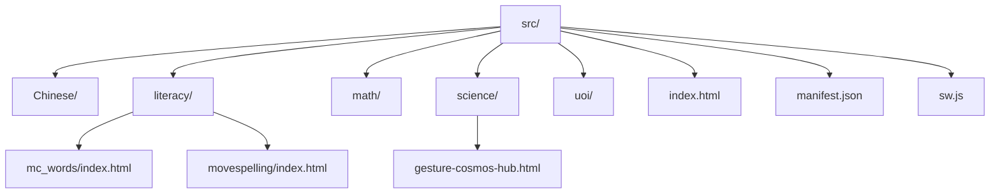
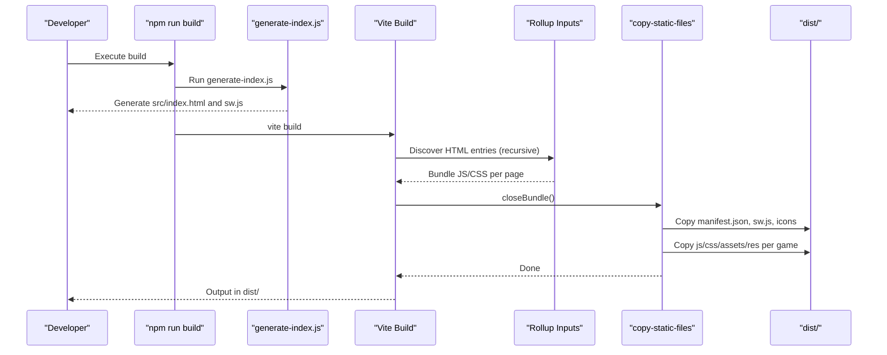
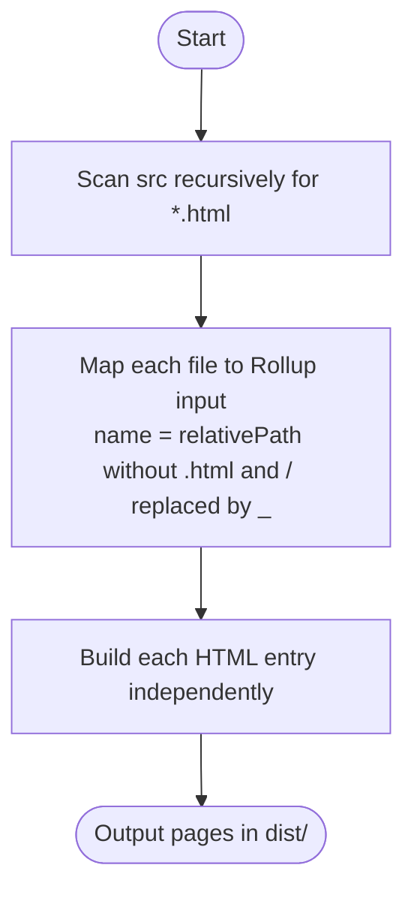
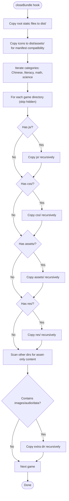
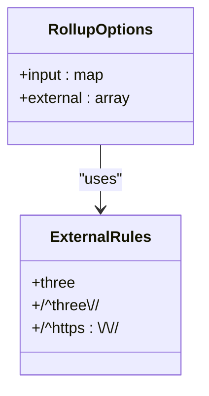
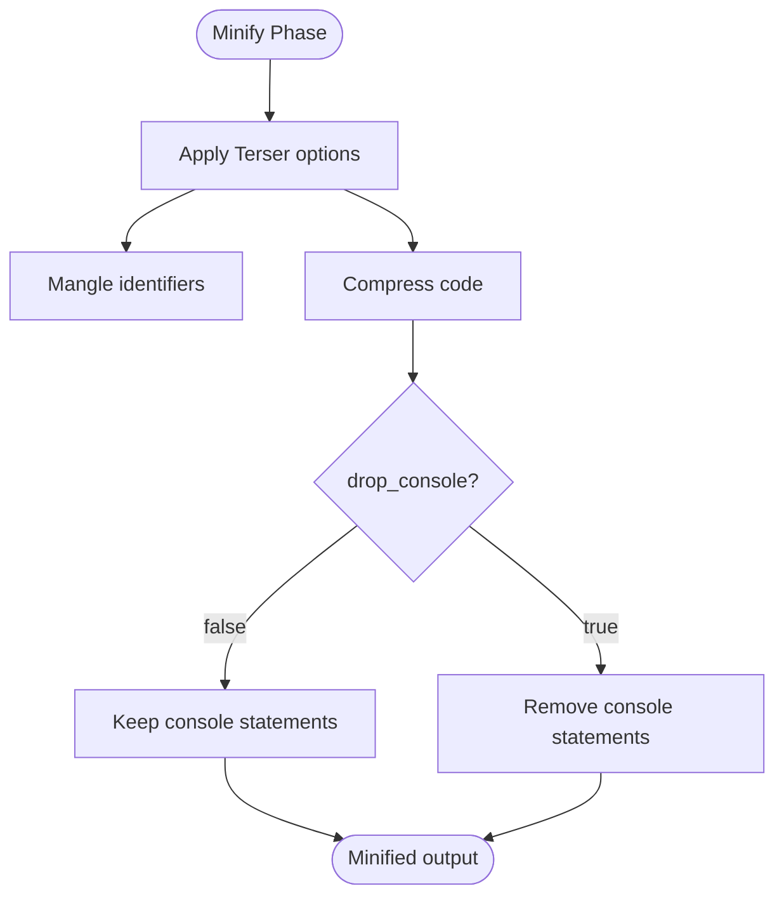
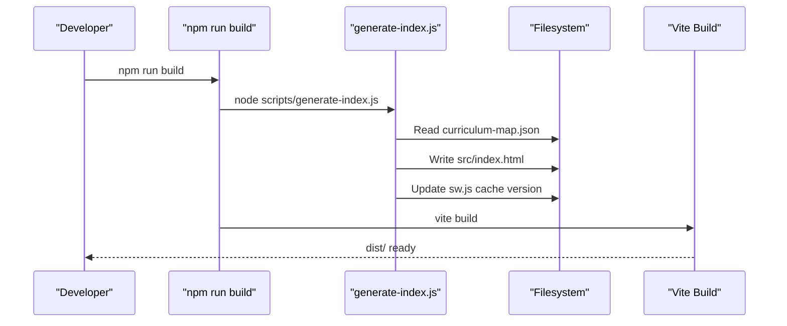
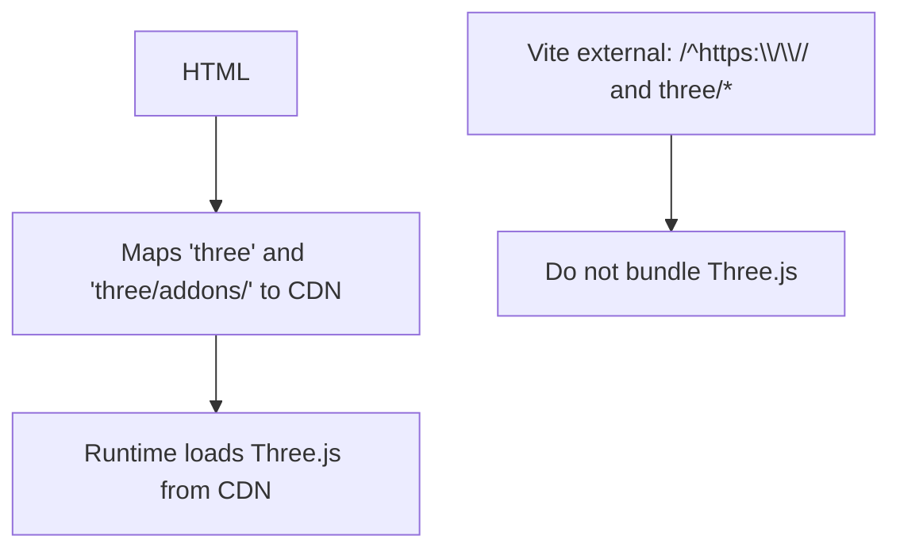
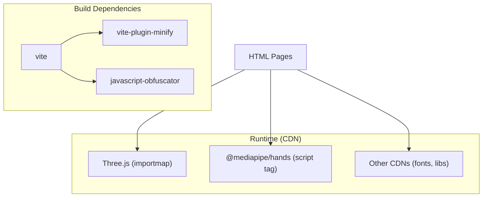

# Build System & Configuration

<cite>
**Referenced Files in This Document**
- [vite.config.js](file://vite.config.js)
- [package.json](file://package.json)
- [README.md](file://README.md)
- [scripts/generate-index.js](file://scripts/generate-index.js)
- [src/index.html](file://src/index.html)
- [src/science/gesture-cosmos-hub.html](file://src/science/gesture-cosmos-hub.html)
</cite>

## Table of Contents
1. [Introduction](#introduction)
2. [Project Structure](#project-structure)
3. [Core Components](#core-components)
4. [Architecture Overview](#architecture-overview)
5. [Detailed Component Analysis](#detailed-component-analysis)
6. [Dependency Analysis](#dependency-analysis)
7. [Performance Considerations](#performance-considerations)
8. [Troubleshooting Guide](#troubleshooting-guide)
9. [Conclusion](#conclusion)
10. [Appendices](#appendices)

## Introduction
This document explains the Vite-based build system for a multi-page static site that hosts many educational games. It covers:
- Multi-page generation via recursive HTML discovery and dynamic Rollup input mapping
- A custom plugin that copies game assets (js, css, assets, res) after bundling
- External CDN imports for Three.js and other libraries using importmaps
- Minification strategy with Terser and specific optimization settings
- How to extend the build for new games and categories
- Troubleshooting common issues

## Project Structure
The project uses a flat, category-based layout under src. Each game is an HTML file or a folder with its own index.html. The build scans all HTML files recursively to create multiple pages.

**Diagram sources**
- [vite.config.js:38-45](file://vite.config.js#L38-L45)
- [src/index.html:1-20](file://src/index.html#L1-L20)
- [src/literacy/mc_words/index.html:1-20](file://src/literacy/mc_words/index.html#L1-L20)
- [src/science/gesture-cosmos-hub.html:1-20](file://src/science/gesture-cosmos-hub.html#L1-L20)

**Section sources**
- [README.md:20-28](file://README.md#L20-L28)
- [vite.config.js:38-45](file://vite.config.js#L38-L45)

## Core Components
- Multi-page entry discovery: Recursively finds all .html files under src and maps them to Rollup inputs.
- Asset copying plugin: Copies root PWA assets and per-game directories (js, css, assets, res) into dist.
- External CDN configuration: Externals Three.js and https URLs so they are loaded via importmap at runtime.
- Minification: Uses Terser with mangle enabled and console statements preserved.
- Index generation: Pre-build script generates the curriculum hub page and updates service worker cache version.

**Section sources**
- [vite.config.js:6-45](file://vite.config.js#L6-L45)
- [vite.config.js:50-69](file://vite.config.js#L50-L69)
- [vite.config.js:70-173](file://vite.config.js#L70-L173)
- [package.json:6-12](file://package.json#L6-L12)
- [scripts/generate-index.js:1-30](file://scripts/generate-index.js#L1-L30)

## Architecture Overview
The build pipeline integrates pre-build scripts, Vite’s multi-page mode, and a post-bundle asset copier.

**Diagram sources**
- [package.json:6-12](file://package.json#L6-L12)
- [scripts/generate-index.js:1-30](file://scripts/generate-index.js#L1-L30)
- [vite.config.js:38-45](file://vite.config.js#L38-L45)
- [vite.config.js:70-173](file://vite.config.js#L70-L173)

## Detailed Component Analysis

### Multi-page Static Site Generation
- Recursive HTML discovery: Scans src for all .html files, including nested folders.
- Dynamic input mapping: Converts each path to a unique Rollup input name by replacing slashes and removing .html.
- Result: Every HTML becomes a standalone page in dist, preserving relative paths.

**Diagram sources**
- [vite.config.js:6-19](file://vite.config.js#L6-L19)
- [vite.config.js:38-45](file://vite.config.js#L38-L45)

**Section sources**
- [vite.config.js:6-19](file://vite.config.js#L6-L19)
- [vite.config.js:38-45](file://vite.config.js#L38-L45)

### Custom Plugin: copy-static-files
Purpose: After bundling, copy static resources that are not processed by Vite.

Key behaviors:
- Copies root PWA assets: manifest.json, sw.js, icon-192.png, icon-512.png
- Ensures icons also exist under dist/assets for generated manifests
- For each category (Chinese, literacy, math, science), copies per-game directories:
  - js (non-module scripts)
  - css
  - assets
  - res (for legacy games like mc_words)
  - Any additional directory containing only asset-like files (images, audio, data)

**Diagram sources**
- [vite.config.js:70-173](file://vite.config.js#L70-L173)

**Section sources**
- [vite.config.js:70-173](file://vite.config.js#L70-L173)

### Rollup Configuration and External CDN Imports
- Externalization rules:
  - three and three/* are externalized
  - All https:// URLs are externalized
- Rationale: These dependencies are loaded at runtime via importmap in HTML, avoiding bundling large libraries.

**Diagram sources**
- [vite.config.js:50-69](file://vite.config.js#L50-L69)

**Section sources**
- [vite.config.js:50-69](file://vite.config.js#L50-L69)

### Minification Strategy with Terser
- Minifier: terser
- Settings:
  - mangle: true
  - compress.drop_console: false (keeps console logs for diagnostics)

**Diagram sources**
- [vite.config.js:62-68](file://vite.config.js#L62-L68)

**Section sources**
- [vite.config.js:62-68](file://vite.config.js#L62-L68)

### Curriculum Hub Generation and Service Worker Cache Versioning
- Pre-build step runs generate-index.js before Vite builds.
- Responsibilities:
  - Reads curriculum-map.json
  - Generates src/index.html with grade/unit/subject/game links
  - Updates service worker cache version in sw.js
- QA checks validate coverage and link integrity.

**Diagram sources**
- [package.json:6-12](file://package.json#L6-L12)
- [scripts/generate-index.js:1-30](file://scripts/generate-index.js#L1-L30)

**Section sources**
- [package.json:6-12](file://package.json#L6-L12)
- [scripts/generate-index.js:1-30](file://scripts/generate-index.js#L1-L30)

### Example: Three.js Importmap Usage
- The gesture cosmos hub includes an importmap that maps three and three/addons to CDN URLs.
- Vite externalizes these imports so they are not bundled.

**Diagram sources**
- [src/science/gesture-cosmos-hub.html:1-20](file://src/science/gesture-cosmos-hub.html#L1-L20)
- [vite.config.js:50-69](file://vite.config.js#L50-L69)

**Section sources**
- [src/science/gesture-cosmos-hub.html:1-20](file://src/science/gesture-cosmos-hub.html#L1-L20)
- [vite.config.js:50-69](file://vite.config.js#L50-L69)

## Dependency Analysis
- Build-time dependencies:
  - vite (build tool)
  - vite-plugin-minify (HTML minification)
  - javascript-obfuscator (dev dependency present)
- Runtime dependencies (CDN):
  - Three.js via importmap
  - MediaPipe via script tags in some games
  - Other third-party libs via CDN in various games

**Diagram sources**
- [package.json:13-19](file://package.json#L13-L19)
- [src/science/gesture-cosmos-hub.html:1-20](file://src/science/gesture-cosmos-hub.html#L1-L20)

**Section sources**
- [package.json:13-19](file://package.json#L13-L19)
- [src/science/gesture-cosmos-hub.html:1-20](file://src/science/gesture-cosmos-hub.html#L1-L20)

## Performance Considerations
- Keep console logs during development; Terser preserves them by default in this config.
- Use importmaps for large libraries (Three.js) to avoid heavy bundles and leverage browser caching.
- Prefer non-module JS for legacy games; the plugin copies js/ directories automatically.
- Avoid unnecessary asset duplication; ensure game directories contain only required assets.

[No sources needed since this section provides general guidance]

## Troubleshooting Guide
Common issues and resolutions:
- Missing assets in dist:
  - Ensure game directories follow js/, css/, assets/, res/ conventions.
  - If using a different directory name, add it to the asset detection logic in the plugin.
- Broken Three.js imports:
  - Verify importmap exists in the HTML and matches external rules.
  - Confirm network access to CDN URLs.
- Manifest and icons not found:
  - Check that manifest.json and icons are present in src and copied to both root and assets in dist.
- Service worker cache not updating:
  - Re-run the pre-build script to refresh cache version in sw.js.

**Section sources**
- [vite.config.js:70-173](file://vite.config.js#L70-L173)
- [vite.config.js:50-69](file://vite.config.js#L50-L69)
- [scripts/generate-index.js:1-30](file://scripts/generate-index.js#L1-L30)

## Conclusion
The build system combines a simple yet powerful approach:
- Recursive HTML discovery for multi-page output
- Post-bundle asset copying tailored to game structures
- External CDN imports for large libraries
- Controlled minification with Terser
- Pre-build index generation and SW cache management

This design scales well across many games and categories while keeping bundles lean and runtime dependencies flexible.

[No sources needed since this section summarizes without analyzing specific files]

## Appendices

### Extending the Build for New Games
- Add a new HTML file under an existing category (e.g., src/math/new_game.html).
- Organize assets in js/, css/, assets/, res/ if applicable.
- Update curriculum-map.json and regenerate the index.
- Run the build to include the new page and assets.

**Section sources**
- [README.md:50-56](file://README.md#L50-L56)
- [vite.config.js:38-45](file://vite.config.js#L38-L45)
- [vite.config.js:70-173](file://vite.config.js#L70-L173)

### Adding a New Game Category
- Create a new top-level folder under src (e.g., src/art/).
- Extend the categories list in the asset copying plugin to include the new category.
- Optionally update the index generator to recognize the new category.

**Section sources**
- [vite.config.js:103-106](file://vite.config.js#L103-L106)
- [scripts/generate-index.js:13-19](file://scripts/generate-index.js#L13-L19)

### Modifying Asset Copying Logic
- To support additional directories (e.g., data/), add a block similar to js/css/assets/res in the plugin.
- To refine asset-only detection, adjust the extension list used to identify asset directories.

**Section sources**
- [vite.config.js:116-168](file://vite.config.js#L116-L168)