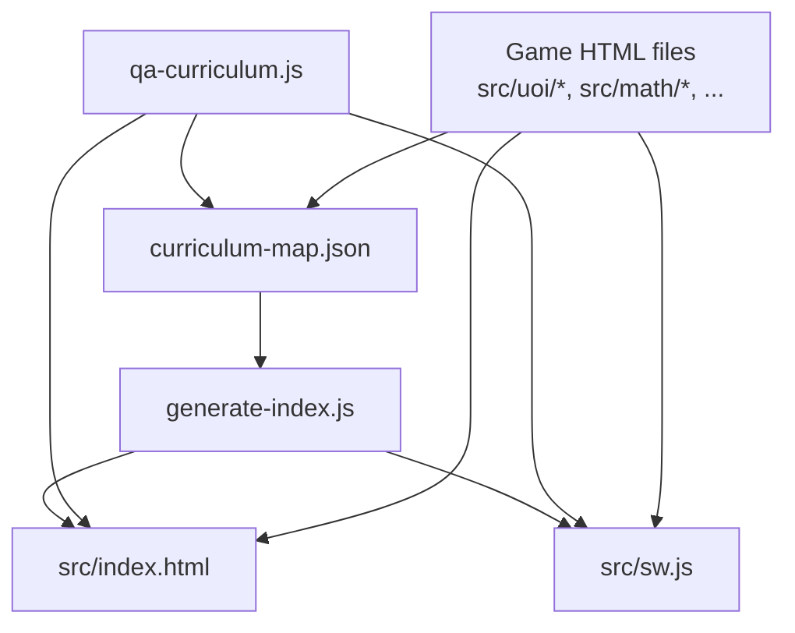
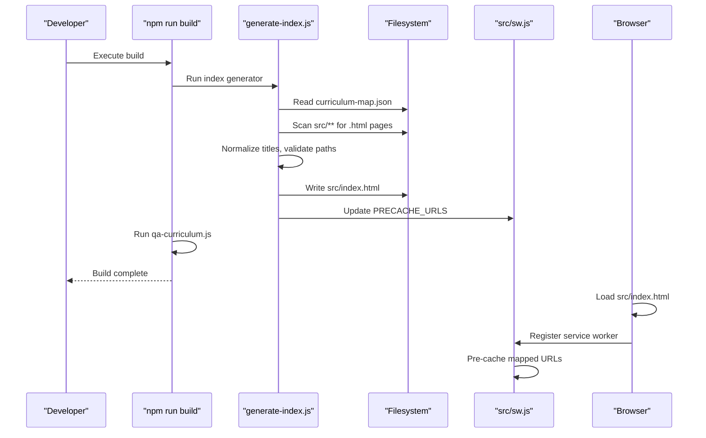
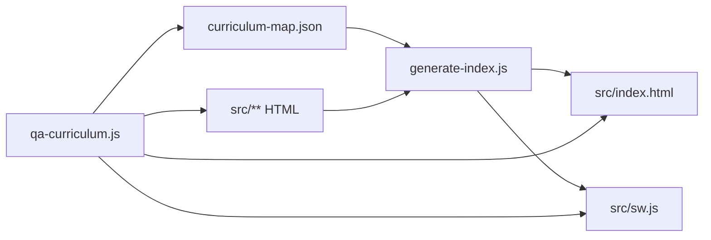

# Curriculum Management System

<cite>
**Referenced Files in This Document**
- [curriculum-map.json](file://src/data/curriculum-map.json)
- [generate-index.js](file://scripts/generate-index.js)
- [qa-curriculum.js](file://scripts/qa-curriculum.js)
- [index.html](file://src/index.html)
- [sw.js](file://src/sw.js)
- [README.md](file://README.md)
- [package.json](file://package.json)
- [g1_goal_steps_quest.html](file://src/uoi/g1_goal_steps_quest.html)
- [g1_arithmetic.html](file://src/math/g1_arithmetic.html)
</cite>

## Table of Contents
1. [Introduction](#introduction)
2. [Project Structure](#project-structure)
3. [Core Components](#core-components)
4. [Architecture Overview](#architecture-overview)
5. [Detailed Component Analysis](#detailed-component-analysis)
6. [Dependency Analysis](#dependency-analysis)
7. [Performance Considerations](#performance-considerations)
8. [Troubleshooting Guide](#troubleshooting-guide)
9. [Conclusion](#conclusion)
10. [Appendices](#appendices)

## Introduction
This document explains the curriculum-driven content management system used to organize and present IB PYP learning games by grade, unit of inquiry (UOI), subject lane, and game. The system is driven by a single source-of-truth JSON file that defines grades, units, subjects, and game mappings. A build-time script generates a navigable homepage and updates the service worker precache list. Validation scripts enforce data integrity and accessibility requirements for standalone UOI games.

The navigation model follows: Grade → Unit of Inquiry → Subject Lane → Game.

## Project Structure
At the heart of the system are:
- Curriculum map: src/data/curriculum-map.json
- Index generator: scripts/generate-index.js
- Generated homepage: src/index.html
- Service worker: src/sw.js
- QA validator: scripts/qa-curriculum.js
- Example games: src/uoi/*.html, src/{subject}/*.html

**Diagram sources**
- [generate-index.js:1-851](file://scripts/generate-index.js#L1-L851)
- [curriculum-map.json:1-551](file://src/data/curriculum-map.json#L1-L551)
- [index.html:1-1145](file://src/index.html#L1-L1145)
- [sw.js:1-130](file://src/sw.js#L1-L130)
- [qa-curriculum.js:1-292](file://scripts/qa-curriculum.js#L1-L292)

**Section sources**
- [README.md:1-65](file://README.md#L1-L65)
- [package.json:1-20](file://package.json#L1-L20)

## Core Components
- Curriculum Map (JSON): Defines grades, units, subjects, and games with metadata such as titles, descriptions, types, and optional href overrides.
- Index Generator (Node script): Reads the curriculum map, scans game pages, normalizes metadata, validates links, renders the homepage, and writes the service worker precache list.
- Generated Homepage (HTML): A responsive, tabbed interface organized by grade and unit, with subject lanes and clickable game cards.
- Service Worker (SW): Precaches all mapped URLs for offline access and uses network-first for HTML and stale-while-revalidate for assets.
- QA Validator (Node script): Enforces structural rules, link coverage, viewport meta tags, return links, touch target sizing, and tablet responsiveness.

**Section sources**
- [curriculum-map.json:1-551](file://src/data/curriculum-map.json#L1-L551)
- [generate-index.js:1-851](file://scripts/generate-index.js#L1-L851)
- [index.html:1-1145](file://src/index.html#L1-L1145)
- [sw.js:1-130](file://src/sw.js#L1-L130)
- [qa-curriculum.js:1-292](file://scripts/qa-curriculum.js#L1-L292)

## Architecture Overview
The system follows a data-driven pipeline:
- Authoring: Maintain src/data/curriculum-map.json and add or update game HTML files under src/.
- Build: Run npm run build which executes generate-index.js, then qa-curriculum.js, then Vite build.
- Output: src/index.html is generated; src/sw.js is updated with PRECACHE_URLS derived from the curriculum map.
- Runtime: Users navigate the generated homepage; clicking a game opens the corresponding HTML page. The service worker precaches these pages for offline use.

**Diagram sources**
- [generate-index.js:1-851](file://scripts/generate-index.js#L1-L851)
- [sw.js:1-130](file://src/sw.js#L1-L130)
- [package.json:1-20](file://package.json#L1-L20)

## Detailed Component Analysis

### Curriculum Map Schema (curriculum-map.json)
The JSON structure organizes content into a hierarchy:
- grades: Array of grade objects
  - id: Unique identifier (e.g., g1, g2)
  - label: Display name (e.g., Grade 1)
  - status: active or planned
  - summary: Short description
  - units: Array of unit objects
    - id: Unique unit identifier (e.g., home_learning, u1..u6)
    - label: Human-readable unit label (e.g., Home Learning, Unit 1)
    - title: Unit theme title
    - theme: PYP transdisciplinary theme
    - centralIdea: Central idea statement
    - learnerProfile: Optional array of IB learner profile attributes
    - atlSkills: Optional array of Approaches to Learning skills
    - subjects: Array of subject lane objects
      - id: Subject identifier (e.g., uoi, literacy, math, science, chinese)
      - label: Subject display label
      - games: Array of game entries
        - title: Game title (optional; can be auto-extracted)
        - path: Relative path to the game HTML under src/
        - type: Existing or New
        - description: Short description
        - href: Optional override URL (e.g., with query parameters)
        - tags: Optional array of tags

Validation and normalization behaviors:
- Title fallback: If a game entry lacks a title, the generator attempts to extract it from the HTML <title> tag; otherwise falls back to the filename.
- Existence flag: Each game gets an exists flag indicating whether its path is found on disk.
- Link resolution: For each game, the effective href is game.href if provided; otherwise game.path.

Examples of different subject types and grade levels:
- Grade 1, Unit 1, UOI subject lane includes a new standalone UOI game.
- Grade 1, Unit 4, Science subject lane includes existing interactive games.
- Grade 2, Home Learning, Math subject lane uses an href with a scheme parameter to drive behavior.

Best practices:
- Keep ids stable and unique across grades and units.
- Use href only when you need to pass unit-specific parameters to a reusable game.
- Provide descriptive titles and concise descriptions for discoverability.
- Mark type consistently as Existing or New.
- Ensure every referenced path exists on disk.

**Section sources**
- [curriculum-map.json:1-551](file://src/data/curriculum-map.json#L1-L551)
- [generate-index.js:1-851](file://scripts/generate-index.js#L1-L851)

### Dynamic Index Generation (generate-index.js)
Responsibilities:
- Read curriculum-map.json and scan src/** for valid game pages (standalone HTML or nested index.html).
- Extract titles from HTML <title> tags when not provided in the map.
- Validate that all mapped paths exist and warn about unassigned pages.
- Render the full homepage with grade tabs, unit sections, subject lanes, and game cards.
- Generate hero data for dynamic UI updates when switching grades.
- Write src/index.html with embedded styles and client-side logic for tabbing and history state.
- Update src/sw.js PRECACHE_URLS with all hrefs collected from the curriculum map.

Key functions and flows:
- findGamePages: Recursively collects eligible HTML pages.
- collectMappedPaths / collectGameHrefs: Derive sets of paths and hrefs from the curriculum map.
- normalizeCurriculum: Augments entries with title, exists, and subject metadata.
- renderGrade/renderUnit/renderSubject: Compose HTML sections for each level of the hierarchy.
- buildPrecacheUrls: Builds the final set of URLs to pre-cache in the service worker.

URL generation and metadata handling:
- Effective href = game.href || game.path.
- Missing pages are marked disabled in the UI and logged as warnings.
- Unassigned pages (present on disk but not in the map) are warned to maintain consistency.

Service worker integration:
- PRECACHE_URLS includes root assets and all hrefs from the curriculum map.
- Cache version is incremented at build time to bust caches.

**Section sources**
- [generate-index.js:1-851](file://scripts/generate-index.js#L1-L851)
- [index.html:1-1145](file://src/index.html#L1-L1145)
- [sw.js:1-130](file://src/sw.js#L1-L130)

### Relationship Between Curriculum Entries and Game Files
- Mapping: Each game entry points to a file via path. The generator verifies existence and adds hrefs to the homepage and service worker.
- Overrides: Use href to launch a reusable game with unit-specific parameters (e.g., ?mode=days, ?scheme=uoi).
- Metadata propagation: Titles and descriptions flow from the map or HTML title into the generated UI.
- Offline support: All hrefs are precached so games load even without network connectivity.

Example patterns:
- Direct mapping: path points to a dedicated game file.
- Parameterized mapping: href appends query strings to reuse a single game with different modes.

**Section sources**
- [curriculum-map.json:1-551](file://src/data/curriculum-map.json#L1-L551)
- [generate-index.js:1-851](file://scripts/generate-index.js#L1-L851)
- [index.html:1-1145](file://src/index.html#L1-L1145)
- [sw.js:1-130](file://src/sw.js#L1-L130)

### How to Add New Grades, Units, Subjects, and Games
Step-by-step:
1. Create or update game HTML files under src/{category}/ or src/uoi/.
   - Ensure standalone UOI games include:
     - Viewport meta tag
     - Embedded CSS and JavaScript
     - Large touch targets (min-height ≥ 44px)
     - Tablet responsive media queries
     - A return link to the PYP map using class pyp-map-link or map-link
2. Open src/data/curriculum-map.json and add:
   - A new grade object if needed (id, label, status, summary, units[])
   - A new unit under the appropriate grade (id, label, title, theme, centralIdea, optional learnerProfile and atlSkills)
   - A new subject lane under the unit (id, label, games[])
   - A new game entry with title, path, type, description, and optional href/tags
3. Run validation:
   - npm run qa:curriculum
4. Build and preview:
   - npm run build
   - npm run preview

Notes:
- For reused games, prefer href with query parameters to avoid duplicating files.
- Keep grade status as planned until UOI documents are added.
- Ensure all mapped paths exist and all standalone games meet accessibility and responsiveness checks.

**Section sources**
- [README.md:1-65](file://README.md#L1-L65)
- [qa-curriculum.js:1-292](file://scripts/qa-curriculum.js#L1-L292)
- [g1_goal_steps_quest.html:1-193](file://src/uoi/g1_goal_steps_quest.html#L1-L193)

### Validation Rules and Data Integrity Checks
The QA script enforces:
- Exactly five grades defined.
- Grade 1 has seven units including Home Learning.
- Every non-home-learning unit in Grade 1 includes a UOI subject lane.
- All mapped game files exist on disk.
- All hrefs appear in the generated index and service worker precache.
- Every HTML game includes a viewport meta tag and a PYP map return link with correct relative href.
- New UOI games must be standalone (embedded CSS/JS), have large touch targets, and include tablet responsive breakpoints.
- Planned grades show six planned themes and remain marked planned.

Common errors surfaced by QA:
- Missing game file referenced in the map.
- Unassigned HTML pages not linked from the map.
- Missing or incorrect return link href in a game page.
- Missing viewport meta or responsive styles.
- Incorrect number of planned themes for a grade panel.

**Section sources**
- [qa-curriculum.js:1-292](file://scripts/qa-curriculum.js#L1-L292)

### Examples of Curriculum Entries
- Grade 1, Unit 1, UOI: New standalone UOI game linking to a dedicated HTML file.
- Grade 1, Unit 3, Literacy: Reused game launched with mode=days via href.
- Grade 1, Unit 5, Math: Reused game launched with mode=months via href.
- Grade 2, Home Learning, Math: Reused game launched with scheme=math via href.

These examples demonstrate both direct path mapping and parameterized reuse through href.

**Section sources**
- [curriculum-map.json:1-551](file://src/data/curriculum-map.json#L1-L551)

## Dependency Analysis
High-level dependencies:
- generate-index.js depends on:
  - curriculum-map.json (input)
  - Filesystem scanning of src/** (game discovery)
  - Writes src/index.html and updates src/sw.js
- qa-curriculum.js depends on:
  - curriculum-map.json
  - src/index.html
  - src/sw.js
  - Game HTML files under src/**
- Browser runtime depends on:
  - src/index.html
  - src/sw.js (for precaching)
  - Game HTML files

**Diagram sources**
- [generate-index.js:1-851](file://scripts/generate-index.js#L1-L851)
- [qa-curriculum.js:1-292](file://scripts/qa-curriculum.js#L1-L292)
- [curriculum-map.json:1-551](file://src/data/curriculum-map.json#L1-L551)
- [index.html:1-1145](file://src/index.html#L1-L1145)
- [sw.js:1-130](file://src/sw.js#L1-L130)

**Section sources**
- [package.json:1-20](file://package.json#L1-L20)

## Performance Considerations
- Precaching: The service worker precaches all mapped URLs, improving first-load performance and enabling offline access.
- Network-first HTML: Ensures users get fresh content while still falling back to cache when offline.
- Stale-while-revalidate for assets: Balances speed and freshness for static resources.
- Avoid external dependencies in standalone UOI games to reduce network requests and improve reliability.

[No sources needed since this section provides general guidance]

## Troubleshooting Guide
Symptoms and fixes:
- Mapped game file missing:
  - Ensure the path exists under src/ and matches exactly what is in the map.
- Unassigned game pages:
  - Add entries in curriculum-map.json or remove unused HTML files.
- Links not appearing in the homepage:
  - Verify href/path correctness and rebuild the index.
- Service worker not caching a URL:
  - Confirm href is included in the map; rebuild to update PRECACHE_URLS.
- Standalone UOI game fails QA:
  - Add viewport meta, ensure embedded CSS/JS, provide a PYP map return link, and include tablet responsive breakpoints.
- Incorrect return link href:
  - Use a relative path to the generated index from the game’s directory.

Relevant checks performed by QA:
- Presence of viewport meta and responsive media queries.
- Return link presence and correctness.
- Touch target sizing and tablet breakpoints.
- Coverage of all mapped and unassigned pages.

**Section sources**
- [qa-curriculum.js:1-292](file://scripts/qa-curriculum.js#L1-L292)
- [g1_goal_steps_quest.html:1-193](file://src/uoi/g1_goal_steps_quest.html#L1-L193)

## Conclusion
The curriculum management system centers around a single JSON manifest that drives a fully generated, accessible, and offline-capable learning map. By following the schema, maintaining consistent metadata, and adhering to QA rules, teams can reliably scale content across grades and units while ensuring a smooth user experience.

[No sources needed since this section summarizes without analyzing specific files]

## Appendices

### Commands and Workflow
- Install dependencies: npm install
- Development server: npm run dev
- Build and generate index: npm run build
- Preview built output: npm run preview
- Run curriculum QA: npm run qa:curriculum
- List QA URLs: npm run qa:urls

**Section sources**
- [README.md:1-65](file://README.md#L1-L65)
- [package.json:1-20](file://package.json#L1-L20)

### Example Game Patterns
- Dedicated game: path points to a unique HTML file.
- Parameterized reuse: href appends query parameters to a shared game.
- Standalone UOI game: self-contained HTML with embedded styles/scripts, viewport meta, large touch targets, and a return link.

**Section sources**
- [curriculum-map.json:1-551](file://src/data/curriculum-map.json#L1-L551)
- [g1_arithmetic.html:1-800](file://src/math/g1_arithmetic.html#L1-L800)
- [g1_goal_steps_quest.html:1-193](file://src/uoi/g1_goal_steps_quest.html#L1-L193)