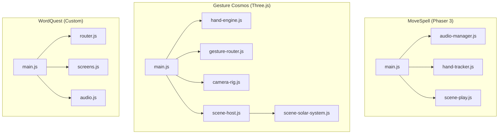
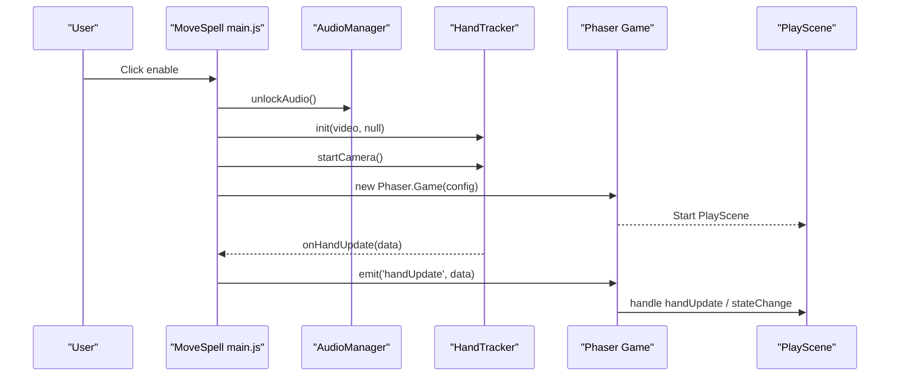
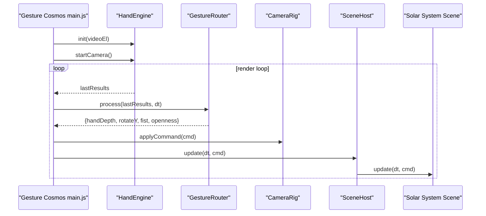
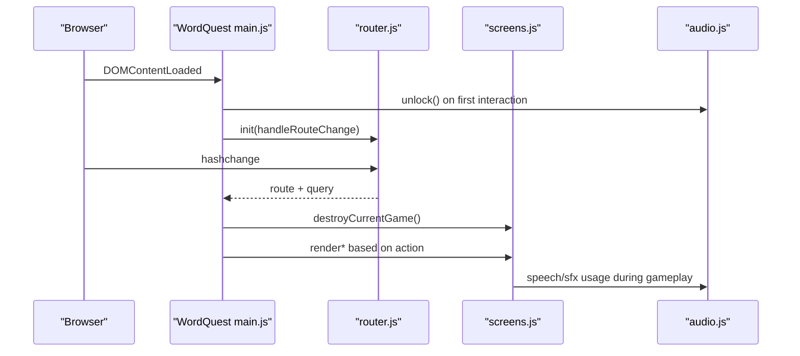
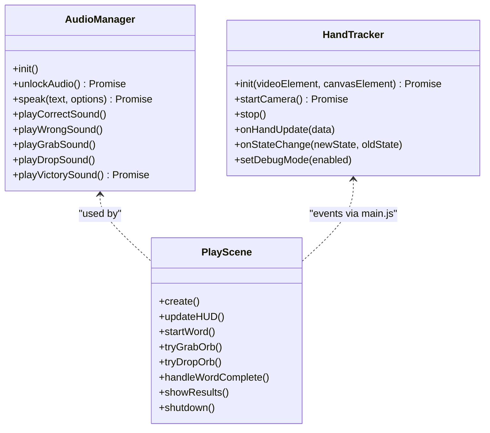
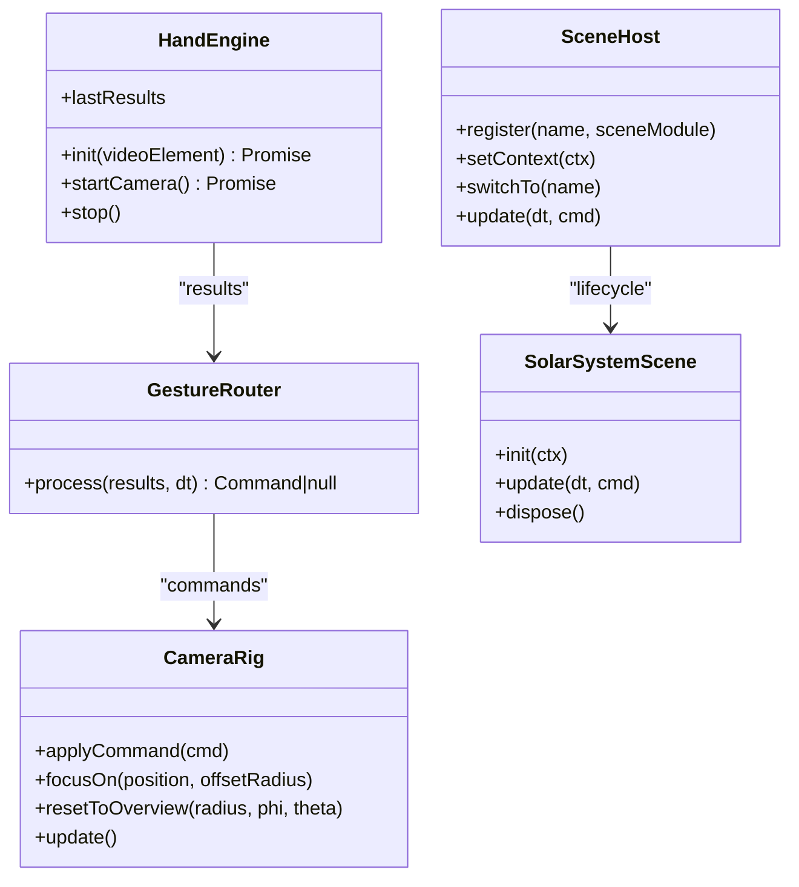
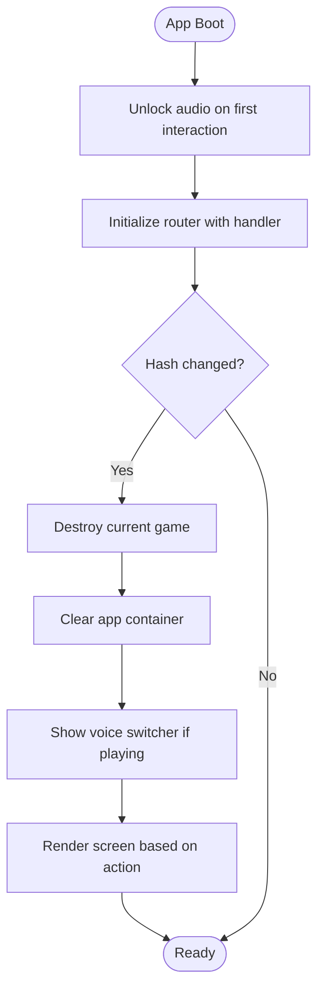
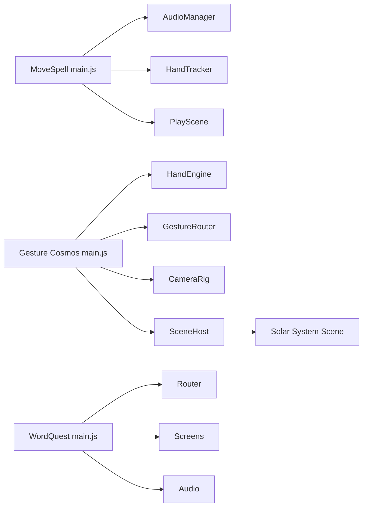

# Game Engine Integrations

<cite>
**Referenced Files in This Document**
- [main.js](file://src/literacy/movespelling/js/main.js)
- [hand-tracker.js](file://src/literacy/movespelling/js/core/hand-tracker.js)
- [audio-manager.js](file://src/literacy/movespelling/js/core/audio-manager.js)
- [scene-play.js](file://src/literacy/movespelling/js/game/scene-play.js)
- [main.js](file://src/science/gesture-cosmos/main.js)
- [hand-engine.js](file://src/science/gesture-cosmos/core/hand-engine.js)
- [gesture-router.js](file://src/science/gesture-cosmos/core/gesture-router.js)
- [camera-rig.js](file://src/science/gesture-cosmos/core/camera-rig.js)
- [scene-host.js](file://src/science/gesture-cosmos/core/scene-host.js)
- [scene-solar-system.js](file://src/science/gesture-cosmos/scenes/scene-solar-system.js)
- [main.js](file://src/literacy/wordquest/js/main.js)
- [router.js](file://src/literacy/wordquest/js/router.js)
- [screens.js](file://src/literacy/wordquest/js/screens.js)
- [audio.js](file://src/literacy/wordquest/js/audio.js)
</cite>

## Table of Contents
1. [Introduction](#introduction)
2. [Project Structure](#project-structure)
3. [Core Components](#core-components)
4. [Architecture Overview](#architecture-overview)
5. [Detailed Component Analysis](#detailed-component-analysis)
6. [Dependency Analysis](#dependency-analysis)
7. [Performance Considerations](#performance-considerations)
8. [Troubleshooting Guide](#troubleshooting-guide)
9. [Conclusion](#conclusion)
10. [Appendices](#appendices)

## Introduction
This document explains how multiple game engines are integrated across the platform:
- Phaser 3 integration for MoveSpell (spelling game), including scene management, audio handling, and gesture control.
- Three.js scene architecture for Gesture Cosmos, including scene registration, camera rig system, and performance optimization techniques.
- A custom framework for WordQuest covering routing, state management, and cross-platform compatibility.
It also outlines common patterns for integrating gesture recognition across different engines and provides guidance for creating new games that integrate with existing systems, handle cross-engine communication, and manage shared resources like audio and progress tracking.

## Project Structure
The repository organizes each game under a dedicated folder with its own entry point and engine-specific modules:
- MoveSpell (Phaser 3): Entry initializes camera, audio, and Phaser scenes; hand tracking is bridged into Phaser events.
- Gesture Cosmos (Three.js): Central hub creates renderer/scene/camera, core modules, and dynamically loads scene modules.
- WordQuest (Custom SPA): Hash-based router drives screen rendering and game orchestration with local persistence.

**Diagram sources**
- [main.js:1-197](file://src/literacy/movespelling/js/main.js#L1-L197)
- [audio-manager.js:1-444](file://src/literacy/movespelling/js/core/audio-manager.js#L1-L444)
- [hand-tracker.js:1-504](file://src/literacy/movespelling/js/core/hand-tracker.js#L1-L504)
- [scene-play.js:1-420](file://src/literacy/movespelling/js/game/scene-play.js#L1-L420)
- [main.js:1-187](file://src/science/gesture-cosmos/main.js#L1-L187)
- [hand-engine.js:1-83](file://src/science/gesture-cosmos/core/hand-engine.js#L1-L83)
- [gesture-router.js:1-111](file://src/science/gesture-cosmos/core/gesture-router.js#L1-L111)
- [camera-rig.js:1-61](file://src/science/gesture-cosmos/core/camera-rig.js#L1-L61)
- [scene-host.js:1-63](file://src/science/gesture-cosmos/core/scene-host.js#L1-L63)
- [scene-solar-system.js:1-439](file://src/science/gesture-cosmos/scenes/scene-solar-system.js#L1-L439)
- [main.js:1-97](file://src/literacy/wordquest/js/main.js#L1-L97)
- [router.js:1-65](file://src/literacy/wordquest/js/router.js#L1-L65)
- [screens.js:1-476](file://src/literacy/wordquest/js/screens.js#L1-L476)
- [audio.js:1-202](file://src/literacy/wordquest/js/audio.js#L1-L202)

**Section sources**
- [main.js:1-197](file://src/literacy/movespelling/js/main.js#L1-L197)
- [main.js:1-187](file://src/science/gesture-cosmos/main.js#L1-L187)
- [main.js:1-97](file://src/literacy/wordquest/js/main.js#L1-L97)

## Core Components
- MoveSpell:
  - Audio Manager: Web Speech API TTS and oscillator-based SFX with iOS unlock flow.
  - Hand Tracker: MediaPipe Hands wrapper with frame-rate limiting, smoothing, debouncing, and callbacks.
  - Phaser Scenes: Setup/Play/Results; PlayScene integrates hand cursor, grab/drop, and audio cues.
- Gesture Cosmos:
  - HandEngine: MediaPipe Hands/Camera singleton wrapper.
  - GestureRouter: Translates landmarks into unified commands (openness, fist, depth, rotation).
  - CameraRig: OrbitControls-based camera with focus/reset helpers.
  - SceneHost: Lifecycle manager for dynamic scene modules with shared context.
- WordQuest:
  - Router: Hash-based routing with query parsing and navigation.
  - Screens: Screen rendering and game orchestration with completion overlay and progress integration.
  - Audio: Speech synthesis and oscillator SFX with voice/accent preferences and localStorage persistence.

**Section sources**
- [audio-manager.js:1-444](file://src/literacy/movespelling/js/core/audio-manager.js#L1-L444)
- [hand-tracker.js:1-504](file://src/literacy/movespelling/js/core/hand-tracker.js#L1-L504)
- [scene-play.js:1-420](file://src/literacy/movespelling/js/game/scene-play.js#L1-L420)
- [hand-engine.js:1-83](file://src/science/gesture-cosmos/core/hand-engine.js#L1-L83)
- [gesture-router.js:1-111](file://src/science/gesture-cosmos/core/gesture-router.js#L1-L111)
- [camera-rig.js:1-61](file://src/science/gesture-cosmos/core/camera-rig.js#L1-L61)
- [scene-host.js:1-63](file://src/science/gesture-cosmos/core/scene-host.js#L1-L63)
- [router.js:1-65](file://src/literacy/wordquest/js/router.js#L1-L65)
- [screens.js:1-476](file://src/literacy/wordquest/js/screens.js#L1-L476)
- [audio.js:1-202](file://src/literacy/wordquest/js/audio.js#L1-L202)

## Architecture Overview
High-level flows for each game engine integration:

**Diagram sources**
- [main.js:1-197](file://src/literacy/movespelling/js/main.js#L1-L197)
- [audio-manager.js:1-444](file://src/literacy/movespelling/js/core/audio-manager.js#L1-L444)
- [hand-tracker.js:1-504](file://src/literacy/movespelling/js/core/hand-tracker.js#L1-L504)
- [scene-play.js:1-420](file://src/literacy/movespelling/js/game/scene-play.js#L1-L420)

**Diagram sources**
- [main.js:1-187](file://src/science/gesture-cosmos/main.js#L1-L187)
- [hand-engine.js:1-83](file://src/science/gesture-cosmos/core/hand-engine.js#L1-L83)
- [gesture-router.js:1-111](file://src/science/gesture-cosmos/core/gesture-router.js#L1-L111)
- [camera-rig.js:1-61](file://src/science/gesture-cosmos/core/camera-rig.js#L1-L61)
- [scene-host.js:1-63](file://src/science/gesture-cosmos/core/scene-host.js#L1-L63)
- [scene-solar-system.js:1-439](file://src/science/gesture-cosmos/scenes/scene-solar-system.js#L1-L439)

**Diagram sources**
- [main.js:1-97](file://src/literacy/wordquest/js/main.js#L1-L97)
- [router.js:1-65](file://src/literacy/wordquest/js/router.js#L1-L65)
- [screens.js:1-476](file://src/literacy/wordquest/js/screens.js#L1-L476)
- [audio.js:1-202](file://src/literacy/wordquest/js/audio.js#L1-L202)

## Detailed Component Analysis

### MoveSpell (Phaser 3) Integration
- Scene Management:
  - Main bootstraps Phaser with transparent canvas to show camera background, registers Setup/Play/Results scenes, and stores global registry entries for word data, audio manager, and hand tracker.
  - PlayScene subscribes to hand events, manages phases (listen/spawn/action/feedback), and transitions to ResultsScene upon completion.
- Audio Handling:
  - AudioManager initializes Web Speech API voices, selects accent-based voice, and uses oscillator-based SFX. It includes an unlock flow triggered by user interaction to satisfy iOS autoplay policies.
- Gesture Control Integration:
  - HandTracker wraps MediaPipe Hands, limits frame rate, smooths position, debounces state changes, and emits callbacks for hand updates and state changes.
  - Main bridges HandTracker callbacks into Phaser events so scenes can react without tight coupling.

**Diagram sources**
- [audio-manager.js:1-444](file://src/literacy/movespelling/js/core/audio-manager.js#L1-L444)
- [hand-tracker.js:1-504](file://src/literacy/movespelling/js/core/hand-tracker.js#L1-L504)
- [scene-play.js:1-420](file://src/literacy/movespelling/js/game/scene-play.js#L1-L420)

**Section sources**
- [main.js:1-197](file://src/literacy/movespelling/js/main.js#L1-L197)
- [audio-manager.js:1-444](file://src/literacy/movespelling/js/core/audio-manager.js#L1-L444)
- [hand-tracker.js:1-504](file://src/literacy/movespelling/js/core/hand-tracker.js#L1-L504)
- [scene-play.js:1-420](file://src/literacy/movespelling/js/game/scene-play.js#L1-L420)

### Gesture Cosmos (Three.js) Integration
- Scene Registration Pattern:
  - The hub maintains a map of scene names to dynamic import functions. On switch, it imports the module once, registers it with SceneHost, then calls switchTo(name).
  - Each scene exports name, init(ctx), update(dt, cmd), dispose().
- Camera Rig System:
  - CameraRig encapsulates OrbitControls with damping, min/max distances, focusOn(position, offsetRadius), and resetToOverview(radius, phi, theta).
- Performance Optimization Techniques:
  - Dynamic scene loading reduces initial bundle size.
  - Shared renderer/scene/camera avoids per-scene overhead.
  - Background star field uses BufferGeometry and PointsMaterial for efficient rendering.
  - Pixel ratio capped at 2 to balance quality/performance.
  - Scene modules track removable objects, disposables, and textures for clean disposal.

**Diagram sources**
- [hand-engine.js:1-83](file://src/science/gesture-cosmos/core/hand-engine.js#L1-L83)
- [gesture-router.js:1-111](file://src/science/gesture-cosmos/core/gesture-router.js#L1-L111)
- [camera-rig.js:1-61](file://src/science/gesture-cosmos/core/camera-rig.js#L1-L61)
- [scene-host.js:1-63](file://src/science/gesture-cosmos/core/scene-host.js#L1-L63)
- [scene-solar-system.js:1-439](file://src/science/gesture-cosmos/scenes/scene-solar-system.js#L1-L439)

**Section sources**
- [main.js:1-187](file://src/science/gesture-cosmos/main.js#L1-L187)
- [hand-engine.js:1-83](file://src/science/gesture-cosmos/core/hand-engine.js#L1-L83)
- [gesture-router.js:1-111](file://src/science/gesture-cosmos/core/gesture-router.js#L1-L111)
- [camera-rig.js:1-61](file://src/science/gesture-cosmos/core/camera-rig.js#L1-L61)
- [scene-host.js:1-63](file://src/science/gesture-cosmos/core/scene-host.js#L1-L63)
- [scene-solar-system.js:1-439](file://src/science/gesture-cosmos/scenes/scene-solar-system.js#L1-L439)

### WordQuest (Custom Framework) Integration
- Routing:
  - Hash-based routes support home, categories, mode-select, and play actions with optional grade/category/mode parameters. Query parameters allow deep links (e.g., ?grade=g2).
- State Management:
  - screens.js holds currentGame instance; main.js destroys previous game on route change to release listeners and DOM.
  - Progress system persists rounds, stars, and cursors in localStorage keyed by grade and category.
- Cross-Platform Compatibility:
  - Audio unlock occurs on first pointerdown/keydown/touchstart to satisfy iOS Safari constraints.
  - Responsive UI targets touch-friendly sizes and uses CSS variables for theming.

**Diagram sources**
- [main.js:1-97](file://src/literacy/wordquest/js/main.js#L1-L97)
- [router.js:1-65](file://src/literacy/wordquest/js/router.js#L1-L65)
- [screens.js:1-476](file://src/literacy/wordquest/js/screens.js#L1-L476)
- [audio.js:1-202](file://src/literacy/wordquest/js/audio.js#L1-L202)

**Section sources**
- [main.js:1-97](file://src/literacy/wordquest/js/main.js#L1-L97)
- [router.js:1-65](file://src/literacy/wordquest/js/router.js#L1-L65)
- [screens.js:1-476](file://src/literacy/wordquest/js/screens.js#L1-L476)
- [audio.js:1-202](file://src/literacy/wordquest/js/audio.js#L1-L202)

## Dependency Analysis
Cross-module dependencies and interactions:

**Diagram sources**
- [main.js:1-197](file://src/literacy/movespelling/js/main.js#L1-L197)
- [audio-manager.js:1-444](file://src/literacy/movespelling/js/core/audio-manager.js#L1-L444)
- [hand-tracker.js:1-504](file://src/literacy/movespelling/js/core/hand-tracker.js#L1-L504)
- [scene-play.js:1-420](file://src/literacy/movespelling/js/game/scene-play.js#L1-L420)
- [main.js:1-187](file://src/science/gesture-cosmos/main.js#L1-L187)
- [hand-engine.js:1-83](file://src/science/gesture-cosmos/core/hand-engine.js#L1-L83)
- [gesture-router.js:1-111](file://src/science/gesture-cosmos/core/gesture-router.js#L1-L111)
- [camera-rig.js:1-61](file://src/science/gesture-cosmos/core/camera-rig.js#L1-L61)
- [scene-host.js:1-63](file://src/science/gesture-cosmos/core/scene-host.js#L1-L63)
- [scene-solar-system.js:1-439](file://src/science/gesture-cosmos/scenes/scene-solar-system.js#L1-L439)
- [main.js:1-97](file://src/literacy/wordquest/js/main.js#L1-L97)
- [router.js:1-65](file://src/literacy/wordquest/js/router.js#L1-L65)
- [screens.js:1-476](file://src/literacy/wordquest/js/screens.js#L1-L476)
- [audio.js:1-202](file://src/literacy/wordquest/js/audio.js#L1-L202)

**Section sources**
- [main.js:1-197](file://src/literacy/movespelling/js/main.js#L1-L197)
- [main.js:1-187](file://src/science/gesture-cosmos/main.js#L1-L187)
- [main.js:1-97](file://src/literacy/wordquest/js/main.js#L1-L97)

## Performance Considerations
- MoveSpell:
  - Frame-rate limiting in HandTracker reduces CPU/GPU load on mobile devices.
  - Transparent canvas shows camera feed directly, avoiding extra overlays.
  - Debounced state changes prevent rapid toggling and reduce event spam.
- Gesture Cosmos:
  - Dynamic scene imports minimize initial payload.
  - Shared renderer/scene/camera avoids duplication.
  - Capped pixel ratio and efficient geometry (BufferGeometry, Points) improve rendering performance.
  - Proper disposal of geometries, materials, and textures prevents memory leaks.
- WordQuest:
  - No heavy assets; oscillator-based SFX avoids network I/O.
  - LocalStorage persistence keeps progress lightweight and offline-capable.
  - Minimal DOM operations and targeted destruction on route changes reduce layout thrashing.

[No sources needed since this section provides general guidance]

## Troubleshooting Guide
- MoveSpell:
  - Camera permission denied or unavailable: Ensure HTTPS or localhost; check browser settings and device permissions.
  - Audio not playing on iOS: Confirm unlockAudio was called on user interaction; verify AudioContext resume and speechSynthesis unlock.
  - Hand detection unstable: Adjust thresholds and smoothing factors in HandTracker; toggle debug mode to visualize landmarks.
- Gesture Cosmos:
  - Scene fails to load: Check dynamic import paths and ensure scene module exports required interface (name, init, update, dispose).
  - Gestures not recognized: Verify MediaPipe Hands loaded globally and camera stream ready; inspect lastResults in the render loop.
  - Memory growth over time: Ensure scene.dispose removes objects and disposes geometries/materials/textures.
- WordQuest:
  - Audio blocked on iOS: Ensure unlock runs on first pointerdown/keydown/touchstart before any speech/SFX calls.
  - Progress not persisting: Check localStorage availability and key names; clear storage to reset state if needed.
  - Route not navigating: Validate hash format and ensure router.init is called before navigation attempts.

**Section sources**
- [hand-tracker.js:1-504](file://src/literacy/movespelling/js/core/hand-tracker.js#L1-L504)
- [audio-manager.js:1-444](file://src/literacy/movespelling/js/core/audio-manager.js#L1-L444)
- [main.js:1-187](file://src/science/gesture-cosmos/main.js#L1-L187)
- [scene-host.js:1-63](file://src/science/gesture-cosmos/core/scene-host.js#L1-L63)
- [main.js:1-97](file://src/literacy/wordquest/js/main.js#L1-L97)
- [audio.js:1-202](file://src/literacy/wordquest/js/audio.js#L1-L202)

## Conclusion
The platform integrates three distinct game engines with consistent patterns:
- Unified gesture pipelines (MediaPipe Hands) adapted per engine (Phaser events vs. command objects).
- Centralized lifecycle management (Phaser scenes, Three.js SceneHost, WordQuest screen orchestrator).
- Cross-platform audio strategies with explicit unlock flows and oscillator-based SFX where appropriate.
These patterns simplify adding new games, sharing resources, and maintaining performance across devices.

[No sources needed since this section summarizes without analyzing specific files]

## Appendices

### Common Patterns for Gesture Recognition Across Engines
- Normalize raw landmarks into engine-agnostic commands (openness, fist, depth, rotation deltas).
- Debounce state transitions to avoid flickering and false triggers.
- Provide fallback controls (mouse/touch) when camera access is unavailable.
- Bridge low-level events to engine-specific abstractions (Phaser events, Three.js command objects).

[No sources needed since this section doesn't analyze specific files]

### Creating New Games That Integrate With Existing Systems
- Follow the scene/module contract:
  - For Three.js: export name, init(ctx), update(dt, cmd), dispose(); register via SceneHost.
  - For Phaser: create scenes and subscribe to global events emitted from main.js.
- Use shared audio unlock patterns:
  - Call unlock on first user interaction; prefer oscillator SFX for immediate feedback.
- Manage resources carefully:
  - Track and dispose geometries, materials, textures, and event listeners on shutdown.
- Handle cross-engine communication:
  - Emit standardized events or commands; keep engine-specific logic isolated behind adapters.

[No sources needed since this section doesn't analyze specific files]

### Managing Shared Resources (Audio and Progress Tracking)
- Audio:
  - Initialize and unlock on user gesture; persist voice/accent preferences in localStorage.
  - Prefer oscillator-based SFX to avoid asset loading delays.
- Progress:
  - Use a simple versioned structure keyed by grade/category; store round words and completion flags.
  - Provide helpers to pick fresh words excluding previously seen ones.

**Section sources**
- [audio.js:1-202](file://src/literacy/wordquest/js/audio.js#L1-L202)
- [screens.js:1-476](file://src/literacy/wordquest/js/screens.js#L1-L476)