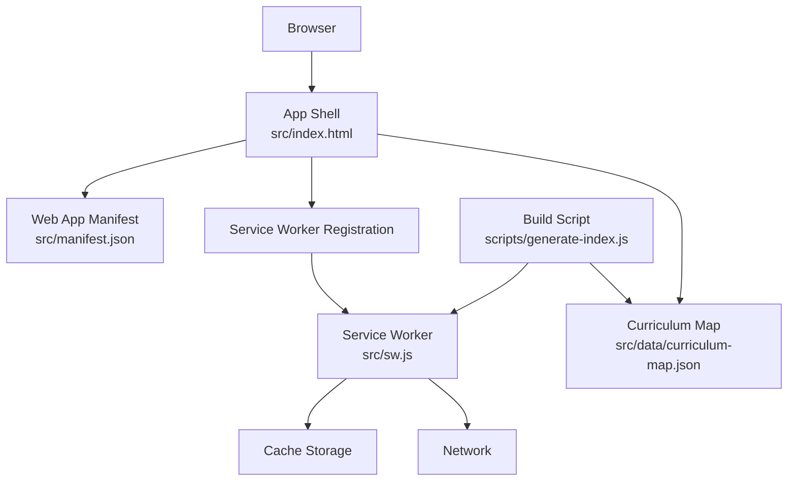
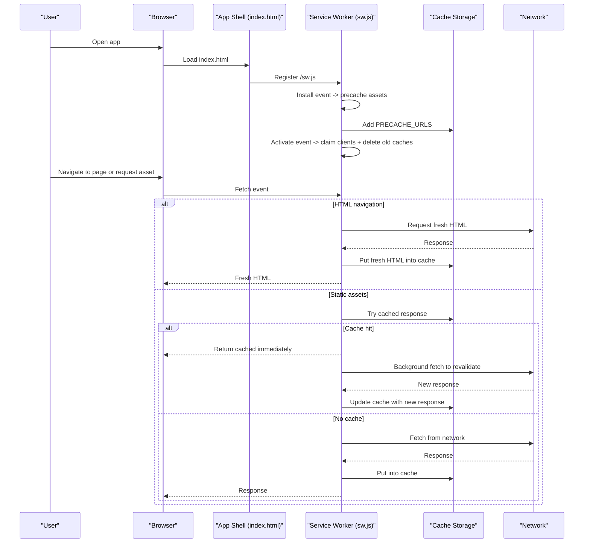
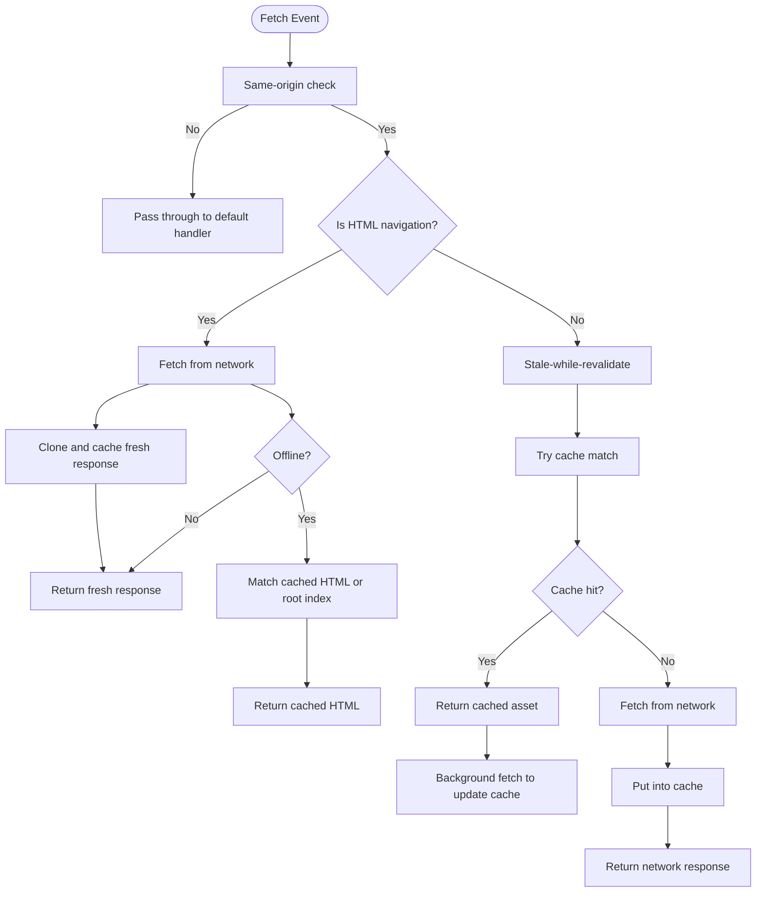
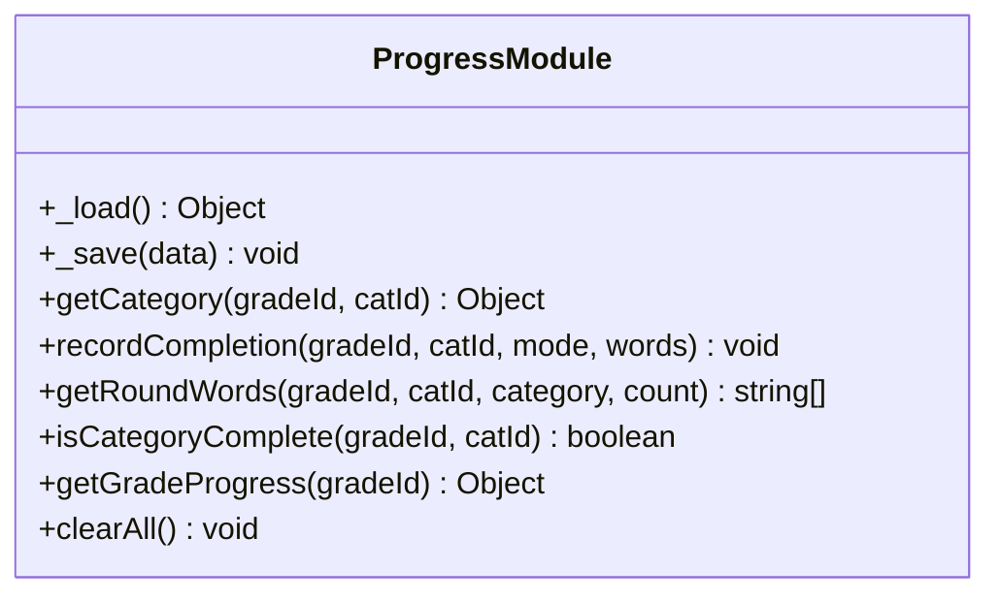
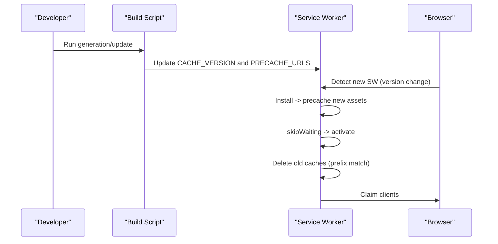
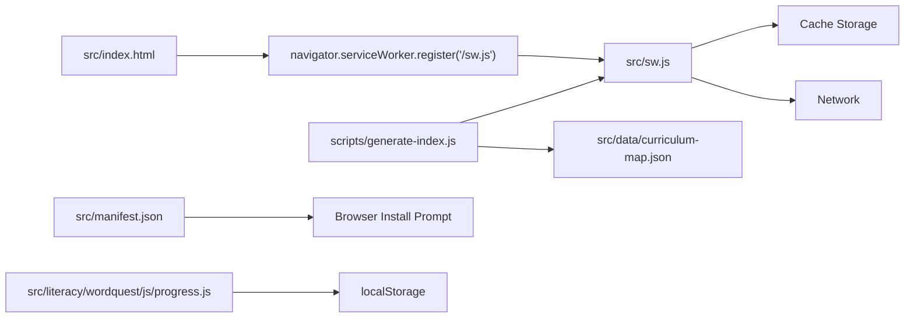

# Service Worker & PWA Implementation

<cite>
**Referenced Files in This Document**
- [sw.js](file://src/sw.js)
- [manifest.json](file://src/manifest.json)
- [index.html](file://src/index.html)
- [generate-index.js](file://scripts/generate-index.js)
- [progress.js](file://src/literacy/wordquest/js/progress.js)
- [curriculum-map.json](file://src/data/curriculum-map.json)
</cite>

## Table of Contents
1. [Introduction](#introduction)
2. [Project Structure](#project-structure)
3. [Core Components](#core-components)
4. [Architecture Overview](#architecture-overview)
5. [Detailed Component Analysis](#detailed-component-analysis)
6. [Dependency Analysis](#dependency-analysis)
7. [Performance Considerations](#performance-considerations)
8. [Troubleshooting Guide](#troubleshooting-guide)
9. [Security and Compatibility](#security-and-compatibility)
10. [Conclusion](#conclusion)

## Introduction
This document explains the Progressive Web App (PWA) implementation for the IB PYP Games project, focusing on service worker behavior, caching strategies, manifest configuration, offline capabilities, lifecycle and update mechanisms, cache versioning, debugging guidance, performance optimization, security considerations, and browser compatibility. The app provides an installable experience with offline-first resource loading and persistent progress tracking for games.

## Project Structure
The PWA is implemented using a minimal set of core files:
- A service worker that manages installation, activation, and fetch-time caching strategies.
- A web app manifest that configures installation, icons, display mode, and theme colors.
- An application shell that registers the service worker and hosts the learning map UI.
- A build script that updates the service worker’s cache version and precache list based on curriculum data.
- Local storage-based progress persistence for game playthroughs.
- Curriculum metadata used to generate pages and precache URLs.



**Diagram sources**
- [index.html:1134-1140](file://src/index.html#L1134-L1140)
- [sw.js:1-130](file://src/sw.js#L1-L130)
- [manifest.json:1-22](file://src/manifest.json#L1-L22)
- [generate-index.js:804-851](file://scripts/generate-index.js#L804-L851)
- [curriculum-map.json:1-551](file://src/data/curriculum-map.json#L1-L551)

**Section sources**
- [index.html:1134-1140](file://src/index.html#L1134-L1140)
- [sw.js:1-130](file://src/sw.js#L1-L130)
- [manifest.json:1-22](file://src/manifest.json#L1-L22)
- [generate-index.js:804-851](file://scripts/generate-index.js#L804-L851)
- [curriculum-map.json:1-551](file://src/data/curriculum-map.json#L1-L551)

## Core Components
- Service Worker (sw.js): Implements install/activate/fetch handlers, precaching, network-first for HTML, and stale-while-revalidate for static assets. It also supports immediate activation via skipWaiting and cleanup of old caches.
- Manifest (manifest.json): Defines app name, icons, start URL, scope, display mode, and theme colors for installation and standalone behavior.
- Application Shell (index.html): Registers the service worker and renders the learning map UI.
- Build Script (generate-index.js): Updates the service worker’s cache version and precache URL list based on curriculum content.
- Progress Persistence (progress.js): Stores per-grade, per-category progress in localStorage.

**Section sources**
- [sw.js:1-130](file://src/sw.js#L1-L130)
- [manifest.json:1-22](file://src/manifest.json#L1-L22)
- [index.html:1134-1140](file://src/index.html#L1134-L1140)
- [generate-index.js:804-851](file://scripts/generate-index.js#L804-L851)
- [progress.js:1-128](file://src/literacy/wordquest/js/progress.js#L1-L128)

## Architecture Overview
The PWA architecture centers around a service worker that intercepts network requests and applies different caching strategies depending on resource type. The app shell registers the service worker at runtime, while the build pipeline ensures the service worker’s cache version and precache list stay in sync with the current curriculum and assets.



**Diagram sources**
- [index.html:1134-1140](file://src/index.html#L1134-L1140)
- [sw.js:45-122](file://src/sw.js#L45-L122)

## Detailed Component Analysis

### Service Worker Lifecycle and Caching Strategies
- Install: Precaches essential assets listed in a generated array and calls skipWaiting to activate immediately.
- Activate: Deletes older caches with the same prefix and claims all open clients.
- Fetch:
  - HTML pages: Network-first strategy; attempts a fresh fetch, clones and caches the response, and falls back to cached HTML or the root index if offline.
  - Static assets (JS, CSS, images): Stale-while-revalidate strategy; returns cached response immediately if available, then updates the cache in the background with the latest network response. If offline, it serves the cached version.



**Diagram sources**
- [sw.js:75-122](file://src/sw.js#L75-L122)

**Section sources**
- [sw.js:1-130](file://src/sw.js#L1-L130)

### Manifest Configuration for Installation and Display
- App identity: Short name and full name for user-facing labels.
- Icons: Two PNG icons at 192x192 and 512x512 for various device densities.
- Start URL and Scope: Root-level scope and start URL define the app’s navigational boundary.
- Display Mode: Standalone mode hides browser UI for a more app-like experience.
- Theme Colors: Background and theme colors control the app’s appearance during launch and in system UI.

**Section sources**
- [manifest.json:1-22](file://src/manifest.json#L1-L22)

### Offline Capability Features
- Game Asset Caching: The service worker precaches key HTML pages and assets during install and uses network-first/stale-while-revalidate strategies to ensure fast and resilient access.
- Curriculum Data Persistence: The curriculum map JSON drives page generation and precache lists; while not directly cached by the service worker in this implementation, the generated HTML pages are precached and thus available offline.
- Progress Tracking Storage: Per-grade, per-category progress is stored in localStorage, enabling offline persistence of completion states and round progression.



**Diagram sources**
- [progress.js:1-128](file://src/literacy/wordquest/js/progress.js#L1-L128)

**Section sources**
- [sw.js:45-122](file://src/sw.js#L45-L122)
- [progress.js:1-128](file://src/literacy/wordquest/js/progress.js#L1-L128)
- [curriculum-map.json:1-551](file://src/data/curriculum-map.json#L1-L551)

### Service Worker Update Mechanisms and Cache Versioning
- Cache Versioning: A timestamp-based cache version is embedded in the service worker and used to create a unique cache name. Each build increments the version, ensuring new assets are isolated from previous caches.
- Automatic Updates: The build script updates both the cache version and the precache URL list based on the current curriculum and discovered game pages.
- Immediate Activation: The service worker calls skipWaiting during install to activate immediately, and the activate event deletes old caches and claims all clients to apply changes across tabs.



**Diagram sources**
- [generate-index.js:804-851](file://scripts/generate-index.js#L804-L851)
- [sw.js:45-73](file://src/sw.js#L45-L73)

**Section sources**
- [generate-index.js:804-851](file://scripts/generate-index.js#L804-L851)
- [sw.js:1-73](file://src/sw.js#L1-L73)

### Conceptual Overview
The PWA combines a robust service worker with a well-configured manifest and local storage to deliver an offline-capable, installable learning platform. The build pipeline keeps the precache list synchronized with the evolving curriculum, while the service worker’s strategies balance freshness and speed.

```mermaid
graph TB
Subgraph["PWA Layers"]
UI["UI Shell"]
SWLayer["Service Worker Layer"]
Storage["Local Storage"]
Assets["Precached Assets"]
end
UI --> SWLayer
SWLayer --> Assets
UI --> Storage
```

[No sources needed since this diagram shows conceptual workflow, not actual code structure]

## Dependency Analysis
The following diagram maps the primary dependencies among the PWA components:



**Diagram sources**
- [index.html:1134-1140](file://src/index.html#L1134-L1140)
- [sw.js:1-130](file://src/sw.js#L1-L130)
- [generate-index.js:804-851](file://scripts/generate-index.js#L804-L851)
- [curriculum-map.json:1-551](file://src/data/curriculum-map.json#L1-L551)
- [manifest.json:1-22](file://src/manifest.json#L1-L22)
- [progress.js:1-128](file://src/literacy/wordquest/js/progress.js#L1-L128)

**Section sources**
- [index.html:1134-1140](file://src/index.html#L1134-L1140)
- [sw.js:1-130](file://src/sw.js#L1-L130)
- [generate-index.js:804-851](file://scripts/generate-index.js#L804-L851)
- [curriculum-map.json:1-551](file://src/data/curriculum-map.json#L1-L551)
- [manifest.json:1-22](file://src/manifest.json#L1-L22)
- [progress.js:1-128](file://src/literacy/wordquest/js/progress.js#L1-L128)

## Performance Considerations
- Use network-first for HTML to ensure users see the latest content when online, with a reliable fallback to cached HTML when offline.
- Apply stale-while-revalidate for static assets to minimize latency by serving cached versions immediately while updating them in the background.
- Keep the precache list focused on essential pages and assets to reduce install time and storage usage.
- Avoid over-caching large media unless necessary; prefer lazy loading within games where possible.
- Monitor cache size and periodically prune unused resources if dynamic content grows significantly.

[No sources needed since this section provides general guidance]

## Troubleshooting Guide
- Verify registration: Ensure the app shell registers the service worker on load and logs any registration errors.
- Check install/activate events: Confirm that precaching completes and old caches are deleted during activation.
- Inspect fetch behavior: Validate that HTML requests follow network-first and static assets use stale-while-revalidate.
- Test offline mode: Disable network in developer tools and confirm that pages and assets load from cache.
- Force updates: Use the message handler to trigger skipWaiting if needed during development.
- Clear caches: Manually clear cache storage to test fresh installs and validate versioning behavior.

**Section sources**
- [index.html:1134-1140](file://src/index.html#L1134-L1140)
- [sw.js:45-130](file://src/sw.js#L45-L130)

## Security and Compatibility
- HTTPS Requirement: Service workers require a secure context (HTTPS). Ensure deployment over HTTPS for production.
- Same-Origin Policy: The service worker only handles same-origin requests; cross-origin requests pass through to the default handler.
- Content Security Policy: Align CSP headers with your asset loading patterns to avoid blocking cached responses.
- Browser Support: Modern browsers support service workers and cache storage. For older environments, consider feature detection and graceful degradation.
- Manifest Validity: Ensure the manifest includes required fields (name, icons, start_url, display) for installability.

[No sources needed since this section provides general guidance]

## Conclusion
The IB PYP Games PWA leverages a concise service worker with targeted caching strategies, a well-defined manifest, and a build-driven cache versioning approach to deliver a fast, installable, and offline-capable learning experience. Local storage persists user progress, while the precache list stays synchronized with the curriculum. Following the troubleshooting and performance recommendations will help maintain reliability and responsiveness across devices and network conditions.