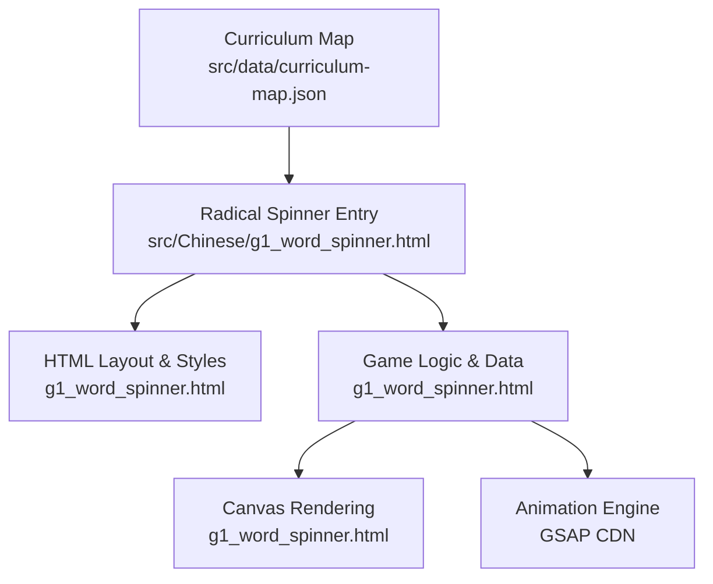
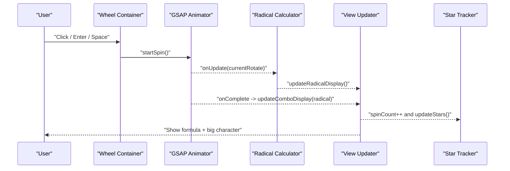
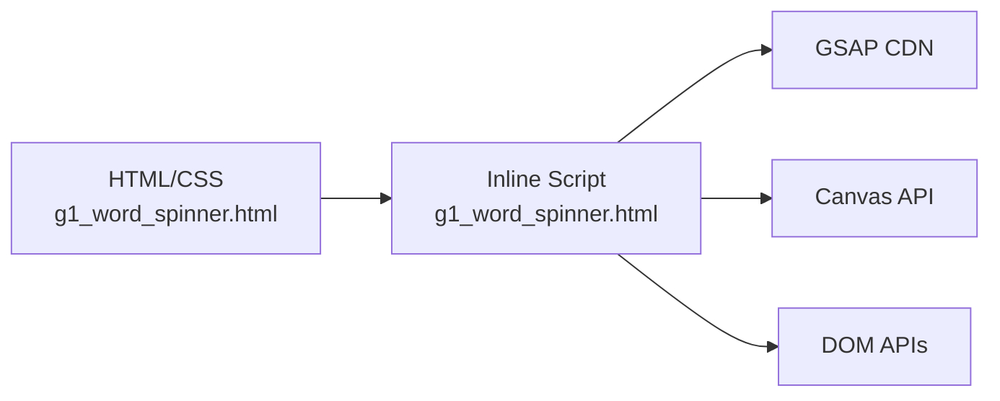

# Character Radical Explorer

<cite>
**Referenced Files in This Document**
- [g1_word_spinner.html](file://src/Chinese/g1_word_spinner.html)
- [curriculum-map.json](file://src/data/curriculum-map.json)
</cite>

## Table of Contents
1. [Introduction](#introduction)
2. [Project Structure](#project-structure)
3. [Core Components](#core-components)
4. [Architecture Overview](#architecture-overview)
5. [Detailed Component Analysis](#detailed-component-analysis)
6. [Dependency Analysis](#dependency-analysis)
7. [Performance Considerations](#performance-considerations)
8. [Troubleshooting Guide](#troubleshooting-guide)
9. [Conclusion](#conclusion)
10. [Appendices](#appendices)

## Introduction
Character Radical Explorer is an interactive, tablet-friendly learning tool that helps students explore how Chinese characters are composed from radicals and phonetic components. The game centers on a spinner wheel: learners select a character family (a shared component), spin the wheel to reveal different radicals, and instantly see how each radical combines with the family component to form a valid character. Visual feedback highlights the formulaic relationship between parts and whole, while a star-based progression system provides immediate encouragement.

The experience emphasizes:
- Spinner-based interaction for intuitive exploration
- Clear visual breakdown of character composition
- Progressive difficulty via star progression
- Touch-friendly design optimized for tablets
- Extensible data model for adding new character families and combinations

[No sources needed since this section summarizes without analyzing specific files]

## Project Structure
The project includes a single-page application for the Radical Spinner under the Chinese learning module. It is also referenced in the curriculum map as part of Grade 1 activities.

**Diagram sources**
- [curriculum-map.json:294-300](file://src/data/curriculum-map.json#L294-L300)
- [g1_word_spinner.html:1-20](file://src/Chinese/g1_word_spinner.html#L1-L20)
- [g1_word_spinner.html:545-560](file://src/Chinese/g1_word_spinner.html#L545-L560)

**Section sources**
- [curriculum-map.json:294-300](file://src/data/curriculum-map.json#L294-L300)
- [g1_word_spinner.html:1-20](file://src/Chinese/g1_word_spinner.html#L1-L20)

## Core Components
- Character Family Selector: Buttons at the top allow switching among predefined character families. Each family defines a set of radicals and their resulting combined characters.
- Spinner Wheel: A circular canvas divided into sectors representing radicals. Clicking or pressing Enter/Space rotates the wheel by one sector using smooth animation.
- Composition Display: Shows the formula “radical + family = result” and a large display of the resulting character.
- Star Progression: Stars light up progressively as the learner spins the wheel multiple times within a session.
- Canvas Layers: Two canvases render the wheel background and a mask overlay; a DOM element overlays the currently selected radical text.

Key implementation anchors:
- Data model for families and combos
- Wheel drawing and rotation logic
- Combo update and animations
- Star progression state

**Section sources**
- [g1_word_spinner.html:545-736](file://src/Chinese/g1_word_spinner.html#L545-L736)
- [g1_word_spinner.html:779-815](file://src/Chinese/g1_word_spinner.html#L779-L815)
- [g1_word_spinner.html:817-847](file://src/Chinese/g1_word_spinner.html#L817-L847)
- [g1_word_spinner.html:849-855](file://src/Chinese/g1_word_spinner.html#L849-L855)
- [g1_word_spinner.html:857-920](file://src/Chinese/g1_word_spinner.html#L857-L920)
- [g1_word_spinner.html:922-953](file://src/Chinese/g1_word_spinner.html#L922-L953)
- [g1_word_spinner.html:955-971](file://src/Chinese/g1_word_spinner.html#L955-L971)

## Architecture Overview
The app follows a simple event-driven architecture:
- User input triggers wheel spin
- GSAP animates rotation
- On completion, the active radical is computed and displayed
- The combo formula and result character are updated with animations
- Star progress increments per spin

**Diagram sources**
- [g1_word_spinner.html:922-953](file://src/Chinese/g1_word_spinner.html#L922-L953)
- [g1_word_spinner.html:817-847](file://src/Chinese/g1_word_spinner.html#L817-L847)
- [g1_word_spinner.html:849-855](file://src/Chinese/g1_word_spinner.html#L849-L855)

## Detailed Component Analysis

### Data Model: Character Families and Combos
- Structure: An object keyed by a family character. Each entry contains:
  - radicals: array of radical glyphs
  - combos: mapping from radical to the resulting full character
- Complexity: O(1) lookup by family and radical; linear iteration only when building UI buttons.

Implementation anchors:
- Family definitions and mappings
- Initial selection and default state

**Section sources**
- [g1_word_spinner.html:545-736](file://src/Chinese/g1_word_spinner.html#L545-L736)
- [g1_word_spinner.html:773-777](file://src/Chinese/g1_word_spinner.html#L773-L777)

### UI: Character Family Selector
- Dynamically creates buttons for each family key
- Manages active state and accessibility attributes
- Switches current family and resets wheel state

Implementation anchors:
- Button creation loop
- Active class toggling and aria attributes
- switchChar flow

**Section sources**
- [g1_word_spinner.html:779-815](file://src/Chinese/g1_word_spinner.html#L779-L815)

### Interaction: Spinner Wheel and Animation
- Input handling supports click and keyboard (Enter/Space)
- Rotation uses GSAP to animate from current angle to target angle (one sector step)
- During animation, bottom canvas redraws and radical text updates
- On completion, final angle is set, combo display updates, and star count increments

Implementation anchors:
- Event listeners for wheel container
- startSpin function and GSAP tween
- onComplete callback updating view and stars

**Section sources**
- [g1_word_spinner.html:955-971](file://src/Chinese/g1_word_spinner.html#L955-L971)
- [g1_word_spinner.html:922-953](file://src/Chinese/g1_word_spinner.html#L922-L953)

### Rendering: Canvas Layers
- Bottom canvas draws colored sectors and outer ring based on current rotation
- Middle canvas masks upper half and a sector to highlight the pointer area and shows the family character in the center
- Both layers use a fixed logical size for crisp rendering

Implementation anchors:
- drawBottomCanvas: sector fill, borders, outer ring
- drawMiddleCanvas: white mask shapes, center character, dot

**Section sources**
- [g1_word_spinner.html:891-920](file://src/Chinese/g1_word_spinner.html#L891-L920)
- [g1_word_spinner.html:857-889](file://src/Chinese/g1_word_spinner.html#L857-L889)

### Visual Feedback: Radical Text and Combo Display
- Radical text positioned absolutely over the wheel indicates the currently aligned radical
- Combo display shows the formula and animates a scale effect
- Result character card pops with a CSS animation

Implementation anchors:
- updateRadicalDisplay: computes index from rotation and sets text
- updateComboDisplay: builds formula string, updates DOM, applies CSS classes for animation

**Section sources**
- [g1_word_spinner.html:817-847](file://src/Chinese/g1_word_spinner.html#L817-L847)

### Progression: Star System
- Tracks number of successful spins within a session
- Lights up up to six stars progressively
- Resets when switching character families

Implementation anchors:
- spinCount increment in animation completion
- updateStars toggles lit class per star

**Section sources**
- [g1_word_spinner.html:849-855](file://src/Chinese/g1_word_spinner.html#L849-L855)
- [g1_word_spinner.html:942-950](file://src/Chinese/g1_word_spinner.html#L942-L950)
- [g1_word_spinner.html:800-804](file://src/Chinese/g1_word_spinner.html#L800-L804)

### Accessibility and Responsiveness
- Keyboard support for activation
- ARIA roles and labels for screen readers
- Responsive layout adapts to smaller screens
- Respects reduced motion preferences

Implementation anchors:
- role="button", tabindex, aria-label on wheel
- aria-live region for combo status
- Media queries for mobile/tablet layouts
- prefers-reduced-motion rules

**Section sources**
- [g1_word_spinner.html:476-518](file://src/Chinese/g1_word_spinner.html#L476-L518)
- [g1_word_spinner.html:521-543](file://src/Chinese/g1_word_spinner.html#L521-L543)
- [g1_word_spinner.html:429-460](file://src/Chinese/g1_word_spinner.html#L429-L460)
- [g1_word_spinner.html:392-405](file://src/Chinese/g1_word_spinner.html#L392-L405)

### Conceptual Overview
This section outlines how the game could be extended conceptually without altering existing code:
- Stroke order visualization: Overlay stroke paths on the result character using a separate canvas layer or SVG overlay.
- Cultural context cards: Show brief notes about meaning or usage after each spin.
- Adaptive difficulty: Adjust sector count or introduce multi-radical combinations based on performance.

[No sources needed since this diagram shows conceptual workflow, not actual code structure]

## Dependency Analysis
External dependency:
- GSAP animation library loaded via CDN for smooth transitions

Internal dependencies:
- HTML elements referenced by IDs
- Canvas contexts for drawing
- DOM APIs for dynamic button creation and class toggling

**Diagram sources**
- [g1_word_spinner.html:13-13](file://src/Chinese/g1_word_spinner.html#L13-L13)
- [g1_word_spinner.html:738-746](file://src/Chinese/g1_word_spinner.html#L738-L746)

**Section sources**
- [g1_word_spinner.html:13-13](file://src/Chinese/g1_word_spinner.html#L13-L13)
- [g1_word_spinner.html:738-746](file://src/Chinese/g1_word_spinner.html#L738-L746)

## Performance Considerations
- Canvas redraw frequency: The wheel redraws every frame during animation; consider throttling or reducing resolution on low-end devices.
- Font loading: Google Fonts are preconnected; ensure fallback fonts are available for offline or slow networks.
- Reduced motion: Respect user preferences to avoid heavy animations.
- Memory: Avoid creating unnecessary DOM nodes; reuse elements where possible.

[No sources needed since this section provides general guidance]

## Troubleshooting Guide
Common issues and resolutions:
- Wheel does not respond to clicks: Ensure the wheel container has focus and no overlapping elements block events. Verify event listeners are attached.
- No characters appear in combo display: Confirm the current family’s combos include the selected radical; check for missing keys in the data model.
- Animations feel choppy: Reduce animation duration or disable complex effects for lower-powered devices; leverage prefers-reduced-motion.
- Accessibility concerns: Verify aria-live announcements occur when the combo updates and that all interactive elements have appropriate labels.

**Section sources**
- [g1_word_spinner.html:955-971](file://src/Chinese/g1_word_spinner.html#L955-L971)
- [g1_word_spinner.html:817-847](file://src/Chinese/g1_word_spinner.html#L817-L847)
- [g1_word_spinner.html:392-405](file://src/Chinese/g1_word_spinner.html#L392-L405)

## Conclusion
Character Radical Explorer offers a focused, engaging way for young learners to discover how radicals combine to form meaningful characters. Its spinner-based interaction, clear visual feedback, and star progression create a motivating loop. The modular data model makes it straightforward to add new families and expand educational content. With responsive design and accessibility features, it works well across devices and supports inclusive learning environments.

[No sources needed since this section summarizes without analyzing specific files]

## Appendices

### Implementation Examples

#### Adding a New Radical Set
Steps:
- Add a new entry to the character families object with a family character, its radicals, and the corresponding combos.
- Ensure the number of radicals matches the expected sector count if you plan to change the wheel layout.
- Test switching to the new family and spinning the wheel to verify correct combo display.

Relevant anchors:
- Character families data structure
- Family switching logic

**Section sources**
- [g1_word_spinner.html:545-736](file://src/Chinese/g1_word_spinner.html#L545-L736)
- [g1_word_spinner.html:779-815](file://src/Chinese/g1_word_spinner.html#L779-L815)

#### Customizing Difficulty Levels
Conceptual approach:
- Increase sector count for more radicals per family
- Introduce multi-radical combinations (e.g., two radicals plus a phonetic)
- Gate advanced families behind star milestones

Current baseline:
- Six sectors per wheel
- One radical per combination

Relevant anchors:
- Sector constants and colors
- Star progression logic

**Section sources**
- [g1_word_spinner.html:747-772](file://src/Chinese/g1_word_spinner.html#L747-L772)
- [g1_word_spinner.html:849-855](file://src/Chinese/g1_word_spinner.html#L849-L855)

#### Integrating Cultural Context Information
Conceptual approach:
- Attach metadata to each combo (meaning, common words, cultural note)
- After each spin, show a small info panel with the context
- Allow toggling context visibility to keep the interface clean

Relevant anchors:
- Combo display update function
- DOM manipulation patterns used elsewhere in the file

**Section sources**
- [g1_word_spinner.html:817-847](file://src/Chinese/g1_word_spinner.html#L817-L847)

#### Touch-Friendly Interface Design for Tablets
Design considerations implemented:
- Large touch targets for buttons and wheel
- Tap-highlight removal and manipulation touch-action
- Responsive grid layout adapting to portrait and landscape orientations
- Safe area insets for modern devices

Relevant anchors:
- CSS variables and media queries
- Touch-related styles

**Section sources**
- [g1_word_spinner.html:103-121](file://src/Chinese/g1_word_spinner.html#L103-L121)
- [g1_word_spinner.html:139-195](file://src/Chinese/g1_word_spinner.html#L139-L195)
- [g1_word_spinner.html:197-232](file://src/Chinese/g1_word_spinner.html#L197-L232)
- [g1_word_spinner.html:429-460](file://src/Chinese/g1_word_spinner.html#L429-L460)

#### Progressive Disclosure of Character Complexity
Conceptual approach:
- Start with simple two-part combinations
- Gradually introduce three-part structures or less common radicals
- Use star milestones to unlock advanced families

Current baseline:
- Simple two-part combinations with consistent sector counts

Relevant anchors:
- Star progression and reset behavior

**Section sources**
- [g1_word_spinner.html:849-855](file://src/Chinese/g1_word_spinner.html#L849-L855)
- [g1_word_spinner.html:800-804](file://src/Chinese/g1_word_spinner.html#L800-L804)

#### Scoring System, Achievement Tracking, and Adaptive Difficulty
Current implementation:
- Star-based progression tracks spins per session
- Resetting occurs when switching families

Extensions:
- Persist scores across sessions using localStorage
- Track accuracy if quizzes are added later
- Adjust sector count or introduce hints based on performance trends

Relevant anchors:
- Star update function
- Spin count management

**Section sources**
- [g1_word_spinner.html:849-855](file://src/Chinese/g1_word_spinner.html#L849-L855)
- [g1_word_spinner.html:942-950](file://src/Chinese/g1_word_spinner.html#L942-L950)