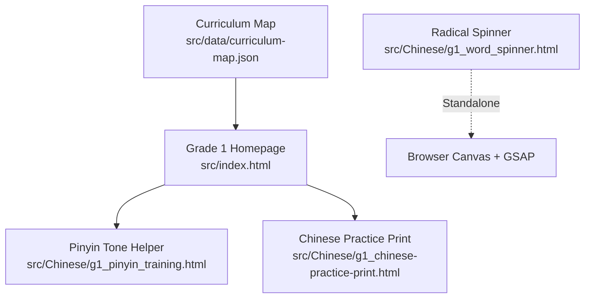
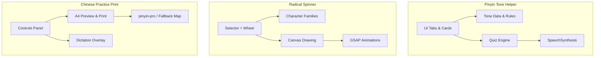
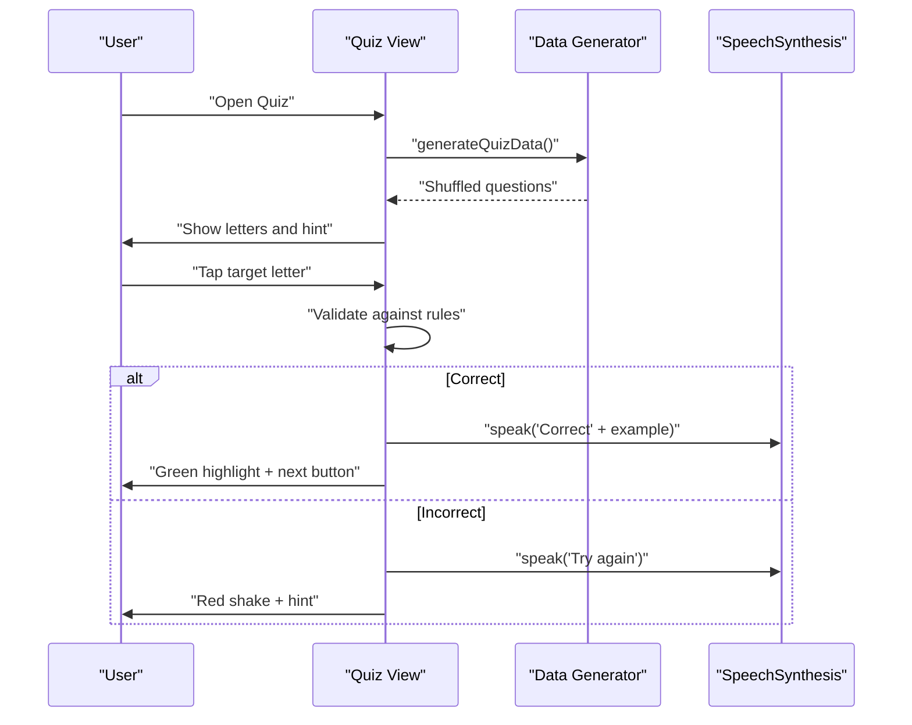
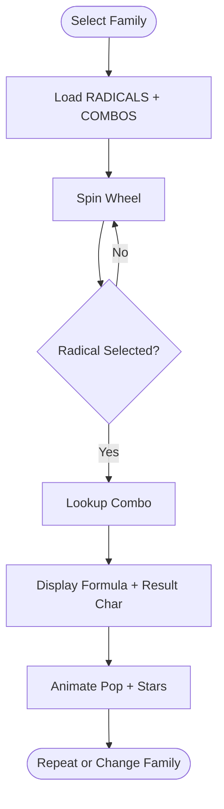
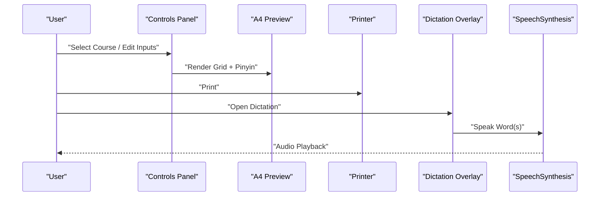
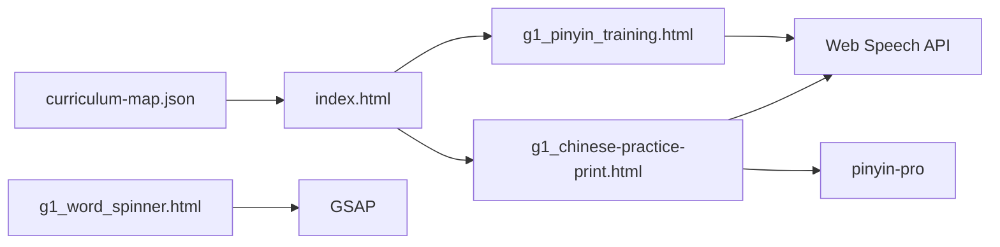

# Chinese Language Learning Games

<cite>
**Referenced Files in This Document**
- [README.md](file://README.md)
- [g1_pinyin_training.html](file://src/Chinese/g1_pinyin_training.html)
- [g1_word_spinner.html](file://src/Chinese/g1_word_spinner.html)
- [g1_chinese-practice-print.html](file://src/Chinese/g1_chinese-practice-print.html)
- [index.html](file://src/index.html)
- [curriculum-map.json](file://src/data/curriculum-map.json)
</cite>

## Table of Contents
1. [Introduction](#introduction)
2. [Project Structure](#project-structure)
3. [Core Components](#core-components)
4. [Architecture Overview](#architecture-overview)
5. [Detailed Component Analysis](#detailed-component-analysis)
6. [Dependency Analysis](#dependency-analysis)
7. [Performance Considerations](#performance-considerations)
8. [Troubleshooting Guide](#troubleshooting-guide)
9. [Conclusion](#conclusion)
10. [Appendices](#appendices)

## Introduction
This document explains the Chinese Language Learning Games designed to support IB PYP Chinese language acquisition for early learners. The suite integrates three complementary, interactive activities:
- Pinyin Tone Helper: a tone-marking game with audio feedback and mnemonic rules.
- Radical Spinner: an exploration tool that combines radicals with phonetic components to build character families.
- Chinese Practice Print: a printable writing practice generator with pinyin, grid types, and dictation mode.

The pedagogical approach blends:
- Tonal awareness through explicit tone placement rules and immediate auditory feedback.
- Morphological insight via radical combinations and character family patterns.
- Handwriting development through guided tracing and structured grids.

Cultural context is embedded through curriculum-aligned vocabulary sets and idiomatic mnemonics. Phonetic pronunciation systems are supported by browser speech synthesis and optional external libraries. Visual learning aids include color-coded tone targets, animated feedback, and traditional tianzige/mizige grids.

## Project Structure
The Chinese games are organized under src/Chinese as standalone HTML5 applications. They are linked from the generated Grade 1 homepage and mapped in the curriculum map.

**Diagram sources**
- [index.html:530-557](file://src/index.html#L530-L557)
- [curriculum-map.json:67-75](file://src/data/curriculum-map.json#L67-L75)

**Section sources**
- [README.md:1-65](file://README.md#L1-L65)
- [index.html:530-557](file://src/index.html#L530-L557)
- [curriculum-map.json:67-75](file://src/data/curriculum-map.json#L67-L75)

## Core Components
- Pinyin Tone Helper: Interactive cards and quiz for two-, three-, and whole-syllable categories; supports voice selection and rule-based hints.
- Radical Spinner: Character family wheel with selectable radicals and animated results.
- Chinese Practice Print: Configurable worksheet generator with pinyin overlays, grid styles, colors, fonts, and dictation playback.

Key design principles:
- Child-friendly UI with large touch targets and clear feedback.
- Cross-platform compatibility (desktop, iPad landscape, mobile).
- Accessibility features including keyboard focus, aria labels, and reduced motion support.

**Section sources**
- [g1_pinyin_training.html:1-547](file://src/Chinese/g1_pinyin_training.html#L1-L547)
- [g1_word_spinner.html:1-800](file://src/Chinese/g1_word_spinner.html#L1-L800)
- [g1_chinese-practice-print.html:1-800](file://src/Chinese/g1_chinese-practice-print.html#L1-L800)

## Architecture Overview
Each game is self-contained with embedded CSS and JavaScript, minimizing dependencies while leveraging common web APIs:
- SpeechSynthesis for Mandarin audio feedback.
- Canvas for drawing wheels and grids.
- Optional external libraries (GSAP for animations, pinyin-pro for pinyin conversion).

**Diagram sources**
- [g1_pinyin_training.html:216-536](file://src/Chinese/g1_pinyin_training.html#L216-L536)
- [g1_word_spinner.html:545-800](file://src/Chinese/g1_word_spinner.html#L545-L800)
- [g1_chinese-practice-print.html:900-1599](file://src/Chinese/g1_chinese-practice-print.html#L900-L1599)

## Detailed Component Analysis

### Pinyin Tone Helper
Pedagogical goals:
- Reinforce tone placement rules using mnemonic cues.
- Provide immediate auditory feedback via SpeechSynthesis.
- Offer progressive difficulty across two-, three-, and whole-syllable categories.

User flow:
- Learners select a category tab (two/three/whole syllables or quiz).
- In learning view, cards display pinyin with tone marks, corresponding characters, and rule hints. Clicking a card plays audio.
- In quiz view, learners click the correct letter to place the tone mark on the target vowel based on rules. Feedback includes visual animation and spoken confirmation.

**Diagram sources**
- [g1_pinyin_training.html:289-320](file://src/Chinese/g1_pinyin_training.html#L289-L320)
- [g1_pinyin_training.html:356-379](file://src/Chinese/g1_pinyin_training.html#L356-L379)
- [g1_pinyin_training.html:456-532](file://src/Chinese/g1_pinyin_training.html#L456-L532)

Implementation highlights:
- Rule-based validation accounts for special cases like ui/iu ordering and ü handling after j/q/x/y.
- Voice selection allows choosing preferred Mandarin voices when available.
- Color-coded tone targets aid visual discrimination.

Accessibility:
- Keyboard navigable tabs and buttons.
- Large tap targets and contrast-aware styling.
- Reduced motion considerations for animations.

**Section sources**
- [g1_pinyin_training.html:128-170](file://src/Chinese/g1_pinyin_training.html#L128-L170)
- [g1_pinyin_training.html:228-287](file://src/Chinese/g1_pinyin_training.html#L228-L287)
- [g1_pinyin_training.html:327-374](file://src/Chinese/g1_pinyin_training.html#L327-L374)
- [g1_pinyin_training.html:416-448](file://src/Chinese/g1_pinyin_training.html#L416-L448)
- [g1_pinyin_training.html:456-532](file://src/Chinese/g1_pinyin_training.html#L456-L532)

### Radical Spinner
Pedagogical goals:
- Build morphological awareness by exploring how radicals combine with phonetic components to form characters.
- Encourage pattern recognition across character families.

User flow:
- Select a character family (e.g., “包”, “青”).
- Spin the wheel to land on a radical; the app displays the resulting character and formula.
- Animated transitions reinforce engagement and retention.

**Diagram sources**
- [g1_word_spinner.html:548-736](file://src/Chinese/g1_word_spinner.html#L548-L736)
- [g1_word_spinner.html:779-800](file://src/Chinese/g1_word_spinner.html#L779-L800)

Implementation highlights:
- Data-driven character families with radicals and combo mappings.
- Canvas-based wheel rendering with consistent sector sizing and vibrant colors.
- GSAP-powered smooth spin animations and result pop effects.

Accessibility:
- Focusable wheel container and selector buttons.
- ARIA roles and live regions for screen readers.
- Respects prefers-reduced-motion.

**Section sources**
- [g1_word_spinner.html:14-461](file://src/Chinese/g1_word_spinner.html#L14-L461)
- [g1_word_spinner.html:548-736](file://src/Chinese/g1_word_spinner.html#L548-L736)
- [g1_word_spinner.html:738-800](file://src/Chinese/g1_word_spinner.html#L738-L800)

### Chinese Practice Print
Pedagogical goals:
- Support handwriting development with traceable characters in traditional grids.
- Integrate pinyin annotation and dictation practice for listening-writing skills.
- Align with curriculum units for contextualized vocabulary.

User flow:
- Choose a course or input custom characters and word groups.
- Configure grid type, size, colors, font, and pinyin visibility.
- Preview A4 layout and print directly.
- Use dictation overlay to play words at intervals for writing practice.

**Diagram sources**
- [g1_chinese-practice-print.html:900-1599](file://src/Chinese/g1_chinese-practice-print.html#L900-L1599)

Implementation highlights:
- Comprehensive course data aligned to textbooks and “语文园地” sections.
- Pinyin generation via pinyin-pro with fallback mapping for accuracy.
- Configurable tianzige/mizige/blank grids with diagonal guides for mizige.
- Dictation mode with repeat count, interval control, and voice selection.

Accessibility:
- High-contrast controls and large inputs.
- Keyboard navigation for all settings.
- Print stylesheet hides non-essential UI elements.

**Section sources**
- [g1_chinese-practice-print.html:635-874](file://src/Chinese/g1_chinese-practice-print.html#L635-L874)
- [g1_chinese-practice-print.html:900-1599](file://src/Chinese/g1_chinese-practice-print.html#L900-L1599)
- [g1_chinese-practice-print.html:1185-1238](file://src/Chinese/g1_chinese-practice-print.html#L1185-L1238)

## Dependency Analysis
External dependencies:
- Tailwind CSS (via CDN) for rapid responsive styling in Pinyin Tone Helper.
- GSAP (via CDN) for smooth animations in Radical Spinner.
- pinyin-pro (via CDN) for accurate pinyin conversion in Chinese Practice Print.
- Web Speech API for native Mandarin TTS across games.

Internal relationships:
- Curriculum map drives navigation and descriptions for Chinese games.
- Generated index page links to Pinyin Tone Helper and Chinese Practice Print.

**Diagram sources**
- [curriculum-map.json:67-75](file://src/data/curriculum-map.json#L67-L75)
- [index.html:530-557](file://src/index.html#L530-L557)
- [g1_pinyin_training.html:8-10](file://src/Chinese/g1_pinyin_training.html#L8-L10)
- [g1_word_spinner.html:13](file://src/Chinese/g1_word_spinner.html#L13)
- [g1_chinese-practice-print.html:8](file://src/Chinese/g1_chinese-practice-print.html#L8)

**Section sources**
- [curriculum-map.json:67-75](file://src/data/curriculum-map.json#L67-L75)
- [index.html:530-557](file://src/index.html#L530-L557)
- [g1_pinyin_training.html:8-10](file://src/Chinese/g1_pinyin_training.html#L8-L10)
- [g1_word_spinner.html:13](file://src/Chinese/g1_word_spinner.html#L13)
- [g1_chinese-practice-print.html:8](file://src/Chinese/g1_chinese-practice-print.html#L8)

## Performance Considerations
- Prefer system fonts and minimal assets to reduce load time on low-bandwidth devices.
- Defer heavy animations until user interaction to improve initial render performance.
- Use canvas efficiently by reusing contexts and avoiding unnecessary redraws.
- Cache versioned assets where applicable to leverage browser caching.

[No sources needed since this section provides general guidance]

## Troubleshooting Guide
Common issues and resolutions:
- No audio output: Ensure device volume is up and browser permissions allow media playback. On iOS/iPad, audio must be unlocked by a user gesture.
- SpeechSynthesis not available: Some browsers may restrict TTS; verify lang='zh-CN' and available voices.
- Camera access required for other apps: Not applicable here, but if integrating camera features, ensure HTTPS and user permission prompts.
- Printing misalignment: Adjust cell size within recommended range (10–15mm) for A4 paper.

**Section sources**
- [g1_pinyin_training.html:327-374](file://src/Chinese/g1_pinyin_training.html#L327-L374)
- [g1_chinese-practice-print.html:825-836](file://src/Chinese/g1_chinese-practice-print.html#L825-L836)

## Conclusion
The Chinese Language Learning Games provide a cohesive, research-informed toolkit for early Chinese literacy. By combining tonal training, radical exploration, and structured writing practice, the suite supports phonological awareness, morphological understanding, and fine motor skill development. The modular architecture and accessibility-first design enable broad deployment across diverse learning environments.

[No sources needed since this section summarizes without analyzing specific files]

## Appendices

### Implementation Examples

#### Adding New Vocabulary Sets
- For Pinyin Tone Helper:
  - Extend the data arrays for two/three/whole syllables with new items including pinyin, character, rule, type, and tts strings.
  - Ensure rule and type align with tone placement logic.
- For Chinese Practice Print:
  - Add entries in the courseData object with chars and words fields.
  - Update getPinyin fallback map if necessary for rare characters.

**Section sources**
- [g1_pinyin_training.html:228-287](file://src/Chinese/g1_pinyin_training.html#L228-L287)
- [g1_chinese-practice-print.html:900-1184](file://src/Chinese/g1_chinese-practice-print.html#L900-L1184)
- [g1_chinese-practice-print.html:1185-1238](file://src/Chinese/g1_chinese-practice-print.html#L1185-L1238)

#### Customizing Difficulty Levels
- Pinyin Tone Helper:
  - Filter quiz generation by category or add a difficulty parameter to limit question pools.
- Radical Spinner:
  - Increase or decrease the number of radicals per family to adjust complexity.
- Chinese Practice Print:
  - Adjust traceCount and gridType to scaffold handwriting progression.

**Section sources**
- [g1_pinyin_training.html:289-320](file://src/Chinese/g1_pinyin_training.html#L289-L320)
- [g1_word_spinner.html:548-736](file://src/Chinese/g1_word_spinner.html#L548-L736)
- [g1_chinese-practice-print.html:786-836](file://src/Chinese/g1_chinese-practice-print.html#L786-L836)

#### Integrating Audio Resources
- Pinyin Tone Helper:
  - Use SpeechSynthesis with zh-CN and selected voice for consistent pronunciation.
- Chinese Practice Print:
  - Dictation overlay leverages SpeechSynthesis; configure voice selection and playback intervals.

**Section sources**
- [g1_pinyin_training.html:327-374](file://src/Chinese/g1_pinyin_training.html#L327-L374)
- [g1_chinese-practice-print.html:1517-1599](file://src/Chinese/g1_chinese-practice-print.html#L1517-L1599)

### Accessibility Considerations
- Keyboard navigation: All interactive elements should be focusable and operable via keyboard.
- Screen reader support: Use aria-labels, roles, and live regions to convey state changes.
- Reduced motion: Respect prefers-reduced-motion to disable animations for sensitive users.
- Contrast and typography: Maintain sufficient color contrast and legible font sizes for young learners.

**Section sources**
- [g1_pinyin_training.html:128-170](file://src/Chinese/g1_pinyin_training.html#L128-L170)
- [g1_word_spinner.html:465-543](file://src/Chinese/g1_word_spinner.html#L465-L543)
- [g1_chinese-practice-print.html:635-874](file://src/Chinese/g1_chinese-practice-print.html#L635-L874)

### Cross-Platform Compatibility
- Desktop and iPad landscape first, with responsive fallbacks for smaller screens.
- Touch-friendly interactions with minimum 44px targets.
- Standalone HTML5 pages with embedded CSS/JS for portability.

**Section sources**
- [README.md:58-65](file://README.md#L58-L65)
- [g1_word_spinner.html:429-461](file://src/Chinese/g1_word_spinner.html#L429-L461)
- [g1_chinese-practice-print.html:595-612](file://src/Chinese/g1_chinese-practice-print.html#L595-L612)