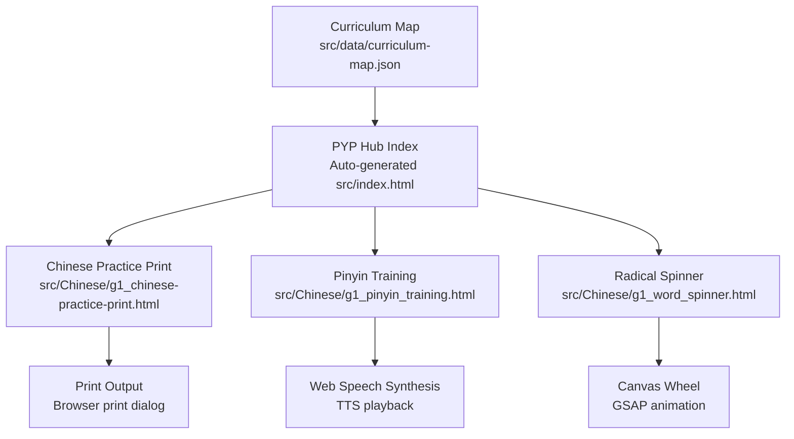
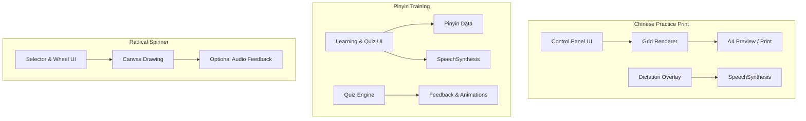
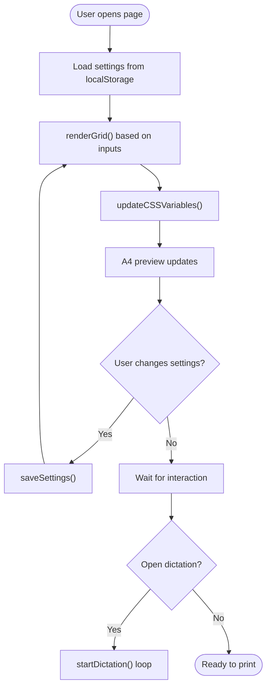
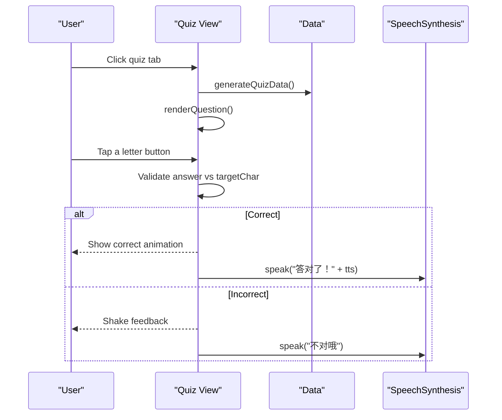
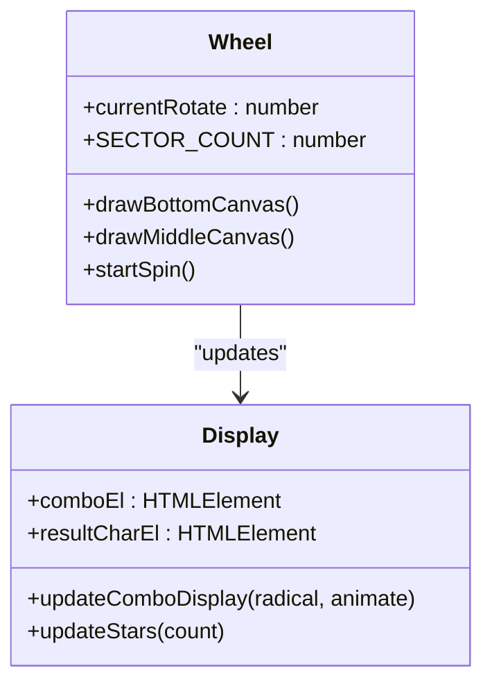
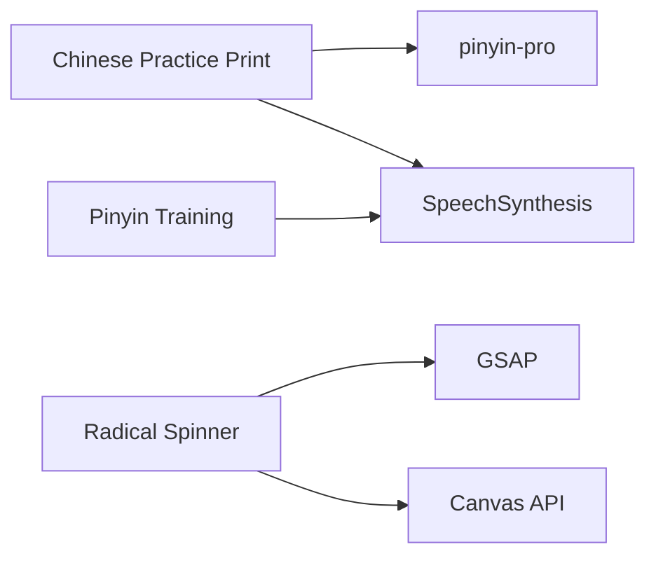

# Handwriting Practice Studio

<cite>
**Referenced Files in This Document**
- [g1_chinese-practice-print.html](file://src/Chinese/g1_chinese-practice-print.html)
- [g1_pinyin_training.html](file://src/Chinese/g1_pinyin_training.html)
- [g1_word_spinner.html](file://src/Chinese/g1_word_spinner.html)
- [curriculum-map.json](file://src/data/curriculum-map.json)
- [README.md](file://README.md)
- [AGENTS.md](file://AGENTS.md)
</cite>

## Table of Contents
1. [Introduction](#introduction)
2. [Project Structure](#project-structure)
3. [Core Components](#core-components)
4. [Architecture Overview](#architecture-overview)
5. [Detailed Component Analysis](#detailed-component-analysis)
6. [Dependency Analysis](#dependency-analysis)
7. [Performance Considerations](#performance-considerations)
8. [Troubleshooting Guide](#troubleshooting-guide)
9. [Conclusion](#conclusion)
10. [Appendices](#appendices)

## Introduction
This document describes the Chinese Handwriting Practice Studio within the IB PYP Games project. It focuses on:
- The printable character practice tool that generates A4 worksheets with grid templates and pinyin support for guided writing.
- The pinyin tone training tool that helps learners place tones correctly across two-, three-, and whole syllables.
- The radical spinner that builds character family awareness by combining radicals with phonetic components.

The studio emphasizes curriculum alignment, accessibility, and cross-platform usability (mouse and touch). It also provides guidance for extending content, customizing grids, and integrating with IB PYP standards.

## Project Structure
The Chinese learning tools are organized as standalone HTML pages under src/Chinese/. They are linked from the curriculum map and can be launched directly or via the generated homepage.

**Diagram sources**
- [curriculum-map.json:60-76](file://src/data/curriculum-map.json#L60-L76)
- [README.md:1-39](file://README.md#L1-L39)

**Section sources**
- [curriculum-map.json:1-78](file://src/data/curriculum-map.json#L1-L78)
- [README.md:1-39](file://README.md#L1-L39)

## Core Components
- Chinese Practice Print: Generates printable A4 sheets with configurable grids (tianzige/mizige/blank), pinyin lines, trace counts, colors, fonts, and a built-in dictation mode using Web Speech Synthesis.
- Pinyin Training: Interactive cards and quiz to practice tone placement rules; uses TTS for pronunciation and feedback.
- Radical Spinner: Canvas-based wheel that rotates through radicals and shows resulting characters with animations and star progression.

Key capabilities relevant to handwriting development:
- Template overlays: Grid backgrounds (田字格/米字格) and optional pinyin four-line guides.
- Trace guidance: Configurable number of gray “trace” cells after each target character.
- Cross-platform input: Mouse and touch-friendly controls; keyboard accessible where applicable.
- Curriculum integration: Preloaded course sets aligned to Grade 1–2 textbooks and “语文园地”.

**Section sources**
- [g1_chinese-practice-print.html:10-22](file://src/Chinese/g1_chinese-practice-print.html#L10-L22)
- [g1_chinese-practice-print.html:309-371](file://src/Chinese/g1_chinese-practice-print.html#L309-L371)
- [g1_chinese-practice-print.html:435-521](file://src/Chinese/g1_chinese-practice-print.html#L435-L521)
- [g1_chinese-practice-print.html:816-874](file://src/Chinese/g1_chinese-practice-print.html#L816-L874)
- [g1_chinese-practice-print.html:1220-1230](file://src/Chinese/g1_chinese-practice-print.html#L1220-L1230)
- [g1_chinese-practice-print.html:1292-1453](file://src/Chinese/g1_chinese-practice-print.html#L1292-L1453)
- [g1_chinese-practice-print.html:1508-1718](file://src/Chinese/g1_chinese-practice-print.html#L1508-L1718)
- [g1_pinyin_training.html:126-170](file://src/Chinese/g1_pinyin_training.html#L126-L170)
- [g1_pinyin_training.html:228-287](file://src/Chinese/g1_pinyin_training.html#L228-L287)
- [g1_pinyin_training.html:356-379](file://src/Chinese/g1_pinyin_training.html#L356-L379)
- [g1_word_spinner.html:738-776](file://src/Chinese/g1_word_spinner.html#L738-L776)
- [g1_word_spinner.html:857-920](file://src/Chinese/g1_word_spinner.html#L857-L920)
- [g1_word_spinner.html:922-971](file://src/Chinese/g1_word_spinner.html#L922-L971)

## Architecture Overview
The system is composed of three independent single-page applications, each optimized for a specific learning goal. They share common patterns:
- Standalone HTML + CSS + JS
- Responsive design for desktop and tablet
- Optional use of external libraries (pinyin-pro, GSAP)
- Integration with Web APIs (SpeechSynthesis, Canvas)

[No sources needed since this diagram shows conceptual workflow, not actual code structure]

## Detailed Component Analysis

### Chinese Practice Print
Purpose: Generate printable A4 worksheets with customizable grids, pinyin lines, and trace cells. Includes a dictation mode for listening practice.

Key features:
- Grid types: tianzige (田字格), mizige (米字格), blank
- Pinyin overlay: Four-line guide per cell with optional pinyin text
- Trace count: Number of gray follow-up cells per character
- Colors and fonts: Customizable character color, trace color, grid line color, font family
- Dictation mode: Uses Web Speech Synthesis to read words aloud with repeat and navigation controls
- Settings persistence: Saves user preferences to localStorage

Implementation highlights:
- CSS variables drive dynamic styling for print preview
- renderGrid() constructs rows for characters and word groups, applying grid styles and pinyin overlays
- updateCSSVariables() synchronizes config with CSS variables
- saveSettings()/loadSettings() persist configuration between sessions
- startDictation() orchestrates speech playback with repeat intervals and stop control

**Diagram sources**
- [g1_chinese-practice-print.html:1292-1453](file://src/Chinese/g1_chinese-practice-print.html#L1292-L1453)
- [g1_chinese-practice-print.html:1220-1230](file://src/Chinese/g1_chinese-practice-print.html#L1220-L1230)
- [g1_chinese-practice-print.html:1454-1507](file://src/Chinese/g1_chinese-practice-print.html#L1454-L1507)
- [g1_chinese-practice-print.html:1663-1718](file://src/Chinese/g1_chinese-practice-print.html#L1663-L1718)

**Section sources**
- [g1_chinese-practice-print.html:10-22](file://src/Chinese/g1_chinese-practice-print.html#L10-L22)
- [g1_chinese-practice-print.html:309-371](file://src/Chinese/g1_chinese-practice-print.html#L309-L371)
- [g1_chinese-practice-print.html:435-521](file://src/Chinese/g1_chinese-practice-print.html#L435-L521)
- [g1_chinese-practice-print.html:816-874](file://src/Chinese/g1_chinese-practice-print.html#L816-L874)
- [g1_chinese-practice-print.html:1220-1230](file://src/Chinese/g1_chinese-practice-print.html#L1220-L1230)
- [g1_chinese-practice-print.html:1292-1453](file://src/Chinese/g1_chinese-practice-print.html#L1292-L1453)
- [g1_chinese-practice-print.html:1454-1507](file://src/Chinese/g1_chinese-practice-print.html#L1454-L1507)
- [g1_chinese-practice-print.html:1508-1718](file://src/Chinese/g1_chinese-practice-print.html#L1508-L1718)

### Pinyin Training
Purpose: Teach tone placement rules for two-, three-, and whole syllables with interactive cards and quizzes. Provides audio feedback via TTS.

Key features:
- Tabbed interface: Two-syllable, three-syllable, whole recognition, and quiz modes
- Rule hints: Each card includes a concise rule reminder
- Quiz engine: Randomized questions with immediate visual and audio feedback
- Voice selection: Chooses available Chinese voices for consistent pronunciation

Implementation highlights:
- Data arrays define syllables, characters, rules, and TTS prompts
- switchTab() toggles views and initializes quiz when needed
- speak() wraps SpeechSynthesis usage with voice selection and rate control
- renderQuestion() builds clickable letter buttons and validates answers

**Diagram sources**
- [g1_pinyin_training.html:416-448](file://src/Chinese/g1_pinyin_training.html#L416-L448)
- [g1_pinyin_training.html:456-514](file://src/Chinese/g1_pinyin_training.html#L456-L514)
- [g1_pinyin_training.html:356-379](file://src/Chinese/g1_pinyin_training.html#L356-L379)

**Section sources**
- [g1_pinyin_training.html:126-170](file://src/Chinese/g1_pinyin_training.html#L126-L170)
- [g1_pinyin_training.html:228-287](file://src/Chinese/g1_pinyin_training.html#L228-L287)
- [g1_pinyin_training.html:356-379](file://src/Chinese/g1_pinyin_training.html#L356-L379)
- [g1_pinyin_training.html:416-448](file://src/Chinese/g1_pinyin_training.html#L416-L448)
- [g1_pinyin_training.html:456-514](file://src/Chinese/g1_pinyin_training.html#L456-L514)

### Radical Spinner
Purpose: Build character family awareness by rotating a wheel of radicals and displaying the resulting combined character.

Key features:
- Character family selector: Choose a base component (e.g., 包, 青)
- Animated wheel: Canvas draws sectors and pointer; GSAP animates rotation
- Combo display: Shows radical + base = result with pop animation
- Star progression: Visual reward for repeated spins

Implementation highlights:
- drawBottomCanvas() renders colored sectors and borders
- drawMiddleCanvas() masks upper half and left-upper sector to reveal pointer area
- startSpin() uses GSAP to animate rotation and updates radical/combo state
- updateStars() reflects progress visually

**Diagram sources**
- [g1_word_spinner.html:738-776](file://src/Chinese/g1_word_spinner.html#L738-L776)
- [g1_word_spinner.html:857-920](file://src/Chinese/g1_word_spinner.html#L857-L920)
- [g1_word_spinner.html:922-971](file://src/Chinese/g1_word_spinner.html#L922-L971)

**Section sources**
- [g1_word_spinner.html:738-776](file://src/Chinese/g1_word_spinner.html#L738-L776)
- [g1_word_spinner.html:857-920](file://src/Chinese/g1_word_spinner.html#L857-L920)
- [g1_word_spinner.html:922-971](file://src/Chinese/g1_word_spinner.html#L922-L971)

## Dependency Analysis
External dependencies used by the Chinese tools:
- pinyin-pro: Used by Chinese Practice Print to compute pinyin for characters when available; falls back to an internal map if unavailable.
- GSAP: Used by Radical Spinner for smooth wheel animations.
- TailwindCSS: Used by Pinyin Training for utility-first styling.

Integration points:
- Web Speech Synthesis API for dictation and pronunciation feedback
- Canvas API for drawing the wheel and mask layers
- Browser print subsystem for generating A4 worksheets

**Diagram sources**
- [g1_chinese-practice-print.html:8](file://src/Chinese/g1_chinese-practice-print.html#L8)
- [g1_chinese-practice-print.html:1212-1219](file://src/Chinese/g1_chinese-practice-print.html#L1212-L1219)
- [g1_chinese-practice-print.html:1607-1634](file://src/Chinese/g1_chinese-practice-print.html#L1607-L1634)
- [g1_pinyin_training.html:8](file://src/Chinese/g1_pinyin_training.html#L8)
- [g1_pinyin_training.html:356-379](file://src/Chinese/g1_pinyin_training.html#L356-L379)
- [g1_word_spinner.html:13](file://src/Chinese/g1_word_spinner.html#L13)
- [g1_word_spinner.html:738-776](file://src/Chinese/g1_word_spinner.html#L738-L776)

**Section sources**
- [g1_chinese-practice-print.html:8](file://src/Chinese/g1_chinese-practice-print.html#L8)
- [g1_chinese-practice-print.html:1212-1219](file://src/Chinese/g1_chinese-practice-print.html#L1212-L1219)
- [g1_chinese-practice-print.html:1607-1634](file://src/Chinese/g1_chinese-practice-print.html#L1607-L1634)
- [g1_pinyin_training.html:8](file://src/Chinese/g1_pinyin_training.html#L8)
- [g1_pinyin_training.html:356-379](file://src/Chinese/g1_pinyin_training.html#L356-L379)
- [g1_word_spinner.html:13](file://src/Chinese/g1_word_spinner.html#L13)
- [g1_word_spinner.html:738-776](file://src/Chinese/g1_word_spinner.html#L738-L776)

## Performance Considerations
- Rendering efficiency:
  - Chinese Practice Print rebuilds DOM nodes for each row; keep character lists reasonable to avoid heavy reflows during live edits.
  - Use CSS variables for style updates instead of per-element style changes to minimize layout thrashing.
- Printing:
  - Ensure @media print rules hide non-essential UI and preserve grid visibility.
- Animation:
  - GSAP animations should be throttled to device capability; respect prefers-reduced-motion where possible.
- Speech synthesis:
  - Cancel previous utterances before speaking new ones to prevent queue buildup.

[No sources needed since this section provides general guidance]

## Troubleshooting Guide
Common issues and resolutions:
- Pinyin not showing:
  - Verify pinyin-pro script loaded; fallback map is used if unavailable.
  - Check getPinyin() logic and ensure characters exist in the map.
- Dictation does not play:
  - Confirm browser supports SpeechSynthesis and has Chinese voices installed.
  - Ensure voiceschanged event fires and options are refreshed.
- Wheel not spinning:
  - Check GSAP availability and canvas dimensions.
  - Ensure pointer events and keydown handlers are attached.
- Print output missing grids:
  - Confirm @media print rules include grid pseudo-elements and diagonal lines.

**Section sources**
- [g1_chinese-practice-print.html:1212-1219](file://src/Chinese/g1_chinese-practice-print.html#L1212-L1219)
- [g1_chinese-practice-print.html:1607-1634](file://src/Chinese/g1_chinese-practice-print.html#L1607-L1634)
- [g1_chinese-practice-print.html:1775-1778](file://src/Chinese/g1_chinese-practice-print.html#L1775-L1778)
- [g1_word_spinner.html:922-971](file://src/Chinese/g1_word_spinner.html#L922-L971)

## Conclusion
The Chinese Handwriting Practice Studio provides practical, curriculum-aligned tools for early Chinese literacy:
- Printable worksheets with template overlays and pinyin support
- Tone placement training with audio feedback
- Radical combination exploration with engaging visuals

These tools integrate seamlessly into the IB PYP curriculum map and are designed for cross-platform use. While they do not implement real-time stroke capture or pressure-sensitive drawing, they offer strong foundations for guided writing practice and can be extended with additional modules as needed.

[No sources needed since this section summarizes without analyzing specific files]

## Appendices

### Extending the Tools

- Adding new character sets:
  - Extend courseData entries in Chinese Practice Print with chars and words fields.
  - Provide pinyin mappings or rely on pinyin-pro for automatic generation.
  - Reference example entries for Grades 1–2 lessons and “语文园地”.

- Customizing grid backgrounds:
  - Adjust CSS variables for grid line color, character color, and trace color.
  - Toggle between tianzige, mizige, and blank via radio controls.
  - Modify cell size for optimal print density.

- Implementing stroke validation algorithms:
  - Current implementation does not include stroke order or accuracy assessment.
  - To add validation, integrate a stroke path library and compare user-drawn paths against reference vectors.
  - Store reference strokes per character and compute similarity metrics (e.g., DTW or pixel overlap).

- Cross-platform compatibility:
  - All tools are responsive and support mouse and touch interactions.
  - Ensure viewport meta tags and touch-action properties are present.
  - Test on iPad landscape and small screens per QA checklist.

- Progress tracking and accuracy assessment:
  - Not implemented in current tools.
  - Consider adding local storage counters for completed exercises and simple scoring heuristics once stroke data is available.

- Printable worksheet generation:
  - Use the built-in print functionality; verify @media print rules for clean output.
  - Customize header fields and grid density for different classroom needs.

- IB PYP curriculum integration:
  - Add or update entries in curriculum-map.json to link games to units and subjects.
  - Follow the Curriculum Map Entry Pattern and age calibration guidelines.

**Section sources**
- [g1_chinese-practice-print.html:902-1185](file://src/Chinese/g1_chinese-practice-print.html#L902-L1185)
- [g1_chinese-practice-print.html:1186-1219](file://src/Chinese/g1_chinese-practice-print.html#L1186-L1219)
- [g1_chinese-practice-print.html:816-874](file://src/Chinese/g1_chinese-practice-print.html#L816-L874)
- [curriculum-map.json:205-228](file://src/data/curriculum-map.json#L205-L228)
- [AGENTS.md:205-238](file://AGENTS.md#L205-L238)