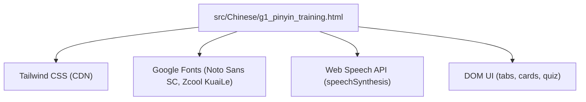
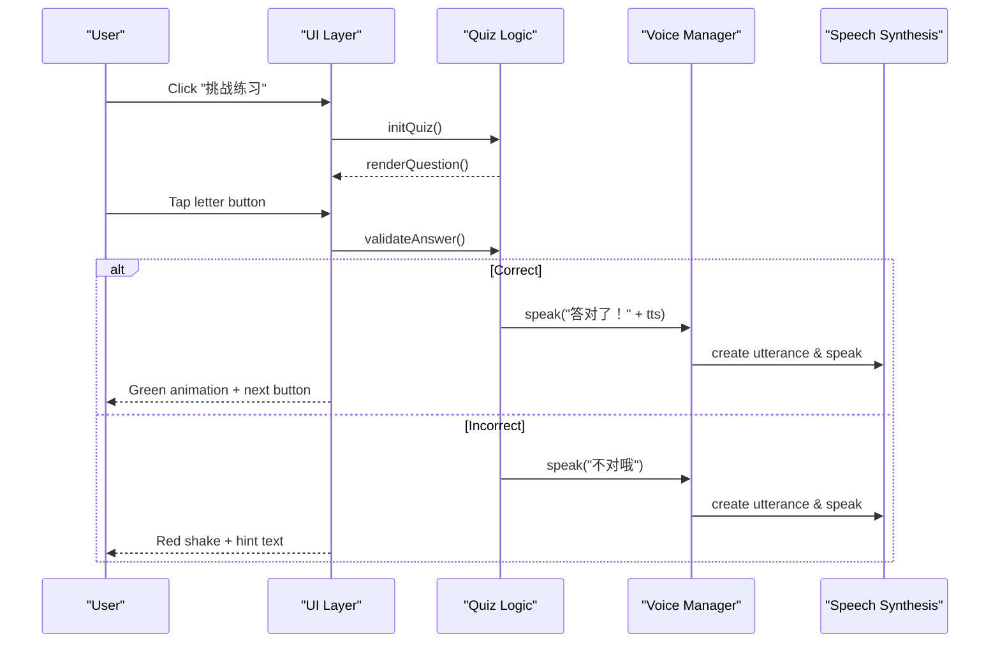
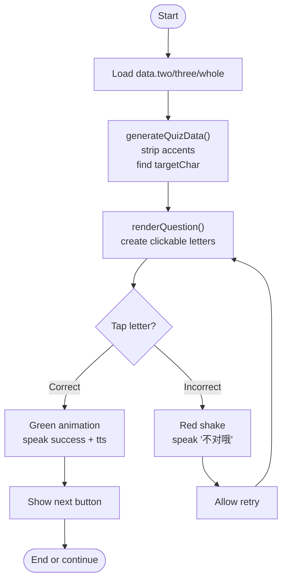
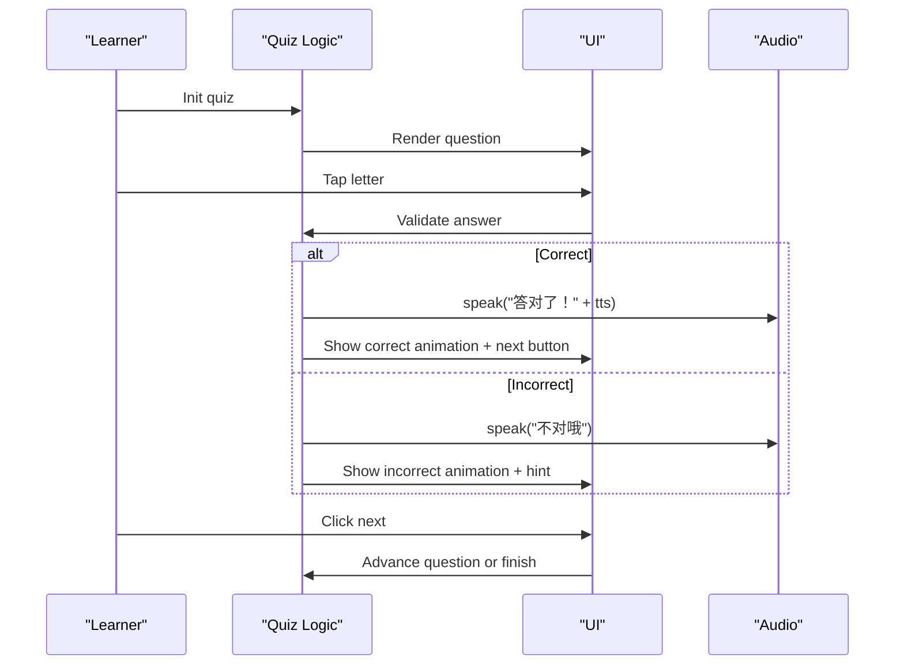
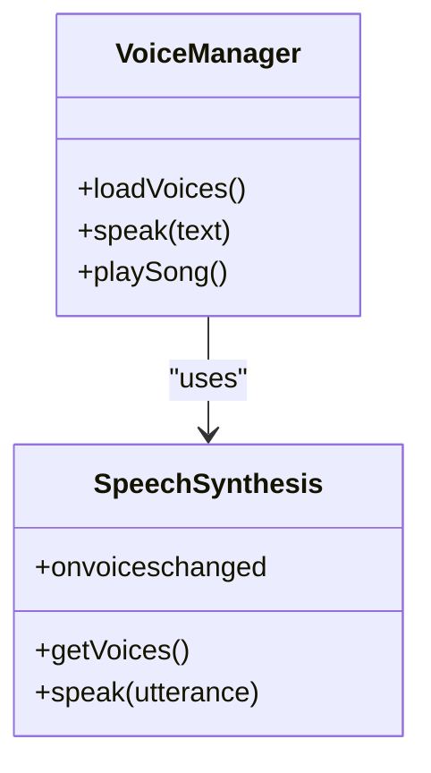
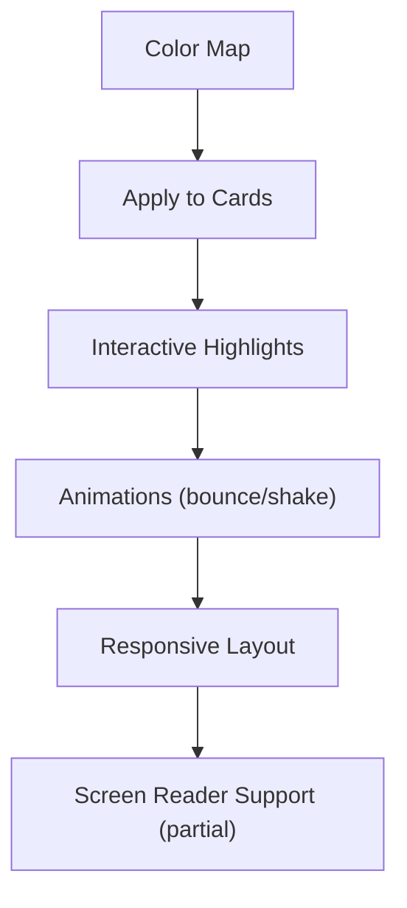
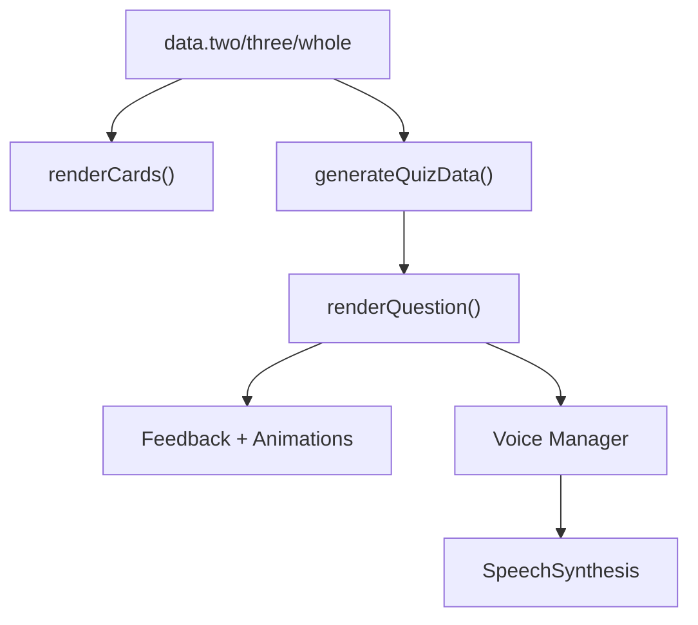

# Pinyin Tone Training System

<cite>
**Referenced Files in This Document**
- [g1_pinyin_training.html](file://src/Chinese/g1_pinyin_training.html)
- [README.md](file://README.md)
</cite>

## Table of Contents
1. [Introduction](#introduction)
2. [Project Structure](#project-structure)
3. [Core Components](#core-components)
4. [Architecture Overview](#architecture-overview)
5. [Detailed Component Analysis](#detailed-component-analysis)
6. [Dependency Analysis](#dependency-analysis)
7. [Performance Considerations](#performance-considerations)
8. [Troubleshooting Guide](#troubleshooting-guide)
9. [Conclusion](#conclusion)
10. [Appendices](#appendices)

## Introduction
The Pinyin Tone Training System is a single-page, child-friendly Mandarin pronunciation learning tool focused on tone placement rules for pinyin syllables. It combines visual tone marking with audio feedback via the Web Speech API to reinforce correct tone positioning across three learning modes:
- Two-spelling syllables (两拼音节)
- Three-spelling syllables (三拼音节)
- Whole recognition syllables (整体认读)

An interactive quiz challenges learners to place tones correctly by tapping the target vowel, providing immediate visual and auditory feedback. The system also includes a voice selector for Chinese voices, animated feedback for correct/incorrect answers, and mobile-responsive design considerations.

## Project Structure
This project organizes standalone HTML5 activities under src/{category}/. The Pinyin Tone Training System is implemented as a single-file application located at src/Chinese/g1_pinyin_training.html. It uses Tailwind CSS via CDN and Google Fonts for typography.

**Diagram sources**
- [g1_pinyin_training.html:1-20](file://src/Chinese/g1_pinyin_training.html#L1-L20)
- [g1_pinyin_training.html:126-170](file://src/Chinese/g1_pinyin_training.html#L126-L170)

**Section sources**
- [README.md:1-65](file://README.md#L1-L65)
- [g1_pinyin_training.html:1-20](file://src/Chinese/g1_pinyin_training.html#L1-L20)

## Core Components
- Learning Modes
  - Two-spelling syllables (两拼音节): Single initial + final combinations.
  - Three-spelling syllables (三拼音节): Initial + medial + final combinations.
  - Whole recognition syllables (整体认读): Syllables pronounced directly without spelling.
- Quiz Mode
  - Presents a Chinese character and unaccented pinyin letters; learner taps the correct vowel to place the tone.
  - Immediate feedback with animations and TTS prompts.
- Audio Feedback
  - Uses Web Speech API to speak hints, examples, and feedback messages.
  - Voice selection dropdown filters available Chinese voices.
- Visual Design
  - Color-coded vowels based on tone placement rules.
  - Animated bounce/shake effects for correct/incorrect responses.
  - Mobile-first responsive layout with large touch targets.

**Section sources**
- [g1_pinyin_training.html:156-170](file://src/Chinese/g1_pinyin_training.html#L156-L170)
- [g1_pinyin_training.html:228-287](file://src/Chinese/g1_pinyin_training.html#L228-L287)
- [g1_pinyin_training.html:381-389](file://src/Chinese/g1_pinyin_training.html#L381-L389)
- [g1_pinyin_training.html:376-379](file://src/Chinese/g1_pinyin_training.html#L376-L379)
- [g1_pinyin_training.html:327-374](file://src/Chinese/g1_pinyin_training.html#L327-L374)

## Architecture Overview
The application is a self-contained HTML page with embedded CSS and JavaScript. It manages state for tabs, quiz questions, and voice selection, and renders dynamic content into the DOM.

**Diagram sources**
- [g1_pinyin_training.html:416-448](file://src/Chinese/g1_pinyin_training.html#L416-L448)
- [g1_pinyin_training.html:450-532](file://src/Chinese/g1_pinyin_training.html#L450-L532)
- [g1_pinyin_training.html:327-374](file://src/Chinese/g1_pinyin_training.html#L327-L374)

## Detailed Component Analysis

### Data Model and Rule-Based Tone Marking
- Data structure:
  - Each entry contains:
    - py: fully accented pinyin
    - char: corresponding Chinese character
    - rule: pedagogical hint describing where the tone should be placed
    - type: color key indicating the target vowel group
    - tts: spoken example sequence used for audio feedback
- Categories:
  - two: two-spelling syllables
  - three: three-spelling syllables
  - whole: whole recognition syllables
- Rule-based logic:
  - The app determines the target vowel from the accented pinyin string and special cases for ui/iu sequences.
  - The “type” field drives color-coding and reinforces the rule visually.

**Diagram sources**
- [g1_pinyin_training.html:289-320](file://src/Chinese/g1_pinyin_training.html#L289-L320)
- [g1_pinyin_training.html:456-514](file://src/Chinese/g1_pinyin_training.html#L456-L514)

**Section sources**
- [g1_pinyin_training.html:228-287](file://src/Chinese/g1_pinyin_training.html#L228-L287)
- [g1_pinyin_training.html:289-320](file://src/Chinese/g1_pinyin_training.html#L289-L320)

### Interactive Quiz System
- Question generation:
  - Combines all categories into one pool, strips tone marks, identifies the target vowel, and shuffles order.
- Interaction flow:
  - Learner taps a letter; if it matches the target vowel (including special handling for ü/u and iu/ui), the answer is marked correct.
  - Correct answers trigger green animation, positive feedback text, and TTS playback.
  - Incorrect answers trigger red shake animation and contextual feedback text.
- Progression:
  - After a correct answer, a “Next” button appears; when all questions are completed, a completion screen is shown with a replay option.

**Diagram sources**
- [g1_pinyin_training.html:450-532](file://src/Chinese/g1_pinyin_training.html#L450-L532)

**Section sources**
- [g1_pinyin_training.html:450-532](file://src/Chinese/g1_pinyin_training.html#L450-L532)

### Audio Feedback and Voice Selection
- Voice loading:
  - Loads available voices from speechSynthesis.getVoices(), filters for Chinese language codes, and populates a dropdown.
- Speaking function:
  - Creates a SpeechSynthesisUtterance with lang set to zh-CN, rate adjusted for clarity, and optional selected voice assignment.
- Song feature:
  - A “听标调歌” button speaks the tone-placement rhyme to reinforce rules.

**Diagram sources**
- [g1_pinyin_training.html:327-374](file://src/Chinese/g1_pinyin_training.html#L327-L374)
- [g1_pinyin_training.html:376-379](file://src/Chinese/g1_pinyin_training.html#L376-L379)

**Section sources**
- [g1_pinyin_training.html:327-374](file://src/Chinese/g1_pinyin_training.html#L327-L374)
- [g1_pinyin_training.html:376-379](file://src/Chinese/g1_pinyin_training.html#L376-L379)

### Visual Design and Accessibility
- Color-coded vowel system:
  - Each target vowel group has a distinct color style applied to cards and highlights during interactions.
- Animations:
  - Correct answers use a bounce animation; incorrect answers use a shake animation.
- Responsive design:
  - Uses Tailwind utility classes for flexible layouts, large touch targets, and mobile-friendly spacing.
- Accessibility considerations:
  - Buttons are native elements with clear labels and focus styles.
  - A return link to the curriculum map includes aria-label for screen readers.
  - Note: The current implementation does not include explicit aria-live regions for dynamic feedback; adding them would improve screen reader compatibility.

**Diagram sources**
- [g1_pinyin_training.html:381-389](file://src/Chinese/g1_pinyin_training.html#L381-L389)
- [g1_pinyin_training.html:57-121](file://src/Chinese/g1_pinyin_training.html#L57-L121)
- [g1_pinyin_training.html:538-543](file://src/Chinese/g1_pinyin_training.html#L538-L543)

**Section sources**
- [g1_pinyin_training.html:381-389](file://src/Chinese/g1_pinyin_training.html#L381-L389)
- [g1_pinyin_training.html:57-121](file://src/Chinese/g1_pinyin_training.html#L57-L121)
- [g1_pinyin_training.html:538-543](file://src/Chinese/g1_pinyin_training.html#L538-L543)

## Dependency Analysis
- External dependencies:
  - Tailwind CSS via CDN for styling.
  - Google Fonts for typography.
- Internal dependencies:
  - DOM manipulation for rendering cards and quiz items.
  - Web Speech API for audio output.
- Coupling:
  - The data model is tightly coupled with the quiz logic and rendering functions.
  - The voice manager is isolated within the same file but can be extended independently.

**Diagram sources**
- [g1_pinyin_training.html:228-287](file://src/Chinese/g1_pinyin_training.html#L228-L287)
- [g1_pinyin_training.html:391-414](file://src/Chinese/g1_pinyin_training.html#L391-L414)
- [g1_pinyin_training.html:450-532](file://src/Chinese/g1_pinyin_training.html#L450-L532)
- [g1_pinyin_training.html:327-374](file://src/Chinese/g1_pinyin_training.html#L327-L374)

**Section sources**
- [g1_pinyin_training.html:228-287](file://src/Chinese/g1_pinyin_training.html#L228-L287)
- [g1_pinyin_training.html:391-414](file://src/Chinese/g1_pinyin_training.html#L391-L414)
- [g1_pinyin_training.html:450-532](file://src/Chinese/g1_pinyin_training.html#L450-L532)
- [g1_pinyin_training.html:327-374](file://src/Chinese/g1_pinyin_training.html#L327-L374)

## Performance Considerations
- Rendering efficiency:
  - Cards and quiz letters are created dynamically; avoid excessive reflows by batching DOM updates.
- Audio performance:
  - Cancel ongoing speech before starting new utterances to prevent queue buildup.
- Memory usage:
  - Keep the dataset small and well-structured; avoid unnecessary object duplication.
- Mobile responsiveness:
  - Use CSS transforms and opacity for animations to leverage GPU acceleration.

[No sources needed since this section provides general guidance]

## Troubleshooting Guide
- Voices not loading:
  - Ensure the browser supports speechSynthesis and that voices are available after the onvoiceschanged event.
- No audio feedback:
  - Verify user gesture requirements on iOS Safari; some browsers require an interaction before playing audio.
- Incorrect tone validation:
  - Confirm that the target vowel detection accounts for ui/iu special cases and ü/u equivalence in certain contexts.
- Screen reader issues:
  - Add aria-live regions around dynamic feedback areas to announce changes to assistive technologies.

**Section sources**
- [g1_pinyin_training.html:327-374](file://src/Chinese/g1_pinyin_training.html#L327-L374)
- [g1_pinyin_training.html:456-514](file://src/Chinese/g1_pinyin_training.html#L456-L514)

## Conclusion
The Pinyin Tone Training System offers a focused, engaging approach to mastering Mandarin tone placement through visual cues, interactive quizzes, and audio reinforcement. Its single-file architecture simplifies deployment and customization while maintaining a child-friendly interface. Extensibility points include adding new vocabulary sets, customizing voice preferences, and expanding the rule-based tone marking logic.

[No sources needed since this section summarizes without analyzing specific files]

## Appendices

### Adding New Vocabulary Sets
- Steps:
  - Extend the data object with new entries under two, three, or whole categories.
  - Ensure each entry includes py, char, rule, type, and tts fields.
  - The quiz generator will automatically incorporate new items.
- Example path reference:
  - [g1_pinyin_training.html:228-287](file://src/Chinese/g1_pinyin_training.html#L228-L287)

**Section sources**
- [g1_pinyin_training.html:228-287](file://src/Chinese/g1_pinyin_training.html#L228-L287)

### Customizing Voice Selection
- Steps:
  - Populate the voice dropdown with available Chinese voices using speechSynthesis.getVoices().
  - Allow users to select a preferred voice; persist selection if desired.
  - Apply the selected voice to SpeechSynthesisUtterance instances.
- Example path reference:
  - [g1_pinyin_training.html:327-374](file://src/Chinese/g1_pinyin_training.html#L327-L374)

**Section sources**
- [g1_pinyin_training.html:327-374](file://src/Chinese/g1_pinyin_training.html#L327-L374)

### Extending the Rule-Based Tone Marking System
- Steps:
  - Update generateQuizData to handle additional vowel groups or special cases.
  - Expand the colors mapping to support new types.
  - Adjust validation logic in renderQuestion to recognize new patterns.
- Example path references:
  - [g1_pinyin_training.html:289-320](file://src/Chinese/g1_pinyin_training.html#L289-L320)
  - [g1_pinyin_training.html:381-389](file://src/Chinese/g1_pinyin_training.html#L381-L389)
  - [g1_pinyin_training.html:456-514](file://src/Chinese/g1_pinyin_training.html#L456-L514)

**Section sources**
- [g1_pinyin_training.html:289-320](file://src/Chinese/g1_pinyin_training.html#L289-L320)
- [g1_pinyin_training.html:381-389](file://src/Chinese/g1_pinyin_training.html#L381-L389)
- [g1_pinyin_training.html:456-514](file://src/Chinese/g1_pinyin_training.html#L456-L514)