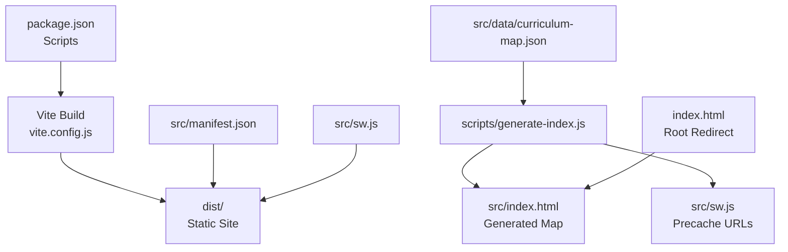
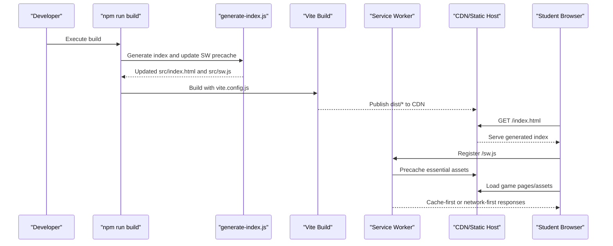
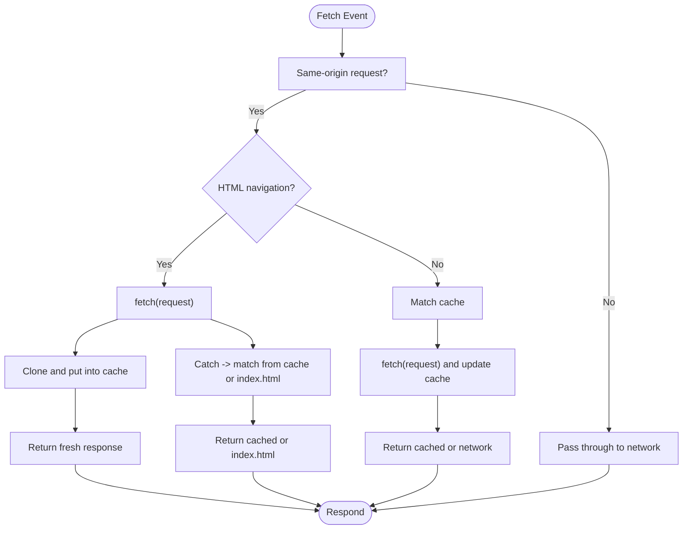
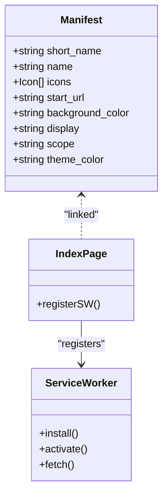
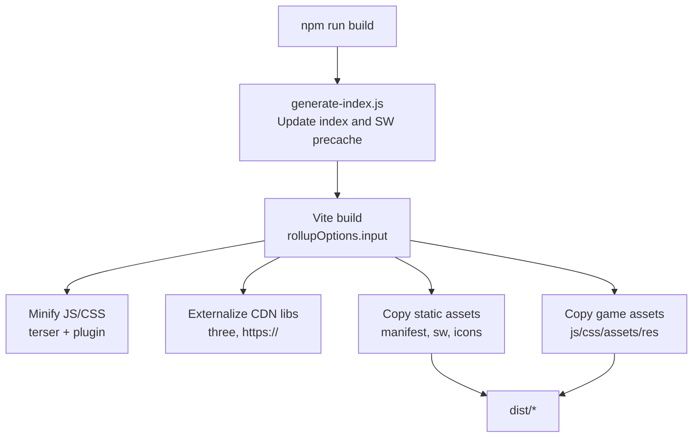
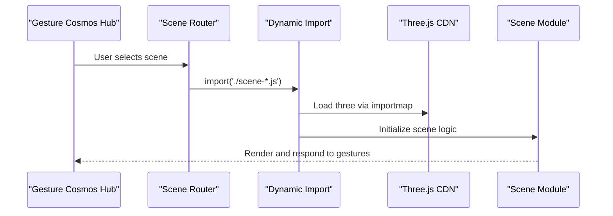
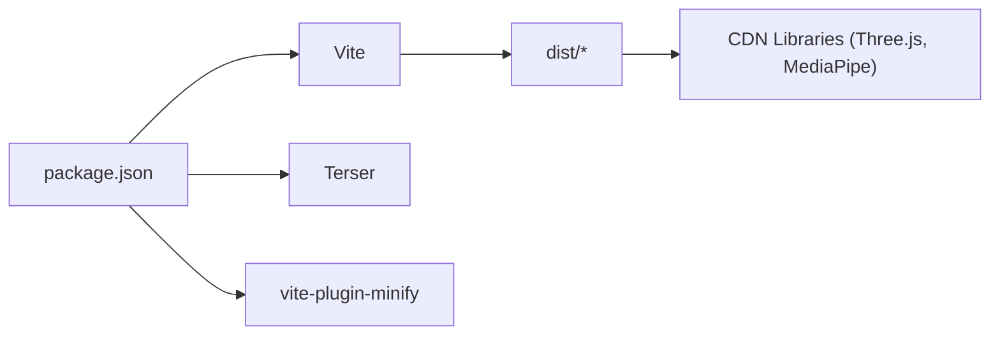
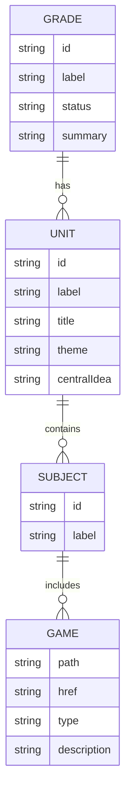

# Deployment & Production Guide

<cite>
**Referenced Files in This Document**
- [package.json](file://package.json)
- [vite.config.js](file://vite.config.js)
- [src/sw.js](file://src/sw.js)
- [src/manifest.json](file://src/manifest.json)
- [scripts/generate-index.js](file://scripts/generate-index.js)
- [scripts/qa-curriculum.js](file://scripts/qa-curriculum.js)
- [src/data/curriculum-map.json](file://src/data/curriculum-map.json)
- [src/index.html](file://src/index.html)
- [index.html](file://index.html)
</cite>

## Table of Contents
1. [Introduction](#introduction)
2. [Project Structure](#project-structure)
3. [Core Components](#core-components)
4. [Architecture Overview](#architecture-overview)
5. [Detailed Component Analysis](#detailed-component-analysis)
6. [Dependency Analysis](#dependency-analysis)
7. [Performance Considerations](#performance-considerations)
8. [Troubleshooting Guide](#troubleshooting-guide)
9. [Conclusion](#conclusion)
10. [Appendices](#appendices)

## Introduction
This guide provides production-ready deployment and maintenance instructions for the IB PYP Games platform. It covers service worker implementation, caching strategies, progressive web app configuration, build optimization, asset compression, bundle splitting, hosting options (static site generators and CDNs), mobile packaging, monitoring and analytics, curriculum content updates, cache versioning, browser compatibility, security considerations, content delivery optimization, scaling strategies, disaster recovery, and backup procedures.

The project is a static HTML5-based educational platform built with Vite. The build pipeline generates a multi-page index from curriculum data, copies static assets, and produces a service worker that enables offline capabilities and efficient caching.

## Project Structure
At a high level:
- Source pages live under src organized by subject categories and standalone UOI games.
- A build script generates the main learning map page and updates the service worker precache list.
- Vite config defines inputs, minification, externalization of large libraries via CDN, and static asset copying.
- A PWA manifest and service worker provide offline support and installability.

**Diagram sources**
- [package.json:6-11](file://package.json#L6-L11)
- [vite.config.js:47-69](file://vite.config.js#L47-L69)
- [scripts/generate-index.js:260-786](file://scripts/generate-index.js#L260-L786)
- [src/sw.js:1-43](file://src/sw.js#L1-L43)
- [src/manifest.json:1-22](file://src/manifest.json#L1-L22)
- [index.html:1-85](file://index.html#L1-L85)

**Section sources**
- [package.json:1-20](file://package.json#L1-L20)
- [vite.config.js:1-175](file://vite.config.js#L1-L175)
- [scripts/generate-index.js:1-800](file://scripts/generate-index.js#L1-L800)
- [src/sw.js:1-130](file://src/sw.js#L1-L130)
- [src/manifest.json:1-22](file://src/manifest.json#L1-L22)
- [src/index.html:1-800](file://src/index.html#L1-L800)
- [index.html:1-85](file://index.html#L1-L85)

## Core Components
- Build system and scripts:
  - npm scripts orchestrate generation, QA, and build steps.
  - Vite config sets up multi-page input, minification, externalization, and static asset copying.
- Curriculum-driven index generator:
  - Reads curriculum map JSON and generates the main index page and service worker precache entries.
- Service worker and PWA:
  - Implements installable PWA behavior with network-first HTML and stale-while-revalidate for assets.
- Static site output:
  - dist folder contains all generated HTML, CSS, JS, and copied assets ready for hosting.

**Section sources**
- [package.json:6-11](file://package.json#L6-L11)
- [vite.config.js:47-69](file://vite.config.js#L47-L69)
- [scripts/generate-index.js:260-786](file://scripts/generate-index.js#L260-L786)
- [src/sw.js:45-122](file://src/sw.js#L45-L122)
- [src/manifest.json:1-22](file://src/manifest.json#L1-L22)

## Architecture Overview
The platform follows a static-site architecture with a curriculum-driven generator and a service worker for offline support.

**Diagram sources**
- [package.json:6-11](file://package.json#L6-L11)
- [scripts/generate-index.js:260-786](file://scripts/generate-index.js#L260-L786)
- [vite.config.js:47-69](file://vite.config.js#L47-L69)
- [src/sw.js:45-122](file://src/sw.js#L45-L122)

## Detailed Component Analysis

### Service Worker Implementation and Caching Strategy
- Cache versioning:
  - A timestamped cache name ensures new deployments invalidate old caches automatically.
- Install phase:
  - Pre-caches essential pages and icons listed in the precache array.
- Activate phase:
  - Deletes older caches and claims clients for immediate use of the new service worker.
- Fetch strategy:
  - HTML navigation requests use network-first with cache fallback.
  - Static assets use stale-while-revalidate: serve cached immediately, update cache in background.

**Diagram sources**
- [src/sw.js:75-122](file://src/sw.js#L75-L122)

**Section sources**
- [src/sw.js:1-43](file://src/sw.js#L1-L43)
- [src/sw.js:45-73](file://src/sw.js#L45-L73)
- [src/sw.js:75-122](file://src/sw.js#L75-L122)

### Progressive Web App Configuration
- Manifest:
  - Defines app name, icons, start URL, display mode, theme color, and scope.
- Registration:
  - The generated index registers the service worker on load if supported.
- Icons:
  - Root-level icons are copied into both root and assets directories during build to satisfy manifest references.

**Diagram sources**
- [src/manifest.json:1-22](file://src/manifest.json#L1-L22)
- [src/index.html:1134-1140](file://src/index.html#L1134-L1140)
- [vite.config.js:70-100](file://vite.config.js#L70-L100)

**Section sources**
- [src/manifest.json:1-22](file://src/manifest.json#L1-L22)
- [src/index.html:1134-1140](file://src/index.html#L1134-L1140)
- [vite.config.js:70-100](file://vite.config.js#L70-L100)

### Build Optimization Process
- Multi-page entry points:
  - All HTML files under src are discovered and compiled as separate outputs.
- Minification:
  - Terser is used for JS minification; additional minify plugin is configured.
- Externalizing large libraries:
  - Three.js and HTTPS imports are marked external to be loaded via CDN importmaps in HTML.
- Asset copying:
  - Static files like manifest, service worker, and icons are copied to dist.
  - Game-specific js/css/assets/res directories are recursively copied to preserve non-module resources.

**Diagram sources**
- [package.json:6-11](file://package.json#L6-L11)
- [vite.config.js:50-69](file://vite.config.js#L50-L69)
- [vite.config.js:70-172](file://vite.config.js#L70-L172)

**Section sources**
- [vite.config.js:47-69](file://vite.config.js#L47-L69)
- [vite.config.js:70-172](file://vite.config.js#L70-L172)

### Bundle Splitting Techniques
- Dynamic scene loading:
  - The gesture cosmos hub uses dynamic imports per scene, enabling lazy loading of heavy 3D scenes.
- Module preloads:
  - Generated code includes modulepreload hints for dependencies required by scenes.
- Externalized libraries:
  - Large third-party libraries are loaded via CDN rather than bundled, reducing bundle size.

**Diagram sources**
- [dist/assets/science_gesture-cosmos-hub-MR-hO_U4.js:1](file://dist/assets/science_gesture-cosmos-hub-MR-hO_U4.js#L1)

**Section sources**
- [vite.config.js:56-61](file://vite.config.js#L56-L61)
- [dist/assets/science_gesture-cosmos-hub-MR-hO_U4.js:1](file://dist/assets/science_gesture-cosmos-hub-MR-hO_U4.js#L1)

### Hosting Options
- Static site generators:
  - The dist directory can be served directly by any static host (Netlify, Vercel, GitHub Pages).
- CDN deployment:
  - Configure CDN caching headers for long-lived assets and ensure service worker and manifest are not aggressively cached beyond versioning.
- Mobile app packaging:
  - Use tools like Capacitor or Cordova to wrap the static site for distribution on app stores. Ensure HTTPS for camera/microphone permissions.

[No sources needed since this section provides general guidance]

### Monitoring and Analytics
- Student engagement:
  - Integrate privacy-friendly analytics (e.g., Plausible, Umami) via script tags in the generated index or individual game pages.
- Performance monitoring:
  - Use RUM solutions (e.g., Sentry, LogRocket) to capture errors and performance metrics.
- Observability:
  - Track service worker installation/update events and fetch failures for diagnostics.

[No sources needed since this section provides general guidance]

### Maintenance Procedures
- Updating curriculum content:
  - Edit src/data/curriculum-map.json to add or reorganize games.
  - Run npm run qa:curriculum to validate coverage and links.
  - Run npm run build to regenerate index and update service worker precache.
- Managing cache versions:
  - The service worker cache name includes a timestamp updated during generation; rebuild to refresh cache.
- Browser compatibility updates:
  - Test across devices and browsers using the provided manual QA checklist. Update polyfills or feature detection as needed.

**Section sources**
- [README.md:30-56](file://README.md#L30-L56)
- [scripts/qa-curriculum.js:100-292](file://scripts/qa-curriculum.js#L100-L292)
- [scripts/generate-index.js:260-786](file://scripts/generate-index.js#L260-L786)
- [src/sw.js:1-43](file://src/sw.js#L1-L43)

### Security Considerations
- Content Security Policy:
  - For games loading external libraries via CDN, consider CSP directives to allow only trusted domains.
- Permissions:
  - Camera and microphone access must be initiated by user gestures; ensure HTTPS for secure contexts.
- Dependency integrity:
  - Prefer SRI hashes for critical CDN resources where possible.

[No sources needed since this section provides general guidance]

### Content Delivery Optimization
- CDN caching:
  - Set immutable cache policies for hashed assets; keep service worker and manifest cacheable but versioned.
- Compression:
  - Enable gzip/brotli at the server/CDN layer for text assets.
- Image optimization:
  - Serve modern formats (WebP/AVIF) and responsive images where applicable.

[No sources needed since this section provides general guidance]

### Scaling Strategies
- Horizontal scaling:
  - Static assets scale trivially with CDN edge nodes.
- Offloading heavy workloads:
  - Keep 3D scenes and AI models on CDN; avoid bundling large libraries.
- Database-free architecture:
  - Curriculum data is static JSON; no backend required unless adding analytics or progress storage.

[No sources needed since this section provides general guidance]

### Disaster Recovery and Backup
- Backups:
  - Regularly back up src/data/curriculum-map.json and any custom assets.
- Rollback:
  - Maintain previous dist snapshots; redeploy last known good version if issues arise.
- Version control:
  - Commit curriculum changes and generated artifacts as part of CI/CD to ensure reproducibility.

[No sources needed since this section provides general guidance]

## Dependency Analysis
Key runtime and build-time dependencies:
- Build-time:
  - Vite, terser, minify plugin, javascript-obfuscator.
- Runtime:
  - Three.js and MediaPipe loaded via CDN importmaps in HTML.
- Externalization:
  - Rollup externalizes three and HTTPS imports to avoid bundling.

**Diagram sources**
- [package.json:13-18](file://package.json#L13-L18)
- [vite.config.js:56-61](file://vite.config.js#L56-L61)

**Section sources**
- [package.json:13-18](file://package.json#L13-L18)
- [vite.config.js:56-61](file://vite.config.js#L56-L61)

## Performance Considerations
- Minification and tree-shaking:
  - Terser and Vite optimize JS/CSS; externalize large libraries to reduce bundle size.
- Lazy loading:
  - Dynamic imports for 3D scenes improve initial load time.
- Caching:
  - Service worker precache and stale-while-revalidate enhance perceived performance and offline resilience.
- Asset sizing:
  - Monitor image/audio sizes; prefer compressed formats and lazy initialization.

[No sources needed since this section provides general guidance]

## Troubleshooting Guide
Common issues and resolutions:
- Service worker not updating:
  - Clear caches or force reload; verify cache version timestamp changes after rebuild.
- Missing assets in dist:
  - Ensure game directories contain js/css/assets/res as expected; rebuild to copy them.
- Curriculum link mismatches:
  - Run npm run qa:curriculum to detect missing or unassigned pages and incorrect hrefs.
- CDN library loading failures:
  - Verify importmap configurations and network availability; consider fallbacks.

**Section sources**
- [src/sw.js:45-73](file://src/sw.js#L45-L73)
- [vite.config.js:70-172](file://vite.config.js#L70-L172)
- [scripts/qa-curriculum.js:100-292](file://scripts/qa-curriculum.js#L100-L292)

## Conclusion
The IB PYP Games platform is designed for reliable, scalable deployment as a static site with robust offline capabilities. The curriculum-driven build process ensures consistency, while the service worker provides resilient caching. By following the deployment, maintenance, and monitoring recommendations outlined here, institutions can deliver an engaging, accessible, and performant learning experience to students across devices and networks.

[No sources needed since this section summarizes without analyzing specific files]

## Appendices

### Build Commands and Workflow
- Development:
  - npm run dev
- Quality assurance:
  - npm run qa:curriculum
  - npm run qa:urls
- Build and preview:
  - npm run build
  - npm run preview

**Section sources**
- [package.json:6-11](file://package.json#L6-L11)
- [README.md:30-39](file://README.md#L30-L39)

### Curriculum Data Model
The curriculum map drives the generated index and service worker precache. It organizes grades, units, subjects, and games with optional href overrides.

**Diagram sources**
- [src/data/curriculum-map.json:1-551](file://src/data/curriculum-map.json#L1-L551)

**Section sources**
- [src/data/curriculum-map.json:1-551](file://src/data/curriculum-map.json#L1-L551)