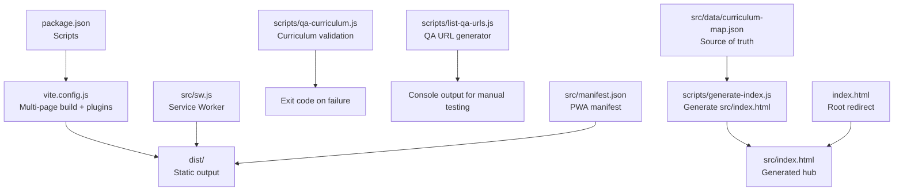
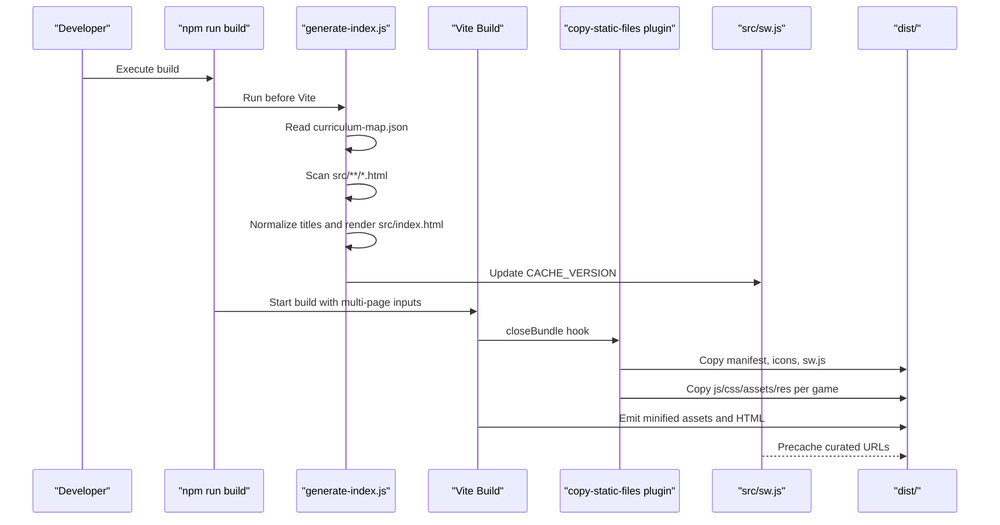
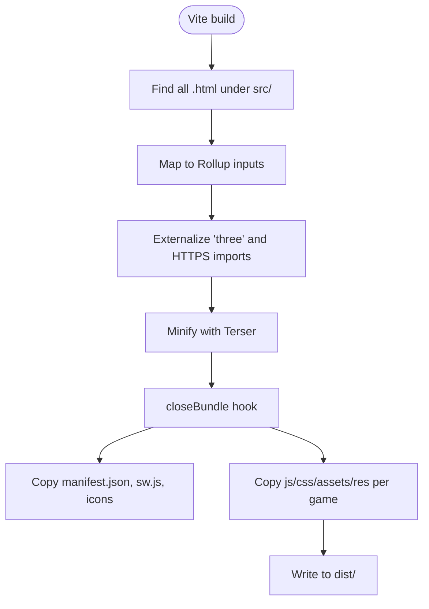
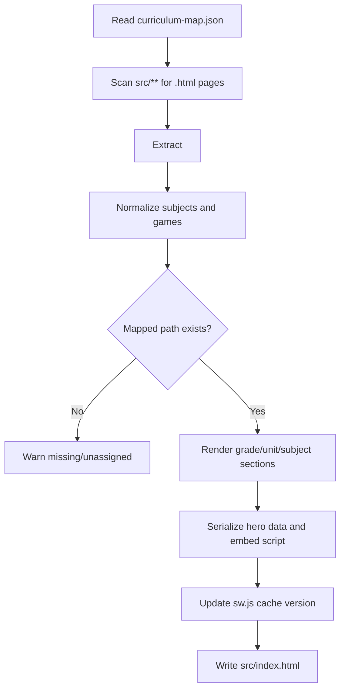
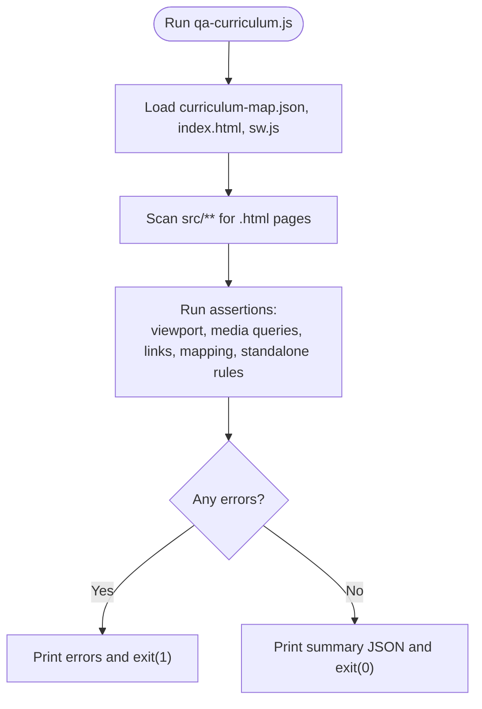
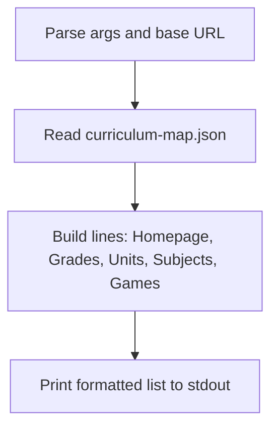
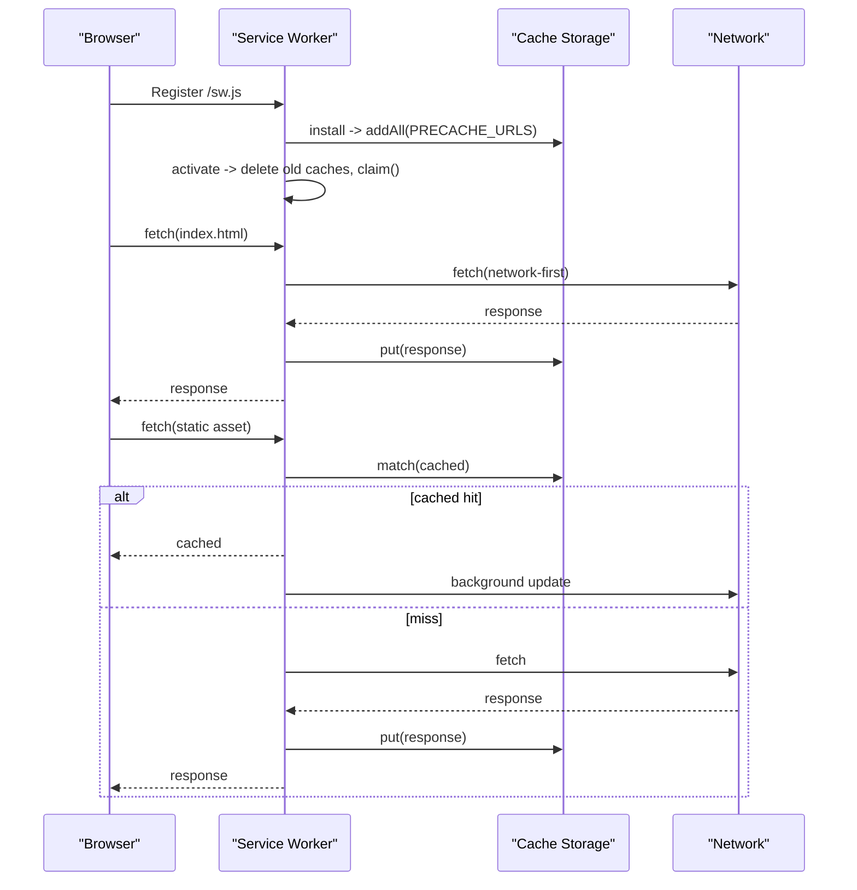
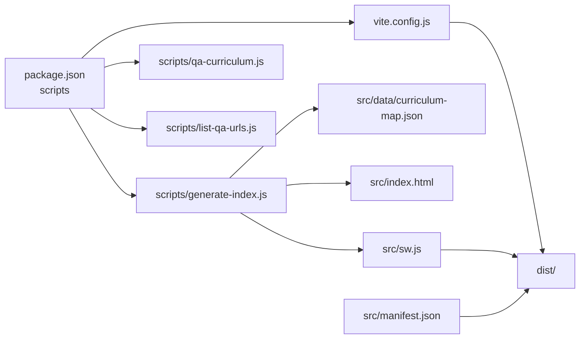

# Development Workflow & Tooling

<cite>
**Referenced Files in This Document**
- [package.json](file://package.json)
- [vite.config.js](file://vite.config.js)
- [README.md](file://README.md)
- [AGENTS.md](file://AGENTS.md)
- [scripts/generate-index.js](file://scripts/generate-index.js)
- [scripts/qa-curriculum.js](file://scripts/qa-curriculum.js)
- [scripts/list-qa-urls.js](file://scripts/list-qa-urls.js)
- [src/data/curriculum-map.json](file://src/data/curriculum-map.json)
- [src/sw.js](file://src/sw.js)
- [src/manifest.json](file://src/manifest.json)
- [index.html](file://index.html)
- [docs/manual-visual-qa.md](file://docs/manual-visual-qa.md)
</cite>

## Table of Contents
1. [Introduction](#introduction)
2. [Project Structure](#project-structure)
3. [Core Components](#core-components)
4. [Architecture Overview](#architecture-overview)
5. [Detailed Component Analysis](#detailed-component-analysis)
6. [Dependency Analysis](#dependency-analysis)
7. [Performance Considerations](#performance-considerations)
8. [Troubleshooting Guide](#troubleshooting-guide)
9. [Conclusion](#conclusion)
10. [Appendices](#appendices)

## Introduction
This document explains the development workflow and tooling ecosystem for the IB PYP Games project. It covers:
- Vite-based multi-page static site generation
- Asset processing pipeline and custom plugin architecture
- Automated curriculum validation, URL listing, and responsive checks
- Manual visual QA procedures for cross-device compatibility and accessibility
- Contribution guidelines for adding games and updating curriculum maps
- Debugging strategies, performance profiling techniques, and troubleshooting
- Version control workflows, code review processes, and deployment considerations

The project is a collection of standalone HTML5 educational games organized by Grade → Unit of Inquiry → Subject lane → Game, with an auto-generated homepage and PWA support.

## Project Structure
At a high level:
- Source content lives under src/, including game pages, data, and PWA assets.
- Build configuration is defined in vite.config.js.
- Scripts generate the index page, validate curriculum, and list QA URLs.
- The root index.html redirects to the generated learning map.
- A service worker provides offline caching and cache invalidation via versioned caches.

**Diagram sources**
- [package.json:6-12](file://package.json#L6-L12)
- [vite.config.js:47-69](file://vite.config.js#L47-L69)
- [scripts/generate-index.js:1-20](file://scripts/generate-index.js#L1-L20)
- [scripts/qa-curriculum.js:100-110](file://scripts/qa-curriculum.js#L100-L110)
- [scripts/list-qa-urls.js:43-53](file://scripts/list-qa-urls.js#L43-L53)
- [src/data/curriculum-map.json:1-10](file://src/data/curriculum-map.json#L1-L10)
- [src/sw.js:1-10](file://src/sw.js#L1-L10)
- [src/manifest.json:1-10](file://src/manifest.json#L1-L10)
- [index.html:1-10](file://index.html#L1-L10)

**Section sources**
- [README.md:8-28](file://README.md#L8-L28)
- [AGENTS.md:51-84](file://AGENTS.md#L51-L84)

## Core Components
- Build system (Vite): Multi-page entry points discovered from src/, externalized CDN libraries, minification, and a custom plugin to copy static assets and non-module directories into dist/.
- Index generator: Reads curriculum-map.json, scans game pages, normalizes titles, renders the interactive grade/unit/subject hub, and updates the service worker cache version.
- Curriculum QA: Validates structure, coverage, links, viewport tags, return links, and standalone UOI game rules; fails fast on issues.
- QA URL generator: Prints all curriculum-driven URLs for manual browser testing against dev or preview deployments.
- Service Worker: Pre-caches essential URLs, uses network-first for HTML and stale-while-revalidate for assets, and cleans old caches on activation.
- PWA Manifest: Defines app metadata, icons, start URL, display mode, and theme color.

**Section sources**
- [vite.config.js:47-69](file://vite.config.js#L47-L69)
- [vite.config.js:70-173](file://vite.config.js#L70-L173)
- [scripts/generate-index.js:109-149](file://scripts/generate-index.js#L109-L149)
- [scripts/qa-curriculum.js:100-110](file://scripts/qa-curriculum.js#L100-L110)
- [scripts/list-qa-urls.js:43-53](file://scripts/list-qa-urls.js#L43-L53)
- [src/sw.js:45-73](file://src/sw.js#L45-L73)
- [src/manifest.json:1-22](file://src/manifest.json#L1-L22)

## Architecture Overview
The build and runtime flow integrates scripts, Vite, and the service worker to produce a PWA-ready static site.

**Diagram sources**
- [package.json:6-12](file://package.json#L6-L12)
- [scripts/generate-index.js:1-20](file://scripts/generate-index.js#L1-L20)
- [scripts/generate-index.js:260-300](file://scripts/generate-index.js#L260-L300)
- [scripts/generate-index.js:788-800](file://scripts/generate-index.js#L788-L800)
- [vite.config.js:47-69](file://vite.config.js#L47-L69)
- [vite.config.js:70-173](file://vite.config.js#L70-L173)
- [src/sw.js:1-10](file://src/sw.js#L1-L10)

## Detailed Component Analysis

### Vite Configuration and Custom Plugin
- Multi-page input discovery: Recursively finds .html files under src/ and maps them to Rollup inputs.
- Externalization: Marks three and https imports as external so they load via importmap in HTML.
- Minification: Uses terser with mangle enabled and console statements preserved.
- Custom plugin: Copies PWA assets and game-specific directories (js, css, assets, res, plus any other asset-heavy folders) into dist after bundle close.

**Diagram sources**
- [vite.config.js:7-19](file://vite.config.js#L7-L19)
- [vite.config.js:37-45](file://vite.config.js#L37-L45)
- [vite.config.js:50-69](file://vite.config.js#L50-L69)
- [vite.config.js:70-173](file://vite.config.js#L70-L173)

**Section sources**
- [vite.config.js:47-69](file://vite.config.js#L47-L69)
- [vite.config.js:70-173](file://vite.config.js#L70-L173)

### Index Generator (src/index.html)
Responsibilities:
- Read curriculum-map.json and scan game pages to discover available titles.
- Normalize curriculum entries with subject metadata and game titles.
- Render an interactive Grade/Unit/Subject hub with tabs and hero content.
- Validate that mapped paths exist and unassigned pages are reported.
- Update the service worker cache version string during build.

**Diagram sources**
- [scripts/generate-index.js:30-43](file://scripts/generate-index.js#L30-L43)
- [scripts/generate-index.js:109-149](file://scripts/generate-index.js#L109-L149)
- [scripts/generate-index.js:260-300](file://scripts/generate-index.js#L260-L300)
- [scripts/generate-index.js:788-800](file://scripts/generate-index.js#L788-L800)

**Section sources**
- [scripts/generate-index.js:109-149](file://scripts/generate-index.js#L109-L149)
- [scripts/generate-index.js:260-300](file://scripts/generate-index.js#L260-L300)
- [scripts/generate-index.js:788-800](file://scripts/generate-index.js#L788-L800)

### Curriculum QA Script
Checks performed:
- Generated index includes viewport meta and responsive media queries.
- Root index redirects to the generated map and includes a manual link.
- Grade counts and planned themes are correct.
- All mapped game paths exist and appear in the generated index and service worker precache.
- Every HTML game has a viewport tag and a valid return link to the PYP map.
- New UOI games must be standalone with embedded CSS/JS, touch-friendly sizing, and tablet media queries.

**Diagram sources**
- [scripts/qa-curriculum.js:100-110](file://scripts/qa-curriculum.js#L100-L110)
- [scripts/qa-curriculum.js:111-144](file://scripts/qa-curriculum.js#L111-L144)
- [scripts/qa-curriculum.js:145-173](file://scripts/qa-curriculum.js#L145-L173)
- [scripts/qa-curriculum.js:192-223](file://scripts/qa-curriculum.js#L192-L223)
- [scripts/qa-curriculum.js:231-274](file://scripts/qa-curriculum.js#L231-L274)
- [scripts/qa-curriculum.js:276-291](file://scripts/qa-curriculum.js#L276-L291)

**Section sources**
- [scripts/qa-curriculum.js:100-110](file://scripts/qa-curriculum.js#L100-L110)
- [scripts/qa-curriculum.js:111-144](file://scripts/qa-curriculum.js#L111-L144)
- [scripts/qa-curriculum.js:192-223](file://scripts/qa-curriculum.js#L192-L223)
- [scripts/qa-curriculum.js:231-274](file://scripts/qa-curriculum.js#L231-L274)

### QA URL Generator
Purpose:
- Print all curriculum-driven URLs for manual browser QA.
- Accept a base URL argument to target dev server or deployed previews.

**Diagram sources**
- [scripts/list-qa-urls.js:43-53](file://scripts/list-qa-urls.js#L43-L53)
- [scripts/list-qa-urls.js:53-84](file://scripts/list-qa-urls.js#L53-L84)

**Section sources**
- [scripts/list-qa-urls.js:43-53](file://scripts/list-qa-urls.js#L43-L53)
- [scripts/list-qa-urls.js:53-84](file://scripts/list-qa-urls.js#L53-L84)

### Service Worker and PWA Assets
Key behaviors:
- Cache version updated by the index generator to invalidate caches on builds.
- Install: pre-cache essential URLs listed in the generated array.
- Activate: delete old caches and claim clients.
- Fetch: network-first for HTML, stale-while-revalidate for static assets.
- PWA manifest defines app identity and icons.

**Diagram sources**
- [src/sw.js:1-10](file://src/sw.js#L1-L10)
- [src/sw.js:45-73](file://src/sw.js#L45-L73)
- [src/sw.js:75-122](file://src/sw.js#L75-L122)
- [src/manifest.json:1-22](file://src/manifest.json#L1-L22)

**Section sources**
- [src/sw.js:45-73](file://src/sw.js#L45-L73)
- [src/sw.js:75-122](file://src/sw.js#L75-L122)
- [src/manifest.json:1-22](file://src/manifest.json#L1-L22)

### Root Redirect Page
The repository root contains a lightweight redirect page that forwards users to the generated learning map at src/index.html.

**Section sources**
- [index.html:1-10](file://index.html#L1-L10)
- [index.html:76-84](file://index.html#L76-L84)

## Dependency Analysis
High-level dependencies among core components:

**Diagram sources**
- [package.json:6-12](file://package.json#L6-L12)
- [vite.config.js:47-69](file://vite.config.js#L47-L69)
- [scripts/generate-index.js:1-20](file://scripts/generate-index.js#L1-L20)
- [scripts/qa-curriculum.js:100-110](file://scripts/qa-curriculum.js#L100-L110)
- [scripts/list-qa-urls.js:43-53](file://scripts/list-qa-urls.js#L43-L53)
- [src/data/curriculum-map.json:1-10](file://src/data/curriculum-map.json#L1-L10)
- [src/sw.js:1-10](file://src/sw.js#L1-L10)
- [src/manifest.json:1-10](file://src/manifest.json#L1-L10)

**Section sources**
- [package.json:6-12](file://package.json#L6-L12)
- [vite.config.js:47-69](file://vite.config.js#L47-L69)
- [scripts/generate-index.js:1-20](file://scripts/generate-index.js#L1-L20)
- [scripts/qa-curriculum.js:100-110](file://scripts/qa-curriculum.js#L100-L110)
- [scripts/list-qa-urls.js:43-53](file://scripts/list-qa-urls.js#L43-L53)
- [src/data/curriculum-map.json:1-10](file://src/data/curriculum-map.json#L1-L10)
- [src/sw.js:1-10](file://src/sw.js#L1-L10)
- [src/manifest.json:1-10](file://src/manifest.json#L1-L10)

## Performance Considerations
- Minification: Production builds use terser with mangling enabled; keep console logs where helpful for debugging but consider dropping them if needed.
- Asset copying: The custom plugin copies entire directories; ensure only necessary assets are included to reduce bundle size.
- CDN externalization: Large libraries like Three.js are externalized and loaded via importmap, reducing bundle size and leveraging browser caching.
- Service Worker strategy: Network-first for HTML ensures fresh content; stale-while-revalidate for assets improves perceived performance while keeping caches up-to-date.
- Touch targets and responsiveness: Maintain large touch targets and responsive breakpoints to ensure smooth interaction on tablets and phones.

[No sources needed since this section provides general guidance]

## Troubleshooting Guide
Common issues and resolutions:
- Missing game links in generated index: Ensure the game path in curriculum-map.json matches the actual file path under src/. Re-run npm run build to regenerate src/index.html.
- Service worker not updating: Verify the cache version string is updated by the index generator; clear caches manually if needed.
- Camera/microphone permissions: These must be triggered by user gestures; do not auto-start on load.
- iOS audio unlock: Audio must be unlocked on user interaction; test on Safari mobile.
- Vite root paths: Remember root is set to src/; all relative paths should be relative to src/.
- Import external libraries: Use importmap in HTML and mark external in Vite config to avoid bundling CDN libraries.

**Section sources**
- [AGENTS.md:352-359](file://AGENTS.md#L352-L359)
- [AGENTS.md:316-324](file://AGENTS.md#L316-L324)
- [src/sw.js:45-73](file://src/sw.js#L45-L73)
- [vite.config.js:50-69](file://vite.config.js#L50-L69)

## Conclusion
The IB PYP Games project leverages a streamlined Vite-based build with a custom plugin for asset handling, a curriculum-driven index generator, robust automated QA, and PWA capabilities. Following the contribution guidelines and QA checklists ensures consistent quality across devices and browsers while maintaining educational content integrity.

[No sources needed since this section summarizes without analyzing specific files]

## Appendices

### Commands and Workflows
- Install dependencies: npm install
- Start dev server: npm run dev
- Run curriculum QA: npm run qa:curriculum
- List QA URLs: npm run qa:urls [-- base-url]
- Build production: npm run build
- Preview production: npm run preview

**Section sources**
- [README.md:30-39](file://README.md#L30-L39)
- [AGENTS.md:11-28](file://AGENTS.md#L11-L28)

### Adding a New Game
Steps:
1. Create src/{category}/your-game.html or a subdirectory with index.html.
2. For new UOI activities, prefer standalone HTML with embedded CSS/JS under src/uoi/.
3. Add title and a PYP Map return link.
4. Update src/data/curriculum-map.json with the correct grade/unit/subject and path/href.
5. Run npm run qa:curriculum.
6. Run npm run build to regenerate src/index.html and update sw.js cache version.
7. Test on localhost:5173 and iPad landscape.

**Section sources**
- [AGENTS.md:338-348](file://AGENTS.md#L338-L348)
- [README.md:50-57](file://README.md#L50-L57)

### Manual Visual QA Checklist
- Viewports: Desktop 1440x900, iPad landscape 1024x768, small tablet/phone 390x844.
- Homepage flow: Confirm Grade 1 units and subject lanes; planned grades show six PYP themes.
- New UOI games: Playable with touch/click, comfortable touch sizes, feedback present, returns to PYP map, works on desktop and iPad landscape.
- Unit-specific reused games: Verify query-string modes work as expected.
- Existing game sweep: Spot-check one game per category for navigation, return link, iPad usability, and permission behavior.

**Section sources**
- [docs/manual-visual-qa.md:31-124](file://docs/manual-visual-qa.md#L31-L124)

### Version Control and Code Review
- Do not commit dist/ artifacts.
- src/index.html is auto-generated; edits will be overwritten.
- Use curriculum-map.json to change homepage organization.
- Create feature branches for new games.
- Test on iPad/Safari before merging.

**Section sources**
- [AGENTS.md:327-335](file://AGENTS.md#L327-L335)