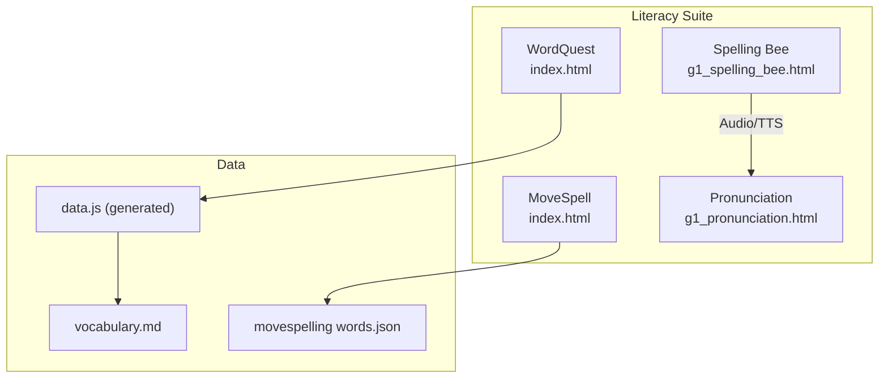
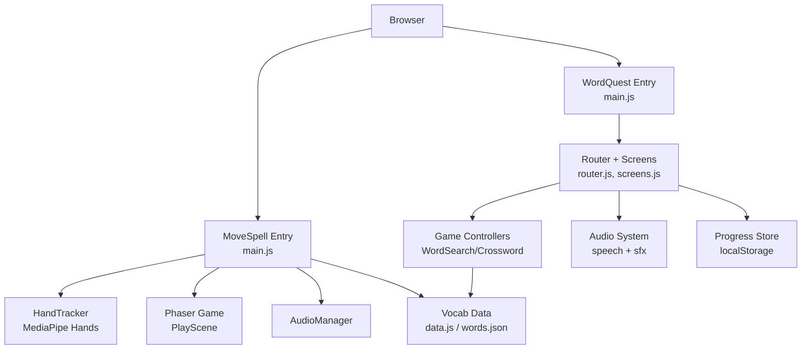
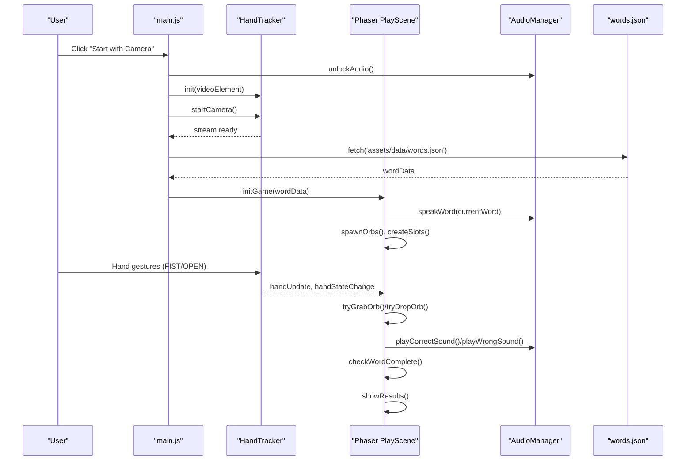
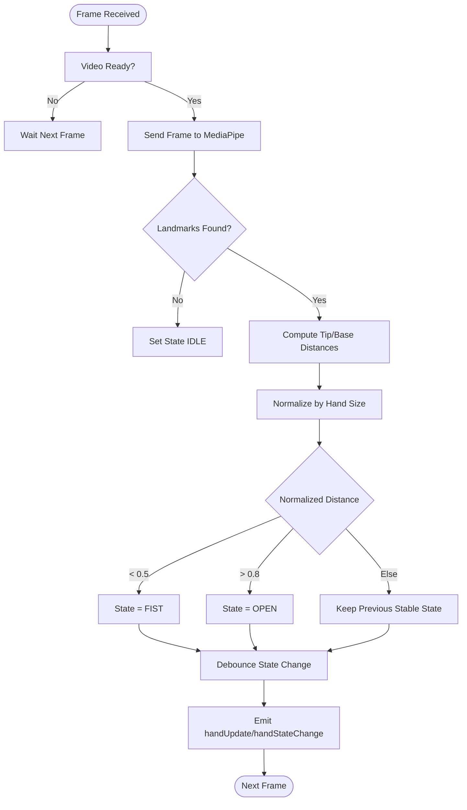
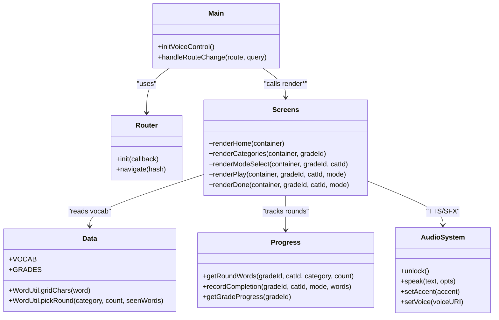
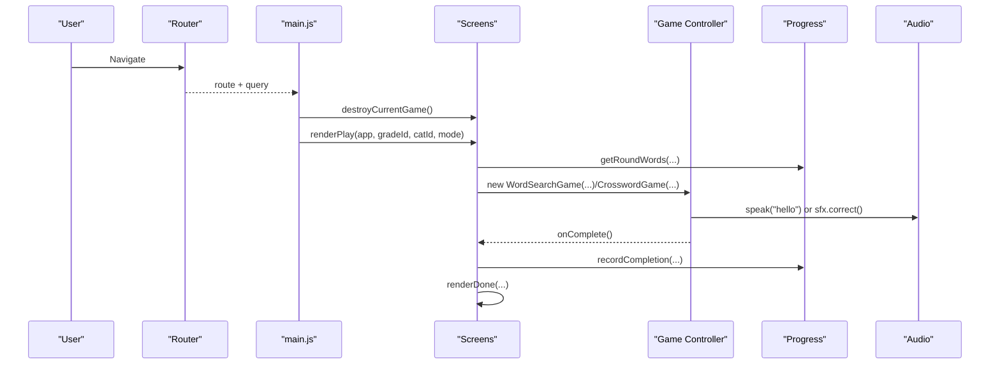
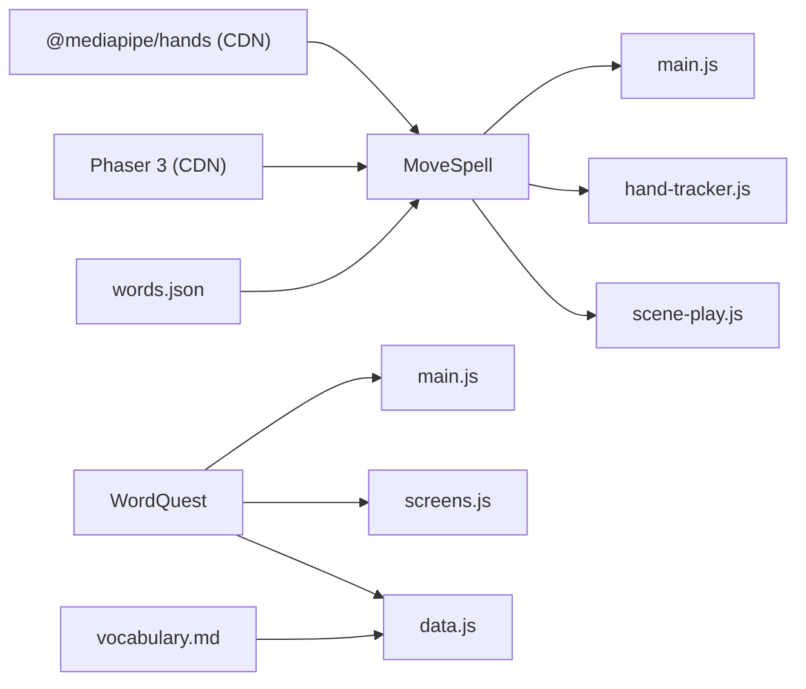

# Literacy Games Suite

<cite>
**Referenced Files in This Document**
- [README.md](file://README.md)
- [package.json](file://package.json)
- [src/literacy/movespelling/index.html](file://src/literacy/movespelling/index.html)
- [src/literacy/movespelling/js/main.js](file://src/literacy/movespelling/js/main.js)
- [src/literacy/movespelling/js/core/hand-tracker.js](file://src/literacy/movespelling/js/core/hand-tracker.js)
- [src/literacy/movespelling/js/game/scene-play.js](file://src/literacy/movespelling/js/game/scene-play.js)
- [src/literacy/movespelling/assets/data/words.json](file://src/literacy/movespelling/assets/data/words.json)
- [src/literacy/wordquest/index.html](file://src/literacy/wordquest/index.html)
- [src/literacy/wordquest/ARCHITECTURE.md](file://src/literacy/wordquest/ARCHITECTURE.md)
- [src/literacy/wordquest/js/main.js](file://src/literacy/wordquest/js/main.js)
- [src/literacy/wordquest/js/screens.js](file://src/literacy/wordquest/js/screens.js)
- [src/literacy/wordquest/js/data.js](file://src/literacy/wordquest/js/data.js)
- [src/data/vocabulary.md](file://src/data/vocabulary.md)
- [src/literacy/g1_spelling_bee.html](file://src/literacy/g1_spelling_bee.html)
- [src/literacy/g1_pronunciation.html](file://src/literacy/g1_pronunciation.html)
</cite>

## Table of Contents
1. [Introduction](#introduction)
2. [Project Structure](#project-structure)
3. [Core Components](#core-components)
4. [Architecture Overview](#architecture-overview)
5. [Detailed Component Analysis](#detailed-component-analysis)
6. [Dependency Analysis](#dependency-analysis)
7. [Performance Considerations](#performance-considerations)
8. [Troubleshooting Guide](#troubleshooting-guide)
9. [Conclusion](#conclusion)
10. [Appendices](#appendices)

## Introduction
The Literacy Games Suite is a collection of interactive, child-friendly applications designed to support IB PYP literacy objectives through engaging spelling, vocabulary, and pronunciation activities. The suite includes:
- MoveSpell: A gesture-controlled spelling game using MediaPipe hand tracking for zero-touch interaction.
- WordQuest: A vocabulary suite with word search and crossword modes, featuring voice control, progress tracking, and responsive design.
- Traditional Spelling Bee: A timed typing-based spelling challenge with hints and audio prompts.
- Pronunciation Tool: Browser-based text-to-speech practice with accent selection and rate control.

These tools emphasize accessibility, cross-platform compatibility (desktop, iPad, mobile), and classroom usability.

## Project Structure
The project organizes games by subject area under src/literacy/. Each game is self-contained with its own HTML entry point, styles, and scripts. Data sources include Markdown vocabulary lists converted into JavaScript modules and JSON datasets.

**Diagram sources**
- [src/literacy/movespelling/index.html:1-118](file://src/literacy/movespelling/index.html#L1-L118)
- [src/literacy/wordquest/index.html:1-21](file://src/literacy/wordquest/index.html#L1-L21)
- [src/literacy/g1_spelling_bee.html:1-800](file://src/literacy/g1_spelling_bee.html#L1-L800)
- [src/literacy/g1_pronunciation.html:1-385](file://src/literacy/g1_pronunciation.html#L1-L385)
- [src/data/vocabulary.md:1-466](file://src/data/vocabulary.md#L1-L466)
- [src/literacy/wordquest/js/data.js:1-117](file://src/literacy/wordquest/js/data.js#L1-L117)
- [src/literacy/movespelling/assets/data/words.json:1-800](file://src/literacy/movespelling/assets/data/words.json#L1-L800)

**Section sources**
- [README.md:1-65](file://README.md#L1-L65)
- [package.json:1-20](file://package.json#L1-L20)

## Core Components
- MoveSpell: Gesture-driven spelling via MediaPipe hands; Phaser 3 scenes manage gameplay; camera background with privacy-first local processing.
- WordQuest: SPA with hash routing, screen rendering, two game controllers (word search and crossword), TTS/sfx audio system, and localStorage progress persistence.
- Spelling Bee: Single-page game with on-screen keyboard, timer, scoring, hints, and audio feedback.
- Pronunciation Tool: Web Speech API integration for US/UK accents, selectable voices, and adjustable speech rate.

Key implementation highlights:
- Gesture recognition thresholds and debouncing for stable hand state detection.
- Responsive UI targeting large touch targets and landscape layouts.
- Voice control switcher and accent preferences persisted locally.
- Curriculum-aligned vocabulary sets across KG–G3.

**Section sources**
- [src/literacy/movespelling/js/main.js:1-197](file://src/literacy/movespelling/js/main.js#L1-L197)
- [src/literacy/movespelling/js/core/hand-tracker.js:1-504](file://src/literacy/movespelling/js/core/hand-tracker.js#L1-L504)
- [src/literacy/movespelling/js/game/scene-play.js:1-420](file://src/literacy/movespelling/js/game/scene-play.js#L1-L420)
- [src/literacy/wordquest/ARCHITECTURE.md:1-225](file://src/literacy/wordquest/ARCHITECTURE.md#L1-L225)
- [src/literacy/wordquest/js/main.js:1-97](file://src/literacy/wordquest/js/main.js#L1-L97)
- [src/literacy/wordquest/js/screens.js:1-476](file://src/literacy/wordquest/js/screens.js#L1-L476)
- [src/literacy/wordquest/js/data.js:1-117](file://src/literacy/wordquest/js/data.js#L1-L117)
- [src/literacy/g1_spelling_bee.html:1-800](file://src/literacy/g1_spelling_bee.html#L1-L800)
- [src/literacy/g1_pronunciation.html:1-385](file://src/literacy/g1_pronunciation.html#L1-L385)

## Architecture Overview
High-level architecture shows how each game initializes, loads data, and manages user interactions.

**Diagram sources**
- [src/literacy/movespelling/js/main.js:1-197](file://src/literacy/movespelling/js/main.js#L1-L197)
- [src/literacy/movespelling/js/core/hand-tracker.js:1-504](file://src/literacy/movespelling/js/core/hand-tracker.js#L1-L504)
- [src/literacy/movespelling/js/game/scene-play.js:1-420](file://src/literacy/movespelling/js/game/scene-play.js#L1-L420)
- [src/literacy/wordquest/js/main.js:1-97](file://src/literacy/wordquest/js/main.js#L1-L97)
- [src/literacy/wordquest/js/screens.js:1-476](file://src/literacy/wordquest/js/screens.js#L1-L476)
- [src/literacy/wordquest/js/data.js:1-117](file://src/literacy/wordquest/js/data.js#L1-L117)
- [src/literacy/movespelling/assets/data/words.json:1-800](file://src/literacy/movespelling/assets/data/words.json#L1-L800)

## Detailed Component Analysis

### MoveSpell: Gesture-Controlled Spelling Game
MoveSpell integrates MediaPipe Hands for real-time hand tracking and uses Phaser 3 for rendering and interaction. The flow begins with a permission overlay, unlocks audio on user gesture, starts the camera, loads vocabulary, and transitions into gameplay.

**Diagram sources**
- [src/literacy/movespelling/js/main.js:1-197](file://src/literacy/movespelling/js/main.js#L1-L197)
- [src/literacy/movespelling/js/core/hand-tracker.js:1-504](file://src/literacy/movespelling/js/core/hand-tracker.js#L1-L504)
- [src/literacy/movespelling/js/game/scene-play.js:1-420](file://src/literacy/movespelling/js/game/scene-play.js#L1-L420)
- [src/literacy/movespelling/assets/data/words.json:1-800](file://src/literacy/movespelling/assets/data/words.json#L1-L800)

Implementation details:
- Hand state detection uses normalized fingertip-to-base distances with debounce to avoid flickering states.
- Frame-rate limiting reduces MediaPipe load and prevents request stacking.
- Smoothed position updates improve cursor stability.
- Grab-and-drop logic ties FIST/OPEN transitions to orb picking and slot dropping.

Accessibility and UX:
- Large, high-contrast orbs and slots.
- Clear instructions and repeat button for audio prompts.
- Privacy-first: video runs locally; no uploads.

**Section sources**
- [src/literacy/movespelling/index.html:1-118](file://src/literacy/movespelling/index.html#L1-L118)
- [src/literacy/movespelling/js/main.js:1-197](file://src/literacy/movespelling/js/main.js#L1-L197)
- [src/literacy/movespelling/js/core/hand-tracker.js:1-504](file://src/literacy/movespelling/js/core/hand-tracker.js#L1-L504)
- [src/literacy/movespelling/js/game/scene-play.js:1-420](file://src/literacy/movespelling/js/game/scene-play.js#L1-L420)
- [src/literacy/movespelling/assets/data/words.json:1-800](file://src/literacy/movespelling/assets/data/words.json#L1-L800)

#### Gesture Recognition Flow

**Diagram sources**
- [src/literacy/movespelling/js/core/hand-tracker.js:1-504](file://src/literacy/movespelling/js/core/hand-tracker.js#L1-L504)

### WordQuest: Vocabulary Games (Word Search & Crossword)
WordQuest is a modular SPA with hash routing, screen rendering, and game orchestration. It supports progressive rounds, persistent progress, and voice control.

**Diagram sources**
- [src/literacy/wordquest/js/main.js:1-97](file://src/literacy/wordquest/js/main.js#L1-L97)
- [src/literacy/wordquest/js/screens.js:1-476](file://src/literacy/wordquest/js/screens.js#L1-L476)
- [src/literacy/wordquest/js/data.js:1-117](file://src/literacy/wordquest/js/data.js#L1-L117)
- [src/literacy/wordquest/ARCHITECTURE.md:1-225](file://src/literacy/wordquest/ARCHITECTURE.md#L1-L225)

Key algorithms and systems:
- Word Search grid generation: size calculation based on longest word and total letters; placement strategy prioritizes longer words and allows overlapping letters; fallback re-shuffles to maximize coverage.
- Crossword generator: multi-seed randomized placement with strict adjacency constraints; template fallback ensures playable puzzles even when not all words fit.
- Audio system: Web Speech API for TTS with accent and voice preference persistence; oscillator-based SFX for correct/wrong/complete sounds.
- Progress system: localStorage-backed round tracking per grade/category; stars for completed modes; intelligent next navigation.

**Section sources**
- [src/literacy/wordquest/index.html:1-21](file://src/literacy/wordquest/index.html#L1-L21)
- [src/literacy/wordquest/ARCHITECTURE.md:1-225](file://src/literacy/wordquest/ARCHITECTURE.md#L1-L225)
- [src/literacy/wordquest/js/main.js:1-97](file://src/literacy/wordquest/js/main.js#L1-L97)
- [src/literacy/wordquest/js/screens.js:1-476](file://src/literacy/wordquest/js/screens.js#L1-L476)
- [src/literacy/wordquest/js/data.js:1-117](file://src/literacy/wordquest/js/data.js#L1-L117)

#### Word Quest Route Flow

**Diagram sources**
- [src/literacy/wordquest/js/main.js:1-97](file://src/literacy/wordquest/js/main.js#L1-L97)
- [src/literacy/wordquest/js/screens.js:1-476](file://src/literacy/wordquest/js/screens.js#L1-L476)

### Spelling Bee: Timed Typing Challenge
A single-page game offering:
- 5-minute timer and score tracking.
- Difficulty chips and word list categories.
- On-screen keyboard optimized for touch devices.
- Hint and skip buttons with limited hints.
- Audio prompts and feedback.

Responsive layout adapts to iPad landscape and mobile portrait, ensuring large touch targets and clear visual hierarchy.

**Section sources**
- [src/literacy/g1_spelling_bee.html:1-800](file://src/literacy/g1_spelling_bee.html#L1-L800)

### Pronunciation Tool: Accent and Rate Control
Features:
- US/UK accent selection via preferred voice mapping.
- Adjustable speech rate slider.
- Browser TTS voice selector with dynamic population.
- Dark mode toggle for accessibility.

Designed for quick pronunciation practice and classroom demonstrations.

**Section sources**
- [src/literacy/g1_pronunciation.html:1-385](file://src/literacy/g1_pronunciation.html#L1-L385)

## Dependency Analysis
External libraries and internal module relationships:
- MoveSpell depends on MediaPipe Hands (CDN) and Phaser 3 (CDN).
- WordQuest uses ES modules for router, screens, data, audio, and controllers.
- Vocabulary data flows from Markdown to generated JS and JSON assets.

**Diagram sources**
- [src/literacy/movespelling/index.html:1-118](file://src/literacy/movespelling/index.html#L1-L118)
- [src/literacy/movespelling/js/main.js:1-197](file://src/literacy/movespelling/js/main.js#L1-L197)
- [src/literacy/movespelling/js/core/hand-tracker.js:1-504](file://src/literacy/movespelling/js/core/hand-tracker.js#L1-L504)
- [src/literacy/movespelling/js/game/scene-play.js:1-420](file://src/literacy/movespelling/js/game/scene-play.js#L1-L420)
- [src/literacy/wordquest/js/main.js:1-97](file://src/literacy/wordquest/js/main.js#L1-L97)
- [src/literacy/wordquest/js/screens.js:1-476](file://src/literacy/wordquest/js/screens.js#L1-L476)
- [src/literacy/wordquest/js/data.js:1-117](file://src/literacy/wordquest/js/data.js#L1-L117)
- [src/data/vocabulary.md:1-466](file://src/data/vocabulary.md#L1-L466)
- [src/literacy/movespelling/assets/data/words.json:1-800](file://src/literacy/movespelling/assets/data/words.json#L1-L800)

**Section sources**
- [package.json:1-20](file://package.json#L1-L20)

## Performance Considerations
- MediaPipe frame-rate limiting and request stacking prevention reduce CPU/GPU load on tablets and phones.
- Position smoothing stabilizes hand cursor movement.
- Phaser scene lifecycle management avoids memory leaks by removing event listeners and timers during shutdown.
- WordQuest’s grid generators use bounded attempts and fallback strategies to ensure fast puzzle creation.
- Audio engines are unlocked on first user gesture to comply with browser policies and avoid unnecessary initialization overhead.

[No sources needed since this section provides general guidance]

## Troubleshooting Guide
Common issues and resolutions:
- Camera access denied or unavailable: Ensure HTTPS or localhost; verify device permissions; handle NotReadableError/NotFoundError gracefully.
- Audio not playing on iOS/iPad: Unlock audio on first user interaction; retry play() if necessary.
- No words loaded: Validate network requests for words.json; refresh page if fetch fails.
- Crossword disabled: Category may have fewer than four usable words (3–8 pure lowercase letters after normalization).
- Progress loss: localStorage cleared by browser settings; advise users to keep cookies enabled.

**Section sources**
- [src/literacy/movespelling/js/core/hand-tracker.js:1-504](file://src/literacy/movespelling/js/core/hand-tracker.js#L1-L504)
- [src/literacy/movespelling/js/main.js:1-197](file://src/literacy/movespelling/js/main.js#L1-L197)
- [src/literacy/wordquest/ARCHITECTURE.md:1-225](file://src/literacy/wordquest/ARCHITECTURE.md#L1-L225)

## Conclusion
The Literacy Games Suite delivers a cohesive set of literacy-focused activities aligned with IB PYP goals. MoveSpell introduces immersive gesture-based learning, while WordQuest offers structured vocabulary practice with robust progression and voice features. The traditional Spelling Bee and Pronunciation Tool provide accessible, classroom-ready options. Together, they balance educational value, technical reliability, and inclusive design for diverse learners.

[No sources needed since this section summarizes without analyzing specific files]

## Appendices

### Adding New Vocabulary Sets
- For WordQuest:
  - Add entries to src/data/vocabulary.md under the appropriate grade sections.
  - Run the conversion script to regenerate src/literacy/wordquest/js/data.js.
  - Verify categories appear in the app and that crossword usability meets minimum requirements.
- For MoveSpell:
  - Extend src/literacy/movespelling/assets/data/words.json with new units and words.
  - Ensure units are referenced in setup scenes and selected during gameplay.

**Section sources**
- [src/data/vocabulary.md:1-466](file://src/data/vocabulary.md#L1-L466)
- [src/literacy/wordquest/js/data.js:1-117](file://src/literacy/wordquest/js/data.js#L1-L117)
- [src/literacy/movespelling/assets/data/words.json:1-800](file://src/literacy/movespelling/assets/data/words.json#L1-L800)

### Customizing Game Difficulty Levels
- MoveSpell: Adjust difficulty parameters in the spawner and thresholds in hand-tracker.js to change letter omission patterns and gesture sensitivity.
- WordQuest: Modify round sizes and crossword usability checks in screens.js and data.js to tailor complexity per grade.
- Spelling Bee: Tune hint counts, time limits, and chip configurations within the HTML file.

**Section sources**
- [src/literacy/movespelling/js/game/scene-play.js:1-420](file://src/literacy/movespelling/js/game/scene-play.js#L1-L420)
- [src/literacy/movespelling/js/core/hand-tracker.js:1-504](file://src/literacy/movespelling/js/core/hand-tracker.js#L1-L504)
- [src/literacy/wordquest/js/screens.js:1-476](file://src/literacy/wordquest/js/screens.js#L1-L476)
- [src/literacy/g1_spelling_bee.html:1-800](file://src/literacy/g1_spelling_bee.html#L1-L800)

### Integrating Voice Control Features
- WordQuest: Use the built-in voice switcher to select accents and specific voices; preferences persist in localStorage.
- Spelling Bee: Integrate additional voice commands by extending the existing audio hooks and adding gesture handlers.
- Pronunciation Tool: Expand preferred voice mappings and add more accent variants.

**Section sources**
- [src/literacy/wordquest/index.html:1-21](file://src/literacy/wordquest/index.html#L1-L21)
- [src/literacy/wordquest/ARCHITECTURE.md:1-225](file://src/literacy/wordquest/ARCHITECTURE.md#L1-L225)
- [src/literacy/g1_pronunciation.html:1-385](file://src/literacy/g1_pronunciation.html#L1-L385)

### Accessibility and Cross-Platform Compatibility
- Touch targets meet minimum sizes; focus-visible outlines for keyboard navigation where applicable.
- Landscape-first design for iPads with responsive fallbacks for smaller screens.
- Camera and microphone interactions require explicit user gestures; error messages guide users to enable permissions.
- Local-only AI processing protects student privacy.

**Section sources**
- [README.md:58-65](file://README.md#L58-L65)
- [src/literacy/movespelling/index.html:1-118](file://src/literacy/movespelling/index.html#L1-L118)
- [src/literacy/g1_spelling_bee.html:1-800](file://src/literacy/g1_spelling_bee.html#L1-L800)