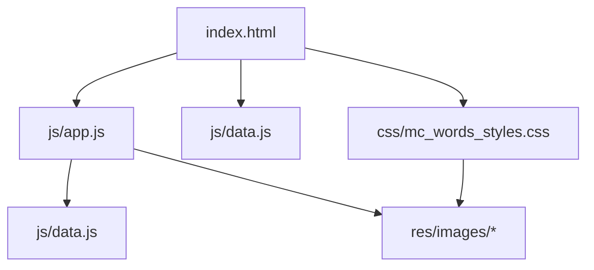
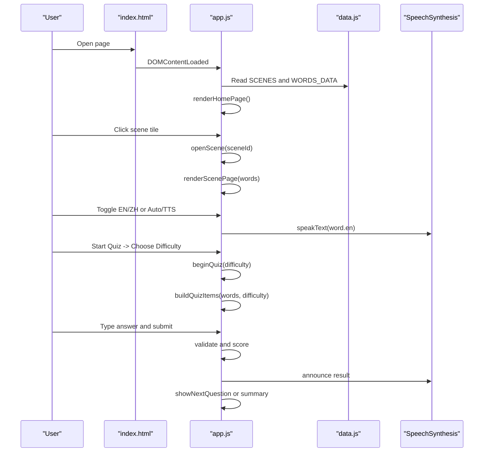
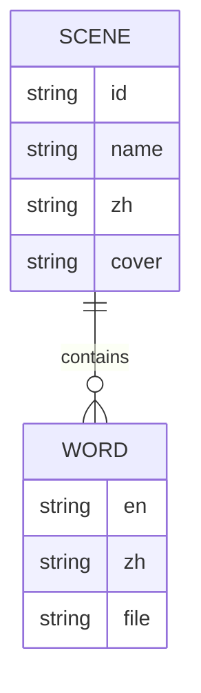
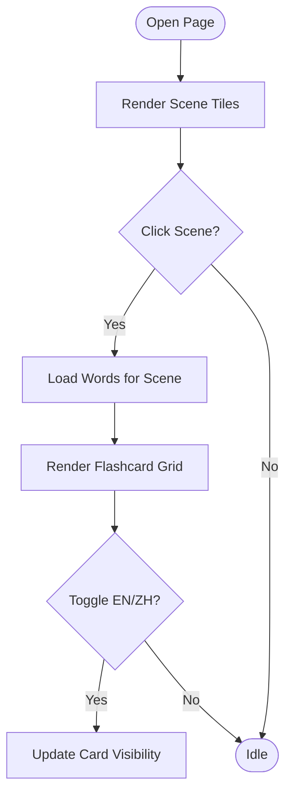
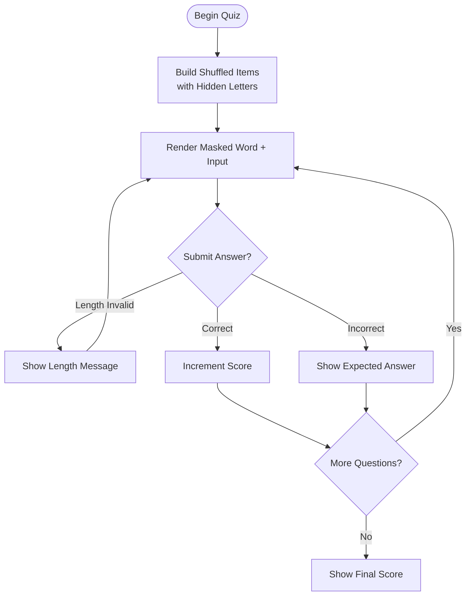
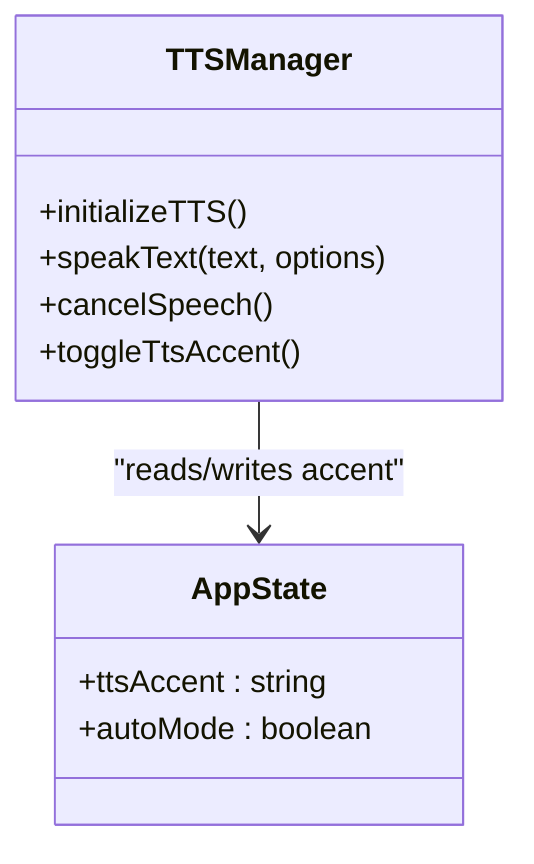
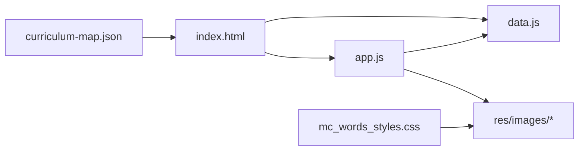

# MEET MC WORDS - Minecraft Vocabulary Builder

<cite>
**Referenced Files in This Document**
- [index.html](file://src/literacy/mc_words/index.html)
- [app.js](file://src/literacy/mc_words/js/app.js)
- [data.js](file://src/literacy/mc_words/js/data.js)
- [mc_words_styles.css](file://src/literacy/mc_words/css/mc_words_styles.css)
- [curriculum-map.json](file://src/data/curriculum-map.json)
- [README.md](file://README.md)
- [manual-visual-qa.md](file://docs/manual-visual-qa.md)
</cite>

## Table of Contents
1. [Introduction](#introduction)
2. [Project Structure](#project-structure)
3. [Core Components](#core-components)
4. [Architecture Overview](#architecture-overview)
5. [Detailed Component Analysis](#detailed-component-analysis)
6. [Dependency Analysis](#dependency-analysis)
7. [Performance Considerations](#performance-considerations)
8. [Troubleshooting Guide](#troubleshooting-guide)
9. [Conclusion](#conclusion)
10. [Appendices](#appendices)

## Introduction
MEET MC WORDS is a Minecraft-themed vocabulary builder designed for IB PYP learners. It uses familiar gaming aesthetics to engage students while teaching English vocabulary through interactive flashcards and a fill-in-the-blank quiz. The app organizes words into themed categories (e.g., Passive, Neutral, Hostile, Block, Animal, Food, Material, Plant, Tool, Weapon, Color, Enemy, Others), presents them as pixel-art cards with bilingual labels, and offers pronunciation via the browser’s text-to-speech engine. A scene-based quiz mode supports three difficulty levels and provides immediate feedback and audio cues.

The game aligns with IB PYP literacy goals by encouraging word recognition, spelling practice, and multimodal learning (visual, auditory, kinesthetic). It integrates into the curriculum map under Grade 1 Literacy and is optimized for touch devices and desktop viewports.

## Project Structure
The game is implemented as a standalone HTML page with associated CSS and JavaScript modules:
- index.html: Application shell, navigation controls, quiz overlay, and script includes
- js/data.js: Vocabulary data and scene definitions
- js/app.js: Game state management, UI rendering, TTS integration, quiz logic
- css/mc_words_styles.css: Responsive styling, pixel-art theme, quiz modal styles
- res/images/{Category}/: Image assets per category

**Diagram sources**
- [index.html:1-111](file://src/literacy/mc_words/index.html#L1-L111)
- [app.js:1-718](file://src/literacy/mc_words/js/app.js#L1-L718)
- [data.js:1-34](file://src/literacy/mc_words/js/data.js#L1-L34)
- [mc_words_styles.css:1-961](file://src/literacy/mc_words/css/mc_words_styles.css#L1-L961)

**Section sources**
- [index.html:1-111](file://src/literacy/mc_words/index.html#L1-L111)
- [README.md:1-65](file://README.md#L1-L65)

## Core Components
- Scene catalog and vocabulary data: SCENES and WORDS_DATA define categories, cover images, and word entries (en, zh, file).
- Flashcard grid renderer: Renders category tiles on the home screen and word cards within a selected scene.
- Quiz system: Overlay modal with setup, masked-word input, scoring, and summary states.
- Text-to-speech integration: Browser SpeechSynthesis API for pronunciation playback and feedback.
- Auto-mode: Periodic highlighting and audio playback across cards.
- Accessibility and UX: Keyboard-friendly inputs, focus management, aria attributes, and responsive design.

Key responsibilities:
- State management: Centralized currentState object tracks pages, scenes, visibility toggles, auto-mode, TTS accent, and quiz state.
- Rendering: Dynamic DOM creation for cards and quiz elements; lazy image loading for performance.
- Interaction: Click handlers for card flips, quiz submission, difficulty selection, and control toggles.
- Feedback: Visual classes for correct/wrong states, toast messages, and audio announcements.

**Section sources**
- [data.js:1-34](file://src/literacy/mc_words/js/data.js#L1-L34)
- [app.js:1-718](file://src/literacy/mc_words/js/app.js#L1-L718)
- [mc_words_styles.css:1-961](file://src/literacy/mc_words/css/mc_words_styles.css#L1-L961)

## Architecture Overview
The application follows a simple client-side architecture:
- Entry point loads HTML, CSS, and JS modules
- Data module exposes SCENES and WORDS_DATA
- App module initializes UI, binds events, manages state, and renders views
- Assets are loaded lazily from categorized folders

**Diagram sources**
- [index.html:1-111](file://src/literacy/mc_words/index.html#L1-L111)
- [app.js:46-718](file://src/literacy/mc_words/js/app.js#L46-L718)
- [data.js:1-34](file://src/literacy/mc_words/js/data.js#L1-L34)

## Detailed Component Analysis

### Data Model and Categories
- SCENES: Array of category objects with id, name, zh, and cover image path.
- WORDS_DATA: Map from category id to arrays of word objects containing en, zh, and file fields.
- Asset organization: Images stored under res/images/{Category}/ matching category ids.

**Diagram sources**
- [data.js:1-34](file://src/literacy/mc_words/js/data.js#L1-L34)

**Section sources**
- [data.js:1-34](file://src/literacy/mc_words/js/data.js#L1-L34)

### Flashcard Grid and Scene Navigation
- Home page renders SCENES as clickable tiles with cover images and bilingual titles.
- Selecting a scene loads corresponding words and renders a responsive grid of flashcards.
- Cards support click-to-flip animation and optional language toggles.

**Diagram sources**
- [app.js:466-541](file://src/literacy/mc_words/js/app.js#L466-L541)
- [index.html:15-40](file://src/literacy/mc_words/index.html#L15-L40)

**Section sources**
- [app.js:466-541](file://src/literacy/mc_words/js/app.js#L466-L541)
- [index.html:15-40](file://src/literacy/mc_words/index.html#L15-L40)

### Quiz System
- Setup: Choose difficulty (easy, normal, hard) which determines how many letters are hidden.
- Question flow: Display image, masked word, prompt, and input; accept Enter to submit.
- Validation: Normalizes input, checks length, compares expected answer, updates score.
- Feedback: Visual classes for correct/wrong, audio announcements, and auto-advance timer.
- Summary: Final score display and motivational message.

**Diagram sources**
- [app.js:184-464](file://src/literacy/mc_words/js/app.js#L184-L464)
- [index.html:40-87](file://src/literacy/mc_words/index.html#L40-L87)

**Section sources**
- [app.js:184-464](file://src/literacy/mc_words/js/app.js#L184-L464)
- [index.html:40-87](file://src/literacy/mc_words/index.html#L40-L87)

### Text-to-Speech Integration
- Initialization: Detects voices and logs count when available.
- Playback: Uses SpeechSynthesisUtterance with configurable language, rate, and pitch.
- Controls: Accent toggle (US/UK), replay button in quiz, auto-mode periodic playback.
- Error handling: Ignores interruption/cancellation errors; logs other errors.

**Diagram sources**
- [app.js:53-119](file://src/literacy/mc_words/js/app.js#L53-L119)
- [app.js:593-602](file://src/literacy/mc_words/js/app.js#L593-L602)

**Section sources**
- [app.js:53-119](file://src/literacy/mc_words/js/app.js#L53-L119)
- [app.js:593-602](file://src/literacy/mc_words/js/app.js#L593-L602)

### Responsive Styling and UX
- Pixel-art theme with bold borders, gold accents, and glow animations for active items.
- Grid layout adapts to viewport sizes; specific media queries for iPad mini landscape/portrait and larger screens.
- Touch-friendly targets and clear visual feedback for interactions.
- Quiz modal optimized for landscape orientation with adjusted font sizes and spacing.

**Section sources**
- [mc_words_styles.css:1-961](file://src/literacy/mc_words/css/mc_words_styles.css#L1-L961)

## Dependency Analysis
- index.html depends on app.js and data.js for functionality and content.
- app.js depends on data.js for SCENES and WORDS_DATA.
- Both app.js and mc_words_styles.css reference image assets under res/images.
- Curriculum integration: The game is listed in the curriculum map under Grade 1 Literacy.

**Diagram sources**
- [index.html:99-100](file://src/literacy/mc_words/index.html#L99-L100)
- [app.js:1-11](file://src/literacy/mc_words/js/app.js#L1-L11)
- [data.js:1-34](file://src/literacy/mc_words/js/data.js#L1-L34)
- [curriculum-map.json:145-157](file://src/data/curriculum-map.json#L145-L157)

**Section sources**
- [curriculum-map.json:145-157](file://src/data/curriculum-map.json#L145-L157)

## Performance Considerations
- Lazy loading: Images use loading="lazy" to defer offscreen resources.
- Efficient rendering: Minimal DOM manipulation; reuses existing nodes where possible.
- Audio optimization: Cancels ongoing speech before new utterances to prevent queue buildup.
- Auto-mode pacing: 3-second interval balances engagement without overwhelming users.
- Responsive images: object-fit and pixelated rendering ensure crisp visuals at various scales.

[No sources needed since this section provides general guidance]

## Troubleshooting Guide
Common issues and resolutions:
- No audio output: Ensure SpeechSynthesis is supported and voices are loaded; check browser permissions and user gesture requirements.
- Quiz input not accepting characters: Verify inputmode and autocapitalize settings; confirm maxLength matches expected answer length.
- Missing images: Confirm asset paths match category folder names and filenames in data.js.
- Layout overflow on small screens: Check viewport meta tag and responsive breakpoints; test on target devices.

**Section sources**
- [app.js:53-119](file://src/literacy/mc_words/js/app.js#L53-L119)
- [index.html:6-12](file://src/literacy/mc_words/index.html#L6-L12)
- [manual-visual-qa.md:31-48](file://docs/manual-visual-qa.md#L31-L48)

## Conclusion
MEET MC WORDS leverages Minecraft aesthetics to create an engaging, accessible vocabulary learning experience aligned with IB PYP literacy objectives. Its modular structure, robust quiz system, and responsive design make it suitable for diverse classrooms and devices. Educators can extend content by adding new categories and words, customize difficulty, and integrate additional educational themes while maintaining consistent UX patterns.

[No sources needed since this section summarizes without analyzing specific files]

## Appendices

### Adding New Vocabulary Categories
Steps:
- Add a new category folder under res/images/{NewCategory}/ with appropriate assets.
- Extend SCENES in data.js with a new entry including id, name, zh, and cover path.
- Add a new array of word objects under WORDS_DATA keyed by the same id.
- Test rendering and quiz functionality for the new category.

**Section sources**
- [data.js:1-34](file://src/literacy/mc_words/js/data.js#L1-L34)

### Customizing Game Difficulty
- Modify QUIZ_DIFFICULTIES in app.js to adjust descriptions, placeholders, and blank counts.
- Adjust getQuizBlankCount logic to change letter hiding behavior per difficulty level.
- Update quiz UI labels in index.html if needed.

**Section sources**
- [app.js:13-29](file://src/literacy/mc_words/js/app.js#L13-L29)
- [app.js:168-182](file://src/literacy/mc_words/js/app.js#L168-L182)
- [index.html:51-64](file://src/literacy/mc_words/index.html#L51-L64)

### Integrating Additional Minecraft-Themed Content
- Expand WORDS_DATA with more words per category or add new categories.
- Provide corresponding images in res/images/{Category}/.
- Optionally add new scenes to SCENES for curated learning sets.
- Validate with manual QA checklist and build process.

**Section sources**
- [data.js:1-34](file://src/literacy/mc_words/js/data.js#L1-L34)
- [manual-visual-qa.md:116-124](file://docs/manual-visual-qa.md#L116-L124)