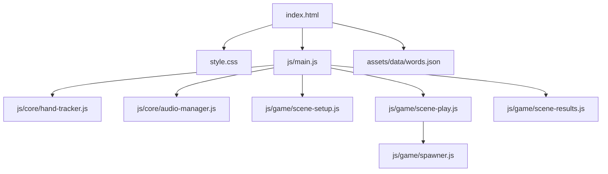
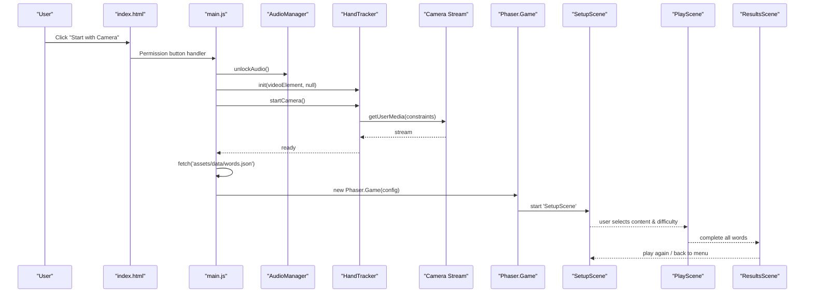
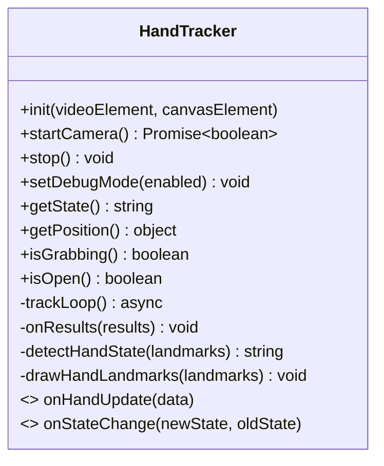
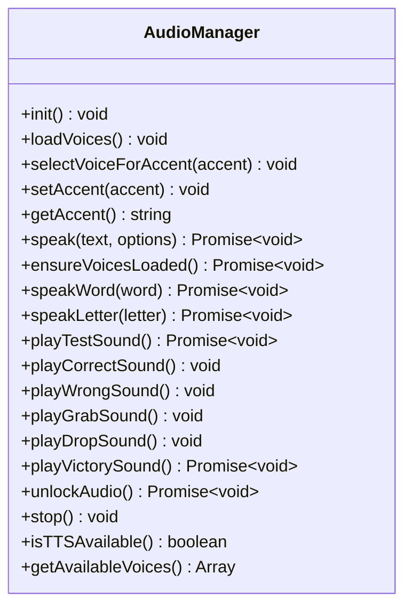
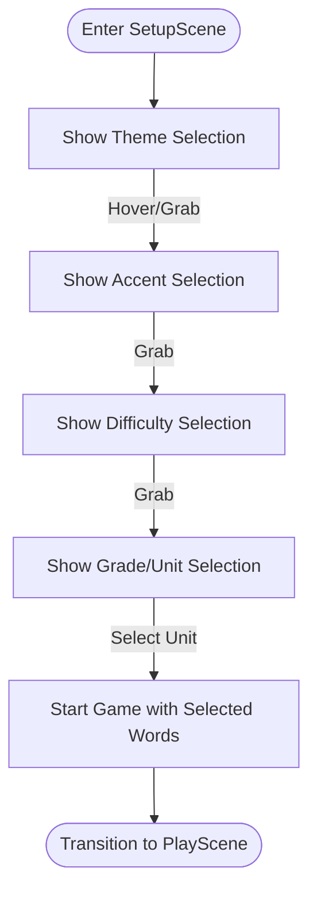
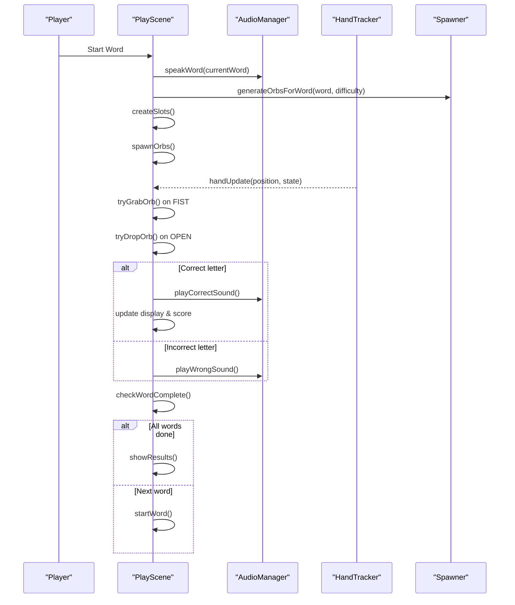
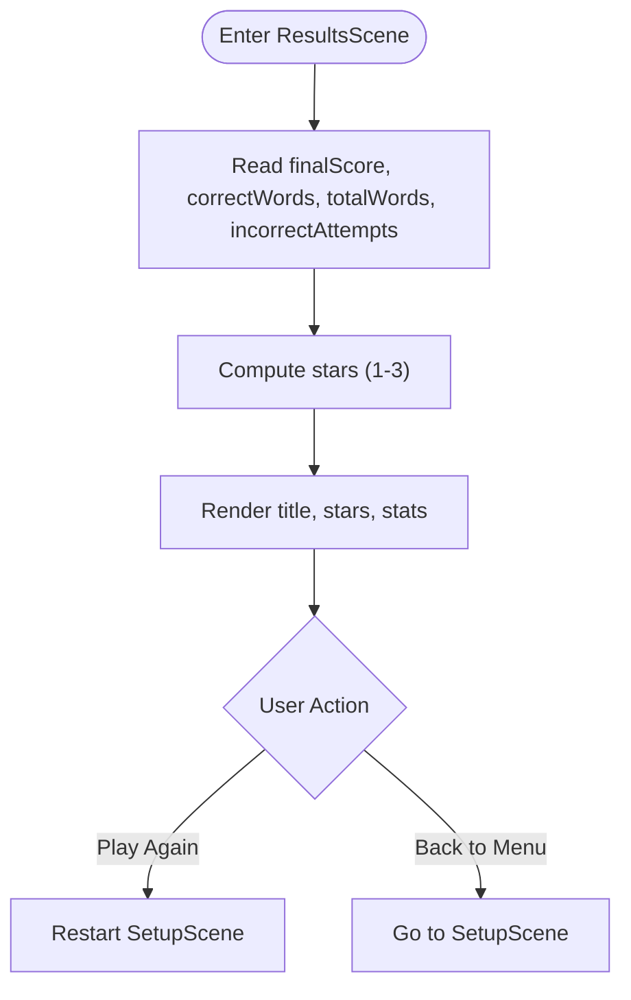
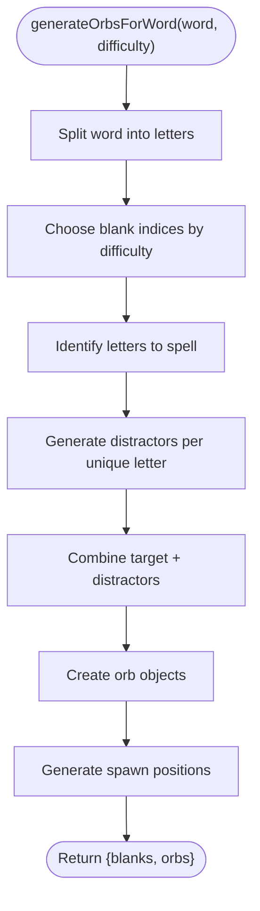
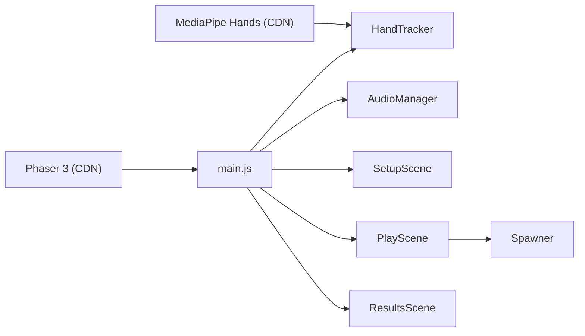

# MoveSpell - Gesture-Controlled Spelling Game

<cite>
**Referenced Files in This Document**
- [index.html](file://src/literacy/movespelling/index.html)
- [main.js](file://src/literacy/movespelling/js/main.js)
- [hand-tracker.js](file://src/literacy/movespelling/js/core/hand-tracker.js)
- [audio-manager.js](file://src/literacy/movespelling/js/core/audio-manager.js)
- [scene-setup.js](file://src/literacy/movespelling/js/game/scene-setup.js)
- [scene-play.js](file://src/literacy/movespelling/js/game/scene-play.js)
- [scene-results.js](file://src/literacy/movespelling/js/game/scene-results.js)
- [spawner.js](file://src/literacy/movespelling/js/game/spawner.js)
- [style.css](file://src/literacy/movespelling/css/style.css)
- [words.json](file://src/literacy/movespelling/assets/data/words.json)
</cite>

## Table of Contents
1. [Introduction](#introduction)
2. [Project Structure](#project-structure)
3. [Core Components](#core-components)
4. [Architecture Overview](#architecture-overview)
5. [Detailed Component Analysis](#detailed-component-analysis)
6. [Dependency Analysis](#dependency-analysis)
7. [Performance Considerations](#performance-considerations)
8. [Troubleshooting Guide](#troubleshooting-guide)
9. [Conclusion](#conclusion)
10. [Appendices](#appendices)

## Introduction
MoveSpell is an immersive, zero-touch spelling game for children that uses MediaPipe hand tracking to recognize gestures and drive gameplay via a Phaser 3 engine. The experience emphasizes privacy-first local AI processing, accessible UI, and cross-device compatibility (desktop and tablets). Players spell words by grabbing floating letter orbs with a closed-hand gesture and dropping them into slots, guided by audio prompts and visual feedback.

Key goals:
- Zero-touch interaction using open/fist gestures
- Real-time hand tracking with MediaPipe Hands
- Scene-based flow: Setup → Play → Results
- Local-only AI and audio; no video upload or recording
- Child-friendly themes, difficulty levels, and vocabulary sets

## Project Structure
The MoveSpell app is organized as a self-contained web application under src/literacy/movespelling. It loads external libraries from CDN, initializes core modules (hand tracker and audio), then boots the Phaser game with three scenes.

**Diagram sources**
- [index.html:89-107](file://src/literacy/movespelling/index.html#L89-L107)
- [main.js:105-131](file://src/literacy/movespelling/js/main.js#L105-L131)
- [hand-tracker.js:64-77](file://src/literacy/movespelling/js/core/hand-tracker.js#L64-L77)
- [audio-manager.js:35-52](file://src/literacy/movespelling/js/core/audio-manager.js#L35-L52)
- [scene-setup.js:6-29](file://src/literacy/movespelling/js/game/scene-setup.js#L6-L29)
- [scene-play.js:6-22](file://src/literacy/movespelling/js/game/scene-play.js#L6-L22)
- [scene-results.js:5-8](file://src/literacy/movespelling/js/game/scene-results.js#L5-L8)
- [spawner.js:70-80](file://src/literacy/movespelling/js/game/spawner.js#L70-L80)
- [words.json:1-6](file://src/literacy/movespelling/assets/data/words.json#L1-L6)

**Section sources**
- [index.html:1-118](file://src/literacy/movespelling/index.html#L1-L118)
- [main.js:105-131](file://src/literacy/movespelling/js/main.js#L105-L131)

## Core Components
- HandTracker: Wraps MediaPipe Hands API, manages camera access, frame loop, smoothing, state debouncing, and callbacks for position/state changes.
- AudioManager: Manages Web Speech Synthesis TTS and Web Audio API sound effects; includes iOS unlock flow and voice selection.
- SetupScene: Multi-step configuration (theme, accent, difficulty, content selection) with hover-and-grab interactions.
- PlayScene: Core gameplay loop—listen, spawn orbs, grab/drop letters, validate placement, score, and transition to results.
- ResultsScene: Displays stars and stats, supports replay and returning to menu.
- Spawner: Generates intelligently chosen distractor letters based on phonetic and visual confusion maps and difficulty settings.

**Section sources**
- [hand-tracker.js:6-48](file://src/literacy/movespelling/js/core/hand-tracker.js#L6-L48)
- [audio-manager.js:6-30](file://src/literacy/movespelling/js/core/audio-manager.js#L6-L30)
- [scene-setup.js:6-29](file://src/literacy/movespelling/js/game/scene-setup.js#L6-L29)
- [scene-play.js:6-22](file://src/literacy/movespelling/js/game/scene-play.js#L6-L22)
- [scene-results.js:5-8](file://src/literacy/movespelling/js/game/scene-results.js#L5-L8)
- [spawner.js:70-80](file://src/literacy/movespelling/js/game/spawner.js#L70-L80)

## Architecture Overview
High-level runtime flow:
- index.html loads dependencies and core scripts, then main.js bootstraps the app.
- main.js initializes AudioManager, requests camera permission, starts HandTracker, fetches vocabulary data, and creates a Phaser.Game with transparent canvas over the camera feed.
- HandTracker emits handUpdate and handStateChange events consumed by scenes.
- SetupScene guides users through theme, accent, difficulty, and word set selection.
- PlayScene orchestrates gameplay phases and scoring.
- ResultsScene summarizes performance and allows replay.

**Diagram sources**
- [index.html:54-60](file://src/literacy/movespelling/index.html#L54-L60)
- [main.js:23-99](file://src/literacy/movespelling/js/main.js#L23-L99)
- [hand-tracker.js:85-151](file://src/literacy/movespelling/js/core/hand-tracker.js#L85-L151)
- [audio-manager.js:354-414](file://src/literacy/movespelling/js/core/audio-manager.js#L354-L414)
- [scene-setup.js:740-800](file://src/literacy/movespelling/js/game/scene-setup.js#L740-L800)
- [scene-play.js:393-400](file://src/literacy/movespelling/js/game/scene-play.js#L393-L400)
- [scene-results.js:185-205](file://src/literacy/movespelling/js/game/scene-results.js#L185-L205)

## Detailed Component Analysis

### HandTracker (MediaPipe Hands Integration)
Responsibilities:
- Initialize MediaPipe Hands with options and result callback
- Start camera with robust constraints and iOS-specific attributes
- Frame-rate limited tracking loop to avoid request stacking
- Smoothed palm center position mapping to screen coordinates
- Gesture classification: OPEN vs FIST using normalized fingertip-to-base distances
- Debounced state transitions and error resilience

**Diagram sources**
- [hand-tracker.js:6-48](file://src/literacy/movespelling/js/core/hand-tracker.js#L6-L48)
- [hand-tracker.js:55-80](file://src/literacy/movespelling/js/core/hand-tracker.js#L55-L80)
- [hand-tracker.js:85-151](file://src/literacy/movespelling/js/core/hand-tracker.js#L85-L151)
- [hand-tracker.js:194-248](file://src/literacy/movespelling/js/core/hand-tracker.js#L194-L248)
- [hand-tracker.js:254-333](file://src/literacy/movespelling/js/core/hand-tracker.js#L254-L333)
- [hand-tracker.js:340-402](file://src/literacy/movespelling/js/core/hand-tracker.js#L340-L402)
- [hand-tracker.js:463-497](file://src/literacy/movespelling/js/core/hand-tracker.js#L463-L497)

**Section sources**
- [hand-tracker.js:64-77](file://src/literacy/movespelling/js/core/hand-tracker.js#L64-L77)
- [hand-tracker.js:85-151](file://src/literacy/movespelling/js/core/hand-tracker.js#L85-L151)
- [hand-tracker.js:194-248](file://src/literacy/movespelling/js/core/hand-tracker.js#L194-L248)
- [hand-tracker.js:254-333](file://src/literacy/movespelling/js/core/hand-tracker.js#L254-L333)
- [hand-tracker.js:340-402](file://src/literacy/movespelling/js/core/hand-tracker.js#L340-L402)

### AudioManager (TTS and Sound Effects)
Responsibilities:
- Load and select voices for US/UK accents
- Speak text with rate/pitch/volume control
- Generate simple tones and short sequences for feedback
- Unlock audio context and speech synthesis on iOS after user gesture

**Diagram sources**
- [audio-manager.js:6-30](file://src/literacy/movespelling/js/core/audio-manager.js#L6-L30)
- [audio-manager.js:35-52](file://src/literacy/movespelling/js/core/audio-manager.js#L35-L52)
- [audio-manager.js:57-99](file://src/literacy/movespelling/js/core/audio-manager.js#L57-L99)
- [audio-manager.js:125-199](file://src/literacy/movespelling/js/core/audio-manager.js#L125-L199)
- [audio-manager.js:205-233](file://src/literacy/movespelling/js/core/audio-manager.js#L205-L233)
- [audio-manager.js:239-250](file://src/literacy/movespelling/js/core/audio-manager.js#L239-L250)
- [audio-manager.js:268-340](file://src/literacy/movespelling/js/core/audio-manager.js#L268-L340)
- [audio-manager.js:354-414](file://src/literacy/movespelling/js/core/audio-manager.js#L354-L414)

**Section sources**
- [audio-manager.js:354-414](file://src/literacy/movespelling/js/core/audio-manager.js#L354-L414)
- [audio-manager.js:125-199](file://src/literacy/movespelling/js/core/audio-manager.js#L125-L199)

### SetupScene (Configuration Flow)
Responsibilities:
- Four-step wizard: Theme → Accent → Difficulty → Content
- Hover-and-hold or grab-to-select interactions
- Dynamic unit selection with pagination
- Applies selected theme/accent/difficulty and navigates to PlayScene

**Diagram sources**
- [scene-setup.js:196-226](file://src/literacy/movespelling/js/game/scene-setup.js#L196-L226)
- [scene-setup.js:277-305](file://src/literacy/movespelling/js/game/scene-setup.js#L277-L305)
- [scene-setup.js:342-398](file://src/literacy/movespelling/js/game/scene-setup.js#L342-L398)
- [scene-setup.js:464-609](file://src/literacy/movespelling/js/game/scene-setup.js#L464-L609)
- [scene-setup.js:740-800](file://src/literacy/movespelling/js/game/scene-setup.js#L740-L800)

**Section sources**
- [scene-setup.js:6-29](file://src/literacy/movespelling/js/game/scene-setup.js#L6-L29)
- [scene-setup.js:740-800](file://src/literacy/movespelling/js/game/scene-setup.js#L740-L800)

### PlayScene (Core Gameplay Loop)
Responsibilities:
- Word list shuffling and HUD updates
- Listen phase with TTS prompt
- Spawn letter orbs with animations
- Grab/drop mechanics tied to hand states
- Validate correct slot placement, update score, and handle completion
- Transition to ResultsScene when all words are completed

**Diagram sources**
- [scene-play.js:143-165](file://src/literacy/movespelling/js/game/scene-play.js#L143-L165)
- [scene-play.js:173-228](file://src/literacy/movespelling/js/game/scene-play.js#L173-L228)
- [scene-play.js:298-334](file://src/literacy/movespelling/js/game/scene-play.js#L298-L334)
- [scene-play.js:336-376](file://src/literacy/movespelling/js/game/scene-play.js#L336-L376)
- [scene-play.js:378-400](file://src/literacy/movespelling/js/game/scene-play.js#L378-L400)
- [spawner.js:150-217](file://src/literacy/movespelling/js/game/spawner.js#L150-L217)

**Section sources**
- [scene-play.js:6-22](file://src/literacy/movespelling/js/game/scene-play.js#L6-L22)
- [scene-play.js:143-165](file://src/literacy/movespelling/js/game/scene-play.js#L143-L165)
- [scene-play.js:298-334](file://src/literacy/movespelling/js/game/scene-play.js#L298-L334)
- [scene-play.js:378-400](file://src/literacy/movespelling/js/game/scene-play.js#L378-L400)

### ResultsScene (Summary and Replay)
Responsibilities:
- Compute star rating based on accuracy and mistakes
- Display score, words completed, and mistakes
- Provide “Play Again” and “Back to Menu” actions

**Diagram sources**
- [scene-results.js:10-28](file://src/literacy/movespelling/js/game/scene-results.js#L10-L28)
- [scene-results.js:185-205](file://src/literacy/movespelling/js/game/scene-results.js#L185-L205)

**Section sources**
- [scene-results.js:10-28](file://src/literacy/movespelling/js/game/scene-results.js#L10-L28)
- [scene-results.js:185-205](file://src/literacy/movespelling/js/game/scene-results.js#L185-L205)

### Spawner (Distractor Generation Algorithm)
Responsibilities:
- Generate distractors prioritizing phonetic and visual confusions
- Determine blank positions per difficulty level
- Produce orb dataset and spawn positions

**Diagram sources**
- [spawner.js:150-217](file://src/literacy/movespelling/js/game/spawner.js#L150-L217)
- [spawner.js:252-276](file://src/literacy/movespelling/js/game/spawner.js#L252-L276)

**Section sources**
- [spawner.js:70-80](file://src/literacy/movespelling/js/game/spawner.js#L70-L80)
- [spawner.js:150-217](file://src/literacy/movespelling/js/game/spawner.js#L150-L217)
- [spawner.js:252-276](file://src/literacy/movespelling/js/game/spawner.js#L252-L276)

## Dependency Analysis
- External Libraries:
  - MediaPipe Hands loaded from CDN
  - Phaser 3 loaded from CDN
- Internal Modules:
  - HandTracker depends on MediaPipe Hands API
  - AudioManager depends on Web Speech Synthesis and Web Audio API
  - Scenes depend on global event bus (game.events) and registry for shared state
  - PlayScene depends on Spawner for content generation

**Diagram sources**
- [index.html:89-107](file://src/literacy/movespelling/index.html#L89-L107)
- [main.js:105-131](file://src/literacy/movespelling/js/main.js#L105-L131)
- [hand-tracker.js:64-77](file://src/literacy/movespelling/js/core/hand-tracker.js#L64-L77)
- [audio-manager.js:35-52](file://src/literacy/movespelling/js/core/audio-manager.js#L35-L52)
- [scene-play.js:21-22](file://src/literacy/movespelling/js/game/scene-play.js#L21-L22)

**Section sources**
- [index.html:89-107](file://src/literacy/movespelling/index.html#L89-L107)
- [main.js:105-131](file://src/literacy/movespelling/js/main.js#L105-L131)

## Performance Considerations
- Frame Rate Limiting: HandTracker targets a capped FPS to reduce CPU/GPU load and prevent request stacking.
- Smoothing and Debouncing: Position smoothing reduces jitter; state debouncing prevents rapid toggling between OPEN/FIST.
- Transparent Canvas: Phaser canvas is transparent to overlay on camera background, minimizing extra rendering layers.
- Responsive Sizing: Orb/slot sizes scale with viewport to maintain comfortable reach and drop zones.
- Error Resilience: Consecutive error counting resets processing state if needed.

[No sources needed since this section provides general guidance]

## Troubleshooting Guide
Common issues and resolutions:
- Camera Permission Denied: Ensure HTTPS or localhost; re-prompt user and show clear instructions.
- No Camera Found: Check device capabilities and fallback messaging.
- SecurityError: Requires secure context (HTTPS or localhost).
- Audio Not Playing on iOS: Use unlockAudio() triggered by user gesture before starting camera and speech.
- Speech Timeout: AudioManager includes timeouts to unblock flow even if TTS stalls.

**Section sources**
- [hand-tracker.js:130-151](file://src/literacy/movespelling/js/core/hand-tracker.js#L130-L151)
- [main.js:71-99](file://src/literacy/movespelling/js/main.js#L71-L99)
- [audio-manager.js:354-414](file://src/literacy/movespelling/js/core/audio-manager.js#L354-L414)

## Conclusion
MoveSpell combines MediaPipe hand tracking with Phaser 3 to deliver a zero-touch, immersive spelling experience tailored for young learners. Its architecture cleanly separates concerns across core services (tracking, audio) and scene-based flows (setup, play, results). With thoughtful performance optimizations, accessibility features, and privacy-first design, it is well-suited for classroom deployment across devices.

[No sources needed since this section summarizes without analyzing specific files]

## Appendices

### Adding New Vocabulary Sets
- Edit assets/data/words.json to add new grades/units/words following the existing structure.
- Ensure units include a label and words array; the setup scene will render them automatically.

**Section sources**
- [words.json:1-6](file://src/literacy/movespelling/assets/data/words.json#L1-L6)
- [scene-setup.js:476-510](file://src/literacy/movespelling/js/game/scene-setup.js#L476-L510)

### Customizing Difficulty Levels
- Modify spawner logic to adjust blank counts or distractor generation rules.
- Update SetupScene difficulty cards to reflect new tiers if needed.

**Section sources**
- [spawner.js:150-217](file://src/literacy/movespelling/js/game/spawner.js#L150-L217)
- [scene-setup.js:342-398](file://src/literacy/movespelling/js/game/scene-setup.js#L342-L398)

### Implementing Additional Gesture Commands
- Extend HandTracker.detectHandState to classify new gestures (e.g., point, swipe).
- Emit additional state change events and handle them in scenes for new interactions.

**Section sources**
- [hand-tracker.js:340-402](file://src/literacy/movespelling/js/core/hand-tracker.js#L340-L402)
- [main.js:158-160](file://src/literacy/movespelling/js/main.js#L158-L160)

### Privacy and Accessibility Notes
- Privacy: All AI runs locally; no video is recorded or uploaded.
- Accessibility: Large, high-contrast UI elements; optional audio prompts; keyboard navigation support for non-gesture environments.

**Section sources**
- [index.html:47-50](file://src/literacy/movespelling/index.html#L47-L50)
- [style.css:14-44](file://src/literacy/movespelling/css/style.css#L14-L44)