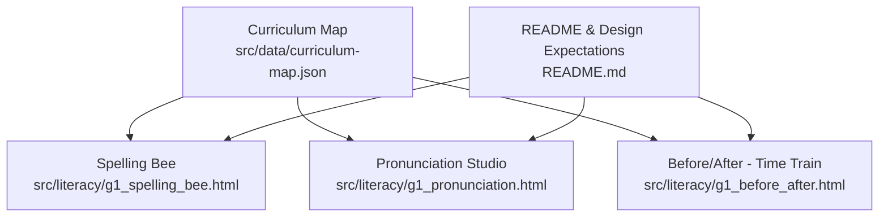
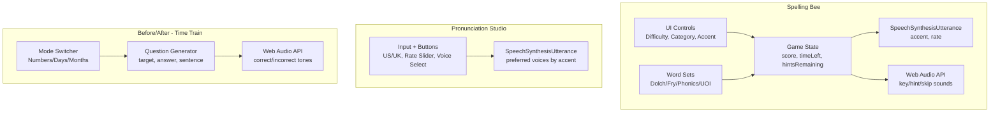
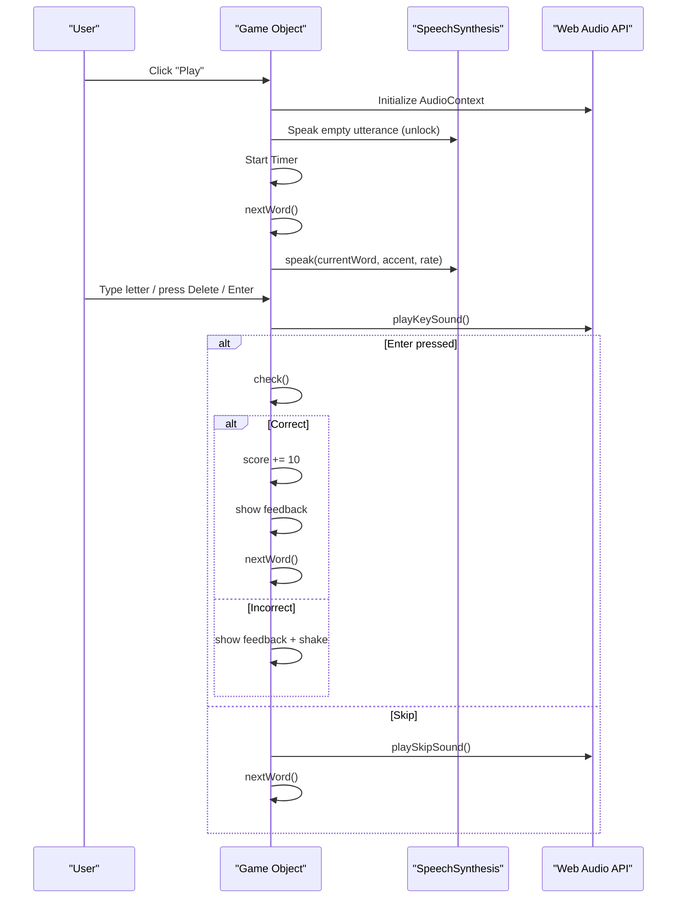
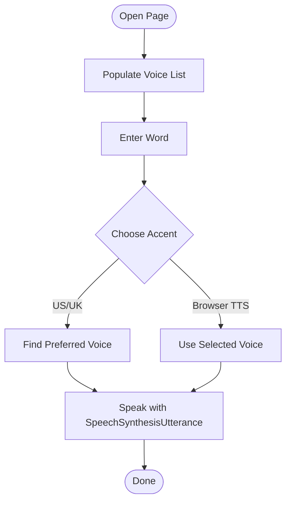
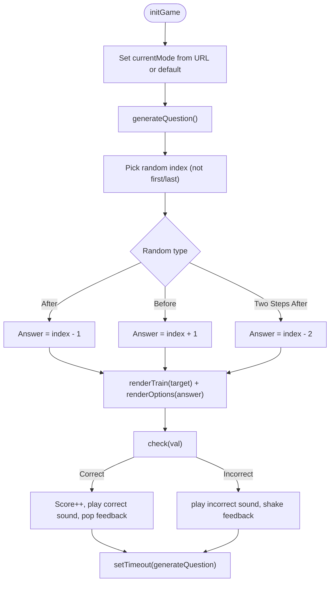
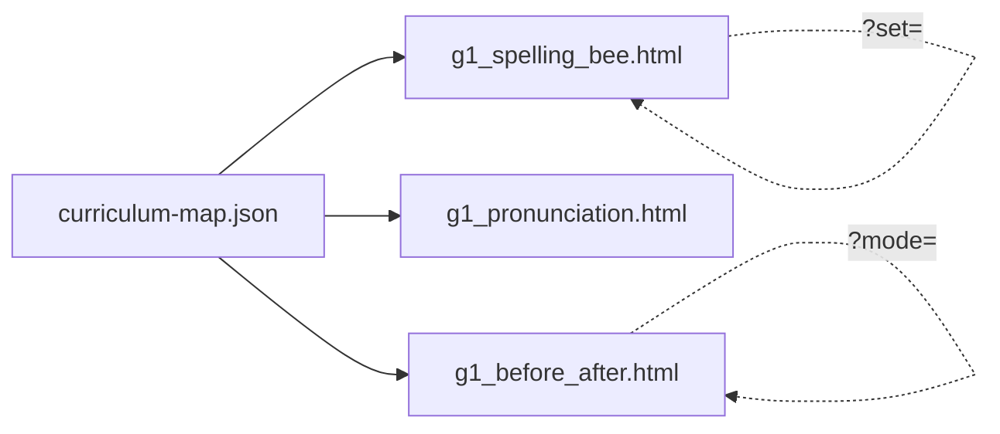

# Traditional Literacy Games

<cite>
**Referenced Files in This Document**
- [README.md](file://README.md)
- [curriculum-map.json](file://src/data/curriculum-map.json)
- [g1_spelling_bee.html](file://src/literacy/g1_spelling_bee.html)
- [g1_pronunciation.html](file://src/literacy/g1_pronunciation.html)
- [g1_before_after.html](file://src/literacy/g1_before_after.html)
</cite>

## Table of Contents
1. [Introduction](#introduction)
2. [Project Structure](#project-structure)
3. [Core Components](#core-components)
4. [Architecture Overview](#architecture-overview)
5. [Detailed Component Analysis](#detailed-component-analysis)
6. [Dependency Analysis](#dependency-analysis)
7. [Performance Considerations](#performance-considerations)
8. [Troubleshooting Guide](#troubleshooting-guide)
9. [Conclusion](#conclusion)
10. [Appendices](#appendices)

## Introduction
This document explains three traditional-style literacy games designed for IB PYP Grade 1 learners: Spelling Bee, Pronunciation Studio, and Before/After word exercises (Time Train). It covers educational objectives aligned to early literacy development, interactive approaches, UI design patterns, audio feedback systems, progress tracking, speech synthesis usage, input handling, visual feedback, customization options, accessibility, mobile responsiveness, and classroom deployment considerations. Guidance is also provided for creating similar traditional-style educational games following established patterns and best practices used across the project.

## Project Structure
The literacy games are standalone HTML pages under src/literacy/. The curriculum map centralizes navigation and unit-specific launch parameters. The README outlines design expectations and QA processes that inform responsive and child-friendly implementation.

**Diagram sources**
- [curriculum-map.json:1-60](file://src/data/curriculum-map.json#L1-L60)
- [README.md:58-65](file://README.md#L58-L65)

**Section sources**
- [README.md:1-65](file://README.md#L1-L65)
- [curriculum-map.json:1-60](file://src/data/curriculum-map.json#L1-L60)

## Core Components
- Spelling Bee: Timed spelling practice with selectable word sets, difficulty levels, accent selection, hints, skip, and score/timer tracking. Uses Web Speech Synthesis for pronunciation and Web Audio API for key/hint/skip sounds.
- Pronunciation Studio: Focused on hearing and repeating words with US/UK accents, adjustable speech rate, and browser voice selection via Web Speech Synthesis.
- Before/After (Time Train): Sequencing practice using numbers, days, or months with multiple-choice answers, animated train visualization, and Web Audio API sound effects.

Educational objectives:
- Phonemic awareness and decoding through repeated listening and spelling.
- Vocabulary building aligned to Dolch/Fry lists and thematic categories.
- Temporal sequencing language (before/after, first/next) supporting narrative retelling and daily routines.
- Early phonics and long vowel/digraph/blend recognition via curated word sets.

Interactive approaches:
- Immediate feedback (visual + audio) after each response.
- Scaffolding via hints and skips with small penalties.
- Choice-based interaction suitable for touch devices.
- Optional custom word lists for teacher/student personalization.

Progress tracking:
- Score counters and a countdown timer in Spelling Bee.
- Simple cumulative score in Time Train.
- No persistent backend; state resets per session.

**Section sources**
- [g1_spelling_bee.html:1678-2152](file://src/literacy/g1_spelling_bee.html#L1678-L2152)
- [g1_pronunciation.html:211-374](file://src/literacy/g1_pronunciation.html#L211-L374)
- [g1_before_after.html:306-556](file://src/literacy/g1_before_after.html#L306-L556)

## Architecture Overview
Each game is a self-contained single-page application with embedded CSS and JavaScript. They rely on standard web APIs:
- Web Speech Synthesis for TTS
- Web Audio API for short sound effects
- DOM manipulation for UI updates
- LocalStorage for optional persistence (Spelling Bee DIY list)

**Diagram sources**
- [g1_spelling_bee.html:1678-2152](file://src/literacy/g1_spelling_bee.html#L1678-L2152)
- [g1_pronunciation.html:211-374](file://src/literacy/g1_pronunciation.html#L211-L374)
- [g1_before_after.html:306-556](file://src/literacy/g1_before_after.html#L306-L556)

## Detailed Component Analysis

### Spelling Bee
Educational focus:
- Reinforces spelling accuracy and auditory discrimination.
- Supports phonics patterns via themed word sets (long vowels, digraphs, blends, academic vocabulary).
- Encourages self-paced practice with optional hints and skipping.

User interface design patterns:
- Two-panel layout: sidebar controls and main puzzle area.
- Responsive breakpoints for portrait/mobile vs landscape/iPad.
- Large touch targets and clear labels.
- Overlays for start/end and DIY modal.

Audio feedback systems:
- TTS pronunciation of target words at reduced rate.
- Short synthesized sounds for key presses, hints, and skips.

Progress tracking mechanisms:
- Score increments on correct answers.
- Countdown timer with color change near end.
- Hint counter and penalty on use.

Speech synthesis implementation:
- Uses SpeechSynthesisUtterance with selected accent (en-US/en-GB) and slower rate.
- Requires user gesture to unlock audio context and speech.

Input handling:
- On-screen keyboard supports touch.
- Physical keyboard support for letters, Backspace, Enter.

Visual feedback:
- Correct/incorrect messages, shake animation on error, highlighted revealed letters on hint.

Customization:
- Difficulty levels: easy (one missing), normal (half missing), hard (all missing).
- Word set selection from built-in categories plus Random and DIY modes.
- Accent selection for pronunciation model.

Accessibility and responsiveness:
- High contrast text, large fonts, and visible focus states.
- Mobile-first responsive styles with landscape optimization.

Classroom deployment:
- Works offline once loaded (no external dependencies).
- Easy to share via URL with query parameter to preselect a word set.

**Diagram sources**
- [g1_spelling_bee.html:1719-1782](file://src/literacy/g1_spelling_bee.html#L1719-L1782)
- [g1_spelling_bee.html:1904-1946](file://src/literacy/g1_spelling_bee.html#L1904-L1946)
- [g1_spelling_bee.html:1948-1954](file://src/literacy/g1_spelling_bee.html#L1948-L1954)
- [g1_spelling_bee.html:1982-2019](file://src/literacy/g1_spelling_bee.html#L1982-L2019)
- [g1_spelling_bee.html:2101-2151](file://src/literacy/g1_spelling_bee.html#L2101-L2151)

**Section sources**
- [g1_spelling_bee.html:21-669](file://src/literacy/g1_spelling_bee.html#L21-L669)
- [g1_spelling_bee.html:810-1634](file://src/literacy/g1_spelling_bee.html#L810-L1634)
- [g1_spelling_bee.html:1678-2152](file://src/literacy/g1_spelling_bee.html#L1678-L2152)

### Pronunciation Studio
Educational focus:
- Builds phoneme recognition and articulation practice.
- Exposes students to regional accents (US/UK) and adjustable speech rate.

User interface design patterns:
- Minimalist input field with action buttons.
- Sliders and dropdowns for rate and voice selection.
- Dark mode toggle for comfort.

Audio feedback systems:
- Browser TTS for pronunciation playback.
- Status messages for user guidance.

Speech synthesis implementation:
- Preferred voice lists per accent; fallback to any matching locale.
- Adjustable rate via slider.
- Error handling for unsupported voices or runtime errors.

Input handling:
- Text input and button clicks.
- Voice list populated dynamically when available.

Accessibility and responsiveness:
- Clear labels and readable font sizes.
- Responsive layout for smaller screens.

Classroom deployment:
- Single-file page with no build step.
- Useful for modeling pronunciation before reading tasks.

**Diagram sources**
- [g1_pronunciation.html:236-265](file://src/literacy/g1_pronunciation.html#L236-L265)
- [g1_pronunciation.html:320-373](file://src/literacy/g1_pronunciation.html#L320-L373)

**Section sources**
- [g1_pronunciation.html:1-385](file://src/literacy/g1_pronunciation.html#L1-L385)

### Before/After - Time Train
Educational focus:
- Practices temporal sequence language (before/after, first/next) and ordinal concepts.
- Connects to storytelling and daily routine sequencing.

User interface design patterns:
- Train-themed visualization with engine and cars.
- Mode switcher for Numbers/Days/Months.
- Large choice buttons with immediate feedback.

Audio feedback systems:
- Web Audio API generates pleasant ascending tones for correct answers and descending tones for incorrect.

Processing logic:
- Question generator selects a random target index and constructs a sentence asking for the preceding, succeeding, or two-step neighbor.
- Options include the correct answer plus three distractors.

Visual feedback:
- Pop animation for success, shake for incorrect, color changes on selected option.

Accessibility and responsiveness:
- aria-live region for feedback announcements.
- Tailwind utility classes and responsive grid layout.

**Diagram sources**
- [g1_before_after.html:398-475](file://src/literacy/g1_before_after.html#L398-L475)
- [g1_before_after.html:477-517](file://src/literacy/g1_before_after.html#L477-L517)
- [g1_before_after.html:519-550](file://src/literacy/g1_before_after.html#L519-L550)

**Section sources**
- [g1_before_after.html:1-567](file://src/literacy/g1_before_after.html#L1-L567)

## Dependency Analysis
- External dependencies:
  - Spelling Bee and Pronunciation Studio: zero external JS/CSS dependencies; rely on native browser APIs.
  - Before/After uses Tailwind CSS via CDN for styling.
- Curriculum integration:
  - All three games are listed in the curriculum map under Grade 1 Literacy or cross-linked units.
  - Spelling Bee supports unit-specific sets via ?set=... query parameter.
  - Before/After supports mode switching via ?mode=days or ?mode=months.

**Diagram sources**
- [curriculum-map.json:17-46](file://src/data/curriculum-map.json#L17-L46)
- [curriculum-map.json:216-224](file://src/data/curriculum-map.json#L216-L224)
- [curriculum-map.json:379-386](file://src/data/curriculum-map.json#L379-L386)

**Section sources**
- [curriculum-map.json:1-60](file://src/data/curriculum-map.json#L1-L60)
- [curriculum-map.json:216-224](file://src/data/curriculum-map.json#L216-L224)
- [curriculum-map.json:379-386](file://src/data/curriculum-map.json#L379-L386)

## Performance Considerations
- Avoid heavy assets; all three games are lightweight and fast to load.
- Prefer Web Audio API for short, procedural sounds instead of loading audio files.
- Keep DOM updates minimal; update only necessary elements for feedback.
- For Spelling Bee, avoid re-rendering entire UI on each keystroke; update only input display and feedback.
- Ensure AudioContext is resumed after user gestures to prevent silent failures on iOS Safari.

[No sources needed since this section provides general guidance]

## Troubleshooting Guide
Common issues and resolutions:
- No sound on iOS Safari:
  - Ensure audio contexts are initialized on first user interaction. Both Spelling Bee and Before/After initialize AudioContext on click/touch.
- TTS not playing:
  - Some browsers require a user gesture before speaking. Spelling Bee triggers an empty utterance after Play to unlock speech.
- Voices not found:
  - Pronunciation Studio falls back to any English voice if preferred names are unavailable. Verify device has English voices installed.
- Keyboard not working:
  - Confirm the page has focus and the virtual keyboard is disabled or not interfering. Spelling Bee listens for keydown events only when gameActive is true.
- Visual feedback not appearing:
  - Check that DOM elements exist and IDs match. Feedback regions are updated directly by ID.

**Section sources**
- [g1_spelling_bee.html:1719-1732](file://src/literacy/g1_spelling_bee.html#L1719-L1732)
- [g1_spelling_bee.html:1956-1980](file://src/literacy/g1_spelling_bee.html#L1956-L1980)
- [g1_before_after.html:309-360](file://src/literacy/g1_before_after.html#L309-L360)
- [g1_pronunciation.html:236-265](file://src/literacy/g1_pronunciation.html#L236-L265)

## Conclusion
These three traditional-style literacy games provide focused, accessible, and engaging practice for early readers and spellers. They follow consistent patterns: simple UI, immediate feedback, and robust use of native web APIs. Teachers can customize content and difficulty, while students benefit from multimodal reinforcement (audio + visual). The games integrate cleanly into the IB PYP curriculum map and are ready for classroom and home use.

[No sources needed since this section summarizes without analyzing specific files]

## Appendices

### Customizing Word Lists and Difficulty
- Spelling Bee:
  - Add new word sets by extending the data object with additional keys and arrays of words.
  - Use ?set=<key> in the URL to launch with a specific set.
  - Enable DIY mode to paste comma-separated words; saved to localStorage.
  - Adjust difficulty chips to control number of missing letters.

- Pronunciation Studio:
  - Extend preferred voice lists per accent to improve voice quality on different devices.
  - Adjust default speech rate via the slider.

- Before/After:
  - Extend data arrays for numbers, days, or months to increase variety.
  - Use ?mode=days or ?mode=months to preselect a theme.

**Section sources**
- [g1_spelling_bee.html:810-1634](file://src/literacy/g1_spelling_bee.html#L810-L1634)
- [g1_spelling_bee.html:1678-1717](file://src/literacy/g1_spelling_bee.html#L1678-L1717)
- [g1_spelling_bee.html:1878-1902](file://src/literacy/g1_spelling_bee.html#L1878-L1902)
- [g1_pronunciation.html:302-334](file://src/literacy/g1_pronunciation.html#L302-L334)
- [g1_before_after.html:366-391](file://src/literacy/g1_before_after.html#L366-L391)

### Accessibility Features
- High-contrast colors and large fonts.
- aria-live region for feedback in Before/After.
- Focus-visible outlines for keyboard navigation.
- Touch-friendly targets sized for young learners.

**Section sources**
- [g1_before_after.html:299-304](file://src/literacy/g1_before_after.html#L299-L304)
- [g1_spelling_bee.html:598-669](file://src/literacy/g1_spelling_bee.html#L598-L669)

### Mobile Responsiveness and Classroom Deployment
- Responsive layouts optimized for iPad landscape and desktop, with mobile fallbacks.
- Standalone pages with no build step required.
- Return link to PYP map present on each game page.
- Service worker precaching and manifest support for PWA behavior.

**Section sources**
- [README.md:58-65](file://README.md#L58-L65)
- [g1_spelling_bee.html:18-19](file://src/literacy/g1_spelling_bee.html#L18-L19)
- [g1_before_after.html:558-563](file://src/literacy/g1_before_after.html#L558-L563)
- [g1_pronunciation.html:376-381](file://src/literacy/g1_pronunciation.html#L376-L381)

### Creating Similar Traditional-Style Educational Games
Patterns to follow:
- Single-file HTML with embedded CSS/JS for simplicity and portability.
- Clear learning objective stated in title and description.
- Immediate feedback loop with both visual and audio cues.
- Minimal cognitive load: one task at a time, large choices, encouraging copy.
- Use native web APIs (SpeechSynthesis, Web Audio) to keep dependencies low.
- Provide customization hooks (URL params, local storage) for teacher needs.
- Include return navigation to the curriculum map and ensure viewport meta tags.

**Section sources**
- [README.md:58-65](file://README.md#L58-L65)
- [curriculum-map.json:17-46](file://src/data/curriculum-map.json#L17-L46)