# WordQuest - Vocabulary Games Suite

<cite>
**Referenced Files in This Document**
- [index.html](file://src/literacy/wordquest/index.html)
- [main.js](file://src/literacy/wordquest/js/main.js)
- [router.js](file://src/literacy/wordquest/js/router.js)
- [screens.js](file://src/literacy/wordquest/js/screens.js)
- [data.js](file://src/literacy/wordquest/js/data.js)
- [progress.js](file://src/literacy/wordquest/js/progress.js)
- [audio.js](file://src/literacy/wordquest/js/audio.js)
- [voice-control.js](file://src/literacy/wordquest/js/voice-control.js)
- [controller.js (Word Search)](file://src/literacy/wordquest/js/wordsearch/controller.js)
- [grid.js (Word Search)](file://src/literacy/wordquest/js/wordsearch/grid.js)
- [controller.js (Crossword)](file://src/literacy/wordquest/js/crossword/controller.js)
- [generator.js (Crossword)](file://src/literacy/wordquest/js/crossword/generator.js)
- [layout.js (Crossword)](file://src/literacy/wordquest/js/crossword/layout.js)
- [manifest.json](file://src/manifest.json)
- [sw.js](file://src/sw.js)
- [convert-vocab.js](file://scripts/convert-vocab.js)
</cite>

## Table of Contents
1. [Introduction](#introduction)
2. [Project Structure](#project-structure)
3. [Core Components](#core-components)
4. [Architecture Overview](#architecture-overview)
5. [Detailed Component Analysis](#detailed-component-analysis)
6. [Dependency Analysis](#dependency-analysis)
7. [Performance Considerations](#performance-considerations)
8. [Troubleshooting Guide](#troubleshooting-guide)
9. [Conclusion](#conclusion)
10. [Appendices](#appendices)

## Introduction
WordQuest is a vocabulary games suite that provides two interactive activities: Word Search and Crossword puzzles. It uses a modular architecture with separate controllers for each game, shared data management for word lists and utilities, and a progressive progress tracking system. The app includes a hash-based routing system for navigation, responsive screen management, audio feedback via speech synthesis and oscillator-based sound effects, and voice control integration for accessibility. It also supports PWA capabilities with offline functionality through a service worker and manifest configuration.

## Project Structure
The WordQuest application is organized under src/literacy/wordquest with clear separation between UI, routing, screens, game controllers, generators, and utilities. The entry point loads the main module which initializes routing, audio unlocking, and voice control. Screens render grade/category/mode selection and orchestrate game instances. Each game type has its own controller and supporting modules.

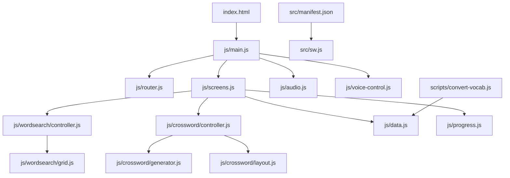

**Diagram sources**
- [index.html:1-21](file://src/literacy/wordquest/index.html#L1-L21)
- [main.js:1-97](file://src/literacy/wordquest/js/main.js#L1-L97)
- [router.js:1-65](file://src/literacy/wordquest/js/router.js#L1-L65)
- [screens.js:1-476](file://src/literacy/wordquest/js/screens.js#L1-L476)
- [audio.js:1-202](file://src/literacy/wordquest/js/audio.js#L1-L202)
- [voice-control.js:1-157](file://src/literacy/wordquest/js/voice-control.js#L1-L157)
- [controller.js (Word Search):1-821](file://src/literacy/wordquest/js/wordsearch/controller.js#L1-L821)
- [grid.js (Word Search):1-201](file://src/literacy/wordquest/js/wordsearch/grid.js#L1-L201)
- [controller.js (Crossword):1-815](file://src/literacy/wordquest/js/crossword/controller.js#L1-L815)
- [generator.js (Crossword):1-398](file://src/literacy/wordquest/js/crossword/generator.js#L1-L398)
- [layout.js (Crossword):1-163](file://src/literacy/wordquest/js/crossword/layout.js#L1-L163)
- [data.js:1-117](file://src/literacy/wordquest/js/data.js#L1-L117)
- [progress.js:1-128](file://src/literacy/wordquest/js/progress.js#L1-L128)
- [manifest.json:1-22](file://src/manifest.json#L1-L22)
- [sw.js:1-130](file://src/sw.js#L1-L130)
- [convert-vocab.js:1-225](file://scripts/convert-vocab.js#L1-L225)

**Section sources**
- [index.html:1-21](file://src/literacy/wordquest/index.html#L1-L21)
- [main.js:1-97](file://src/literacy/wordquest/js/main.js#L1-L97)
- [router.js:1-65](file://src/literacy/wordquest/js/router.js#L1-L65)
- [screens.js:1-476](file://src/literacy/wordquest/js/screens.js#L1-L476)
- [data.js:1-117](file://src/literacy/wordquest/js/data.js#L1-L117)
- [progress.js:1-128](file://src/literacy/wordquest/js/progress.js#L1-L128)
- [audio.js:1-202](file://src/literacy/wordquest/js/audio.js#L1-L202)
- [voice-control.js:1-157](file://src/literacy/wordquest/js/voice-control.js#L1-L157)
- [controller.js (Word Search):1-821](file://src/literacy/wordquest/js/wordsearch/controller.js#L1-L821)
- [grid.js (Word Search):1-201](file://src/literacy/wordquest/js/wordsearch/grid.js#L1-L201)
- [controller.js (Crossword):1-815](file://src/literacy/wordquest/js/crossword/controller.js#L1-L815)
- [generator.js (Crossword):1-398](file://src/literacy/wordquest/js/crossword/generator.js#L1-L398)
- [layout.js (Crossword):1-163](file://src/literacy/wordquest/js/crossword/layout.js#L1-L163)
- [manifest.json:1-22](file://src/manifest.json#L1-L22)
- [sw.js:1-130](file://src/sw.js#L1-L130)
- [convert-vocab.js:1-225](file://scripts/convert-vocab.js#L1-L225)

## Core Components
- Router: Hash-based routing with query parameter support; parses routes into {grade, cat, mode, action} and navigates via window.location.hash.
- Screens: Renders home, categories, mode-select, play, and completion screens; orchestrates game lifecycle and integrates with progress and audio.
- Data: Exports VOCAB by grade, GRADES metadata, and WordUtil helpers for normalization and round selection.
- Progress: Tracks per-grade, per-category rounds, cursor, and stars for ws/cw modes using localStorage.
- Audio: Provides speech synthesis (unlock, accent/voice selection, speak) and oscillator-based sfx (correct/wrong/complete/found).
- Voice Control: UI to select accent or specific voice; persists preferences and syncs with speech engine.
- Word Search Controller: Generates grid, renders UI, handles pointer drag selection, validates matches, plays audio, shows confetti, and triggers completion callbacks.
- Word Search Grid Generator: Cleans words, computes size, places words with grade-appropriate directions, fills empty cells with frequency-weighted letters.
- Crossword Controller: Builds board, letter bank, clues; supports point-select and drag-and-drop; validates per-word immediately; plays audio and confetti on completion.
- Crossword Generator: Multi-seed greedy placement with strict adjacency constraints and template fallback; scores placements by density and compactness.
- Crossword Layout: Converts sparse generator output to dense grid, assigns clue numbers, and builds across/down lists.

**Section sources**
- [router.js:1-65](file://src/literacy/wordquest/js/router.js#L1-L65)
- [screens.js:1-476](file://src/literacy/wordquest/js/screens.js#L1-L476)
- [data.js:1-117](file://src/literacy/wordquest/js/data.js#L1-L117)
- [progress.js:1-128](file://src/literacy/wordquest/js/progress.js#L1-L128)
- [audio.js:1-202](file://src/literacy/wordquest/js/audio.js#L1-L202)
- [voice-control.js:1-157](file://src/literacy/wordquest/js/voice-control.js#L1-L157)
- [controller.js (Word Search):1-821](file://src/literacy/wordquest/js/wordsearch/controller.js#L1-L821)
- [grid.js (Word Search):1-201](file://src/literacy/wordquest/js/wordsearch/grid.js#L1-L201)
- [controller.js (Crossword):1-815](file://src/literacy/wordquest/js/crossword/controller.js#L1-L815)
- [generator.js (Crossword):1-398](file://src/literacy/wordquest/js/crossword/generator.js#L1-L398)
- [layout.js (Crossword):1-163](file://src/literacy/wordquest/js/crossword/layout.js#L1-L163)

## Architecture Overview
The application follows a SPA pattern with hash routing driving screen rendering. The main module initializes router, wires route changes to screen rendering, and unlocks audio on first user interaction. Screens manage game instantiation and completion flows, integrating with progress persistence and audio feedback.

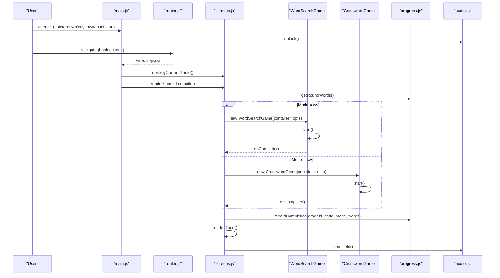

**Diagram sources**
- [main.js:1-97](file://src/literacy/wordquest/js/main.js#L1-L97)
- [router.js:1-65](file://src/literacy/wordquest/js/router.js#L1-L65)
- [screens.js:1-476](file://src/literacy/wordquest/js/screens.js#L1-L476)
- [progress.js:1-128](file://src/literacy/wordquest/js/progress.js#L1-L128)
- [audio.js:1-202](file://src/literacy/wordquest/js/audio.js#L1-L202)
- [controller.js (Word Search):1-821](file://src/literacy/wordquest/js/wordsearch/controller.js#L1-L821)
- [controller.js (Crossword):1-815](file://src/literacy/wordquest/js/crossword/controller.js#L1-L815)

## Detailed Component Analysis

### Routing System
- Parses hash paths like #/g/:grade/:cat/:mode/play and query parameters.
- Emits route objects with fields grade, cat, mode, action to the main handler.
- Supports deep-linking via ?grade=g2 on home to jump to categories.

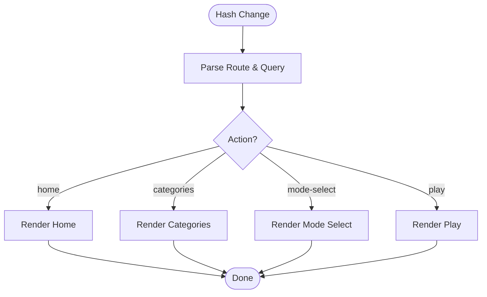

**Diagram sources**
- [router.js:1-65](file://src/literacy/wordquest/js/router.js#L1-L65)
- [main.js:1-97](file://src/literacy/wordquest/js/main.js#L1-L97)

**Section sources**
- [router.js:1-65](file://src/literacy/wordquest/js/router.js#L1-L65)
- [main.js:1-97](file://src/literacy/wordquest/js/main.js#L1-L97)

### Screen Management and Game Orchestration
- Renders four primary screens plus completion overlay.
- Destroys previous game instance on route change to release listeners and DOM.
- For Word Search, replaces built-in completion card with unified done overlay.
- For Crossword, appends done overlay below solved board.
- Computes crossword usability by counting words with 3–8 pure lowercase letters.

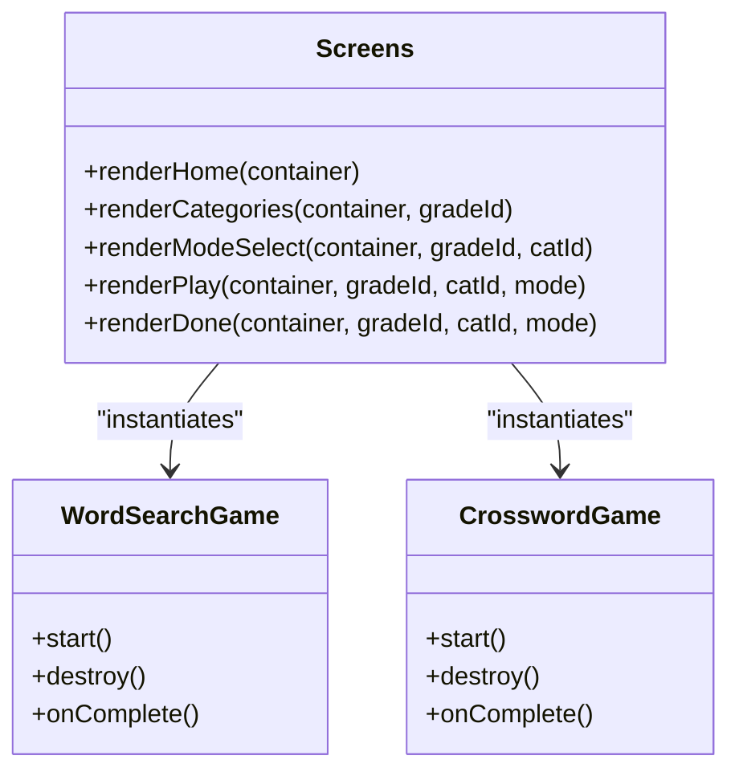

**Diagram sources**
- [screens.js:1-476](file://src/literacy/wordquest/js/screens.js#L1-L476)
- [controller.js (Word Search):1-821](file://src/literacy/wordquest/js/wordsearch/controller.js#L1-L821)
- [controller.js (Crossword):1-815](file://src/literacy/wordquest/js/crossword/controller.js#L1-L815)

**Section sources**
- [screens.js:1-476](file://src/literacy/wordquest/js/screens.js#L1-L476)

### Shared Data Management
- VOCAB contains categorized word lists per grade.
- GRADES defines grade metadata used in UI.
- WordUtil normalizes words for grids and selects fresh rounds excluding seen words.

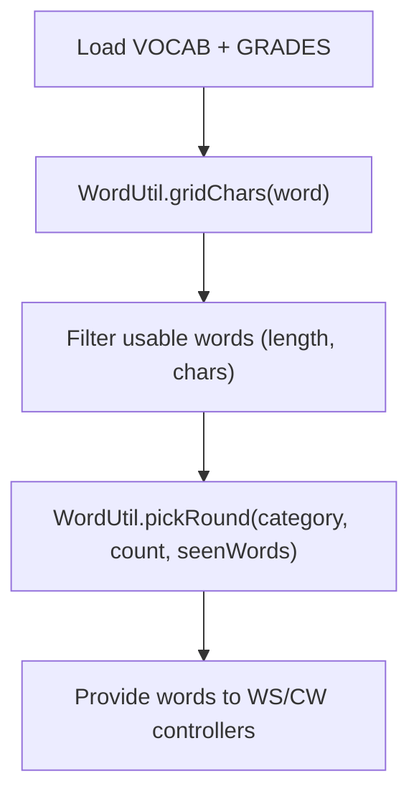

**Diagram sources**
- [data.js:1-117](file://src/literacy/wordquest/js/data.js#L1-L117)

**Section sources**
- [data.js:1-117](file://src/literacy/wordquest/js/data.js#L1-L117)

### Progress Tracking System
- Stores progress under a single localStorage key with versioned structure.
- Tracks rounds, cursor, and stars for ws/cw modes per category.
- Advances cursor when both modes are completed for a round.
- Aggregates grade-level progress for display on home screen.

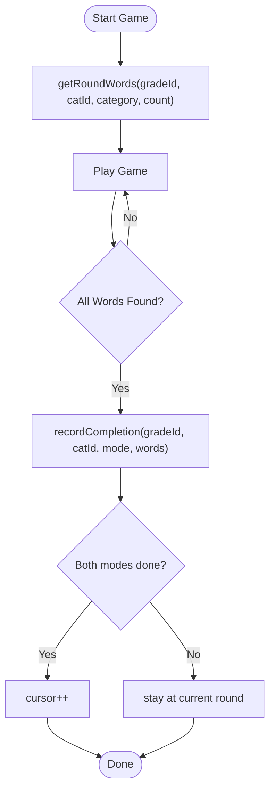

**Diagram sources**
- [progress.js:1-128](file://src/literacy/wordquest/js/progress.js#L1-L128)
- [screens.js:1-476](file://src/literacy/wordquest/js/screens.js#L1-L476)

**Section sources**
- [progress.js:1-128](file://src/literacy/wordquest/js/progress.js#L1-L128)
- [screens.js:1-476](file://src/literacy/wordquest/js/screens.js#L1-L476)

### Word Search Grid Generation Algorithm
- Cleans and deduplicates words using WordUtil.gridChars.
- Computes grid size based on longest word and total letters, constrained by grade ranges.
- Places words with grade-appropriate direction sets (KG: 2 dirs → G3: 8 dirs), long words first, up to 100 attempts per word, allowing same-letter overlaps.
- Up to 5 full reshuffles; last attempt accepts partial results.
- Fills empty cells with 70% from placed letters pool and 30% weighted by English frequency.

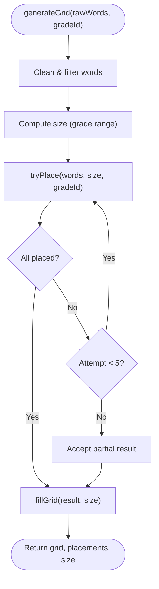

**Diagram sources**
- [grid.js (Word Search):1-201](file://src/literacy/wordquest/js/wordsearch/grid.js#L1-L201)
- [data.js:1-117](file://src/literacy/wordquest/js/data.js#L1-L117)

**Section sources**
- [grid.js (Word Search):1-201](file://src/literacy/wordquest/js/wordsearch/grid.js#L1-L201)
- [data.js:1-117](file://src/literacy/wordquest/js/data.js#L1-L117)

### Crossword Puzzle Layout System
- Generator filters words to 3–8 pure lowercase letters, deduplicates, and selects up to 8 for placement.
- Multi-seed retry (40 seeds) with long-first ordering; scores placements by placed count minus bounding box area.
- Strict canPlace constraints prevent accidental merging and parallel fusion; requires at least one new cell.
- Template fallback alternates horizontal/vertical placement through any matching letter if initial placement is poor.
- Layout converts sparse map to dense grid, shifts coordinates, and assigns sequential clue numbers following standard conventions.

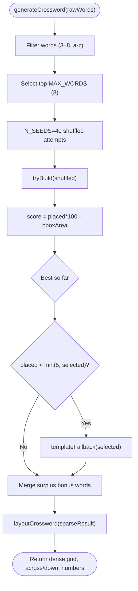

**Diagram sources**
- [generator.js (Crossword):1-398](file://src/literacy/wordquest/js/crossword/generator.js#L1-L398)
- [layout.js (Crossword):1-163](file://src/literacy/wordquest/js/crossword/layout.js#L1-L163)

**Section sources**
- [generator.js (Crossword):1-398](file://src/literacy/wordquest/js/crossword/generator.js#L1-L398)
- [layout.js (Crossword):1-163](file://src/literacy/wordquest/js/crossword/layout.js#L1-L163)

### Voice Control Integration for Accessibility
- Speech engine unlock on first user gesture; restores saved accent/voice preference.
- Accent buttons set default/us/uk; specific voice selection overrides accent.
- Voice switcher UI groups voices by accent and syncs active state; previews sample text.
- showVoiceControl toggles visibility during gameplay vs non-game screens.

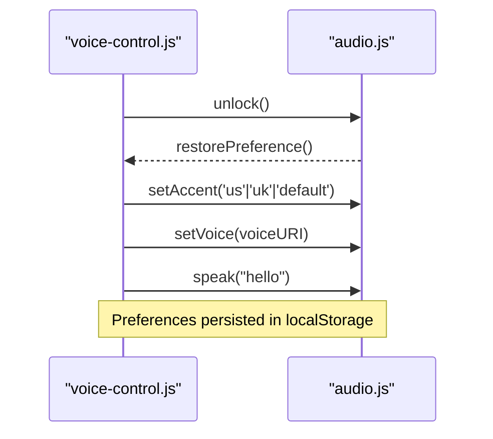

**Diagram sources**
- [voice-control.js:1-157](file://src/literacy/wordquest/js/voice-control.js#L1-L157)
- [audio.js:1-202](file://src/literacy/wordquest/js/audio.js#L1-L202)

**Section sources**
- [voice-control.js:1-157](file://src/literacy/wordquest/js/voice-control.js#L1-L157)
- [audio.js:1-202](file://src/literacy/wordquest/js/audio.js#L1-L202)

### Audio Feedback Mechanisms
- Speech synthesis speaks found words, hints, and completion messages.
- Sound effects use oscillators: correct (ascending triad), wrong (descending buzz), complete (arpeggio), found (short ascending pair).
- Audio contexts unlocked on first interaction to comply with browser policies.

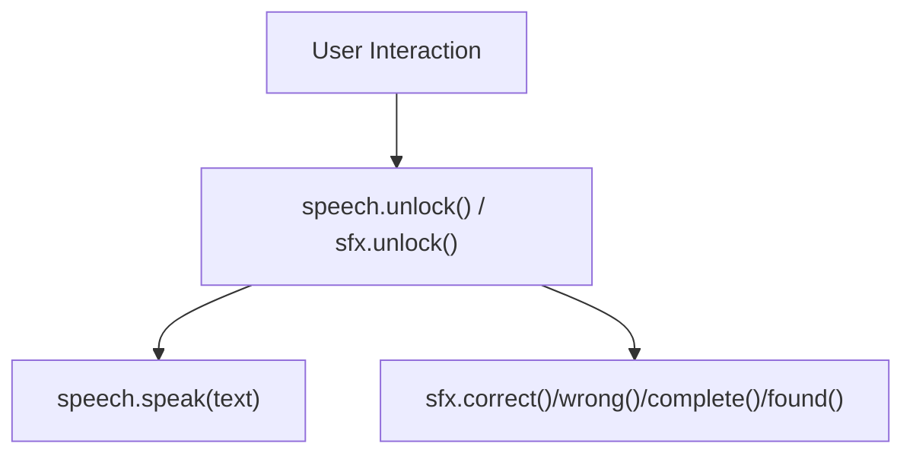

**Diagram sources**
- [audio.js:1-202](file://src/literacy/wordquest/js/audio.js#L1-L202)
- [controller.js (Word Search):1-821](file://src/literacy/wordquest/js/wordsearch/controller.js#L1-L821)
- [controller.js (Crossword):1-815](file://src/literacy/wordquest/js/crossword/controller.js#L1-L815)

**Section sources**
- [audio.js:1-202](file://src/literacy/wordquest/js/audio.js#L1-L202)
- [controller.js (Word Search):1-821](file://src/literacy/wordquest/js/wordsearch/controller.js#L1-L821)
- [controller.js (Crossword):1-815](file://src/literacy/wordquest/js/crossword/controller.js#L1-L815)

### Progressive Web App Capabilities and Offline Functionality
- Manifest defines app name, icons, start URL, display mode, theme color, and scope.
- Service worker pre-caches essential assets, activates immediately, and cleans old caches.
- Fetch strategy: network-first for HTML with cache fallback; stale-while-revalidate for static assets.

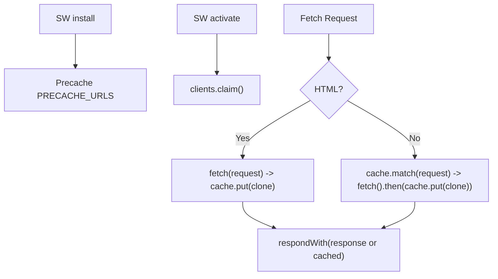

**Diagram sources**
- [manifest.json:1-22](file://src/manifest.json#L1-L22)
- [sw.js:1-130](file://src/sw.js#L1-L130)

**Section sources**
- [manifest.json:1-22](file://src/manifest.json#L1-L22)
- [sw.js:1-130](file://src/sw.js#L1-L130)

### Adding New Word Lists and Curriculum Integration
- Maintain vocabulary.md with grade headers and category sections containing comma-separated word lists.
- Run convert-vocab.js to regenerate data.js exports (VOCAB, GRADES, WordUtil).
- Integrate curriculum content by adding categories aligned to learning objectives; ensure words meet grid/crossword constraints.

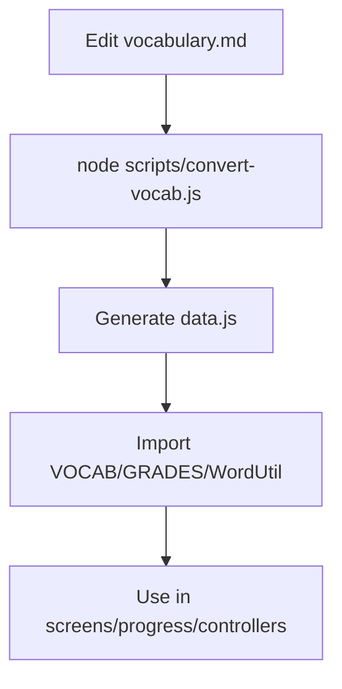

**Diagram sources**
- [convert-vocab.js:1-225](file://scripts/convert-vocab.js#L1-L225)
- [data.js:1-117](file://src/literacy/wordquest/js/data.js#L1-L117)

**Section sources**
- [convert-vocab.js:1-225](file://scripts/convert-vocab.js#L1-L225)
- [data.js:1-117](file://src/literacy/wordquest/js/data.js#L1-L117)

### Customizing Puzzle Difficulty
- Word Search difficulty scales via grade-specific direction sets and grid size ranges.
- Crossword usability depends on count of words with 3–8 pure lowercase letters; fewer than 4 disables crossword mode.
- Adjust grade ranges and direction sets in grid generation to tailor complexity.

**Section sources**
- [grid.js (Word Search):1-201](file://src/literacy/wordquest/js/wordsearch/grid.js#L1-L201)
- [screens.js:1-476](file://src/literacy/wordquest/js/screens.js#L1-L476)

### Implementing New Game Types
- Create a new controller module with start(), destroy(), and completion callbacks.
- Register a new mode in screens.js renderModeSelect and renderPlay.
- Update router actions if needed and integrate with progress tracking.

[No sources needed since this section provides general guidance]

### Student Progress Monitoring Features
- Per-category stars for ws/cw modes persist in localStorage.
- Grade-level aggregation displays total, wsDone, cwDone, fullyDone counts.
- Cursor advances only when both modes are completed for a round.

**Section sources**
- [progress.js:1-128](file://src/literacy/wordquest/js/progress.js#L1-L128)
- [screens.js:1-476](file://src/literacy/wordquest/js/screens.js#L1-L476)

## Dependency Analysis
The application exhibits low coupling between controllers and shared modules. Screens orchestrate game instances and depend on data, progress, audio, and router. Controllers depend on generators/layouts and audio. The data module is central for word lists and utilities.

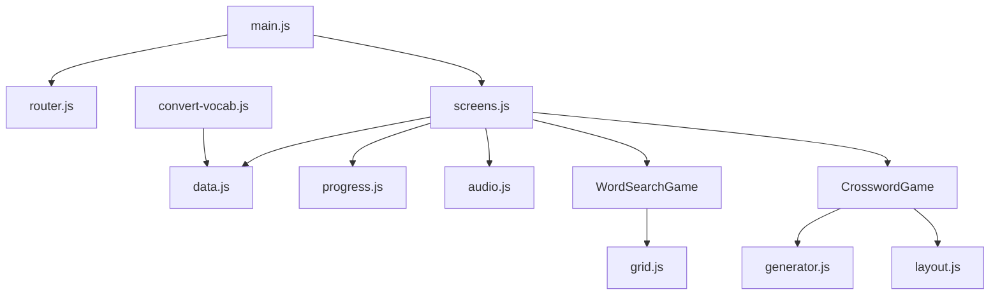

**Diagram sources**
- [main.js:1-97](file://src/literacy/wordquest/js/main.js#L1-L97)
- [router.js:1-65](file://src/literacy/wordquest/js/router.js#L1-L65)
- [screens.js:1-476](file://src/literacy/wordquest/js/screens.js#L1-L476)
- [data.js:1-117](file://src/literacy/wordquest/js/data.js#L1-L117)
- [progress.js:1-128](file://src/literacy/wordquest/js/progress.js#L1-L128)
- [audio.js:1-202](file://src/literacy/wordquest/js/audio.js#L1-L202)
- [controller.js (Word Search):1-821](file://src/literacy/wordquest/js/wordsearch/controller.js#L1-L821)
- [grid.js (Word Search):1-201](file://src/literacy/wordquest/js/wordsearch/grid.js#L1-L201)
- [controller.js (Crossword):1-815](file://src/literacy/wordquest/js/crossword/controller.js#L1-L815)
- [generator.js (Crossword):1-398](file://src/literacy/wordquest/js/crossword/generator.js#L1-L398)
- [layout.js (Crossword):1-163](file://src/literacy/wordquest/js/crossword/layout.js#L1-L163)
- [convert-vocab.js:1-225](file://scripts/convert-vocab.js#L1-L225)

**Section sources**
- [main.js:1-97](file://src/literacy/wordquest/js/main.js#L1-L97)
- [router.js:1-65](file://src/literacy/wordquest/js/router.js#L1-L65)
- [screens.js:1-476](file://src/literacy/wordquest/js/screens.js#L1-L476)
- [data.js:1-117](file://src/literacy/wordquest/js/data.js#L1-L117)
- [progress.js:1-128](file://src/literacy/wordquest/js/progress.js#L1-L128)
- [audio.js:1-202](file://src/literacy/wordquest/js/audio.js#L1-L202)
- [controller.js (Word Search):1-821](file://src/literacy/wordquest/js/wordsearch/controller.js#L1-L821)
- [grid.js (Word Search):1-201](file://src/literacy/wordquest/js/wordsearch/grid.js#L1-L201)
- [controller.js (Crossword):1-815](file://src/literacy/wordquest/js/crossword/controller.js#L1-L815)
- [generator.js (Crossword):1-398](file://src/literacy/wordquest/js/crossword/generator.js#L1-L398)
- [layout.js (Crossword):1-163](file://src/literacy/wordquest/js/crossword/layout.js#L1-L163)
- [convert-vocab.js:1-225](file://scripts/convert-vocab.js#L1-L225)

## Performance Considerations
- Word Search grid generation uses bounded attempts and partial acceptance to avoid infinite loops; keep word counts reasonable for performance.
- Crossword generator employs multi-seed retries and scoring to balance quality and runtime; limit MAX_WORDS and candidates to maintain responsiveness.
- Audio unlocks are idempotent and guarded; avoid repeated initialization.
- DOM updates are scoped to game containers; destroyPreviousGame ensures cleanup of listeners and elements.

[No sources needed since this section provides general guidance]

## Troubleshooting Guide
- If crossword mode is disabled, verify sufficient words with 3–8 pure lowercase letters in the category.
- If speech does not play, ensure first user interaction occurs to unlock audio engines.
- If progress resets unexpectedly, check localStorage availability and storage quotas.
- If offline behavior fails, confirm service worker registration and cache keys.

**Section sources**
- [screens.js:1-476](file://src/literacy/wordquest/js/screens.js#L1-L476)
- [audio.js:1-202](file://src/literacy/wordquest/js/audio.js#L1-L202)
- [progress.js:1-128](file://src/literacy/wordquest/js/progress.js#L1-L128)
- [sw.js:1-130](file://src/sw.js#L1-L130)

## Conclusion
WordQuest provides a robust, modular framework for vocabulary games with clear separation of concerns, reliable puzzle generation algorithms, accessible audio features, and persistent progress tracking. Its PWA setup enables offline usage, while the routing and screen management offer smooth navigation. Educators can extend the suite by adding new word lists, customizing difficulty, and implementing additional game types integrated with curriculum content.

[No sources needed since this section summarizes without analyzing specific files]

## Appendices

### API Definitions for Key Modules
- Router
  - init(onChange): Registers hashchange listener and fires initial parse.
  - navigate(hash): Updates window.location.hash.
  - parseRoute(): Returns {grade, cat, mode, action}.
  - parseQuery(): Returns URLSearchParams.
- Screens
  - renderHome(container): Displays grade cards with progress dots.
  - renderCategories(container, gradeId): Shows categories with star indicators.
  - renderModeSelect(container, gradeId, catId): Chooses ws/cw with usability checks.
  - renderPlay(container, gradeId, catId, mode): Instantiates game and handles completion.
  - renderDone(container, gradeId, catId, mode): Shows celebration overlay and navigation.
- Progress
  - getCategory(gradeId, catId): Returns category progress object.
  - recordCompletion(gradeId, catId, mode, words): Marks mode completion and advances cursor.
  - getRoundWords(gradeId, catId, category, count): Picks fresh words excluding seen.
  - getGradeProgress(gradeId): Aggregates totals for grade.
- Audio
  - speech.unlock(): Initializes speech synthesis and restores preference.
  - speech.setAccent(accent): Sets accent preference.
  - speech.setVoice(voiceURI): Sets specific voice preference.
  - speech.speak(text, opts): Speaks text with rate/lang options.
  - sfx.correct()/wrong()/complete()/found(): Plays oscillator-based tones.
- Word Search Controller
  - constructor(container, options): Accepts words, gradeId, callbacks.
  - start(): Generates grid, injects styles, renders UI, binds events.
  - destroy(): Unbinds events and cleans up resources.
- Crossword Controller
  - constructor(container, options): Accepts words, gradeId, callbacks.
  - start(): Generates layout, renders board/bank/clues, binds events.
  - destroy(): Unbinds events and cleans up resources.

**Section sources**
- [router.js:1-65](file://src/literacy/wordquest/js/router.js#L1-L65)
- [screens.js:1-476](file://src/literacy/wordquest/js/screens.js#L1-L476)
- [progress.js:1-128](file://src/literacy/wordquest/js/progress.js#L1-L128)
- [audio.js:1-202](file://src/literacy/wordquest/js/audio.js#L1-L202)
- [controller.js (Word Search):1-821](file://src/literacy/wordquest/js/wordsearch/controller.js#L1-L821)
- [controller.js (Crossword):1-815](file://src/literacy/wordquest/js/crossword/controller.js#L1-L815)