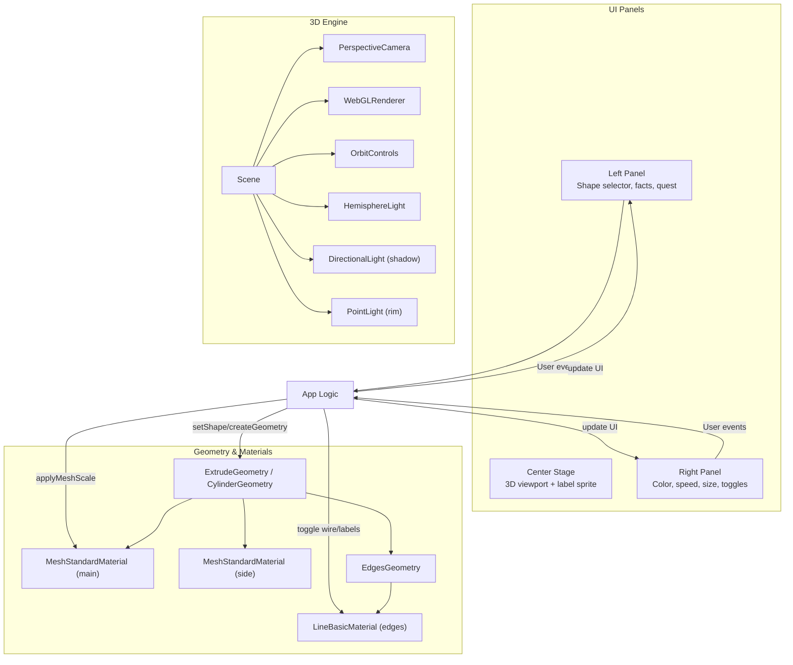
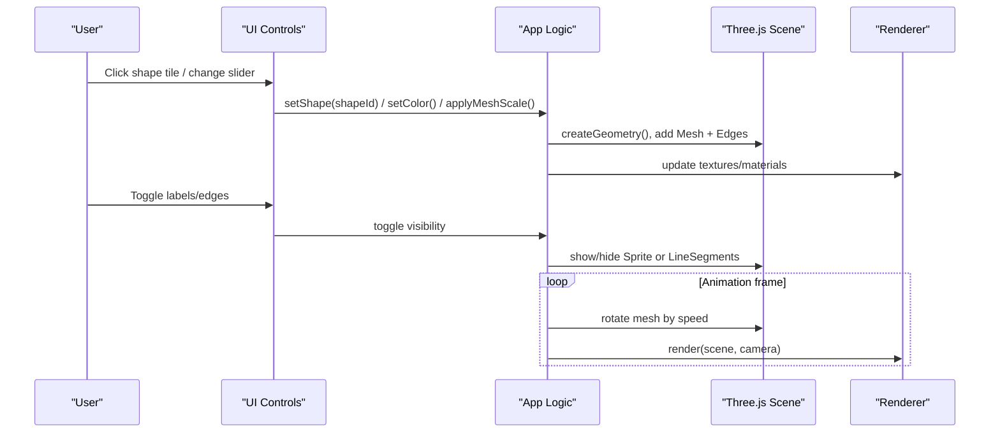
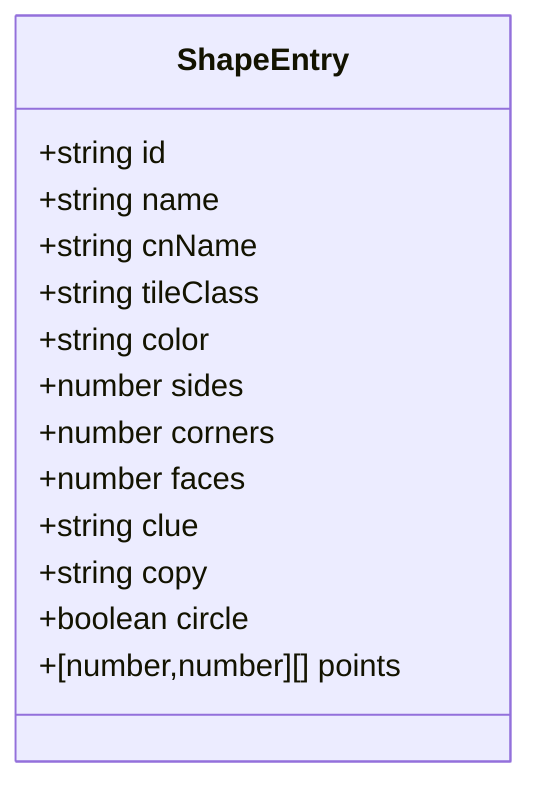
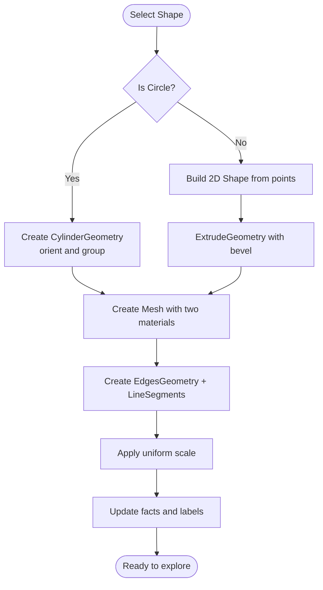
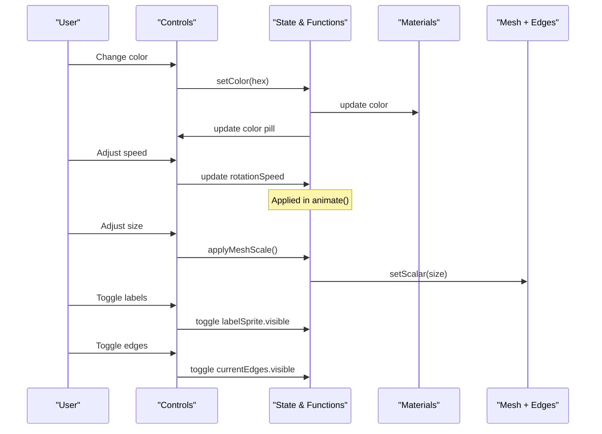
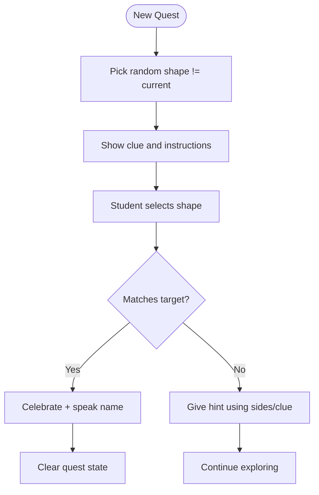
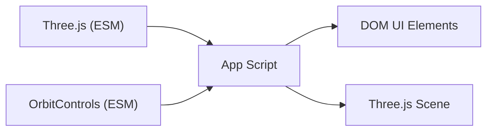

# 3D Shape Explorer

<cite>
**Referenced Files in This Document**
- [g1_3D_shape.html](file://src/math/g1_3D_shape.html)
- [README.md](file://README.md)
</cite>

## Table of Contents
1. [Introduction](#introduction)
2. [Project Structure](#project-structure)
3. [Core Components](#core-components)
4. [Architecture Overview](#architecture-overview)
5. [Detailed Component Analysis](#detailed-component-analysis)
6. [Dependency Analysis](#dependency-analysis)
7. [Performance Considerations](#performance-considerations)
8. [Troubleshooting Guide](#troubleshooting-guide)
9. [Conclusion](#conclusion)
10. [Appendices](#appendices)

## Introduction
The 3D Shape Explorer is an interactive geometry learning tool designed for early learners. It uses Three.js to render manipulatable 3D shapes and provides intuitive controls for rotation, scaling, color, and visual helpers such as labels and edge outlines. The application includes educational algorithms that deliver real-time feedback about shape characteristics (sides, corners, faces), a “Name Quest” activity for guided discovery, and accessibility features like ARIA live regions and keyboard focus styles.

This document explains how the app renders 3D shapes, how user interactions drive behavior, and how educators can extend it with new shapes, measurement tools, and curriculum-aligned activities. It also covers performance optimization strategies and inclusive design considerations.

## Project Structure
The 3D Shape Explorer is implemented as a single-page HTML application with embedded CSS and JavaScript. It imports Three.js via ES modules from a CDN and uses OrbitControls for camera interaction. The UI is organized into three panels:
- Left panel: shape selection, facts display, and Name Quest activity
- Center stage: 3D viewport with floating label overlay
- Right panel: controls for color, rotation speed, size, and toggles for labels and edges

**Diagram sources**
- [g1_3D_shape.html:820-852](file://src/math/g1_3D_shape.html#L820-L852)
- [g1_3D_shape.html:866-879](file://src/math/g1_3D_shape.html#L866-L879)
- [g1_3D_shape.html:992-1007](file://src/math/g1_3D_shape.html#L992-L1007)
- [g1_3D_shape.html:1013-1042](file://src/math/g1_3D_shape.html#L1013-L1042)

**Section sources**
- [g1_3D_shape.html:560-663](file://src/math/g1_3D_shape.html#L560-L663)
- [g1_3D_shape.html:820-852](file://src/math/g1_3D_shape.html#L820-L852)

## Core Components
- Shape catalog: A data structure defines available shapes, including metadata (name, bilingual name, tile class, color, sides, corners, faces, clue, copy text, and optional points or circle flag).
- Geometry factory: Creates either a cylinder (for circular faces) or an extruded polygon based on the selected shape’s definition.
- Mesh and edges: A main mesh with two materials (front and side) plus an EdgesGeometry overlay for wireframe visualization.
- Controls: Color picker, quick swatches, rotation speed slider, size slider, and toggles for labels and edges.
- Educational feedback: Real-time updates of sides/corners/faces; Name Quest mode with randomized prompts and answer checking; speech synthesis for pronunciation.
- Camera and lighting: Perspective camera with OrbitControls, hemisphere light, directional key light with soft shadows, and rim point light.

Key responsibilities and behaviors are implemented within the single script module in the HTML file.

**Section sources**
- [g1_3D_shape.html:669-787](file://src/math/g1_3D_shape.html#L669-L787)
- [g1_3D_shape.html:974-1007](file://src/math/g1_3D_shape.html#L974-L1007)
- [g1_3D_shape.html:1013-1042](file://src/math/g1_3D_shape.html#L1013-L1042)
- [g1_3D_shape.html:1052-1064](file://src/math/g1_3D_shape.html#L1052-L1064)
- [g1_3D_shape.html:1116-1141](file://src/math/g1_3D_shape.html#L1116-L1141)
- [g1_3D_shape.html:1143-1153](file://src/math/g1_3D_shape.html#L1143-L1153)
- [g1_3D_shape.html:820-852](file://src/math/g1_3D_shape.html#L820-L852)

## Architecture Overview
The application follows a simple event-driven architecture:
- User interactions update state and call functions to rebuild or modify the 3D scene.
- The animation loop continuously rotates the mesh according to the current speed setting and updates the label sprite to face the camera.
- UI elements reflect current state and provide immediate feedback.

**Diagram sources**
- [g1_3D_shape.html:908-972](file://src/math/g1_3D_shape.html#L908-L972)
- [g1_3D_shape.html:974-1007](file://src/math/g1_3D_shape.html#L974-L1007)
- [g1_3D_shape.html:1196-1210](file://src/math/g1_3D_shape.html#L1196-L1210)

## Detailed Component Analysis

### Shape Catalog and Data Model
- Each shape entry contains:
  - Identifier and names (English and Chinese)
  - Tile styling class for the grid icon
  - Default color
  - Educational counts: sides, corners, faces
  - Clue and descriptive copy for quests and stage text
  - Either explicit 2D points for extrusion or a circle flag for cylindrical forms
- The catalog drives both the UI tiles and the 3D geometry creation.

**Diagram sources**
- [g1_3D_shape.html:669-787](file://src/math/g1_3D_shape.html#L669-L787)

**Section sources**
- [g1_3D_shape.html:669-787](file://src/math/g1_3D_shape.html#L669-L787)

### Geometry Factory and Rendering Pipeline
- For circular faces, a cylinder geometry is created and oriented appropriately.
- For polygons, a 2D path is constructed from points and extruded into a 3D solid with beveling.
- The resulting geometry is used to build:
  - A main mesh with two materials (front and side)
  - An EdgesGeometry overlay for wireframe visualization
- The mesh is rotated slightly for better initial viewing and scaled uniformly based on the size control.

**Diagram sources**
- [g1_3D_shape.html:1013-1042](file://src/math/g1_3D_shape.html#L1013-L1042)
- [g1_3D_shape.html:992-1007](file://src/math/g1_3D_shape.html#L992-L1007)
- [g1_3D_shape.html:1044-1050](file://src/math/g1_3D_shape.html#L1044-L1050)

**Section sources**
- [g1_3D_shape.html:974-1007](file://src/math/g1_3D_shape.html#L974-L1007)
- [g1_3D_shape.html:1013-1042](file://src/math/g1_3D_shape.html#L1013-L1042)
- [g1_3D_shape.html:1044-1050](file://src/math/g1_3D_shape.html#L1044-L1050)

### Interaction Controls and State Management
- Color: Picker and swatches update material color and UI pill text.
- Rotation speed: Slider adjusts per-frame rotation increments.
- Size: Slider applies uniform scale to mesh and edges.
- Labels: Toggles a canvas-based sprite overlay above the shape.
- Edges: Toggles visibility of the wireframe overlay.
- Camera reset: Restores default camera position and target.

**Diagram sources**
- [g1_3D_shape.html:933-972](file://src/math/g1_3D_shape.html#L933-L972)
- [g1_3D_shape.html:1066-1086](file://src/math/g1_3D_shape.html#L1066-L1086)
- [g1_3D_shape.html:1044-1050](file://src/math/g1_3D_shape.html#L1044-L1050)
- [g1_3D_shape.html:1196-1210](file://src/math/g1_3D_shape.html#L1196-L1210)

**Section sources**
- [g1_3D_shape.html:908-972](file://src/math/g1_3D_shape.html#L908-L972)
- [g1_3D_shape.html:1066-1086](file://src/math/g1_3D_shape.html#L1066-L1086)
- [g1_3D_shape.html:1196-1210](file://src/math/g1_3D_shape.html#L1196-L1210)

### Educational Algorithms and Feedback
- Facts panel: Displays sides, corners, and 3D faces derived from the shape catalog.
- Stage copy: Provides age-appropriate descriptions tied to the selected shape.
- Name Quest: Randomly selects a target shape and presents a clue; students choose the matching shape and receive immediate feedback.
- Speech synthesis: Pronounces the shape name when requested.

**Diagram sources**
- [g1_3D_shape.html:1116-1141](file://src/math/g1_3D_shape.html#L1116-L1141)
- [g1_3D_shape.html:1143-1153](file://src/math/g1_3D_shape.html#L1143-L1153)

**Section sources**
- [g1_3D_shape.html:1052-1064](file://src/math/g1_3D_shape.html#L1052-L1064)
- [g1_3D_shape.html:1116-1141](file://src/math/g1_3D_shape.html#L1116-L1141)
- [g1_3D_shape.html:1143-1153](file://src/math/g1_3D_shape.html#L1143-L1153)

### Accessibility and Inclusive Design
- ARIA attributes: Buttons use aria-pressed; panels have aria-labels; live regions announce changes.
- Focus styles: Visible outline for keyboard navigation.
- Large touch targets: Buttons and controls meet minimum sizing guidelines.
- Responsive layout: Adapts to smaller screens with stacked panels and adjusted FOV/targets.

**Section sources**
- [g1_3D_shape.html:560-663](file://src/math/g1_3D_shape.html#L560-L663)
- [g1_3D_shape.html:1176-1190](file://src/math/g1_3D_shape.html#L1176-L1190)

## Dependency Analysis
- External dependencies:
  - Three.js core and OrbitControls imported via ES modules from a CDN.
- Internal dependencies:
  - UI elements reference DOM IDs and classes defined in the same file.
  - The animation loop depends on requestAnimationFrame and renderer state.

**Diagram sources**
- [g1_3D_shape.html:666-667](file://src/math/g1_3D_shape.html#L666-L667)
- [g1_3D_shape.html:820-852](file://src/math/g1_3D_shape.html#L820-L852)

**Section sources**
- [g1_3D_shape.html:666-667](file://src/math/g1_3D_shape.html#L666-L667)
- [g1_3D_shape.html:820-852](file://src/math/g1_3D_shape.html#L820-L852)

## Performance Considerations
- Pixel ratio capping: Renderer pixel ratio is capped to balance clarity and GPU load.
- Shadow map quality: Soft shadow maps enabled with reasonable resolution.
- Geometry reuse: Current geometry is disposed before creating a new one to avoid memory leaks.
- Lightweight overlays: Label sprite uses a canvas texture updated only when needed.
- Responsive FOV: Adjusts field of view and camera target on narrow screens to maintain framing.

Recommendations for further optimization:
- Precompute and cache geometries per shape type if frequently switching.
- Use instancing for decorative background markers if increased in count.
- Reduce shadow map size or disable shadows on low-end devices.
- Throttle expensive operations (e.g., label redraw) to user-triggered events rather than every frame.

**Section sources**
- [g1_3D_shape.html:827-831](file://src/math/g1_3D_shape.html#L827-L831)
- [g1_3D_shape.html:982-990](file://src/math/g1_3D_shape.html#L982-L990)
- [g1_3D_shape.html:1176-1190](file://src/math/g1_3D_shape.html#L1176-L1190)

## Troubleshooting Guide
- No 3D content visible:
  - Ensure WebGL is supported and the canvas container has dimensions.
  - Verify the renderer is appended to the container and sized correctly.
- Shapes not rotating:
  - Confirm the animation loop is running and rotation speed is non-zero.
- Labels not showing:
  - Check the label toggle state and ensure the sprite is visible.
- Edges not visible:
  - Ensure the edges overlay is added and its visibility is enabled.
- Memory growth after switching shapes:
  - Confirm old geometries are removed and disposed before creating new ones.

**Section sources**
- [g1_3D_shape.html:827-831](file://src/math/g1_3D_shape.html#L827-L831)
- [g1_3D_shape.html:982-990](file://src/math/g1_3D_shape.html#L982-L990)
- [g1_3D_shape.html:1196-1210](file://src/math/g1_3D_shape.html#L1196-L1210)

## Conclusion
The 3D Shape Explorer combines a clear UI, robust Three.js rendering, and pedagogically sound feedback to help young learners explore geometric properties interactively. Its modular data model makes it straightforward to add new shapes, while built-in controls support exploration through rotation, scaling, and transparency-like visual aids (wireframes and labels). With thoughtful performance tuning and accessibility features, it offers an inclusive and engaging experience across devices.

## Appendices

### How to Add a New 3D Shape
- Extend the shape catalog with a new entry:
  - Provide id, names, tile class, color, sides, corners, faces, clue, copy.
  - If the shape has flat faces, supply points defining the 2D profile; otherwise set circle flag for a cylinder.
- The existing geometry factory will automatically create the correct 3D form.
- Optionally adjust default rotation or bevel parameters in the geometry creation function.

Implementation references:
- Shape catalog structure and entries
- Geometry factory logic for circles and extrusions

**Section sources**
- [g1_3D_shape.html:669-787](file://src/math/g1_3D_shape.html#L669-L787)
- [g1_3D_shape.html:1013-1042](file://src/math/g1_3D_shape.html#L1013-L1042)

### How to Create Measurement Tools
Conceptual steps:
- Introduce a ruler or caliper helper object aligned with the shape’s axes.
- Compute bounding box extents from the current mesh geometry and display measurements in the UI.
- Tie measurements to educational goals (e.g., comparing lengths, identifying symmetry axes).

Note: This section describes conceptual implementation guidance without referencing specific code files.

### Integrating Curriculum-Aligned Activities
- Align Name Quest clues with curriculum vocabulary and standards.
- Add badges or progress tracking for completed challenges.
- Provide teacher-facing hints and differentiation options (e.g., simplified vs. advanced clues).

Note: This section describes conceptual integration guidance without referencing specific code files.

### Accessibility Checklist
- Keyboard navigability: All controls reachable via Tab and operable with Enter/Space.
- Screen reader announcements: Use aria-live regions for dynamic updates.
- Color contrast: Ensure text and highlights meet contrast ratios.
- Motion sensitivity: Allow users to reduce or disable auto-rotation.

**Section sources**
- [g1_3D_shape.html:560-663](file://src/math/g1_3D_shape.html#L560-L663)