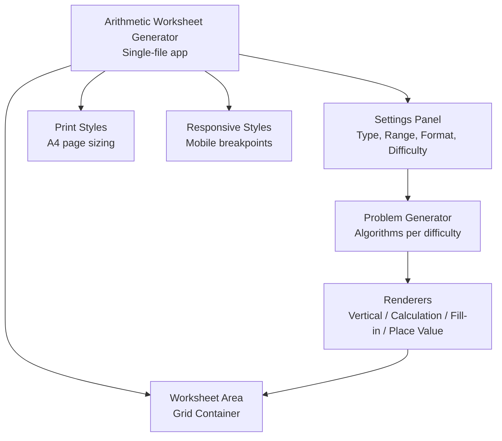
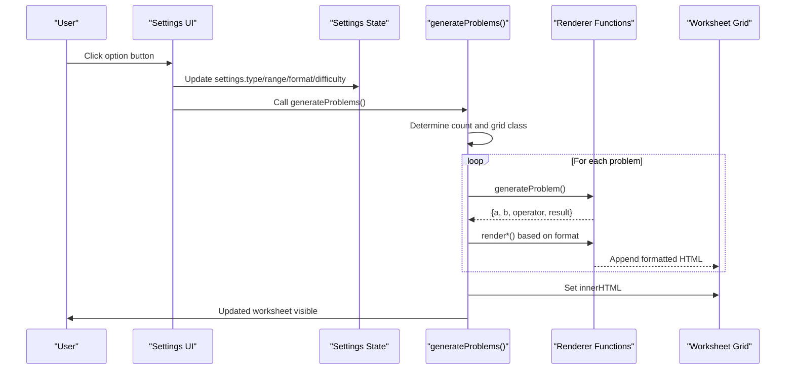
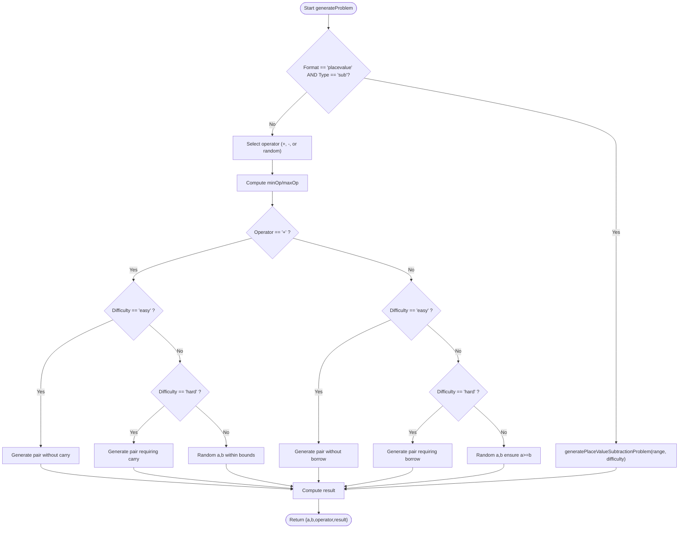
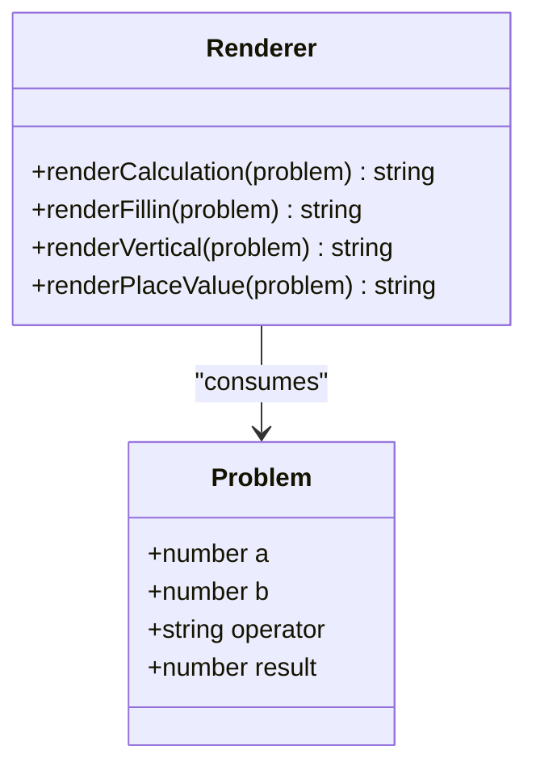
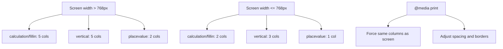
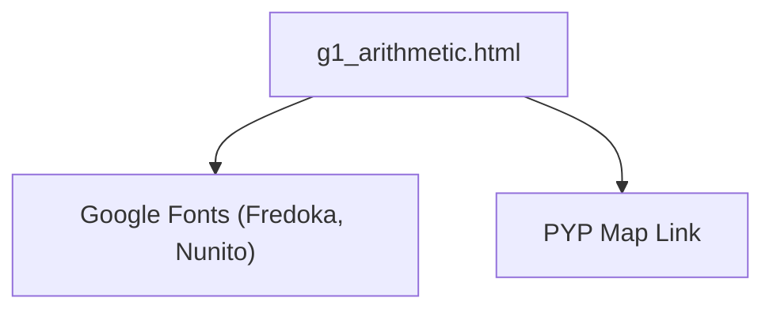

# Arithmetic Worksheet Generator

<cite>
**Referenced Files in This Document**
- [g1_arithmetic.html](file://src/math/g1_arithmetic.html)
- [README.md](file://README.md)
</cite>

## Table of Contents
1. [Introduction](#introduction)
2. [Project Structure](#project-structure)
3. [Core Components](#core-components)
4. [Architecture Overview](#architecture-overview)
5. [Detailed Component Analysis](#detailed-component-analysis)
6. [Dependency Analysis](#dependency-analysis)
7. [Performance Considerations](#performance-considerations)
8. [Troubleshooting Guide](#troubleshooting-guide)
9. [Conclusion](#conclusion)
10. [Appendices](#appendices)

## Introduction
The Arithmetic Worksheet Generator is a single-page, client-side tool for creating customizable math practice worksheets. It supports addition, subtraction, and mixed operations with configurable difficulty levels and number ranges from 10 to 1000. The generator produces four output formats:
- Vertical calculation
- Horizontal calculation
- Fill-in-blank
- Place value subtraction with borrowing visualization

It includes a responsive grid system that adapts from a 5-column desktop layout to mobile-friendly layouts, print optimization for A4 paper formatting, and accessibility features such as semantic headings, descriptive labels, and keyboard focus styles.

## Project Structure
The generator is implemented as a standalone HTML file with embedded CSS and JavaScript. It integrates into the IB PYP Games project structure under the math section and can be launched directly or via presets.

**Diagram sources**
- [g1_arithmetic.html:33-709](file://src/math/g1_arithmetic.html#L33-L709)
- [g1_arithmetic.html:832-1305](file://src/math/g1_arithmetic.html#L832-L1305)

**Section sources**
- [README.md:1-65](file://README.md#L1-L65)
- [g1_arithmetic.html:1-120](file://src/math/g1_arithmetic.html#L1-L120)

## Core Components
- Settings state and UI controls:
  - Problem type: Addition, Subtraction, Mixed
  - Number range: 10, 20, 50, 100, 200, 500, 1000
  - Format: Vertical, Calculation, Fill-in-blank, Place Value (Subtraction only)
  - Difficulty: Easy, Medium, Hard
- Problem generation engine:
  - Enforces digit requirements based on range
  - Ensures no-carry/easy addition, carry/hard addition
  - Ensures no-borrow/easy subtraction, borrow/hard subtraction
  - Supports mixed operator selection
- Rendering pipeline:
  - Formats problems into DOM nodes using template strings
  - Place value format renders a two-panel view: standard vertical and place-value table with borrow row
- Print and responsive behavior:
  - Grid columns adapt by breakpoint
  - Print media queries optimize spacing, fonts, and borders for A4

**Section sources**
- [g1_arithmetic.html:732-802](file://src/math/g1_arithmetic.html#L732-L802)
- [g1_arithmetic.html:832-939](file://src/math/g1_arithmetic.html#L832-L939)
- [g1_arithmetic.html:962-1156](file://src/math/g1_arithmetic.html#L962-L1156)
- [g1_arithmetic.html:1158-1242](file://src/math/g1_arithmetic.html#L1158-L1242)
- [g1_arithmetic.html:486-664](file://src/math/g1_arithmetic.html#L486-L664)
- [g1_arithmetic.html:666-707](file://src/math/g1_arithmetic.html#L666-L707)

## Architecture Overview
The application follows a simple event-driven flow: user interactions update settings, which trigger problem generation and rendering. Presets can preconfigure settings via URL query parameters.

**Diagram sources**
- [g1_arithmetic.html:885-939](file://src/math/g1_arithmetic.html#L885-L939)
- [g1_arithmetic.html:1260-1297](file://src/math/g1_arithmetic.html#L1260-L1297)
- [g1_arithmetic.html:990-1044](file://src/math/g1_arithmetic.html#L990-L1044)
- [g1_arithmetic.html:1158-1242](file://src/math/g1_arithmetic.html#L1158-L1242)

## Detailed Component Analysis

### Problem Generation Algorithm
The algorithm selects an operator based on the chosen type and difficulty, then generates operands that satisfy constraints:
- Range mapping:
  - minOperand(range): ensures minimum digits for higher ranges
  - maxOperand(range): expands upper bound for 4-digit numbers when range=1000
- Difficulty rules:
  - Easy addition: ones digits sum < 10 (no carrying)
  - Hard addition: ones digits sum >= 10 (requires carrying)
  - Easy subtraction: ones digit of minuend >= subtrahend (no borrowing)
  - Hard subtraction: ones digit of minuend < subtrahend (requires borrowing)
  - Medium: random within valid bounds while ensuring non-negative results

**Diagram sources**
- [g1_arithmetic.html:990-1044](file://src/math/g1_arithmetic.html#L990-L1044)
- [g1_arithmetic.html:1046-1156](file://src/math/g1_arithmetic.html#L1046-L1156)

**Section sources**
- [g1_arithmetic.html:962-1156](file://src/math/g1_arithmetic.html#L962-L1156)

### Output Formats and Rendering
- Vertical calculation:
  - Two rows with operator and underline; answer space provided below
- Horizontal calculation:
  - Inline expression with blank for answer
- Fill-in-blank:
  - Randomly hides one operand or the result
- Place value subtraction:
  - Displays both a standard vertical form and a place-value table with headers (Ones, Tens, Hundreds, Thousands), a borrow row, and empty answer cells

**Diagram sources**
- [g1_arithmetic.html:1158-1242](file://src/math/g1_arithmetic.html#L1158-L1242)

**Section sources**
- [g1_arithmetic.html:1158-1242](file://src/math/g1_arithmetic.html#L1158-L1242)

### Responsive Grid System
- Desktop:
  - Calculation, fill-in, and vertical formats use a 5-column grid
  - Place value uses a 2-column paired layout
- Mobile:
  - Calculation/fillin collapse to 2 columns
  - Vertical collapses to 3 columns
  - Place value collapses to 1 column
- Print:
  - Forces grid columns to match screen layout for consistency
  - Adjusts font sizes, gaps, and borders for A4

**Diagram sources**
- [g1_arithmetic.html:306-328](file://src/math/g1_arithmetic.html#L306-L328)
- [g1_arithmetic.html:666-707](file://src/math/g1_arithmetic.html#L666-L707)
- [g1_arithmetic.html:518-534](file://src/math/g1_arithmetic.html#L518-L534)

**Section sources**
- [g1_arithmetic.html:306-328](file://src/math/g1_arithmetic.html#L306-L328)
- [g1_arithmetic.html:666-707](file://src/math/g1_arithmetic.html#L666-L707)
- [g1_arithmetic.html:486-664](file://src/math/g1_arithmetic.html#L486-L664)

### Accessibility Features
- Semantic headings and labels:
  - Descriptive titles and aria-labels for tables
- Keyboard navigation:
  - Focus-visible outline styles for interactive elements
- Contrast and typography:
  - High-contrast text colors and readable fonts
- Print accessibility:
  - Removes decorative backgrounds and ensures borders are visible

**Section sources**
- [g1_arithmetic.html:110-131](file://src/math/g1_arithmetic.html#L110-L131)
- [g1_arithmetic.html:159-168](file://src/math/g1_arithmetic.html#L159-L168)
- [g1_arithmetic.html:1228](file://src/math/g1_arithmetic.html#L1228)
- [g1_arithmetic.html:1308-1312](file://src/math/g1_arithmetic.html#L1308-L1312)

### Print Optimization for A4 Paper
- Page size and margins set to A4
- Decorative panels hidden
- Grid columns forced to match screen layout
- Font sizes and line heights adjusted for compactness
- Borders and lines enforced for visibility

**Section sources**
- [g1_arithmetic.html:486-664](file://src/math/g1_arithmetic.html#L486-L664)

## Dependency Analysis
The generator has minimal external dependencies:
- Google Fonts for typography
- No third-party libraries; all logic is self-contained
- Integrates with the IB PYP Games site via return link and shared design expectations

**Diagram sources**
- [g1_arithmetic.html:28-31](file://src/math/g1_arithmetic.html#L28-L31)
- [g1_arithmetic.html:1307-1312](file://src/math/g1_arithmetic.html#L1307-L1312)

**Section sources**
- [g1_arithmetic.html:28-31](file://src/math/g1_arithmetic.html#L28-L31)
- [g1_arithmetic.html:1307-1312](file://src/math/g1_arithmetic.html#L1307-L1312)

## Performance Considerations
- Client-side generation avoids server round-trips
- Grid population uses batched innerHTML updates
- Place value rendering constructs lightweight tables
- Print styles avoid heavy decorations to reduce ink usage

[No sources needed since this section provides general guidance]

## Troubleshooting Guide
- Place value format not available:
  - Only enabled for subtraction; switching type hides it automatically
- Problems not appearing:
  - Ensure settings are updated and regenerate is called
- Print layout issues:
  - Disable browser headers/footers in print dialog
  - Verify A4 page size and margins in print settings

**Section sources**
- [g1_arithmetic.html:941-960](file://src/math/g1_arithmetic.html#L941-L960)
- [g1_arithmetic.html:803-811](file://src/math/g1_arithmetic.html#L803-L811)
- [g1_arithmetic.html:486-504](file://src/math/g1_arithmetic.html#L486-L504)

## Conclusion
The Arithmetic Worksheet Generator offers a flexible, accessible, and printable solution for math practice. Its clear separation of concerns—settings, generation algorithms, and renderers—makes it easy to extend with new operations, formats, and themes while maintaining consistent UX across devices and print media.

[No sources needed since this section summarizes without analyzing specific files]

## Appendices

### Extending Problem Types
- Add a new operation (e.g., multiplication):
  - Extend operator selection logic
  - Implement difficulty-specific generators for carry/borrow-like behaviors
  - Update renderers to support the new operation
  - Adjust title mapping and preset configurations

**Section sources**
- [g1_arithmetic.html:999-1006](file://src/math/g1_arithmetic.html#L999-L1006)
- [g1_arithmetic.html:1244-1258](file://src/math/g1_arithmetic.html#L1244-L1258)

### Customizing Visual Themes
- Modify CSS variables for colors and fonts
- Adjust border radii, shadows, and gradients
- Update print color adjustments and contrast

**Section sources**
- [g1_arithmetic.html:33-44](file://src/math/g1_arithmetic.html#L33-L44)
- [g1_arithmetic.html:486-664](file://src/math/g1_arithmetic.html#L486-L664)

### Adding New Mathematical Operations
- Integrate into generateProblem and difficulty helpers
- Provide renderers for horizontal, vertical, fill-in, and place value formats
- Ensure grid counts and print styles accommodate new content density

**Section sources**
- [g1_arithmetic.html:990-1044](file://src/math/g1_arithmetic.html#L990-L1044)
- [g1_arithmetic.html:1158-1242](file://src/math/g1_arithmetic.html#L1158-L1242)
- [g1_arithmetic.html:1260-1297](file://src/math/g1_arithmetic.html#L1260-L1297)