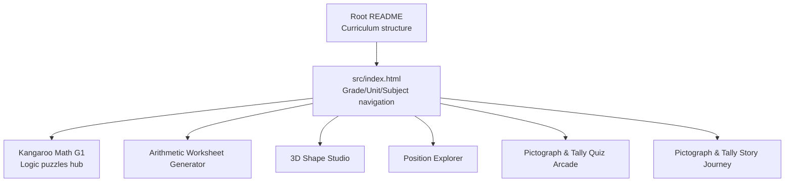
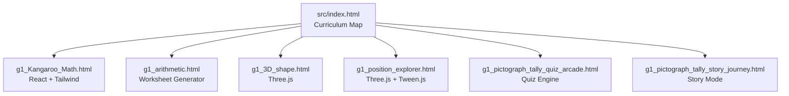
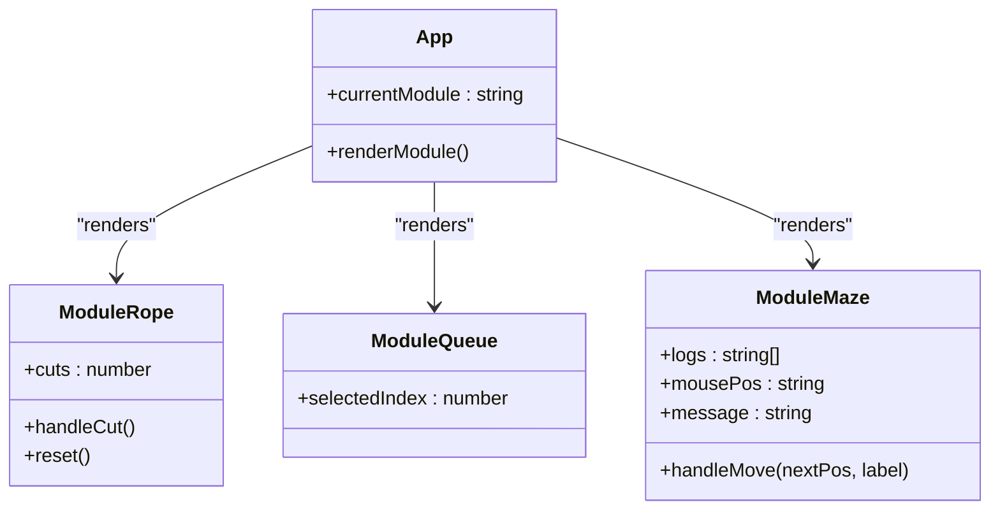
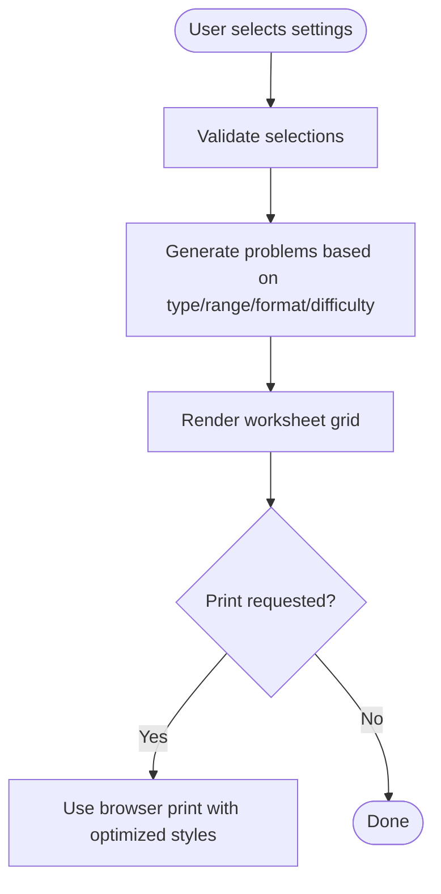
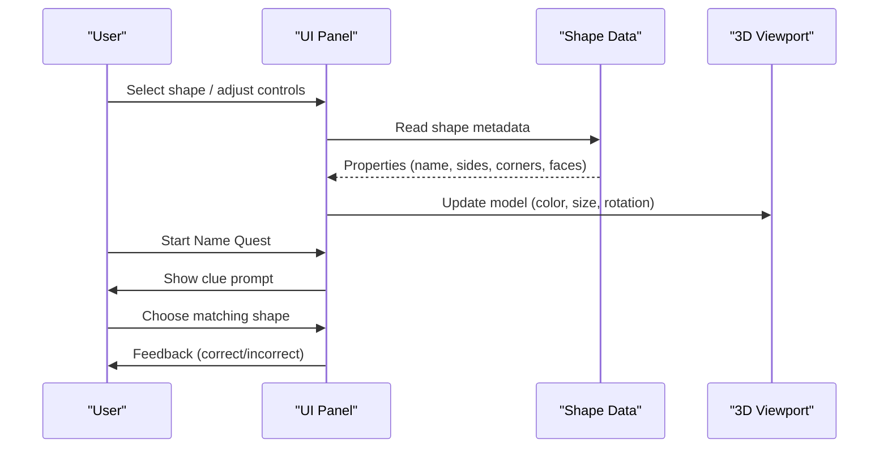
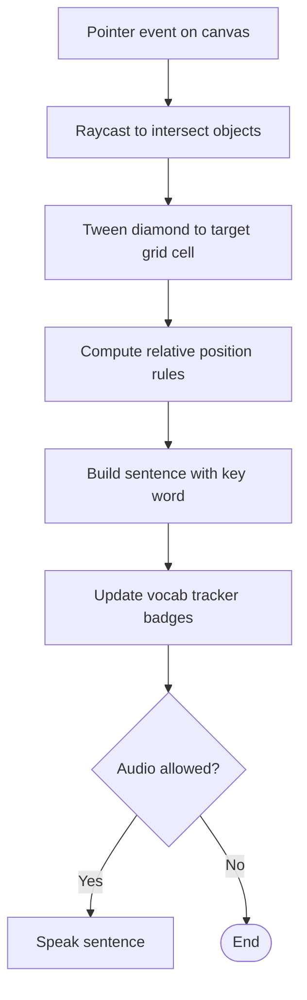
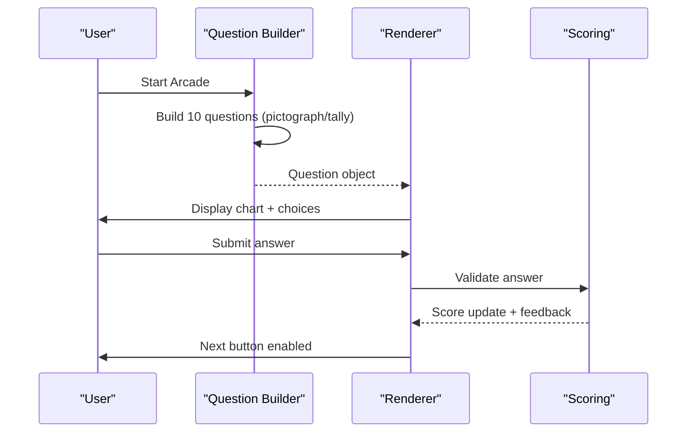
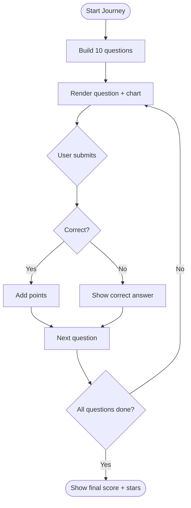
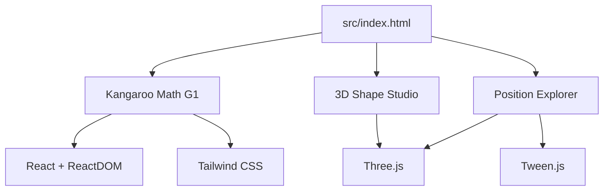

# Kangaroo Math Logic Puzzles

<cite>
**Referenced Files in This Document**
- [README.md](file://README.md)
- [src/index.html](file://src/index.html)
- [src/math/g1_Kangaroo_Math.html](file://src/math/g1_Kangaroo_Math.html)
- [src/math/g1_arithmetic.html](file://src/math/g1_arithmetic.html)
- [src/math/g1_3D_shape.html](file://src/math/g1_3D_shape.html)
- [src/math/g1_position_explorer.html](file://src/math/g1_position_explorer.html)
- [src/math/g1_pictograph_tally_quiz_arcade.html](file://src/math/g1_pictograph_tally_quiz_arcade.html)
- [src/math/g1_pictograph_tally_story_journey.html](file://src/math/g1_pictograph_tally_story_journey.html)
</cite>

## Table of Contents
1. [Introduction](#introduction)
2. [Project Structure](#project-structure)
3. [Core Components](#core-components)
4. [Architecture Overview](#architecture-overview)
5. [Detailed Component Analysis](#detailed-component-analysis)
6. [Dependency Analysis](#dependency-analysis)
7. [Performance Considerations](#performance-considerations)
8. [Troubleshooting Guide](#troubleshooting-guide)
9. [Conclusion](#conclusion)
10. [Appendices](#appendices)

## Introduction
This document provides comprehensive documentation for the Kangaroo Math Logic Puzzles collection within the IB PYP Games project. It explains how age-appropriate mathematical challenges are generated, including pattern recognition, logical reasoning, and spatial reasoning tasks. It also documents interactive puzzle interfaces (multiple-choice validation, step-by-step guidance), scoring systems, progress tracking across cognitive skill areas, cross-platform compatibility, and offline functionality for classroom use.

The collection includes:
- A logic puzzle hub with three mini-games focusing on off-by-one reasoning, set overlap/deduplication, and session-scoped maze navigation.
- An arithmetic worksheet generator supporting multiple formats and difficulty levels.
- A 3D shape studio for spatial reasoning and geometry exploration.
- A position explorer that teaches prepositions through a 3D room environment.
- Two data literacy games using pictographs and tally charts to practice counting, comparison, and interpretation.

[No sources needed since this section summarizes without analyzing specific files]

## Project Structure
The math-related activities live under src/math and are linked from the curriculum map at src/index.html. The root README outlines the project’s organization around Grade → Unit → Subject → Game.

**Diagram sources**
- [README.md:1-65](file://README.md#L1-L65)
- [src/index.html:525-582](file://src/index.html#L525-L582)

**Section sources**
- [README.md:1-65](file://README.md#L1-L65)
- [src/index.html:525-582](file://src/index.html#L525-L582)

## Core Components
- Kangaroo Math G1: A React-based single-page app with three modules:
  - Rope Cutting (off-by-one error concept)
  - Queue Overlap (deduplication concept)
  - Maze Escape (session-scoped path choices)
- Arithmetic Worksheet Generator: Configurable problem types, ranges, formats, and difficulty; print-ready output.
- 3D Shape Studio: Three.js-powered interactive 3D shapes with facts, naming quests, and visual helpers.
- Position Explorer: 3D room with raycasting to teach positional vocabulary and track discovered words.
- Pictograph & Tally Arcade/Journey: Multiple-choice questions over generated charts with bilingual support and scoring.

Key design patterns:
- Single-file HTML apps with embedded CSS/JS for portability and offline readiness.
- Lightweight state management via component state or module-level variables.
- Procedural generation for problems, tallies, and chart layouts.
- UI feedback loops for immediate correctness signaling and progression.

**Section sources**
- [src/math/g1_Kangaroo_Math.html:64-441](file://src/math/g1_Kangaroo_Math.html#L64-L441)
- [src/math/g1_arithmetic.html:723-800](file://src/math/g1_arithmetic.html#L723-L800)
- [src/math/g1_3D_shape.html:665-800](file://src/math/g1_3D_shape.html#L665-L800)
- [src/math/g1_position_explorer.html:118-150](file://src/math/g1_position_explorer.html#L118-L150)
- [src/math/g1_pictograph_tally_quiz_arcade.html:311-340](file://src/math/g1_pictograph_tally_quiz_arcade.html#L311-L340)
- [src/math/g1_pictograph_tally_story_journey.html:319-350](file://src/math/g1_pictograph_tally_story_journey.html#L319-L350)

## Architecture Overview
Each activity is a self-contained HTML application. The main index page acts as a curriculum map linking to these standalone pages.

**Diagram sources**
- [src/index.html:525-582](file://src/index.html#L525-L582)
- [src/math/g1_Kangaroo_Math.html:64-110](file://src/math/g1_Kangaroo_Math.html#L64-L110)
- [src/math/g1_arithmetic.html:723-800](file://src/math/g1_arithmetic.html#L723-L800)
- [src/math/g1_3D_shape.html:665-668](file://src/math/g1_3D_shape.html#L665-L668)
- [src/math/g1_position_explorer.html:114-117](file://src/math/g1_position_explorer.html#L114-L117)
- [src/math/g1_pictograph_tally_quiz_arcade.html:311-340](file://src/math/g1_pictograph_tally_quiz_arcade.html#L311-L340)
- [src/math/g1_pictograph_tally_story_journey.html:319-350](file://src/math/g1_pictograph_tally_story_journey.html#L319-L350)

## Detailed Component Analysis

### Kangaroo Math G1: Logic Puzzles Hub
A React-based hub with three modules:
- Rope Cutting: Demonstrates “pieces = cuts + 1” by incrementing segments on each cut.
- Queue Overlap: Visualizes double-counting and deduplication when summing front/back positions.
- Maze Escape: Session-scoped path selection with automatic reset after reaching the exit.

**Diagram sources**
- [src/math/g1_Kangaroo_Math.html:368-441](file://src/math/g1_Kangaroo_Math.html#L368-L441)
- [src/math/g1_Kangaroo_Math.html:74-146](file://src/math/g1_Kangaroo_Math.html#L74-L146)
- [src/math/g1_Kangaroo_Math.html:149-230](file://src/math/g1_Kangaroo_Math.html#L149-L230)
- [src/math/g1_Kangaroo_Math.html:233-365](file://src/math/g1_Kangaroo_Math.html#L233-L365)

Implementation highlights:
- State-driven rendering with React hooks for local state per module.
- Immediate visual feedback (segment count, overlapping bars, animated mouse avatar).
- Educational tips embedded in each module explaining the underlying concept.

**Section sources**
- [src/math/g1_Kangaroo_Math.html:64-441](file://src/math/g1_Kangaroo_Math.html#L64-L441)

### Arithmetic Worksheet Generator
Generates printable worksheets with configurable options:
- Problem type: addition, subtraction, mixed
- Number range: up to 1000
- Format: vertical, calculation, fill-in-the-blank, place value subtraction
- Difficulty: easy, medium, hard
- Print-friendly layout with responsive grid columns

**Diagram sources**
- [src/math/g1_arithmetic.html:723-800](file://src/math/g1_arithmetic.html#L723-L800)

Implementation highlights:
- Settings panel drives generation functions.
- Grid-based layout adapts for screen and print media.
- Place-value subtraction mode supports borrowing visualization.

**Section sources**
- [src/math/g1_arithmetic.html:723-800](file://src/math/g1_arithmetic.html#L723-L800)

### 3D Shape Studio
An interactive 3D environment for exploring geometric solids:
- Selectable shapes with properties (sides, corners, faces)
- Name quest challenge mode
- Controls for color, rotation speed, size, labels, and wireframe edges
- Speech synthesis for pronunciation

**Diagram sources**
- [src/math/g1_3D_shape.html:665-800](file://src/math/g1_3D_shape.html#L665-L800)

Implementation highlights:
- Three.js scene with OrbitControls for interaction.
- Declarative shape definitions with metadata for learning facts.
- Accessibility features like aria-live regions and keyboard focus styles.

**Section sources**
- [src/math/g1_3D_shape.html:665-800](file://src/math/g1_3D_shape.html#L665-L800)

### Position Explorer
A 3D room environment teaching positional vocabulary:
- Raycasting to move a diamond avatar across objects
- Real-time sentence generation describing relative positions
- Scavenger hunt tracker for discovering all target words
- Speech synthesis for reading sentences aloud

**Diagram sources**
- [src/math/g1_position_explorer.html:338-444](file://src/math/g1_position_explorer.html#L338-L444)
- [src/math/g1_position_explorer.html:446-513](file://src/math/g1_position_explorer.html#L446-L513)
- [src/math/g1_position_explorer.html:515-533](file://src/math/g1_position_explorer.html#L515-L533)

Implementation highlights:
- Zone-based logic mapping coordinates to prepositions.
- Badge system tracks discovered vocabulary.
- Audio requires user gesture before speaking.

**Section sources**
- [src/math/g1_position_explorer.html:118-150](file://src/math/g1_position_explorer.html#L118-L150)
- [src/math/g1_position_explorer.html:338-444](file://src/math/g1_position_explorer.html#L338-L444)
- [src/math/g1_position_explorer.html:446-513](file://src/math/g1_position_explorer.html#L446-L513)
- [src/math/g1_position_explorer.html:515-533](file://src/math/g1_position_explorer.html#L515-L533)

### Pictograph & Tally Quiz Arcade
A fast-paced quiz engine generating pictograph and tally chart questions:
- Randomized items and counts
- Multiple-choice answers with combo scoring
- Bilingual text support

**Diagram sources**
- [src/math/g1_pictograph_tally_quiz_arcade.html:311-340](file://src/math/g1_pictograph_tally_quiz_arcade.html#L311-L340)
- [src/math/g1_pictograph_tally_quiz_arcade.html:426-502](file://src/math/g1_pictograph_tally_quiz_arcade.html#L426-L502)
- [src/math/g1_pictograph_tally_quiz_arcade.html:560-589](file://src/math/g1_pictograph_tally_quiz_arcade.html#L560-L589)

Implementation highlights:
- Deterministic question generation with randomized distractors.
- Combo multiplier increases score for consecutive correct answers.
- Language toggle updates UI and question content dynamically.

**Section sources**
- [src/math/g1_pictograph_tally_quiz_arcade.html:311-340](file://src/math/g1_pictograph_tally_quiz_arcade.html#L311-L340)
- [src/math/g1_pictograph_tally_quiz_arcade.html:426-502](file://src/math/g1_pictograph_tally_quiz_arcade.html#L426-L502)
- [src/math/g1_pictograph_tally_quiz_arcade.html:560-589](file://src/math/g1_pictograph_tally_quiz_arcade.html#L560-L589)

### Pictograph & Tally Story Journey
A narrative-driven variant of the arcade with similar mechanics:
- Story context and mission framing
- Progress bar and star rating at completion
- Bilingual prompts and feedback

**Diagram sources**
- [src/math/g1_pictograph_tally_story_journey.html:319-350](file://src/math/g1_pictograph_tally_story_journey.html#L319-L350)
- [src/math/g1_pictograph_tally_story_journey.html:446-516](file://src/math/g1_pictograph_tally_story_journey.html#L446-L516)
- [src/math/g1_pictograph_tally_story_journey.html:574-611](file://src/math/g1_pictograph_tally_story_journey.html#L574-L611)

Implementation highlights:
- Consistent question generation pipeline reused from arcade style.
- Star rating based on score ratio.
- Language toggle updates all strings and current question.

**Section sources**
- [src/math/g1_pictograph_tally_story_journey.html:319-350](file://src/math/g1_pictograph_tally_story_journey.html#L319-L350)
- [src/math/g1_pictograph_tally_story_journey.html:446-516](file://src/math/g1_pictograph_tally_story_journey.html#L446-L516)
- [src/math/g1_pictograph_tally_story_journey.html:574-611](file://src/math/g1_pictograph_tally_story_journey.html#L574-L611)

## Dependency Analysis
- External libraries:
  - React and ReactDOM loaded via CDN for the Kangaroo Math hub.
  - Tailwind CSS via CDN for styling in the hub and position explorer.
  - Three.js and OrbitControls for 3D rendering in the shape studio and position explorer.
  - Tween.js for smooth animations in the position explorer.
- Curriculum integration:
  - The main index page links to each game, organizing them by grade/unit/subject.

**Diagram sources**
- [src/math/g1_Kangaroo_Math.html:8-11](file://src/math/g1_Kangaroo_Math.html#L8-L11)
- [src/math/g1_3D_shape.html:665-668](file://src/math/g1_3D_shape.html#L665-L668)
- [src/math/g1_position_explorer.html:114-117](file://src/math/g1_position_explorer.html#L114-L117)
- [src/index.html:525-582](file://src/index.html#L525-L582)

**Section sources**
- [src/math/g1_Kangaroo_Math.html:8-11](file://src/math/g1_Kangaroo_Math.html#L8-L11)
- [src/math/g1_3D_shape.html:665-668](file://src/math/g1_3D_shape.html#L665-L668)
- [src/math/g1_position_explorer.html:114-117](file://src/math/g1_position_explorer.html#L114-L117)
- [src/index.html:525-582](file://src/index.html#L525-L582)

## Performance Considerations
- Prefer lightweight DOM updates and avoid heavy reflows; the React components manage local state efficiently.
- Use requestAnimationFrame and tweening judiciously; limit animation complexity on low-end devices.
- For 3D scenes, keep geometry simple and reuse materials where possible.
- Ensure print styles minimize ink usage and maintain readability.

[No sources needed since this section provides general guidance]

## Troubleshooting Guide
- Audio not playing:
  - Some browsers require a user gesture before speech synthesis can start. Ensure the first audio call follows a click or tap.
- 3D viewport issues:
  - Verify WebGL support and ensure the container has dimensions. Resize handlers should update camera aspect and renderer size.
- Offline usage:
  - Standalone HTML files work offline if opened directly. If relying on CDNs, consider hosting dependencies locally or using a service worker to cache assets.

**Section sources**
- [src/math/g1_position_explorer.html:515-533](file://src/math/g1_position_explorer.html#L515-L533)
- [src/math/g1_position_explorer.html:550-557](file://src/math/g1_position_explorer.html#L550-L557)

## Conclusion
The Kangaroo Math Logic Puzzles collection offers a cohesive set of interactive, educational activities aligned with early-grade mathematics and spatial reasoning goals. Each game is designed to be accessible, engaging, and portable, leveraging modern web technologies while remaining simple enough for classroom deployment. The architecture emphasizes modularity, procedural generation, and clear feedback loops to support student learning and teacher usability.

[No sources needed since this section summarizes without analyzing specific files]

## Appendices

### Implementation Examples and Best Practices
- Creating new puzzle types:
  - Follow the single-file HTML pattern with embedded CSS/JS.
  - Use a small state machine to manage flow (start, play, feedback, end).
  - Provide immediate feedback and optional hints to scaffold learning.
- Implementing scoring systems:
  - Maintain a simple score variable and update it on correct answers.
  - Optionally add combo multipliers or time bonuses for engagement.
- Tracking student progress:
  - Use in-memory sets or arrays to track discovered items or completed tasks.
  - Persist progress via localStorage if needed for longer sessions.
- Cross-platform compatibility:
  - Ensure touch-friendly targets and responsive layouts.
  - Test on desktop, tablet, and mobile viewports.
- Offline functionality:
  - Keep assets local or cache external resources with a service worker.
  - Avoid network calls during gameplay; generate content procedurally.

[No sources needed since this section provides general guidance]