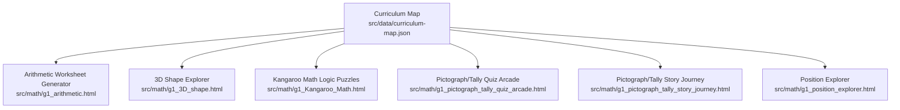
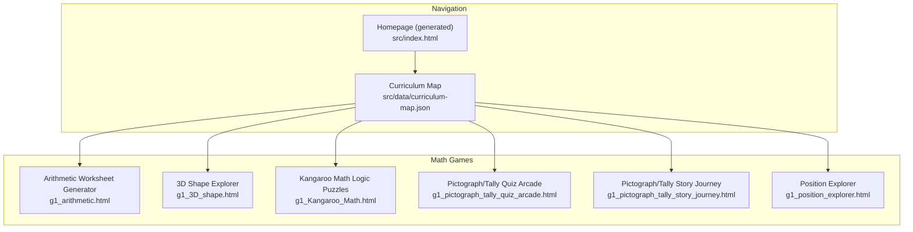
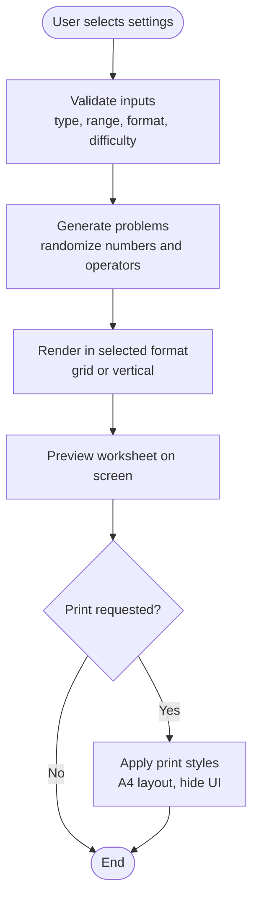
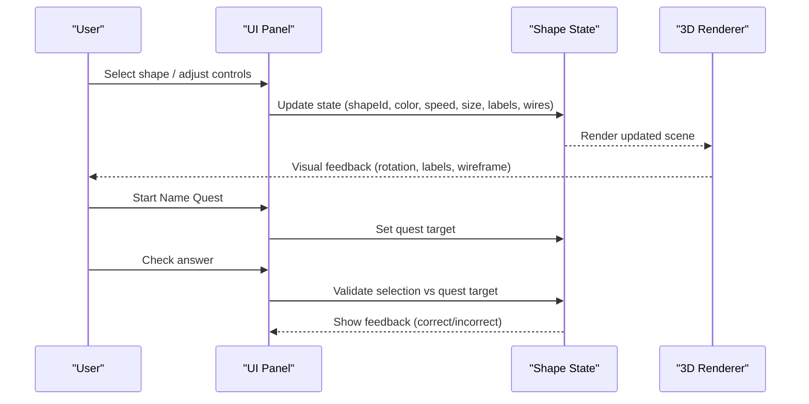
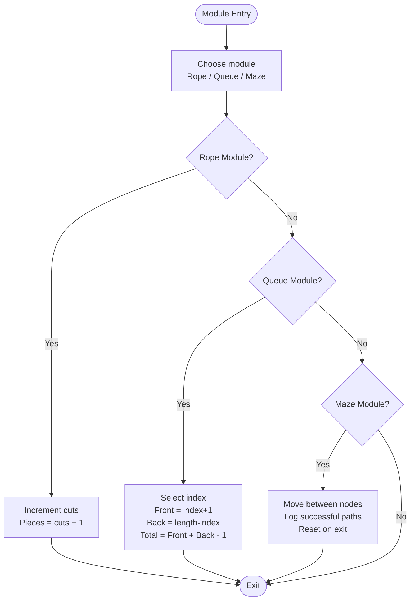
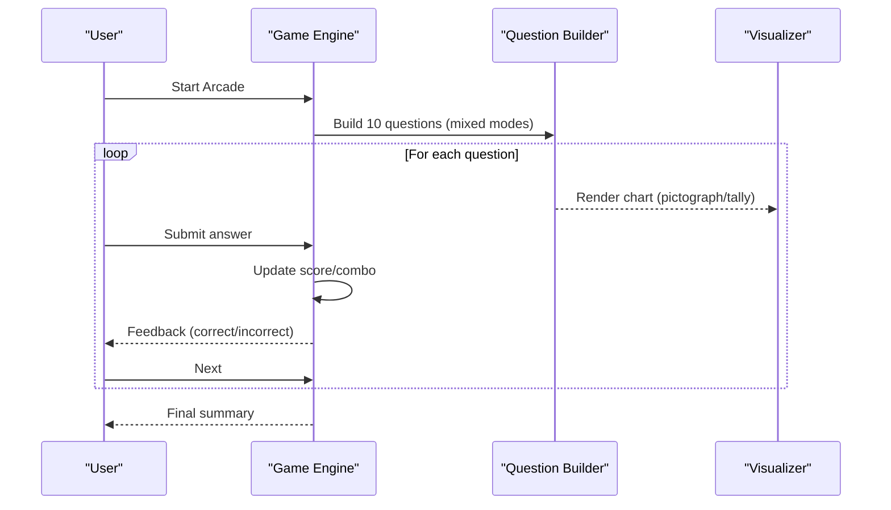
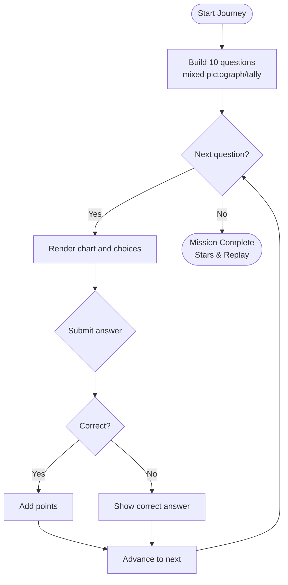
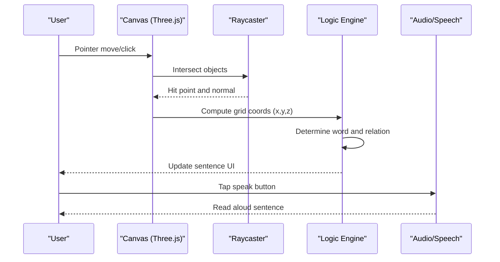
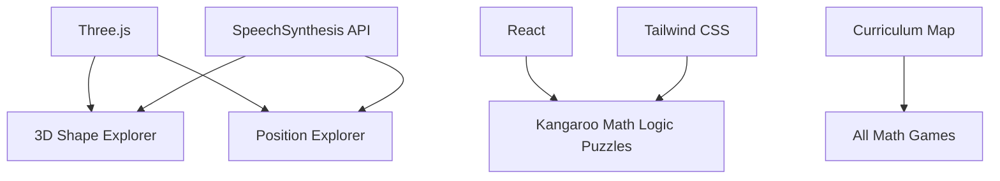

# Mathematics Games Collection

<cite>
**Referenced Files in This Document**
- [README.md](file://README.md)
- [curriculum-map.json](file://src/data/curriculum-map.json)
- [grade1-uoi-map.md](file://docs/grade1-uoi-map.md)
- [pictograph_tally_games_plan.md](file://src/math/pictograph_tally_games_plan.md)
- [g1_arithmetic.html](file://src/math/g1_arithmetic.html)
- [g1_3D_shape.html](file://src/math/g1_3D_shape.html)
- [g1_Kangaroo_Math.html](file://src/math/g1_Kangaroo_Math.html)
- [g1_pictograph_tally_quiz_arcade.html](file://src/math/g1_pictograph_tally_quiz_arcade.html)
- [g1_pictograph_tally_story_journey.html](file://src/math/g1_pictograph_tally_story_journey.html)
- [g1_position_explorer.html](file://src/math/g1_position_explorer.html)
</cite>

## Table of Contents
1. [Introduction](#introduction)
2. [Project Structure](#project-structure)
3. [Core Components](#core-components)
4. [Architecture Overview](#architecture-overview)
5. [Detailed Component Analysis](#detailed-component-analysis)
6. [Dependency Analysis](#dependency-analysis)
7. [Performance Considerations](#performance-considerations)
8. [Troubleshooting Guide](#troubleshooting-guide)
9. [Conclusion](#conclusion)
10. [Appendices](#appendices)

## Introduction
This document provides comprehensive documentation for the Mathematics Games Collection within the IB PYP Games project. It focuses on number sense, geometry, data representation, and problem-solving activities aligned with Grade 1 learning goals. The collection includes:
- Arithmetic Worksheet Generator for customizable practice problems
- 3D Shape Explorer for spatial reasoning
- Kangaroo Math Logic Puzzles for critical thinking
- Pictograph/Tally games for data analysis skills
- Position Explorer for positional language and spatial awareness

The content explains how each game aligns with IB PYP mathematics objectives, supports different learning styles through interactive exploration, and details algorithms for problem generation, adaptive difficulty systems, and progress tracking mechanisms. It also includes implementation examples for creating new math games, integrating educational standards, providing immediate feedback, accessibility features, and cross-device compatibility.

## Project Structure
The mathematics games are organized under src/math/ and integrated into the curriculum map for navigation. Each game is a standalone HTML file with embedded CSS and JavaScript to ensure portability and ease of deployment. The curriculum map connects units of inquiry to subject lanes and specific games.

**Diagram sources**
- [curriculum-map.json:1-551](file://src/data/curriculum-map.json#L1-L551)
- [g1_arithmetic.html:1-1316](file://src/math/g1_arithmetic.html#L1-L1316)
- [g1_3D_shape.html:1-1217](file://src/math/g1_3D_shape.html#L1-L1217)
- [g1_Kangaroo_Math.html:1-452](file://src/math/g1_Kangaroo_Math.html#L1-L452)
- [g1_pictograph_tally_quiz_arcade.html:1-631](file://src/math/g1_pictograph_tally_quiz_arcade.html#L1-L631)
- [g1_pictograph_tally_story_journey.html:1-653](file://src/math/g1_pictograph_tally_story_journey.html#L1-L653)
- [g1_position_explorer.html:1-573](file://src/math/g1_position_explorer.html#L1-L573)

**Section sources**
- [README.md:1-65](file://README.md#L1-L65)
- [curriculum-map.json:1-551](file://src/data/curriculum-map.json#L1-L551)
- [grade1-uoi-map.md:1-76](file://docs/grade1-uoi-map.md#L1-L76)

## Core Components
- Arithmetic Worksheet Generator: Customizable arithmetic practice with multiple formats (vertical, calculation, fill-in-blank, place value subtraction), adjustable ranges and difficulty levels, and print-ready output.
- 3D Shape Explorer: Interactive 3D visualization of shapes with properties display, name quest challenges, and controls for color, rotation speed, size, labels, and wireframe edges.
- Kangaroo Math Logic Puzzles: Three logic modules focusing on off-by-one errors, set overlap counting, and session scope/maze navigation.
- Pictograph/Tally Quiz Arcade: Fast-paced quiz with pictographs and tally marks, combo scoring, bilingual support, and immediate feedback.
- Pictograph/Tally Story Journey: Narrative-driven data interpretation tasks with pictographs and tallies, progressive missions, and star-based results.
- Position Explorer: 3D room environment where learners explore positional vocabulary by moving an avatar and discovering words.

**Section sources**
- [g1_arithmetic.html:1-1316](file://src/math/g1_arithmetic.html#L1-L1316)
- [g1_3D_shape.html:1-1217](file://src/math/g1_3D_shape.html#L1-L1217)
- [g1_Kangaroo_Math.html:1-452](file://src/math/g1_Kangaroo_Math.html#L1-L452)
- [g1_pictograph_tally_quiz_arcade.html:1-631](file://src/math/g1_pictograph_tally_quiz_arcade.html#L1-L631)
- [g1_pictograph_tally_story_journey.html:1-653](file://src/math/g1_pictograph_tally_story_journey.html#L1-L653)
- [g1_position_explorer.html:1-573](file://src/math/g1_position_explorer.html#L1-L573)

## Architecture Overview
Each game follows a consistent architecture:
- Single-file HTML with embedded CSS and JS for simplicity and portability
- Curriculum integration via links from the generated homepage
- Responsive design optimized for tablets and desktops
- Immediate feedback and optional audio/speech features
- Accessibility considerations including large touch targets and clear contrast

**Diagram sources**
- [curriculum-map.json:1-551](file://src/data/curriculum-map.json#L1-L551)
- [g1_arithmetic.html:1-1316](file://src/math/g1_arithmetic.html#L1-L1316)
- [g1_3D_shape.html:1-1217](file://src/math/g1_3D_shape.html#L1-L1217)
- [g1_Kangaroo_Math.html:1-452](file://src/math/g1_Kangaroo_Math.html#L1-L452)
- [g1_pictograph_tally_quiz_arcade.html:1-631](file://src/math/g1_pictograph_tally_quiz_arcade.html#L1-L631)
- [g1_pictograph_tally_story_journey.html:1-653](file://src/math/g1_pictograph_tally_story_journey.html#L1-L653)
- [g1_position_explorer.html:1-573](file://src/math/g1_position_explorer.html#L1-L573)

## Detailed Component Analysis

### Arithmetic Worksheet Generator
- Purpose: Generate printable arithmetic worksheets tailored to grade-level needs.
- Features:
  - Problem types: addition, subtraction, mixed
  - Number ranges: 10–1000
  - Formats: vertical, calculation, fill-in-blank, place value subtraction
  - Difficulty levels: easy, medium, hard
  - Print-friendly layout with A4 sizing and grid alignment
- Algorithms:
  - Randomized problem generation constrained by range and operation rules
  - Place value subtraction ensures valid borrowing scenarios
  - Grid rendering adapts to screen size and print media queries
- Adaptive difficulty:
  - Range selection and format choice act as proxies for difficulty
  - Mixed mode increases cognitive load by alternating operations
- Progress tracking:
  - No built-in persistence; teachers can use printed sheets for assessment
- Accessibility:
  - High-contrast colors, large fonts, keyboard-friendly buttons
  - Print styles optimize readability
- Cross-device:
  - Responsive grids and print media queries ensure usability across devices

**Diagram sources**
- [g1_arithmetic.html:1-1316](file://src/math/g1_arithmetic.html#L1-L1316)

**Section sources**
- [g1_arithmetic.html:1-1316](file://src/math/g1_arithmetic.html#L1-L1316)

### 3D Shape Explorer
- Purpose: Explore 3D shapes and their properties through interactive manipulation.
- Features:
  - Shape selector and tiles with visual previews
  - Properties panel showing sides, corners, faces
  - Name Quest challenge mode with clues and answer checking
  - Controls for color, rotation speed, size, labels, and wireframe edges
  - Speech synthesis for reading shape names
- Algorithms:
  - 3D rendering using WebGL (Three.js)
  - OrbitControls for camera interaction
  - State management for current shape, visibility toggles, and quest state
- Learning alignment:
  - Supports geometry concepts: faces, edges, vertices
  - Encourages spatial reasoning and descriptive language
- Accessibility:
  - Large touch targets, focus outlines, aria-live regions
  - Keyboard-accessible controls
- Cross-device:
  - Responsive layout with panels stacking on smaller screens

**Diagram sources**
- [g1_3D_shape.html:1-1217](file://src/math/g1_3D_shape.html#L1-L1217)

**Section sources**
- [g1_3D_shape.html:1-1217](file://src/math/g1_3D_shape.html#L1-L1217)

### Kangaroo Math Logic Puzzles
- Purpose: Develop critical thinking through three focused logic modules.
- Modules:
  - Rope Cutting (Off-by-one error): Demonstrates pieces = cuts + 1
  - Queue Counting (Set overlap): Shows double-counting correction (-1)
  - Maze Navigation (Session scope): Reinforces reset semantics per session
- Algorithms:
  - Simple counters and conditional logic for segment counts
  - Index-based calculations for front/back positions
  - State transitions for maze nodes with automatic reset on completion
- Learning alignment:
  - Emphasizes mathematical reasoning and error detection
  - Encourages explanation of strategies and protocols
- Accessibility:
  - Clear instructions, large buttons, concise text
  - Visual cues for selections and outcomes
- Cross-device:
  - Responsive card layouts and touch-friendly interactions

**Diagram sources**
- [g1_Kangaroo_Math.html:1-452](file://src/math/g1_Kangaroo_Math.html#L1-L452)

**Section sources**
- [g1_Kangaroo_Math.html:1-452](file://src/math/g1_Kangaroo_Math.html#L1-L452)

### Pictograph/Tally Quiz Arcade
- Purpose: Practice reading pictographs and tally charts quickly with engaging arcade visuals.
- Features:
  - 10-question missions with randomized items and counts
  - Combo scoring system rewarding consecutive correct answers
  - Bilingual support (English/Chinese)
  - Immediate feedback and progress bar
- Algorithms:
  - Question generator cycles through modes: pictograph count, tally read, comparison, most/least
  - Tally formatting groups of five with remainder bars
  - Option generation ensures unique distractors near the correct answer
- Learning alignment:
  - Data representation and interpretation
  - Comparison and reasoning skills
- Accessibility:
  - High-contrast UI, large tap targets, clear feedback messages
- Cross-device:
  - Responsive grid layout and mobile-friendly controls

**Diagram sources**
- [g1_pictograph_tally_quiz_arcade.html:1-631](file://src/math/g1_pictograph_tally_quiz_arcade.html#L1-L631)

**Section sources**
- [g1_pictograph_tally_quiz_arcade.html:1-631](file://src/math/g1_pictograph_tally_quiz_arcade.html#L1-L631)

### Pictograph/Tally Story Journey
- Purpose: Provide narrative-driven data interpretation tasks with pictographs and tally charts.
- Features:
  - 10-mission story arc with themed items (e.g., picnic foods)
  - Progressive missions covering counting, tally reading, comparisons, and most/least
  - Star-based results and replay option
  - Bilingual interface
- Algorithms:
  - Question generator similar to Quiz Arcade but with narrative framing
  - Unique options generation and label-based choices for comparisons
- Learning alignment:
  - Contextualized data literacy and practical application
- Accessibility:
  - Clear prompts, large buttons, positive reinforcement
- Cross-device:
  - Responsive design with stacked layouts on small screens

**Diagram sources**
- [g1_pictograph_tally_story_journey.html:1-653](file://src/math/g1_pictograph_tally_story_journey.html#L1-L653)

**Section sources**
- [g1_pictograph_tally_story_journey.html:1-653](file://src/math/g1_pictograph_tally_story_journey.html#L1-L653)

### Position Explorer
- Purpose: Explore positional vocabulary in a 3D environment.
- Features:
  - 3D room with colored quadrants and objects (tree, table, chair, box, pond, rocks, pillars, flowers)
  - Avatar movement via pointer events and raycasting
  - Sentence builder describing position relative to objects
  - Scavenger hunt tracker for discovered words
  - Speech synthesis for reading sentences
- Algorithms:
  - Raycasting to detect clicked surfaces and compute grid coordinates
  - Conditional logic mapping coordinates to positional terms
  - Tween animations for smooth movement
- Learning alignment:
  - Spatial reasoning and prepositional language
- Accessibility:
  - Large touch targets, speech feedback, clear visual indicators
- Cross-device:
  - Touch and mouse support, responsive canvas scaling

**Diagram sources**
- [g1_position_explorer.html:1-573](file://src/math/g1_position_explorer.html#L1-L573)

**Section sources**
- [g1_position_explorer.html:1-573](file://src/math/g1_position_explorer.html#L1-L573)

## Dependency Analysis
- External libraries:
  - Three.js for 3D rendering (3D Shape Explorer, Position Explorer)
  - React and Tailwind CSS for Kangaroo Math Logic Puzzles
  - Web APIs: SpeechSynthesis for audio feedback
- Internal dependencies:
  - Curriculum map drives navigation and organization
  - Shared UX patterns across games (large touch targets, bilingual support, immediate feedback)

**Diagram sources**
- [g1_3D_shape.html:1-1217](file://src/math/g1_3D_shape.html#L1-L1217)
- [g1_position_explorer.html:1-573](file://src/math/g1_position_explorer.html#L1-L573)
- [g1_Kangaroo_Math.html:1-452](file://src/math/g1_Kangaroo_Math.html#L1-L452)
- [curriculum-map.json:1-551](file://src/data/curriculum-map.json#L1-L551)

**Section sources**
- [g1_3D_shape.html:1-1217](file://src/math/g1_3D_shape.html#L1-L1217)
- [g1_position_explorer.html:1-573](file://src/math/g1_position_explorer.html#L1-L573)
- [g1_Kangaroo_Math.html:1-452](file://src/math/g1_Kangaroo_Math.html#L1-L452)
- [curriculum-map.json:1-551](file://src/data/curriculum-map.json#L1-L551)

## Performance Considerations
- Rendering efficiency:
  - Use requestAnimationFrame loops sparingly; update only when necessary
  - Limit shadow casting and complex materials for better performance on low-end devices
- Memory management:
  - Dispose of geometries and textures when switching scenes or shapes
  - Avoid excessive DOM node creation; reuse elements where possible
- Input handling:
  - Debounce pointer events if needed to prevent heavy recalculations
- Print optimization:
  - Ensure print styles minimize ink usage and avoid unnecessary graphics

[No sources needed since this section provides general guidance]

## Troubleshooting Guide
- Audio not playing:
  - Ensure user gesture has occurred before requesting speech synthesis
  - Check browser permissions and availability of SpeechSynthesis API
- 3D rendering issues:
  - Verify WebGL support and device pixel ratio limits
  - Confirm Three.js version compatibility with imports
- Touch interactions:
  - Ensure pointer events are enabled and touch-action is configured appropriately
- Language switching:
  - Confirm text maps and dynamic updates are applied consistently across screens

**Section sources**
- [g1_position_explorer.html:1-573](file://src/math/g1_position_explorer.html#L1-L573)
- [g1_3D_shape.html:1-1217](file://src/math/g1_3D_shape.html#L1-L1217)
- [g1_pictograph_tally_quiz_arcade.html:1-631](file://src/math/g1_pictograph_tally_quiz_arcade.html#L1-L631)
- [g1_pictograph_tally_story_journey.html:1-653](file://src/math/g1_pictograph_tally_story_journey.html#L1-L653)

## Conclusion
The Mathematics Games Collection offers a cohesive set of interactive activities that align with IB PYP mathematics objectives for Grade 1. Each game emphasizes hands-on exploration, immediate feedback, and accessibility, supporting diverse learning styles and cross-device usage. The curriculum map integrates these games into thematic units, enabling teachers to connect practice with inquiry themes. Future enhancements can include persistent progress tracking, more sophisticated adaptive difficulty, and expanded bilingual content.

[No sources needed since this section summarizes without analyzing specific files]

## Appendices

### Implementation Examples
- Creating a new math game:
  - Add a single-file HTML under src/math/ with embedded CSS and JS
  - Include viewport meta tag, large touch targets, and return link to PYP map
  - Register the game in curriculum-map.json under the appropriate unit and subject lane
  - Run npm run qa:curriculum and npm run build to validate and regenerate the homepage
- Integrating educational standards:
  - Align game objectives with IB PYP transdisciplinary themes and learner profiles
  - Use unit-specific query strings to launch games with contextual presets
- Providing immediate feedback:
  - Use visual cues (colors, borders) and textual feedback for correct/incorrect responses
  - Optionally integrate speech synthesis for auditory reinforcement

**Section sources**
- [README.md:1-65](file://README.md#L1-L65)
- [curriculum-map.json:1-551](file://src/data/curriculum-map.json#L1-L551)
- [grade1-uoi-map.md:1-76](file://docs/grade1-uoi-map.md#L1-L76)
- [pictograph_tally_games_plan.md:1-68](file://src/math/pictograph_tally_games_plan.md#L1-L68)