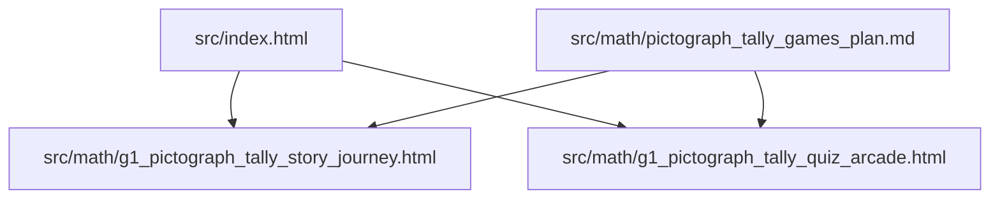
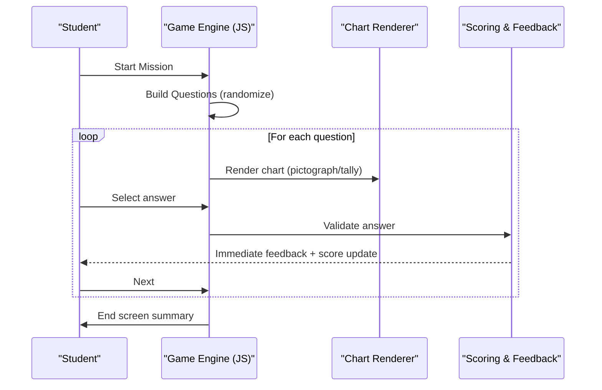
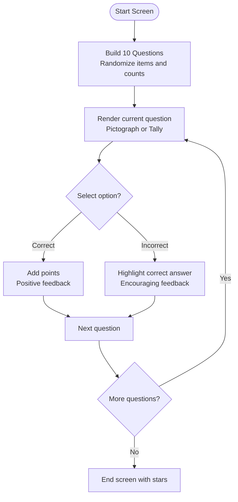
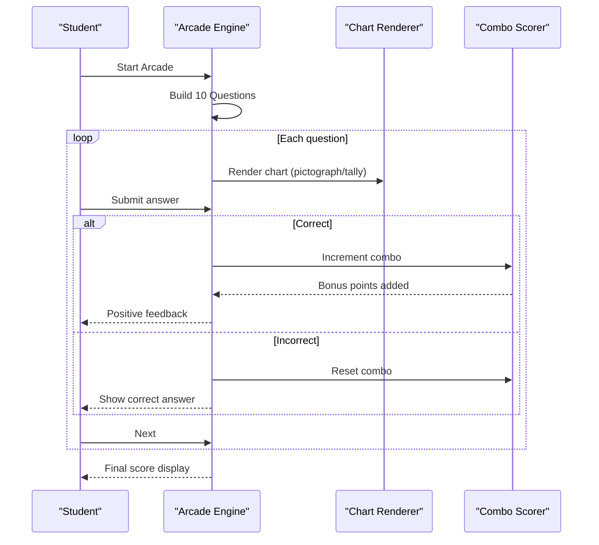
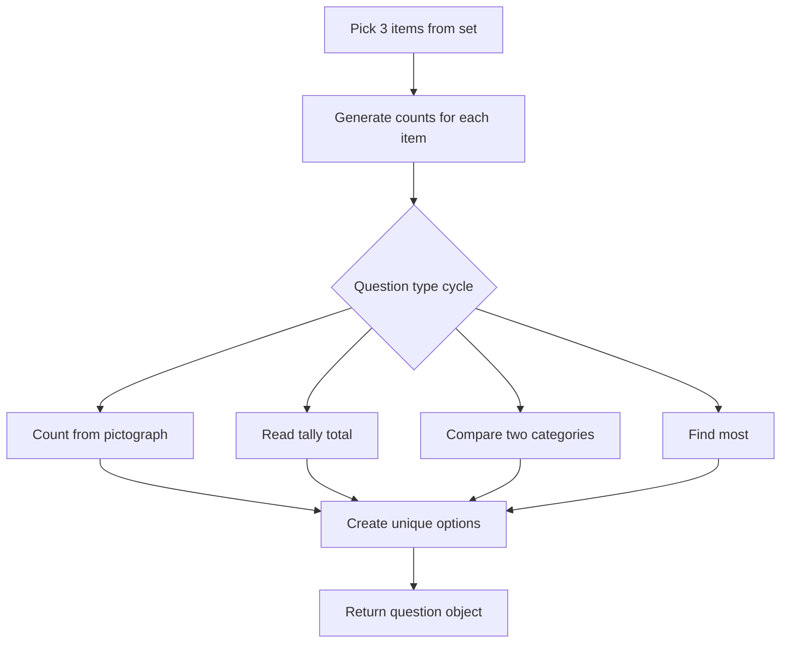
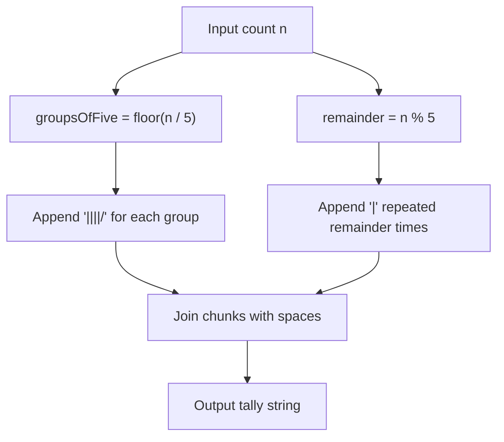
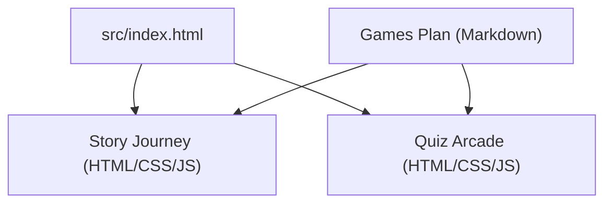

# Pictograph & Tally Data Games

<cite>
**Referenced Files in This Document**
- [g1_pictograph_tally_story_journey.html](file://src/math/g1_pictograph_tally_story_journey.html)
- [g1_pictograph_tally_quiz_arcade.html](file://src/math/g1_pictograph_tally_quiz_arcade.html)
- [pictograph_tally_games_plan.md](file://src/math/pictograph_tally_games_plan.md)
- [index.html](file://src/index.html)
</cite>

## Table of Contents
1. [Introduction](#introduction)
2. [Project Structure](#project-structure)
3. [Core Components](#core-components)
4. [Architecture Overview](#architecture-overview)
5. [Detailed Component Analysis](#detailed-component-analysis)
6. [Dependency Analysis](#dependency-analysis)
7. [Performance Considerations](#performance-considerations)
8. [Troubleshooting Guide](#troubleshooting-guide)
9. [Conclusion](#conclusion)
10. [Appendices](#appendices)

## Introduction
This document explains two complementary learning experiences for Grade 1 data literacy: Story Journey and Quiz Arcade. Both games teach students to read pictographs (one icon equals one item), interpret tally marks, compare quantities, and answer practical questions using charts. The Story Journey mode embeds data tasks within a narrative scenario to help learners understand why we collect and organize data. The Quiz Arcade mode provides rapid-fire interpretation challenges with immediate feedback and scoring to build fluency.

The implementation is pure HTML5 with embedded CSS and JavaScript, designed for tablets and desktops, bilingual English/Chinese, and accessible to young learners through large touch targets and clear visuals.

## Project Structure
The games are implemented as standalone single-file applications under the math section and linked from the main curriculum map.

**Diagram sources**
- [index.html:697-708](file://src/index.html#L697-L708)
- [pictograph_tally_games_plan.md:1-68](file://src/math/pictograph_tally_games_plan.md#L1-L68)

**Section sources**
- [index.html:697-708](file://src/index.html#L697-L708)
- [pictograph_tally_games_plan.md:1-68](file://src/math/pictograph_tally_games_plan.md#L1-L68)

## Core Components
Both games share common patterns:
- Single-screen flow with start, game, and end sections
- 10-question missions with mixed question types
- Bilingual text support via a language switch
- Randomized datasets with deterministic variety across rounds
- Immediate feedback and progress indicators

Key responsibilities:
- Question generation and randomization
- Chart rendering (pictograph or tally)
- Answer validation and scoring
- UI state management and transitions

**Section sources**
- [g1_pictograph_tally_story_journey.html:319-642](file://src/math/g1_pictograph_tally_story_journey.html#L319-L642)
- [g1_pictograph_tally_quiz_arcade.html:311-619](file://src/math/g1_pictograph_tally_quiz_arcade.html#L311-L619)

## Architecture Overview
High-level architecture for both games:

**Diagram sources**
- [g1_pictograph_tally_story_journey.html:512-641](file://src/math/g1_pictograph_tally_story_journey.html#L512-L641)
- [g1_pictograph_tally_quiz_arcade.html:498-617](file://src/math/g1_pictograph_tally_quiz_arcade.html#L498-L617)

## Detailed Component Analysis

### Story Journey Mode
Story Journey contextualizes data collection within a narrative scenario (“Help Mia prepare for class picnic”). It presents 10 questions that mix counting from pictographs, reading tally totals, comparing categories, and identifying most/least.

- Narrative framing: The start screen sets a mission objective; the end screen shows stars based on performance.
- Question types:
  - Count items from a pictograph
  - Read tally marks and convert to numbers
  - Compare two categories (more/fewer)
  - Identify the category with the most
- Progress tracking: A progress bar and question counter guide the learner.
- Language support: Toggle between English and Chinese; prompts and labels adapt accordingly.

Implementation highlights:
- Icon set selection and random sampling for each question
- Tally string generation grouped by fives
- Unique distractor options near the correct answer
- Label-based answers when comparing categories

**Diagram sources**
- [g1_pictograph_tally_story_journey.html:416-516](file://src/math/g1_pictograph_tally_story_journey.html#L416-L516)
- [g1_pictograph_tally_story_journey.html:518-641](file://src/math/g1_pictograph_tally_story_journey.html#L518-L641)

**Section sources**
- [g1_pictograph_tally_story_journey.html:319-642](file://src/math/g1_pictograph_tally_story_journey.html#L319-L642)
- [pictograph_tally_games_plan.md:18-32](file://src/math/pictograph_tally_games_plan.md#L18-L32)

### Quiz Arcade Mode
Quiz Arcade emphasizes speed and fluency with an energetic visual style. It includes a combo meter that rewards consecutive correct answers, increasing point gains per streak.

- Rapid-fire format: 10 quick questions with immediate feedback
- Combo system: Consecutive correct answers increase bonus points
- Legend hints: Each question may include a short legend to scaffold interpretation
- Progress tracking: Visual progress bar and numeric counters

Implementation highlights:
- Similar question generation pipeline to Story Journey but with arcade-specific scoring
- Distinct icon set and slightly different ranges for counts
- Option generation ensures plausible distractors close to the correct number

**Diagram sources**
- [g1_pictograph_tally_quiz_arcade.html:426-502](file://src/math/g1_pictograph_tally_quiz_arcade.html#L426-L502)
- [g1_pictograph_tally_quiz_arcade.html:560-617](file://src/math/g1_pictograph_tally_quiz_arcade.html#L560-L617)

**Section sources**
- [g1_pictograph_tally_quiz_arcade.html:311-619](file://src/math/g1_pictograph_tally_quiz_arcade.html#L311-L619)
- [pictograph_tally_games_plan.md:33-47](file://src/math/pictograph_tally_games_plan.md#L33-L47)

### Algorithms for Generating Random Datasets
Both games use lightweight randomization to create varied yet appropriate datasets for Grade 1 learners.

- Item selection: Randomly sample three distinct icons from a predefined set for each question.
- Count generation: Assign random counts within a small range suitable for early learners.
- Question type cycling: Rotate among four question types to ensure balanced practice.
- Distractor generation: Create unique incorrect options near the correct answer to avoid trivial guesses.

**Diagram sources**
- [g1_pictograph_tally_story_journey.html:416-516](file://src/math/g1_pictograph_tally_story_journey.html#L416-L516)
- [g1_pictograph_tally_quiz_arcade.html:426-502](file://src/math/g1_pictograph_tally_quiz_arcade.html#L426-L502)

**Section sources**
- [g1_pictograph_tally_story_journey.html:416-516](file://src/math/g1_pictograph_tally_story_journey.html#L416-L516)
- [g1_pictograph_tally_quiz_arcade.html:426-502](file://src/math/g1_pictograph_tally_quiz_arcade.html#L426-L502)

### Creating Meaningful Pictographs with Appropriate Symbols
- Symbol sets: Each game defines a curated set of emoji icons representing familiar objects.
- One-to-one mapping: In pictograph mode, each icon represents one item, aligning with Grade 1 standards.
- Rendering: Icons are repeated according to the generated count and displayed in a grid row with a label.

Implementation references:
- Icon sets defined in each game’s script
- Pictograph rendering logic repeats icons based on counts

**Section sources**
- [g1_pictograph_tally_story_journey.html:328-334](file://src/math/g1_pictograph_tally_story_journey.html#L328-L334)
- [g1_pictograph_tally_story_journey.html:518-542](file://src/math/g1_pictograph_tally_story_journey.html#L518-L542)
- [g1_pictograph_tally_quiz_arcade.html:313-319](file://src/math/g1_pictograph_tally_quiz_arcade.html#L313-L319)
- [g1_pictograph_tally_quiz_arcade.html:504-526](file://src/math/g1_pictograph_tally_quiz_arcade.html#L504-L526)

### Validating Tally Mark Accuracy
Tally marks are rendered in groups of five for readability and ease of counting.

- Grouping algorithm: Compute full groups of five and any remainder, then concatenate “||||/” for each group plus remaining vertical strokes.
- Display: Tally strings are shown in a dedicated container with spacing and font styling optimized for young readers.

**Diagram sources**
- [g1_pictograph_tally_story_journey.html:421-435](file://src/math/g1_pictograph_tally_story_journey.html#L421-L435)
- [g1_pictograph_tally_quiz_arcade.html:404-418](file://src/math/g1_pictograph_tally_quiz_arcade.html#L404-L418)

**Section sources**
- [g1_pictograph_tally_story_journey.html:421-435](file://src/math/g1_pictograph_tally_story_journey.html#L421-L435)
- [g1_pictograph_tally_quiz_arcade.html:404-418](file://src/math/g1_pictograph_tally_quiz_arcade.html#L404-L418)

### Implementation Examples

#### Adding New Data Themes
To introduce new themes (e.g., animals, vehicles):
- Extend the icon set array in the target game file with new entries containing English and Chinese names and an emoji.
- Ensure the new icons are visually distinct and age-appropriate.
- No changes needed to core algorithms; they will randomly sample from the expanded set.

References:
- Icon set definitions in Story Journey and Quiz Arcade

**Section sources**
- [g1_pictograph_tally_story_journey.html:328-334](file://src/math/g1_pictograph_tally_story_journey.html#L328-L334)
- [g1_pictograph_tally_quiz_arcade.html:313-319](file://src/math/g1_pictograph_tally_quiz_arcade.html#L313-L319)

#### Customizing Symbol Sets
You can tailor symbol sets per theme or lesson:
- Replace existing emojis with domain-relevant icons.
- Adjust label texts for bilingual support if needed.
- Keep the structure consistent so rendering and option formatting remain unchanged.

**Section sources**
- [g1_pictograph_tally_story_journey.html:328-334](file://src/math/g1_pictograph_tally_story_journey.html#L328-L334)
- [g1_pictograph_tally_quiz_arcade.html:313-319](file://src/math/g1_pictograph_tally_quiz_arcade.html#L313-L319)

#### Implementing Progressive Difficulty Levels
While the current games do not expose difficulty settings, you can implement progressive levels by:
- Expanding count ranges at higher levels (e.g., larger maximum values).
- Introducing half-icons or multipliers (e.g., one icon equals two items) in future iterations.
- Increasing the number of categories beyond three.
- Adding more complex comparisons (e.g., summing two categories).

These changes would involve adjusting the count generation functions and possibly the question type distribution.

[No sources needed since this section proposes extensions without analyzing specific files]

### Engagement Strategies and Gamification Elements
- Story framing: Story Journey uses a narrative context to motivate data collection and organization.
- Immediate feedback: Both games provide instant correctness feedback and highlight the right answer.
- Scoring systems:
  - Story Journey awards fixed points per correct answer and displays star ratings at the end.
  - Quiz Arcade adds a combo multiplier to reward streaks, encouraging sustained accuracy.
- Visual progress: Progress bars and question counters keep learners oriented.
- Accessibility: Large tap targets, high contrast, and minimal text support Grade 1 usability.

**Section sources**
- [g1_pictograph_tally_story_journey.html:574-611](file://src/math/g1_pictograph_tally_story_journey.html#L574-L611)
- [g1_pictograph_tally_quiz_arcade.html:560-605](file://src/math/g1_pictograph_tally_quiz_arcade.html#L560-L605)
- [pictograph_tally_games_plan.md:48-55](file://src/math/pictograph_tally_games_plan.md#L48-L55)

## Dependency Analysis
The games are self-contained and depend only on browser APIs. They are linked from the main index page.

**Diagram sources**
- [index.html:697-708](file://src/index.html#L697-L708)
- [pictograph_tally_games_plan.md:1-68](file://src/math/pictograph_tally_games_plan.md#L1-L68)

**Section sources**
- [index.html:697-708](file://src/index.html#L697-L708)
- [pictograph_tally_games_plan.md:1-68](file://src/math/pictograph_tally_games_plan.md#L1-L68)

## Performance Considerations
- Lightweight DOM updates: Both games render charts by creating simple elements and updating text content, minimizing layout thrash.
- Deterministic randomization: Light randomization avoids heavy computation while ensuring variety.
- Responsive design: CSS media queries ensure good performance on tablets and desktops.
- No external dependencies: Single-file apps reduce network overhead and improve load times.

[No sources needed since this section provides general guidance]

## Troubleshooting Guide
Common issues and resolutions:
- Language toggle not updating: Ensure the language button click handler is attached and the applyLanguage function re-renders active screens.
- Incorrect tally rendering: Verify grouping logic computes groups of five correctly and appends remainders.
- Duplicate options: Confirm the unique options generator prevents duplicates and shuffles choices.
- Missing icons or labels: Check the icon set arrays and bilingual label mappings.

**Section sources**
- [g1_pictograph_tally_story_journey.html:394-414](file://src/math/g1_pictograph_tally_story_journey.html#L394-L414)
- [g1_pictograph_tally_story_journey.html:421-444](file://src/math/g1_pictograph_tally_story_journey.html#L421-L444)
- [g1_pictograph_tally_quiz_arcade.html:380-398](file://src/math/g1_pictograph_tally_quiz_arcade.html#L380-L398)
- [g1_pictograph_tally_quiz_arcade.html:404-424](file://src/math/g1_pictograph_tally_quiz_arcade.html#L404-L424)

## Conclusion
The Pictograph and Tally games offer two complementary pathways for Grade 1 data literacy: narrative-driven exploration and fast-paced practice. Their implementations are straightforward, extensible, and aligned with educational best practices for early learners. Teachers can use Story Journey for guided instruction and Quiz Arcade for review and fluency building. Extensions such as new themes, customized symbols, and progressive difficulty levels can be added with minimal effort due to the modular design.

[No sources needed since this section summarizes without analyzing specific files]

## Appendices

### Curriculum Alignment and Teacher Use
- Learning goals include reading pictographs, interpreting tally marks, comparing values, and applying chart information to practical questions.
- Recommended usage:
  - Story Journey for guided class play
  - Quiz Arcade for quick review practice
  - Optional extension: ask students to explain reasoning behind answers

**Section sources**
- [pictograph_tally_games_plan.md:11-17](file://src/math/pictograph_tally_games_plan.md#L11-L17)
- [pictograph_tally_games_plan.md:63-68](file://src/math/pictograph_tally_games_plan.md#L63-L68)