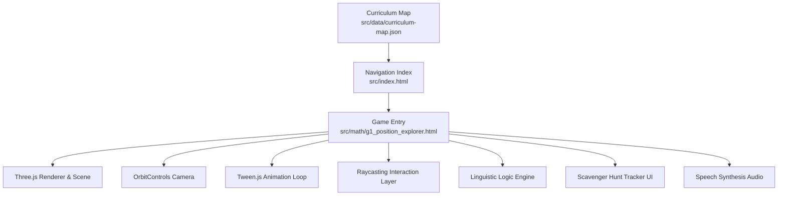
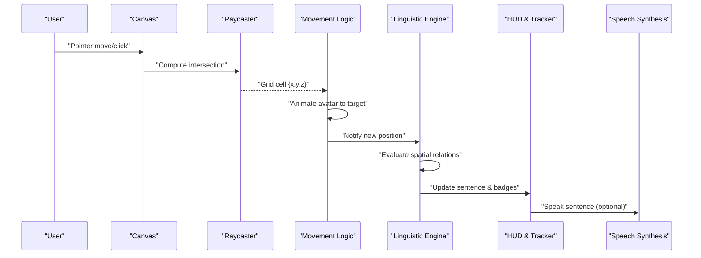
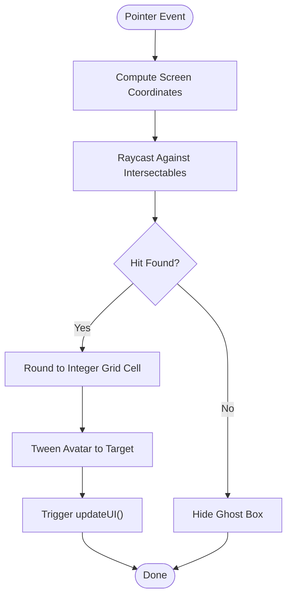
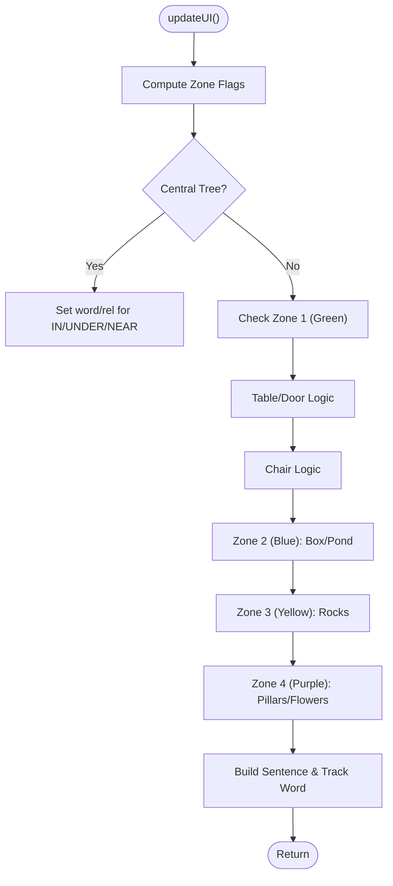
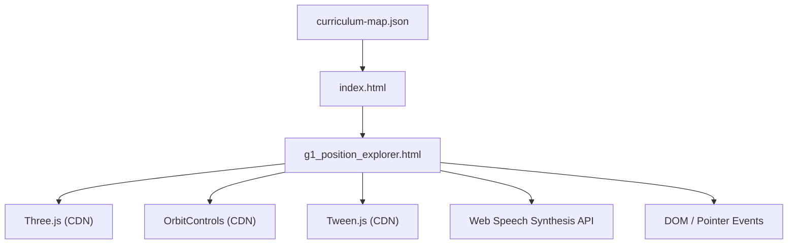

# Position Explorer

<cite>
**Referenced Files in This Document**
- [g1_position_explorer.html](file://src/math/g1_position_explorer.html)
- [index.html](file://src/index.html)
- [curriculum-map.json](file://src/data/curriculum-map.json)
</cite>

## Table of Contents
1. [Introduction](#introduction)
2. [Project Structure](#project-structure)
3. [Core Components](#core-components)
4. [Architecture Overview](#architecture-overview)
5. [Detailed Component Analysis](#detailed-component-analysis)
6. [Dependency Analysis](#dependency-analysis)
7. [Performance Considerations](#performance-considerations)
8. [Troubleshooting Guide](#troubleshooting-guide)
9. [Conclusion](#conclusion)
10. [Appendices](#appendices)

## Introduction
Position Explorer is a 3D, grid-based spatial reasoning game designed for early learners to explore directional language and coordinate concepts through interactive exploration. The player navigates a small room with four color-coded zones and several landmarks (tree, table, chair, door, box, pond, rocks, pillars, flowers). As the player moves a diamond-shaped avatar around the environment, the game detects the avatar’s position relative to these landmarks and generates descriptive sentences using prepositions such as “in,” “under,” “near,” “at,” “on,” “above,” “in front of,” “behind,” “beside,” “opposite,” “inside,” “next to,” “among,” “by,” and “between.” A scavenger hunt tracker highlights discovered words, and optional speech synthesis reads sentences aloud to reinforce auditory learning.

The experience emphasizes:
- Grid-aligned movement and boundary awareness
- Spatial relationships between objects
- Vocabulary acquisition via immediate feedback
- Accessibility features including screen reader support and keyboard-friendly navigation patterns

## Project Structure
Position Explorer is implemented as a single-file HTML5 application that embeds CSS and JavaScript. It uses Three.js for rendering, OrbitControls for camera rotation, and Tween.js for smooth animations. The curriculum map entry links this game under Grade 1, Unit 6 (Journeys), Math lane.

**Diagram sources**
- [g1_position_explorer.html:118-562](file://src/math/g1_position_explorer.html#L118-L562)
- [index.html:843-848](file://src/index.html#L843-L848)
- [curriculum-map.json:439-444](file://src/data/curriculum-map.json#L439-L444)

**Section sources**
- [g1_position_explorer.html:1-573](file://src/math/g1_position_explorer.html#L1-L573)
- [index.html:843-848](file://src/index.html#L843-L848)
- [curriculum-map.json:439-444](file://src/data/curriculum-map.json#L439-L444)

## Core Components
- 3D Environment and Objects
  - Four colored floor quadrants define zones.
  - Landmarks include a central tree, table, chair, door, wooden box, water puddle, rocks, stone pillars, and flowers.
  - All interactable meshes are collected into an intersection list for raycasting.

- Player Avatar and Ghost Box
  - The diamond avatar represents the player.
  - A wireframe ghost box previews the target grid cell on pointer move.

- Interaction and Movement
  - Pointer events drive raycasting against the scene.
  - Intersection points are rounded to integer coordinates to snap to a grid.
  - Tween.js animates the avatar from its current position to the new grid cell.

- Linguistic Logic Engine
  - updateUI computes the relationship between the avatar and nearby landmarks based on axis-aligned proximity checks and height comparisons.
  - Sentences are constructed dynamically and displayed in the top HUD.

- Scavenger Hunt Tracker
  - Tracks discovered vocabulary words and updates badges.
  - Celebrates completion when all words are found.

- Audio and Speech
  - Optional text-to-speech reads the sentence aloud after user interaction.
  - A manual “Read” button allows explicit playback.

**Section sources**
- [g1_position_explorer.html:152-324](file://src/math/g1_position_explorer.html#L152-L324)
- [g1_position_explorer.html:325-444](file://src/math/g1_position_explorer.html#L325-L444)
- [g1_position_explorer.html:446-513](file://src/math/g1_position_explorer.html#L446-L513)
- [g1_position_explorer.html:348-390](file://src/math/g1_position_explorer.html#L348-L390)
- [g1_position_explorer.html:515-533](file://src/math/g1_position_explorer.html#L515-L533)

## Architecture Overview
The system follows a straightforward event-driven architecture:
- Input layer captures pointer events and converts them to world-space intersections.
- Movement logic updates the avatar’s grid-aligned position and triggers animation.
- Language engine evaluates spatial relations and constructs sentences.
- UI layer updates the HUD and badge tracker.
- Audio layer optionally speaks the sentence.

**Diagram sources**
- [g1_position_explorer.html:392-444](file://src/math/g1_position_explorer.html#L392-L444)
- [g1_position_explorer.html:446-513](file://src/math/g1_position_explorer.html#L446-L513)
- [g1_position_explorer.html:515-533](file://src/math/g1_position_explorer.html#L515-L533)

## Detailed Component Analysis

### Grid-Based Positioning System
- Coordinate Space
  - World units align with integer grid cells; positions are rounded to nearest integers.
  - Y-axis indicates height above the floor plane; X and Z indicate horizontal placement.

- Boundary Detection
  - Floor quadrants span a 10x10 area centered at ±5 along X and Z.
  - The grid helper overlays a 20x20 grid for visual reference.
  - Intersections outside valid surfaces return null, preventing invalid moves.

- Collision Avoidance
  - The game does not implement hard collision blocking; instead, it snaps to the nearest surface intersection.
  - If a pointer lands on an object, the ghost box and subsequent move reflect that surface’s normal offset.

- Movement Algorithm
  - On pointerdown, compute intersection, round to grid, animate avatar to target.
  - Continuous pointermove updates ghost box visibility and position.

**Diagram sources**
- [g1_position_explorer.html:392-444](file://src/math/g1_position_explorer.html#L392-L444)

**Section sources**
- [g1_position_explorer.html:179-183](file://src/math/g1_position_explorer.html#L179-L183)
- [g1_position_explorer.html:392-444](file://src/math/g1_position_explorer.html#L392-L444)

### Linguistic Logic Engine
- Precomputed Zone Variables
  - Proximity flags for the tree, table, and other landmarks simplify conditionals.
  - Height thresholds differentiate “on,” “under,” “above,” and ground-level relations.

- Relationship Mapping
  - Central Tree: IN (within canopy bounds), UNDER (ground/near base), NEAR (close by).
  - Door: AT (specific location near door mat).
  - Table: ON (top surface), UNDER (below top), ABOVE (higher than top), IN FRONT OF, BEHIND, BESIDE.
  - Chair: OPPOSITE, ON, UNDER, BEHIND.
  - Wooden Box: INSIDE (centered inside), NEXT TO (adjacent sides).
  - Water Puddle: IN (within radius).
  - Rocks: AMONG (within cluster), BY (near edge).
  - Pillars: ON (top surfaces), BETWEEN (midpoint), NEAR (proximity).
  - Flowers: ABOVE (elevated over flower bed).

- Sentence Construction
  - When a relation is detected, the HUD displays a sentence highlighting the key preposition and the landmark.

**Diagram sources**
- [g1_position_explorer.html:446-513](file://src/math/g1_position_explorer.html#L446-L513)

**Section sources**
- [g1_position_explorer.html:446-513](file://src/math/g1_position_explorer.html#L446-L513)

### Scavenger Hunt Tracker
- Vocabulary Set
  - A fixed set of 15 prepositions drives discovery goals.

- Badge State Management
  - Undiscovered badges are grayed out; discovered badges turn green with an animation.
  - Completion triggers a celebratory message and optional audio cue.

- Integration with Language Engine
  - Each time a new word is generated, trackWord marks it as found if not already present.

**Section sources**
- [g1_position_explorer.html:348-390](file://src/math/g1_position_explorer.html#L348-L390)
- [g1_position_explorer.html:498-513](file://src/math/g1_position_explorer.html#L498-L513)

### Accessibility Features
- Keyboard Navigation
  - The page includes a visible “Back to PYP curriculum map” link with focus-visible styling, supporting keyboard users.
  - The “Read” button is explicitly labeled and clickable, enabling manual audio playback.

- Screen Reader Support
  - The HUD sentence container updates innerHTML with semantic text; while aria-live is not explicitly set on the sentence element, the structure is simple enough for basic screen readers to announce changes.
  - The main index page uses aria attributes for grade tabs and unit lists.

- Visual Accommodations
  - High-contrast colors and large fonts improve readability.
  - Clear visual cues (ghost box, highlighted badges) aid orientation.

- Audio Considerations
  - Speech synthesis requires a prior user gesture; the game sets a flag upon first canvas interaction to enable auto-read.

**Section sources**
- [g1_position_explorer.html:515-533](file://src/math/g1_position_explorer.html#L515-L533)
- [g1_position_explorer.html:564-569](file://src/math/g1_position_explorer.html#L564-L569)
- [index.html:441-463](file://src/index.html#L441-L463)

## Dependency Analysis
Position Explorer depends on external libraries loaded via CDN:
- Three.js core for 3D rendering
- OrbitControls for camera manipulation
- Tween.js for animation

It also integrates with browser APIs:
- Web Speech Synthesis for text-to-speech
- Pointer Events for unified mouse/touch input
- DOM APIs for UI updates

**Diagram sources**
- [g1_position_explorer.html:114-116](file://src/math/g1_position_explorer.html#L114-L116)
- [index.html:843-848](file://src/index.html#L843-L848)
- [curriculum-map.json:439-444](file://src/data/curriculum-map.json#L439-L444)

**Section sources**
- [g1_position_explorer.html:114-116](file://src/math/g1_position_explorer.html#L114-L116)
- [index.html:843-848](file://src/index.html#L843-L848)
- [curriculum-map.json:439-444](file://src/data/curriculum-map.json#L439-L444)

## Performance Considerations
- Rendering
  - Shadows are enabled; consider disabling or limiting shadow-casting objects on low-end devices.
  - Pixel ratio is capped to avoid excessive GPU load on high-DPI screens.

- Animation
  - Tween.js updates occur each frame; ensure only necessary tweens are active to reduce overhead.

- Interaction
  - Raycasting runs on every pointermove; consider throttling or debouncing if performance issues arise on slower devices.

[No sources needed since this section provides general guidance]

## Troubleshooting Guide
- No Audio Playback
  - Ensure the user has interacted with the canvas before expecting auto-read; the game sets an interaction flag on first pointerdown.
  - Verify browser supports SpeechSynthesis and that no autoplay policies block audio.

- Avatar Not Moving
  - Confirm pointer events are firing and raycasting returns hits; check that intersectables include the intended surfaces.
  - Validate that rounding to grid produces valid coordinates within the scene bounds.

- Incorrect Spatial Relations
  - Review proximity thresholds and height checks in the linguistic logic engine; adjust ranges to better match landmark sizes.
  - Ensure landmark positions and dimensions align with expected relation zones.

- Badges Not Updating
  - Check that trackWord receives the correct word string and that badge IDs match the vocabulary list.
  - Confirm the HUD element exists and is updated after word detection.

**Section sources**
- [g1_position_explorer.html:348-390](file://src/math/g1_position_explorer.html#L348-L390)
- [g1_position_explorer.html:392-444](file://src/math/g1_position_explorer.html#L392-L444)
- [g1_position_explorer.html:446-513](file://src/math/g1_position_explorer.html#L446-L513)
- [g1_position_explorer.html:515-533](file://src/math/g1_position_explorer.html#L515-L533)

## Conclusion
Position Explorer offers a focused, engaging way for young learners to practice directional language and spatial reasoning through a 3D grid environment. Its design balances simplicity and educational value: clear visual feedback, immediate linguistic reinforcement, and accessible controls. The modular structure—interaction, movement, language logic, UI, and audio—makes it straightforward to extend with new landmarks, vocabulary, and progression systems.

[No sources needed since this section summarizes without analyzing specific files]

## Appendices

### Educational Scaffolding Progression
- Basic Level
  - Focus on cardinal directions and simple prepositions: left/right/up/down equivalents via “in front of,” “behind,” “above,” “below,” “next to.”
  - Encourage exploration of the four zones and central tree.

- Intermediate Level
  - Introduce more nuanced relations: “beside,” “opposite,” “among,” “by,” “between.”
  - Use the scavenger hunt tracker to motivate discovery across all zones.

- Advanced Level
  - Challenge students to plan paths between multiple landmarks using sequences of prepositions.
  - Add constraints like avoiding certain areas or collecting items at specific coordinates.

[No sources needed since this section provides general guidance]

### Implementation Examples

#### Creating Custom Grid Layouts
- Adjust quadrant geometry and positions to change zone sizes and boundaries.
- Modify the grid helper scale and subdivisions to alter grid density.
- Update intersectables list to include new floor tiles or platforms.

**Section sources**
- [g1_position_explorer.html:157-183](file://src/math/g1_position_explorer.html#L157-L183)

#### Adding Obstacles and Collectibles
- Create new meshes (boxes, cylinders, custom geometries) and add them to the intersectables array.
- Assign distinct materials and shadows for clarity.
- Optionally tag collectible objects and integrate scoring or tracking logic similar to the scavenger hunt.

**Section sources**
- [g1_position_explorer.html:214-324](file://src/math/g1_position_explorer.html#L214-L324)

#### Implementing Multi-Level Progression Systems
- Extend the vocabulary set and badge tracker to support level-specific word lists.
- Introduce checkpoints or gates that unlock new zones upon completing tasks.
- Persist progress using localStorage or a backend service for multi-session continuity.

**Section sources**
- [g1_position_explorer.html:348-390](file://src/math/g1_position_explorer.html#L348-L390)

### Accessibility Checklist
- Keyboard Navigation
  - Provide visible focus indicators for interactive elements.
  - Ensure all actions can be triggered via keyboard shortcuts where appropriate.

- Screen Reader Support
  - Use semantic headings and labels.
  - Announce dynamic content changes with aria-live regions if needed.

- Visual Accommodations
  - Maintain sufficient contrast ratios.
  - Offer scalable text and avoid reliance on color alone to convey meaning.

- Audio Considerations
  - Always require user gestures before playing audio.
  - Provide manual controls to start/stop speech synthesis.

**Section sources**
- [g1_position_explorer.html:515-533](file://src/math/g1_position_explorer.html#L515-L533)
- [g1_position_explorer.html:564-569](file://src/math/g1_position_explorer.html#L564-L569)