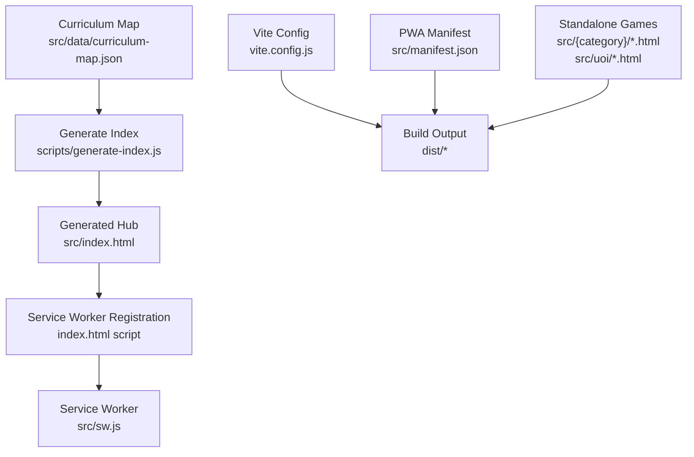
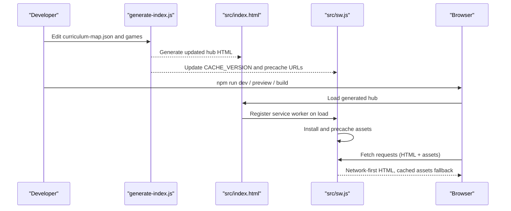
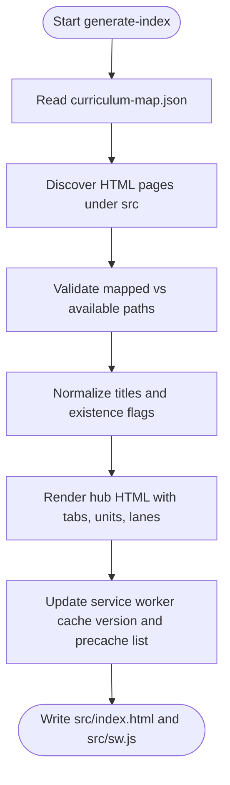
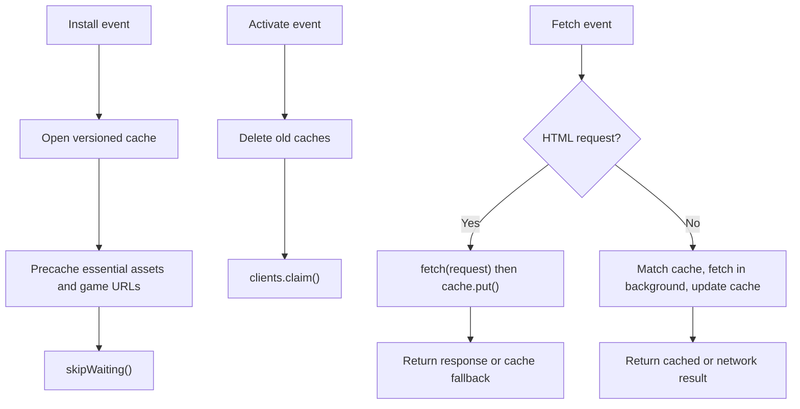
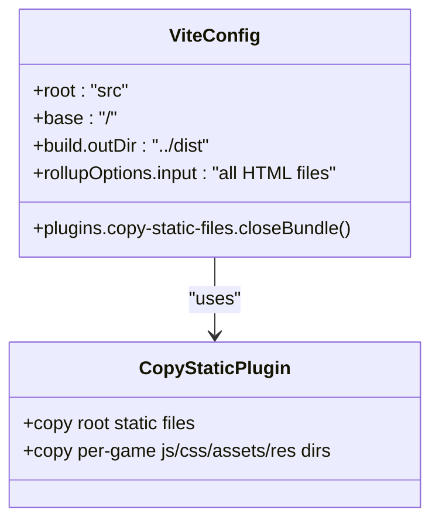
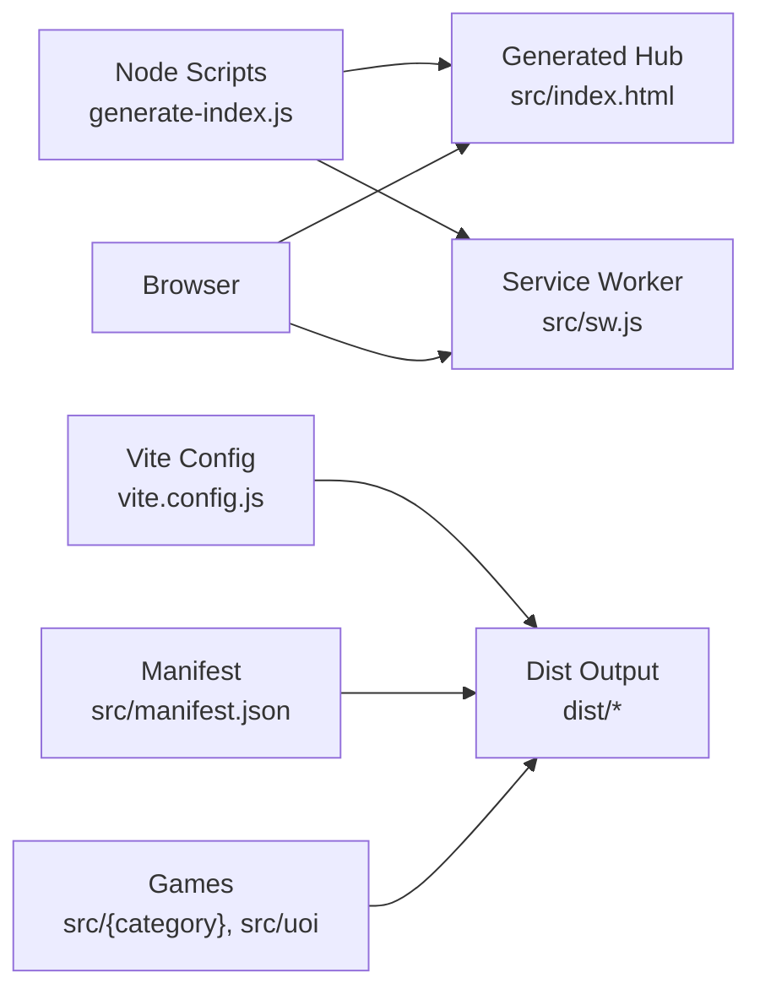

# Project Overview & Getting Started

<cite>
**Referenced Files in This Document**
- [README.md](file://README.md)
- [package.json](file://package.json)
- [vite.config.js](file://vite.config.js)
- [src/index.html](file://src/index.html)
- [src/manifest.json](file://src/manifest.json)
- [src/sw.js](file://src/sw.js)
- [scripts/generate-index.js](file://scripts/generate-index.js)
- [src/data/curriculum-map.json](file://src/data/curriculum-map.json)
- [docs/manual-visual-qa.md](file://docs/manual-visual-qa.md)
- [docs/grade1-uoi-map.md](file://docs/grade1-uoi-map.md)
- [src/uoi/g1_goal_steps_quest.html](file://src/uoi/g1_goal_steps_quest.html)
</cite>

## Table of Contents
1. [Introduction](#introduction)
2. [Project Structure](#project-structure)
3. [Core Components](#core-components)
4. [Architecture Overview](#architecture-overview)
5. [Detailed Component Analysis](#detailed-component-analysis)
6. [Dependency Analysis](#dependency-analysis)
7. [Performance Considerations](#performance-considerations)
8. [Troubleshooting Guide](#troubleshooting-guide)
9. [Conclusion](#conclusion)
10. [Appendices](#appendices)

## Introduction
IB PYP Games is an interactive educational gaming platform designed for IB Primary Years Programme (PYP) students. It organizes learning around the Unit of Inquiry (UOI), connecting subject practice across Literacy, Math, Science, and Chinese 中文 to each inquiry unit. The project provides a curriculum-aligned hub that navigates Grade → Unit of Inquiry → Subject lane → Game, with standalone HTML5 activities optimized for iPad landscape and desktop use.

Key goals:
- Curriculum-first navigation aligned to IB PYP themes and learner profile attributes
- Standalone, touch-friendly games with clear return paths to the curriculum hub
- Progressive Web App features for offline access and installability
- Automated generation of the curriculum hub from a single source of truth

Educators can use the generated homepage to guide students through units and subjects. Developers can add or update games by editing the curriculum map and running build scripts.

[No sources needed since this section summarizes without analyzing specific files]

## Project Structure
The repository follows a simple, scalable structure:
- src: Application source code and static assets
  - index.html: Generated curriculum hub
  - manifest.json: PWA manifest
  - sw.js: Service worker for caching and offline support
  - data/curriculum-map.json: Source of truth for grades, units, subjects, and games
  - Category folders: Chinese, literacy, math, science
  - uoi: Standalone UOI games
- scripts: Build-time utilities
  - generate-index.js: Generates the curriculum hub and updates service worker cache version
- docs: Guides and checklists
- package.json: Scripts and dependencies
- vite.config.js: Vite configuration for multi-page build and asset copying

**Diagram sources**
- [scripts/generate-index.js:1-120](file://scripts/generate-index.js#L1-L120)
- [src/index.html:1098-1144](file://src/index.html#L1098-L1144)
- [src/sw.js:1-43](file://src/sw.js#L1-L43)
- [vite.config.js:47-69](file://vite.config.js#L47-L69)
- [src/manifest.json:1-22](file://src/manifest.json#L1-L22)

**Section sources**
- [README.md:1-28](file://README.md#L1-L28)
- [docs/grade1-uoi-map.md:1-25](file://docs/grade1-uoi-map.md#L1-L25)

## Core Components
- Curriculum Map: Central JSON defining grades, units, subjects, and game links. It drives the generated homepage and QA checks.
- Generate Index Script: Reads the curriculum map, discovers game pages, validates mappings, renders the hub HTML, and updates the service worker cache version.
- Generated Hub: A responsive, accessible interface with grade tabs, unit bands, subject lanes, and game cards. Includes client-side tab switching and service worker registration.
- Service Worker: Precaches essential assets, uses network-first for HTML and stale-while-revalidate for static assets, and supports cache versioning and cleanup.
- Vite Configuration: Multi-page build for all HTML files, minification, externalization of CDN imports, and post-build copying of static assets and per-game directories.
- PWA Manifest: Defines app name, icons, display mode, start URL, and theme color for installation and standalone behavior.

Practical usage patterns:
- Add a new game under src/{category}/ or src/uoi/
- Update src/data/curriculum-map.json with path and metadata
- Run npm run qa:curriculum to validate mapping and accessibility basics
- Run npm run build to regenerate the hub and update the service worker cache version

**Section sources**
- [src/data/curriculum-map.json:1-120](file://src/data/curriculum-map.json#L1-L120)
- [scripts/generate-index.js:109-149](file://scripts/generate-index.js#L109-L149)
- [scripts/generate-index.js:788-819](file://scripts/generate-index.js#L788-L819)
- [src/index.html:1098-1144](file://src/index.html#L1098-L1144)
- [src/sw.js:45-73](file://src/sw.js#L45-L73)
- [vite.config.js:47-69](file://vite.config.js#L47-L69)
- [src/manifest.json:1-22](file://src/manifest.json#L1-L22)

## Architecture Overview
The system is a static site generator plus a PWA runtime:
- Data-driven hub generation at build time
- Client-side navigation via hash-based tabs
- Service worker enabling offline capabilities and fast repeat visits
- Vite orchestrating multi-page builds and asset handling

**Diagram sources**
- [scripts/generate-index.js:788-819](file://scripts/generate-index.js#L788-L819)
- [src/index.html:1098-1144](file://src/index.html#L1098-L1144)
- [src/sw.js:45-122](file://src/sw.js#L45-L122)

## Detailed Component Analysis

### Curriculum Map and Generated Hub
The curriculum map defines the Grade → Unit → Subject → Game hierarchy. The generator reads it, validates against discovered HTML pages, normalizes titles and existence flags, and renders the hub with subject lanes and game cards. Planned grades show placeholder theme spaces until content is added.

**Diagram sources**
- [scripts/generate-index.js:109-149](file://scripts/generate-index.js#L109-L149)
- [scripts/generate-index.js:788-819](file://scripts/generate-index.js#L788-L819)

**Section sources**
- [src/data/curriculum-map.json:1-120](file://src/data/curriculum-map.json#L1-L120)
- [scripts/generate-index.js:128-149](file://scripts/generate-index.js#L128-L149)
- [scripts/generate-index.js:788-819](file://scripts/generate-index.js#L788-L819)

### Service Worker and Offline Capabilities
The service worker implements:
- Cache versioning to force refreshes when rebuilt
- Install phase to precache essential assets and the full set of game URLs derived from the curriculum map
- Activate phase to delete old caches and claim clients
- Fetch strategy:
  - HTML pages: network-first with cache fallback
  - Static assets: stale-while-revalidate to serve cached immediately and update in background

**Diagram sources**
- [src/sw.js:1-43](file://src/sw.js#L1-L43)
- [src/sw.js:45-73](file://src/sw.js#L45-L73)
- [src/sw.js:75-122](file://src/sw.js#L75-L122)

**Section sources**
- [src/sw.js:1-43](file://src/sw.js#L1-L43)
- [src/sw.js:45-73](file://src/sw.js#L45-L73)
- [src/sw.js:75-122](file://src/sw.js#L75-L122)

### Vite Build and Asset Handling
Vite is configured for:
- Multi-page entry points for every HTML file under src
- Minification and terser options preserving console logs for debugging
- Externalizing Three.js and CDN imports to avoid bundling large libraries
- Post-build copy of static files (manifest, service worker, icons) and per-game directories (js, css, assets, res)

**Diagram sources**
- [vite.config.js:47-69](file://vite.config.js#L47-L69)
- [vite.config.js:70-173](file://vite.config.js#L70-L173)

**Section sources**
- [vite.config.js:47-69](file://vite.config.js#L47-L69)
- [vite.config.js:70-173](file://vite.config.js#L70-L173)

### PWA Manifest and Installation
The manifest defines:
- App name and short name
- Icons for home screen
- Display mode standalone
- Start URL and scope
- Theme and background colors

This enables installation on supported browsers and consistent standalone experience.

**Section sources**
- [src/manifest.json:1-22](file://src/manifest.json#L1-L22)

### Example UOI Game Pattern
Standalone UOI games follow a consistent pattern:
- Single-file HTML with embedded CSS and JS
- Viewport meta tag for responsiveness
- Large touch targets and tablet-friendly layout
- Clear “PYP Map” return link to the generated hub
- Simple feedback after user actions

Example reference:
- Goal Steps Quest demonstrates goal selection, action step sequencing, and star scoring with accessible UI elements.

**Section sources**
- [src/uoi/g1_goal_steps_quest.html:1-70](file://src/uoi/g1_goal_steps_quest.html#L1-L70)
- [src/uoi/g1_goal_steps_quest.html:70-193](file://src/uoi/g1_goal_steps_quest.html#L70-L193)

## Dependency Analysis
- Build-time dependencies:
  - Node scripts for generating the hub and updating the service worker
  - Vite for development server and production build
  - Terser and minify plugin for optimization
- Runtime dependencies:
  - Browser APIs: ServiceWorker, localStorage (in some games), Web Audio API (in some games)
  - Optional third-party libraries loaded via importmap or CDN (e.g., Three.js)

**Diagram sources**
- [scripts/generate-index.js:1-120](file://scripts/generate-index.js#L1-L120)
- [vite.config.js:47-69](file://vite.config.js#L47-L69)
- [src/manifest.json:1-22](file://src/manifest.json#L1-L22)

**Section sources**
- [package.json:1-20](file://package.json#L1-L20)
- [vite.config.js:47-69](file://vite.config.js#L47-L69)

## Performance Considerations
- Use network-first for HTML to ensure fresh content while still supporting offline fallbacks
- Leverage stale-while-revalidate for static assets to improve perceived performance
- Keep standalone games self-contained to reduce cross-page overhead
- Avoid bundling large libraries; prefer CDN imports where appropriate
- Ensure images and audio are appropriately sized and compressed
- Prefer minimal DOM manipulation and efficient event handling in games

[No sources needed since this section provides general guidance]

## Troubleshooting Guide
Common issues and resolutions:
- Curriculum validation failures:
  - Ensure every game referenced in the curriculum map exists under src
  - Confirm href overrides point to valid query-string variants if used
  - Run npm run qa:curriculum before committing changes
- Missing return links or viewport tags:
  - Each standalone game should include a viewport meta tag and a “PYP Map” link back to the hub
- Service worker not updating:
  - Rebuild to increment cache version; the generator updates the version string automatically
  - Clear browser caches or open in incognito to test fresh installs
- Assets not copied in dist:
  - Verify per-game directories exist (js, css, assets, res) and are recognized by the copy plugin
- Visual QA gaps:
  - Follow the manual checklist for viewports, interactions, and iPad landscape focus

**Section sources**
- [README.md:30-57](file://README.md#L30-L57)
- [docs/manual-visual-qa.md:1-40](file://docs/manual-visual-qa.md#L1-L40)
- [docs/manual-visual-qa.md:63-124](file://docs/manual-visual-qa.md#L63-L124)

## Conclusion
IB PYP Games provides a curriculum-aligned, accessible, and installable platform for early learners. By centralizing curriculum data and automating hub generation, educators and developers can maintain a coherent learning journey across units and subjects. The service worker ensures reliable offline access, while the design prioritizes touch-friendly interactions for iPad and desktop environments.

[No sources needed since this section summarizes without analyzing specific files]

## Appendices

### Installation and Development Setup
- Prerequisites: Node.js and npm installed
- Commands:
  - Install dependencies: npm install
  - Start development server: npm run dev
  - Preview production build locally: npm run preview
  - Validate curriculum and links: npm run qa:curriculum
  - List QA URLs from current map: npm run qa:urls
  - Build for production: npm run build

Notes:
- The build regenerates the hub and updates the service worker cache version
- The generated hub is served from the root during development and preview

**Section sources**
- [README.md:30-57](file://README.md#L30-L57)
- [package.json:6-12](file://package.json#L6-L12)

### Browser Compatibility and Device Considerations
- Target devices: Desktop and iPad landscape first, with responsive fallbacks for smaller screens
- Touch targets: Minimum comfortable sizes for young learners
- Permissions: Camera, microphone, and audio must be initiated by user gestures
- Accessibility: Include viewport meta tags, semantic headings, and clear return links

**Section sources**
- [README.md:58-65](file://README.md#L58-L65)
- [docs/manual-visual-qa.md:31-48](file://docs/manual-visual-qa.md#L31-L48)

### Understanding the Generated Curriculum Hub
- Navigation model: Grade → Unit of Inquiry → Subject lane → Game
- Planned grades show theme placeholders until content is added
- Hero area highlights latest unit and summary for the active grade
- Subject lanes group related games with descriptive labels and icons

**Section sources**
- [docs/grade1-uoi-map.md:6-25](file://docs/grade1-uoi-map.md#L6-L25)
- [src/index.html:428-474](file://src/index.html#L428-L474)

### Adding or Reorganizing Games
Steps:
- Place the game HTML under src/{category}/ or src/uoi/
- Add or update the corresponding entry in src/data/curriculum-map.json
- Use href for unit-specific query strings when reusing existing games
- Run npm run qa:curriculum to validate
- Run npm run build to regenerate the hub and update the service worker cache version

**Section sources**
- [README.md:50-57](file://README.md#L50-L57)
- [scripts/generate-index.js:109-149](file://scripts/generate-index.js#L109-L149)