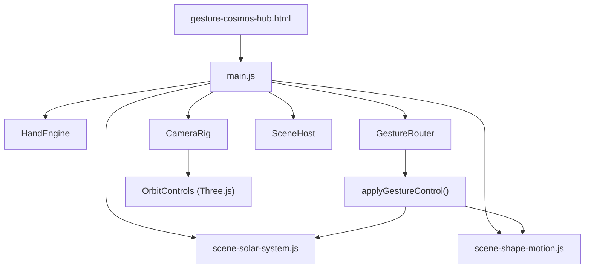
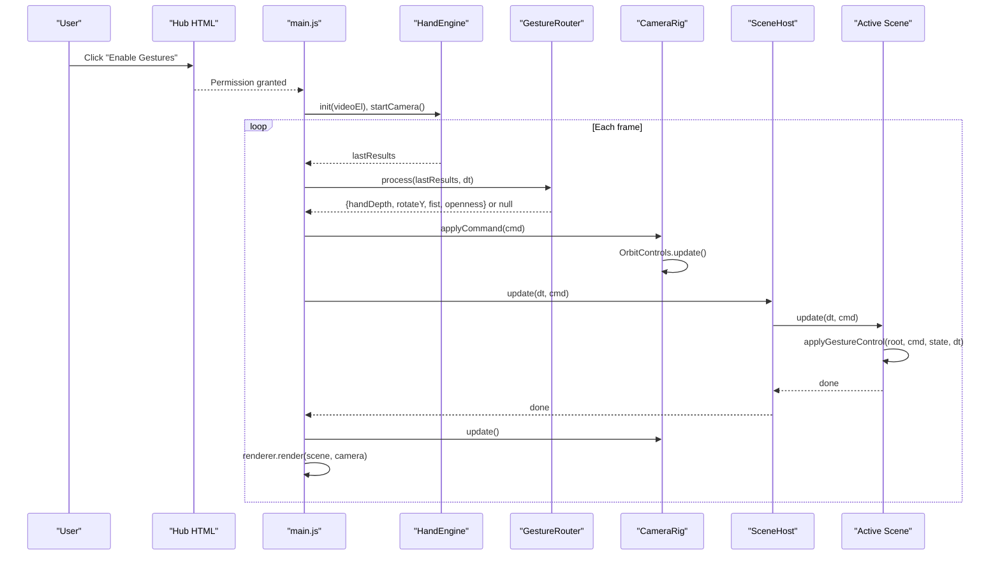
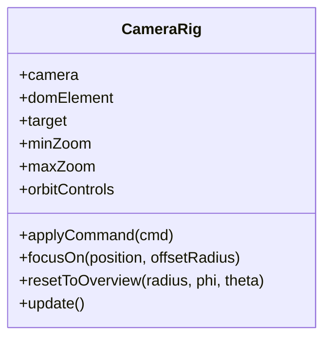
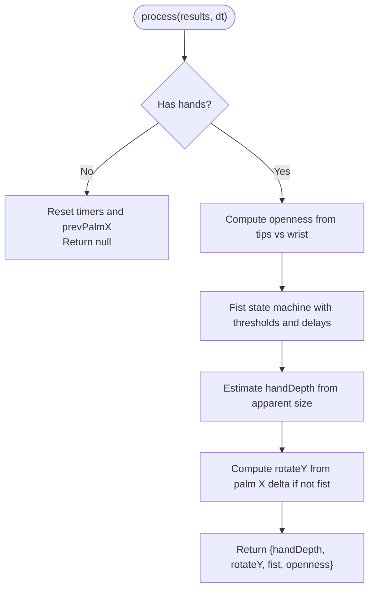
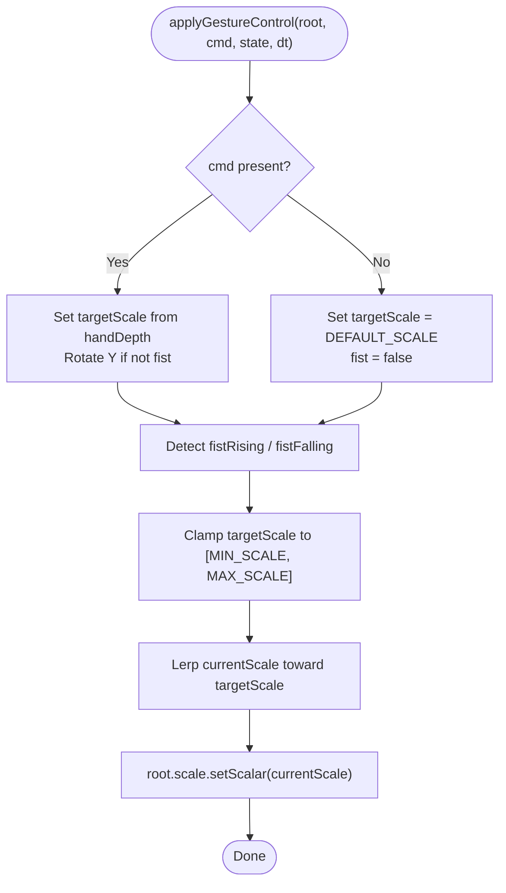
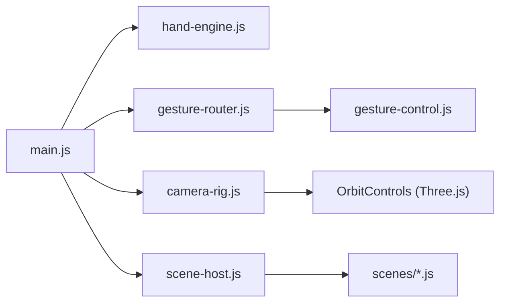

# Camera Rig & Navigation

<cite>
**Referenced Files in This Document**
- [gesture-cosmos-hub.html](file://src/science/gesture-cosmos-hub.html)
- [main.js](file://src/science/gesture-cosmos/main.js)
- [camera-rig.js](file://src/science/gesture-cosmos/core/camera-rig.js)
- [gesture-router.js](file://src/science/gesture-cosmos/core/gesture-router.js)
- [gesture-control.js](file://src/science/gesture-cosmos/core/gesture-control.js)
- [hand-engine.js](file://src/science/gesture-cosmos/core/hand-engine.js)
- [scene-host.js](file://src/science/gesture-cosmos/core/scene-host.js)
- [scene-solar-system.js](file://src/science/gesture-cosmos/scenes/scene-solar-system.js)
- [scene-shape-motion.js](file://src/science/gesture-cosmos/scenes/scene-shape-motion.js)
</cite>

## Table of Contents
1. [Introduction](#introduction)
2. [Project Structure](#project-structure)
3. [Core Components](#core-components)
4. [Architecture Overview](#architecture-overview)
5. [Detailed Component Analysis](#detailed-component-analysis)
6. [Dependency Analysis](#dependency-analysis)
7. [Performance Considerations](#performance-considerations)
8. [Troubleshooting Guide](#troubleshooting-guide)
9. [Conclusion](#conclusion)
10. [Appendices](#appendices)

## Introduction
This document explains the Camera Rig and Navigation system used across the Gesture Cosmos scenes. It focuses on how Three.js camera control is implemented, how gestures are interpreted and routed to scene objects, and how smooth transitions are achieved. The system intentionally separates camera navigation (mouse/touch via OrbitControls) from gesture-driven object manipulation (scale, rotation, and event-like triggers). This separation keeps interactions predictable and performant while enabling rich, expressive 3D experiences.

## Project Structure
The Gesture Cosmos application is organized around a small set of core modules that handle:
- MediaPipe hand tracking initialization and streaming
- Gesture interpretation into unified commands
- Object-level gesture application with smoothing
- A lightweight camera rig for mouse/touch orbit controls
- Scene lifecycle management and per-scene updates

**Diagram sources**
- [gesture-cosmos-hub.html:227-238](file://src/science/gesture-cosmos-hub.html#L227-L238)
- [main.js:8-64](file://src/science/gesture-cosmos/main.js#L8-L64)
- [hand-engine.js:1-83](file://src/science/gesture-cosmos/core/hand-engine.js#L1-L83)
- [gesture-router.js:1-111](file://src/science/gesture-cosmos/core/gesture-router.js#L1-L111)
- [gesture-control.js:1-88](file://src/science/gesture-cosmos/core/gesture-control.js#L1-L88)
- [camera-rig.js:1-61](file://src/science/gesture-cosmos/core/camera-rig.js#L1-L61)
- [scene-host.js:1-63](file://src/science/gesture-cosmos/core/scene-host.js#L1-L63)
- [scene-solar-system.js:1-439](file://src/science/gesture-cosmos/scenes/scene-solar-system.js#L1-L439)
- [scene-shape-motion.js:1-318](file://src/science/gesture-cosmos/scenes/scene-shape-motion.js#L1-L318)

**Section sources**
- [gesture-cosmos-hub.html:227-238](file://src/science/gesture-cosmos-hub.html#L227-L238)
- [main.js:8-64](file://src/science/gesture-cosmos/main.js#L8-L64)

## Core Components
- HandEngine: Initializes MediaPipe Hands and Camera utilities, streams frames, and exposes results to the router.
- GestureRouter: Translates raw landmarks into a normalized command including hand depth, Y-axis rotation delta, fist state, and openness.
- applyGestureControl: Applies scale and optional rotation to a target Object3D using smoothed interpolation and edge-triggered events.
- CameraRig: Wraps OrbitControls for mouse/touch orbiting, zoom, and programmatic focus/reset actions.
- SceneHost: Manages dynamic scene loading, lifecycle, and update dispatch.
- Scenes: Implement init/update/dispose and use gesture-control to react to gestures.

Key responsibilities:
- Input pipeline: HandEngine → GestureRouter → Scene update loop
- Object control: applyGestureControl scales and rotates scene objects smoothly
- Camera control: CameraRig handles user navigation via mouse/touch; gestures do not move the camera directly

**Section sources**
- [hand-engine.js:1-83](file://src/science/gesture-cosmos/core/hand-engine.js#L1-L83)
- [gesture-router.js:1-111](file://src/science/gesture-cosmos/core/gesture-router.js#L1-L111)
- [gesture-control.js:1-88](file://src/science/gesture-cosmos/core/gesture-control.js#L1-L88)
- [camera-rig.js:1-61](file://src/science/gesture-cosmos/core/camera-rig.js#L1-L61)
- [scene-host.js:1-63](file://src/science/gesture-cosmos/core/scene-host.js#L1-L63)

## Architecture Overview
The runtime flow connects UI, input, routing, and rendering:

**Diagram sources**
- [gesture-cosmos-hub.html:248-266](file://src/science/gesture-cosmos-hub.html#L248-L266)
- [main.js:116-186](file://src/science/gesture-cosmos/main.js#L116-L186)
- [hand-engine.js:21-71](file://src/science/gesture-cosmos/core/hand-engine.js#L21-L71)
- [gesture-router.js:34-109](file://src/science/gesture-cosmos/core/gesture-router.js#L34-L109)
- [camera-rig.js:30-59](file://src/science/gesture-cosmos/core/camera-rig.js#L30-L59)
- [scene-host.js:57-61](file://src/science/gesture-cosmos/core/scene-host.js#L57-L61)

## Detailed Component Analysis

### CameraRig: Mouse/Touch Orbit Controls
Responsibilities:
- Initialize OrbitControls with damping and distance limits
- Provide programmatic focus and overview reset
- Update each frame to maintain smooth motion

Behavior highlights:
- Damping factor ensures smooth deceleration after user interaction
- Focus method sets target and positions camera at an offset radius
- Reset method computes spherical coordinates to return to a default viewpoint

**Diagram sources**
- [camera-rig.js:10-60](file://src/science/gesture-cosmos/core/camera-rig.js#L10-L60)

Usage examples:
- Solar System scene uses focusOn to center on celestial bodies and resetToOverview for global view.

**Section sources**
- [camera-rig.js:10-60](file://src/science/gesture-cosmos/core/camera-rig.js#L10-L60)
- [scene-solar-system.js:325-353](file://src/science/gesture-cosmos/scenes/scene-solar-system.js#L325-L353)

### Gesture Router: From Landmarks to Commands
Responsibilities:
- Compute openness from fingertip-to-wrist distances
- Debounce fist activation/deactivation with hysteresis timers
- Estimate hand depth from apparent size
- Derive Y-axis rotation from palm X movement when open

Command contract:
- handDepth: 0.0 (close) to 1.0 (far)
- rotateY: radians per frame (clamped)
- fist: boolean stable state
- openness: normalized measure

**Diagram sources**
- [gesture-router.js:34-109](file://src/science/gesture-cosmos/core/gesture-router.js#L34-L109)

Notes:
- No camera movement is driven by gestures; camera remains controlled by OrbitControls.

**Section sources**
- [gesture-router.js:1-111](file://src/science/gesture-cosmos/core/gesture-router.js#L1-L111)

### Gesture Control: Smooth Object Manipulation
Responsibilities:
- Maintain per-scene gesture state (currentScale, targetScale, fist flags)
- Apply scale based on handDepth and clamp within MIN_SCALE/MAX_SCALE
- Rotate root group on Y axis only when open palm
- Emit one-frame rising/falling edges for fist activation/release

Smoothing:
- Linear interpolation toward targetScale each frame
- Edge detection allows scenes to trigger effects exactly once per gesture transition

**Diagram sources**
- [gesture-control.js:50-83](file://src/science/gesture-cosmos/core/gesture-control.js#L50-L83)

Integration points:
- Scenes call applyGestureControl with their root object and per-scene state.

**Section sources**
- [gesture-control.js:1-88](file://src/science/gesture-cosmos/core/gesture-control.js#L1-L88)

### Hand Engine: MediaPipe Integration
Responsibilities:
- Initialize MediaPipe Hands and Camera utilities
- Stream frames and forward results to callbacks
- Provide stop() cleanup

Error handling:
- Throws descriptive errors when libraries are missing
- Exposes onError callback for graceful degradation

**Section sources**
- [hand-engine.js:1-83](file://src/science/gesture-cosmos/core/hand-engine.js#L1-L83)

### Scene Host: Lifecycle Management
Responsibilities:
- Register and switch scenes dynamically
- Dispose previous scene before initializing next
- Reset camera overview after successful scene init
- Dispatch update calls to active scene

**Section sources**
- [scene-host.js:1-63](file://src/science/gesture-cosmos/core/scene-host.js#L1-L63)

### Example Scenes: Using the System

#### Solar System Scene
- Uses createGestureState and applyGestureControl to scale and rotate the entire solar root group
- Provides UI buttons to focus on specific bodies and reset to overview
- Demonstrates cameraRig.focusOn and resetToOverview usage

**Section sources**
- [scene-solar-system.js:268-300](file://src/science/gesture-cosmos/scenes/scene-solar-system.js#L268-L300)
- [scene-solar-system.js:325-353](file://src/science/gesture-cosmos/scenes/scene-solar-system.js#L325-L353)
- [scene-solar-system.js:362-404](file://src/science/gesture-cosmos/scenes/scene-solar-system.js#L362-L404)

#### Shape Motion Scene
- Uses gesture state to drive explosion/reconstruction via fist edges
- Precomputes explosion offsets once per fist rising edge for performance
- Smoothly interpolates particle positions toward shape targets

**Section sources**
- [scene-shape-motion.js:176-188](file://src/science/gesture-cosmos/scenes/scene-shape-motion.js#L176-L188)
- [scene-shape-motion.js:190-239](file://src/science/gesture-cosmos/scenes/scene-shape-motion.js#L190-L239)

## Dependency Analysis
High-level dependencies:
- main.js orchestrates all core modules and scene switching
- gesture-router depends on MediaPipe landmark structures
- gesture-control is a pure utility consumed by scenes
- camera-rig depends on Three.js OrbitControls
- hand-engine depends on MediaPipe Hands/Camera globals loaded via script tags

**Diagram sources**
- [main.js:8-64](file://src/science/gesture-cosmos/main.js#L8-L64)
- [gesture-router.js:1-111](file://src/science/gesture-cosmos/core/gesture-router.js#L1-L111)
- [gesture-control.js:1-88](file://src/science/gesture-cosmos/core/gesture-control.js#L1-L88)
- [camera-rig.js:1-61](file://src/science/gesture-cosmos/core/camera-rig.js#L1-L61)
- [scene-host.js:1-63](file://src/science/gesture-cosmos/core/scene-host.js#L1-L63)

**Section sources**
- [main.js:8-64](file://src/science/gesture-cosmos/main.js#L8-L64)

## Performance Considerations
- Smoothing factors:
  - OrbitControls dampingFactor balances responsiveness and smoothness.
  - applyGestureControl uses a fixed lerp coefficient for scale transitions; tune per device capability if needed.
- Heavy scenes:
  - Precompute expensive data (e.g., explosion offsets) on edge events rather than every frame.
  - Use BufferGeometry attributes and batch updates to minimize allocations.
- Rendering:
  - Pixel ratio capped to avoid overdraw on high-DPI devices.
  - Background stars and fog reduce perceived complexity without heavy geometry.
- Mobile fallbacks:
  - If camera permission fails, the app continues with mouse/touch OrbitControls.
  - Reduce particle counts or disable post-processing features on low-end devices.

[No sources needed since this section provides general guidance]

## Troubleshooting Guide
Common issues and resolutions:
- MediaPipe libraries not loaded:
  - Ensure script tags for Hands and Camera utilities are present before module execution.
  - Check console for explicit error messages indicating missing globals.
- Camera permission denied:
  - The hub overlay prompts the user; on failure, the app falls back to mouse/touch controls.
- No hand detected:
  - GestureRouter returns null; ensure scenes revert to default scale and clear fist states.
- Stuttering on mobile:
  - Lower pixel ratio, reduce particle counts, or simplify shapes.
  - Avoid per-frame allocation inside update loops; reuse arrays and precompute where possible.

**Section sources**
- [gesture-cosmos-hub.html:227-238](file://src/science/gesture-cosmos-hub.html#L227-L238)
- [main.js:116-130](file://src/science/gesture-cosmos/main.js#L116-L130)
- [hand-engine.js:21-71](file://src/science/gesture-cosmos/core/hand-engine.js#L21-L71)
- [gesture-router.js:34-42](file://src/science/gesture-cosmos/core/gesture-router.js#L34-L42)

## Conclusion
The Camera Rig & Navigation system cleanly separates camera navigation from gesture-driven object control. OrbitControls provides reliable mouse/touch interaction, while the gesture pipeline delivers intuitive scale, rotation, and event-like behaviors through robust debouncing and smoothing. Scenes integrate easily by applying gesture control to a root object and reacting to edge events. With careful attention to performance and fallbacks, the system supports both desktop and mobile users effectively.

[No sources needed since this section summarizes without analyzing specific files]

## Appendices

### Creating Custom Camera Behaviors
- Programmatic focus:
  - Use cameraRig.focusOn(worldPosition, offsetRadius) to center on a target and set a comfortable viewing distance.
- Overview reset:
  - Use cameraRig.resetToOverview(radius, phi, theta) to return to a default viewpoint.
- Combining with gestures:
  - Keep gestures focused on object manipulation; reserve camera changes for explicit UI actions or scripted sequences.

**Section sources**
- [camera-rig.js:37-55](file://src/science/gesture-cosmos/core/camera-rig.js#L37-L55)
- [scene-solar-system.js:325-353](file://src/science/gesture-cosmos/scenes/scene-solar-system.js#L325-L353)

### Implementing Smooth Interpolation
- Scale transitions:
  - Leverage applyGestureControl’s built-in lerp for natural scaling.
- Positional transitions:
  - For custom animations, interpolate vectors or quaternions with a time-based factor to achieve consistent motion across frame rates.

**Section sources**
- [gesture-control.js:75-83](file://src/science/gesture-cosmos/core/gesture-control.js#L75-L83)

### Optimizing Camera Performance for Complex Scenes
- Cap pixel ratio and adjust shadow map sizes.
- Limit background elements and fog density.
- Reuse geometries and materials; avoid per-frame allocations.
- Precompute offsets and buffers for complex effects.

[No sources needed since this section provides general guidance]

### Mobile Touch Fallbacks and Accessibility
- Fallback behavior:
  - If camera access is unavailable, the app continues with OrbitControls for pan, orbit, and zoom.
- Accessibility:
  - Ensure keyboard-accessible navigation buttons and visible focus indicators.
  - Provide alternative non-gesture controls for critical functions.

**Section sources**
- [main.js:116-130](file://src/science/gesture-cosmos/main.js#L116-L130)
- [gesture-cosmos-hub.html:248-266](file://src/science/gesture-cosmos-hub.html#L248-L266)