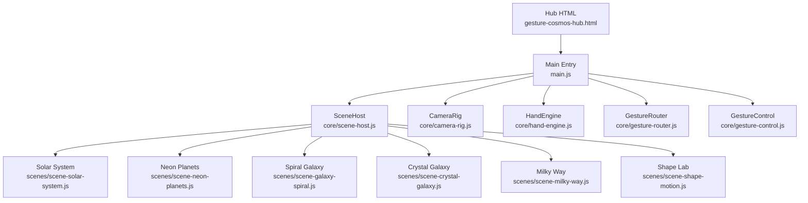
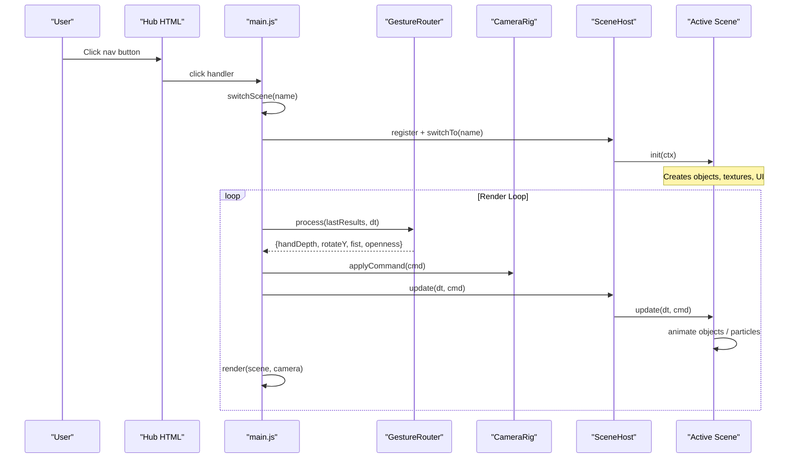
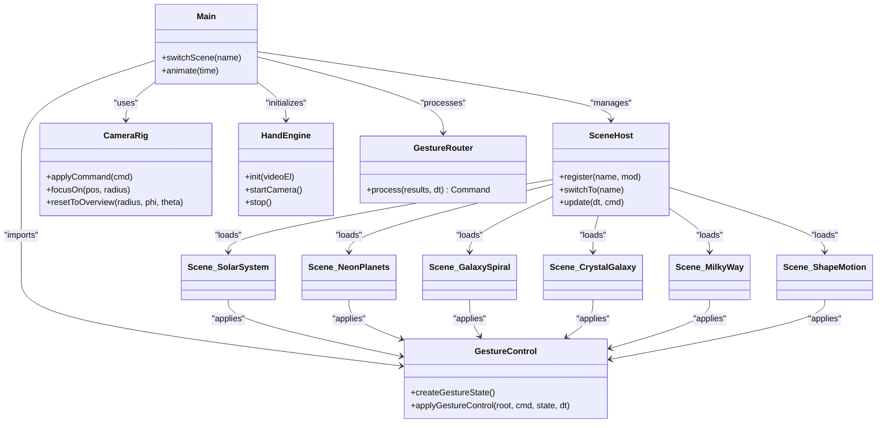

# Cosmic Scenes Collection

<cite>
**Referenced Files in This Document**
- [gesture-cosmos-hub.html](file://src/science/gesture-cosmos-hub.html)
- [main.js](file://src/science/gesture-cosmos/main.js)
- [scene-host.js](file://src/science/gesture-cosmos/core/scene-host.js)
- [camera-rig.js](file://src/science/gesture-cosmos/core/camera-rig.js)
- [hand-engine.js](file://src/science/gesture-cosmos/core/hand-engine.js)
- [gesture-router.js](file://src/science/gesture-cosmos/core/gesture-router.js)
- [gesture-control.js](file://src/science/gesture-cosmos/core/gesture-control.js)
- [scene-solar-system.js](file://src/science/gesture-cosmos/scenes/scene-solar-system.js)
- [scene-neon-planets.js](file://src/science/gesture-cosmos/scenes/scene-neon-planets.js)
- [scene-galaxy-spiral.js](file://src/science/gesture-cosmos/scenes/scene-galaxy-spiral.js)
- [scene-crystal-galaxy.js](file://src/science/gesture-cosmos/scenes/scene-crystal-galaxy.js)
- [scene-milky-way.js](file://src/science/gesture-cosmos/scenes/scene-milky-way.js)
- [scene-shape-motion.js](file://src/science/gesture-cosmos/scenes/scene-shape-motion.js)
</cite>

## Table of Contents
1. [Introduction](#introduction)
2. [Project Structure](#project-structure)
3. [Core Components](#core-components)
4. [Architecture Overview](#architecture-overview)
5. [Detailed Component Analysis](#detailed-component-analysis)
6. [Dependency Analysis](#dependency-analysis)
7. [Performance Considerations](#performance-considerations)
8. [Troubleshooting Guide](#troubleshooting-guide)
9. [Conclusion](#conclusion)

## Introduction
The Cosmic Scenes Collection is a set of six immersive 3D educational environments designed for interactive exploration and learning about celestial mechanics, particle systems, and mathematical geometry. The collection runs inside a gesture-enabled hub that supports both mouse/touch controls and optional hand gestures via MediaPipe Hands. Each scene provides unique visualizations, interactive elements, and educational objectives aligned with elementary science and math concepts such as orbital motion, patterns and cycles, and geometric transformations.

## Project Structure
The project is organized around a central hub page that bootstraps a shared Three.js renderer, camera, and core modules (hand tracking, gesture routing, camera rig, and scene host). Six scene modules are dynamically loaded on demand and registered with the SceneHost. Each scene implements a consistent interface: init(ctx), update(dt, cmd), and dispose().

**Diagram sources**
- [gesture-cosmos-hub.html:240-282](file://src/science/gesture-cosmos-hub.html#L240-L282)
- [main.js:1-187](file://src/science/gesture-cosmos/main.js#L1-L187)
- [scene-host.js:1-63](file://src/science/gesture-cosmos/core/scene-host.js#L1-L63)
- [camera-rig.js:1-61](file://src/science/gesture-cosmos/core/camera-rig.js#L1-L61)
- [hand-engine.js:1-83](file://src/science/gesture-cosmos/core/hand-engine.js#L1-L83)
- [gesture-router.js:1-111](file://src/science/gesture-cosmos/core/gesture-router.js#L1-L111)
- [gesture-control.js:1-88](file://src/science/gesture-cosmos/core/gesture-control.js#L1-L88)
- [scene-solar-system.js:1-439](file://src/science/gesture-cosmos/scenes/scene-solar-system.js#L1-L439)
- [scene-neon-planets.js:1-340](file://src/science/gesture-cosmos/scenes/scene-neon-planets.js#L1-L340)
- [scene-galaxy-spiral.js:1-338](file://src/science/gesture-cosmos/scenes/scene-galaxy-spiral.js#L1-L338)
- [scene-crystal-galaxy.js:1-290](file://src/science/gesture-cosmos/scenes/scene-crystal-galaxy.js#L1-L290)
- [scene-milky-way.js:1-295](file://src/science/gesture-cosmos/scenes/scene-milky-way.js#L1-L295)
- [scene-shape-motion.js:1-318](file://src/science/gesture-cosmos/scenes/scene-shape-motion.js#L1-L318)

**Section sources**
- [gesture-cosmos-hub.html:240-282](file://src/science/gesture-cosmos-hub.html#L240-L282)
- [main.js:1-187](file://src/science/gesture-cosmos/main.js#L1-L187)

## Core Components
- Hub HTML: Provides UI overlay, navigation buttons, permission prompts, and loads the main module.
- Main entry: Initializes Three.js, core services, dynamic scene loading, navigation, and the render loop.
- SceneHost: Manages lifecycle of scenes (register, switchTo, update, dispose).
- CameraRig: Mouse/touch orbit controls; also exposes focusOn and resetToOverview helpers used by scenes.
- HandEngine: MediaPipe Hands wrapper to initialize and run camera-based hand detection.
- GestureRouter: Translates raw landmarks into unified commands (handDepth, rotateY, fist, openness).
- GestureControl: Shared per-scene state machine and applyGestureControl helper for scale/rotation semantics.

Key responsibilities:
- Decouple rendering from input processing.
- Provide consistent gesture semantics across all scenes.
- Ensure clean resource disposal when switching scenes.

**Section sources**
- [main.js:1-187](file://src/science/gesture-cosmos/main.js#L1-L187)
- [scene-host.js:1-63](file://src/science/gesture-cosmos/core/scene-host.js#L1-L63)
- [camera-rig.js:1-61](file://src/science/gesture-cosmos/core/camera-rig.js#L1-L61)
- [hand-engine.js:1-83](file://src/science/gesture-cosmos/core/hand-engine.js#L1-L83)
- [gesture-router.js:1-111](file://src/science/gesture-cosmos/core/gesture-router.js#L1-L111)
- [gesture-control.js:1-88](file://src/science/gesture-cosmos/core/gesture-control.js#L1-L88)

## Architecture Overview
The runtime flow connects user input (mouse/touch or hand) to scene updates through a layered architecture.

**Diagram sources**
- [main.js:75-187](file://src/science/gesture-cosmos/main.js#L75-L187)
- [gesture-router.js:34-111](file://src/science/gesture-cosmos/core/gesture-router.js#L34-L111)
- [camera-rig.js:26-55](file://src/science/gesture-cosmos/core/camera-rig.js#L26-L55)
- [scene-host.js:31-62](file://src/science/gesture-cosmos/core/scene-host.js#L31-L62)

## Detailed Component Analysis

### Solar System Simulation
- Visuals: Realistic textured spheres for Sun and planets, Saturn ring, orbit lines, background starfield, point light at the Sun.
- Interactions:
  - Sidebar buttons to focus on each body.
  - Raycasting selection to focus on clicked bodies.
  - Unified gesture control scales and rotates the entire solar root group.
- Educational objectives:
  - Demonstrates relative sizes, orbital distances, speeds, and moons.
  - Reinforces Unit 5 themes of patterns and cycles.
- Controls:
  - Mouse/touch orbit via OrbitControls.
  - Gesture: open palm slide rotates; hand depth scales; fist triggers no rotation but can be used by scenes for effects.
- Performance notes:
  - Uses standard materials and shadows; moderate polygon counts; texture caching and disposal on scene exit.

**Section sources**
- [scene-solar-system.js:1-439](file://src/science/gesture-cosmos/scenes/scene-solar-system.js#L1-L439)
- [gesture-control.js:1-88](file://src/science/gesture-cosmos/core/gesture-control.js#L1-L88)
- [camera-rig.js:35-55](file://src/science/gesture-cosmos/core/camera-rig.js#L35-L55)

### Neon Planets
- Visuals: Stylized particle clouds forming planets with additive blending and glow textures; optional rings and halo particles.
- Interactions:
  - Sidebar selects among planets.
  - Fist gesture triggers an explosion effect by perturbing particle positions toward precomputed offsets; releasing reconstructs.
- Educational objectives:
  - Encourages observation of form, color variation, and emergent patterns.
- Controls:
  - Gesture-driven scale and rotation; fist rising edge computes stable offsets once per activation.
- Performance notes:
  - Large particle counts per planet; uses BufferGeometry attributes and typed arrays; careful disposal of geometries/materials.

**Section sources**
- [scene-neon-planets.js:1-340](file://src/science/gesture-cosmos/scenes/scene-neon-planets.js#L1-L340)
- [gesture-control.js:1-88](file://src/science/gesture-cosmos/core/gesture-control.js#L1-L88)

### Spiral Galaxy
- Visuals: Procedural spiral arms with multiple galaxy presets; background stars; fog for depth.
- Interactions:
  - Sidebar switches between galaxy presets.
  - Status HUD shows tracking mode and FPS.
- Educational objectives:
  - Explores arm structure, spin, randomness, and color gradients.
- Controls:
  - Gesture-controlled scale/rotation; auto self-rotation; entry scale-up animation.
- Performance notes:
  - Very large particle sets; shader-like PointsMaterial with custom size; efficient attribute buffers.

**Section sources**
- [scene-galaxy-spiral.js:1-338](file://src/science/gesture-cosmos/scenes/scene-galaxy-spiral.js#L1-L338)
- [gesture-control.js:1-88](file://src/science/gesture-cosmos/core/gesture-control.js#L1-L88)

### Crystal Galaxy
- Visuals: Geometric crystal-like formations using custom ShaderMaterial with sharp dot texture; bar structures and dust regions.
- Interactions:
  - Sidebar switches between named galaxies.
- Educational objectives:
  - Highlights discrete particle composition and structural parameters (arms, bars, spread).
- Controls:
  - Gesture-controlled scale/rotation; slow auto-rotation.
- Performance notes:
  - Custom vertex/fragment shaders for crisp points; manages disposables carefully.

**Section sources**
- [scene-crystal-galaxy.js:1-290](file://src/science/gesture-cosmos/scenes/scene-crystal-galaxy.js#L1-L290)
- [gesture-control.js:1-88](file://src/science/gesture-cosmos/core/gesture-control.js#L1-L88)

### Milky Way
- Visuals: High-fidelity star field with multiple color classes (core, arms, pink nebulae, dust); custom shader material for soft glowing points.
- Interactions:
  - Sidebar switches between realistic galaxy presets.
- Educational objectives:
  - Illustrates galactic components and distribution patterns.
- Controls:
  - Gesture-controlled scale/rotation; auto self-rotation.
- Performance notes:
  - Up to hundreds of thousands of particles; uses typed arrays and shader-based sizing; minimal CPU overhead per frame.

**Section sources**
- [scene-milky-way.js:1-295](file://src/science/gesture-cosmos/scenes/scene-milky-way.js#L1-L295)
- [gesture-control.js:1-88](file://src/science/gesture-cosmos/core/gesture-control.js#L1-L88)

### Shape Lab
- Visuals: Particle cloud morphing between mathematical shapes (heart, sphere, flower, Saturn-like, helix, galaxy).
- Interactions:
  - Sidebar selects target shape; optional auto-color toggle.
  - Fist gesture triggers explosion; release reconstructs smoothly.
- Educational objectives:
  - Demonstrates parametric equations, coordinate transforms, and continuous deformation.
- Controls:
  - Gesture-controlled scale/rotation; smooth lerp toward targets; organic breathing micro-animation.
- Performance notes:
  - Precomputes target positions and explosion offsets; per-frame lerp with typed arrays; efficient attribute updates.

**Section sources**
- [scene-shape-motion.js:1-318](file://src/science/gesture-cosmos/scenes/scene-shape-motion.js#L1-L318)
- [gesture-control.js:1-88](file://src/science/gesture-cosmos/core/gesture-control.js#L1-L88)

## Dependency Analysis
The following diagram maps key runtime dependencies and data flows.

**Diagram sources**
- [main.js:1-187](file://src/science/gesture-cosmos/main.js#L1-L187)
- [scene-host.js:1-63](file://src/science/gesture-cosmos/core/scene-host.js#L1-L63)
- [camera-rig.js:1-61](file://src/science/gesture-cosmos/core/camera-rig.js#L1-L61)
- [hand-engine.js:1-83](file://src/science/gesture-cosmos/core/hand-engine.js#L1-L83)
- [gesture-router.js:1-111](file://src/science/gesture-cosmos/core/gesture-router.js#L1-L111)
- [gesture-control.js:1-88](file://src/science/gesture-cosmos/core/gesture-control.js#L1-L88)
- [scene-solar-system.js:1-439](file://src/science/gesture-cosmos/scenes/scene-solar-system.js#L1-L439)
- [scene-neon-planets.js:1-340](file://src/science/gesture-cosmos/scenes/scene-neon-planets.js#L1-L340)
- [scene-galaxy-spiral.js:1-338](file://src/science/gesture-cosmos/scenes/scene-galaxy-spiral.js#L1-L338)
- [scene-crystal-galaxy.js:1-290](file://src/science/gesture-cosmos/scenes/scene-crystal-galaxy.js#L1-L290)
- [scene-milky-way.js:1-295](file://src/science/gesture-cosmos/scenes/scene-milky-way.js#L1-L295)
- [scene-shape-motion.js:1-318](file://src/science/gesture-cosmos/scenes/scene-shape-motion.js#L1-L318)

**Section sources**
- [main.js:1-187](file://src/science/gesture-cosmos/main.js#L1-L187)
- [scene-host.js:1-63](file://src/science/gesture-cosmos/core/scene-host.js#L1-L63)

## Performance Considerations
- Dynamic scene loading: Scenes are imported on first switch to reduce initial load time.
- Typed arrays and BufferGeometry: All heavy particle scenes use Float32Array-backed attributes for minimal GC pressure.
- Texture reuse and disposal: Textures and materials are tracked and disposed during scene transitions.
- Additive blending and fog: Used judiciously to create depth without excessive overdraw.
- Debounced gestures: Fist detection uses hysteresis timers to avoid jitter and unnecessary recomputation.
- Stable explosion offsets: Computed once per fist activation to avoid per-frame random allocations.

[No sources needed since this section provides general guidance]

## Troubleshooting Guide
- Camera permission denied:
  - The hub displays a permission overlay; if denied, fallback to mouse/touch controls remains available.
- No hand detected:
  - GestureRouter returns null; scenes fall back to default scale and no rotation changes.
- Low FPS in large particle scenes:
  - Reduce particle counts or disable complex post-processing; ensure device pixel ratio is capped.
- Memory leaks after switching scenes:
  - Verify each scene’s dispose method removes children and disposes geometries, materials, and textures.

**Section sources**
- [main.js:116-130](file://src/science/gesture-cosmos/main.js#L116-L130)
- [gesture-router.js:34-42](file://src/science/gesture-cosmos/core/gesture-router.js#L34-L42)

## Conclusion
The Cosmic Scenes Collection delivers six richly interactive 3D environments with consistent gesture semantics and robust scene management. By separating concerns across core modules and enforcing a uniform scene interface, the system scales well to complex particle-heavy visuals while remaining accessible for educational use. The combination of procedural generation, shader-based rendering, and intuitive controls fosters deep engagement with scientific and mathematical concepts.