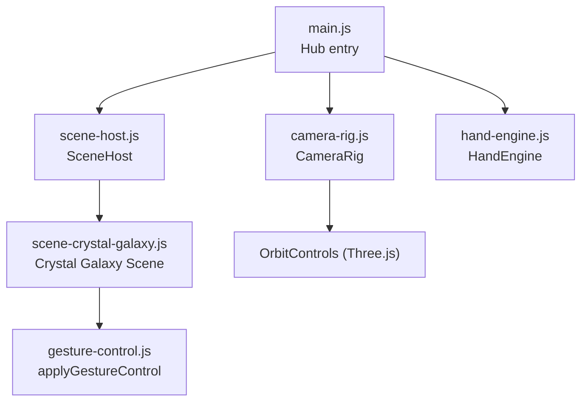
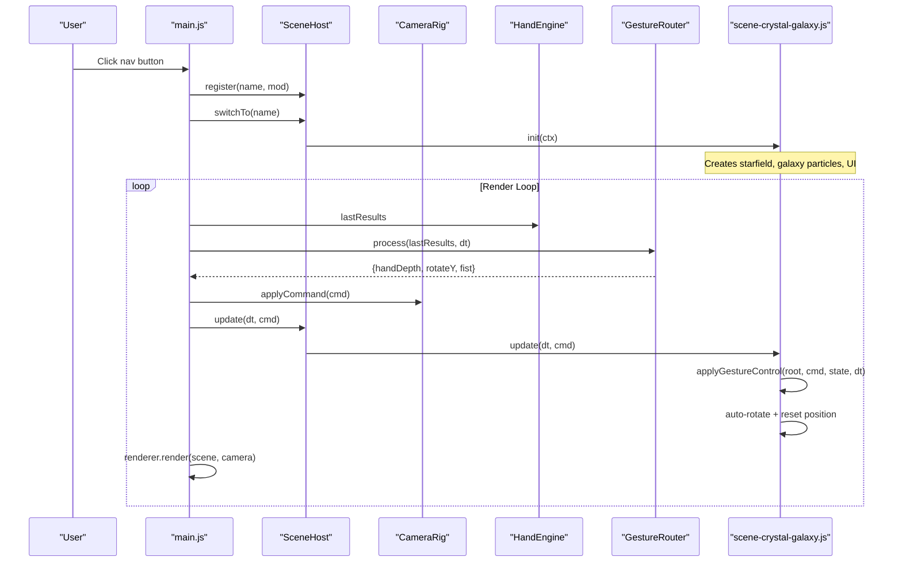
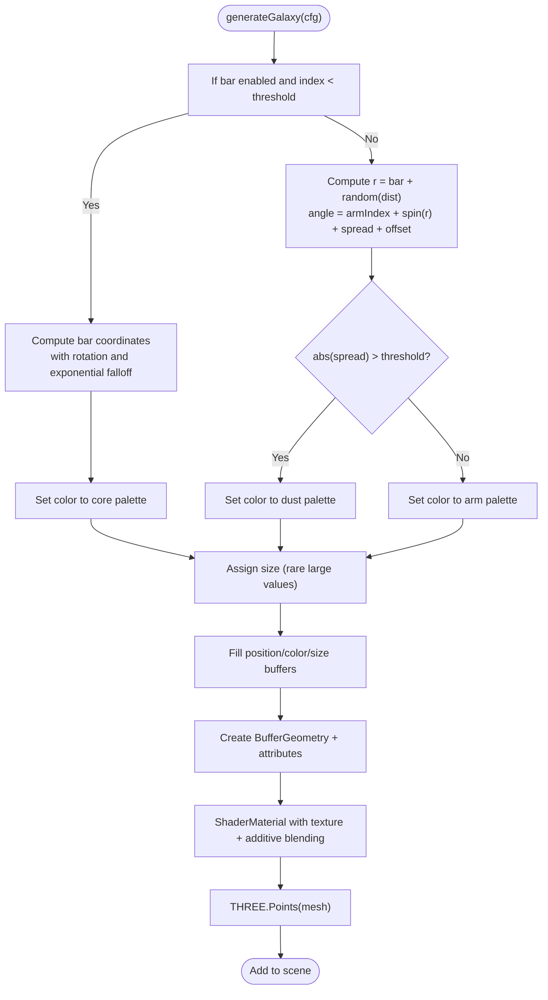
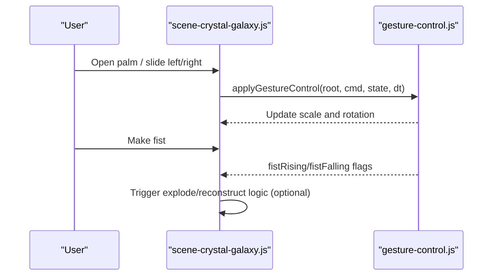
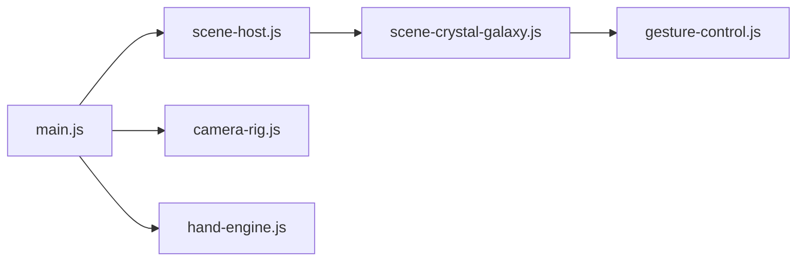

# Crystal Galaxy Scene

<cite>
**Referenced Files in This Document**
- [scene-crystal-galaxy.js](file://src/science/gesture-cosmos/scenes/scene-crystal-galaxy.js)
- [main.js](file://src/science/gesture-cosmos/main.js)
- [gesture-control.js](file://src/science/gesture-cosmos/core/gesture-control.js)
- [hand-engine.js](file://src/science/gesture-cosmos/core/hand-engine.js)
- [camera-rig.js](file://src/science/gesture-cosmos/core/camera-rig.js)
- [scene-host.js](file://src/science/gesture-cosmos/core/scene-host.js)
</cite>

## Table of Contents
1. [Introduction](#introduction)
2. [Project Structure](#project-structure)
3. [Core Components](#core-components)
4. [Architecture Overview](#architecture-overview)
5. [Detailed Component Analysis](#detailed-component-analysis)
6. [Dependency Analysis](#dependency-analysis)
7. [Performance Considerations](#performance-considerations)
8. [Troubleshooting Guide](#troubleshooting-guide)
9. [Conclusion](#conclusion)
10. [Appendices](#appendices)

## Introduction
The Crystal Galaxy Scene is an interactive, educational visualization that represents galactic structures using a faceted, crystalline aesthetic. It generates large particle systems to simulate spiral arms, bars, and dust lanes, while applying custom shaders for soft, additive glow. The scene supports gesture-based interaction (scale and rotation), mouse/touch orbit controls, and UI-driven switching between multiple galaxy presets. While the current implementation uses point sprites rather than explicit faceted meshes, it provides a strong foundation for extending into true crystal-like materials with refraction and reflection.

## Project Structure
The Crystal Galaxy Scene lives within the Gesture Cosmos ecosystem:
- A main hub initializes shared Three.js objects and orchestrates scene lifecycle.
- Each scene module implements a consistent interface (init, update, dispose).
- Core utilities provide hand tracking, gesture processing, camera rigging, and scene hosting.

**Diagram sources**
- [main.js:1-187](file://src/science/gesture-cosmos/main.js#L1-L187)
- [scene-host.js:1-63](file://src/science/gesture-cosmos/core/scene-host.js#L1-L63)
- [camera-rig.js:1-61](file://src/science/gesture-cosmos/core/camera-rig.js#L1-L61)
- [hand-engine.js:1-83](file://src/science/gesture-cosmos/core/hand-engine.js#L1-L83)
- [scene-crystal-galaxy.js:1-290](file://src/science/gesture-cosmos/scenes/scene-crystal-galaxy.js#L1-L290)
- [gesture-control.js:1-88](file://src/science/gesture-cosmos/core/gesture-control.js#L1-L88)

**Section sources**
- [main.js:1-187](file://src/science/gesture-cosmos/main.js#L1-L187)
- [scene-host.js:1-63](file://src/science/gesture-cosmos/core/scene-host.js#L1-L63)

## Core Components
- Scene Module Interface: Scenes export name, init(ctx), update(dt, cmd), dispose().
- Gesture Control: Smooth scale and Y-axis rotation based on hand depth and palm slide; fist state toggles behavior.
- Camera Rig: Mouse/touch orbit via OrbitControls; gestures do not move the camera directly.
- Hand Engine: MediaPipe Hands wrapper for webcam-based hand detection.
- Scene Host: Lifecycle manager for switching scenes and passing shared context.

Key responsibilities:
- Generate and render a high-count particle system representing a galaxy.
- Apply additive blending and custom shaders for glowing points.
- Provide UI buttons to switch among galaxy presets.
- Integrate gesture-driven scaling and rotation.

**Section sources**
- [scene-crystal-galaxy.js:1-290](file://src/science/gesture-cosmos/scenes/scene-crystal-galaxy.js#L1-L290)
- [gesture-control.js:1-88](file://src/science/gesture-cosmos/core/gesture-control.js#L1-L88)
- [camera-rig.js:1-61](file://src/science/gesture-cosmos/core/camera-rig.js#L1-L61)
- [hand-engine.js:1-83](file://src/science/gesture-cosmos/core/hand-engine.js#L1-L83)
- [scene-host.js:1-63](file://src/science/gesture-cosmos/core/scene-host.js#L1-L63)

## Architecture Overview
The runtime flow connects the hub, host, camera rig, hand engine, and the Crystal Galaxy scene.

**Diagram sources**
- [main.js:1-187](file://src/science/gesture-cosmos/main.js#L1-L187)
- [scene-host.js:1-63](file://src/science/gesture-cosmos/core/scene-host.js#L1-L63)
- [camera-rig.js:1-61](file://src/science/gesture-cosmos/core/camera-rig.js#L1-L61)
- [hand-engine.js:1-83](file://src/science/gesture-cosmos/core/hand-engine.js#L1-L83)
- [scene-crystal-galaxy.js:1-290](file://src/science/gesture-cosmos/scenes/scene-crystal-galaxy.js#L1-L290)
- [gesture-control.js:1-88](file://src/science/gesture-cosmos/core/gesture-control.js#L1-L88)

## Detailed Component Analysis

### Galaxy Generation Algorithm
The scene builds a configurable number of points per preset. For each point:
- Decide if it belongs to a central bar (if configured).
- Otherwise compute radius and angle with arm count and spin factor.
- Add vertical spread proportional to radius.
- Assign color from core/arm/dust palettes based on region and randomness.
- Set size distribution with occasional bright outliers.

**Diagram sources**
- [scene-crystal-galaxy.js:58-171](file://src/science/gesture-cosmos/scenes/scene-crystal-galaxy.js#L58-L171)

**Section sources**
- [scene-crystal-galaxy.js:58-171](file://src/science/gesture-cosmos/scenes/scene-crystal-galaxy.js#L58-L171)

### Crystalline Materials and Lighting
Current material approach:
- Custom ShaderMaterial with a radial gradient point sprite texture.
- Additive blending and transparency for a luminous effect.
- Depth write disabled to avoid sorting artifacts with many points.
- Point sizes scaled by distance to maintain visual consistency.

To achieve glass-like refraction/reflection:
- Replace point sprites with faceted geometry (e.g., octahedrons or dodecahedrons).
- Use MeshPhysicalMaterial with transmission, roughness, ior, thickness, and clearcoat.
- Enable environment mapping for reflections and use a background cube map or PMREMGenerator for realistic refractions.
- Add subtle specular highlights and Fresnel effects to enhance facets.

Educational connections:
- Relate facet angles to real crystallography (cubic, hexagonal systems).
- Demonstrate how refractive index changes perceived colors and shapes.
- Show how internal scattering contributes to translucency.

**Section sources**
- [scene-crystal-galaxy.js:132-163](file://src/science/gesture-cosmos/scenes/scene-crystal-galaxy.js#L132-L163)

### Structured Particle Arrangements
- Arm count and spin parameters control spiral density and winding.
- Bar parameter adds a central elongated structure with exponential vertical falloff.
- Dust regions are modeled by wider angular spread thresholds.
- Bright outlier points simulate prominent stars.

Interactive manipulation:
- Gesture control scales the entire galaxy group smoothly based on hand depth.
- Open-palm sliding rotates the galaxy around Y.
- Fist state can be used to trigger “explode/reconstruct” animations by perturbing positions and restoring them.

**Section sources**
- [scene-crystal-galaxy.js:6-31](file://src/science/gesture-cosmos/scenes/scene-crystal-galaxy.js#L6-L31)
- [scene-crystal-galaxy.js:208-217](file://src/science/gesture-cosmos/scenes/scene-crystal-galaxy.js#L208-L217)
- [gesture-control.js:24-83](file://src/science/gesture-cosmos/core/gesture-control.js#L24-L83)

### UI and Scene Switching
- HUD displays galaxy name and particle count.
- Sidebar buttons switch between presets (Milky Way, Andromeda, Whirlpool, Sombrero).
- Switching disposes previous resources and rebuilds geometry/materials.

**Section sources**
- [scene-crystal-galaxy.js:219-257](file://src/science/gesture-cosmos/scenes/scene-crystal-galaxy.js#L219-L257)
- [scene-crystal-galaxy.js:58-64](file://src/science/gesture-cosmos/scenes/scene-crystal-galaxy.js#L58-L64)

### Interaction Flow

**Diagram sources**
- [scene-crystal-galaxy.js:208-217](file://src/science/gesture-cosmos/scenes/scene-crystal-galaxy.js#L208-L217)
- [gesture-control.js:50-83](file://src/science/gesture-cosmos/core/gesture-control.js#L50-L83)

## Dependency Analysis
High-level dependencies:
- main.js registers and switches scene modules dynamically.
- scene-host.js manages lifecycle and passes shared context.
- camera-rig.js wraps OrbitControls for mouse/touch navigation.
- hand-engine.js integrates MediaPipe Hands for gesture input.
- scene-crystal-galaxy.js depends on gesture-control.js for object manipulation.

**Diagram sources**
- [main.js:1-187](file://src/science/gesture-cosmos/main.js#L1-L187)
- [scene-host.js:1-63](file://src/science/gesture-cosmos/core/scene-host.js#L1-L63)
- [camera-rig.js:1-61](file://src/science/gesture-cosmos/core/camera-rig.js#L1-L61)
- [hand-engine.js:1-83](file://src/science/gesture-cosmos/core/hand-engine.js#L1-L83)
- [scene-crystal-galaxy.js:1-290](file://src/science/gesture-cosmos/scenes/scene-crystal-galaxy.js#L1-L290)
- [gesture-control.js:1-88](file://src/science/gesture-cosmos/core/gesture-control.js#L1-L88)

**Section sources**
- [main.js:1-187](file://src/science/gesture-cosmos/main.js#L1-L187)
- [scene-host.js:1-63](file://src/science/gesture-cosmos/core/scene-host.js#L1-L63)

## Performance Considerations
- High particle counts (up to ~220k) require efficient GPU rendering:
  - Use BufferGeometry with typed arrays for positions, colors, and sizes.
  - Keep shader simple; avoid heavy per-fragment computations.
  - Disable depth writes for additive blending to reduce sorting overhead.
- Texture generation:
  - Create a small canvas-based radial gradient once and reuse as a texture.
- Memory management:
  - Dispose geometries, materials, and textures when switching galaxies.
- Rendering pipeline:
  - Limit pixel ratio to devicePixelRatio capped at 2.
  - Avoid frequent re-allocations; reuse buffers where possible.
- Optional optimizations:
  - InstancedMesh for faceted crystals instead of individual meshes.
  - LOD or culling for distant clusters.
  - Reduce fog density or disable for performance on low-end devices.

[No sources needed since this section provides general guidance]

## Troubleshooting Guide
Common issues and resolutions:
- Gesture input unavailable:
  - Ensure camera permissions are granted and MediaPipe scripts are loaded.
  - Fallback to mouse/touch orbit controls when camera fails.
- Scene initialization errors:
  - Check console logs for scene load failures; verify dynamic import paths.
- Resource leaks after switching scenes:
  - Confirm dispose() removes UI elements, clears scene references, and disposes tracked resources.
- Poor performance on mobile:
  - Lower particle count or disable fog; cap pixel ratio; simplify shaders.

**Section sources**
- [main.js:116-130](file://src/science/gesture-cosmos/main.js#L116-L130)
- [scene-crystal-galaxy.js:259-290](file://src/science/gesture-cosmos/scenes/scene-crystal-galaxy.js#L259-L290)

## Conclusion
The Crystal Galaxy Scene delivers an engaging, gesture-driven visualization of galactic structures using efficient particle rendering and custom shaders. Its modular architecture enables easy extension toward true crystalline aesthetics—faceted geometry, glass-like materials, and advanced lighting—while maintaining interactivity and educational value. With careful attention to performance and resource management, the scene can scale to complex geometric representations suitable for classroom exploration of crystallography and astrophysics concepts.

[No sources needed since this section summarizes without analyzing specific files]

## Appendices

### Educational Connections
- Crystallography:
  - Map facet orientations to lattice planes; discuss symmetry groups.
  - Demonstrate how refractive index affects light paths through crystals.
- Astrophysics:
  - Compare generated spiral patterns to real galaxies (barred vs unbarred).
  - Discuss dust lanes and stellar density variations.

[No sources needed since this section doesn't analyze specific files]