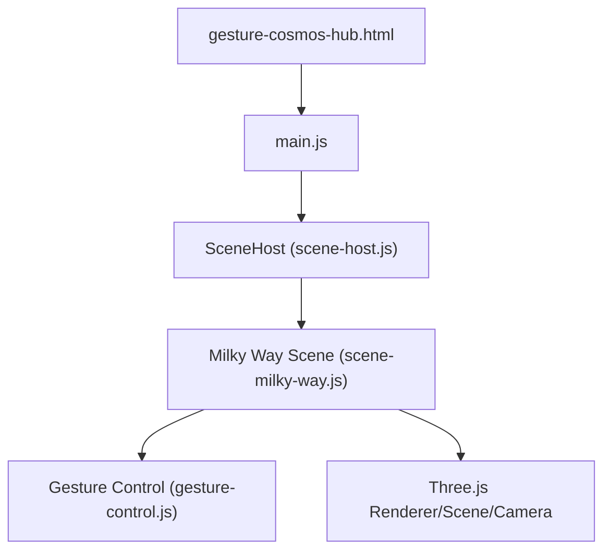
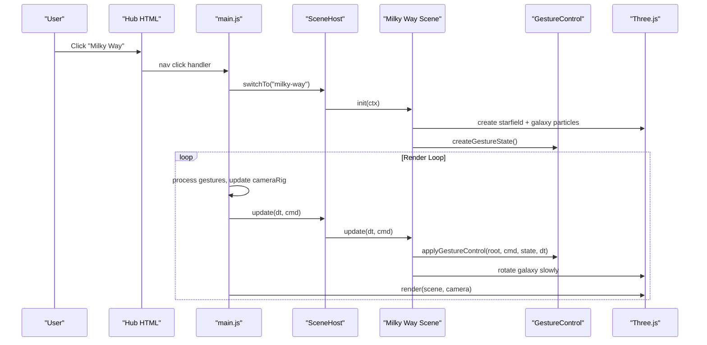
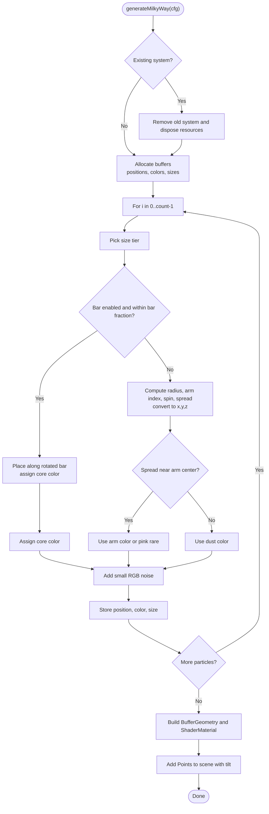
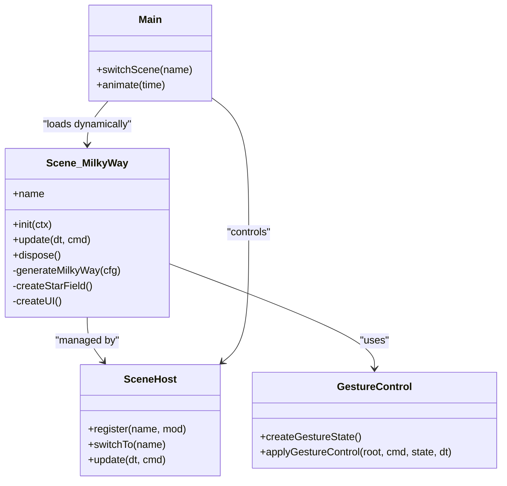

# Milky Way Scene

<cite>
**Referenced Files in This Document**
- [scene-milky-way.js](file://src/science/gesture-cosmos/scenes/scene-milky-way.js)
- [main.js](file://src/science/gesture-cosmos/main.js)
- [gesture-control.js](file://src/science/gesture-cosmos/core/gesture-control.js)
- [scene-host.js](file://src/science/gesture-cosmos/core/scene-host.js)
- [gesture-cosmos-hub.html](file://src/science/gesture-cosmos-hub.html)
</cite>

## Table of Contents
1. [Introduction](#introduction)
2. [Project Structure](#project-structure)
3. [Core Components](#core-components)
4. [Architecture Overview](#architecture-overview)
5. [Detailed Component Analysis](#detailed-component-analysis)
6. [Dependency Analysis](#dependency-analysis)
7. [Performance Considerations](#performance-considerations)
8. [Troubleshooting Guide](#troubleshooting-guide)
9. [Conclusion](#conclusion)
10. [Appendices](#appendices)

## Introduction
This document explains the Milky Way Scene, a real-time 3D visualization that simulates our home galaxy with realistic stellar distributions and galactic structure. It focuses on:
- Star field generation using configurable parameters inspired by astronomical observations
- Modeling of galactic disk, spiral arms, central bar, and dust lanes
- Particle systems for billions of stars (via high-count point clouds), nebula-like color gradients, and realistic population colors
- Educational content and interactive features enabling students to explore different regions of the Milky Way

The implementation is part of a gesture-driven Cosmos Hub that supports multiple scenes, including the Milky Way.

## Project Structure
The Milky Way Scene is implemented as a scene module within a shared runtime that manages Three.js rendering, camera rig, hand tracking, and scene lifecycle. The key files are:
- Entry and orchestration: main.js and gesture-cosmos-hub.html
- Galaxy scene implementation: scene-milky-way.js
- Shared control utilities: gesture-control.js
- Scene host: scene-host.js

**Diagram sources**
- [gesture-cosmos-hub.html:253-282](file://src/science/gesture-cosmos-hub.html#L253-L282)
- [main.js:14-22](file://src/science/gesture-cosmos/main.js#L14-L22)
- [scene-host.js:11-63](file://src/science/gesture-cosmos/core/scene-host.js#L11-L63)
- [scene-milky-way.js:1-10](file://src/science/gesture-cosmos/scenes/scene-milky-way.js#L1-L10)
- [gesture-control.js:1-22](file://src/science/gesture-cosmos/core/gesture-control.js#L1-L22)

**Section sources**
- [gesture-cosmos-hub.html:253-282](file://src/science/gesture-cosmos-hub.html#L253-L282)
- [main.js:14-22](file://src/science/gesture-cosmos/main.js#L14-L22)
- [scene-host.js:11-63](file://src/science/gesture-cosmos/core/scene-host.js#L11-L63)
- [scene-milky-way.js:1-10](file://src/science/gesture-cosmos/scenes/scene-milky-way.js#L1-L10)
- [gesture-control.js:1-22](file://src/science/gesture-cosmos/core/gesture-control.js#L1-L22)

## Core Components
- Milky Way Scene Module
  - Exports name and lifecycle methods (init, update, dispose)
  - Generates a high-density particle system representing the galaxy
  - Provides UI controls to switch between predefined galaxy configurations
- Gesture Control
  - Applies scale and rotation based on hand depth and palm sliding
  - Emits one-frame edge events for fist transitions
- Scene Host
  - Manages dynamic loading, initialization, switching, and disposal of scenes
- Hub and Main
  - Sets up Three.js renderer, camera, background stars, and render loop
  - Wires navigation and gesture permission flow

Key responsibilities:
- Data-driven galaxy generation via configuration objects
- Efficient GPU-friendly point rendering with custom shaders
- Smooth user interaction through gestures and mouse fallbacks
- Clean resource management and memory safety

**Section sources**
- [scene-milky-way.js:1-10](file://src/science/gesture-cosmos/scenes/scene-milky-way.js#L1-L10)
- [gesture-control.js:24-88](file://src/science/gesture-cosmos/core/gesture-control.js#L24-L88)
- [scene-host.js:11-63](file://src/science/gesture-cosmos/core/scene-host.js#L11-L63)
- [main.js:34-64](file://src/science/gesture-cosmos/main.js#L34-L64)

## Architecture Overview
The runtime composes a shared context and delegates scene-specific logic to modules. The Milky Way Scene uses this context to create and animate its particle system.

**Diagram sources**
- [gesture-cosmos-hub.html:253-282](file://src/science/gesture-cosmos-hub.html#L253-L282)
- [main.js:75-109](file://src/science/gesture-cosmos/main.js#L75-L109)
- [main.js:160-179](file://src/science/gesture-cosmos/main.js#L160-L179)
- [scene-host.js:31-61](file://src/science/gesture-cosmos/core/scene-host.js#L31-L61)
- [scene-milky-way.js:201-224](file://src/science/gesture-cosmos/scenes/scene-milky-way.js#L201-L224)
- [gesture-control.js:50-83](file://src/science/gesture-cosmos/core/gesture-control.js#L50-L83)

## Detailed Component Analysis

### Milky Way Scene Implementation
The Milky Way Scene generates a dense particle cloud representing the galaxy. It models:
- Central bulge/bar region
- Spiral arms with spin and spread
- Dust lanes at larger radial offsets
- Color gradients representing different stellar populations

Configuration object defines:
- Name and count of particles
- Radius, spin rate, number of arms, and bar length
- Colors for core, arms, pink star-forming regions, and dust

Generation algorithm:
- For each particle:
  - Determine size distribution (bright outliers, medium, faint)
  - If within bar fraction and bar enabled:
    - Place along a rotated bar shape with exponential vertical falloff
    - Assign core color and slightly larger size
  - Else:
    - Compute radius from center beyond bar length
    - Choose arm index if arms > 0; compute base angle offset per arm
    - Apply differential spin proportional to radius
    - Add random spread to simulate arm width
    - Convert polar coordinates to Cartesian positions
    - Assign y-thickness proportional to radius
    - Select color:
      - Near arm center: arm color
      - Far from arm center: dust color
      - Rare bright pink points for star-forming regions
      - Otherwise dimmed arm color
  - Add small noise to RGB channels
  - Store position, color, and size attributes

Rendering:
- Custom ShaderMaterial with:
  - Vertex shader computes per-point size based on distance and uniform scale
  - Fragment shader samples a soft circular texture and applies alpha blending
  - Additive blending and transparency for realistic glow
- Background fog and black background enhance depth perception
- Slow auto-rotation around Y axis for cinematic effect

Interactivity:
- Shared gesture control scales and rotates the galaxy group
- UI buttons allow switching between preconfigured galaxies

Memory management:
- Tracks geometry, material, and textures for disposal
- Removes and disposes previous system before generating new ones

Educational elements:
- HUD displays current galaxy name and unit reference
- Sidebar shows selectable presets for comparative exploration

**Section sources**
- [scene-milky-way.js:6-27](file://src/science/gesture-cosmos/scenes/scene-milky-way.js#L6-L27)
- [scene-milky-way.js:53-178](file://src/science/gesture-cosmos/scenes/scene-milky-way.js#L53-L178)
- [scene-milky-way.js:188-213](file://src/science/gesture-cosmos/scenes/scene-milky-way.js#L188-L213)
- [scene-milky-way.js:215-224](file://src/science/gesture-cosmos/scenes/scene-milky-way.js#L215-L224)
- [scene-milky-way.js:226-262](file://src/science/gesture-cosmos/scenes/scene-milky-way.js#L226-L262)
- [scene-milky-way.js:264-295](file://src/science/gesture-cosmos/scenes/scene-milky-way.js#L264-L295)

#### Algorithm Flowchart

**Diagram sources**
- [scene-milky-way.js:53-178](file://src/science/gesture-cosmos/scenes/scene-milky-way.js#L53-L178)

### Gesture Control Integration
The scene integrates a shared gesture controller that:
- Maps hand depth to target scale (MIN_SCALE to MAX_SCALE)
- Rotates the galaxy group when an open palm slides left/right
- Detects fist rising/falling edges for potential future effects
- Smoothly lerps current scale toward target

In the update loop, the scene applies these transformations to the galaxy root object and maintains slow self-rotation.

**Section sources**
- [gesture-control.js:24-88](file://src/science/gesture-cosmos/core/gesture-control.js#L24-L88)
- [scene-milky-way.js:215-224](file://src/science/gesture-cosmos/scenes/scene-milky-way.js#L215-L224)

### Scene Host and Lifecycle
The SceneHost class:
- Registers scene modules dynamically
- Initializes the selected scene with a shared context
- Calls update each frame
- Disposes previous scenes safely

The hub’s main entry wires navigation and ensures the first scene loads, then starts the render loop.

**Section sources**
- [scene-host.js:11-63](file://src/science/gesture-cosmos/core/scene-host.js#L11-L63)
- [main.js:75-109](file://src/science/gesture-cosmos/main.js#L75-L109)
- [main.js:160-179](file://src/science/gesture-cosmos/main.js#L160-L179)

### UI and Educational Content
- HUD displays the current galaxy name and educational unit label
- Sidebar buttons allow switching between preset galaxies
- Status indicators can reflect gesture availability and FPS (in other scenes)

These elements support student exploration and comparison across different galactic morphologies.

**Section sources**
- [scene-milky-way.js:226-262](file://src/science/gesture-cosmos/scenes/scene-milky-way.js#L226-L262)

## Dependency Analysis
The Milky Way Scene depends on:
- Three.js for 3D rendering and point systems
- Gesture control utilities for interactive scaling and rotation
- Scene host for lifecycle management
- Hub HTML and main.js for bootstrapping and navigation

**Diagram sources**
- [scene-milky-way.js:1-10](file://src/science/gesture-cosmos/scenes/scene-milky-way.js#L1-L10)
- [gesture-control.js:24-88](file://src/science/gesture-cosmos/core/gesture-control.js#L24-L88)
- [scene-host.js:11-63](file://src/science/gesture-cosmos/core/scene-host.js#L11-L63)
- [main.js:75-109](file://src/science/gesture-cosmos/main.js#L75-L109)

**Section sources**
- [scene-milky-way.js:1-10](file://src/science/gesture-cosmos/scenes/scene-milky-way.js#L1-L10)
- [gesture-control.js:24-88](file://src/science/gesture-cosmos/core/gesture-control.js#L24-L88)
- [scene-host.js:11-63](file://src/science/gesture-cosmos/core/scene-host.js#L11-L63)
- [main.js:75-109](file://src/science/gesture-cosmos/main.js#L75-L109)

## Performance Considerations
- High particle counts: The Milky Way Scene uses large Float32Array buffers for positions, colors, and sizes. Ensure device pixel ratio is capped and avoid excessive overdraw.
- Custom shaders: Point size clamping and additive blending reduce artifacts but still require careful tuning for mobile devices.
- Resource disposal: Properly disposing geometries, materials, and textures prevents memory leaks during scene switches.
- Background stars: Separate low-cost star fields add depth without heavy computation.
- Auto-rotation speed: Keep rotation rates modest to maintain smooth frame pacing.

[No sources needed since this section provides general guidance]

## Troubleshooting Guide
Common issues and resolutions:
- Scene fails to initialize:
  - Verify dynamic import succeeds and module exports name, init, update, dispose
  - Check console errors thrown by SceneHost during switchTo
- Camera or gesture permissions denied:
  - Ensure enable-gestures button is clicked and camera access granted
  - Fallback to mouse controls is available if camera is unavailable
- Memory growth after switching scenes:
  - Confirm all tracked resources are disposed in both scene and host
  - Validate that _disposables and _starFieldDisposables are cleared
- Visual artifacts or flickering:
  - Adjust shader uniforms like scale and point size clamps
  - Ensure depthWrite is disabled and blending is set correctly

**Section sources**
- [scene-host.js:31-55](file://src/science/gesture-cosmos/core/scene-host.js#L31-L55)
- [main.js:116-130](file://src/science/gesture-cosmos/main.js#L116-L130)
- [scene-milky-way.js:264-295](file://src/science/gesture-cosmos/scenes/scene-milky-way.js#L264-L295)

## Conclusion
The Milky Way Scene delivers an engaging, data-informed simulation of our galaxy using efficient particle systems and customizable parameters. Its architecture cleanly separates concerns across scene logic, gesture control, and lifecycle management, enabling robust interactivity and educational value. Students can explore galactic structure, compare morphologies, and interact naturally through gestures or mouse controls.

[No sources needed since this section summarizes without analyzing specific files]

## Appendices

### Astronomical Accuracy Notes
- Spiral arm modeling: Uses differential spin and spread to approximate observed arm winding and width
- Central bar: Represents the Milky Way’s bar structure with exponential vertical falloff
- Dust lanes: Modeled by assigning darker colors at larger radial offsets where interstellar dust concentrates
- Stellar populations: Color choices emulate hot young stars (blue/pink) versus older populations (warm core)

[No sources needed since this section provides conceptual explanations]

### Interactive Features Summary
- Gesture-based scaling and rotation
- One-frame fist detection hooks for future effects
- UI-driven galaxy selection for comparative study
- HUD labels for educational context

**Section sources**
- [gesture-control.js:50-83](file://src/science/gesture-cosmos/core/gesture-control.js#L50-L83)
- [scene-milky-way.js:226-262](file://src/science/gesture-cosmos/scenes/scene-milky-way.js#L226-L262)