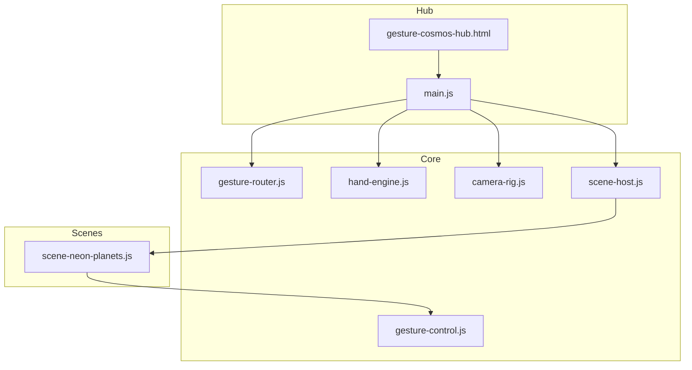
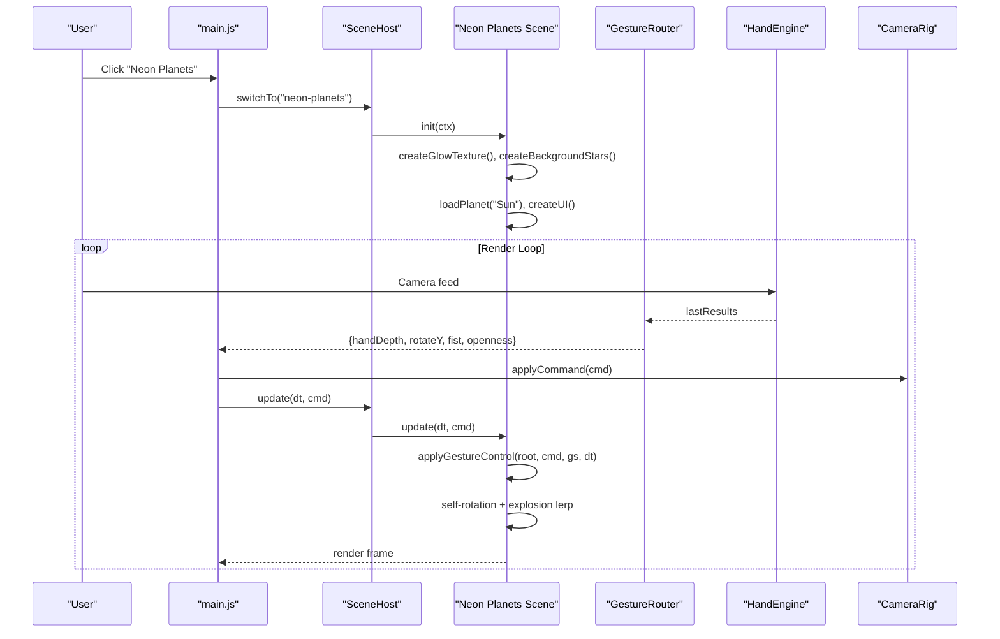
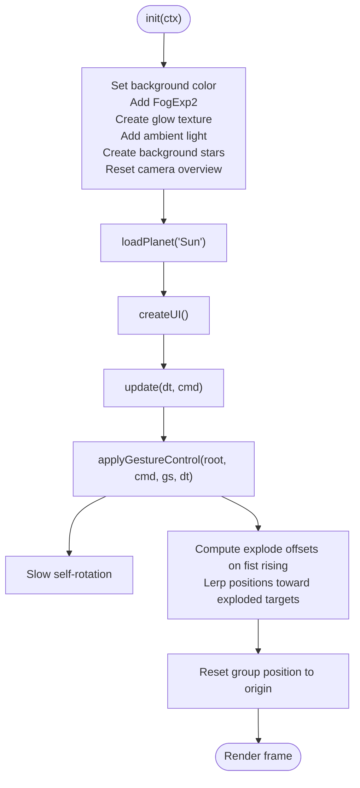
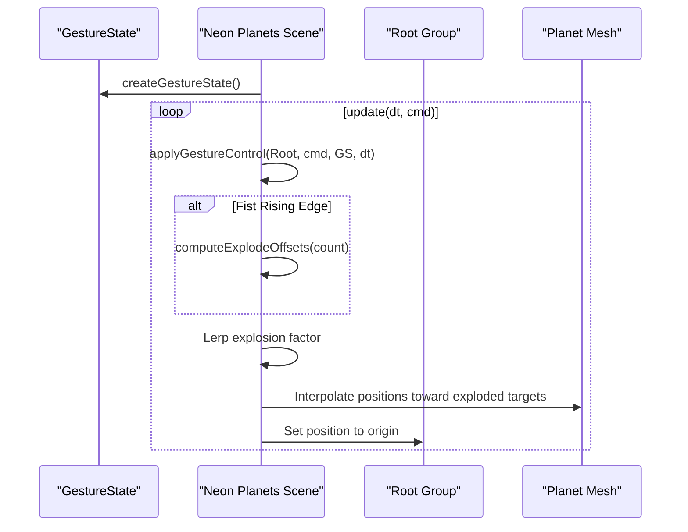
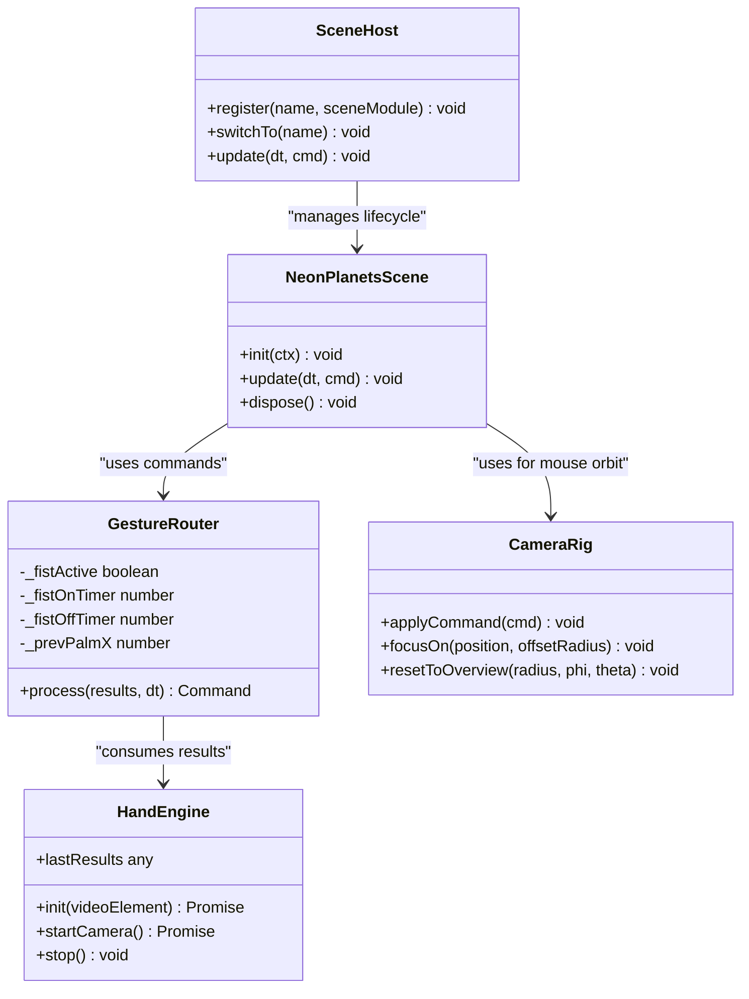
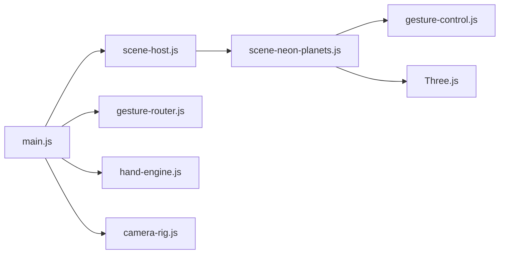

# Neon Planets Scene

<cite>
**Referenced Files in This Document**
- [scene-neon-planets.js](file://src/science/gesture-cosmos/scenes/scene-neon-planets.js)
- [main.js](file://src/science/gesture-cosmos/main.js)
- [gesture-control.js](file://src/science/gesture-cosmos/core/gesture-control.js)
- [gesture-router.js](file://src/science/gesture-cosmos/core/gesture-router.js)
- [hand-engine.js](file://src/science/gesture-cosmos/core/hand-engine.js)
- [camera-rig.js](file://src/science/gesture-cosmos/core/camera-rig.js)
- [scene-host.js](file://src/science/gesture-cosmos/core/scene-host.js)
- [gesture-cosmos-hub.html](file://src/science/gesture-cosmos-hub.html)
</cite>

## Table of Contents
1. [Introduction](#introduction)
2. [Project Structure](#project-structure)
3. [Core Components](#core-components)
4. [Architecture Overview](#architecture-overview)
5. [Detailed Component Analysis](#detailed-component-analysis)
6. [Dependency Analysis](#dependency-analysis)
7. [Performance Considerations](#performance-considerations)
8. [Troubleshooting Guide](#troubleshooting-guide)
9. [Conclusion](#conclusion)

## Introduction
The Neon Planets Scene is a stylized, artistic visualization of the solar system’s planets rendered as vibrant, glowing particle spheres. It emphasizes a neon aesthetic through additive blending, custom glow textures, and dynamic lighting to create an engaging educational experience about planetary characteristics. The scene integrates gesture-based interaction (optional camera-driven hand tracking) for intuitive exploration: scale objects by moving your hand closer or farther from the camera, rotate with open-palm sliding, and trigger a dramatic “explosion” effect with a fist gesture that scatters particles outward before reconstructing them.

This document explains how the scene achieves its visual style, including materials, emissive-like effects via additive blending, color schemes, particle systems, atmospheric fog, and dynamic lighting. It also covers performance optimization techniques used to maintain smooth frame rates while preserving educational value.

## Project Structure
The Neon Planets Scene is implemented as a modular Three.js scene within the Gesture Cosmos Hub. The hub initializes shared rendering infrastructure and orchestrates scene lifecycle management. Each scene module exports init/update/dispose methods and receives a shared context containing renderer, scene, camera, and utilities.

**Diagram sources**
- [main.js:1-187](file://src/science/gesture-cosmos/main.js#L1-L187)
- [gesture-cosmos-hub.html:1-283](file://src/science/gesture-cosmos-hub.html#L1-L283)
- [gesture-router.js:1-111](file://src/science/gesture-cosmos/core/gesture-router.js#L1-L111)
- [hand-engine.js:1-83](file://src/science/gesture-cosmos/core/hand-engine.js#L1-L83)
- [camera-rig.js:1-61](file://src/science/gesture-cosmos/core/camera-rig.js#L1-L61)
- [scene-host.js:1-63](file://src/science/gesture-cosmos/core/scene-host.js#L1-L63)
- [gesture-control.js:1-88](file://src/science/gesture-cosmos/core/gesture-control.js#L1-L88)
- [scene-neon-planets.js:1-340](file://src/science/gesture-cosmos/scenes/scene-neon-planets.js#L1-L340)

**Section sources**
- [main.js:1-187](file://src/science/gesture-cosmos/main.js#L1-L187)
- [gesture-cosmos-hub.html:1-283](file://src/science/gesture-cosmos-hub.html#L1-L283)

## Core Components
- Neon Planets Scene Module: Implements planet geometry generation, particle materials, glow textures, ring systems, ambient lighting, background stars, UI controls, and animation loops.
- Gesture Control Utilities: Provide unified scaling and rotation behavior based on hand gestures, including rising/falling edge detection for fist interactions.
- Gesture Router: Translates MediaPipe hand landmarks into normalized commands (depth, rotation delta, fist state).
- Hand Engine: Wraps MediaPipe Hands and Camera utilities to stream video frames and detect hands.
- Camera Rig: Mouse/touch orbit controller; gestures control scene objects rather than the camera.
- Scene Host: Manages scene registration, initialization, update, and disposal across scenes.

Key responsibilities:
- Visuals: Particle-based spheres, additive blending, glow texture, fog, ambient light, optional rings.
- Interaction: Gesture-driven scale/rotation, fist-triggered explosion/reconstruction.
- Performance: BufferGeometry reuse, minimal draw calls, efficient per-frame updates, careful disposal.

**Section sources**
- [scene-neon-planets.js:1-340](file://src/science/gesture-cosmos/scenes/scene-neon-planets.js#L1-L340)
- [gesture-control.js:1-88](file://src/science/gesture-cosmos/core/gesture-control.js#L1-L88)
- [gesture-router.js:1-111](file://src/science/gesture-cosmos/core/gesture-router.js#L1-L111)
- [hand-engine.js:1-83](file://src/science/gesture-cosmos/core/hand-engine.js#L1-L83)
- [camera-rig.js:1-61](file://src/science/gesture-cosmos/core/camera-rig.js#L1-L61)
- [scene-host.js:1-63](file://src/science/gesture-cosmos/core/scene-host.js#L1-L63)

## Architecture Overview
The Neon Planets Scene integrates with the Gesture Cosmos Hub to provide interactive, visually rich planetary exploration. The main entry point sets up Three.js, core modules, and navigation. The scene host manages lifecycle transitions between scenes. The neon planets scene constructs its own environment (background, lights, particles) and responds to gesture commands for object-level transformations and animations.

**Diagram sources**
- [main.js:78-109](file://src/science/gesture-cosmos/main.js#L78-L109)
- [main.js:160-179](file://src/science/gesture-cosmos/main.js#L160-L179)
- [scene-host.js:31-61](file://src/science/gesture-cosmos/core/scene-host.js#L31-L61)
- [scene-neon-planets.js:239-305](file://src/science/gesture-cosmos/scenes/scene-neon-planets.js#L239-L305)
- [gesture-router.js:34-109](file://src/science/gesture-cosmos/core/gesture-router.js#L34-L109)
- [hand-engine.js:48-71](file://src/science/gesture-cosmos/core/hand-engine.js#L48-L71)
- [camera-rig.js:30-32](file://src/science/gesture-cosmos/core/camera-rig.js#L30-L32)

## Detailed Component Analysis

### Neon Planets Scene Implementation
The scene builds each planet as a particle sphere using spherical distribution algorithms. Colors are sampled from configured palettes to produce vibrant neon hues. A reusable glow texture is generated via canvas gradients and applied to PointsMaterial with additive blending to simulate emissive glow without custom shaders. Atmospheric depth is achieved with exponential fog and a subtle ambient light. Optional ring systems add detail for specific planets.

Key features:
- Glow Texture: Canvas-generated radial gradient mapped onto points to emulate soft emission.
- Additive Blending: Creates luminous overlap and neon intensity.
- Background Stars: Sparse point cloud for cosmic ambiance.
- Fog: Exponential fog enhances depth perception and hides distant artifacts.
- Dynamic Lighting: Ambient light contributes to overall brightness.
- Rings: Additional particle rings for ringed planets.
- Explosion Effect: Fist gesture triggers outward displacement of particles with smooth interpolation back to original positions.

**Diagram sources**
- [scene-neon-planets.js:239-259](file://src/science/gesture-cosmos/scenes/scene-neon-planets.js#L239-L259)
- [scene-neon-planets.js:261-305](file://src/science/gesture-cosmos/scenes/scene-neon-planets.js#L261-L305)

#### Materials and Emissive Effects
- Material Type: PointsMaterial with vertex colors and a glow map.
- Blending Mode: AdditiveBlending to achieve luminous, emissive-like appearance.
- Transparency: Enabled with opacity tuned for layered glow.
- Depth Write: Disabled to avoid occlusion issues with overlapping particles.
- Glow Map: Radial gradient texture created at runtime for soft edges.

These choices collectively simulate emissive properties without requiring custom fragment shaders, keeping the implementation accessible and performant.

**Section sources**
- [scene-neon-planets.js:38-52](file://src/science/gesture-cosmos/scenes/scene-neon-planets.js#L38-L52)
- [scene-neon-planets.js:141-153](file://src/science/gesture-cosmos/scenes/scene-neon-planets.js#L141-L153)

#### Color Schemes and Planet Configurations
Each planet has a configuration defining size, rotation speed, color palette, particle count, and type (star, rock, gas, life, ring). These parameters drive geometry generation and material coloring.

- Size: Controls base radius for spherical distribution.
- Speed: Governs slow self-rotation rate.
- Colors: Palette array sampled randomly per particle for vibrant variation.
- Particles: Number of vertices forming the sphere; higher counts increase detail but impact performance.
- Type: Influences surface perturbation and special features like rings.

Educational value:
- Different types reflect real-world categories (e.g., gas giants vs rocky planets).
- Color palettes emphasize stylistic neon aesthetics while hinting at planetary characteristics.

**Section sources**
- [scene-neon-planets.js:10-20](file://src/science/gesture-cosmos/scenes/scene-neon-planets.js#L10-L20)
- [scene-neon-planets.js:90-115](file://src/science/gesture-cosmos/scenes/scene-neon-planets.js#L90-L115)

#### Particle Systems and Geometry Generation
Planets are constructed using BufferGeometry with Float32BufferAttribute arrays for positions and colors. Spherical coordinates distribute points evenly across the sphere surface. Gas-type planets introduce sinusoidal perturbations to simulate banded atmospheres; star-type planets add random jitter for a more turbulent look.

- Positions: Computed using phi and theta angles for uniform coverage.
- Colors: Randomly selected from the planet’s palette and stored per vertex.
- Original Positions: Stored in geometry.userData.originalPos for explosion reconstruction.

Ring systems use separate geometry and materials, adding angled rotations for realism.

**Section sources**
- [scene-neon-planets.js:90-115](file://src/science/gesture-cosmos/scenes/scene-neon-planets.js#L90-L115)
- [scene-neon-planets.js:155-177](file://src/science/gesture-cosmos/scenes/scene-neon-planets.js#L155-L177)

#### Atmospheric Effects and Dynamic Lighting
- Fog: Exponential fog adds depth and atmosphere, fading distant elements into the background color.
- Ambient Light: Provides baseline illumination to enhance visibility of particle colors.
- Background Stars: Sparse point cloud creates a sense of space and scale.

These effects contribute to immersion and help distinguish foreground planets from the background.

**Section sources**
- [scene-neon-planets.js:239-251](file://src/science/gesture-cosmos/scenes/scene-neon-planets.js#L239-L251)

#### Interaction and Animation
- Gesture Control: Unified scaling and rotation driven by hand depth and palm sliding.
- Fist Interaction: Rising edge triggers precomputed explosion offsets; smooth lerp animates particles outward and back.
- Entry Animation: Initial scale-up ensures the planet fills the viewport appropriately.

**Diagram sources**
- [gesture-control.js:32-83](file://src/science/gesture-cosmos/core/gesture-control.js#L32-L83)
- [scene-neon-planets.js:261-305](file://src/science/gesture-cosmos/scenes/scene-neon-planets.js#L261-L305)

**Section sources**
- [gesture-control.js:1-88](file://src/science/gesture-cosmos/core/gesture-control.js#L1-L88)
- [scene-neon-planets.js:261-305](file://src/science/gesture-cosmos/scenes/scene-neon-planets.js#L261-L305)

### Gesture System Integration
The gesture system translates raw hand landmarks into normalized commands controlling object scale, rotation, and explosion states. The router computes openness and hand depth, applies debouncing for fist activation, and calculates rotation deltas from palm movement. The gesture control utility applies these commands to the scene root group, smoothing scale changes and detecting rising/falling edges for one-frame actions.

**Diagram sources**
- [gesture-router.js:22-109](file://src/science/gesture-cosmos/core/gesture-router.js#L22-L109)
- [hand-engine.js:5-81](file://src/science/gesture-cosmos/core/hand-engine.js#L5-L81)
- [camera-rig.js:10-55](file://src/science/gesture-cosmos/core/camera-rig.js#L10-L55)
- [scene-host.js:11-61](file://src/science/gesture-cosmos/core/scene-host.js#L11-L61)
- [scene-neon-planets.js:239-305](file://src/science/gesture-cosmos/scenes/scene-neon-planets.js#L239-L305)

**Section sources**
- [gesture-router.js:1-111](file://src/science/gesture-cosmos/core/gesture-router.js#L1-L111)
- [hand-engine.js:1-83](file://src/science/gesture-cosmos/core/hand-engine.js#L1-L83)
- [camera-rig.js:1-61](file://src/science/gesture-cosmos/core/camera-rig.js#L1-L61)
- [scene-host.js:1-63](file://src/science/gesture-cosmos/core/scene-host.js#L1-L63)

## Dependency Analysis
The Neon Planets Scene depends on several core modules for rendering, interaction, and lifecycle management. Dependencies are structured to keep the scene module focused on visuals and animation while delegating cross-cutting concerns to shared utilities.

**Diagram sources**
- [scene-neon-planets.js:5-6](file://src/science/gesture-cosmos/scenes/scene-neon-planets.js#L5-L6)
- [main.js:8-12](file://src/science/gesture-cosmos/main.js#L8-L12)
- [scene-host.js:9](file://src/science/gesture-cosmos/core/scene-host.js#L9)

**Section sources**
- [scene-neon-planets.js:1-340](file://src/science/gesture-cosmos/scenes/scene-neon-planets.js#L1-L340)
- [main.js:1-187](file://src/science/gesture-cosmos/main.js#L1-L187)

## Performance Considerations
- Particle Counts: Planet configurations specify varying particle counts; higher counts improve visual fidelity but increase GPU/CPU workload. Adjust counts based on target devices.
- BufferGeometry Reuse: Geometry attributes are updated in-place during explosions to avoid allocations.
- Minimal Draw Calls: Single PointsMaterial per mesh reduces overdraw and state changes.
- Additive Blending: While visually impactful, it can be expensive; consider reducing opacity or particle sizes on lower-end devices.
- Disposal Management: Proper disposal of geometries, materials, textures, and lights prevents memory leaks during scene switches.
- Fog and Background: Exponential fog and sparse star fields are lightweight yet effective for depth cues.

Optimization recommendations:
- Implement LOD by lowering particle counts when device pixel ratio or frame time exceeds thresholds.
- Use instanced rendering if multiple similar objects are present.
- Precompute explosion offsets once per fist event to minimize per-frame calculations.
- Limit ring particle counts for ringed planets to balance detail and performance.

[No sources needed since this section provides general guidance]

## Troubleshooting Guide
Common issues and resolutions:
- Camera Permission Denied: Ensure user explicitly enables gestures and grants camera access. If unavailable, fallback to mouse controls via OrbitControls.
- No Hand Detected: Gesture router returns null commands; ensure hand is visible and well-lit. Check MediaPipe model loading and confidence thresholds.
- Memory Leaks After Scene Switch: Verify dispose functions release all tracked resources (geometries, materials, textures, lights).
- Poor Frame Rates: Reduce particle counts, disable rings, or lower opacity. Monitor device capabilities and adjust accordingly.
- Incorrect Scale Behavior: Confirm gesture control clamps target scale within MIN_SCALE and MAX_SCALE ranges.

**Section sources**
- [main.js:117-130](file://src/science/gesture-cosmos/main.js#L117-L130)
- [gesture-router.js:34-109](file://src/science/gesture-cosmos/core/gesture-router.js#L34-L109)
- [scene-neon-planets.js:307-339](file://src/science/gesture-cosmos/scenes/scene-neon-planets.js#L307-L339)

## Conclusion
The Neon Planets Scene delivers a visually striking, interactive exploration of the solar system using particle-based rendering, additive blending, and thoughtful atmospheric effects. Its architecture cleanly separates concerns between scene-specific visuals and shared interaction utilities, enabling scalable development and maintainable code. By balancing aesthetic richness with performance-conscious design, the scene remains both engaging and educational, allowing learners to explore planetary characteristics through intuitive gestures and vibrant neon aesthetics.

[No sources needed since this section summarizes without analyzing specific files]