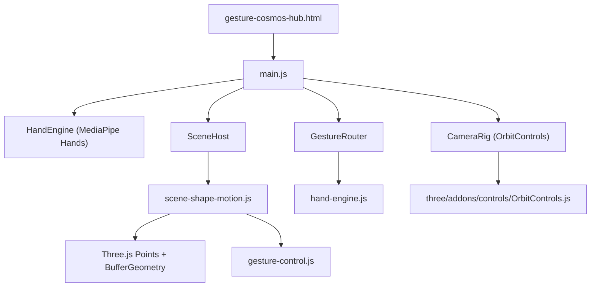
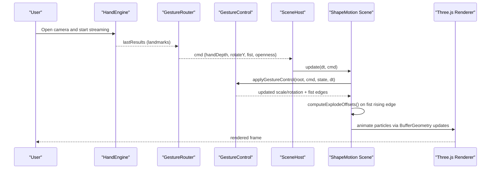
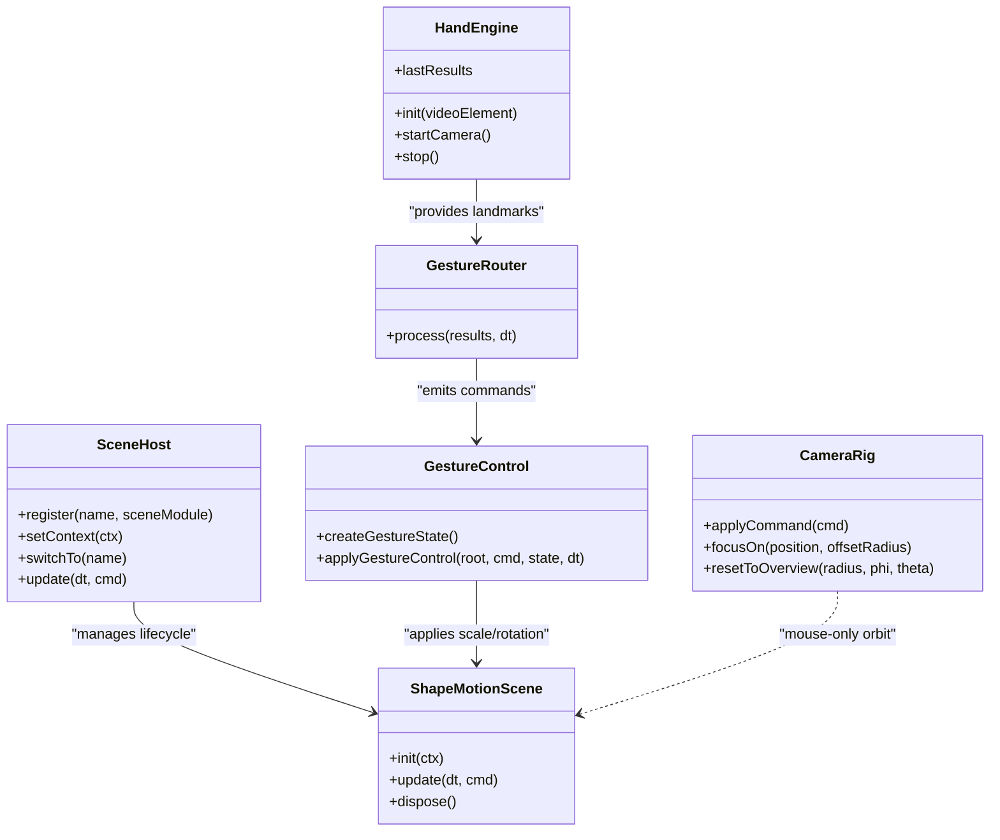
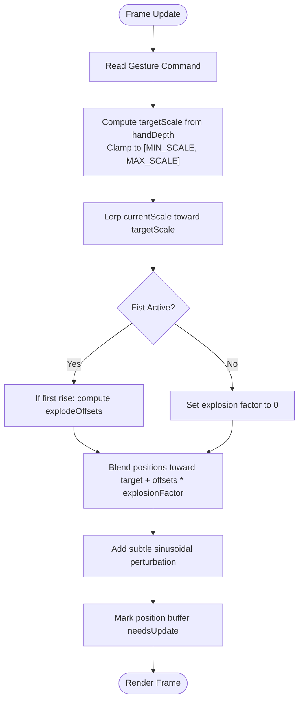
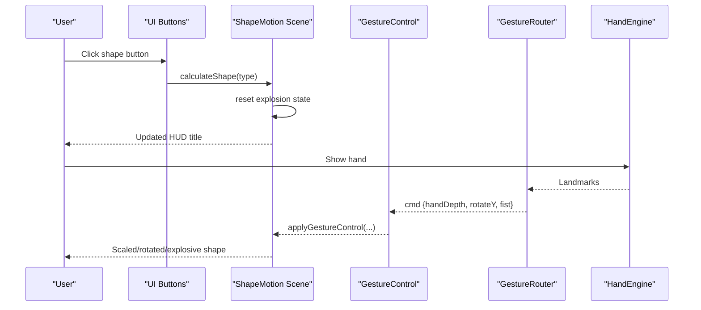
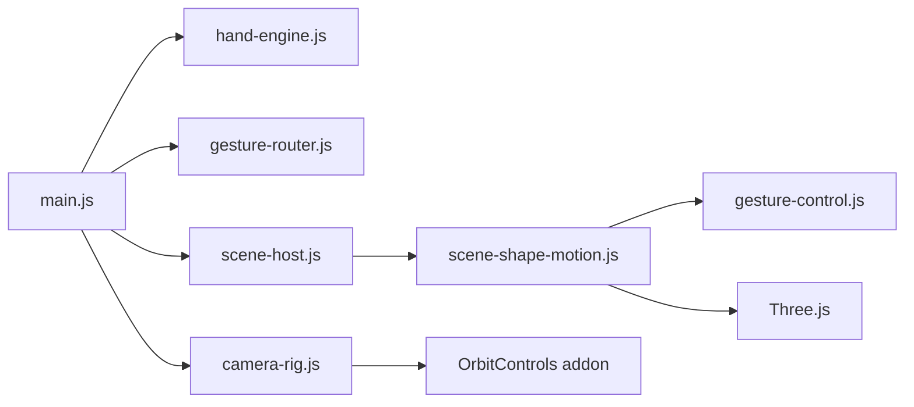
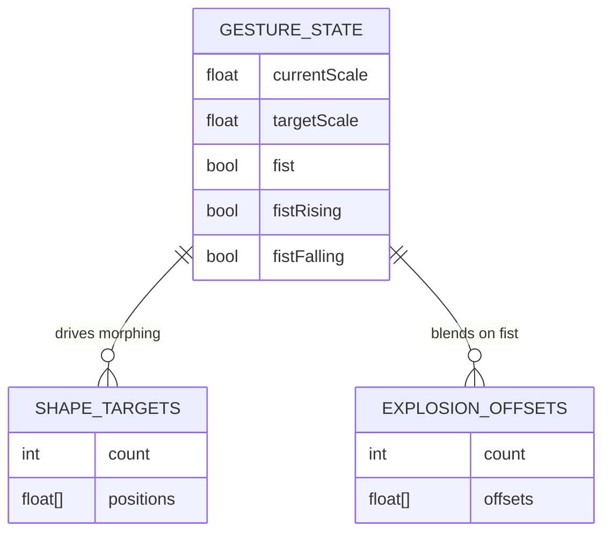

# Shape Motion Lab

<cite>
**Referenced Files in This Document**
- [gesture-cosmos-hub.html](file://src/science/gesture-cosmos-hub.html)
- [main.js](file://src/science/gesture-cosmos/main.js)
- [hand-engine.js](file://src/science/gesture-cosmos/core/hand-engine.js)
- [gesture-router.js](file://src/science/gesture-cosmos/core/gesture-router.js)
- [gesture-control.js](file://src/science/gesture-cosmos/core/gesture-control.js)
- [camera-rig.js](file://src/science/gesture-cosmos/core/camera-rig.js)
- [scene-host.js](file://src/science/gesture-cosmos/core/scene-host.js)
- [scene-shape-motion.js](file://src/science/gesture-cosmos/scenes/scene-shape-motion.js)
</cite>

## Table of Contents
1. [Introduction](#introduction)
2. [Project Structure](#project-structure)
3. [Core Components](#core-components)
4. [Architecture Overview](#architecture-overview)
5. [Detailed Component Analysis](#detailed-component-analysis)
6. [Dependency Analysis](#dependency-analysis)
7. [Performance Considerations](#performance-considerations)
8. [Troubleshooting Guide](#troubleshooting-guide)
9. [Conclusion](#conclusion)
10. [Appendices](#appendices)

## Introduction
Shape Motion Lab is an interactive, gesture-driven 3D visualization that explores mathematical curves and surfaces through parametric equations and geometric transformations. It renders a large particle system that morphs between multiple shapes (heart, sphere, flower, Saturn-like planet with rings, helix, galaxy). Users can:
- Switch shapes via on-screen controls
- Scale the shape by moving their hand closer or farther from the camera
- Rotate the shape by sliding an open palm left/right
- Trigger an “explosion” effect by making a fist; releasing the fist reconstructs the shape
- Toggle auto color cycling for visual exploration

The lab demonstrates trigonometry (sinusoidal parametric curves), linear algebra (scaling, rotation, vector operations), and calculus-inspired motion (smooth interpolation over time). The implementation uses Three.js for rendering, MediaPipe Hands for gesture recognition, and a modular scene architecture for extensibility.

## Project Structure
The Shape Motion Lab is part of the Gesture Cosmos Hub. The hub initializes shared 3D context, manages camera controls, integrates hand tracking, and dynamically loads scenes. The Shape Motion Lab is implemented as a scene module that computes target positions using parametric formulas and animates particles toward those targets.

**Diagram sources**
- [gesture-cosmos-hub.html:227-238](file://src/science/gesture-cosmos-hub.html#L227-L238)
- [main.js:8-64](file://src/science/gesture-cosmos/main.js#L8-L64)
- [hand-engine.js:1-83](file://src/science/gesture-cosmos/core/hand-engine.js#L1-L83)
- [gesture-router.js:1-111](file://src/science/gesture-cosmos/core/gesture-router.js#L1-L111)
- [camera-rig.js:1-61](file://src/science/gesture-cosmos/core/camera-rig.js#L1-L61)
- [scene-host.js:1-63](file://src/science/gesture-cosmos/core/scene-host.js#L1-L63)
- [scene-shape-motion.js:1-318](file://src/science/gesture-cosmos/scenes/scene-shape-motion.js#L1-L318)

**Section sources**
- [gesture-cosmos-hub.html:227-238](file://src/science/gesture-cosmos-hub.html#L227-L238)
- [main.js:8-64](file://src/science/gesture-cosmos/main.js#L8-L64)

## Core Components
- Scene Host: Manages lifecycle of scenes (init/update/dispose) and provides a shared context to each scene.
- Hand Engine: Wraps MediaPipe Hands and Camera utilities to stream video frames and detect hands.
- Gesture Router: Translates raw landmarks into unified commands (scale depth, rotation delta, fist state).
- Gesture Control: Applies scale and rotation to a Three.js object based on gestures and exposes rising/falling edges for effects.
- Camera Rig: Provides mouse/touch orbit controls independent of gestures.
- Shape Motion Scene: Computes parametric target positions for multiple shapes, animates particles, and handles UI interactions.

Key responsibilities:
- Real-time transformation algorithms: smooth lerp-based animation and explosion blending.
- User input handling: gesture-to-command pipeline and UI buttons for shape selection and color toggling.
- Educational visualizations: parametric equations for heart, sphere, flower, Saturn, helix, and galaxy.

**Section sources**
- [scene-host.js:1-63](file://src/science/gesture-cosmos/core/scene-host.js#L1-L63)
- [hand-engine.js:1-83](file://src/science/gesture-cosmos/core/hand-engine.js#L1-L83)
- [gesture-router.js:1-111](file://src/science/gesture-cosmos/core/gesture-router.js#L1-L111)
- [gesture-control.js:1-88](file://src/science/gesture-cosmos/core/gesture-control.js#L1-L88)
- [camera-rig.js:1-61](file://src/science/gesture-cosmos/core/camera-rig.js#L1-L61)
- [scene-shape-motion.js:1-318](file://src/science/gesture-cosmos/scenes/scene-shape-motion.js#L1-L318)

## Architecture Overview
The runtime flow connects user gestures to 3D transformations and shape morphing:

**Diagram sources**
- [main.js:160-179](file://src/science/gesture-cosmos/main.js#L160-L179)
- [hand-engine.js:41-71](file://src/science/gesture-cosmos/core/hand-engine.js#L41-L71)
- [gesture-router.js:34-111](file://src/science/gesture-cosmos/core/gesture-router.js#L34-L111)
- [gesture-control.js:50-83](file://src/science/gesture-cosmos/core/gesture-control.js#L50-L83)
- [scene-host.js:57-61](file://src/science/gesture-cosmos/core/scene-host.js#L57-L61)
- [scene-shape-motion.js:190-239](file://src/science/gesture-cosmos/scenes/scene-shape-motion.js#L190-L239)

## Detailed Component Analysis

### Parametric Equations and Shape Morphing
The Shape Motion Lab generates target positions for six shapes using parametric formulas. Each formula maps random parameters to 3D coordinates, creating volumetric distributions suitable for particle clouds.

- Heart: Uses a classic parametric curve with sinusoidal terms and higher harmonics to form a heart outline, then distributes points around it with small random offsets and extrusion along Z.
- Sphere: Standard spherical coordinates with uniform distribution across angles and radius sampled to fill volume.
- Flower: Polar equation r = cos(kθ) with k=4 creates a four-petal pattern; points are scattered around the curve with small noise and limited Z spread.
- Saturn: Combines a spherical body with a tilted ring system. Particles are split between core and ring regions; the ring is rotated about an axis to simulate tilt.
- Helix: Two intertwined helical strands parameterized by angle and height, with alternating sides and vertical progression.
- Galaxy: Mixes a dense core, a halo region, and spiral arms modeled by exponential growth in radius versus angle, with arm-specific angular offsets.

These formulas demonstrate:
- Trigonometry: sin, cos, acos used extensively for polar/spherical mapping and periodic patterns.
- Linear Algebra: scaling factors, rotations (tilt), and vector arithmetic for positioning.
- Calculus-inspired motion: continuous interpolation (lerp) over time for smooth transitions and organic breathing.

Implementation highlights:
- Target positions are precomputed per shape into a Float32Array for performance.
- Per-frame updates lerp current positions toward targets, optionally adding explosion offsets and subtle oscillation.

**Section sources**
- [scene-shape-motion.js:48-137](file://src/science/gesture-cosmos/scenes/scene-shape-motion.js#L48-L137)

#### Class Diagram: Scene Modules and Core Services

**Diagram sources**
- [scene-host.js:11-63](file://src/science/gesture-cosmos/core/scene-host.js#L11-L63)
- [hand-engine.js:5-83](file://src/science/gesture-cosmos/core/hand-engine.js#L5-L83)
- [gesture-router.js:22-111](file://src/science/gesture-cosmos/core/gesture-router.js#L22-L111)
- [gesture-control.js:32-83](file://src/science/gesture-cosmos/core/gesture-control.js#L32-L83)
- [camera-rig.js:10-61](file://src/science/gesture-cosmos/core/camera-rig.js#L10-L61)
- [scene-shape-motion.js:176-318](file://src/science/gesture-cosmos/scenes/scene-shape-motion.js#L176-L318)

### Real-Time Transformation Algorithms
- Smooth Scaling: Gesture depth maps to a target scale clamped within min/max bounds; current scale lerps toward target each frame.
- Rotation: Open-palm X movement yields a per-frame rotation delta applied to Y-axis when not in fist state.
- Explosion Effect: On fist rising edge, stable per-particle offsets are computed once; during fist hold, positions blend toward target plus offsets; on release, offsets drop back to zero.
- Organic Breathing: Subtle sinusoidal perturbations add life without jitter.

**Diagram sources**
- [gesture-control.js:50-83](file://src/science/gesture-cosmos/core/gesture-control.js#L50-L83)
- [scene-shape-motion.js:190-239](file://src/science/gesture-cosmos/scenes/scene-shape-motion.js#L190-L239)

**Section sources**
- [gesture-control.js:24-83](file://src/science/gesture-cosmos/core/gesture-control.js#L24-L83)
- [scene-shape-motion.js:139-239](file://src/science/gesture-cosmos/scenes/scene-shape-motion.js#L139-L239)

### User Input Handling for Shape Modification
- Mouse/Touch Orbit: CameraRig uses OrbitControls for intuitive navigation without interfering with gesture-driven object control.
- Gesture Controls:
  - Scale: Move hand closer/farther to shrink/grow the shape.
  - Rotate: Slide open palm left/right to rotate around Y-axis.
  - Explode/Reconstruct: Make a fist to trigger explosion; open palm again to reconstruct.
- UI Controls: Buttons switch shapes and toggle auto color cycling.

**Diagram sources**
- [scene-shape-motion.js:241-290](file://src/science/gesture-cosmos/scenes/scene-shape-motion.js#L241-L290)
- [gesture-control.js:50-83](file://src/science/gesture-cosmos/core/gesture-control.js#L50-L83)
- [gesture-router.js:34-111](file://src/science/gesture-cosmos/core/gesture-router.js#L34-L111)
- [hand-engine.js:41-71](file://src/science/gesture-cosmos/core/hand-engine.js#L41-L71)

**Section sources**
- [camera-rig.js:10-61](file://src/science/gesture-cosmos/core/camera-rig.js#L10-L61)
- [scene-shape-motion.js:241-290](file://src/science/gesture-cosmos/scenes/scene-shape-motion.js#L241-L290)
- [gesture-router.js:34-111](file://src/science/gesture-cosmos/core/gesture-router.js#L34-L111)
- [gesture-control.js:50-83](file://src/science/gesture-cosmos/core/gesture-control.js#L50-L83)

### Educational Visualizations and Mathematical Concepts
- Trigonometry: Sinusoidal parametric curves (heart, flower), polar/radial functions (flower petals), spherical coordinates (sphere, Saturn core).
- Linear Algebra: Scaling via scalar multiplication, rotation via Euler angles, vector addition for offsets, matrix-like transforms implicitly handled by Three.js.
- Calculus-inspired Motion: Continuous interpolation (lerp) models smooth change over time; derivative-like behavior emerges from rate-limited transitions.

Hands-on experimentation features:
- Adjustable parameters:
  - Particle count (constant in this implementation)
  - Lerp speed for morphing responsiveness
  - Auto color cycling toggled via UI
  - Explosion intensity controlled by fist state
- Step-by-step exploration:
  - Observe how changing t and φ affects shape outlines
  - Compare uniform vs non-uniform radial distributions
  - Notice the effect of tilt on ring geometry

**Section sources**
- [scene-shape-motion.js:48-137](file://src/science/gesture-cosmos/scenes/scene-shape-motion.js#L48-L137)
- [scene-shape-motion.js:190-239](file://src/science/gesture-cosmos/scenes/scene-shape-motion.js#L190-L239)

## Dependency Analysis
The Shape Motion Lab depends on several core modules:

**Diagram sources**
- [main.js:8-64](file://src/science/gesture-cosmos/main.js#L8-L64)
- [scene-host.js:1-63](file://src/science/gesture-cosmos/core/scene-host.js#L1-L63)
- [scene-shape-motion.js:1-10](file://src/science/gesture-cosmos/scenes/scene-shape-motion.js#L1-L10)
- [gesture-control.js:1-22](file://src/science/gesture-cosmos/core/gesture-control.js#L1-L22)
- [camera-rig.js:7-9](file://src/science/gesture-cosmos/core/camera-rig.js#L7-L9)

**Section sources**
- [main.js:8-64](file://src/science/gesture-cosmos/main.js#L8-L64)
- [scene-host.js:1-63](file://src/science/gesture-cosmos/core/scene-host.js#L1-L63)
- [scene-shape-motion.js:1-10](file://src/science/gesture-cosmos/scenes/scene-shape-motion.js#L1-L10)

## Performance Considerations
- Particle Count: 15,000 points balance visual richness and real-time performance on typical devices.
- Buffer Updates: Position buffer is updated per frame; ensure only necessary attributes are marked dirty.
- Precomputation: Target positions and explosion offsets are precomputed to avoid heavy per-frame math.
- Lerp Speed: Tuned to provide smooth transitions without excessive CPU usage.
- Texture Generation: Single canvas texture reused for all particles to minimize GPU allocations.
- Background Stars: Lightweight point cloud with slow rotation adds ambiance without significant cost.

[No sources needed since this section provides general guidance]

## Troubleshooting Guide
Common issues and resolutions:
- Camera/MediaPipe initialization fails:
  - Ensure user gesture triggers enablement.
  - Verify network access to CDN resources.
  - Fall back to mouse controls if camera unavailable.
- Gestures not recognized:
  - Confirm lighting and hand visibility.
  - Adjust detection thresholds if needed.
- Shape does not morph smoothly:
  - Check lerp speed and ensure target positions are recalculated on shape switch.
- Memory leaks after switching scenes:
  - Validate dispose routine frees geometries, materials, textures, and removes DOM overlays.

**Section sources**
- [main.js:117-130](file://src/science/gesture-cosmos/main.js#L117-L130)
- [scene-shape-motion.js:292-318](file://src/science/gesture-cosmos/scenes/scene-shape-motion.js#L292-L318)

## Conclusion
Shape Motion Lab offers an engaging, gesture-driven environment for exploring mathematical curves and transformations. By combining parametric equations with real-time interpolation and interactive controls, it bridges abstract mathematics with tangible visual feedback. The modular architecture supports easy extension with new shapes and effects, while robust error handling ensures a smooth educational experience.

[No sources needed since this section summarizes without analyzing specific files]

## Appendices

### API Definitions: Gesture Commands
- Fields:
  - handDepth: number (0.0 close → 1.0 far)
  - rotateY: number (radians per frame)
  - fist: boolean (stable debounced state)
  - openness: number (0.0 fist → 1.0 open palm)
- Behavior:
  - When no hand detected, command is null and defaults apply.
  - Fist rising/falling edges are derived by the scene’s gesture state for one-frame events.

**Section sources**
- [gesture-router.js:13-21](file://src/science/gesture-cosmos/core/gesture-router.js#L13-L21)
- [gesture-control.js:32-40](file://src/science/gesture-cosmos/core/gesture-control.js#L32-L40)

### Data Models Diagram: Scene State

**Diagram sources**
- [gesture-control.js:32-40](file://src/science/gesture-cosmos/core/gesture-control.js#L32-L40)
- [scene-shape-motion.js:139-150](file://src/science/gesture-cosmos/scenes/scene-shape-motion.js#L139-L150)