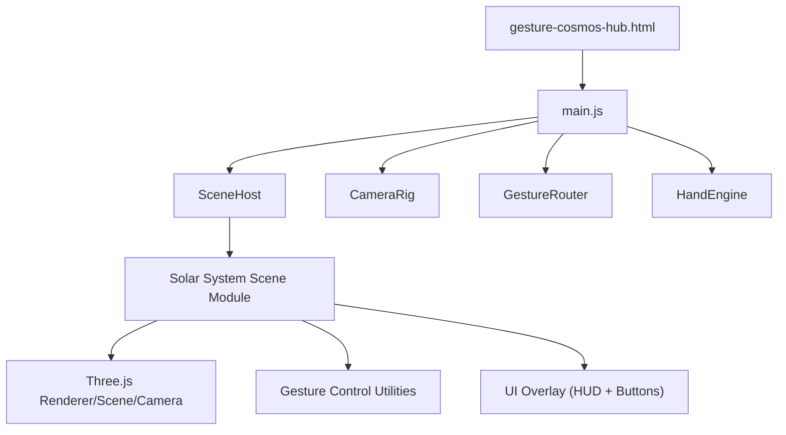
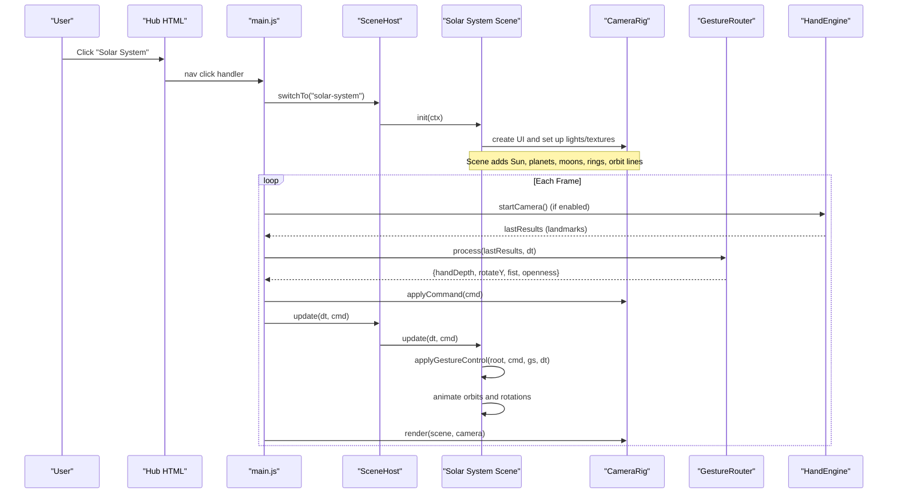
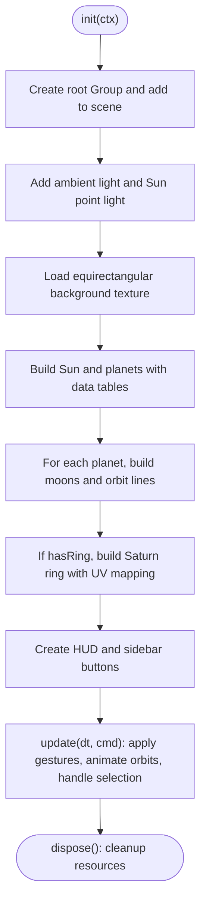
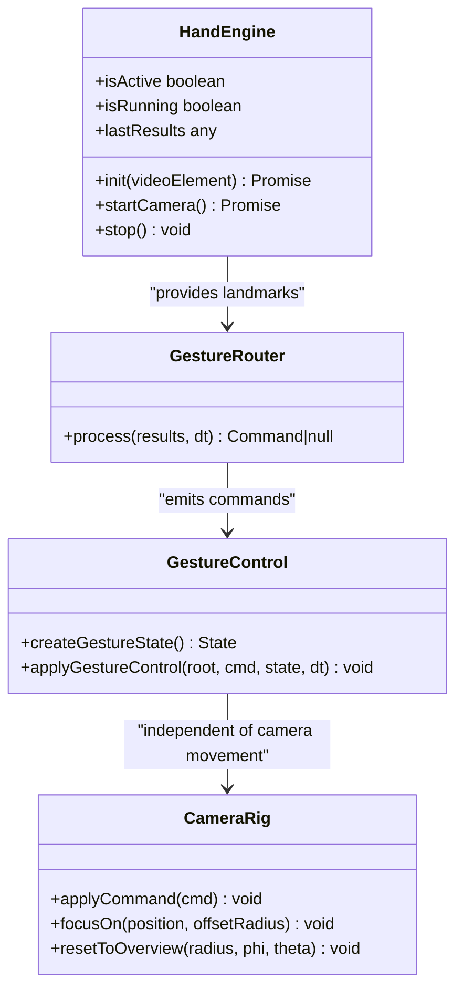
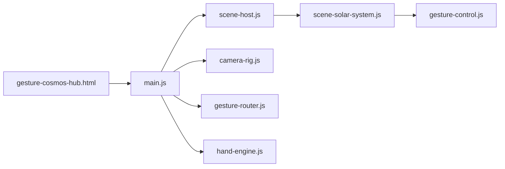

# Solar System Scene

<cite>
**Referenced Files in This Document**
- [scene-solar-system.js](file://src/science/gesture-cosmos/scenes/scene-solar-system.js)
- [main.js](file://src/science/gesture-cosmos/main.js)
- [camera-rig.js](file://src/science/gesture-cosmos/core/camera-rig.js)
- [gesture-control.js](file://src/science/gesture-cosmos/core/gesture-control.js)
- [gesture-router.js](file://src/science/gesture-cosmos/core/gesture-router.js)
- [hand-engine.js](file://src/science/gesture-cosmos/core/hand-engine.js)
- [scene-host.js](file://src/science/gesture-cosmos/core/scene-host.js)
- [gesture-cosmos-hub.html](file://src/science/gesture-cosmos-hub.html)
</cite>

## Table of Contents
1. [Introduction](#introduction)
2. [Project Structure](#project-structure)
3. [Core Components](#core-components)
4. [Architecture Overview](#architecture-overview)
5. [Detailed Component Analysis](#detailed-component-analysis)
6. [Dependency Analysis](#dependency-analysis)
7. [Performance Considerations](#performance-considerations)
8. [Troubleshooting Guide](#troubleshooting-guide)
9. [Conclusion](#conclusion)
10. [Appendices](#appendices)

## Introduction
This document explains the Solar System Scene, a realistic 3D simulation of our solar system built with Three.js and integrated into a gesture-driven exploration hub. It covers:
- Planetary orbits and moon systems
- Celestial body rendering with accurate relative sizes and distances
- Texture mapping for planets and background
- Saturn’s ring implementation
- Lighting setup with the Sun as a point light source
- Interactive camera controls and gesture-based navigation
- Orbit animation calculations
- Educational content integration about planetary motion and relationships

The scene is one of several scenes in the Gesture Cosmos Hub and can be navigated via mouse/touch (OrbitControls) or optional hand gestures when camera access is granted.

## Project Structure
The Solar System Scene is implemented as a modular scene within the Gesture Cosmos Hub. The main entry initializes shared Three.js objects, core modules, and dynamically loads the Solar System Scene module on demand.

**Diagram sources**
- [main.js:1-187](file://src/science/gesture-cosmos/main.js#L1-L187)
- [scene-host.js:1-63](file://src/science/gesture-cosmos/core/scene-host.js#L1-L63)
- [camera-rig.js:1-61](file://src/science/gesture-cosmos/core/camera-rig.js#L1-L61)
- [gesture-router.js:1-111](file://src/science/gesture-cosmos/core/gesture-router.js#L1-L111)
- [hand-engine.js:1-83](file://src/science/gesture-cosmos/core/hand-engine.js#L1-L83)
- [scene-solar-system.js:1-439](file://src/science/gesture-cosmos/scenes/scene-solar-system.js#L1-L439)
- [gesture-cosmos-hub.html:1-283](file://src/science/gesture-cosmos-hub.html#L1-L283)

**Section sources**
- [main.js:1-187](file://src/science/gesture-cosmos/main.js#L1-L187)
- [gesture-cosmos-hub.html:1-283](file://src/science/gesture-cosmos-hub.html#L1-L283)

## Core Components
- Solar System Scene Module: Creates the Sun, planets, moons, orbit lines, rings, lighting, textures, UI, and updates animations each frame.
- Camera Rig: Provides mouse/touch orbit controls and focus/reset helpers.
- Gesture Control Utilities: Apply scale and rotation to the scene root based on hand depth and palm slide; detect fist transitions.
- Gesture Router: Translates MediaPipe hand landmarks into unified commands (depth, rotation delta, fist state).
- Hand Engine: Wraps MediaPipe Hands and Camera utilities to stream frames and return landmark results.
- Scene Host: Manages lifecycle (register, switch, update, dispose) of scenes and injects shared context.

Key responsibilities:
- Realistic relative sizes and orbital distances using an astronomical unit scaling factor.
- Per-body texture mapping with fallback colors.
- Point light at the Sun for physically plausible illumination.
- Saturn ring geometry with UV mapping and transparency.
- UI buttons to focus on bodies and overview reset.
- Gesture-driven zoom and rotation of the entire solar system group.

**Section sources**
- [scene-solar-system.js:1-439](file://src/science/gesture-cosmos/scenes/scene-solar-system.js#L1-L439)
- [camera-rig.js:1-61](file://src/science/gesture-cosmos/core/camera-rig.js#L1-L61)
- [gesture-control.js:1-88](file://src/science/gesture-cosmos/core/gesture-control.js#L1-L88)
- [gesture-router.js:1-111](file://src/science/gesture-cosmos/core/gesture-router.js#L1-L111)
- [hand-engine.js:1-83](file://src/science/gesture-cosmos/core/hand-engine.js#L1-L83)
- [scene-host.js:1-63](file://src/science/gesture-cosmos/core/scene-host.js#L1-L63)

## Architecture Overview
The runtime flow connects user input (mouse/touch or optional hand gestures) to camera movement and scene object manipulation. The Solar System Scene owns all celestial bodies and their animations.

**Diagram sources**
- [main.js:1-187](file://src/science/gesture-cosmos/main.js#L1-L187)
- [scene-host.js:1-63](file://src/science/gesture-cosmos/core/scene-host.js#L1-L63)
- [gesture-router.js:1-111](file://src/science/gesture-cosmos/core/gesture-router.js#L1-L111)
- [hand-engine.js:1-83](file://src/science/gesture-cosmos/core/hand-engine.js#L1-L83)
- [camera-rig.js:1-61](file://src/science/gesture-cosmos/core/camera-rig.js#L1-L61)
- [scene-solar-system.js:1-439](file://src/science/gesture-cosmos/scenes/scene-solar-system.js#L1-L439)

## Detailed Component Analysis

### Solar System Scene Implementation
- Coordinate and Scale Model
  - Uses an AU constant to convert real astronomical units into scene units.
  - Defines relative radii for Sun, planets, and major moons to preserve proportional sizes.
  - Orbital radii are scaled by AU for Mercury through Neptune; moons’ orbital radii are defined relative to their parent planet’s radius plus offsets.

- Celestial Body Creation
  - Spheres created with appropriate segment counts for smooth shading.
  - Materials:
    - Sun uses emissive-like basic material.
    - Textured bodies use MeshStandardMaterial with loaded textures and subtle roughness/metalness.
    - Non-textured bodies fall back to solid color materials with slight emissive tint.
  - Shadow casting/receiving toggled appropriately for non-light sources.

- Orbits and Animation
  - Circular orbits computed per frame using angle accumulation proportional to speed and delta time.
  - Moons orbit around their parent planet mesh positions; planets orbit around the Sun.
  - Orbit lines drawn as circular Line geometries for visual guidance.

- Saturn Rings
  - RingGeometry constructed with inner and outer radii relative to Saturn’s radius.
  - UV coordinates mapped radially and angularly to align the ring texture correctly.
  - Double-sided material with transparency and alpha testing; receives shadows but does not cast them.

- Lighting Setup
  - Ambient light provides base illumination.
  - Point light placed at the Sun with shadow map configuration and camera frustum tuned to the scene scale.

- Background
  - Equirectangular starfield used as scene background with error handling and fallback to black.

- UI and Interaction
  - HUD displays title and educational subtitle.
  - Sidebar buttons allow focusing on the Sun and each primary body; clicking a button moves the camera to look at that body.
  - Raycasting supports selecting a body directly from the viewport.

- Disposal and Cleanup
  - Removes DOM overlays, removes scene objects, disposes geometries/materials/textures, resets background.

**Diagram sources**
- [scene-solar-system.js:1-439](file://src/science/gesture-cosmos/scenes/scene-solar-system.js#L1-L439)

**Section sources**
- [scene-solar-system.js:1-439](file://src/science/gesture-cosmos/scenes/scene-solar-system.js#L1-L439)

### Gesture-Based Navigation and Controls
- Gesture Pipeline
  - HandEngine streams frames to MediaPipe Hands and exposes lastResults.
  - GestureRouter computes openness, fist state (debounced), hand depth (apparent size), and Y-axis rotation delta from palm X movement.
  - Gesture control applies smooth scale changes to the scene root and rotates it on Y when open palm slides left/right. Fist rising/falling edges are exposed for future effects.

- Mouse/Touch Controls
  - CameraRig wraps OrbitControls for drag-to-orbit and scroll-to-zoom.
  - Focus and overview helpers move the camera target and position smoothly.

**Diagram sources**
- [hand-engine.js:1-83](file://src/science/gesture-cosmos/core/hand-engine.js#L1-L83)
- [gesture-router.js:1-111](file://src/science/gesture-cosmos/core/gesture-router.js#L1-L111)
- [gesture-control.js:1-88](file://src/science/gesture-cosmos/core/gesture-control.js#L1-L88)
- [camera-rig.js:1-61](file://src/science/gesture-cosmos/core/camera-rig.js#L1-L61)

**Section sources**
- [hand-engine.js:1-83](file://src/science/gesture-cosmos/core/hand-engine.js#L1-L83)
- [gesture-router.js:1-111](file://src/science/gesture-cosmos/core/gesture-router.js#L1-L111)
- [gesture-control.js:1-88](file://src/science/gesture-cosmos/core/gesture-control.js#L1-L88)
- [camera-rig.js:1-61](file://src/science/gesture-cosmos/core/camera-rig.js#L1-L61)

### Lighting and Rendering Details
- Sun as Point Light
  - Positioned at the origin; casts shadows with configured map size and camera near/far planes.
  - Intensity and range tuned to illuminate planets across scaled AU distances.

- Material and Textures
  - Standard materials with diffuse maps for planets; fallback colors for missing textures.
  - Ring material uses transparency and alpha test to blend with background stars.

- Background Environment
  - Equirectangular starfield applied to scene background; error handling ensures robustness.

**Section sources**
- [scene-solar-system.js:1-439](file://src/science/gesture-cosmos/scenes/scene-solar-system.js#L1-L439)

### Educational Content Integration
- HUD displays “Unit 5: Patterns and Cycles,” connecting the simulation to curriculum themes.
- Sidebar buttons encourage exploration of individual bodies, supporting inquiry-based learning about planetary motion and relationships.
- Orbit lines visually reinforce circular motion concepts and relative distances.

**Section sources**
- [scene-solar-system.js:1-439](file://src/science/gesture-cosmos/scenes/scene-solar-system.js#L1-L439)

## Dependency Analysis
The Solar System Scene depends on shared core modules and the hub’s main entry. Dynamic imports ensure lazy loading of scene code.

**Diagram sources**
- [gesture-cosmos-hub.html:1-283](file://src/science/gesture-cosmos-hub.html#L1-L283)
- [main.js:1-187](file://src/science/gesture-cosmos/main.js#L1-L187)
- [scene-host.js:1-63](file://src/science/gesture-cosmos/core/scene-host.js#L1-L63)
- [camera-rig.js:1-61](file://src/science/gesture-cosmos/core/camera-rig.js#L1-L61)
- [gesture-router.js:1-111](file://src/science/gesture-cosmos/core/gesture-router.js#L1-L111)
- [hand-engine.js:1-83](file://src/science/gesture-cosmos/core/hand-engine.js#L1-L83)
- [scene-solar-system.js:1-439](file://src/science/gesture-cosmos/scenes/scene-solar-system.js#L1-L439)
- [gesture-control.js:1-88](file://src/science/gesture-cosmos/core/gesture-control.js#L1-L88)

**Section sources**
- [main.js:1-187](file://src/science/gesture-cosmos/main.js#L1-L187)
- [scene-host.js:1-63](file://src/science/gesture-cosmos/core/scene-host.js#L1-L63)
- [scene-solar-system.js:1-439](file://src/science/gesture-cosmos/scenes/scene-solar-system.js#L1-L439)

## Performance Considerations
- Geometry reuse and disposal: All geometries, materials, and textures are tracked for disposal during scene teardown to prevent memory leaks.
- Shadow costs: Shadows are enabled for the Sun’s point light; consider reducing shadow map resolution or disabling shadows on distant objects if performance degrades on lower-end devices.
- Texture loading: Remote textures may fail; the scene handles errors gracefully and falls back to solid colors or black background.
- Gesture smoothing: Smooth lerp for scale prevents jittery zoom; keep damping factors balanced for responsive interaction.
- Starfield background: A lightweight points cloud is used for additional cosmic ambiance without heavy post-processing.

[No sources needed since this section provides general guidance]

## Troubleshooting Guide
- Camera/Gestures Not Working
  - Ensure the “Enable Gestures” button is clicked to grant camera permission. If unavailable, the app falls back to mouse/touch controls.
  - Check browser console for MediaPipe initialization errors.

- Missing Textures or Black Background
  - Network issues or CORS restrictions can block remote textures. The scene logs errors and sets a black background fallback.

- Poor Performance on Mobile
  - Reduce pixel ratio or disable shadows for mobile devices.
  - Limit number of visible moons or reduce geometry segments if necessary.

- Focus Button Does Nothing
  - Verify the selected body exists and is not a moon (only top-level bodies have buttons).
  - Ensure the camera rig is initialized and not overridden elsewhere.

**Section sources**
- [main.js:1-187](file://src/science/gesture-cosmos/main.js#L1-L187)
- [scene-solar-system.js:1-439](file://src/science/gesture-cosmos/scenes/scene-solar-system.js#L1-L439)

## Conclusion
The Solar System Scene delivers an engaging, educationally aligned 3D experience with accurate relative sizes and distances, textured planets, Saturn’s rings, and a sun-centered lighting model. Gesture-based controls complement traditional mouse/touch navigation, enabling intuitive exploration. The modular architecture cleanly separates concerns between scene logic, input processing, and camera management, making it easy to extend with additional educational features or interactive elements.

[No sources needed since this section summarizes without analyzing specific files]

## Appendices

### Example: Orbit Animation Calculation
- Each body maintains an angle incremented by its speed multiplied by delta time.
- Position is computed using cosine/sine of the angle times the orbital radius.
- Moons compute positions relative to their parent planet mesh; planets compute positions relative to the Sun.

**Section sources**
- [scene-solar-system.js:1-439](file://src/science/gesture-cosmos/scenes/scene-solar-system.js#L1-L439)

### Example: Gesture-Based Navigation
- Open palm sliding left/right rotates the entire solar system group on the Y axis.
- Hand distance from the camera scales the group smoothly between minimum and maximum bounds.
- Fist transitions are detected with hysteresis to avoid accidental triggers.

**Section sources**
- [gesture-router.js:1-111](file://src/science/gesture-cosmos/core/gesture-router.js#L1-L111)
- [gesture-control.js:1-88](file://src/science/gesture-cosmos/core/gesture-control.js#L1-L88)

### Example: Saturn Ring UV Mapping
- UV coordinates are derived from radial distance and angle around the ring center to properly wrap the ring texture.
- Transparency and alpha testing ensure the ring blends naturally with the background and other objects.

**Section sources**
- [scene-solar-system.js:1-439](file://src/science/gesture-cosmos/scenes/scene-solar-system.js#L1-L439)