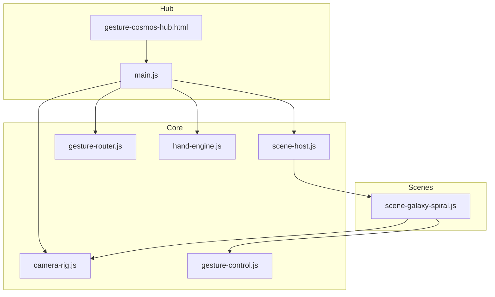
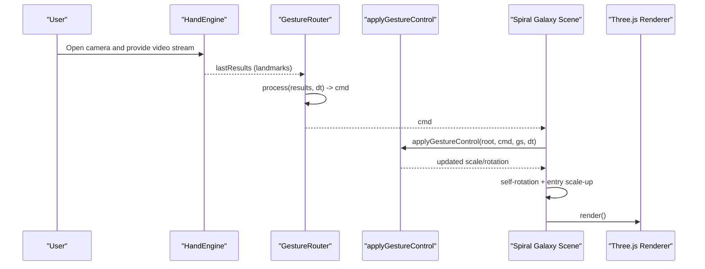
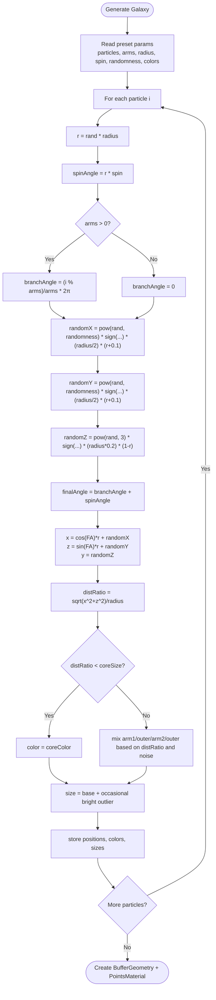
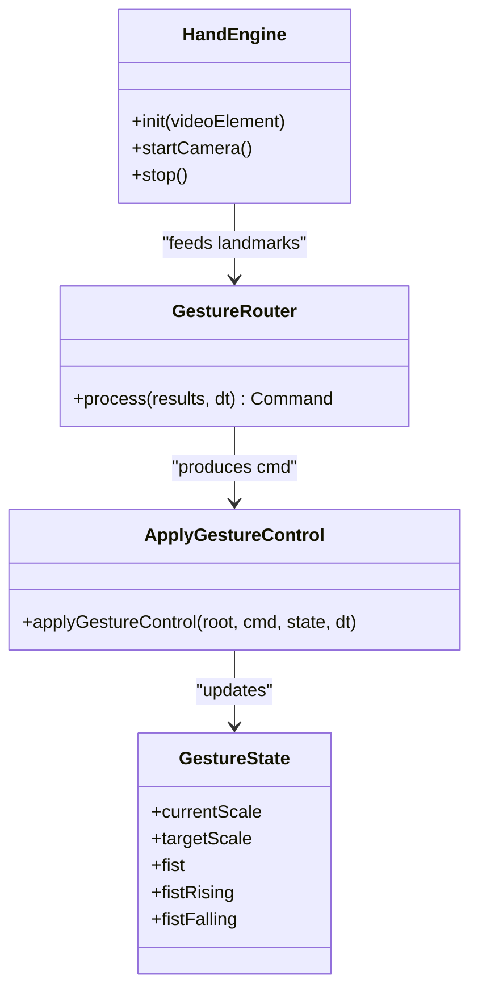
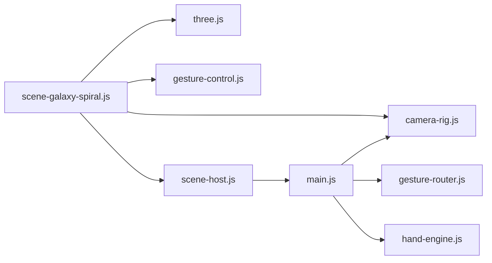

# Spiral Galaxy Scene

<cite>
**Referenced Files in This Document**
- [scene-galaxy-spiral.js](file://src/science/gesture-cosmos/scenes/scene-galaxy-spiral.js)
- [main.js](file://src/science/gesture-cosmos/main.js)
- [gesture-control.js](file://src/science/gesture-cosmos/core/gesture-control.js)
- [gesture-router.js](file://src/science/gesture-cosmos/core/gesture-router.js)
- [hand-engine.js](file://src/science/gesture-cosmos/core/hand-engine.js)
- [camera-rig.js](file://src/science/gesture-cosmos/core/camera-rig.js)
- [scene-host.js](file://src/science/gesture-cosmos/core/scene-host.js)
- [gesture-cosmos-hub.html](file://src/science/gesture-cosmos-hub.html)
</cite>

## Table of Contents
1. [Introduction](#introduction)
2. [Project Structure](#project-structure)
3. [Core Components](#core-components)
4. [Architecture Overview](#architecture-overview)
5. [Detailed Component Analysis](#detailed-component-analysis)
6. [Dependency Analysis](#dependency-analysis)
7. [Performance Considerations](#performance-considerations)
8. [Troubleshooting Guide](#troubleshooting-guide)
9. [Conclusion](#conclusion)
10. [Appendices](#appendices)

## Introduction
This document explains the Spiral Galaxy Scene with a focus on its mathematical modeling and real-time rendering. It covers:
- Particle system for star distribution
- Spiral arm generation algorithms
- Volumetric effects simulating galactic density variations
- Mathematical functions used for spiral patterns, particle physics simulation, and real-time rendering optimizations
- Parameter tuning examples for different galaxy types
- Educational content about galactic evolution
- Interactive exploration features (mouse and gesture-based)

The implementation is part of an interactive educational hub that supports multiple scenes and integrates hand tracking via MediaPipe to control object scale and rotation.

## Project Structure
The Spiral Galaxy Scene is implemented as a Three.js scene module within a larger Gesture Cosmos Hub. The main entry initializes shared Three.js objects, core modules (HandEngine, GestureRouter, CameraRig, SceneHost), and dynamically loads scene modules. The Spiral Galaxy scene provides:
- A configurable set of galaxy presets
- A procedural particle generator using polar coordinates and logarithmic spirals
- Additive blending and glow textures for volumetric appearance
- UI controls to switch between galaxy presets
- Real-time updates driven by gestures or mouse

**Diagram sources**
- [gesture-cosmos-hub.html:240-283](file://src/science/gesture-cosmos-hub.html#L240-L283)
- [main.js:1-187](file://src/science/gesture-cosmos/main.js#L1-L187)
- [scene-host.js:1-63](file://src/science/gesture-cosmos/core/scene-host.js#L1-L63)
- [camera-rig.js:1-61](file://src/science/gesture-cosmos/core/camera-rig.js#L1-L61)
- [gesture-router.js:1-111](file://src/science/gesture-cosmos/core/gesture-router.js#L1-L111)
- [hand-engine.js:1-83](file://src/science/gesture-cosmos/core/hand-engine.js#L1-L83)
- [gesture-control.js:1-88](file://src/science/gesture-cosmos/core/gesture-control.js#L1-L88)
- [scene-galaxy-spiral.js:1-338](file://src/science/gesture-cosmos/scenes/scene-galaxy-spiral.js#L1-L338)

**Section sources**
- [gesture-cosmos-hub.html:240-283](file://src/science/gesture-cosmos-hub.html#L240-L283)
- [main.js:1-187](file://src/science/gesture-cosmos/main.js#L1-L187)

## Core Components
- Spiral Galaxy Scene Module: Implements particle generation, material setup, UI, and update loop.
- Gesture Control: Unified interface for applying hand-driven scale and rotation to scene objects.
- Gesture Router: Translates MediaPipe landmarks into commands (hand depth, rotation delta, fist state).
- Hand Engine: Wraps MediaPipe Hands and Camera utilities.
- Camera Rig: Mouse/touch orbit controls; gestures do not move the camera directly.
- Scene Host: Manages lifecycle (init/update/dispose) of scene modules.

Key responsibilities:
- Procedural generation of thousands of particles forming spiral arms and bulge regions
- Color mixing based on distance from center and random noise
- Additive blending and custom glow texture for volumetric look
- Smooth scale transitions and Y-axis rotation controlled by open palm sliding
- Fist detection triggers optional explosion/reconstruction logic (shared across scenes)

**Section sources**
- [scene-galaxy-spiral.js:1-338](file://src/science/gesture-cosmos/scenes/scene-galaxy-spiral.js#L1-L338)
- [gesture-control.js:1-88](file://src/science/gesture-cosmos/core/gesture-control.js#L1-L88)
- [gesture-router.js:1-111](file://src/science/gesture-cosmos/core/gesture-router.js#L1-L111)
- [hand-engine.js:1-83](file://src/science/gesture-cosmos/core/hand-engine.js#L1-L83)
- [camera-rig.js:1-61](file://src/science/gesture-cosmos/core/camera-rig.js#L1-L61)
- [scene-host.js:1-63](file://src/science/gesture-cosmos/core/scene-host.js#L1-L63)

## Architecture Overview
The Spiral Galaxy Scene integrates with the hub’s render loop and gesture pipeline. Each frame:
- GestureRouter processes MediaPipe results into a command object
- applyGestureControl updates the galaxy group’s scale and rotation
- The scene applies auto-rotation and ensures position reset
- The renderer draws the scene with fog and background stars

**Diagram sources**
- [main.js:160-187](file://src/science/gesture-cosmos/main.js#L160-L187)
- [gesture-router.js:34-111](file://src/science/gesture-cosmos/core/gesture-router.js#L34-L111)
- [gesture-control.js:50-83](file://src/science/gesture-cosmos/core/gesture-control.js#L50-L83)
- [scene-galaxy-spiral.js:279-309](file://src/science/gesture-cosmos/scenes/scene-galaxy-spiral.js#L279-L309)

## Detailed Component Analysis

### Spiral Galaxy Scene: Mathematical Modeling and Algorithms
The scene generates a particle cloud representing a spiral galaxy. The algorithm uses polar coordinates and logarithmic spirals to distribute particles along arms, with randomness controlling thickness and vertical spread.

Key parameters per preset:
- particles: number of points
- arms: number of spiral arms
- radius: maximum radial extent
- spin: angular twist factor proportional to radius
- randomness: power-law exponent shaping radial distribution
- coreColor/armColor1/armColor2/outerColor: color palette
- coreSize: normalized threshold for central bulge region

Mathematical steps:
- Radius sampling: r = rand * radius
- Spin angle: spinAngle = r * spin
- Arm assignment: branchAngle = (armIndex / arms) * 2π when arms > 0
- Random offsets:
  - X and Y offsets use power-law distribution: pow(rand, randomness) * sign(rand - 0.5) * (radius/2) * (r + 0.1)
  - Z offset uses cubic power: pow(rand, 3) * sign(rand - 0.5) * (radius * 0.2) * (1 - r)
- Final angle: finalAngle = branchAngle + spinAngle
- Cartesian conversion: x = cos(finalAngle) * r + offsetX, z = sin(finalAngle) * r + offsetY, y = offsetZ
- Distance ratio: distRatio = sqrt(x^2 + z^2) / radius
- Color mixing:
  - If distRatio < coreSize → core color
  - Else mix arm colors with outer color based on distRatio and random thresholds
- Size variation: base size plus occasional bright outlier sizes

Volumetric effects:
- Custom radial gradient texture for soft glow
- Additive blending and transparency for overlapping brightness
- FogExp2 for depth cueing and atmospheric density
- Background star field for context

**Diagram sources**
- [scene-galaxy-spiral.js:122-216](file://src/science/gesture-cosmos/scenes/scene-galaxy-spiral.js#L122-L216)

**Section sources**
- [scene-galaxy-spiral.js:6-72](file://src/science/gesture-cosmos/scenes/scene-galaxy-spiral.js#L6-L72)
- [scene-galaxy-spiral.js:122-216](file://src/science/gesture-cosmos/scenes/scene-galaxy-spiral.js#L122-L216)
- [scene-galaxy-spiral.js:218-262](file://src/science/gesture-cosmos/scenes/scene-galaxy-spiral.js#L218-L262)
- [scene-galaxy-spiral.js:264-309](file://src/science/gesture-cosmos/scenes/scene-galaxy-spiral.js#L264-L309)

### Gesture Control System
The shared gesture controller translates hand signals into smooth transformations:
- Scale mapping: handDepth ∈ [0,1] maps to targetScale ∈ [MIN_SCALE, MAX_SCALE], then lerps to currentScale
- Rotation: open palm slide left/right rotates the root group around Y axis; fist disables rotation
- Edge detection: fistRising/fistFalling flags for one-frame actions (e.g., explode/reconstruct)

**Diagram sources**
- [gesture-control.js:24-88](file://src/science/gesture-cosmos/core/gesture-control.js#L24-L88)
- [gesture-router.js:22-111](file://src/science/gesture-cosmos/core/gesture-router.js#L22-L111)
- [hand-engine.js:5-83](file://src/science/gesture-cosmos/core/hand-engine.js#L5-L83)

**Section sources**
- [gesture-control.js:1-88](file://src/science/gesture-cosmos/core/gesture-control.js#L1-L88)
- [gesture-router.js:1-111](file://src/science/gesture-cosmos/core/gesture-router.js#L1-L111)
- [hand-engine.js:1-83](file://src/science/gesture-cosmos/core/hand-engine.js#L1-L83)

### Rendering Pipeline and Optimizations
- Geometry: Float32Array buffers for positions, colors, sizes
- Material: PointsMaterial with vertexColors, additive blending, transparent, sizeAttenuation
- Texture: Canvas-generated radial gradient for soft glow
- Depth write disabled to avoid overdraw artifacts with additive blending
- FogExp2 for atmospheric depth cueing
- Background star field for visual context

Optimization notes:
- Precompute arrays once during generation
- Use BufferAttribute for GPU-friendly data layout
- Clamp point sizes to avoid extreme scaling
- Avoid per-frame heavy allocations; reuse geometry/material where possible

**Section sources**
- [scene-galaxy-spiral.js:85-120](file://src/science/gesture-cosmos/scenes/scene-galaxy-spiral.js#L85-L120)
- [scene-galaxy-spiral.js:195-216](file://src/science/gesture-cosmos/scenes/scene-galaxy-spiral.js#L195-L216)
- [scene-galaxy-spiral.js:264-277](file://src/science/gesture-cosmos/scenes/scene-galaxy-spiral.js#L264-L277)

### Interaction and UI
- HUD displays galaxy name and unit subtitle
- Status indicator shows “GESTURE ACTIVE” or “MOUSE CONTROL”
- FPS counter updates per frame
- Sidebar buttons switch between galaxy presets and update title

**Section sources**
- [scene-galaxy-spiral.js:218-262](file://src/science/gesture-cosmos/scenes/scene-galaxy-spiral.js#L218-L262)
- [scene-galaxy-spiral.js:279-294](file://src/science/gesture-cosmos/scenes/scene-galaxy-spiral.js#L279-L294)

## Dependency Analysis
The Spiral Galaxy Scene depends on:
- Three.js for rendering and math
- Shared gesture control for interaction
- Hub’s render loop and scene host for lifecycle management
- MediaPipe for hand tracking (optional; falls back to mouse)

**Diagram sources**
- [scene-galaxy-spiral.js:1-3](file://src/science/gesture-cosmos/scenes/scene-galaxy-spiral.js#L1-L3)
- [main.js:8-12](file://src/science/gesture-cosmos/main.js#L8-L12)
- [scene-host.js:1-10](file://src/science/gesture-cosmos/core/scene-host.js#L1-L10)
- [gesture-control.js:1-3](file://src/science/gesture-cosmos/core/gesture-control.js#L1-L3)
- [gesture-router.js:1-3](file://src/science/gesture-cosmos/core/gesture-router.js#L1-L3)
- [hand-engine.js:1-5](file://src/science/gesture-cosmos/core/hand-engine.js#L1-L5)
- [camera-rig.js:1-8](file://src/science/gesture-cosmos/core/camera-rig.js#L1-L8)

**Section sources**
- [main.js:14-22](file://src/science/gesture-cosmos/main.js#L14-L22)
- [scene-host.js:11-25](file://src/science/gesture-cosmos/core/scene-host.js#L11-L25)

## Performance Considerations
- Particle count: Presets range from ~140k to 200k points; adjust based on device capability
- Buffer allocation: Large Float32Arrays allocated once at generation time
- Blending cost: Additive blending can be expensive; consider reducing opacity or particle count on low-end devices
- Texture size: Small canvas textures (64–128 px) minimize memory footprint
- Update loop: Minimal per-frame work; mostly transform updates and small DOM reads
- Auto-rotation speed: Low constant to maintain smoothness without high CPU usage

[No sources needed since this section provides general guidance]

## Troubleshooting Guide
Common issues and resolutions:
- Gestures not detected:
  - Ensure camera permission granted and overlay dismissed
  - Verify MediaPipe scripts loaded and HandEngine initialized
  - Check status indicator for “GESTURE ACTIVE” vs “MOUSE CONTROL”
- Scene fails to load:
  - Dynamic import errors are caught; fallback to previous scene button active state
  - Inspect console for initialization errors
- Poor performance:
  - Reduce particle count in preset
  - Lower pixel ratio or disable antialias if necessary
  - Reduce background star count or fog density

**Section sources**
- [main.js:116-130](file://src/science/gesture-cosmos/main.js#L116-L130)
- [main.js:78-109](file://src/science/gesture-cosmos/main.js#L78-L109)
- [scene-galaxy-spiral.js:279-294](file://src/science/gesture-cosmos/scenes/scene-galaxy-spiral.js#L279-L294)

## Conclusion
The Spiral Galaxy Scene demonstrates how procedural mathematics can create compelling cosmic visuals. By combining logarithmic spirals, randomized distributions, and efficient GPU-friendly rendering, it offers an interactive educational experience. Gesture integration enhances exploration, while parameterized presets allow students to compare different galaxy morphologies and understand large-scale structures.

[No sources needed since this section summarizes without analyzing specific files]

## Appendices

### Parameter Tuning Examples
- Milky Way-like:
  - arms=2, radius≈50, spin≈3, randomness≈0.5, coreSize≈0.15
  - Colors: warm core, blue arms, dark outer
- Andromeda-like:
  - arms=4, radius≈60, spin≈5, randomness≈0.8, coreSize≈0.25
  - Colors: bright core, light blue arms, medium outer
- Whirlpool (M51):
  - arms=2, radius≈45, spin≈6, randomness≈0.3, coreSize≈0.1
  - Colors: white core, pink/blue arms, black outer
- Sombrero (M104):
  - arms=0, radius≈40, spin≈10, randomness≈0.2, coreSize≈0.5
  - Colors: yellow/orange core, reddish arms, very dark outer
- Cosmic Nebula:
  - arms=3, radius≈70, spin≈1, randomness≈2.0, coreSize≈0.05
  - Colors: teal core, magenta/blue arms, black outer

Educational insights:
- More arms and higher spin produce tighter, more defined spirals
- Higher randomness increases arm thickness and diffuse structure
- Larger coreSize emphasizes bulge prominence
- Color gradients simulate metallicity and dust distribution

Interactive features:
- Open palm forward/backward: scale up/down
- Open palm slide left/right: rotate around Y axis
- Fist: trigger edge events (shared across scenes)
- Mouse/touch: orbit and zoom via OrbitControls

**Section sources**
- [scene-galaxy-spiral.js:6-72](file://src/science/gesture-cosmos/scenes/scene-galaxy-spiral.js#L6-L72)
- [gesture-control.js:14-26](file://src/science/gesture-cosmos/core/gesture-control.js#L14-L26)
- [gesture-router.js:4-21](file://src/science/gesture-cosmos/core/gesture-router.js#L4-L21)
- [camera-rig.js:2-6](file://src/science/gesture-cosmos/core/camera-rig.js#L2-L6)