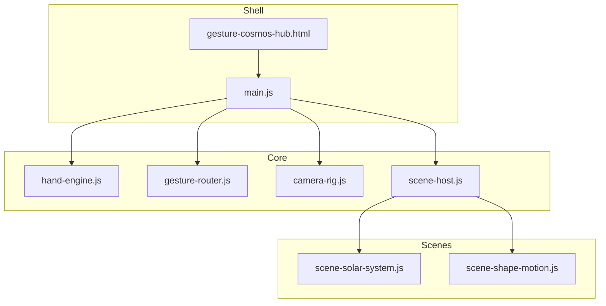
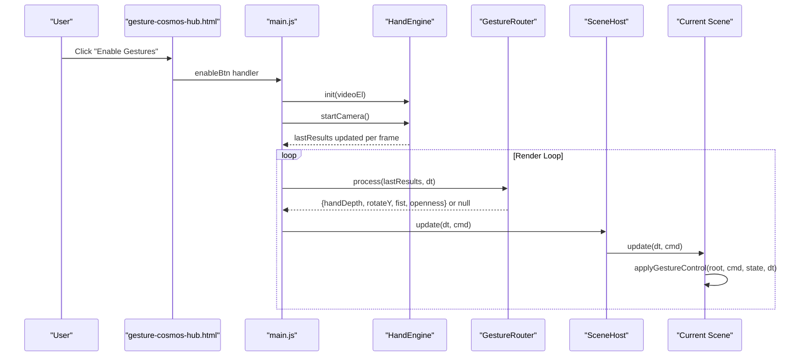
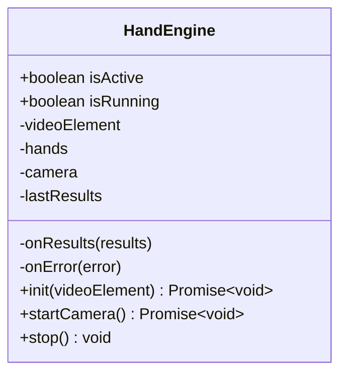
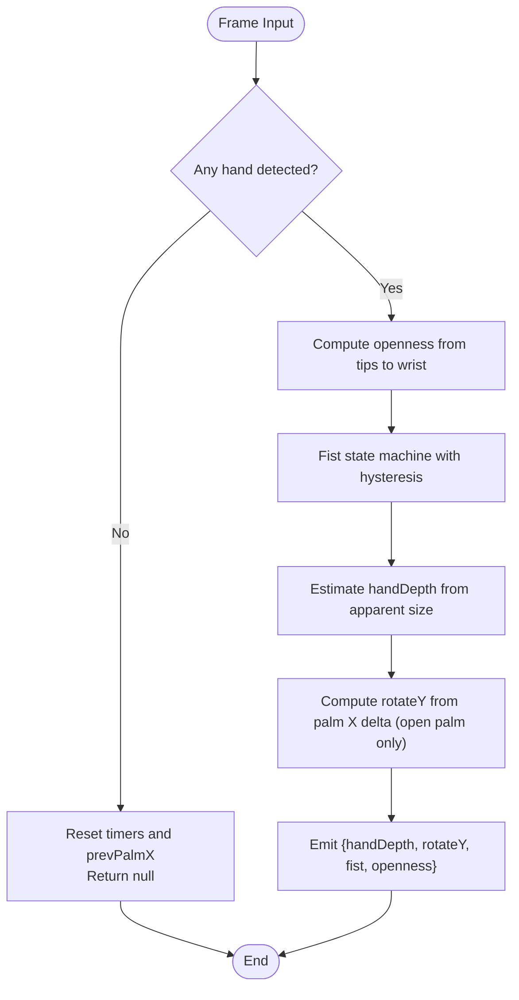
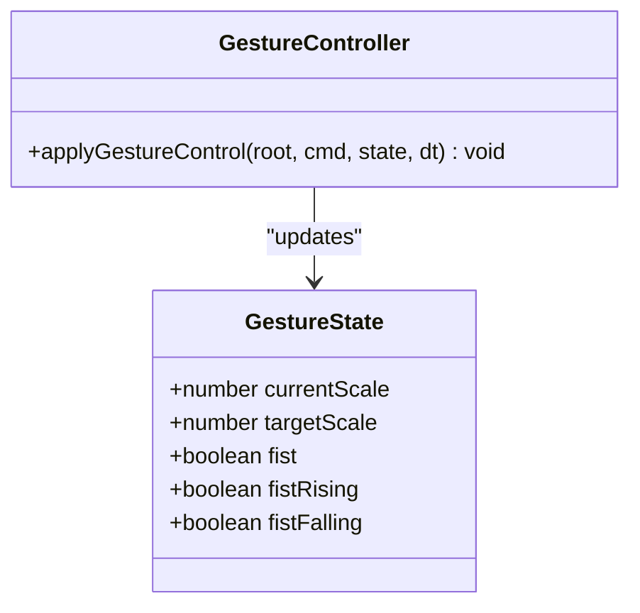
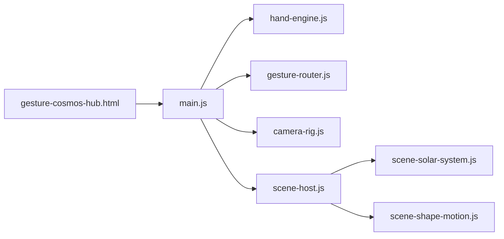

# Gesture Control System

<cite>
**Referenced Files in This Document**
- [gesture-cosmos-hub.html](file://src/science/gesture-cosmos-hub.html)
- [main.js](file://src/science/gesture-cosmos/main.js)
- [hand-engine.js](file://src/science/gesture-cosmos/core/hand-engine.js)
- [gesture-router.js](file://src/science/gesture-cosmos/core/gesture-router.js)
- [camera-rig.js](file://src/science/gesture-cosmos/core/camera-rig.js)
- [scene-host.js](file://src/science/gesture-cosmos/core/scene-host.js)
- [scene-solar-system.js](file://src/science/gesture-cosmos/scenes/scene-solar-system.js)
- [scene-shape-motion.js](file://src/science/gesture-cosmos/scenes/scene-shape-motion.js)
</cite>

## Table of Contents
1. [Introduction](#introduction)
2. [Project Structure](#project-structure)
3. [Core Components](#core-components)
4. [Architecture Overview](#architecture-overview)
5. [Detailed Component Analysis](#detailed-component-analysis)
6. [Dependency Analysis](#dependency-analysis)
7. [Performance Considerations](#performance-considerations)
8. [Troubleshooting Guide](#troubleshooting-guide)
9. [Conclusion](#conclusion)
10. [Appendices](#appendices)

## Introduction
This document explains the Gesture Control System used by the Gesture Cosmos Exploration Hub. It focuses on MediaPipe hand tracking integration, gesture recognition, and how camera input is processed to drive 3D interactions. The system provides:
- A hand engine that wraps MediaPipe Hands and Camera utilities
- A gesture router that translates landmarks into unified commands
- Real-time hand position tracking and interaction event handling
- A command mapping system for scaling, rotation, and fist-based actions
- Fallback mechanisms when camera access is unavailable
- Guidance for custom gestures, parameter tuning, and performance optimization

The design emphasizes local processing (no server-side inference), privacy benefits, and smooth user experience across devices.

## Project Structure
The Gesture Cosmos hub consolidates six Three.js scenes under a single shell with shared core modules:
- Shell page loads MediaPipe via script tags and Three.js via importmap
- main.js initializes renderer, scene, camera, and core modules
- Core modules provide hand tracking, gesture classification, camera rig, and scene lifecycle management
- Scene modules consume unified commands to animate 3D content

**Diagram sources**
- [gesture-cosmos-hub.html:227-238](file://src/science/gesture-cosmos-hub.html#L227-L238)
- [main.js:8-12](file://src/science/gesture-cosmos/main.js#L8-L12)
- [hand-engine.js:1-83](file://src/science/gesture-cosmos/core/hand-engine.js#L1-L83)
- [gesture-router.js:1-111](file://src/science/gesture-cosmos/core/gesture-router.js#L1-L111)
- [camera-rig.js:1-61](file://src/science/gesture-cosmos/core/camera-rig.js#L1-L61)
- [scene-host.js:1-63](file://src/science/gesture-cosmos/core/scene-host.js#L1-L63)
- [scene-solar-system.js:1-10](file://src/science/gesture-cosmos/scenes/scene-solar-system.js#L1-L10)
- [scene-shape-motion.js:1-5](file://src/science/gesture-cosmos/scenes/scene-shape-motion.js#L1-L5)

**Section sources**
- [gesture-cosmos-hub.html:227-238](file://src/science/gesture-cosmos-hub.html#L227-L238)
- [main.js:8-12](file://src/science/gesture-cosmos/main.js#L8-L12)

## Core Components
- HandEngine: Initializes MediaPipe Hands, configures options, starts camera feed, and exposes last results for downstream processing.
- GestureRouter: Converts raw landmarks into a normalized command stream including hand depth, rotation delta, and debounced fist state.
- CameraRig: Provides mouse-driven orbit controls; gestures do not move the camera directly but are consumed by scenes.
- SceneHost: Manages scene lifecycle (init/update/dispose) and passes a shared context to each scene.
- Scenes: Implement update(dt, cmd) to apply gestures to 3D objects (scale, rotate, explode/reconstruct).

Key responsibilities:
- Local processing: All hand detection runs in-browser using MediaPipe models loaded from CDN.
- Privacy: No video frames leave the device; only landmark-derived commands affect the app.
- Fallback: If camera or MediaPipe fails, the app continues with mouse/touch OrbitControls.

**Section sources**
- [hand-engine.js:1-83](file://src/science/gesture-cosmos/core/hand-engine.js#L1-L83)
- [gesture-router.js:1-111](file://src/science/gesture-cosmos/core/gesture-router.js#L1-L111)
- [camera-rig.js:1-61](file://src/science/gesture-cosmos/core/camera-rig.js#L1-L61)
- [scene-host.js:1-63](file://src/science/gesture-cosmos/core/scene-host.js#L1-L63)
- [scene-solar-system.js:362-404](file://src/science/gesture-cosmos/scenes/scene-solar-system.js#L362-L404)
- [scene-shape-motion.js:190-239](file://src/science/gesture-cosmos/scenes/scene-shape-motion.js#L190-L239)

## Architecture Overview
The runtime flow connects camera input to 3D interactions through a clear pipeline:
- User enables gestures via explicit button click (required by browser policies)
- HandEngine initializes MediaPipe and starts camera feed
- Main loop calls GestureRouter.process(lastResults, dt)
- GestureRouter returns a command object or null
- Scenes receive the command and transform their root objects (scale/rotate/fist events)

**Diagram sources**
- [gesture-cosmos-hub.html:248-251](file://src/science/gesture-cosmos-hub.html#L248-L251)
- [main.js:117-130](file://src/science/gesture-cosmos/main.js#L117-L130)
- [main.js:160-179](file://src/science/gesture-cosmos/main.js#L160-L179)
- [hand-engine.js:21-46](file://src/science/gesture-cosmos/core/hand-engine.js#L21-L46)
- [gesture-router.js:34-110](file://src/science/gesture-cosmos/core/gesture-router.js#L34-L110)
- [scene-host.js:57-61](file://src/science/gesture-cosmos/core/scene-host.js#L57-L61)
- [scene-solar-system.js:362-366](file://src/science/gesture-cosmos/scenes/scene-solar-system.js#L362-L366)

## Detailed Component Analysis

### Hand Engine Implementation
Responsibilities:
- Initialize MediaPipe Hands with model location and confidence thresholds
- Start camera feed and send frames to hands.send()
- Expose lastResults for GestureRouter consumption
- Provide stop() to release resources

Configuration highlights:
- maxNumHands: supports up to two hands
- modelComplexity: balances accuracy vs speed
- minDetectionConfidence/minTrackingConfidence: tune sensitivity

Error handling:
- Throws if MediaPipe globals are missing
- Catches errors during initialization and camera start
- Gracefully closes camera and hands on stop()

**Diagram sources**
- [hand-engine.js:1-83](file://src/science/gesture-cosmos/core/hand-engine.js#L1-L83)

**Section sources**
- [hand-engine.js:21-46](file://src/science/gesture-cosmos/core/hand-engine.js#L21-L46)
- [hand-engine.js:48-71](file://src/science/gesture-cosmos/core/hand-engine.js#L48-L71)
- [hand-engine.js:73-81](file://src/science/gesture-cosmos/core/hand-engine.js#L73-L81)

### Gesture Classification Algorithms
The GestureRouter implements:
- Openness estimation: average distance from fingertips to wrist, normalized to [0,1]
- Fist state machine with hysteresis: requires sustained closed/open states to avoid flicker
- Hand depth proxy: uses wrist-to-middle-finger tip distance in screen space to infer proximity
- Rotation delta: palm center X movement mapped to Y-axis rotation when open palm

Command output:
- handDepth: 0.0 (close) → 1.0 (far)
- rotateY: radians per frame (clamped)
- fist: boolean (debounced)
- openness: normalized measure

**Diagram sources**
- [gesture-router.js:34-110](file://src/science/gesture-cosmos/core/gesture-router.js#L34-L110)

**Section sources**
- [gesture-router.js:46-55](file://src/science/gesture-cosmos/core/gesture-router.js#L46-L55)
- [gesture-router.js:57-73](file://src/science/gesture-cosmos/core/gesture-router.js#L57-L73)
- [gesture-router.js:75-89](file://src/science/gesture-cosmos/core/gesture-router.js#L75-L89)
- [gesture-router.js:91-101](file://src/science/gesture-cosmos/core/gesture-router.js#L91-L101)

### Camera Input Processing
- The shell page loads MediaPipe scripts globally and sets up an importmap for Three.js
- main.js creates a hidden <video> element and wires the permission overlay
- On user click, HandEngine.init() and startCamera() are called
- The render loop reads HandEngine.lastResults and forwards them to GestureRouter

Privacy considerations:
- Video frames never leave the device
- Only derived landmarks and commands influence application behavior

Fallbacks:
- If MediaPipe or camera fails, the app shows a toast and continues with mouse/touch controls

**Section sources**
- [gesture-cosmos-hub.html:227-238](file://src/science/gesture-cosmos-hub.html#L227-L238)
- [gesture-cosmos-hub.html:248-251](file://src/science/gesture-cosmos-hub.html#L248-L251)
- [main.js:117-130](file://src/science/gesture-cosmos/main.js#L117-L130)
- [main.js:160-179](file://src/science/gesture-cosmos/main.js#L160-L179)

### Gesture Command Mapping System
Unified command fields:
- handDepth: maps hand proximity to target scale
- rotateY: maps open-palm horizontal slide to Y-axis rotation
- fist: stable debounced state for explosion/reconstruction triggers
- openness: normalized openness metric for diagnostics or advanced logic

Scene-level application:
- applyGestureControl updates currentScale toward targetScale and applies rotation when appropriate
- Rising/falling edges of fist trigger one-frame events for effects

**Diagram sources**
- [gesture-control.js:24-88](file://src/science/gesture-cosmos/core/gesture-control.js#L24-L88)

**Section sources**
- [gesture-control.js:24-40](file://src/science/gesture-cosmos/core/gesture-control.js#L24-L40)
- [gesture-control.js:50-83](file://src/science/gesture-cosmos/core/gesture-control.js#L50-L83)

### Real-Time Hand Position Tracking
- HandEngine maintains lastResults with multiHandLandmarks
- GestureRouter computes deltas and metrics per frame
- Scene modules read these values to animate geometry, particles, or groups

Integration points:
- main.js orchestrates the loop and passes results to GestureRouter
- Scene.update receives the command and applies transformations

**Section sources**
- [hand-engine.js:41-44](file://src/science/gesture-cosmos/core/hand-engine.js#L41-L44)
- [gesture-router.js:34-42](file://src/science/gesture-cosmos/core/gesture-router.js#L34-L42)
- [main.js:166-173](file://src/science/gesture-cosmos/main.js#L166-L173)

### Interaction Event Handling
- Fist rising edge: compute explosion offsets once, then lerp toward exploded positions
- Fist falling edge: reconstruct shape by lerping back to target positions
- Open palm sliding: rotate root group on Y axis
- No hand detected: return to default scale and reset fist flags

Examples:
- Solar System: applyGestureControl scales and rotates the entire solar root
- Shape Lab: fist toggles particle explosion and reconstruction

**Section sources**
- [scene-solar-system.js:362-366](file://src/science/gesture-cosmos/scenes/scene-solar-system.js#L362-L366)
- [scene-shape-motion.js:196-201](file://src/science/gesture-cosmos/scenes/scene-shape-motion.js#L196-L201)
- [scene-shape-motion.js:211-236](file://src/science/gesture-cosmos/scenes/scene-shape-motion.js#L211-L236)

## Dependency Analysis
High-level dependencies:
- Shell depends on main.js and global MediaPipe scripts
- main.js depends on core modules and dynamically imports scene modules
- Core modules depend on Three.js and MediaPipe globals
- Scenes depend on core utilities and Three.js

**Diagram sources**
- [gesture-cosmos-hub.html:227-238](file://src/science/gesture-cosmos-hub.html#L227-L238)
- [main.js:8-12](file://src/science/gesture-cosmos/main.js#L8-L12)
- [scene-host.js:1-63](file://src/science/gesture-cosmos/core/scene-host.js#L1-L63)

**Section sources**
- [main.js:8-12](file://src/science/gesture-cosmos/main.js#L8-L12)
- [scene-host.js:19-25](file://src/science/gesture-cosmos/core/scene-host.js#L19-L25)

## Performance Considerations
- Model complexity and confidence thresholds: Adjust modelComplexity, minDetectionConfidence, and minTrackingConfidence to balance accuracy and latency
- Camera resolution: Lower width/height reduces CPU/GPU load while maintaining usability
- Frame pacing: Clamp dt to a maximum to prevent large jumps on tab switches
- Geometry and materials: Prefer efficient geometries and reuse textures; dispose unused assets on scene switch
- Particle systems: Pre-compute stable offsets (as done in Shape Lab) to avoid per-frame heavy calculations
- Lerp smoothing: Use small t factors for fluid motion without overcomputing

[No sources needed since this section provides general guidance]

## Troubleshooting Guide
Common issues and resolutions:
- MediaPipe not loaded: Ensure script tags are present and accessible; check network requests
- Camera permission denied: Show fallback UI and continue with mouse controls
- No hand detected: Verify lighting and hand visibility; adjust confidence thresholds
- Jittery rotation: Increase debounce times or clamp deltaX per frame
- High CPU usage: Reduce camera resolution, lower modelComplexity, or reduce particle counts

Operational checks:
- Confirm lastResults is populated after camera start
- Validate command fields in GestureRouter output
- Ensure scenes call applyGestureControl with correct root and state

**Section sources**
- [hand-engine.js:21-46](file://src/science/gesture-cosmos/core/hand-engine.js#L21-L46)
- [gesture-router.js:34-42](file://src/science/gesture-cosmos/core/gesture-router.js#L34-L42)
- [main.js:117-130](file://src/science/gesture-cosmos/main.js#L117-L130)

## Conclusion
The Gesture Control System integrates MediaPipe hand tracking with Three.js scenes to deliver immersive, gesture-driven experiences. Its modular architecture separates concerns between input capture, gesture classification, and scene interaction, enabling customization and scalability. Local processing ensures privacy, while robust fallbacks maintain usability without camera access. With thoughtful parameter tuning and performance optimizations, the system delivers smooth, responsive interactions suitable for educational and exploratory applications.

[No sources needed since this section summarizes without analyzing specific files]

## Appendices

### Examples: Implementing Custom Gestures
- Add new detection criteria in GestureRouter (e.g., pinch gestures, finger counting)
- Extend command payload with additional fields (e.g., pinchFactor)
- Update applyGestureControl or scene-specific logic to react to new fields
- Debounce transitions to avoid accidental triggers

**Section sources**
- [gesture-router.js:34-110](file://src/science/gesture-cosmos/core/gesture-router.js#L34-L110)
- [gesture-control.js:50-83](file://src/science/gesture-cosmos/core/gesture-control.js#L50-L83)

### Configuring Hand Detection Parameters
- Tune modelComplexity for device capability
- Adjust minDetectionConfidence and minTrackingConfidence for environment lighting
- Modify camera width/height for performance trade-offs

**Section sources**
- [hand-engine.js:35-40](file://src/science/gesture-cosmos/core/hand-engine.js#L35-L40)
- [hand-engine.js:56-64](file://src/science/gesture-cosmos/core/hand-engine.js#L56-L64)

### Optimizing Performance for Smooth Interactions
- Limit pixel ratio and renderer antialiasing on low-end devices
- Use BufferGeometry and instanced rendering where possible
- Precompute static data (e.g., explosion offsets) and reuse across frames
- Apply lerp smoothing to reduce abrupt changes

**Section sources**
- [scene-shape-motion.js:139-150](file://src/science/gesture-cosmos/scenes/scene-shape-motion.js#L139-L150)
- [scene-shape-motion.js:211-236](file://src/science/gesture-cosmos/scenes/scene-shape-motion.js#L211-L236)

### Privacy Considerations and Local Processing Benefits
- All inference runs locally; no video frames are uploaded
- Landmark-derived commands minimize data exposure
- Clear user consent via explicit enablement before camera access

**Section sources**
- [gesture-cosmos-hub.html:248-251](file://src/science/gesture-cosmos-hub.html#L248-L251)
- [main.js:117-130](file://src/science/gesture-cosmos/main.js#L117-L130)

### Fallback Mechanisms for Devices Without Camera Access
- Detect MediaPipe or camera failures and show informative toasts
- Continue operation with mouse/touch OrbitControls
- Maintain consistent UX across enabled and disabled gesture modes

**Section sources**
- [main.js:117-130](file://src/science/gesture-cosmos/main.js#L117-L130)
- [camera-rig.js:1-61](file://src/science/gesture-cosmos/core/camera-rig.js#L1-L61)