# Gesture Cosmos Hub

<cite>
**Referenced Files in This Document**
- [gesture-cosmos-hub.html](file://src/science/gesture-cosmos-hub.html)
- [main.js](file://src/science/gesture-cosmos/main.js)
- [hand-engine.js](file://src/science/gesture-cosmos/core/hand-engine.js)
- [gesture-router.js](file://src/science/gesture-cosmos/core/gesture-router.js)
- [camera-rig.js](file://src/science/gesture-cosmos/core/camera-rig.js)
- [scene-host.js](file://src/science/gesture-cosmos/core/scene-host.js)
- [scene-solar-system.js](file://src/science/gesture-cosmos/scenes/scene-solar-system.js)
- [scene-neon-planets.js](file://src/science/gesture-cosmos/scenes/scene-neon-planets.js)
- [scene-galaxy-spiral.js](file://src/science/gesture-cosmos/scenes/scene-galaxy-spiral.js)
- [scene-crystal-galaxy.js](file://src/science/gesture-cosmos/scenes/scene-crystal-galaxy.js)
- [scene-milky-way.js](file://src/science/gesture-cosmos/scenes/scene-milky-way.js)
- [scene-shape-motion.js](file://src/science/gesture-cosmos/scenes/scene-shape-motion.js)
</cite>

## Table of Contents
1. [Introduction](#introduction)
2. [Project Structure](#project-structure)
3. [Core Components](#core-components)
4. [Architecture Overview](#architecture-overview)
5. [Detailed Component Analysis](#detailed-component-analysis)
6. [Dependency Analysis](#dependency-analysis)
7. [Performance Considerations](#performance-considerations)
8. [Troubleshooting Guide](#troubleshooting-guide)
9. [Conclusion](#conclusion)
10. [Appendices](#appendices)

## Introduction
Gesture Cosmos Hub is a central 3D exploration platform that unifies six immersive cosmic scenes under one shell. It provides gesture-based controls for interactive exploration while maintaining robust mouse/touch fallbacks. The hub manages scene lifecycle, camera rigging, and MediaPipe hand tracking integration to deliver smooth transitions and consistent interaction semantics across all scenes.

The system emphasizes:
- A single shared Three.js renderer, scene, and camera reused across scenes
- Dynamic loading of scene modules on first switch
- Unified gesture-to-command mapping with debounced fist detection and scale/rotation control
- Memory-safe disposal and cleanup during scene switches
- Educational UI overlays and accessible navigation

## Project Structure
The hub consists of a shell page and a modular directory containing core services and six scene implementations. The shell wires the global render loop, permission handling, and navigation. Each scene exports a standard interface consumed by the SceneHost.

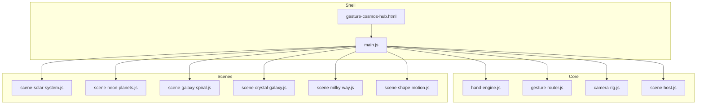

**Diagram sources**
- [gesture-cosmos-hub.html:1-283](file://src/science/gesture-cosmos-hub.html#L1-L283)
- [main.js:1-187](file://src/science/gesture-cosmos/main.js#L1-L187)
- [hand-engine.js:1-83](file://src/science/gesture-cosmos/core/hand-engine.js#L1-L83)
- [gesture-router.js:1-111](file://src/science/gesture-cosmos/core/gesture-router.js#L1-L111)
- [camera-rig.js:1-61](file://src/science/gesture-cosmos/core/camera-rig.js#L1-L61)
- [scene-host.js:1-63](file://src/science/gesture-cosmos/core/scene-host.js#L1-L63)
- [scene-solar-system.js:1-439](file://src/science/gesture-cosmos/scenes/scene-solar-system.js#L1-L439)
- [scene-neon-planets.js:1-340](file://src/science/gesture-cosmos/scenes/scene-neon-planets.js#L1-L340)
- [scene-galaxy-spiral.js:1-338](file://src/science/gesture-cosmos/scenes/scene-galaxy-spiral.js#L1-L338)
- [scene-crystal-galaxy.js:1-290](file://src/science/gesture-cosmos/scenes/scene-crystal-galaxy.js#L1-L290)
- [scene-milky-way.js:1-295](file://src/science/gesture-cosmos/scenes/scene-milky-way.js#L1-L295)
- [scene-shape-motion.js:1-318](file://src/science/gesture-cosmos/scenes/scene-shape-motion.js#L1-L318)

**Section sources**
- [gesture-cosmos-hub.html:1-283](file://src/science/gesture-cosmos-hub.html#L1-L283)
- [main.js:1-187](file://src/science/gesture-cosmos/main.js#L1-L187)

## Core Components
- HandEngine: Wraps MediaPipe Hands and Camera utilities; initializes after user gesture and streams landmark results.
- GestureRouter: Translates raw landmarks into unified commands including depth-based scaling, rotation, and fist state with hysteresis.
- CameraRig: Provides OrbitControls-driven camera behavior and overview/focus helpers; gestures primarily drive scene objects rather than camera movement.
- SceneHost: Manages scene registration, initialization, update, and disposal; resets camera to overview on switch.
- Scenes: Six self-contained modules implementing init(ctx), update(dt, cmd), and dispose(), each applying shared gesture control where appropriate.

Key responsibilities:
- Shared context (scene, camera, renderer, textureLoader, cameraRig, handEngine, gestureRouter) passed to each scene
- Dynamic import of scene modules on first use
- Centralized render loop driving gesture processing, camera updates, and scene updates

**Section sources**
- [hand-engine.js:1-83](file://src/science/gesture-cosmos/core/hand-engine.js#L1-L83)
- [gesture-router.js:1-111](file://src/science/gesture-cosmos/core/gesture-router.js#L1-L111)
- [camera-rig.js:1-61](file://src/science/gesture-cosmos/core/camera-rig.js#L1-L61)
- [scene-host.js:1-63](file://src/science/gesture-cosmos/core/scene-host.js#L1-L63)
- [main.js:1-187](file://src/science/gesture-cosmos/main.js#L1-L187)

## Architecture Overview
The hub composes a single render loop that processes hand results, applies camera updates, and delegates per-frame logic to the active scene. Navigation uses top bar buttons to dynamically load and switch scenes.

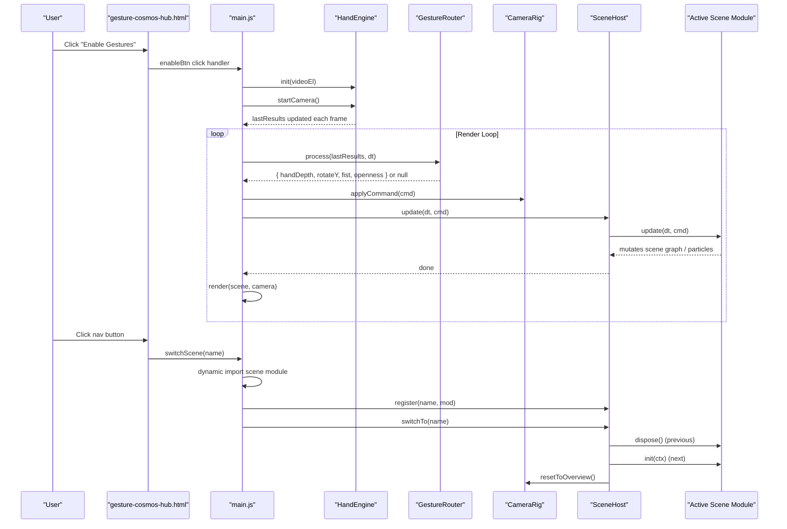

**Diagram sources**
- [gesture-cosmos-hub.html:240-283](file://src/science/gesture-cosmos-hub.html#L240-L283)
- [main.js:75-187](file://src/science/gesture-cosmos/main.js#L75-L187)
- [hand-engine.js:21-71](file://src/science/gesture-cosmos/core/hand-engine.js#L21-L71)
- [gesture-router.js:34-111](file://src/science/gesture-cosmos/core/gesture-router.js#L34-L111)
- [camera-rig.js:10-61](file://src/science/gesture-cosmos/core/camera-rig.js#L10-L61)
- [scene-host.js:31-62](file://src/science/gesture-cosmos/core/scene-host.js#L31-L62)
- [scene-solar-system.js:268-439](file://src/science/gesture-cosmos/scenes/scene-solar-system.js#L268-L439)

## Detailed Component Analysis

### HandEngine (MediaPipe Integration)
- Initializes MediaPipe Hands with locateFile pointing to CDN assets
- Configures max hands, model complexity, and confidence thresholds
- Streams results via onResults callback and exposes lastResults for downstream consumers
- Starts/stops camera feed safely with error propagation

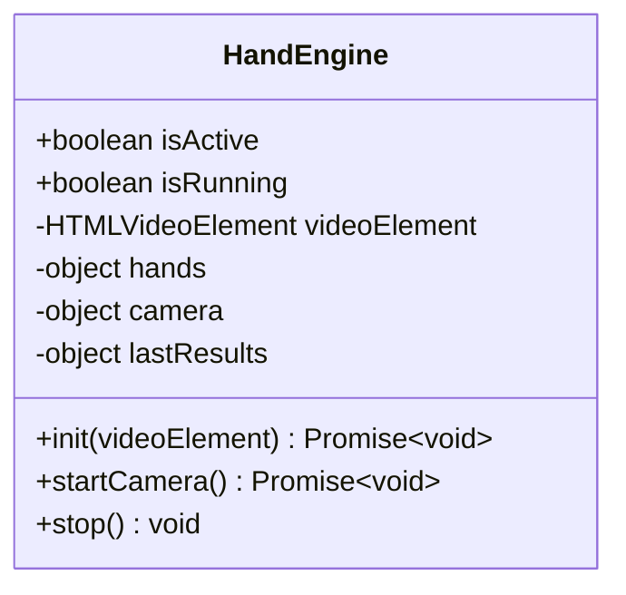

**Diagram sources**
- [hand-engine.js:1-83](file://src/science/gesture-cosmos/core/hand-engine.js#L1-L83)

**Section sources**
- [hand-engine.js:1-83](file://src/science/gesture-cosmos/core/hand-engine.js#L1-L83)

### GestureRouter (Unified Command Mapping)
- Computes openness from fingertip distances to wrist
- Debounces fist activation/deactivation using timers and thresholds
- Derives handDepth from apparent hand size (inverted mapping)
- Calculates Y-axis rotation delta from palm X movement when open
- Emits normalized command object or null when no hand detected

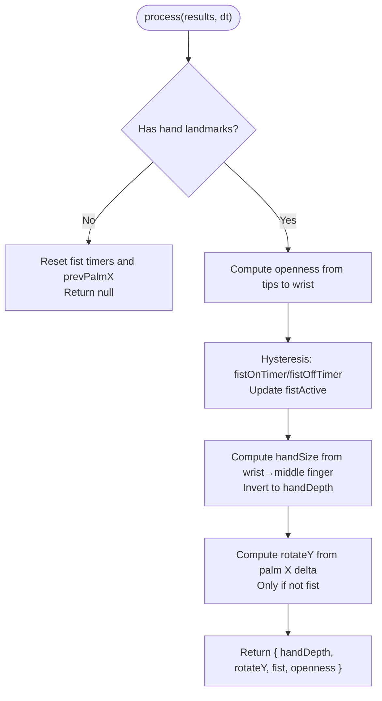

**Diagram sources**
- [gesture-router.js:34-111](file://src/science/gesture-cosmos/core/gesture-router.js#L34-L111)

**Section sources**
- [gesture-router.js:1-111](file://src/science/gesture-cosmos/core/gesture-router.js#L1-L111)

### CameraRig (Orbit Controls Wrapper)
- Uses OrbitControls for mouse/touch orbit and zoom
- Provides focusOn(position, offsetRadius) for targeted views
- Provides resetToOverview(radius, phi, theta) for consistent entry points
- applyCommand currently ticks OrbitControls; gesture-driven camera movement is intentionally minimal to keep gestures focused on scene content

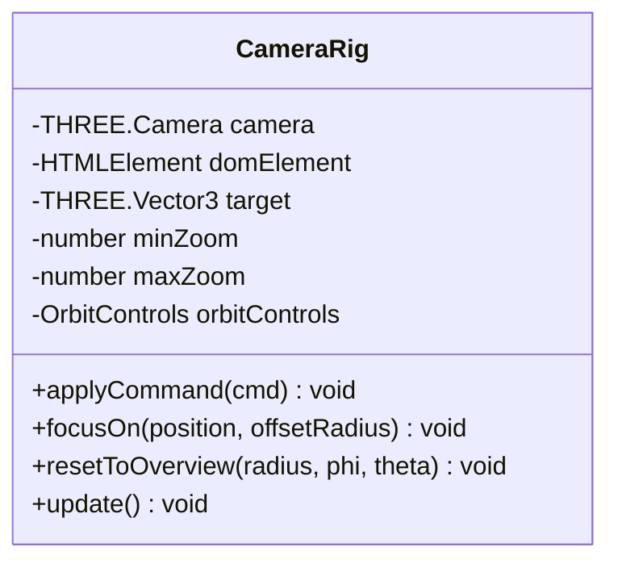

**Diagram sources**
- [camera-rig.js:1-61](file://src/science/gesture-cosmos/core/camera-rig.js#L1-L61)

**Section sources**
- [camera-rig.js:1-61](file://src/science/gesture-cosmos/core/camera-rig.js#L1-L61)

### SceneHost (Lifecycle Manager)
- Maintains registry of scene modules and current instance
- setContext(ctx) injects shared resources into scenes
- switchTo(name) disposes previous scene, initializes next, and resets camera to overview
- update(dt, cmd) forwards per-frame updates to the active scene

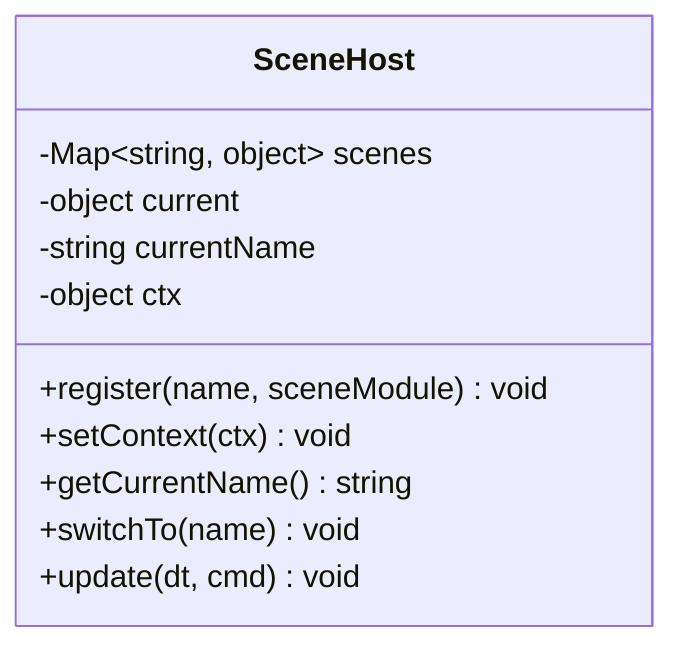

**Diagram sources**
- [scene-host.js:1-63](file://src/science/gesture-cosmos/core/scene-host.js#L1-L63)

**Section sources**
- [scene-host.js:1-63](file://src/science/gesture-cosmos/core/scene-host.js#L1-L63)

### Solar System Scene
- Builds sun, planets, moons, Saturn ring, and orbit lines
- Applies shared gesture control to root group for uniform scale/rotation
- Provides UI buttons to focus on celestial bodies via cameraRig.focusOn
- Disposes textures, geometries, materials, and DOM elements on exit

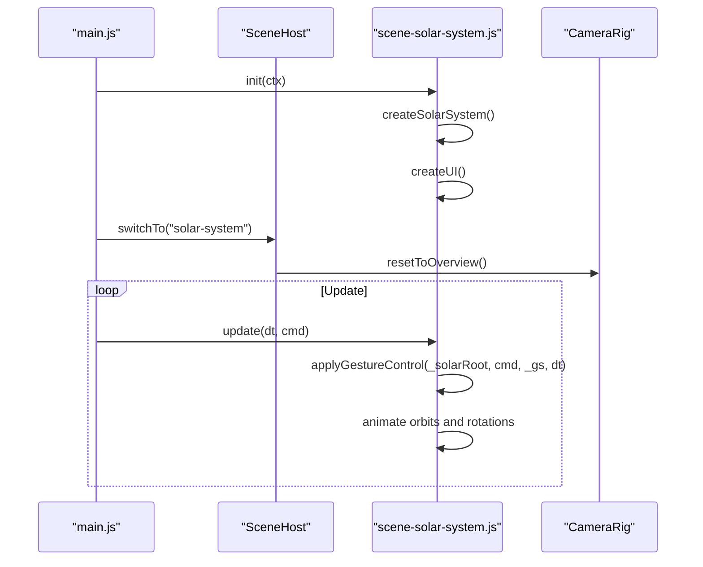

**Diagram sources**
- [main.js:75-187](file://src/science/gesture-cosmos/main.js#L75-L187)
- [scene-host.js:31-62](file://src/science/gesture-cosmos/core/scene-host.js#L31-L62)
- [scene-solar-system.js:268-439](file://src/science/gesture-cosmos/scenes/scene-solar-system.js#L268-L439)
- [camera-rig.js:37-55](file://src/science/gesture-cosmos/core/camera-rig.js#L37-L55)

**Section sources**
- [scene-solar-system.js:1-439](file://src/science/gesture-cosmos/scenes/scene-solar-system.js#L1-L439)

### Neon Planets Scene
- Generates particle-based glowing planets with configurable types (star, rock, gas, ring)
- Supports fist-triggered explosion effect by lerping particle positions toward precomputed offsets
- Uses additive blending and glow textures for visual richness
- Disposes tracked geometries/materials/textures on switch

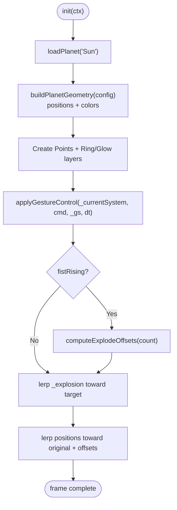

**Diagram sources**
- [scene-neon-planets.js:239-340](file://src/science/gesture-cosmos/scenes/scene-neon-planets.js#L239-L340)

**Section sources**
- [scene-neon-planets.js:1-340](file://src/science/gesture-cosmos/scenes/scene-neon-planets.js#L1-L340)

### Galaxy Spiral Scene
- Generates spiral galaxy particle systems with multiple presets
- Displays status indicators for gesture vs mouse control and FPS
- Applies shared gesture control to the particle system group

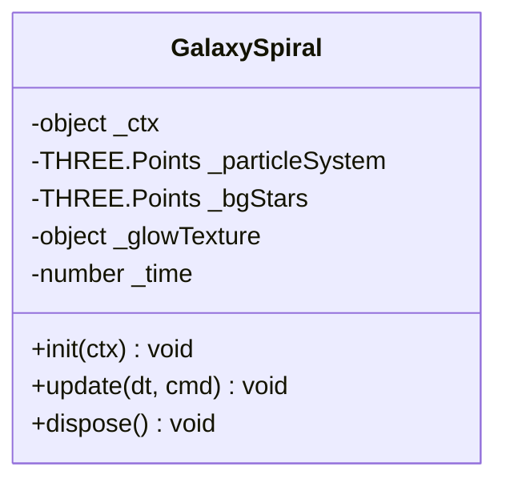

**Diagram sources**
- [scene-galaxy-spiral.js:1-338](file://src/science/gesture-cosmos/scenes/scene-galaxy-spiral.js#L1-L338)

**Section sources**
- [scene-galaxy-spiral.js:1-338](file://src/science/gesture-cosmos/scenes/scene-galaxy-spiral.js#L1-L338)

### Crystal Galaxy Scene
- Creates sharp particle textures and shader-based point rendering
- Supports multiple galaxy configurations with varying arms, spin, and color schemes
- Applies shared gesture control and auto-rotation

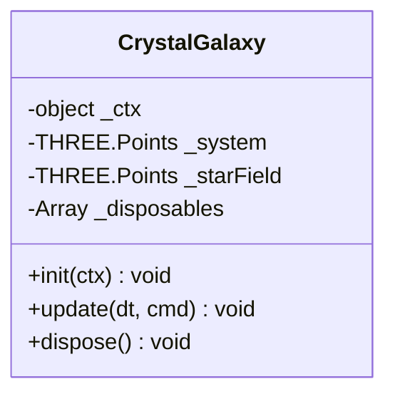

**Diagram sources**
- [scene-crystal-galaxy.js:1-290](file://src/science/gesture-cosmos/scenes/scene-crystal-galaxy.js#L1-L290)

**Section sources**
- [scene-crystal-galaxy.js:1-290](file://src/science/gesture-cosmos/scenes/scene-crystal-galaxy.js#L1-L290)

### Milky Way Scene
- Realistic Milky Way particle generation with bar structure and multi-arm distribution
- Shader-based point sizing and fragment discard for performance
- Applies shared gesture control and auto-rotation

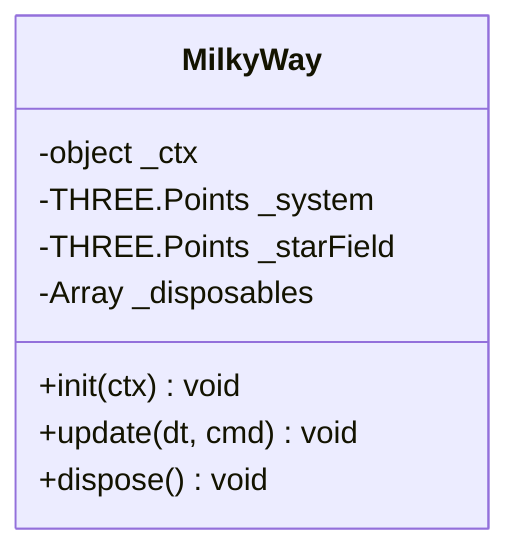

**Diagram sources**
- [scene-milky-way.js:1-295](file://src/science/gesture-cosmos/scenes/scene-milky-way.js#L1-L295)

**Section sources**
- [scene-milky-way.js:1-295](file://src/science/gesture-cosmos/scenes/scene-milky-way.js#L1-L295)

### Shape Motion Scene
- Morphing particle shapes (heart, sphere, flower, saturn, helix, galaxy)
- Precomputes stable explosion offsets on fist rising edge; reconstructs on release
- Optional auto-color cycling and gentle breathing animation

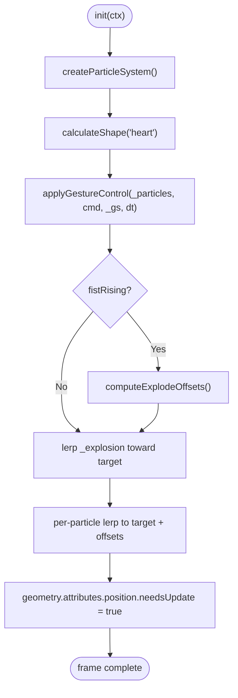

**Diagram sources**
- [scene-shape-motion.js:176-318](file://src/science/gesture-cosmos/scenes/scene-shape-motion.js#L176-L318)

**Section sources**
- [scene-shape-motion.js:1-318](file://src/science/gesture-cosmos/scenes/scene-shape-motion.js#L1-L318)

## Dependency Analysis
The hub’s dependency graph centers around main.js orchestrating core services and dynamically importing scene modules.

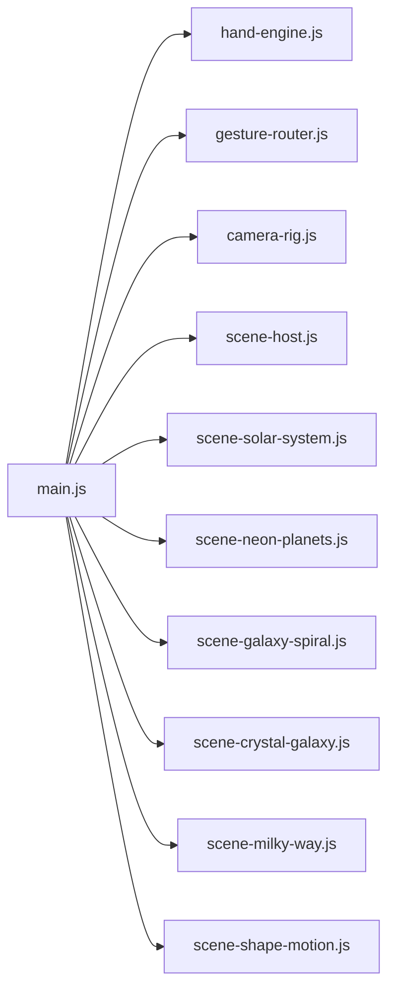

**Diagram sources**
- [main.js:1-187](file://src/science/gesture-cosmos/main.js#L1-L187)

**Section sources**
- [main.js:1-187](file://src/science/gesture-cosmos/main.js#L1-L187)

## Performance Considerations
- Dynamic imports: Scene modules are loaded on first switch to reduce initial payload and memory footprint.
- Pixel ratio capping: Renderer pixel ratio is capped to balance clarity and GPU usage.
- Geometry/material/texture disposal: Each scene tracks disposables and removes them on dispose to prevent leaks.
- Particle optimizations: Additive blending, depthWrite disabled, and efficient buffer updates minimize overdraw and CPU overhead.
- Background stars: Lightweight point clouds provide ambient depth without heavy computation.
- Delta time clamping: Prevents large jumps in animations on tab switches or frame drops.

[No sources needed since this section provides general guidance]

## Troubleshooting Guide
Common issues and resolutions:
- MediaPipe not loaded: Ensure script tags for camera_utils and hands are present; check console errors and toast messages.
- Camera permission denied: Fallback to mouse OrbitControls; ensure user initiated “Enable Gestures” click.
- Scene initialization failure: Switch reverts to previous scene; inspect console logs for specific errors.
- Texture load failures: Scenes fall back to colored materials; verify network access to CDN URLs.
- Mobile device constraints: Camera requires user gesture; ensure viewport meta tag and responsive styles are applied.

**Section sources**
- [gesture-cosmos-hub.html:240-283](file://src/science/gesture-cosmos-hub.html#L240-L283)
- [main.js:116-137](file://src/science/gesture-cosmos/main.js#L116-L137)

## Conclusion
Gesture Cosmos Hub delivers a cohesive, gesture-enabled 3D exploration experience across six richly detailed cosmic scenes. Its architecture separates concerns cleanly between core services and scene implementations, enabling maintainable extensions and robust performance through careful resource management. The design supports educational environments with accessible navigation, clear feedback, and graceful degradation when hardware or permissions limit gesture capabilities.

[No sources needed since this section summarizes without analyzing specific files]

## Appendices

### Registering a New Scene
Steps to add a new scene:
- Create a new module under scenes/ exporting name, init(ctx), update(dt, cmd), and dispose().
- In main.js, add an entry to sceneModules mapping the scene key to a dynamic import function.
- Add a corresponding nav button in the HTML shell with data-scene matching the key.
- Implement init to construct scene objects and UI; implement dispose to clean up all tracked resources.

**Section sources**
- [main.js:14-22](file://src/science/gesture-cosmos/main.js#L14-L22)
- [gesture-cosmos-hub.html:253-260](file://src/science/gesture-cosmos-hub.html#L253-L260)

### Implementing Gesture Commands
Use the shared gesture-control utilities:
- Create a gesture state object with createGestureState() at module scope or inside init().
- In update(dt, cmd), call applyGestureControl(rootGroup, cmd, gs, dt) to handle scale and rotation.
- Optionally react to gs.fistRising and gs.fistFalling for effects like explosions or reconstructions.

**Section sources**
- [scene-solar-system.js:362-366](file://src/science/gesture-cosmos/scenes/scene-solar-system.js#L362-L366)
- [scene-neon-planets.js:261-265](file://src/science/gesture-cosmos/scenes/scene-neon-planets.js#L261-L265)
- [scene-shape-motion.js:190-201](file://src/science/gesture-cosmos/scenes/scene-shape-motion.js#L190-L201)

### Creating Interactive 3D Educational Experiences
- Use cameraRig.focusOn(position, offsetRadius) to guide attention to specific objects.
- Provide UI buttons for quick navigation within scenes (e.g., focusing planets).
- Display HUD text and status indicators to inform users about controls and performance metrics.
- Leverage particle systems and shaders for engaging visuals while monitoring performance budgets.

**Section sources**
- [scene-solar-system.js:348-353](file://src/science/gesture-cosmos/scenes/scene-solar-system.js#L348-L353)
- [scene-galaxy-spiral.js:279-309](file://src/science/gesture-cosmos/scenes/scene-galaxy-spiral.js#L279-L309)

### Browser Compatibility and Mobile Optimization
- Viewport meta tag prevents unwanted scaling and ensures touch interactions behave correctly.
- Responsive CSS wraps the nav bar on narrow screens and adjusts button sizes.
- MediaPipe requires HTTPS and user-initiated gestures; gracefully degrade to mouse/touch controls when unavailable.
- Cap pixel ratio and avoid excessive geometry counts on mobile devices.

**Section sources**
- [gesture-cosmos-hub.html:4-11](file://src/science/gesture-cosmos-hub.html#L4-L11)
- [gesture-cosmos-hub.html:273-278](file://src/science/gesture-cosmos-hub.html#L273-L278)
- [main.js:40-43](file://src/science/gesture-cosmos/main.js#L40-L43)

### Accessibility Features
- Keyboard-accessible PYP Map link with visible focus outlines.
- High-contrast UI elements and readable typography for HUD and controls.
- Clear status indicators and toasts communicate system state and errors.

**Section sources**
- [gesture-cosmos-hub.html:268-272](file://src/science/gesture-cosmos-hub.html#L268-L272)