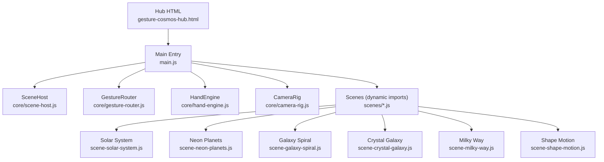
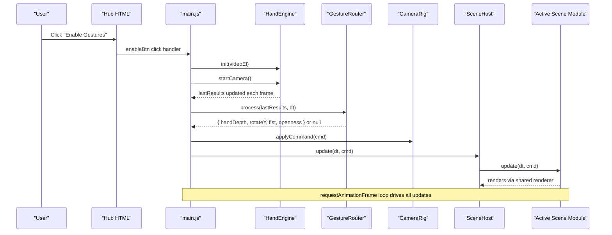
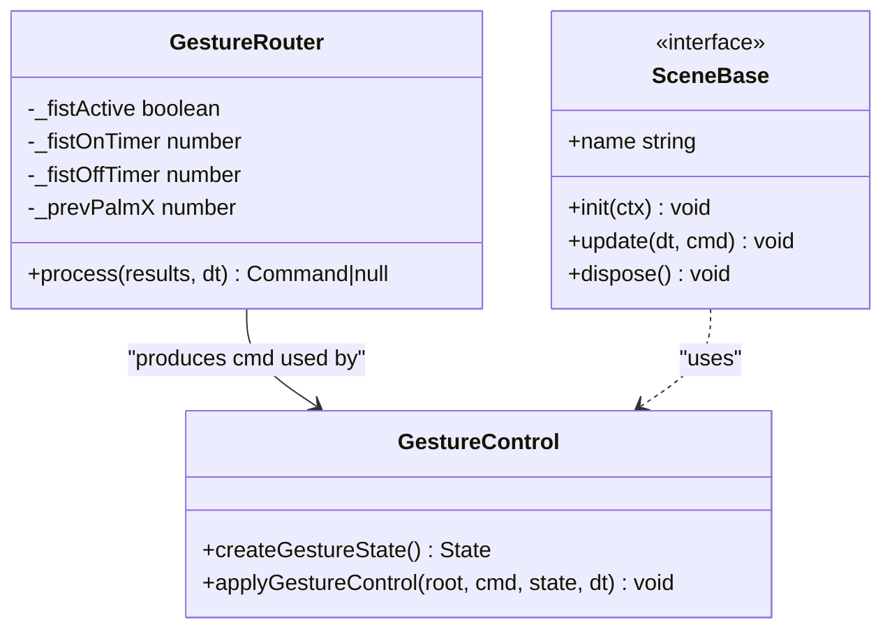
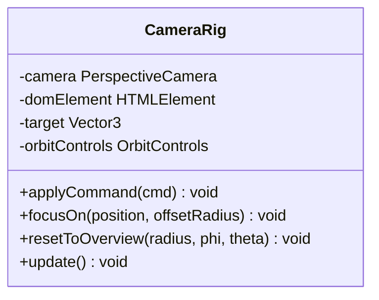
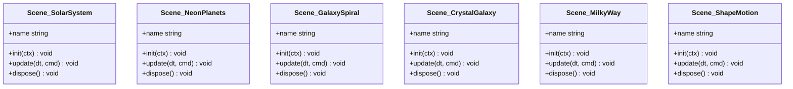
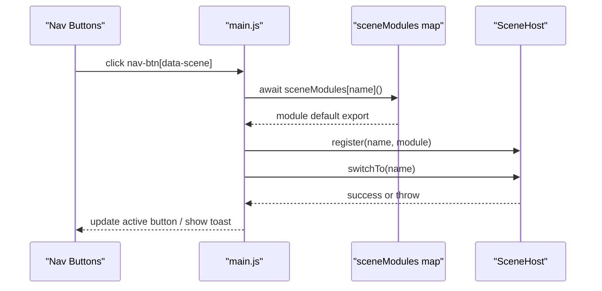
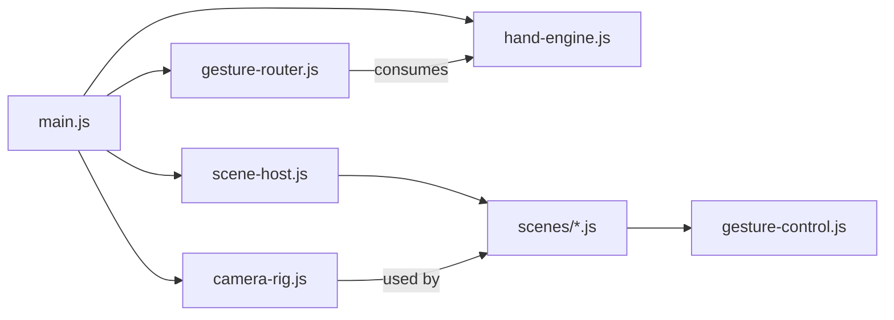

# Scene Architecture & Management

<cite>
**Referenced Files in This Document**
- [gesture-cosmos-hub.html](file://src/science/gesture-cosmos-hub.html)
- [main.js](file://src/science/gesture-cosmos/main.js)
- [scene-host.js](file://src/science/gesture-cosmos/core/scene-host.js)
- [gesture-router.js](file://src/science/gesture-cosmos/core/gesture-router.js)
- [hand-engine.js](file://src/science/gesture-cosmos/core/hand-engine.js)
- [camera-rig.js](file://src/science/gesture-cosmos/core/camera-rig.js)
- [gesture-control.js](file://src/science/gesture-cosmos/core/gesture-control.js)
- [scene-solar-system.js](file://src/science/gesture-cosmos/scenes/scene-solar-system.js)
- [scene-neon-planets.js](file://src/science/gesture-cosmos/scenes/scene-neon-planets.js)
- [scene-galaxy-spiral.js](file://src/science/gesture-cosmos/scenes/scene-galaxy-spiral.js)
- [scene-crystal-galaxy.js](file://src/science/gesture-cosmos/scenes/scene-crystal-galaxy.js)
- [scene-milky-way.js](file://src/science/gesture-cosmos/scenes/scene-milky-way.js)
- [scene-shape-motion.js](file://src/science/gesture-cosmos/scenes/scene-shape-motion.js)
</cite>

## Table of Contents
1. [Introduction](#introduction)
2. [Project Structure](#project-structure)
3. [Core Components](#core-components)
4. [Architecture Overview](#architecture-overview)
5. [Detailed Component Analysis](#detailed-component-analysis)
6. [Dependency Analysis](#dependency-analysis)
7. [Performance Considerations](#performance-considerations)
8. [Troubleshooting Guide](#troubleshooting-guide)
9. [Conclusion](#conclusion)
10. [Appendices](#appendices)

## Introduction
This document explains the Three.js-based scene architecture and management system that orchestrates six cosmic environments. It covers:
- The scene host pattern for registration, lifecycle, and switching
- Gesture-driven control pipeline from camera permission to object manipulation
- Memory optimization strategies (lazy loading, resource tracking, disposal)
- Performance monitoring considerations and resource cleanup processes
- How to register new scenes, implement scene-specific controls, and manage complex 3D assets efficiently
- Browser compatibility, mobile device optimization, and accessibility features for educational environments

## Project Structure
The gesture cosmos application is organized around a hub HTML page that bootstraps shared Three.js objects and core modules, then dynamically loads one of six scene modules on demand. Each scene implements a consistent interface with init, update, and dispose methods.



**Diagram sources**
- [gesture-cosmos-hub.html:240-282](file://src/science/gesture-cosmos-hub.html#L240-L282)
- [main.js:1-187](file://src/science/gesture-cosmos/main.js#L1-L187)
- [scene-host.js:1-63](file://src/science/gesture-cosmos/core/scene-host.js#L1-L63)
- [gesture-router.js:1-111](file://src/science/gesture-cosmos/core/gesture-router.js#L1-L111)
- [hand-engine.js:1-83](file://src/science/gesture-cosmos/core/hand-engine.js#L1-L83)
- [camera-rig.js:1-61](file://src/science/gesture-cosmos/core/camera-rig.js#L1-L61)
- [scene-solar-system.js:1-439](file://src/science/gesture-cosmos/scenes/scene-solar-system.js#L1-L439)
- [scene-neon-planets.js:1-340](file://src/science/gesture-cosmos/scenes/scene-neon-planets.js#L1-L340)
- [scene-galaxy-spiral.js:1-338](file://src/science/gesture-cosmos/scenes/scene-galaxy-spiral.js#L1-L338)
- [scene-crystal-galaxy.js:1-290](file://src/science/gesture-cosmos/scenes/scene-crystal-galaxy.js#L1-L290)
- [scene-milky-way.js:1-295](file://src/science/gesture-cosmos/scenes/scene-milky-way.js#L1-L295)
- [scene-shape-motion.js:1-318](file://src/science/gesture-cosmos/scenes/scene-shape-motion.js#L1-L318)

**Section sources**
- [gesture-cosmos-hub.html:240-282](file://src/science/gesture-cosmos-hub.html#L240-L282)
- [main.js:1-187](file://src/science/gesture-cosmos/main.js#L1-L187)

## Core Components
- SceneHost: Manages scene registration, context injection, switching, lifecycle calls (init/update/dispose), and safe error handling.
- GestureRouter: Translates MediaPipe hand landmarks into normalized commands (scale via depth, rotation via palm slide, fist state).
- HandEngine: Wraps MediaPipe Hands/Camera utilities; initializes after user gesture and streams results each frame.
- CameraRig: Provides mouse/touch orbit controls and camera reset/focus helpers; gestures do not move the camera directly.
- GestureControl: Shared utility for applying unified scale/rotation and fist edge detection to any Object3D root.
- Scenes: Six scene modules implementing { name, init(ctx), update(dt, cmd), dispose() } with robust resource tracking and disposal.

Key responsibilities:
- Centralized context sharing across scenes (renderer, camera, textureLoader, cameraRig, handEngine, gestureRouter)
- Lazy dynamic import of scene modules to reduce initial load
- Consistent lifecycle hooks for predictable memory behavior
- Unified gesture semantics applied per-scene

**Section sources**
- [scene-host.js:1-63](file://src/science/gesture-cosmos/core/scene-host.js#L1-L63)
- [gesture-router.js:1-111](file://src/science/gesture-cosmos/core/gesture-router.js#L1-L111)
- [hand-engine.js:1-83](file://src/science/gesture-cosmos/core/hand-engine.js#L1-L83)
- [camera-rig.js:1-61](file://src/science/gesture-cosmos/core/camera-rig.js#L1-L61)
- [gesture-control.js:1-88](file://src/science/gesture-cosmos/core/gesture-control.js#L1-L88)

## Architecture Overview
The runtime flow connects UI interactions, gesture processing, and scene updates within a single render loop.



**Diagram sources**
- [gesture-cosmos-hub.html:248-266](file://src/science/gesture-cosmos-hub.html#L248-L266)
- [main.js:116-187](file://src/science/gesture-cosmos/main.js#L116-L187)
- [hand-engine.js:21-71](file://src/science/gesture-cosmos/core/hand-engine.js#L21-L71)
- [gesture-router.js:34-111](file://src/science/gesture-cosmos/core/gesture-router.js#L34-L111)
- [camera-rig.js:30-32](file://src/science/gesture-cosmos/core/camera-rig.js#L30-L32)
- [scene-host.js:57-61](file://src/science/gesture-cosmos/core/scene-host.js#L57-L61)

## Detailed Component Analysis

### Scene Host Lifecycle and Switching
The SceneHost maintains a registry of scene modules and ensures proper disposal before initialization of the next scene. It also resets the camera overview after successful initialization to provide a consistent starting view.

```mermaid
flowchart TD
Start([switchTo(name)]) --> CheckExists{"Module registered?"}
CheckExists -- No --> ThrowErr["Throw 'Scene not found'"]
CheckExists -- Yes --> DisposePrev{"Has previous scene with dispose?"}
DisposePrev -- Yes --> TryDispose["try current.dispose()"]
DisposePrev -- No --> InitNext["Set current and name"]
TryDispose --> InitNext
InitNext --> TryInit["try current.init(ctx)"]
TryInit -- Error --> ResetState["Reset current/name and rethrow"]
TryInit -- Success --> ResetCam["cameraRig.resetToOverview()"]
ResetCam --> End([Ready])
```

**Diagram sources**
- [scene-host.js:31-55](file://src/science/gesture-cosmos/core/scene-host.js#L31-L55)

**Section sources**
- [scene-host.js:1-63](file://src/science/gesture-cosmos/core/scene-host.js#L1-L63)

### Gesture Pipeline and Control Semantics
GestureRouter computes normalized commands based on hand landmarks. These commands are consumed by scenes through the shared gesture-control utility, which applies smooth scaling and rotation while detecting fist rising/falling edges for effects like particle explosions.



**Diagram sources**
- [gesture-router.js:22-111](file://src/science/gesture-cosmos/core/gesture-router.js#L22-L111)
- [gesture-control.js:24-88](file://src/science/gesture-cosmos/core/gesture-control.js#L24-L88)

**Section sources**
- [gesture-router.js:1-111](file://src/science/gesture-cosmos/core/gesture-router.js#L1-L111)
- [gesture-control.js:1-88](file://src/science/gesture-cosmos/core/gesture-control.js#L1-L88)

### Camera Rig and Interaction Model
CameraRig encapsulates OrbitControls for mouse/touch navigation. Gestures intentionally do not move the camera; they affect scene objects. The rig provides focus and overview helpers used by scenes and the host.



**Diagram sources**
- [camera-rig.js:10-61](file://src/science/gesture-cosmos/core/camera-rig.js#L10-L61)

**Section sources**
- [camera-rig.js:1-61](file://src/science/gesture-cosmos/core/camera-rig.js#L1-L61)

### Scene Modules: Patterns and Resource Management
Each scene module follows a uniform contract and manages its own resources:
- Exports name and lifecycle functions
- Tracks disposables (geometries, materials, textures) and removable nodes
- Disposes and removes DOM overlays during cleanup
- Applies gesture control to a root group or mesh

Examples:
- Solar System: Builds hierarchical groups for planets/moons, uses textures and lights, exposes UI buttons to focus on bodies.
- Neon Planets: Particle-based glowing spheres with optional rings and glow halos; supports fist-triggered explosion effect.
- Galaxy Spirals / Crystal Galaxy / Milky Way: Large particle systems with custom shaders and background starfields; careful disposal of geometries/materials/textures.
- Shape Motion: Morphing particle shapes with precomputed explosion offsets and smooth reconstruction.



**Diagram sources**
- [scene-solar-system.js:1-439](file://src/science/gesture-cosmos/scenes/scene-solar-system.js#L1-L439)
- [scene-neon-planets.js:1-340](file://src/science/gesture-cosmos/scenes/scene-neon-planets.js#L1-L340)
- [scene-galaxy-spiral.js:1-338](file://src/science/gesture-cosmos/scenes/scene-galaxy-spiral.js#L1-L338)
- [scene-crystal-galaxy.js:1-290](file://src/science/gesture-cosmos/scenes/scene-crystal-galaxy.js#L1-L290)
- [scene-milky-way.js:1-295](file://src/science/gesture-cosmos/scenes/scene-milky-way.js#L1-L295)
- [scene-shape-motion.js:1-318](file://src/science/gesture-cosmos/scenes/scene-shape-motion.js#L1-L318)

**Section sources**
- [scene-solar-system.js:1-439](file://src/science/gesture-cosmos/scenes/scene-solar-system.js#L1-L439)
- [scene-neon-planets.js:1-340](file://src/science/gesture-cosmos/scenes/scene-neon-planets.js#L1-L340)
- [scene-galaxy-spiral.js:1-338](file://src/science/gesture-cosmos/scenes/scene-galaxy-spiral.js#L1-L338)
- [scene-crystal-galaxy.js:1-290](file://src/science/gesture-cosmos/scenes/scene-crystal-galaxy.js#L1-L290)
- [scene-milky-way.js:1-295](file://src/science/gesture-cosmos/scenes/scene-milky-way.js#L1-L295)
- [scene-shape-motion.js:1-318](file://src/science/gesture-cosmos/scenes/scene-shape-motion.js#L1-L318)

### Scene Registration and Dynamic Loading
The hub maps scene identifiers to dynamic import functions. On first switch, the module is loaded and registered with SceneHost; subsequent switches reuse the cached module. Errors during load or initialization are caught and surfaced via toast notifications.



**Diagram sources**
- [main.js:78-114](file://src/science/gesture-cosmos/main.js#L78-L114)
- [scene-host.js:19-55](file://src/science/gesture-cosmos/core/scene-host.js#L19-L55)

**Section sources**
- [main.js:14-109](file://src/science/gesture-cosmos/main.js#L14-L109)
- [scene-host.js:19-55](file://src/science/gesture-cosmos/core/scene-host.js#L19-L55)

## Dependency Analysis
High-level dependencies between core modules and scenes:



**Diagram sources**
- [main.js:8-64](file://src/science/gesture-cosmos/main.js#L8-L64)
- [scene-host.js:1-63](file://src/science/gesture-cosmos/core/scene-host.js#L1-L63)
- [gesture-router.js:1-111](file://src/science/gesture-cosmos/core/gesture-router.js#L1-L111)
- [hand-engine.js:1-83](file://src/science/gesture-cosmos/core/hand-engine.js#L1-L83)
- [camera-rig.js:1-61](file://src/science/gesture-cosmos/core/camera-rig.js#L1-L61)
- [gesture-control.js:1-88](file://src/science/gesture-cosmos/core/gesture-control.js#L1-L88)
- [scene-solar-system.js:1-20](file://src/science/gesture-cosmos/scenes/scene-solar-system.js#L1-L20)
- [scene-neon-planets.js:1-20](file://src/science/gesture-cosmos/scenes/scene-neon-planets.js#L1-L20)
- [scene-galaxy-spiral.js:1-20](file://src/science/gesture-cosmos/scenes/scene-galaxy-spiral.js#L1-L20)
- [scene-crystal-galaxy.js:1-20](file://src/science/gesture-cosmos/scenes/scene-crystal-galaxy.js#L1-L20)
- [scene-milky-way.js:1-20](file://src/science/gesture-cosmos/scenes/scene-milky-way.js#L1-L20)
- [scene-shape-motion.js:1-20](file://src/science/gesture-cosmos/scenes/scene-shape-motion.js#L1-L20)

**Section sources**
- [main.js:8-64](file://src/science/gesture-cosmos/main.js#L8-L64)
- [scene-host.js:1-63](file://src/science/gesture-cosmos/core/scene-host.js#L1-L63)
- [gesture-router.js:1-111](file://src/science/gesture-cosmos/core/gesture-router.js#L1-L111)
- [hand-engine.js:1-83](file://src/science/gesture-cosmos/core/hand-engine.js#L1-L83)
- [camera-rig.js:1-61](file://src/science/gesture-cosmos/core/camera-rig.js#L1-L61)
- [gesture-control.js:1-88](file://src/science/gesture-cosmos/core/gesture-control.js#L1-L88)

## Performance Considerations
- Lazy scene loading: Dynamic imports ensure only the selected scene’s code is fetched and executed, reducing initial bundle size and startup time.
- Pixel ratio cap: Renderer pixel ratio is capped to balance visual quality and GPU load on high-DPI devices.
- Background stars: A lightweight point cloud is reused across scenes to avoid heavy per-scene background generation.
- Particle-heavy scenes: Galaxy and shape scenes use large BufferGeometry arrays; ensure disposal on scene exit to prevent memory leaks.
- Texture caching: Shared TextureLoader caches textures; scenes should dispose references when leaving to allow garbage collection if needed.
- Render loop timing: Delta time is clamped to avoid large jumps after tab inactivity.

[No sources needed since this section provides general guidance]

## Troubleshooting Guide
Common issues and resolutions:
- MediaPipe not available: If global Hands/Camera scripts fail to load, HandEngine throws descriptive errors. Ensure CDN links are reachable and CORS allows access.
- Camera permission denied: The hub shows a fallback message and continues with mouse controls. Verify HTTPS context and browser permissions.
- Scene not found: Switching to an unknown name throws an error; verify nav button data-scene values match registered keys.
- Initialization failures: SceneHost catches and logs errors during init; check console for stack traces and ensure required resources (textures, models) are accessible.
- Memory growth: Confirm each scene’s dispose method removes DOM overlays, detaches from scene graph, and disposes geometries/materials/textures.

**Section sources**
- [hand-engine.js:21-71](file://src/science/gesture-cosmos/core/hand-engine.js#L21-L71)
- [main.js:116-130](file://src/science/gesture-cosmos/main.js#L116-L130)
- [scene-host.js:31-55](file://src/science/gesture-cosmos/core/scene-host.js#L31-L55)
- [scene-solar-system.js:406-439](file://src/science/gesture-cosmos/scenes/scene-solar-system.js#L406-L439)
- [scene-neon-planets.js:307-340](file://src/science/gesture-cosmos/scenes/scene-neon-planets.js#L307-L340)
- [scene-galaxy-spiral.js:122-128](file://src/science/gesture-cosmos/scenes/scene-galaxy-spiral.js#L122-L128)
- [scene-crystal-galaxy.js:173-179](file://src/science/gesture-cosmos/scenes/scene-crystal-galaxy.js#L173-L179)
- [scene-milky-way.js:180-186](file://src/science/gesture-cosmos/scenes/scene-milky-way.js#L180-L186)
- [scene-shape-motion.js:152-174](file://src/science/gesture-cosmos/scenes/scene-shape-motion.js#L152-L174)

## Conclusion
The gesture cosmos framework provides a robust, extensible architecture for managing multiple complex 3D scenes with consistent lifecycle management, efficient resource handling, and unified gesture control. By adhering to the scene contract and leveraging lazy loading and disposal patterns, developers can add new environments safely while maintaining performance and stability across devices.

[No sources needed since this section summarizes without analyzing specific files]

## Appendices

### How to Register a New Scene
- Create a new file under scenes/ implementing { name, init(ctx), update(dt, cmd), dispose() }.
- In main.js, add a mapping entry to sceneModules using dynamic import.
- Add a nav button with data-scene matching the exported name.
- Ensure your scene disposes all tracked resources in dispose().

**Section sources**
- [main.js:14-22](file://src/science/gesture-cosmos/main.js#L14-L22)
- [scene-host.js:19-21](file://src/science/gesture-cosmos/core/scene-host.js#L19-L21)
- [gesture-cosmos-hub.html:253-260](file://src/science/gesture-cosmos-hub.html#L253-L260)

### Implementing Scene-Specific Controls
- Use the shared gesture-control utility to apply scale/rotation and detect fist events.
- For interactive elements (e.g., planet buttons), attach DOM event listeners inside init() and remove them in dispose().
- Use cameraRig.focusOn/resetToOverview for camera transitions triggered by UI.

**Section sources**
- [gesture-control.js:24-88](file://src/science/gesture-cosmos/core/gesture-control.js#L24-L88)
- [scene-solar-system.js:302-360](file://src/science/gesture-cosmos/scenes/scene-solar-system.js#L302-L360)
- [camera-rig.js:37-55](file://src/science/gesture-cosmos/core/camera-rig.js#L37-L55)

### Managing Complex 3D Assets Efficiently
- Precompute static data (e.g., explosion offsets) once on fist rising edge.
- Track all geometries, materials, and textures in arrays for batch disposal.
- Remove nodes from the scene graph before disposing to avoid dangling references.
- Reuse shared textures where possible and set scene background/fog appropriately.

**Section sources**
- [scene-neon-planets.js:78-88](file://src/science/gesture-cosmos/scenes/scene-neon-planets.js#L78-L88)
- [scene-shape-motion.js:139-150](file://src/science/gesture-cosmos/scenes/scene-shape-motion.js#L139-L150)
- [scene-crystal-galaxy.js:173-179](file://src/science/gesture-cosmos/scenes/scene-crystal-galaxy.js#L173-L179)
- [scene-milky-way.js:180-186](file://src/science/gesture-cosmos/scenes/scene-milky-way.js#L180-L186)

### Browser Compatibility, Mobile Optimization, and Accessibility
- Browser compatibility:
  - MediaPipe is loaded via CDN script tags; ensure modern browsers support ES modules and WebGL.
  - Fallback to mouse controls if camera access fails.
- Mobile optimization:
  - Viewport meta tag prevents zooming and improves touch UX.
  - Responsive CSS adjusts nav layout for small screens.
  - Pixel ratio capping reduces GPU pressure on high-DPI phones.
- Accessibility:
  - Keyboard-focusable PYP map link with visible focus ring.
  - Semantic labels and aria attributes for navigation and links.
  - High-contrast UI elements and readable typography.

**Section sources**
- [gesture-cosmos-hub.html:1-283](file://src/science/gesture-cosmos-hub.html#L1-L283)
- [main.js:40-43](file://src/science/gesture-cosmos/main.js#L40-L43)
- [main.js:116-130](file://src/science/gesture-cosmos/main.js#L116-L130)