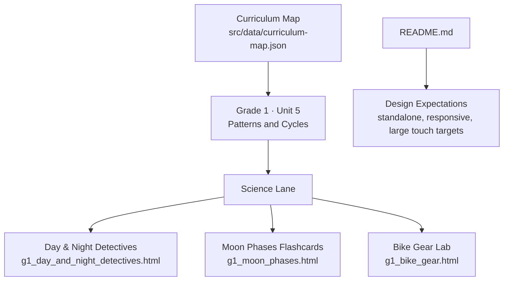
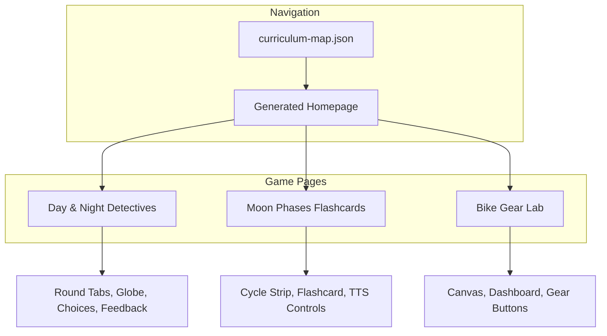
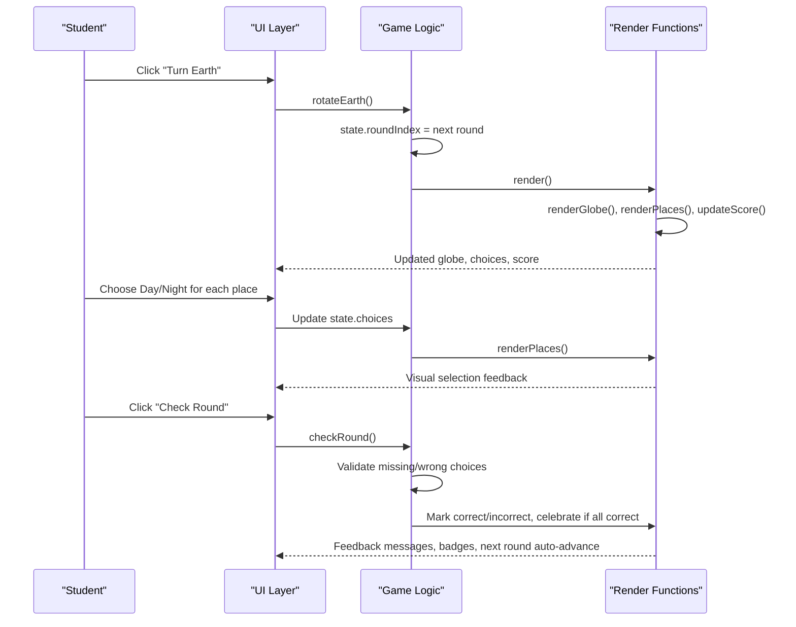
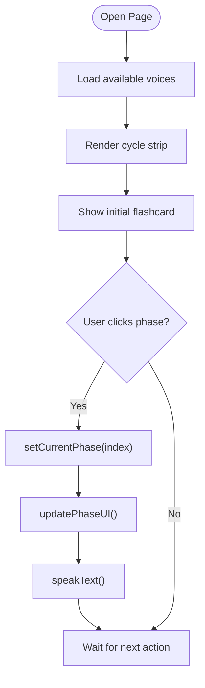
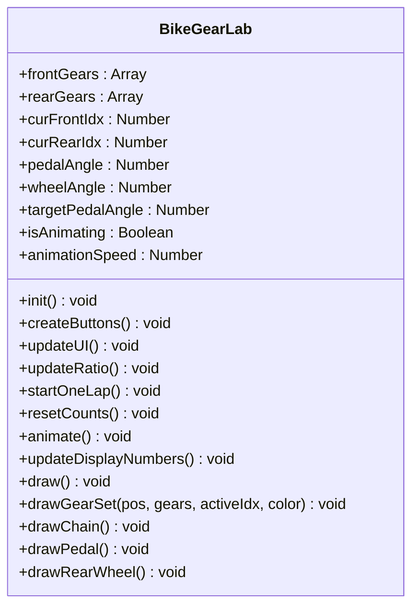
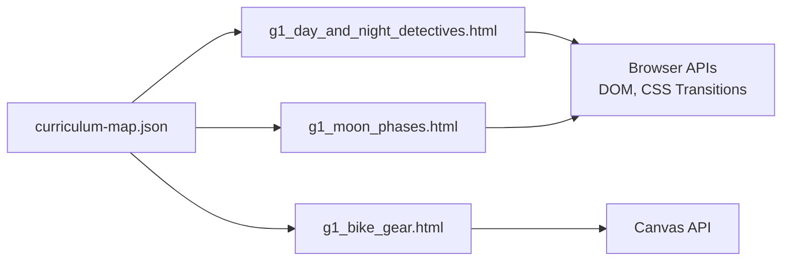

# Individual Science Games

<cite>
**Referenced Files in This Document**
- [g1_day_and_night_detectives.html](file://src/science/g1_day_and_night_detectives.html)
- [g1_moon_phases.html](file://src/science/g1_moon_phases.html)
- [g1_bike_gear.html](file://src/science/g1_bike_gear.html)
- [README.md](file://README.md)
- [curriculum-map.json](file://src/data/curriculum-map.json)
- [grade1-uoi-map.md](file://docs/grade1-uoi-map.md)
</cite>

## Table of Contents
1. [Introduction](#introduction)
2. [Project Structure](#project-structure)
3. [Core Components](#core-components)
4. [Architecture Overview](#architecture-overview)
5. [Detailed Component Analysis](#detailed-component-analysis)
6. [Dependency Analysis](#dependency-analysis)
7. [Performance Considerations](#performance-considerations)
8. [Troubleshooting Guide](#troubleshooting-guide)
9. [Conclusion](#conclusion)
10. [Appendices](#appendices)

## Introduction
This document provides detailed, implementation-focused content for three standalone science games designed for primary education:
- Day & Night Detectives: Earth rotation and time zone concepts
- Moon Phases Flashcards: Lunar cycle understanding
- Bike Gear Lab: Mechanical principles and gear ratios

Each game is a self-contained HTML5 activity with embedded CSS and JavaScript, optimized for touch-friendly interaction on tablets and desktops. The games align to IB PYP Grade 1 Units of Inquiry (UOI), support curriculum integration, and include assessment hooks suitable for classroom use.

## Project Structure
The project organizes games by subject and grade, with a central curriculum map that drives the generated homepage and navigation. Standalone science games live under src/science and are linked from the curriculum map.

**Diagram sources**
- [curriculum-map.json:305-387](file://src/data/curriculum-map.json#L305-L387)
- [README.md:58-65](file://README.md#L58-L65)

**Section sources**
- [README.md:1-65](file://README.md#L1-L65)
- [curriculum-map.json:305-387](file://src/data/curriculum-map.json#L305-L387)
- [grade1-uoi-map.md:1-76](file://docs/grade1-uoi-map.md#L1-L76)

## Core Components
- Day & Night Detectives
  - Concept: Investigate how Earth’s rotation creates day and night across locations.
  - Mechanics: Rotate Earth to different longitudes; choose Day or Night for each city; receive immediate feedback; track progress via badges and score.
  - Educational focus: Longitude-based illumination model, terminator concept, relative position reasoning.
  - Assessment: Round-based correctness tracking, observation prompts, completion badges.

- Moon Phases Flashcards
  - Concept: Explore the eight lunar phases as a repeating natural cycle.
  - Mechanics: Navigate through phases using a strip; read aloud via text-to-speech; visual emphasis on current phase.
  - Educational focus: Phase names, visual patterns, sequence awareness.
  - Assessment: Self-paced exploration; optional teacher-led questioning based on displayed phase descriptions.

- Bike Gear Lab
  - Concept: Discover mechanical advantage and gear ratios through pedal and wheel motion.
  - Mechanics: Select front/rear gears; pedal one revolution; observe wheel rotations; visualize chain and gear sizes.
  - Educational focus: Ratio = front radius / rear radius; cause-and-effect between pedal turns and wheel turns.
  - Assessment: Observational tasks comparing ratios and outcomes; teacher-guided reflection.

**Section sources**
- [g1_day_and_night_detectives.html:764-1083](file://src/science/g1_day_and_night_detectives.html#L764-L1083)
- [g1_moon_phases.html:343-525](file://src/science/g1_moon_phases.html#L343-L525)
- [g1_bike_gear.html:150-443](file://src/science/g1_bike_gear.html#L150-L443)

## Architecture Overview
All three games follow a consistent architecture pattern:
- Single-file HTML5 with embedded CSS and JS
- Responsive layout with large touch targets
- Minimal external dependencies (no heavy frameworks)
- Curriculum mapping via JSON-driven navigation

**Diagram sources**
- [curriculum-map.json:305-387](file://src/data/curriculum-map.json#L305-L387)
- [g1_day_and_night_detectives.html:764-1083](file://src/science/g1_day_and_night_detectives.html#L764-L1083)
- [g1_moon_phases.html:343-525](file://src/science/g1_moon_phases.html#L343-L525)
- [g1_bike_gear.html:150-443](file://src/science/g1_bike_gear.html#L150-L443)

## Detailed Component Analysis

### Day & Night Detectives
Educational goals:
- Understand Earth rotates and causes day/night patterns.
- Relate longitude positions to sunlight exposure.
- Recognize that places experience different times simultaneously.

Implementation highlights:
- Rounds define sun center longitudes; cities have fixed longitudes and latitudes.
- Illumination logic uses angular distance to determine day vs night.
- Globe visualization updates city dot positions and earth texture offset per round.
- Place cards show mini-maps with light-edge overlays reflecting illumination intensity.
- Scoreboard tracks total correct answers across rounds and places.

**Diagram sources**
- [g1_day_and_night_detectives.html:840-1083](file://src/science/g1_day_and_night_detectives.html#L840-L1083)

Key algorithms and data structures:
- Places array includes id, name, location, longitude, latitude, dotX, dotY.
- Rounds array defines sunCenter longitude, fact, prompt.
- State object tracks roundIndex, choices, completed set, correct count.
- Normalization function wraps longitude into [-180, 180].
- Distance calculation determines illumination and answer correctness.
- Earth position mapping converts longitude to background-position percentage.
- Globe positioning maps relative longitude to x/y percentages within the globe.

Complexity considerations:
- Rendering updates are O(n) over places per round.
- Choice validation is O(places × rounds).
- Animations rely on CSS transitions for smooth globe movement.

Accessibility and UX:
- Large buttons and clear labels.
- aria-live regions announce feedback.
- Reduced motion media query respected.

Assessment integration:
- Round-based scoring and badge completion.
- Observation text guides reflective thinking.
- Teacher can ask students to explain why certain cities are day/night.

**Section sources**
- [g1_day_and_night_detectives.html:764-1083](file://src/science/g1_day_and_night_detectives.html#L764-L1083)

### Moon Phases Flashcards
Educational goals:
- Identify and sequence the eight lunar phases.
- Connect visual appearance to phase names.
- Use auditory reinforcement via text-to-speech.

Implementation highlights:
- Phases array contains emoji, name, and short description.
- Cycle strip renders clickable phase buttons with active highlighting.
- Flashcard displays current phase details.
- Text-to-speech reads phase name and description at a slower rate for early readers.
- Star animations provide engaging background without distraction.

**Diagram sources**
- [g1_moon_phases.html:343-525](file://src/science/g1_moon_phases.html#L343-L525)

Data and interactions:
- Phases list defines order and content.
- currentIndex tracks active phase.
- Voice selection prioritizes preferred English voices with fallbacks.
- Speech synthesis parameters tuned for clarity (rate, pitch).

Assessment integration:
- Self-paced exploration supports formative assessment.
- Teachers can prompt students to describe phase changes verbally.
- Optional note-taking or drawing activities after viewing.

Cross-platform compatibility:
- Works on browsers supporting Web Speech API.
- Responsive grid adapts to landscape and portrait orientations.
- Touch-friendly controls sized appropriately.

**Section sources**
- [g1_moon_phases.html:343-525](file://src/science/g1_moon_phases.html#L343-L525)

### Bike Gear Lab
Educational goals:
- Understand gear ratios and their effect on wheel speed.
- Observe cause-and-effect relationships between pedal turns and wheel turns.
- Compare different gear combinations.

Implementation highlights:
- Canvas-based rendering draws gears, chain, pedals, and rear wheel.
- Front and rear gear arrays define radii; ratio computed dynamically.
- Animation loop advances pedal angle and scales wheel angle by ratio.
- Dashboard shows pedal laps, wheel laps, and ratio value.
- Gear selection buttons highlight active gears and update visuals immediately.

**Diagram sources**
- [g1_bike_gear.html:150-443](file://src/science/g1_bike_gear.html#L150-L443)

Physics simulation details:
- Ratio formula: front radius / rear radius.
- Wheel angle increment equals pedal angle increment multiplied by ratio.
- One pedal revolution corresponds to ratio wheel revolutions.
- Visual markers on the rear wheel help learners count rotations.

Interaction flow:
- User selects front and rear gears.
- Pressing pedal triggers animation until targetPedalAngle reached.
- Dashboard updates in real-time during animation.
- Reset clears counts and angles.

Assessment integration:
- Guided tasks: “Which gear combination makes the wheel spin fastest?”
- Predict-observe-explain cycles encourage scientific reasoning.
- Teacher can record observations and discuss findings.

**Section sources**
- [g1_bike_gear.html:150-443](file://src/science/g1_bike_gear.html#L150-L443)

## Dependency Analysis
- All three games are standalone single-file HTML5 applications.
- No external libraries are required beyond browser APIs (Canvas, SpeechSynthesis).
- Curriculum map JSON drives navigation but does not affect runtime behavior of individual games.
- Design expectations emphasize responsiveness, accessibility, and touch-friendliness.

**Diagram sources**
- [curriculum-map.json:305-387](file://src/data/curriculum-map.json#L305-L387)
- [g1_bike_gear.html:150-443](file://src/science/g1_bike_gear.html#L150-L443)

**Section sources**
- [curriculum-map.json:305-387](file://src/data/curriculum-map.json#L305-L387)
- [README.md:58-65](file://README.md#L58-L65)

## Performance Considerations
- Day & Night Detectives: Uses CSS transforms and transitions for smooth globe movement; minimal DOM updates per round.
- Moon Phases Flashcards: Lightweight DOM manipulation; speech synthesis runs only when requested.
- Bike Gear Lab: Canvas redraw per frame during animation; efficient clearing and drawing; avoids heavy computations.

General guidance:
- Keep animations short and avoid excessive reflows.
- Prefer CSS transitions where possible for GPU acceleration.
- Limit number of dynamic elements; reuse nodes when feasible.

[No sources needed since this section provides general guidance]

## Troubleshooting Guide
Common issues and resolutions:
- Speech not playing in Moon Phases Flashcards
  - Ensure browser supports Web Speech API and voices are loaded.
  - Check user gesture requirement for audio playback.
  - Verify voice selection dropdown has options populated.

- Canvas not rendering in Bike Gear Lab
  - Confirm canvas element exists and context is obtained successfully.
  - Check for blocked scripts or console errors.
  - Ensure device supports Canvas API.

- Globe misalignment in Day & Night Detectives
  - Verify longitude normalization and position calculations.
  - Confirm CSS variables for earth-position are updated correctly.
  - Test on reduced-motion settings to ensure functionality remains.

**Section sources**
- [g1_moon_phases.html:343-525](file://src/science/g1_moon_phases.html#L343-L525)
- [g1_bike_gear.html:150-443](file://src/science/g1_bike_gear.html#L150-L443)
- [g1_day_and_night_detectives.html:840-1083](file://src/science/g1_day_and_night_detectives.html#L840-L1083)

## Conclusion
These three science games provide engaging, curriculum-aligned experiences for primary learners:
- Day & Night Detectives builds spatial reasoning about Earth’s rotation and illumination.
- Moon Phases Flashcards reinforces vocabulary and sequencing of lunar cycles with multimodal input.
- Bike Gear Lab introduces mechanical principles through interactive simulation.

They are designed for classroom deployment with clear assessment hooks, cross-platform compatibility, and adherence to design expectations for young learners.

[No sources needed since this section summarizes without analyzing specific files]

## Appendices

### Curriculum Alignment
- Day & Night Detectives and Moon Phases Flashcards are mapped to Grade 1, Unit 5 (Patterns and Cycles) under Science.
- Bike Gear Lab is mapped to Grade 1, Unit 4 (Living Things) under Science.

**Section sources**
- [curriculum-map.json:305-387](file://src/data/curriculum-map.json#L305-L387)
- [curriculum-map.json:278-302](file://src/data/curriculum-map.json#L278-L302)

### Implementation Notes for Creating Standalone Science Games
- Keep each game self-contained with embedded CSS and JS.
- Include viewport meta tag and return link to PYP map.
- Provide large touch targets and responsive layouts.
- Align content to UOI themes and central ideas.
- Integrate simple assessment mechanisms (score, badges, observation prompts).

**Section sources**
- [README.md:58-65](file://README.md#L58-L65)
- [grade1-uoi-map.md:35-46](file://docs/grade1-uoi-map.md#L35-L46)