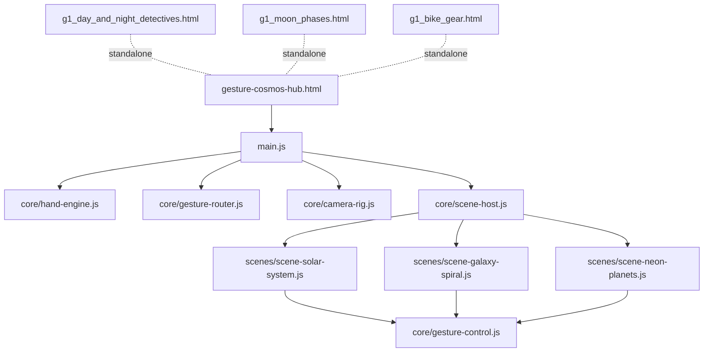
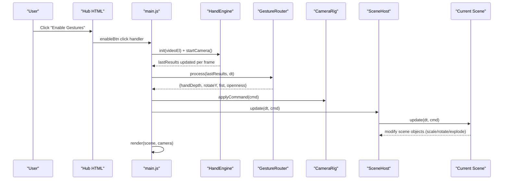
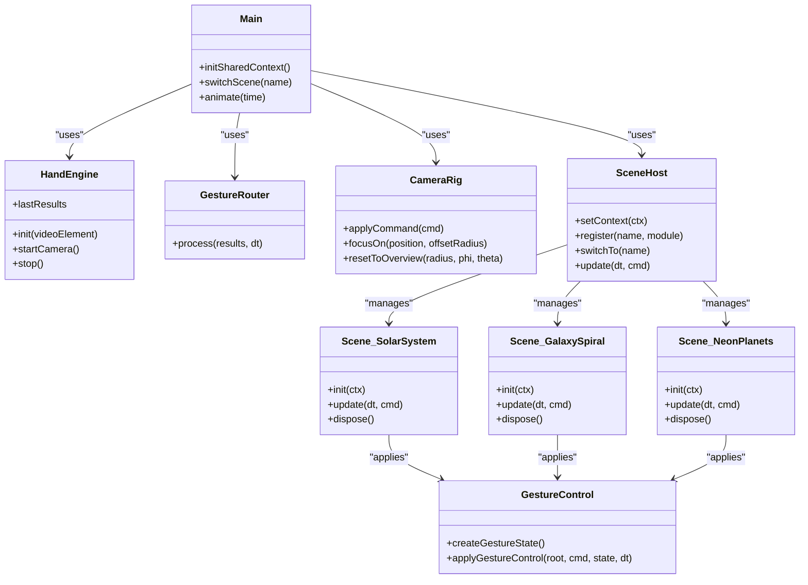

# Science Games & 3D Visualization

<cite>
**Referenced Files in This Document**
- [gesture-cosmos-hub.html](file://src/science/gesture-cosmos-hub.html)
- [main.js](file://src/science/gesture-cosmos/main.js)
- [hand-engine.js](file://src/science/gesture-cosmos/core/hand-engine.js)
- [gesture-router.js](file://src/science/gesture-cosmos/core/gesture-router.js)
- [camera-rig.js](file://src/science/gesture-cosmos/core/camera-rig.js)
- [scene-host.js](file://src/science/gesture-cosmos/core/scene-host.js)
- [gesture-control.js](file://src/science/gesture-cosmos/core/gesture-control.js)
- [scene-solar-system.js](file://src/science/gesture-cosmos/scenes/scene-solar-system.js)
- [scene-galaxy-spiral.js](file://src/science/gesture-cosmos/scenes/scene-galaxy-spiral.js)
- [scene-neon-planets.js](file://src/science/gesture-cosmos/scenes/scene-neon-planets.js)
- [g1_day_and_night_detectives.html](file://src/science/g1_day_and_night_detectives.html)
- [g1_moon_phases.html](file://src/science/g1_moon_phases.html)
- [g1_bike_gear.html](file://src/science/g1_bike_gear.html)
- [README.md](file://README.md)
</cite>

## Table of Contents
1. [Introduction](#introduction)
2. [Project Structure](#project-structure)
3. [Core Components](#core-components)
4. [Architecture Overview](#architecture-overview)
5. [Detailed Component Analysis](#detailed-component-analysis)
6. [Dependency Analysis](#dependency-analysis)
7. [Performance Considerations](#performance-considerations)
8. [Troubleshooting Guide](#troubleshooting-guide)
9. [Conclusion](#conclusion)
10. [Appendices](#appendices)

## Introduction
This document explains the Science Games and 3D Visualization suite with a focus on the Gesture Cosmos Hub, a centerpiece that offers six immersive 3D scenes exploring galaxies, planets, and cosmic phenomena through hand gesture controls. It details the Three.js scene management architecture, camera rig system, and gesture-based interaction patterns. It also documents individual science games including Day & Night Detectives for Earth rotation concepts, Moon Phases visualization for lunar cycles, and Bike Gear Lab for mechanical principles. Finally, it provides implementation guidance for creating new 3D scenes, implementing gesture commands, integrating educational content with interactive visualizations, and addresses accessibility and cross-browser compatibility considerations.

## Project Structure
The project is organized around subject lanes and standalone HTML5 activities. The Gesture Cosmos Hub is implemented as a modular Three.js application under src/science/gesture-cosmos/, with shared core modules and per-scene implementations. Other science games are single-file HTML applications for focused learning experiences.

**Diagram sources**
- [gesture-cosmos-hub.html:1-283](file://src/science/gesture-cosmos-hub.html#L1-L283)
- [main.js:1-187](file://src/science/gesture-cosmos/main.js#L1-L187)
- [hand-engine.js:1-83](file://src/science/gesture-cosmos/core/hand-engine.js#L1-L83)
- [gesture-router.js:1-111](file://src/science/gesture-cosmos/core/gesture-router.js#L1-L111)
- [camera-rig.js:1-61](file://src/science/gesture-cosmos/core/camera-rig.js#L1-L61)
- [scene-host.js:1-63](file://src/science/gesture-cosmos/core/scene-host.js#L1-L63)
- [gesture-control.js:1-88](file://src/science/gesture-cosmos/core/gesture-control.js#L1-L88)
- [scene-solar-system.js:1-439](file://src/science/gesture-cosmos/scenes/scene-solar-system.js#L1-L439)
- [scene-galaxy-spiral.js:1-338](file://src/science/gesture-cosmos/scenes/scene-galaxy-spiral.js#L1-L338)
- [scene-neon-planets.js:1-340](file://src/science/gesture-cosmos/scenes/scene-neon-planets.js#L1-L340)
- [g1_day_and_night_detectives.html:1-1083](file://src/science/g1_day_and_night_detectives.html#L1-L1083)
- [g1_moon_phases.html:1-536](file://src/science/g1_moon_phases.html#L1-L536)
- [g1_bike_gear.html:1-452](file://src/science/g1_bike_gear.html#L1-L452)

**Section sources**
- [README.md:1-65](file://README.md#L1-L65)
- [gesture-cosmos-hub.html:1-283](file://src/science/gesture-cosmos-hub.html#L1-L283)
- [main.js:1-187](file://src/science/gesture-cosmos/main.js#L1-L187)

## Core Components
- Gesture Cosmos Hub (HTML entry): Provides UI overlays, navigation buttons, permission prompts, and imports MediaPipe and Three.js via importmap. It mounts the canvas container and wires the main module.
- Main Entry (main.js): Initializes shared Three.js renderer/scene/camera, instantiates HandEngine, GestureRouter, CameraRig, and SceneHost, registers scene modules dynamically, handles navigation, and runs the render loop.
- Hand Engine (hand-engine.js): Wraps MediaPipe Hands and Camera utilities to start camera capture and deliver landmark results each frame.
- Gesture Router (gesture-router.js): Translates raw landmarks into unified commands: open palm depth → object scale; palm X slide → Y-axis rotation; fist detection → explosion/reconstruction triggers. Includes debouncing and hysteresis.
- Camera Rig (camera-rig.js): Mouse/touch orbit control using OrbitControls. Provides focusOn and resetToOverview helpers. Gestures no longer move the camera directly; they control scene objects.
- Scene Host (scene-host.js): Manages lifecycle of scenes (register, switchTo, update, dispose). Ensures proper cleanup and context passing.
- Gesture Control Utility (gesture-control.js): Shared state machine and applyGestureControl function used by all scenes to implement consistent scale/rotation/fist behaviors.

Key responsibilities:
- Rendering pipeline: main.js orchestrates requestAnimationFrame, updates gesture router, applies camera rig, and delegates to current scene.update(dt, cmd).
- Interaction model: gestures drive object-scale and rotation; mouse/touch drives camera via OrbitControls.
- Scene modularity: each scene exports name, init(ctx), update(dt, cmd), dispose(), enabling hot-swapping and memory-safe transitions.

**Section sources**
- [gesture-cosmos-hub.html:1-283](file://src/science/gesture-cosmos-hub.html#L1-L283)
- [main.js:1-187](file://src/science/gesture-cosmos/main.js#L1-L187)
- [hand-engine.js:1-83](file://src/science/gesture-cosmos/core/hand-engine.js#L1-L83)
- [gesture-router.js:1-111](file://src/science/gesture-cosmos/core/gesture-router.js#L1-L111)
- [camera-rig.js:1-61](file://src/science/gesture-cosmos/core/camera-rig.js#L1-L61)
- [scene-host.js:1-63](file://src/science/gesture-cosmos/core/scene-host.js#L1-L63)
- [gesture-control.js:1-88](file://src/science/gesture-cosmos/core/gesture-control.js#L1-L88)

## Architecture Overview
The Gesture Cosmos Hub composes a shared rendering context with pluggable scenes. Each scene encapsulates its own assets, UI, and animation logic while consuming a common gesture command stream.

**Diagram sources**
- [gesture-cosmos-hub.html:248-280](file://src/science/gesture-cosmos-hub.html#L248-L280)
- [main.js:117-186](file://src/science/gesture-cosmos/main.js#L117-L186)
- [hand-engine.js:21-71](file://src/science/gesture-cosmos/core/hand-engine.js#L21-L71)
- [gesture-router.js:34-109](file://src/science/gesture-cosmos/core/gesture-router.js#L34-L109)
- [camera-rig.js:30-32](file://src/science/gesture-cosmos/core/camera-rig.js#L30-L32)
- [scene-host.js:57-61](file://src/science/gesture-cosmos/core/scene-host.js#L57-L61)

## Detailed Component Analysis

### Gesture Cosmos Hub (Entry and Navigation)
- Loads MediaPipe scripts and Three.js via importmap.
- Renders full-screen canvas and overlays for loading, permissions, nav bar, HUD, and toast messages.
- Wires navigation buttons to dynamic scene loading and activation.
- Handles camera permission flow and fallback messaging when camera is unavailable.

Implementation highlights:
- Dynamic import map for Three.js modules.
- Permission overlay with explicit user gesture to start camera.
- Toast notifications for feedback and error states.
- Responsive nav bar and mobile-friendly touch targets.

**Section sources**
- [gesture-cosmos-hub.html:1-283](file://src/science/gesture-cosmos-hub.html#L1-L283)

### Main Orchestrator (main.js)
- Creates shared THREE.Scene, PerspectiveCamera, WebGLRenderer, and TextureLoader.
- Instantiates core modules and passes a shared context to SceneHost.
- Registers scene modules by name and switches them on demand.
- Runs the render loop: processes gestures, updates camera rig, updates current scene, rotates background stars, and renders.

Key behaviors:
- Graceful error handling during scene load/init with user-facing toasts.
- Window resize handling for camera aspect ratio and renderer size.
- Background star field created once and rotated slowly.

**Section sources**
- [main.js:1-187](file://src/science/gesture-cosmos/main.js#L1-L187)

### Hand Engine (MediaPipe Integration)
- Initializes MediaPipe Hands with locateFile pointing to CDN resources.
- Configures max hands, model complexity, and confidence thresholds.
- Starts Camera utility to feed frames to Hands and exposes lastResults.
- Provides stop() to release camera and close Hands instance.

Error handling:
- Throws descriptive errors if MediaPipe libraries are not loaded or initialization fails.
- Exposes onError callback hook for centralized error reporting.

**Section sources**
- [hand-engine.js:1-83](file://src/science/gesture-cosmos/core/hand-engine.js#L1-L83)

### Gesture Router (Command Generation)
- Computes openness from fingertip-to-wrist distances.
- Debounces fist state with hysteresis to avoid flicker.
- Estimates hand depth from apparent hand size (wrist to middle finger tip).
- Derives Y-axis rotation from palm X movement when open palm is detected.
- Emits a normalized command object per frame or null when no hand is present.

Design notes:
- No camera movement from gestures; camera remains controlled by OrbitControls.
- Command fields: handDepth, rotateY, fist, openness.

**Section sources**
- [gesture-router.js:1-111](file://src/science/gesture-cosmos/core/gesture-router.js#L1-L111)

### Camera Rig (Orbit Controls)
- Wraps OrbitControls with damping and distance limits.
- Provides focusOn(position, offsetRadius) to center camera on a target.
- Provides resetToOverview(radius, phi, theta) to return to default view.
- applyCommand(_cmd) now only ticks OrbitControls; gesture-driven actions are handled by scenes.

**Section sources**
- [camera-rig.js:1-61](file://src/science/gesture-cosmos/core/camera-rig.js#L1-L61)

### Scene Host (Lifecycle Management)
- Maintains a Map of registered scenes and current active scene.
- On switchTo(name): disposes previous scene (if any), initializes next scene with shared ctx, resets camera overview, and catches errors.
- update(dt, cmd) forwards to current scene.update if available.

Memory safety:
- Ensures dispose() is called before switching scenes to prevent leaks.

**Section sources**
- [scene-host.js:1-63](file://src/science/gesture-cosmos/core/scene-host.js#L1-L63)

### Gesture Control Utility (Shared Behavior)
- Defines DEFAULT_SCALE, MIN_SCALE, MAX_SCALE constants.
- createGestureState() returns per-scene state with currentScale, targetScale, fist flags.
- applyGestureControl(root, cmd, state, dt):
  - Maps handDepth to targetScale within bounds.
  - Applies Y rotation from rotateY when not in fist state.
  - Tracks fist rising/falling edges for one-frame triggers.
  - Smoothly lerps currentScale toward targetScale.

Usage pattern:
- Scenes call applyGestureControl on their root group each frame.
- Scenes use fistRising/fistFalling to trigger effects like particle explosions or reconstructions.

**Section sources**
- [gesture-control.js:1-88](file://src/science/gesture-cosmos/core/gesture-control.js#L1-L88)

### Solar System Scene
- Builds a hierarchical solar system with sun, planets, moons, and optional rings.
- Uses textures for bodies and background; sets up lighting and shadows.
- Implements orbit animations and self-rotation.
- Provides UI sidebar to focus camera on celestial bodies and an overview button.
- Integrates gesture control to scale and rotate the entire solar root group.

Memory management:
- Tracks removable objects, disposables (geometry/material), and textures for cleanup.

**Section sources**
- [scene-solar-system.js:1-439](file://src/science/gesture-cosmos/scenes/scene-solar-system.js#L1-L439)

### Spiral Galaxy Scene
- Generates large particle systems representing different galaxy types (Milky Way, Andromeda, Whirlpool, Sombrero, Nebula).
- Uses BufferGeometry with position, color, and size attributes; additive blending for glow effect.
- Provides UI to switch between galaxy presets and status indicators for tracking/FPS.
- Applies shared gesture control to the particle system group.

Performance considerations:
- High particle counts require careful GPU usage; uses efficient buffers and minimal materials.

**Section sources**
- [scene-galaxy-spiral.js:1-338](file://src/science/gesture-cosmos/scenes/scene-galaxy-spiral.js#L1-L338)

### Neon Planets Scene
- Constructs glowing planet models using point clouds with vertex colors and custom glow texture.
- Supports ring particles for Saturn-like visuals and ambient glow halos.
- Implements fist-triggered explosion effect by perturbing positions toward precomputed offsets and smoothly reconstructing.
- Provides UI to select planets and updates HUD title accordingly.

Interaction:
- Fist rising edge computes explodeOffsets once; fist state interpolates explosion intensity.

**Section sources**
- [scene-neon-planets.js:1-340](file://src/science/gesture-cosmos/scenes/scene-neon-planets.js#L1-L340)

### Day & Night Detectives
- Single-file HTML game illustrating Earth’s rotation and day/night across cities.
- Uses CSS-driven globe with animated terminator line and city markers.
- Interactive rounds prompt learners to choose Day/Night for locations based on sunlight/shadow cues.
- Includes score tracking, badges, and accessible labels.

Educational integration:
- Reinforces understanding of Earth’s rotation and time zones through guided investigation.

**Section sources**
- [g1_day_and_night_detectives.html:1-1083](file://src/science/g1_day_and_night_detectives.html#L1-L1083)

### Moon Phases Flashcards
- Single-file HTML activity presenting moon phases with emoji visuals and text descriptions.
- Cycle strip allows quick navigation; TTS reads phase names and explanations aloud.
- Voice selection dropdown supports multiple voices with prioritized auto-selection.

Accessibility:
- aria-labels and live regions enhance screen reader support.
- Large touch targets and responsive layout improve usability.

**Section sources**
- [g1_moon_phases.html:1-536](file://src/science/g1_moon_phases.html#L1-L536)

### Bike Gear Lab
- Canvas-based simulation demonstrating gear ratios and wheel rotations.
- Allows selecting front and rear gears, pedaling one lap, and observing resulting wheel turns.
- Displays real-time stats: pedal laps, wheel laps, and gear ratio.

Mechanical principles:
- Visualizes how larger front gears or smaller rear gears increase wheel rotations per pedal turn.

**Section sources**
- [g1_bike_gear.html:1-452](file://src/science/g1_bike_gear.html#L1-L452)

## Dependency Analysis
The hub composes several modules with clear separation of concerns. Scenes depend on the shared gesture control utility and receive a context containing Three.js primitives and core services.

**Diagram sources**
- [main.js:1-187](file://src/science/gesture-cosmos/main.js#L1-L187)
- [hand-engine.js:1-83](file://src/science/gesture-cosmos/core/hand-engine.js#L1-L83)
- [gesture-router.js:1-111](file://src/science/gesture-cosmos/core/gesture-router.js#L1-L111)
- [camera-rig.js:1-61](file://src/science/gesture-cosmos/core/camera-rig.js#L1-L61)
- [scene-host.js:1-63](file://src/science/gesture-cosmos/core/scene-host.js#L1-L63)
- [gesture-control.js:1-88](file://src/science/gesture-cosmos/core/gesture-control.js#L1-L88)
- [scene-solar-system.js:1-439](file://src/science/gesture-cosmos/scenes/scene-solar-system.js#L1-L439)
- [scene-galaxy-spiral.js:1-338](file://src/science/gesture-cosmos/scenes/scene-galaxy-spiral.js#L1-L338)
- [scene-neon-planets.js:1-340](file://src/science/gesture-cosmos/scenes/scene-neon-planets.js#L1-L340)

**Section sources**
- [main.js:1-187](file://src/science/gesture-cosmos/main.js#L1-L187)
- [scene-host.js:1-63](file://src/science/gesture-cosmos/core/scene-host.js#L1-L63)

## Performance Considerations
- Renderer configuration: antialias enabled; pixel ratio capped at 2 to balance quality and performance on high-DPI devices.
- Background stars: lightweight Points with small size and low opacity; slow rotation avoids heavy updates.
- Particle-heavy scenes:
  - Use BufferGeometry with typed arrays for positions/colors/sizes.
  - Additive blending and transparent materials reduce overdraw cost but still require careful particle counts.
  - Reuse glow textures generated offscreen to avoid repeated allocations.
- Memory management:
  - Track geometries, materials, textures, and lights for disposal in scene.dispose().
  - Remove objects from scene graph before disposing to prevent dangling references.
- Mobile optimization:
  - Reduce particle counts or disable complex effects on low-end devices.
  - Prefer lower shadow map sizes and fewer lights.
  - Limit post-processing and avoid expensive shaders.
- Gesture processing:
  - Keep landmark computations minimal; debounce fist state to reduce false positives.
  - Avoid heavy operations inside the render loop; batch geometry updates where possible.

[No sources needed since this section provides general guidance]

## Troubleshooting Guide
Common issues and resolutions:
- Camera/MediaPipe not available:
  - Ensure user clicked “Enable Gestures” to grant permission.
  - If initialization fails, the app falls back to mouse controls and shows a toast message.
- Scene load/init errors:
  - Check console logs for specific errors; the hub displays toasts indicating which scene failed.
  - Verify dynamic import paths and that scene modules export required functions.
- Memory leaks after switching scenes:
  - Confirm scene.dispose() removes objects from the scene graph and disposes geometries/materials/textures.
- Poor performance on mobile:
  - Reduce particle counts, disable shadows, and lower pixel ratio.
  - Monitor FPS indicator in galaxy scene and adjust parameters accordingly.

**Section sources**
- [main.js:117-130](file://src/science/gesture-cosmos/main.js#L117-L130)
- [main.js:78-109](file://src/science/gesture-cosmos/main.js#L78-L109)
- [scene-solar-system.js:406-439](file://src/science/gesture-cosmos/scenes/scene-solar-system.js#L406-L439)
- [scene-galaxy-spiral.js:311-338](file://src/science/gesture-cosmos/scenes/scene-galaxy-spiral.js#L311-L338)
- [scene-neon-planets.js:307-340](file://src/science/gesture-cosmos/scenes/scene-neon-planets.js#L307-L340)

## Conclusion
The Gesture Cosmos Hub provides a robust, modular framework for interactive scientific exploration. Its architecture cleanly separates rendering, input processing, and scene logic, enabling scalable additions of new 3D environments. The shared gesture control ensures consistent interactions across scenes, while dedicated science games offer focused learning experiences aligned with curriculum goals. With attention to performance and accessibility, the suite supports diverse educational environments across devices and browsers.

[No sources needed since this section summarizes without analyzing specific files]

## Appendices

### Creating a New 3D Scene
Steps:
- Create a new file under src/science/gesture-cosmos/scenes/scene-*.js.
- Export name, init(ctx), update(dt, cmd), dispose().
- In init(ctx), set up scene objects, textures, lights, and UI elements. Store disposables for cleanup.
- In update(dt, cmd), call applyGestureControl(rootGroup, cmd, gs, dt) and animate objects.
- In dispose(), remove objects from scene, dispose geometries/materials/textures, and clean up UI.
- Register the scene in main.js by adding a dynamic import mapping and ensure the nav button exists in the hub HTML.

References:
- [main.js:14-22](file://src/science/gesture-cosmos/main.js#L14-L22)
- [scene-host.js:19-55](file://src/science/gesture-cosmos/core/scene-host.js#L19-L55)
- [gesture-control.js:32-83](file://src/science/gesture-cosmos/core/gesture-control.js#L32-L83)

### Implementing Gesture Commands
Guidelines:
- Use GestureRouter.process() output fields: handDepth, rotateY, fist, openness.
- Apply scale via applyGestureControl; handle fistRising/fistFalling for one-frame effects.
- For complex interactions (e.g., explosion), compute offsets once on fistRising and interpolate during fist state.

References:
- [gesture-router.js:34-109](file://src/science/gesture-cosmos/core/gesture-router.js#L34-L109)
- [gesture-control.js:50-83](file://src/science/gesture-cosmos/core/gesture-control.js#L50-L83)
- [scene-neon-planets.js:277-305](file://src/science/gesture-cosmos/scenes/scene-neon-planets.js#L277-L305)

### Integrating Educational Content
Approaches:
- Embed contextual HUD titles and subtitles describing the scientific concept.
- Provide sidebar controls to explore key entities (e.g., planets, galaxy types).
- Include status indicators (tracking mode, FPS) to inform users about interaction modes.
- Use accessible labels and live regions for screen readers.

References:
- [scene-solar-system.js:302-346](file://src/science/gesture-cosmos/scenes/scene-solar-system.js#L302-L346)
- [scene-galaxy-spiral.js:218-262](file://src/science/gesture-cosmos/scenes/scene-galaxy-spiral.js#L218-L262)
- [g1_moon_phases.html:318-340](file://src/science/g1_moon_phases.html#L318-L340)

### Accessibility and Cross-Browser Compatibility
Recommendations:
- Ensure all interactive elements have sufficient contrast and minimum 44px touch targets.
- Use aria-labels and aria-live regions for dynamic content.
- Respect prefers-reduced-motion to disable animations for sensitive users.
- Test on desktop, iPad landscape, and mobile browsers; verify camera permissions and fallback behavior.

References:
- [g1_day_and_night_detectives.html:679-689](file://src/science/g1_day_and_night_detectives.html#L679-L689)
- [g1_moon_phases.html:318-340](file://src/science/g1_moon_phases.html#L318-L340)
- [README.md:58-65](file://README.md#L58-L65)