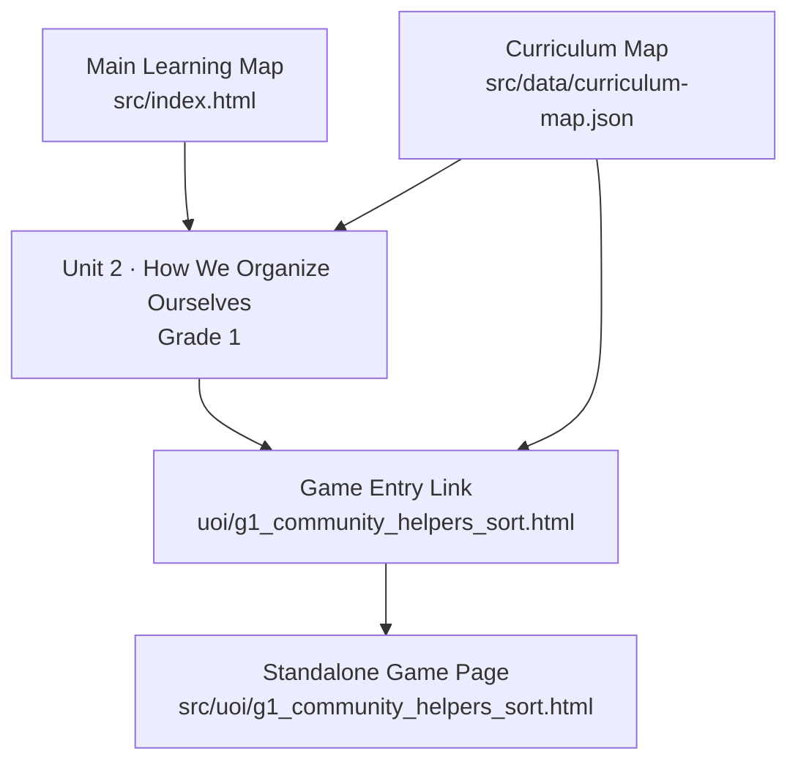
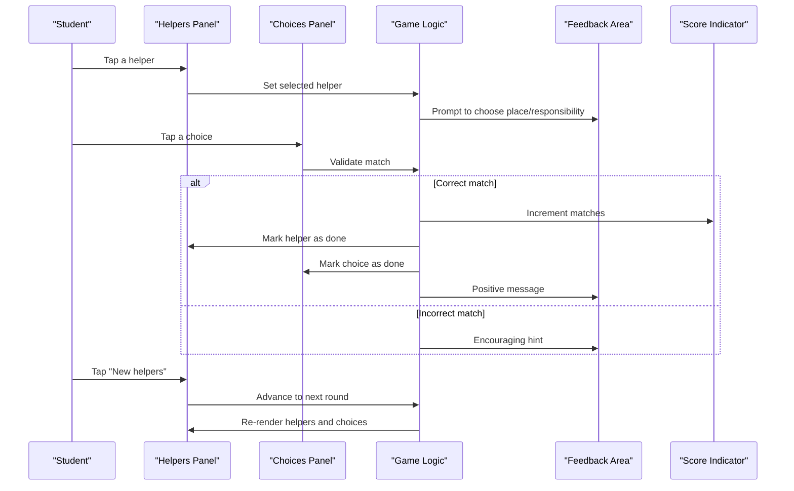
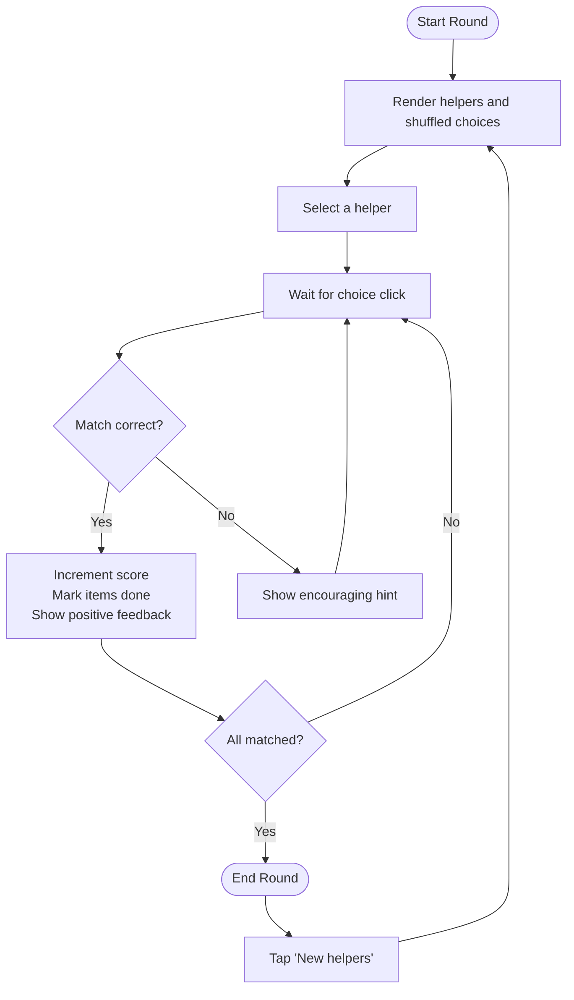
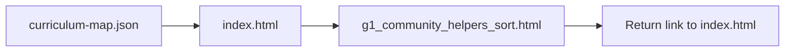

# Community Helpers Sort

<cite>
**Referenced Files in This Document**
- [g1_community_helpers_sort.html](file://src/uoi/g1_community_helpers_sort.html)
- [index.html](file://src/index.html)
- [curriculum-map.json](file://src/data/curriculum-map.json)
- [README.md](file://README.md)
</cite>

## Table of Contents
1. [Introduction](#introduction)
2. [Project Structure](#project-structure)
3. [Core Components](#core-components)
4. [Architecture Overview](#architecture-overview)
5. [Detailed Component Analysis](#detailed-component-analysis)
6. [Dependency Analysis](#dependency-analysis)
7. [Performance Considerations](#performance-considerations)
8. [Troubleshooting Guide](#troubleshooting-guide)
9. [Conclusion](#conclusion)
10. [Appendices](#appendices)

## Introduction
Community Helpers Sort is an interactive, touch-friendly sorting activity designed for Grade 1 learners within the IB Primary Years Programme (PYP). It supports Unit 2: How We Organize Ourselves by helping students recognize community helper roles and understand how different people contribute to society through their responsibilities. The game presents a set of helpers and asks students to match each helper with the place they work and the responsibility they fulfill. Through repeated rounds and immediate feedback, it encourages reflection on interdependence and civic responsibility while reinforcing social studies concepts such as roles, places, and contributions.

## Project Structure
The activity is implemented as a standalone HTML5 page with embedded CSS and JavaScript, following the project’s design expectations for child-facing pages. It is linked from the main PYP learning map and registered in the curriculum map for Grade 1, Unit 2.

**Diagram sources**
- [index.html:583-602](file://src/index.html#L583-L602)
- [curriculum-map.json:120-146](file://src/data/curriculum-map.json#L120-L146)
- [g1_community_helpers_sort.html:1-122](file://src/uoi/g1_community_helpers_sort.html#L1-L122)

**Section sources**
- [index.html:583-602](file://src/index.html#L583-L602)
- [curriculum-map.json:120-146](file://src/data/curriculum-map.json#L120-L146)
- [README.md:20-28](file://README.md#L20-L28)

## Core Components
- Data model: Rounds of helper entries, each containing a helper name, workplace, and responsibility description.
- UI panels:
  - Helpers panel: Displays selectable helper buttons.
  - Choices panel: Displays shuffled options pairing a place with a responsibility.
  - Feedback area: Provides guidance and confirmation messages.
  - Score indicator: Tracks correct matches per session.
- Interaction flow:
  - Select a helper first.
  - Choose a matching place/responsibility option.
  - Receive feedback; if correct, mark both items as completed and update score.
  - Use “New helpers” to cycle to the next round.

Key implementation anchors:
- Rounds data structure and rendering logic
- Selection state management
- Matching validation and feedback updates
- Round cycling via “New helpers” button

**Section sources**
- [g1_community_helpers_sort.html:56-118](file://src/uoi/g1_community_helpers_sort.html#L56-L118)

## Architecture Overview
The activity follows a simple client-side architecture:
- Single-page application with no external dependencies.
- State-driven rendering: DOM elements are regenerated based on current round data.
- Event-driven interactions: Click handlers manage selection, validation, and progression.

**Diagram sources**
- [g1_community_helpers_sort.html:79-117](file://src/uoi/g1_community_helpers_sort.html#L79-L117)

## Detailed Component Analysis

### Sorting Mechanics
- Two-step interaction:
  - Step 1: Select a helper from the left panel.
  - Step 2: Choose a matching place/responsibility pair from the right panel.
- Validation:
  - Compares the selected helper with the chosen option’s helper identifier.
  - On success: increments score, marks both items as completed, provides positive feedback.
  - On failure: prompts student to try another option with supportive language.
- Progression:
  - “New helpers” cycles through predefined rounds, re-shuffling choices each time.

**Diagram sources**
- [g1_community_helpers_sort.html:79-117](file://src/uoi/g1_community_helpers_sort.html#L79-L117)

**Section sources**
- [g1_community_helpers_sort.html:79-117](file://src/uoi/g1_community_helpers_sort.html#L79-L117)

### Visual Design Elements
- Layout:
  - Two-column grid on larger screens; single column on smaller devices.
  - Panels with clear borders and shadows for visual separation.
- Typography and color:
  - High-contrast colors and large fonts suitable for young learners.
  - Distinctive active and completed states using background colors and opacity.
- Touch targets:
  - Buttons sized for easy tapping on tablets and desktops.
- Accessibility cues:
  - Clear headings and descriptive labels for panels.
  - Immediate textual feedback to guide decision-making.

**Section sources**
- [g1_community_helpers_sort.html:7-28](file://src/uoi/g1_community_helpers_sort.html#L7-L28)

### Educational Approach and Social Studies Concepts
- Focus areas:
  - Recognizing community helper roles (e.g., teacher, doctor, firefighter).
  - Understanding where helpers work and what responsibilities they hold.
  - Reflecting on how individual roles support community well-being.
- Pedagogical strategies:
  - Active categorization promotes critical thinking about societal organization.
  - Immediate feedback reinforces correct associations and encourages persistence.
  - Multiple rounds provide spaced practice and variety.
- Alignment with IB PYP:
  - Supports Unit 2: How We Organize Ourselves.
  - Encourages learner profile attributes such as caring and communicator.
  - Develops ATL skills including social and communication skills.

**Section sources**
- [curriculum-map.json:120-146](file://src/data/curriculum-map.json#L120-L146)
- [index.html:583-602](file://src/index.html#L583-L602)

### Promoting Interdependence and Civic Responsibility
- By linking helpers to places and responsibilities, students see how different roles contribute to shared outcomes (learning, health, safety, cleanliness).
- Positive reinforcement (“is part of a caring community”) frames civic participation as valued and meaningful.
- Repeated exposure across rounds builds conceptual understanding of interdependence.

[No sources needed since this section synthesizes educational intent without analyzing specific code lines]

## Dependency Analysis
- Standalone file:
  - No external libraries or assets; all styles and scripts are embedded.
- Navigation:
  - Return link to the main PYP map ensures consistent navigation.
- Curriculum integration:
  - Listed under Grade 1, Unit 2 in the curriculum map.
  - Linked from the generated homepage for Grade 1 Unit 2.

**Diagram sources**
- [curriculum-map.json:120-146](file://src/data/curriculum-map.json#L120-L146)
- [index.html:583-602](file://src/index.html#L583-L602)
- [g1_community_helpers_sort.html:32](file://src/uoi/g1_community_helpers_sort.html#L32)

**Section sources**
- [curriculum-map.json:120-146](file://src/data/curriculum-map.json#L120-L146)
- [index.html:583-602](file://src/index.html#L583-L602)
- [g1_community_helpers_sort.html:32](file://src/uoi/g1_community_helpers_sort.html#L32)

## Performance Considerations
- Lightweight: Single-file HTML with minimal DOM operations.
- Efficient rendering: Rebuilds only necessary sections per round.
- Responsive layout: Uses CSS Grid with media queries for adaptability.
- No network requests: All content is local, ensuring fast load times.

[No sources needed since this section provides general guidance]

## Troubleshooting Guide
- If the page does not render correctly:
  - Ensure viewport meta tag is present and the page is opened in a modern browser.
  - Verify that the return link to the PYP map is accessible.
- If interactions do not respond:
  - Check that event listeners are attached to helper and choice buttons.
  - Confirm that the selected helper state is updated before validating choices.
- If feedback messages are missing:
  - Ensure the feedback element exists and is updated on both correct and incorrect attempts.
- If rounds do not advance:
  - Verify the “New helpers” click handler increments the round index and triggers re-render.

**Section sources**
- [g1_community_helpers_sort.html:79-117](file://src/uoi/g1_community_helpers_sort.html#L79-L117)

## Conclusion
Community Helpers Sort offers a focused, engaging way for Grade 1 learners to explore community roles and responsibilities. Its straightforward mechanics, clear visual design, and immediate feedback align with IB PYP goals for Unit 2, fostering understanding of interdependence and civic responsibility. The activity integrates seamlessly into the broader curriculum map and can be extended with new categories and difficulty levels to deepen inquiry.

[No sources needed since this section summarizes without analyzing specific files]

## Appendices

### Guidance: Adding New Community Helper Categories
- Extend the rounds array with additional helper entries, each containing:
  - Helper name
  - Workplace
  - Responsibility description
- Ensure each entry has a unique helper identifier used for matching.
- Test multiple rounds to confirm shuffling and validation remain consistent.

**Section sources**
- [g1_community_helpers_sort.html:56-69](file://src/uoi/g1_community_helpers_sort.html#L56-L69)

### Guidance: Customizing Difficulty Levels
- Increase complexity by:
  - Adding more helpers per round.
  - Introducing similar responsibilities to encourage careful reading.
  - Limiting hints or providing more nuanced feedback.
- Maintain large touch targets and clear contrast for accessibility.

**Section sources**
- [g1_community_helpers_sort.html:79-117](file://src/uoi/g1_community_helpers_sort.html#L79-L117)

### Integration with Broader Unit of Inquiry Themes
- Align activities with “Who We Are” and “How We Organize Ourselves”:
  - Connect helper roles to personal identity and community belonging.
  - Encourage reflection on how individual actions support collective well-being.
- Cross-link with literacy and math activities that reinforce vocabulary and data interpretation related to community roles.

**Section sources**
- [curriculum-map.json:120-146](file://src/data/curriculum-map.json#L120-L146)
- [index.html:583-602](file://src/index.html#L583-L602)