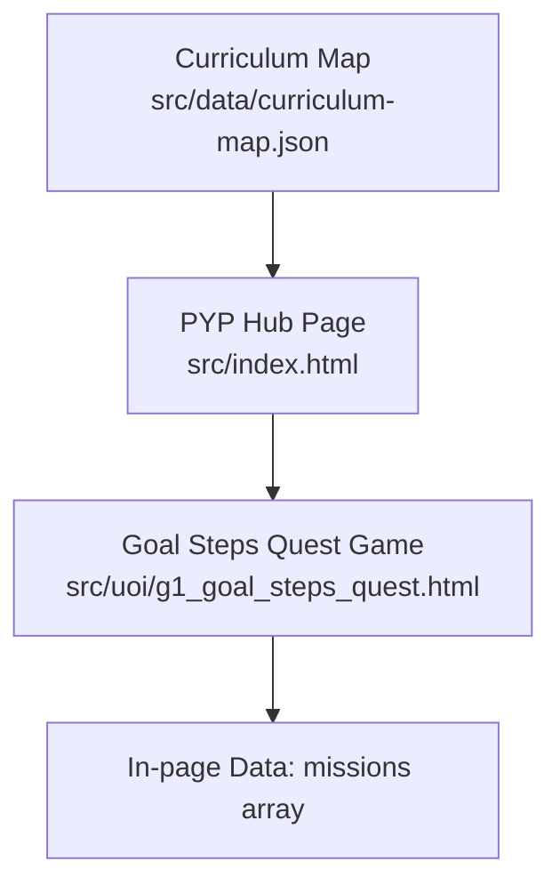
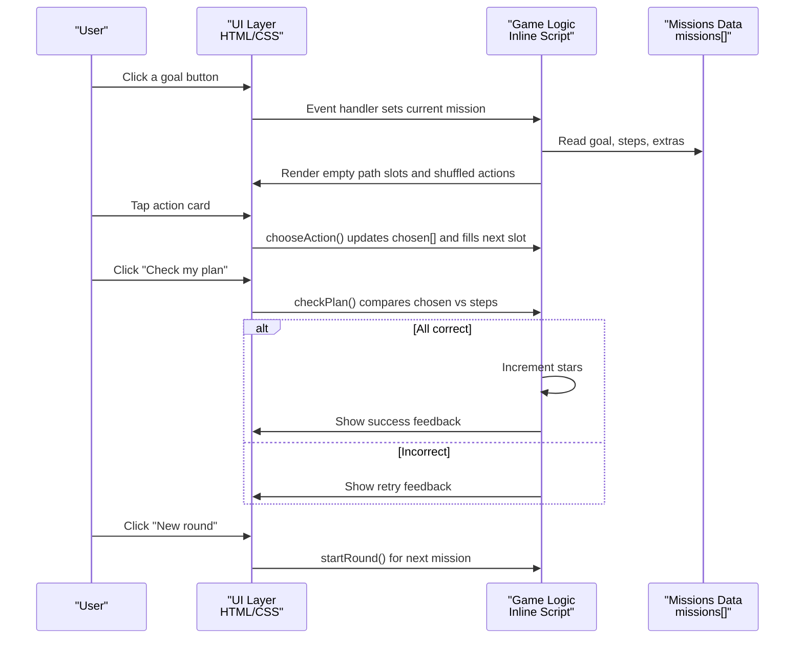
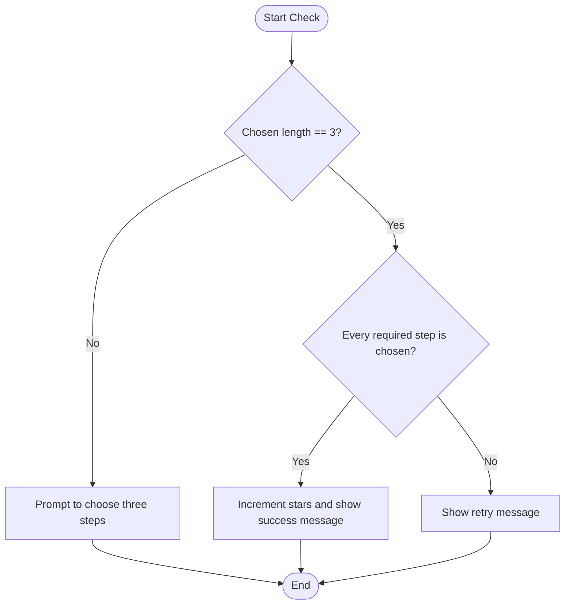
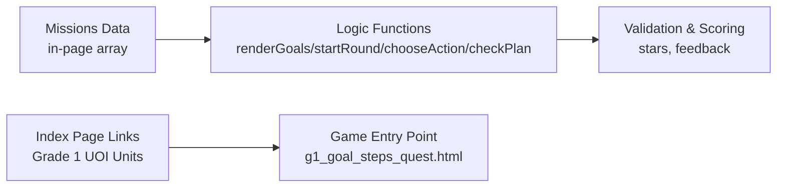

# Goal Steps Quest

<cite>
**Referenced Files in This Document**
- [g1_goal_steps_quest.html](file://src/uoi/g1_goal_steps_quest.html)
- [curriculum-map.json](file://src/data/curriculum-map.json)
- [index.html](file://src/index.html)
- [README.md](file://README.md)
</cite>

## Table of Contents
1. [Introduction](#introduction)
2. [Project Structure](#project-structure)
3. [Core Components](#core-components)
4. [Architecture Overview](#architecture-overview)
5. [Detailed Component Analysis](#detailed-component-analysis)
6. [Dependency Analysis](#dependency-analysis)
7. [Performance Considerations](#performance-considerations)
8. [Troubleshooting Guide](#troubleshooting-guide)
9. [Conclusion](#conclusion)
10. [Appendices](#appendices)

## Introduction
Goal Steps Quest is a self-contained HTML5 activity that helps students practice planning and goal-setting by selecting three appropriate action steps for a given learning objective. The game presents clear goals (for example, reading smoothly or packing a school bag), mixes correct actions with plausible distractors, and guides learners to build a step path. It provides immediate feedback and star scoring to reinforce metacognitive reflection and decision-making aligned with IB PYP transdisciplinary themes such as “Who We Are” and “Where We Are in Place and Time.”

The activity is designed for young learners, emphasizing simplicity, large touch targets, and encouraging feedback. It can be extended easily by adding new missions and customizing difficulty through the number and nature of distractor options.

## Project Structure
Goal Steps Quest is implemented as a single standalone HTML file with embedded CSS and JavaScript. It is integrated into the broader IB PYP Games curriculum map and accessible from the Grade 1 Unit 1 and Unit 6 sections.

**Diagram sources**
- [curriculum-map.json:98-104](file://src/data/curriculum-map.json#L98-L104)
- [index.html:565-570](file://src/index.html#L565-L570)
- [g1_goal_steps_quest.html:101-117](file://src/uoi/g1_goal_steps_quest.html#L101-L117)

**Section sources**
- [g1_goal_steps_quest.html:1-193](file://src/uoi/g1_goal_steps_quest.html#L1-L193)
- [curriculum-map.json:98-104](file://src/data/curriculum-map.json#L98-L104)
- [index.html:565-570](file://src/index.html#L565-L570)

## Core Components
- Mission data model: Each mission defines a goal, a set of correct steps, and a set of extra (incorrect) actions.
- Goal selection interface: Buttons list available goals; clicking one starts a round.
- Step path visualization: Three slots represent the ordered plan; tapping an action fills the next slot.
- Action pool: Correct steps and extras are shuffled and presented as clickable cards.
- Feedback system: Immediate textual feedback and a cumulative star score on success.
- Validation logic: Checks whether the chosen steps exactly match the required correct steps.

Key implementation references:
- Missions data structure and content
- Goal rendering and selection
- Round initialization and action shuffling
- Slot filling and state tracking
- Plan validation and scoring
- Reset behavior

**Section sources**
- [g1_goal_steps_quest.html:101-117](file://src/uoi/g1_goal_steps_quest.html#L101-L117)
- [g1_goal_steps_quest.html:132-142](file://src/uoi/g1_goal_steps_quest.html#L132-L142)
- [g1_goal_steps_quest.html:144-157](file://src/uoi/g1_goal_steps_quest.html#L144-L157)
- [g1_goal_steps_quest.html:159-166](file://src/uoi/g1_goal_steps_quest.html#L159-L166)
- [g1_goal_steps_quest.html:168-182](file://src/uoi/g1_goal_steps_quest.html#L168-L182)
- [g1_goal_steps_quest.html:184-189](file://src/uoi/g1_goal_steps_quest.html#L184-L189)

## Architecture Overview
At runtime, the page initializes the UI, renders goals, and starts the first round. Learners select a goal, then choose three actions from a mixed pool. When they press “Check my plan,” the app validates choices against the mission’s correct steps and updates feedback and stars. “New round” advances to the next mission and resets the board.

**Diagram sources**
- [g1_goal_steps_quest.html:132-142](file://src/uoi/g1_goal_steps_quest.html#L132-L142)
- [g1_goal_steps_quest.html:144-157](file://src/uoi/g1_goal_steps_quest.html#L144-L157)
- [g1_goal_steps_quest.html:159-166](file://src/uoi/g1_goal_steps_quest.html#L159-L166)
- [g1_goal_steps_quest.html:168-182](file://src/uoi/g1_goal_steps_quest.html#L168-L182)
- [g1_goal_steps_quest.html:184-189](file://src/uoi/g1_goal_steps_quest.html#L184-L189)

## Detailed Component Analysis

### Data Model: Missions Array
Each mission object contains:
- goal: A concise learning objective string.
- steps: An array of three correct action strings.
- extras: An array of incorrect action strings used as distractors.

This simple schema supports easy extension by adding new missions or adjusting difficulty via the number and plausibility of extras.

**Section sources**
- [g1_goal_steps_quest.html:101-117](file://src/uoi/g1_goal_steps_quest.html#L101-L117)

### Goal Selection Interface
- Renders buttons for each mission.
- Highlights the active goal.
- On click, sets the current mission index and starts a new round.

Behavioral notes:
- Active state is updated after starting a round to reflect the selected goal.
- The header title updates to show the current goal text.

**Section sources**
- [g1_goal_steps_quest.html:132-142](file://src/uoi/g1_goal_steps_quest.html#L132-L142)
- [g1_goal_steps_quest.html:144-148](file://src/uoi/g1_goal_steps_quest.html#L144-L148)

### Step Path Visualization and Interaction
- Three empty slots labeled Step 1, Step 2, Step 3.
- Tapping an action fills the next empty slot and marks the action as used.
- Prevents overfilling beyond three steps.

Interaction flow:
- User taps action → chosen array grows → corresponding slot receives text and visual fill class.

**Section sources**
- [g1_goal_steps_quest.html:148-156](file://src/uoi/g1_goal_steps_quest.html#L148-L156)
- [g1_goal_steps_quest.html:159-166](file://src/uoi/g1_goal_steps_quest.html#L159-L166)

### Action Pool Generation and Shuffling
- Combines correct steps and extras into one pool.
- Shuffles the pool before rendering so learners cannot guess positions.
- Presents actions as large, readable buttons suitable for touch devices.

Complexity note:
- Shuffling uses a simple random sort; time complexity O(n log n).

**Section sources**
- [g1_goal_steps_quest.html:128-130](file://src/uoi/g1_goal_steps_quest.html#L128-L130)
- [g1_goal_steps_quest.html:149-151](file://src/uoi/g1_goal_steps_quest.html#L149-L151)

### Feedback System and Star Scoring
- Displays contextual feedback messages.
- Increments a global star count when the plan is fully correct.
- Encourages retry when incorrect.

Validation algorithm:
- Requires exactly three chosen steps.
- Checks that every required step appears in the chosen set.

**Diagram sources**
- [g1_goal_steps_quest.html:168-182](file://src/uoi/g1_goal_steps_quest.html#L168-L182)

**Section sources**
- [g1_goal_steps_quest.html:168-182](file://src/uoi/g1_goal_steps_quest.html#L168-L182)

### Reset and Navigation
- “New round” cycles to the next mission index and reinitializes the board.
- Keeps the star total across rounds to encourage continued engagement.

**Section sources**
- [g1_goal_steps_quest.html:184-189](file://src/uoi/g1_goal_steps_quest.html#L184-L189)

### Educational Value and IB PYP Alignment
- Critical thinking and decision-making: Learners evaluate which actions support the stated goal among plausible distractors.
- Metacognition: Planning in three small steps encourages reflection on process and sequencing.
- Transdisciplinary themes:
  - “Who We Are”: Goal setting and personal growth.
  - “Where We Are in Place and Time”: Preparing for transitions and journeys.
- Learner profile and ATL skills: Reflective, Balanced, Self-management Skills, Thinking Skills.

These alignments are reflected in the curriculum map entries for Unit 1 and Unit 6.

**Section sources**
- [curriculum-map.json:80-92](file://src/data/curriculum-map.json#L80-L92)
- [curriculum-map.json:390-402](file://src/data/curriculum-map.json#L390-L402)
- [index.html:555-559](file://src/index.html#L555-L559)
- [index.html:807-811](file://src/index.html#L807-L811)

### Extensibility: Creating New Missions and Customizing Difficulty
To add a new mission:
- Extend the missions array with a new object containing goal, steps (three items), and extras (two or more distractors).
- Ensure steps are distinct and extras are plausible but incorrect.

To customize difficulty:
- Increase the number of extras to raise cognitive load.
- Make extras more similar to correct steps to increase discrimination demand.
- Adjust wording complexity for different age bands.

Integration:
- The game reads missions directly from the in-page array; no additional wiring is needed.
- The activity remains standalone and touch-friendly per project guidelines.

**Section sources**
- [g1_goal_steps_quest.html:101-117](file://src/uoi/g1_goal_steps_quest.html#L101-L117)
- [README.md:58-63](file://README.md#L58-L63)

## Dependency Analysis
Goal Steps Quest has minimal dependencies:
- DOM APIs for element access and event handling.
- In-memory data (missions array) with no external network calls.
- Integrated into the curriculum hub via links in the generated index page.

**Diagram sources**
- [g1_goal_steps_quest.html:101-117](file://src/uoi/g1_goal_steps_quest.html#L101-L117)
- [g1_goal_steps_quest.html:132-189](file://src/uoi/g1_goal_steps_quest.html#L132-L189)
- [index.html:565-570](file://src/index.html#L565-L570)

**Section sources**
- [g1_goal_steps_quest.html:101-189](file://src/uoi/g1_goal_steps_quest.html#L101-L189)
- [index.html:565-570](file://src/index.html#L565-L570)

## Performance Considerations
- Lightweight: Single-file HTML with inline CSS/JS; no heavy libraries.
- Efficient operations: DOM updates are minimal and bounded by three slots and a small action pool.
- Memory usage: Low; only arrays and a few DOM nodes are maintained.
- Accessibility: Large touch targets and clear labels support usability on tablets and desktops.

[No sources needed since this section provides general guidance]

## Troubleshooting Guide
Common issues and resolutions:
- Actions do not fill slots:
  - Ensure the user has not already chosen three steps; the game prevents overfilling.
  - Verify that the action button is not marked as used.
- Feedback always says “Choose three steps first”:
  - Confirm that exactly three actions have been selected before pressing “Check my plan.”
- Stars not increasing:
  - Validate that all required steps are included in the chosen set; order does not matter.
- New round not advancing:
  - Confirm the reset handler increments the mission index modulo the number of missions.

Operational references:
- Slot filling guard and used-state management
- Minimum selection requirement
- Exact-match validation
- Round cycling logic

**Section sources**
- [g1_goal_steps_quest.html:159-166](file://src/uoi/g1_goal_steps_quest.html#L159-L166)
- [g1_goal_steps_quest.html:168-182](file://src/uoi/g1_goal_steps_quest.html#L168-L182)
- [g1_goal_steps_quest.html:184-189](file://src/uoi/g1_goal_steps_quest.html#L184-L189)

## Conclusion
Goal Steps Quest offers a focused, engaging way for young learners to practice planning and goal-setting through interactive missions. Its straightforward mechanics—goal selection, step path building, and immediate feedback—support critical thinking, decision-making, and metacognitive development within IB PYP transdisciplinary contexts. The design is extensible and easy to adapt for diverse learning objectives and difficulty levels while remaining accessible and responsive across devices.

[No sources needed since this section summarizes without analyzing specific files]

## Appendices

### Curriculum Integration Reference
- Grade 1, Unit 1 (“Who We Are”) includes Goal Steps Quest under UOI.
- Grade 1, Unit 6 (“Where We Are in Place and Time”) also lists Goal Steps Quest to connect goal-setting with personal journeys.

**Section sources**
- [curriculum-map.json:98-104](file://src/data/curriculum-map.json#L98-L104)
- [curriculum-map.json:414-420](file://src/data/curriculum-map.json#L414-L420)
- [index.html:565-570](file://src/index.html#L565-L570)
- [index.html:823-828](file://src/index.html#L823-L828)